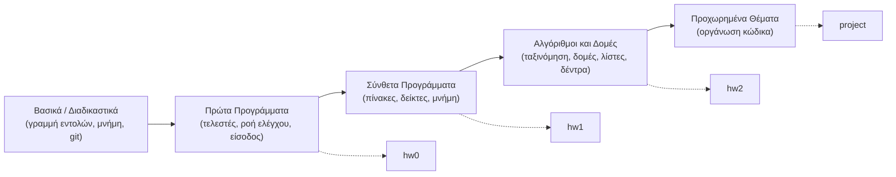
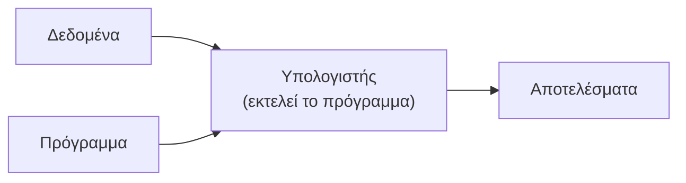
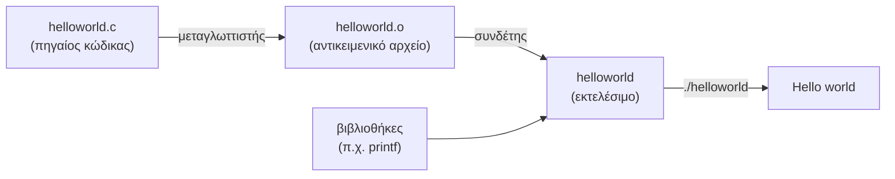
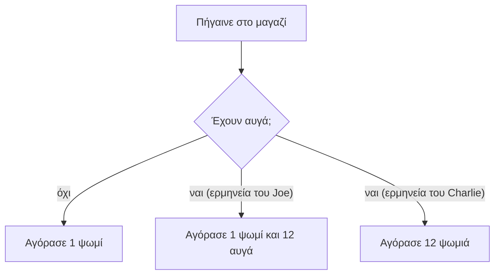

# Κεφάλαιο 0: Καλημέρα Κόσμε!

<!--  -->

> **Στόχοι:** μετά από αυτό το κεφάλαιο θα μπορείτε να
> - βρίσκετε τα εργαλεία του μαθήματος (site, Piazza, eclass, GitHub) και να ξέρετε
>   πού να απευθύνετε μια ερώτηση·
> - περιγράφετε πώς βαθμολογείται το μάθημα και γιατί οι ασκήσεις και το εργαστήριο
>   μετράνε στην πράξη·
> - ορίζετε τι είναι υπολογιστής, προγραμματισμός, πρόγραμμα και γλώσσα
>   προγραμματισμού·
> - εξηγείτε γιατί η ανθρώπινη γλώσσα δεν αρκεί για να δώσουμε εντολές σε έναν
>   υπολογιστή (αμφισημία)·
> - αναφέρετε λόγους για τους οποίους μαθαίνουμε C·
> - διαβάζετε, γραμμή προς γραμμή, το πρόγραμμα Hello World και να το τρέχετε.
>
> **Προαπαιτούμενα:** κανένα, αυτό είναι το πρώτο κεφάλαιο.
>
> **Χρόνος μελέτης:** ~1 ώρα

## Σύνοψη

Η πρώτη διάλεξη του μαθήματος «Εισαγωγή στον Προγραμματισμό» (K04) είναι κυρίως
εισαγωγική: γνωρίζουμε το Τμήμα, τα διαδικαστικά του μαθήματος (ώρες, βαθμολογία,
εργαστήριο, εργαλεία) και τον σκοπό του, που είναι να γίνετε junior software
developers με προοπτικές. Στη συνέχεια θέτουμε τα θεμέλια: τι είναι ένας
υπολογιστής, τι σημαίνει προγραμματισμός και τι είναι ένα πρόγραμμα. Βλέπουμε γιατί
χρειαζόμαστε ειδικές γλώσσες προγραμματισμού (η ανθρώπινη γλώσσα είναι γεμάτη
αμφισημίες) και γιατί το μάθημα διδάσκεται σε C, μια γλώσσα δημοφιλή εδώ και
δεκαετίες και από τις ταχύτερες και οικονομικότερες σε ενέργεια. Κλείνουμε με το
πρώτο μας πρόγραμμα, το κλασικό Hello World.

## Θεωρία

<a id="s0-1"></a><a id="γιατί-προγραμματισμός"></a>

### §0.1 Γιατί προγραμματισμός

Η διάλεξη ξεκινά με το ερώτημα «Γιατί να ασχοληθείς με τον προγραμματισμό το 2025;»
και δίνει τέσσερις ενδεικτικούς λόγους:

- **Ευελιξία**, θεματική και γεωγραφική: ο προγραμματισμός χρειάζεται σε κάθε
  επιστημονικό πεδίο και σε κάθε χώρα.
- **Στην αιχμή των εξελίξεων:** οι μεγάλες τεχνολογικές αλλαγές των τελευταίων
  δεκαετιών (προσωπικοί υπολογιστές, γονιδίωμα, διαδίκτυο) είναι σε μεγάλο βαθμό
  υπολογιστικές, και η πρόοδος επιταχύνεται.
- **Πνευματικά απαιτητική δουλειά:** κάθε πρόγραμμα είναι ένα μικρό πρόβλημα προς
  λύση.
- **Cool.**

Το Τμήμα Πληροφορικής και Τηλεπικοινωνιών του ΕΚΠΑ, σύμφωνα με τις διαφάνειες,
βρίσκεται στα 250 καλύτερα πανεπιστήμια του κόσμου στην Επιστήμη Υπολογιστών (Computer
Science), και το ΕΚΠΑ ήταν το πιο βελτιωμένο πανεπιστήμιο της Ευρώπης και 6ο
παγκοσμίως το 2024-25 σε ποιοτική εκπαίδευση (κατάταξη QS). Πάνω απ' όλα, είναι
ευκαιρία να συναναστραφείτε ιδιαίτερα ταλαντούχους συμφοιτητές.

<a id="s0-2"></a><a id="τα-διαδικαστικά-του-μαθήματος"></a>

### §0.2 Τα διαδικαστικά του μαθήματος

**Site.** Όλο το υλικό (διαφάνειες, ασκήσεις, εργαστήρια) βρίσκεται στο
[progintro.github.io](https://progintro.github.io). Το μάθημα διδάσκεται σε δύο τμήματα (άρτιοι / περιττοί
αριθμοί μητρώου), με διδάσκοντες τον Θανάση Αυγερινό και τον Τάκη Σταματόπουλο· η
ύλη, το εργαστήριο, οι ασκήσεις και το διαγώνισμα είναι ίδια και για τα δύο.

**Ώρες.** Οι διαλέξεις γίνονται Δευτέρα και Παρασκευή 9πμ–11πμ, στο Αμφιθέατρο
(άρτιοι) και στην Α2 (περιττοί). Ώρες γραφείου:

| Ημέρα | Ώρα | Αυγερινός | Σταματόπουλος |
| --- | --- | --- | --- |
| Δευτέρα | 11πμ–12μμ | Α40 | Α48 |
| Παρασκευή | 11πμ–12μμ | Α3 | Α48 |

**Βαθμολογία.** Ο τελικός βαθμός υπολογίζεται ως εξής:

- πρωτοετείς: 50% Τελική Εξέταση + 30% Ασκήσεις + 20% Εργαστήριο·
- όλοι οι υπόλοιποι: 70% Τελική Εξέταση + 30% Ασκήσεις.

Ισχύει και μια **αναπροσαρμογή**: αν ο βαθμός των Ασκήσεων είναι πάνω από 3 μονάδες
μεγαλύτερος από τον βαθμό της Τελικής Εξέτασης, τότε ο βαθμός των Ασκήσεων γίνεται
Τελική Εξέταση + 3. Η Τελική Εξέταση είναι γραπτή με κλειστά βιβλία. Οι Ασκήσεις
(εργασίες για το σπίτι) είναι προαιρετικές, αλλά η επίλυσή τους βοηθάει σημαντικά. Στο
Εργαστήριο η παρουσία είναι υποχρεωτική για τους πρωτοετείς (μέχρι 2 απουσίες).

Μπορεί λοιπόν κανείς να περάσει χωρίς εργασίες και εργαστήριο; «In theory, theory
and practice are the same. In practice, they are not.» Θεωρητικά ναι, στην πράξη όχι:
όπως κανείς δεν μαθαίνει αναρρίχηση διαβάζοντας ένα εγχειρίδιο, έτσι και ο
προγραμματισμός μαθαίνεται μόνο γράφοντας κώδικα.

**Εργαστήριο.** Γίνεται σε εβδομαδιαία βάση και ξεκινά την εβδομάδα της 6ης
Οκτωβρίου. Γράφεστε στην εργαστηριακή ομάδα που σας ταιριάζει μέσω του eclass· αν δεν
βρίσκετε θέση, θα ανοίξουν και άλλες.

**Εργαλεία του μαθήματος.** Χρειάζεστε:

1. προσωπικό λογαριασμό email στο Gmail·
2. προσωπικό λογαριασμό στο GitHub, με ένα «cool αλλά και επαγγελματικό» ψευδώνυμο·
3. τον ακαδημαϊκό σας λογαριασμό, μέσω του [webadm.uoa.gr](http://webadm.uoa.gr)·
4. εγγραφή στο Piazza, το φόρουμ επικοινωνίας του μαθήματος·
5. εγγραφή σε τμήμα εργαστηρίου στο eclass·
6. να συμπληρώσετε τη φόρμα του μαθήματος με τα στοιχεία σας.

Συνιστάται να έχετε υπολογιστή μαζί σας στο μάθημα, για να προγραμματίζετε ζωντανά.

**Έχω μια ερώτηση, τι κάνω;** Η διάλεξη βάζει δύο επιλογές: (Α) στέλνω email στον
Αυγερινό ή στον Τάκη, ή (Β) ελέγχω αν έχει ήδη απαντηθεί στο Piazza και, μόνο αν *δεν*
έχει απαντηθεί, ποστάρω καινούρια ερώτηση. Ο δρόμος του μαθήματος είναι το (Β), αφού
γι' αυτό υπάρχει το Piazza: η απάντηση ωφελεί όλους και δεν επαναλαμβάνεται.

<a id="s0-3"></a><a id="σκοπός-και-περιεχόμενο-του-μαθήματος"></a>

### §0.3 Σκοπός και περιεχόμενο του μαθήματος

Το μάθημα έχει τρεις στόχους:

- εισαγωγή στις βασικές αρχές του προγραμματισμού και στην **αλγοριθμική σκέψη**·
- εμπειρία στη γραφή κώδικα και στην **αποσφαλμάτωση (debugging)** στη γλώσσα C·
- εξοικείωση με τα «εργαλεία της δουλειάς» (γραμμή εντολών, editor, μεταγλωττιστής,
  git).

Με άλλα λόγια, στο τέλος του εξαμήνου θέλουμε να είστε **junior software developers
με προοπτικές**. Η ύλη χωρίζεται σε πέντε ενότητες, με τα εργαστήρια να τρέχουν
παράλληλα και τις εργασίες (hw0, hw1, hw2 και ένα τελικό project) να κλείνουν τις
ενότητες:



*Σχήμα: οι ενότητες του μαθήματος και οι εργασίες που αντιστοιχούν σε καθεμία.*

Στον χάρτη μαθημάτων του Τμήματος, το K04 είναι συνιστώμενο προαπαιτούμενο για τις
Δομές Δεδομένων (K08) και τον Αντικειμενοστρεφή Προγραμματισμό (K10), και μέσω αυτών
για μεγάλο μέρος του προγράμματος σπουδών (Λειτουργικά Συστήματα, Προγραμματισμός
Συστήματος, Μεταγλωττιστές κ.ά.). Αν όλα αυτά ακούγονται πολλά: ένα βήμα τη φορά. Η
καμπύλη Dunning-Kruger δείχνει ότι η αυτοπεποίθηση ενός αρχάριου συχνά ανεβαίνει
απότομα («Peak of Mount Stupid»), πέφτει όταν συνειδητοποιεί πόσα δεν ξέρει («Valley
of Despair») και μετά ανεβαίνει σταθερά όσο μεγαλώνει η πραγματική γνώση. Η απογοήτευση
των πρώτων εβδομάδων είναι φυσιολογικό στάδιο, όχι ένδειξη ότι «δεν κάνετε».

<a id="s0-4"></a><a id="τι-είναι-ο-υπολογιστής"></a>

### §0.4 Τι είναι ο υπολογιστής

**Υπολογιστής (computer)** είναι μια κατασκευή που έχει την ικανότητα να επεξεργάζεται
ένα σύνολο από **δεδομένα (data)** που του δίνονται και να παράγει τα απαιτούμενα
**αποτελέσματα (results)**. Το *είδος* της επεξεργασίας το καθορίζει το πρόγραμμα με το
οποίο τον έχουμε τροφοδοτήσει.



*Σχήμα: ο υπολογιστής μετατρέπει δεδομένα σε αποτελέσματα, όπως ορίζει το πρόγραμμα.*

Χρησιμοποιούμε υπολογιστές για δύο λόγους:

1. **ταχύτητα** στην επεξεργασία δεδομένων (π.χ. χρονοβόροι αριθμητικοί υπολογισμοί)·
2. **μνήμη** διαθέσιμη για αποθήκευση δεδομένων (π.χ. τραπεζικοί λογαριασμοί).

Πολλές εφαρμογές, όπως η πρόγνωση του καιρού, χρειάζονται και τα δύο ταυτόχρονα.

Οι σημειώσεις του μαθήματος συμπληρώνουν την εικόνα. Ένας υπολογιστής αποτελείται από
την **κεντρική μονάδα επεξεργασίας (CPU)**, τη **μνήμη (memory)** για προσωρινή
αποθήκευση δεδομένων και προγραμμάτων, τη **δευτερεύουσα μνήμη** (δίσκοι) για μόνιμη
αποθήκευση και τις **μονάδες εισόδου/εξόδου** (πληκτρολόγιο, οθόνη). Όλη η
πληροφορία αποθηκεύεται ως δυαδικά ψηφία, **bits** (0 και 1), οργανωμένα σε **bytes**
των 8 bits. Τα προγράμματα ενός υπολογιστή είναι το **λογισμικό (software)** του, ενώ
η ίδια η συσκευή είναι το **υλικό (hardware)**. Τη μνήμη και την αναπαράσταση των
δεδομένων θα τις δούμε αναλυτικά στο [Κεφάλαιο 2](../02-memory-variables/).

<a id="s0-5"></a><a id="προγραμματισμός-και-πρόγραμμα"></a>

### §0.5 Προγραμματισμός και πρόγραμμα

**Προγραμματισμός (programming)** είναι ο σαφής καθορισμός μιας διαδικασίας, σαν ένα
σύνολο από εντολές (το πρόγραμμα), που περιγράφει λεπτομερώς τα βήματα που πρέπει να
γίνουν για να επιλυθεί ένα πρόβλημα υπολογισμού.

**Πρόγραμμα (program)** είναι η καταγραφή της επίλυσης ενός προβλήματος. Κάθε εφαρμογή
που χρησιμοποιείτε (ο browser, ένα παιχνίδι, το λειτουργικό σύστημα του κινητού σας)
είναι πρόγραμμα. Όπως λέει ο Gusteau στο Ratatouille, «anyone can cook», και η
διάλεξη το προσαρμόζει: *οποιοσδήποτε μπορεί να προγραμματίσει*, αλλά μόνο οι
ατρόμητοι γίνονται σπουδαίοι.

Σύμφωνα με τις σημειώσεις, πίσω από κάθε πρόγραμμα βρίσκεται ένας **αλγόριθμος
(algorithm)**: μια σαφώς καθορισμένη διαδικασία από εκτελέσιμα βήματα, που είναι
εγγυημένο ότι θα τερματίσει μετά από πεπερασμένο πλήθος βημάτων. Το πρόγραμμα είναι η
διατύπωση ενός αλγορίθμου σε μια συγκεκριμένη γλώσσα προγραμματισμού.

<a id="s0-6"></a><a id="αμφισημία-και-γλώσσες-προγραμματισμού"></a>

### §0.6 Αμφισημία και γλώσσες προγραμματισμού

Γιατί δεν δίνουμε απλώς τις οδηγίες στα ελληνικά ή στα αγγλικά; Επειδή **η ανθρώπινη
γλώσσα έχει αμφισημίες (ambiguities)**. Το quiz της διάλεξης, «Ποιο είναι το πιο ψηλό
βουνό του κόσμου;», έχει τρεις σωστές απαντήσεις, ανάλογα με το τι εννοούμε «ψηλό»:

| Ερμηνεία του «ψηλό» | Βουνό |
| --- | --- |
| μεγαλύτερο υψόμετρο από τη μέση στάθμη της θάλασσας (8.848 m) | Έβερεστ |
| πιο μακριά από το κέντρο της Γης | Τσιμποράσο (Chimborazo) |
| μεγαλύτερο ύψος από τη βάση ως την κορυφή (10.210 m) | Μάουνα Κέα (Mauna Kea) |

Οι αμφισημίες είναι δύο ειδών. **Λεξιλογική αμφισημία (lexical ambiguity)** έχουμε όταν
μία λέξη έχει δύο ή περισσότερες σημασίες: στο «I saw her duck.» το *duck* είναι είτε
«πάπια» είτε «έσκυψε». **Συντακτική αμφισημία (syntactic ambiguity)** έχουμε όταν μια
πρόταση ή ακολουθία λέξεων επιδέχεται περισσότερες από μία ερμηνείες: το «The chicken
is ready to eat.» σημαίνει είτε ότι το φαγητό είναι έτοιμο είτε ότι η κότα πεινάει.

Ένας υπολογιστής δεν μπορεί να «μαντέψει» τι εννοούμε. Γι' αυτό επινοήσαμε τις
γλώσσες προγραμματισμού. **Γλώσσα προγραμματισμού (programming language)** είναι μια
γλώσσα που μας επιτρέπει να επικοινωνούμε εντολές στον υπολογιστή. Μια καλή γλώσσα
προγραμματισμού **δεν επιτρέπει αμφισημία**: κάθε πρόγραμμα έχει ακριβώς μία σημασία.
Ως bonus, η γλώσσα προγραμματισμού μαζί με τον υπολογιστή μπορεί να λύσει και
αμφισημίες *ανάμεσα σε προγραμματιστές*: αν διαφωνείτε για το τι κάνει ένα κομμάτι
κώδικα, το τρέχετε και βλέπετε.

Οι σημειώσεις διακρίνουν τις γλώσσες **χαμηλού επιπέδου** (γλώσσα μηχανής, assembly),
που είναι κοντά στον επεξεργαστή, από τις γλώσσες **υψηλού επιπέδου** (C, Python, Java
κ.ά.), που είναι κοντά στον τρόπο που σκεφτόμαστε. Από μια γλώσσα υψηλού επιπέδου
χρειαζόμαστε μηχανισμούς για είσοδο και έξοδο, ακολουθίες βημάτων, αποθήκευση
τιμών στη μνήμη, επιλογή με βάση συνθήκη, επανάληψη και «πακετάρισμα» συχνών
λειτουργιών. Όλα αυτά τα μαθαίνουμε στη C τα επόμενα κεφάλαια.

<a id="s0-7"></a><a id="η-γλώσσα-c"></a>

### §0.7 Η γλώσσα C

Η C δημιουργήθηκε γύρω στο 1970 από τον **Dennis Ritchie**, ο οποίος μαζί με τον
**Ken Thompson** δημιούργησε και το λειτουργικό σύστημα UNIX και τη γλώσσα B, την
προκάτοχο της C. Τη μαθαίνουμε επειδή είναι:

- **απαραίτητη στο πρόγραμμα σπουδών:** πάνω της χτίζουν πολλά επόμενα μαθήματα·
- **δημοφιλής:** σύμφωνα με τον δείκτη TIOBE, είναι από τις πιο δημοφιλείς γλώσσες
  εδώ και δεκαετίες (το γράφημα της διάλεξης δείχνει την C στις πρώτες θέσεις από το
  2001 ως το 2025, ενώ πρόσφατα την έχει ξεπεράσει η Python)·
- **χρησιμοποιείται παντού και (σχεδόν) για τα πάντα:** λειτουργικά συστήματα,
  ενσωματωμένα συστήματα, μεταγλωττιστές, βάσεις δεδομένων.

Η C είναι επίσης το «αγωνιστικό» των γλωσσών. Σε μια σύγκριση πολλών γλωσσών στα ίδια
προβλήματα (βλ. «Programming Language Shootout» στο «Διάβασμα»), με τιμές
κανονικοποιημένες ως προς την καλύτερη γλώσσα (1.00 = η καλύτερη):

| Μέτρο | C | Rust | C++ | Java | Python |
| --- | --- | --- | --- | --- | --- |
| Ενέργεια | 1.00 (1η) | 1.03 | 1.34 | 1.98 | 75.88 |
| Χρόνος | 1.00 (1η) | 1.04 | 1.56 | 1.89 | 71.90 |
| Μνήμη | 1.17 (3η) | 1.54 | 1.34 | 6.01 | 2.80 |

Στη μνήμη η C έρχεται τρίτη, μετά την Pascal (1.00) και τη Go (1.05). Η Python, αν και
σήμερα η πιο δημοφιλής γλώσσα, είναι περίπου 72 φορές πιο αργή από τη C σε αυτή τη
σύγκριση. Η C σας δίνει ταχύτητα και έλεγχο, με αντίτιμο ότι πρέπει να καταλαβαίνετε
τι κάνει ο υπολογιστής από κάτω.

<a id="s0-8"></a><a id="από-τον-πηγαίο-κώδικα-στο-εκτελέσιμο"></a>

### §0.8 Από τον πηγαίο κώδικα στο εκτελέσιμο

Ο υπολογιστής δεν εκτελεί απευθείας κώδικα C. Γράφουμε το πρόγραμμα σε ένα αρχείο
κειμένου, το **πηγαίο αρχείο (source file)**, π.χ. `helloworld.c`. Ο **μεταγλωττιστής
(compiler)** το μετατρέπει σε **αντικειμενικό αρχείο (object file)** σε γλώσσα μηχανής,
και ο **συνδέτης (linker)** ενώνει τα αντικειμενικά αρχεία με τις **βιβλιοθήκες
(libraries)** που χρειάζονται (π.χ. αυτή που περιέχει την `printf`) σε ένα
**εκτελέσιμο αρχείο (executable)**, που μπορεί να τρέξει ο επεξεργαστής. Στο μάθημα
χρησιμοποιούμε τον μεταγλωττιστή `gcc`, που κάνει και τα δύο βήματα με μία εντολή.



*Σχήμα: μεταγλώττιση και σύνδεση ενός προγράμματος C.*

Στη διάλεξη τρέξαμε το πρώτο πρόγραμμα σε έναν **online compiler**, μια ιστοσελίδα
που κάνει όλα τα παραπάνω για λογαριασμό σας. Από το επόμενο κεφάλαιο
([Κεφάλαιο 1](../01-command-line/)) δουλεύουμε στη γραμμή εντολών, όπου καλούμε τον
`gcc` μόνοι μας.

<a id="s0-9"></a><a id="η-δομή-του-hello-world"></a>

### §0.9 Η δομή του Hello World

Το πρώτο πρόγραμμα που γράφει κανείς σε μια νέα γλώσσα, κατά παράδοση, τυπώνει
«Hello world». Στη C μοιάζει έτσι:

```c
/* File: helloworld.c */
#include <stdio.h>

int main() {
  printf("Hello world\n");
}
```

Κάθε γραμμή έχει ρόλο:

- `/* ... */` είναι **σχόλιο (comment)**: ό,τι βρίσκεται ανάμεσα στο `/*` και στο `*/`
  αγνοείται από τον μεταγλωττιστή. Γράφουμε σχόλια για τους ανθρώπους που θα
  διαβάσουν τον κώδικα.
- `#include <stdio.h>` είναι οδηγία προς τον **προεπεξεργαστή (preprocessor)** να
  συμπεριλάβει εκεί τα περιεχόμενα του **αρχείου επικεφαλίδας (header file)**
  `stdio.h` (standard input/output), που δηλώνει τις συναρτήσεις εισόδου/εξόδου, μεταξύ
  αυτών και την `printf`.
- `int main() { ... }` ορίζει τη **συνάρτηση (function)** `main`. Κάθε πρόγραμμα C έχει
  ακριβώς μία `main`, και από εκεί ξεκινά η εκτέλεση. Οι εντολές της βρίσκονται μέσα
  στις αγκύλες `{ }`. Για το `int` θα μιλήσουμε σε επόμενο κεφάλαιο.
- `printf("Hello world\n");` καλεί τη συνάρτηση εξόδου `printf`, που τυπώνει τη
  **συμβολοσειρά (string)** ανάμεσα στα διπλά εισαγωγικά (χωρίς τα εισαγωγικά). Το `\n`
  είναι ειδική ακολουθία που σημαίνει **αλλαγή γραμμής (newline)**. Η εντολή τελειώνει
  με `;`.

Το εργαστήριο γράφει το ίδιο πρόγραμμα με μια επιπλέον γραμμή `return 0;` στο τέλος
της `main`. Και οι δύο μορφές είναι σωστές· τι σημαίνει η τιμή που επιστρέφει η `main`
θα το δούμε στο [Κεφάλαιο 3](../03-functions/).

## Παραδείγματα

<a id="s0-10"></a><a id="hello-world-σε-online-compiler"></a>

### §0.10 Hello World σε online compiler

Εφαρμόζει: «Η δομή του Hello World», «Από τον πηγαίο κώδικα στο εκτελέσιμο».

Η διάλεξη προτείνει να τρέξετε το πρόγραμμα αμέσως, χωρίς να εγκαταστήσετε τίποτα, στον
online compiler του Programiz (σύνδεσμος στο «Διάβασμα»). Αντιγράψτε τον κώδικα της
προηγούμενης ενότητας, πατήστε «Run» και στο παράθυρο εξόδου θα δείτε:

```text
Hello world
```

Δοκιμάστε μικρές αλλαγές για να δείτε τι συμβαίνει: αλλάξτε το μήνυμα, βάλτε δύο
`printf` τη μία μετά την άλλη, ή αφαιρέστε το `\n` και δείτε πού πάει η επόμενη
έξοδος.

<a id="s0-11"></a><a id="hello-world-στη-γραμμή-εντολών"></a>

### §0.11 Hello World στη γραμμή εντολών

Εφαρμόζει: «Από τον πηγαίο κώδικα στο εκτελέσιμο».

Στο εργαστήριο (και από το επόμενο κεφάλαιο) γράφετε το πρόγραμμα σε ένα αρχείο με
έναν κειμενογράφο, το μεταγλωττίζετε με τον `gcc` και τρέχετε το εκτελέσιμο:

```text
$ gcc -o helloworld helloworld.c
$ ./helloworld
Hello world
$
```

Η επιλογή `-o helloworld` δίνει όνομα στο εκτελέσιμο· χωρίς αυτήν, ο `gcc` το ονομάζει
`a.out`. Το `./` λέει στο shell να βρει το πρόγραμμα στον τρέχοντα κατάλογο.

<a id="s0-12"></a><a id="δύο-αναγνώσεις-μιας-οδηγίας"></a>

### §0.12 Δύο αναγνώσεις μιας οδηγίας

Εφαρμόζει: «Αμφισημία και γλώσσες προγραμματισμού».

Η διάλεξη εξηγεί με ένα ανέκδοτο γιατί επινοήσαμε τις γλώσσες προγραμματισμού. Ο Joe
λέει στον φίλο του, τον προγραμματιστή Charlie: «Go to the store and buy a loaf of
bread. If they have eggs, buy a dozen.» Ο Charlie γυρίζει με 12 φραντζόλες ψωμί. Η
φράση «buy a dozen» δεν λέει *δώδεκα από τι*:



*Σχήμα: η ίδια οδηγία, δύο διαφορετικά «προγράμματα».*

Σε μια γλώσσα προγραμματισμού, όπως στη C, ο προγραμματιστής θα έπρεπε να γράψει ρητά
*τι* αγοράζει και *πόσο*, οπότε η αμφισημία δεν θα μπορούσε να υπάρξει.

<a id="s0-13"></a><a id="πού-να-εξασκηθείτε"></a>

### §0.13 Πού να εξασκηθείτε

Η διάλεξη προτείνει πηγές εξάσκησης πέρα από τις ασκήσεις του μαθήματος:

- **πρακτικά προβλήματα, σε επαφή με τη βιομηχανία:** hackerrank.com, leetcode.com·
- **ανταγωνιστικός προγραμματισμός και αλγόριθμοι (ή και μαθηματικά):**
  adventofcode.com, codechef.com, codewars.com, topcoder.com, usaco.org,
  projecteuler.net·
- **μαθήματα:** Coursera, edX, Udacity, και πολλά άλλα με μια αναζήτηση.

<a id="s0-14"></a><a id="για-την-επόμενη-φορά"></a>

### §0.14 Για την επόμενη φορά

Πριν από την επόμενη διάλεξη:

- διαβάστε τις σημειώσεις του κ. Σταματόπουλου μέχρι τη σελίδα 19 (βλ. «Διάβασμα»)·
- ολοκληρώστε τις εγγραφές στα εργαλεία του μαθήματος και γραφτείτε σε κάποιο
  εργαστήριο·
- αν θέλετε, φέρτε υπολογιστή μαζί σας·
- διαβάστε τα άρθρα για τις γλώσσες προγραμματισμού, τις γλωσσικές αμφισημίες και την
  ιστορία της C.

## Κύρια σημεία

1. Το μάθημα στοχεύει στις βασικές αρχές του προγραμματισμού και στην αλγοριθμική
   σκέψη, στη γραφή και αποσφαλμάτωση κώδικα σε C και στην εξοικείωση με τα εργαλεία
   της δουλειάς.
2. Όλο το υλικό βρίσκεται στο [progintro.github.io](https://progintro.github.io), και τα δύο τμήματα έχουν
   την ίδια ύλη, εργαστήριο, ασκήσεις και διαγώνισμα.
3. Για τους πρωτοετείς ο βαθμός είναι 50% Τελική Εξέταση + 30% Ασκήσεις + 20%
   Εργαστήριο, και ο βαθμός των Ασκήσεων δεν μπορεί να ξεπεράσει την Τελική Εξέταση
   κατά περισσότερες από 3 μονάδες.
4. Θεωρητικά μπορείτε να περάσετε χωρίς εργασίες και εργαστήριο, στην πράξη όχι: ο
   προγραμματισμός μαθαίνεται μόνο γράφοντας κώδικα.
5. Για ερωτήσεις ψάχνετε πρώτα στο Piazza και ποστάρετε καινούρια ερώτηση μόνο αν δεν
   έχει ήδη απαντηθεί.
6. Υπολογιστής είναι μια κατασκευή που επεξεργάζεται δεδομένα και παράγει
   αποτελέσματα· τον χρησιμοποιούμε για την ταχύτητα και τη μνήμη του.
7. Προγραμματισμός είναι ο σαφής καθορισμός μιας διαδικασίας, ως σύνολο εντολών, που
   λύνει ένα πρόβλημα υπολογισμού· πρόγραμμα είναι η καταγραφή αυτής της λύσης.
8. Η ανθρώπινη γλώσσα έχει λεξιλογικές και συντακτικές αμφισημίες· μια καλή γλώσσα
   προγραμματισμού δεν επιτρέπει καμία.
9. Μαθαίνουμε C γιατί είναι απαραίτητη στο πρόγραμμα σπουδών, δημοφιλής και
   χρησιμοποιείται παντού, και είναι από τις πιο γρήγορες και ενεργειακά αποδοτικές
   γλώσσες.
10. Ο μεταγλωττιστής και ο συνδέτης μετατρέπουν τον πηγαίο κώδικα C σε εκτελέσιμο
    πρόγραμμα.
11. Κάθε πρόγραμμα C έχει ακριβώς μία συνάρτηση `main`, από την οποία ξεκινά η
    εκτέλεση· η `printf` τυπώνει μια συμβολοσειρά και το `\n` αλλάζει γραμμή.
12. Η πρόοδος στον προγραμματισμό γίνεται ένα βήμα τη φορά· η αρχική απογοήτευση είναι
    φυσιολογική.

## Ορολογία

| Ελληνικά | English | Σύντομος ορισμός |
| --- | --- | --- |
| υπολογιστής | computer | Κατασκευή που επεξεργάζεται δεδομένα και παράγει αποτελέσματα |
| προγραμματισμός | programming | Σαφής καθορισμός διαδικασίας που λύνει πρόβλημα υπολογισμού |
| πρόγραμμα | program | Η καταγραφή της επίλυσης ενός προβλήματος, ως σύνολο εντολών |
| αλγόριθμος | algorithm | Σαφής διαδικασία από εκτελέσιμα βήματα που τερματίζει |
| γλώσσα προγραμματισμού | programming language | Γλώσσα χωρίς αμφισημίες για εντολές σε υπολογιστή |
| αμφισημία | ambiguity | Όταν μια λέξη ή πρόταση έχει περισσότερες από μία σημασίες |
| λογισμικό / υλικό | software / hardware | Τα προγράμματα / η ίδια η συσκευή |
| αποσφαλμάτωση | debugging | Εντοπισμός και διόρθωση λαθών σε πρόγραμμα |
| πηγαίο αρχείο | source file | Αρχείο κειμένου με τον κώδικα, π.χ. `helloworld.c` |
| μεταγλωττιστής | compiler | Μετατρέπει πηγαίο κώδικα σε γλώσσα μηχανής (π.χ. `gcc`) |
| συνδέτης | linker | Ενώνει αντικειμενικά αρχεία και βιβλιοθήκες σε εκτελέσιμο |
| εκτελέσιμο | executable | Αρχείο που μπορεί να τρέξει ο επεξεργαστής |
| σχόλιο | comment | Κείμενο μέσα σε `/* */` που αγνοεί ο μεταγλωττιστής |
| αρχείο επικεφαλίδας | header file | Αρχείο με δηλώσεις, π.χ. `stdio.h` |
| συμβολοσειρά | string | Κείμενο ανάμεσα σε διπλά εισαγωγικά, π.χ. `"Hello world\n"` |
| αλλαγή γραμμής | newline | Ο χαρακτήρας `\n` |

## Διάβασμα

- **Διαφάνειες:** [Διάλεξη 0](https://github.com/progintro/progintro.github.io/releases/download/2025/lec00.pdf), σελ. 1–36. Γιατί προγραμματισμός: σελ. 3–6· διαδικαστικά: σελ. 7–16· σκοπός και περιεχόμενο: σελ. 17–19· υπολογιστής και προγραμματισμός: σελ. 20–24· αμφισημία και γλώσσες: σελ. 25–27· η C: σελ. 28–31· Hello World: σελ. 32· εξάσκηση και επόμενη φορά: σελ. 33–34.
- **Σημειώσεις:** Οι διαφάνειες ζητούν τις σημειώσεις του κ. Σταματόπουλου μέχρι τη σελίδα 19 (K04):
  - [Κεφάλαιο 0: Εισαγωγή](https://progintro.github.io/notes/chapters/00-intro/), ολόκληρο, ιδίως «Γενικά περί υπολογιστών», «Γενικά περί προγραμματισμού υπολογιστών», «Πώς να μάθουμε να προγραμματίζουμε;», «Η δομή του υπολογιστή», «Λογισμικό και γλώσσες προγραμματισμού», «Πώς κατασκευάζουμε εκτελέσιμο πρόγραμμα;» (K04, σελ. 1–17)
  - [Κεφάλαιο 1: Πρώτα προγράμματα σε C](https://progintro.github.io/notes/chapters/01-first-programs/), ενότητα «Η γλώσσα προγραμματισμού C» (K04, σελ. 18), και για το Hello World η «Καλημέρα κόσμε της C» (K04, σελ. 19)
- **Εργαστήριο:** [Εργαστήριο 0](https://progintro.github.io/lab-material/labs/lab00/): Βήματα 1–2 (webmail, Piazza) για τα εργαλεία του μαθήματος, Βήμα 7 `hello.c`, Άσκηση 1 `about.c`
- **Άλλα:**
  - Site του μαθήματος: [progintro.github.io](https://progintro.github.io)· [Piazza](https://piazza.com/uoa.gr/fall2025/197af)· [eclass](https://eclass.uoa.gr/courses/DI681/) και [εγγραφή σε εργαστηριακή ομάδα](https://eclass.uoa.gr/modules/group/index.php?course=DI681&urlview=1)· [webadm](http://webadm.uoa.gr/)
  - [Online compiler (Programiz)](https://www.programiz.com/c-programming/online-compiler/)
  - [TIOBE index](https://www.tiobe.com/tiobe-index/)· [Programming Language Shootout (Benchmarks Game)](https://benchmarksgame-team.pages.debian.net/benchmarksgame/index.html)
  - Wikipedia: [Programming language](https://en.wikipedia.org/wiki/Programming_language), [List of linguistic example sentences](https://en.wikipedia.org/wiki/List_of_linguistic_example_sentences) (γλωσσικές αμφισημίες)
  - [History of C and Applications](https://www.geeksforgeeks.org/c/history-and-application-of-c/)
  - Εξάσκηση: [HackerRank](https://hackerrank.com), [LeetCode](https://leetcode.com), [Advent of Code](https://adventofcode.com/), [CodeChef](https://codechef.com), [Codewars](https://www.codewars.com/), [Topcoder](https://topcoder.com), [USACO](http://www.usaco.org), [Project Euler](https://projecteuler.net)

## Συχνά λάθη

- **Email αντί για Piazza.** Ερωτήσεις για την ύλη ή τις ασκήσεις πάνε στο Piazza,
  αφού πρώτα ψάξετε αν έχουν ήδη απαντηθεί.
- **«Οι ασκήσεις είναι προαιρετικές, άρα τις παραλείπω».** Χάνετε το 30% του βαθμού
  και, κυρίως, την εξάσκηση που χρειάζεται η Τελική Εξέταση.
- **Ξεχασμένο `;`.** `printf("Hello world\n")` χωρίς `;` δεν μεταγλωττίζεται
  (`expected ';'`). Διόρθωση: κάθε εντολή τελειώνει με `;`.
- **Χωρίς `#include <stdio.h>`.** Ο μεταγλωττιστής δεν ξέρει την `printf` και
  προειδοποιεί (ή σταματά) με μήνυμα για `implicit declaration of function 'printf'`.
- **Ξεχασμένο `\n`.** Χωρίς αλλαγή γραμμής, η επόμενη έξοδος (ή το prompt του shell)
  κολλάει στο τέλος του μηνύματος: `Hello world$`.
- **Λάθος εισαγωγικά.** Οι συμβολοσειρές θέλουν διπλά εισαγωγικά `"..."`· με μονά
  `'Hello'` ή «έξυπνα» εισαγωγικά από κειμενογράφο εγγράφων ο κώδικας δεν
  μεταγλωττίζεται.
- **Κεφαλαία στα ονόματα.** Η C ξεχωρίζει κεφαλαία και πεζά: `Main` ή `Printf` δεν είναι
  το ίδιο με `main` και `printf`.

<!-- misconceptions -->

### Τι δυσκόλεψε την τάξη

Από τα Kahoot των διαλέξεων: οι ερωτήσεις όπου μια λάθος απάντηση μάζεψε πολλές ψήφους, με το ποσοστό σωστών απαντήσεων.

- **[Κ0.6](../../questions/kahoot/kahoot-ask-question.md)** Έχω μια ερώτηση για το μάθημα (57% σωστές): Το 23% θα πόσταρε κατευθείαν στο Piazza με τίτλο «Ερώτηση»: το Piazza είναι το σωστό κανάλι, αλλά πρώτα ψάχνουμε αν έχει ήδη απαντηθεί, και ο τίτλος πρέπει να λέει τι ρωτάμε.
- **[Κ0.5](../../questions/kahoot/kahoot-c-main-feature.md)** Το χαρακτηριστικό της C (61% σωστές): Το 27% διάλεξε «Γρήγορη/Αποδοτική»: η ταχύτητα είναι πράγματι ένα από τα πλεονεκτήματα της C, αλλά όχι το μόνο που τονίστηκε.

<!-- /misconceptions -->

## Ερωτήσεις κατανόησης

- <a id="e0-1"></a>**[Ε0.1](#e0-1)** Ποιοι είναι οι δύο βασικοί λόγοι για τους οποίους χρησιμοποιούμε υπολογιστές;[^q1]
- <a id="e0-2"></a>**[Ε0.2](#e0-2)** Δώστε τον ορισμό του προγραμματισμού που δίνει η διάλεξη.[^q2]
- <a id="e0-3"></a>**[Ε0.3](#e0-3)** Τι διαφέρει η λεξιλογική από τη συντακτική αμφισημία; Δώστε ένα παράδειγμα από την
   καθεμία.[^q3]
- <a id="e0-4"></a>**[Ε0.4](#e0-4)** Γιατί δεν μπορούμε να προγραμματίσουμε έναν υπολογιστή σε φυσική γλώσσα;[^q4]
- <a id="e0-5"></a>**[Ε0.5](#e0-5)** Ποιος δημιούργησε τη C και περίπου πότε;[^q5]
- <a id="e0-6"></a>**[Ε0.6](#e0-6)** Τι κάνει η γραμμή `#include <stdio.h>` στο Hello World;[^q6]
- <a id="e0-7"></a>**[Ε0.7](#e0-7)** Από ποια συνάρτηση ξεκινά η εκτέλεση ενός προγράμματος C, και πόσες τέτοιες
   συναρτήσεις έχει ένα πρόγραμμα;[^q7]
- <a id="e0-8"></a>**[Ε0.8](#e0-8)** Τι θα αλλάξει στην έξοδο αν σβήσετε το `\n` από το `printf("Hello world\n");`;[^q8]
- <a id="e0-9"></a>**[Ε0.9](#e0-9)** Ποια είναι η δουλειά του μεταγλωττιστή και ποια του συνδέτη;[^q9]
- <a id="e0-10"></a>**[Ε0.10](#e0-10)** Ένας πρωτοετής έχει 4 στις Ασκήσεις (με άριστα το 10) και 9 στην Τελική Εξέταση.
    Ισχύει η αναπροσαρμογή;[^q10]

<!-- kahoot -->

### Kahoot από το αμφιθέατρο (Κ0.1–Κ0.6)

Ερωτήσεις που παίχτηκαν στις διαλέξεις, με το ποσοστό των φοιτητών που απάντησαν σωστά.

- <a id="k0-1"></a>**[Κ0.1](../../questions/kahoot/kahoot-printf-prints.md)** Τι κάνει η printf: 94% σωστές απαντήσεις
- <a id="k0-2"></a>**[Κ0.2](../../questions/kahoot/kahoot-printf-newline.md)** Εκτύπωση με νέα γραμμή: 86% σωστές απαντήσεις
- <a id="k0-3"></a>**[Κ0.3](../../questions/kahoot/kahoot-course-form.md)** Η φόρμα του μαθήματος: 85% σωστές απαντήσεις
- <a id="k0-4"></a>**[Κ0.4](../../questions/kahoot/kahoot-course-tools.md)** Τα εργαλεία του μαθήματος: 82% σωστές απαντήσεις
- <a id="k0-5"></a>**[Κ0.5](../../questions/kahoot/kahoot-c-main-feature.md)** Το χαρακτηριστικό της C: 61% σωστές απαντήσεις
- <a id="k0-6"></a>**[Κ0.6](../../questions/kahoot/kahoot-ask-question.md)** Έχω μια ερώτηση για το μάθημα: 57% σωστές απαντήσεις

<!-- /kahoot -->

## Ασκήσεις

<!-- exercises -->

### Ζέσταμα: από τις διαφάνειες (Α0.1–Α0.7)

- <a id="a0-1"></a>**[Α0.1](../../questions/slides/slides-lec00-ask-question.md)** Έχω μια ερώτηση, τι κάνω;: Διάλεξη 0: Καλημέρα Κόσμε!, διαφάνεια 16 · ★☆☆ · multiple-choice · `slides-lec00-ask-question`
- <a id="a0-2"></a>**[Α0.2](../../questions/slides/slides-lec00-bread-and-eggs.md)** Ψωμί και αυγά: Διάλεξη 0: Καλημέρα Κόσμε!, διαφάνεια 26 · ★☆☆ · short-answer · `slides-lec00-bread-and-eggs`
- <a id="a0-3"></a>**[Α0.3](../../questions/slides/slides-lec00-hello-world.md)** Hello World σε online compiler: Διάλεξη 0: Καλημέρα Κόσμε!, διαφάνεια 32 · ★☆☆ · tooling · `slides-lec00-hello-world`
- <a id="a0-4"></a>**[Α0.4](../../questions/slides/slides-lec00-highest-mountain.md)** Το πιο ψηλό βουνό του κόσμου: Διάλεξη 0: Καλημέρα Κόσμε!, διαφάνεια 25 · ★☆☆ · short-answer · `slides-lec00-highest-mountain`
- <a id="a0-5"></a>**[Α0.5](../../questions/slides/slides-lec00-pass-without-labs.md)** Περνάω χωρίς εργασίες και εργαστήριο;: Διάλεξη 0: Καλημέρα Κόσμε!, διαφάνεια 11 · ★☆☆ · short-answer · `slides-lec00-pass-without-labs`
- <a id="a0-6"></a>**[Α0.6](../../questions/slides/slides-lec00-programs-you-know.md)** Παραδείγματα προγραμμάτων: Διάλεξη 0: Καλημέρα Κόσμε!, διαφάνεια 23 · ★☆☆ · short-answer · `slides-lec00-programs-you-know`
- <a id="a0-7"></a>**[Α0.7](../../questions/slides/slides-lec00-why-programming.md)** Γιατί προγραμματισμός το 2025;: Διάλεξη 0: Καλημέρα Κόσμε!, διαφάνεια 5 · ★☆☆ · short-answer · `slides-lec00-why-programming`

### Σχετικές ασκήσεις από άλλα κεφάλαια

- **[Α1.7](../../questions/labs/lab-lab01-step2-compile-link.md)** Μεταγλώττιση, σύνδεση και εκτέλεση: Εργαστήριο 1, Βήμα 2 · ★☆☆ · tooling · `lab-lab01-step2-compile-link`
- **[Α2.9](../../questions/labs/lab-lab00-about.md)** Στοιχεία φοιτητή (Παλιό θέμα): Εργαστήριο 0, Άσκηση 1 · ★☆☆ · programming · `lab-lab00-about`
- **[Α26.1](../../questions/slides/slides-lecmake-build-pipeline.md)** Τα στάδια του C build process: How to Make? (προσκεκλημένη διάλεξη), διαφάνεια 5 · ★☆☆ · short-answer · `slides-lecmake-build-pipeline`

<!-- /exercises -->

[^q1]: Την ταχύτητα στην επεξεργασία δεδομένων και τη μνήμη που διαθέτουν για αποθήκευση δεδομένων.
[^q2]: Ο σαφής καθορισμός μιας διαδικασίας, σαν ένα σύνολο από εντολές (το πρόγραμμα), που περιγράφει λεπτομερώς τα βήματα που πρέπει να γίνουν για να επιλυθεί ένα πρόβλημα υπολογισμού.
[^q3]: Λεξιλογική: μία λέξη με πολλές σημασίες («I saw her duck.»). Συντακτική: μια πρόταση που διαβάζεται με πολλούς τρόπους («The chicken is ready to eat.»).
[^q4]: Επειδή η φυσική γλώσσα έχει αμφισημίες και ο υπολογιστής δεν μπορεί να μαντέψει ποια ερμηνεία εννοούμε· μια γλώσσα προγραμματισμού δεν επιτρέπει αμφισημία.
[^q5]: Ο Dennis Ritchie, γύρω στο 1970 (μαζί με τον Ken Thompson δημιούργησαν και το UNIX και τη γλώσσα B).
[^q6]: Ζητά από τον προεπεξεργαστή να συμπεριλάβει το αρχείο επικεφαλίδας `stdio.h`, που δηλώνει τις συναρτήσεις εισόδου/εξόδου όπως η `printf`.
[^q7]: Από τη `main`· κάθε πρόγραμμα C έχει ακριβώς μία.
[^q8]: Δεν θα αλλάξει γραμμή μετά το μήνυμα, οπότε ό,τι τυπωθεί μετά (π.χ. το prompt του shell) θα εμφανιστεί στην ίδια γραμμή.
[^q9]: Ο μεταγλωττιστής μετατρέπει τον πηγαίο κώδικα σε αντικειμενικό αρχείο σε γλώσσα μηχανής· ο συνδέτης ενώνει αντικειμενικά αρχεία και βιβλιοθήκες σε εκτελέσιμο.
[^q10]: Όχι. Η αναπροσαρμογή εφαρμόζεται μόνο όταν οι Ασκήσεις ξεπερνούν την Τελική Εξέταση κατά περισσότερες από 3 μονάδες· εδώ είναι μικρότερες.

<!--  -->
