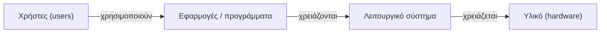
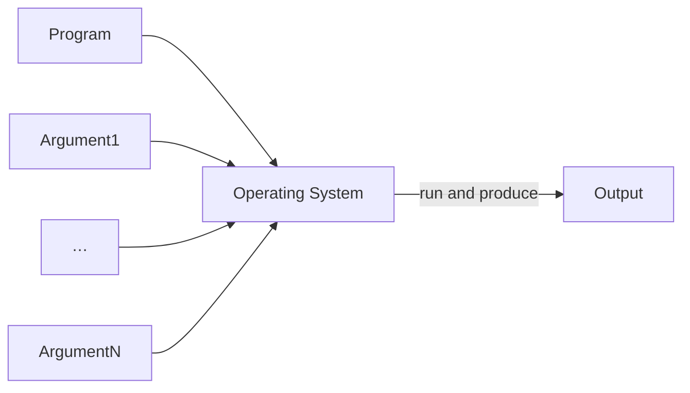
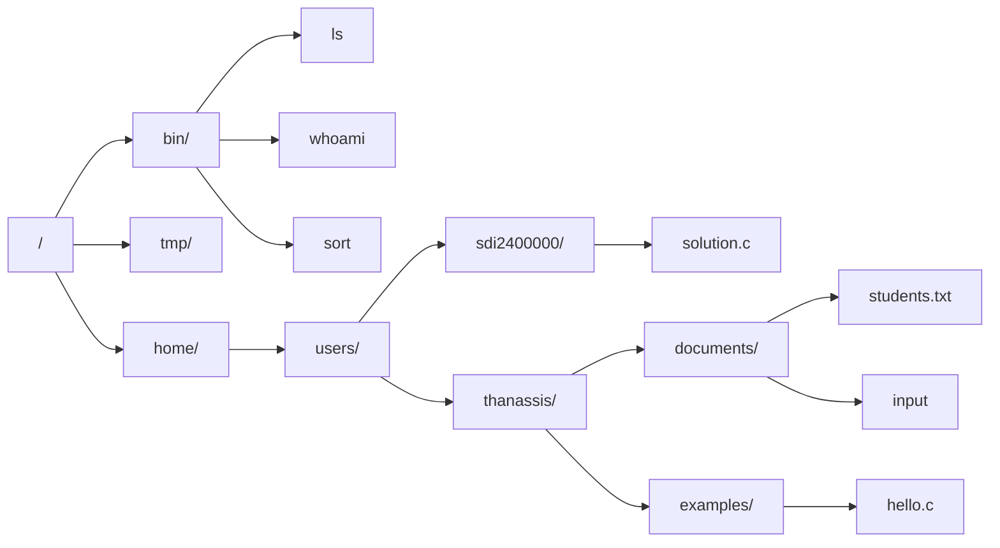
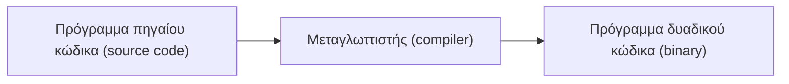

# Κεφάλαιο 1: Η Γραμμή Εντολών

<!--  -->

> **Στόχοι:** μετά από αυτό το κεφάλαιο θα μπορείτε να
> - περιγράφετε τα επίπεδα ενός υπολογιστικού συστήματος (χρήστες, εφαρμογές,
>   λειτουργικό σύστημα, υλικό) και τι αναλαμβάνει το λειτουργικό σύστημα·
> - εξηγείτε τη διαφορά ανάμεσα σε GUI και CLI, και ανάμεσα σε kernel και shell·
> - τρέχετε ένα πρόγραμμα από το shell με ορίσματα και να ξεχωρίζετε πρόγραμμα,
>   ορίσματα και έξοδο·
> - συνδέεστε σε απομακρυσμένο μηχάνημα με `ssh`·
> - κινείστε στο σύστημα αρχείων και να διαχειρίζεστε αρχεία με `pwd`, `ls`, `cd`,
>   `cat`, `mkdir`, `cp`, `rm`, `rmdir`·
> - μεταγλωττίζετε και να τρέχετε ένα πρόγραμμα C με `gcc` και να εξηγείτε κάθε
>   γραμμή του Hello World, μαζί με τον κωδικό εξόδου (`echo $?`).
>
> **Προαπαιτούμενα:** [Κεφάλαιο 0](../00-hello-world/)
>
> **Χρόνος μελέτης:** ~2 ώρες

## Σύνοψη

Στην πρώτη διάλεξη γράψαμε το πρώτο μας πρόγραμμα· σε αυτή μαθαίνουμε το περιβάλλον
μέσα στο οποίο θα γράφουμε, θα μεταγλωττίζουμε και θα τρέχουμε όλα τα προγράμματα
του μαθήματος. Ξεκινάμε από τη δομή ενός υπολογιστικού συστήματος και τον ρόλο του
λειτουργικού συστήματος, γνωρίζουμε το Linux και τη γραμμή εντολών (CLI), και βλέπουμε
πώς το shell τρέχει προγράμματα με ορίσματα. Μαθαίνουμε να συνδεόμαστε απομακρυσμένα
με `ssh`, να κινούμαστε στο σύστημα αρχείων και να χειριζόμαστε αρχεία με τις
βασικές εντολές. Τέλος, μεταγλωττίζουμε με τον `gcc` το Hello World και το αναλύουμε
γραμμή προς γραμμή. Η γραμμή εντολών είναι το βασικό εργαλείο του μαθήματος: σε
αυτήν θα γίνονται τα εργαστήρια, οι εργασίες και οι εξετάσεις.

## Θεωρία

### Γιατί C;

Η διάλεξη άνοιξε με ένα ερώτημα από το Quora: γιατί τα πανεπιστήμια διδάσκουν ακόμα
C και C++; Η απάντηση που δείχνουν οι διαφάνειες είναι ότι σχεδόν όλο το λογισμικό
που χρησιμοποιούμε καθημερινά είναι γραμμένο σε C, C++ ή σε γλώσσες που προέρχονται
από αυτές: τα λειτουργικά συστήματα, οι browsers, οι οδηγοί (drivers) του
πληκτρολογίου και του ποντικιού. Η C είναι, κατά την παρομοίωση, «το νερό» μέσα στο
οποίο κολυμπάμε χωρίς να το βλέπουμε, και ένας προγραμματιστής πρέπει να ξέρει τι
είναι αυτό το νερό. Όπως θα δούμε, και το Linux και τα βασικά εργαλεία της γραμμής
εντολών είναι γραμμένα σε C.

### Αρχιτεκτονική υπολογιστικών συστημάτων

Ένα σύγχρονο υπολογιστικό σύστημα οργανώνεται σε επίπεδα, όπου κάθε επίπεδο
στηρίζεται στο επόμενο:



*Σχήμα: τα επίπεδα ενός υπολογιστικού συστήματος.*

- Οι **χρήστες (users)** χρησιμοποιούν **εφαρμογές ή προγράμματα (applications /
  programs)**: Word, Excel, Outlook, Gmail, Netflix κ.ο.κ.
- Οι εφαρμογές χρειάζονται ένα **λειτουργικό σύστημα (operating system)**:
  Windows, Linux, macOS.
- Το λειτουργικό σύστημα χρειάζεται το **υλικό (hardware)**: laptop, desktop,
  κινητό, tablet, και περιφερειακά όπως οθόνη, ηχεία, ακουστικά, εκτυπωτής.

Μια πιο λεπτομερής εικόνα βάζει ανάμεσα στο λειτουργικό σύστημα και στο υλικό το
**λογισμικό συστήματος (system software)**, όπως οι οδηγοί συσκευών, που «μιλούν»
απευθείας με κάθε συσκευή. Οι εφαρμογές λέγονται αντίστοιχα **λογισμικό εφαρμογών
(application software)**.

### Λειτουργικά συστήματα

**Λειτουργικό σύστημα (operating system, OS)** είναι το λογισμικό του υπολογιστή
που είναι υπεύθυνο για:

1. τη **διαχείριση του υλικού** (των συσκευών)·
2. τη **διαχείριση των πόρων** του συστήματος: πόση μνήμη μπορεί να χρησιμοποιήσει
   ένα πρόγραμμα, πότε θα πάρει κύκλους στον επεξεργαστή κ.ο.κ.·
3. την **προσφορά υπηρεσιών** στα προγράμματα των χρηστών: αποθήκευση πληροφοριών
   στον δίσκο, μεταφορά πληροφοριών μέσω δικτύου κ.ο.κ.

Γιατί να μην τα κάνει αυτά το δικό μας πρόγραμμα; Γιατί σε έναν υπολογιστή τρέχουν
ταυτόχρονα πολλά προγράμματα, που μοιράζονται την ίδια μνήμη, τον ίδιο επεξεργαστή
και τον ίδιο δίσκο. Κάποιος πρέπει να μοιράζει δίκαια τους πόρους και να εμποδίζει ένα
πρόγραμμα να πειράξει τα δεδομένα ενός άλλου. Επιπλέον, αν κάθε πρόγραμμα έπρεπε να
ξέρει πώς δουλεύει κάθε μοντέλο δίσκου ή κάρτας δικτύου, κανείς δεν θα μπορούσε να
γράψει ούτε ένα Hello World. Το λειτουργικό σύστημα κάνει αυτή τη δουλειά μία φορά,
για όλους.

### Linux

Το **Linux** είναι ένα λειτουργικό σύστημα ανοιχτού κώδικα (open source),
βασισμένο στο Unix. Στηρίζεται στον **Linux kernel (πυρήνα)**, που ξεκίνησε ο Linus
Torvalds το 1991 και είναι γραμμένος κυρίως σε C. Είναι πολύ διαδεδομένο: τρέχει στο
90% των web servers, είναι η βάση του Android (άρα τρέχει στην πλειοψηφία των
κινητών) και είναι η αποκλειστική επιλογή για υπερυπολογιστές (supercomputers). Όταν
λέμε «\*nix» εννοούμε όλα τα συστήματα της οικογένειας του Unix, όπως το Linux και
το macOS.

### Γραφική διεπαφή και γραμμή εντολών

Υπάρχουν δύο τρόποι να αλληλεπιδράσουμε με ένα λειτουργικό σύστημα:

- Η **γραφική διεπαφή χρήστη (Graphical User Interface, GUI)**: παράθυρα, εικονίδια,
  ποντίκι.
- Η **διεπαφή γραμμής εντολών (Command Line Interface, CLI)**: πληκτρολογούμε
  εντολές ως κείμενο και διαβάζουμε την απάντηση ως κείμενο. Τη λέμε και
  τερματικό (terminal), κονσόλα (console) ή κέλυφος (shell). Οι όροι δεν είναι
  αυστηρά συνώνυμοι (οι διαφάνειες δίνουν ένα άρθρο για τις διαφορές τους), αλλά
  στην πράξη χρησιμοποιούνται εναλλάξ.

Στο μάθημα θα επιμείνουμε στη χρήση του CLI. Είναι πιο γρήγορο όταν το συνηθίσετε,
μπορεί να αυτοματοποιηθεί, δουλεύει και σε απομακρυσμένα μηχανήματα χωρίς οθόνη, και
είναι ο φυσικός χώρος όπου τρέχουν τα προγράμματα C που θα γράφουμε.

### Kernel και shell

Μια χρήσιμη αναλογία είναι ένα αμύγδαλο μέσα στο τσόφλι του. Στο κέντρο βρίσκεται ο
**πυρήνας (kernel)**, το κομμάτι του λειτουργικού συστήματος που μιλάει με το υλικό.
Γύρω του βρίσκεται το **κέλυφος (shell)**, το πρόγραμμα με το οποίο μιλάμε εμείς: μας
δίνει τη δυνατότητα να τρέχουμε προγράμματα από τη γραμμή εντολών. Εμείς δεν
αγγίζουμε ποτέ απευθείας τον πυρήνα· ζητάμε από το shell να τρέξει προγράμματα, και
εκείνο ζητάει από το λειτουργικό σύστημα να τα εκτελέσει.

### Εκτέλεση προγραμμάτων από το shell

Για να τρέξουμε ένα πρόγραμμα με N ορίσματα γράφουμε:

```text
Πρόγραμμα(Όρισμα0)  Όρισμα1  Όρισμα2  …  ΌρισμαN
```

δηλαδή το όνομα του προγράμματος και μετά τα ορίσματα, χωρισμένα με κενά. Το ίδιο το
όνομα του προγράμματος μετράει ως όρισμα 0. Δύο ορισμοί:

- **Όρισμα (argument) ή δεδομένο εισόδου (input data):** μια τιμή που μπορεί να
  χρησιμοποιήσει το πρόγραμμα κατά την εκτέλεσή του.
- **Δεδομένο εξόδου (output):** η τιμή που επιστρέφει το πρόγραμμα όταν τελειώσει
  τον υπολογισμό του.

Για παράδειγμα, στην εντολή `/bin/echo hello good world` το πρόγραμμα είναι το
`/bin/echo` και τα ορίσματα είναι τα `hello`, `good` και `world`. Το shell παραδίδει
το πρόγραμμα και τα ορίσματά του στο λειτουργικό σύστημα, το οποίο το τρέχει και
παράγει την έξοδο:



*Σχήμα: το shell δίνει πρόγραμμα και ορίσματα στο λειτουργικό σύστημα.*

Αργότερα θα δούμε πώς ένα πρόγραμμα C διαβάζει τα ορίσματα της γραμμής εντολών
(`argc` / `argv`).

### Πρόσβαση στη γραμμή εντολών

Υπάρχουν τέσσερις τρόποι να αποκτήσετε γραμμή εντολών \*nix, από τον πιο πρακτικό
προς τον λιγότερο πρακτικό για προγραμματισμό:

1. Εγκαθιστάτε Linux (ή χρησιμοποιείτε macOS) στον υπολογιστή σας.
2. Εγκαθιστάτε **WSL 2** (Windows Subsystem for Linux) στο Windows μηχάνημά σας.
3. Συνδέεστε με `ssh` (από κονσόλα ή με το PuTTY) στα μηχανήματα του εργαστηρίου,
   `linuxXY.di.uoa.gr`.
4. Συνδέεστε στο Google Cloud console του προσωπικού σας λογαριασμού.

Στους τρόπους 1, 2 και 4 είστε **διαχειριστής (root)** του συστήματος: μπορείτε να
εγκαταστήσετε ό,τι θέλετε. Στον τρόπο 3 είστε απλός **χρήστης (user)**.

Επειδή στη γραμμή εντολών όλα γίνονται με το πληκτρολόγιο, αξίζει να μάθετε το
**τυφλό σύστημα (touch typing / blind typing)**, δηλαδή να γράφετε με όλα τα δάχτυλα
χωρίς να κοιτάτε τα πλήκτρα. Οι διαφάνειες προτείνουν μερικές σελίδες εξάσκησης
(βλ. «Διάβασμα»).

### Απομακρυσμένη σύνδεση με ssh

Η διάλεξη το έδειξε με μια ιστορία από τη ζωή ενός DevOps engineer: έρχεται ένα
email-alert ότι σε έναν server η χρήση του επεξεργαστή ξεπέρασε το όριο. Ο server
όμως βρίσκεται σε ένα data center στην άλλη άκρη του κόσμου, και δεν μπορούμε να
πάμε εκεί να καθίσουμε μπροστά του. Ευτυχώς υπάρχει το «τηλεχειριστήριο»: το `ssh`.

Το **SSH (Secure Shell)** είναι ένα πρωτόκολλο δικτύου που επιτρέπει την ασφαλή
απομακρυσμένη σύνδεση και διαχείριση ενός υπολογιστή ή server μέσω κρυπτογραφημένης
επικοινωνίας. Με την εντολή

```sh
ssh user@host
```

ανοίγουμε ένα shell στο μηχάνημα `host` ως χρήστης `user`, και από εκεί και πέρα
ό,τι πληκτρολογούμε εκτελείται στο απομακρυσμένο μηχάνημα. Έτσι θα συνδέεστε και στα
μηχανήματα του εργαστηρίου.

### Βασικές εντολές

Κάθε γραμμή του shell ξεκινά με την **προτροπή (prompt)**, π.χ.
`thanassis@linux14:~$`: ο χρήστης (`thanassis`), το μηχάνημα (`linux14`), ο τρέχων
κατάλογος (`~`, ο αρχικός κατάλογος του χρήστη) και το `$`, μετά από το οποίο
γράφουμε την εντολή. Μερικές εντολές για να εξερευνήσετε ένα σύστημα:

| Εντολή | Τι κάνει |
| --- | --- |
| `who` | ποιοι χρήστες είναι συνδεδεμένοι, από ποιο τερματικό και πότε |
| `last` | οι πρόσφατες συνδέσεις χρηστών |
| `whoami` | το όνομα του τρέχοντος χρήστη |
| `id` | ο αριθμός χρήστη (uid) και οι ομάδες (groups) του |
| `users` | τα ονόματα των συνδεδεμένων χρηστών |
| `factor N` | αναλύει τον αριθμό `N` σε πρώτους παράγοντες |
| `hostname` | το όνομα του μηχανήματος |
| `sleep N` | περιμένει `N` δευτερόλεπτα και τελειώνει |
| `uptime` | ώρα, πόσο καιρό τρέχει το σύστημα, χρήστες, φορτίο |
| `uname -a` | πληροφορίες για τον πυρήνα και την αρχιτεκτονική |
| `top` | διαδραστική λίστα των διεργασιών που τρέχουν |
| `man` | τα εγχειρίδια (manual pages) των εντολών, π.χ. `man ls` |
| `ps` | οι διεργασίες (processes) που τρέχουν |

Οι περισσότερες τυπώνουν κάτι και τελειώνουν. Οι `top` και `man` είναι
**διαδραστικές (interactive)**: μένουν ανοιχτές μέχρι να βγείτε (με `q`). Η
`uname -a` δείχνει ένα παράδειγμα **επιλογής (option)**: ορίσματα που αρχίζουν με
`-` και αλλάζουν τη συμπεριφορά της εντολής.

### Το σύστημα αρχείων

**Αρχείο (file)** είναι ένας πόρος για να καταγράφουμε δεδομένα σε έναν υπολογιστή.
Συνήθως αποθηκεύεται στη δευτερεύουσα, μόνιμη μνήμη (π.χ. σκληρό δίσκο). Στο Linux
σχεδόν τα πάντα είναι αρχείο ("everything is a file"): ακόμα και οι συσκευές
εμφανίζονται ως αρχεία. Κάθε αρχείο:

- έχει ένα **όνομα (filename / basename)**·
- βρίσκεται μέσα σε έναν συγκεκριμένο **κατάλογο ή φάκελο (directory / folder)**·
- έχει ένα **μονοπάτι (filepath)** που καθορίζει πού βρίσκεται στο σύστημα αρχείων.

Για παράδειγμα, στο μονοπάτι `/home/users/thanassis/documents/students.txt` ο
φάκελος είναι ο `/home/users/thanassis/documents` και το όνομα του αρχείου το
`students.txt`. Το `.txt` στο τέλος λέγεται **επέκταση (extension)** και συνήθως
περιγράφει τον τύπο του αρχείου (κείμενο, `.c` για πηγαίο κώδικα C κ.ο.κ.).

Οι κατάλογοι περιέχουν αρχεία και άλλους καταλόγους, οπότε όλο το **σύστημα αρχείων
(filesystem)** σχηματίζει μια ιεραρχία, ένα δέντρο που ξεκινά από τη **ρίζα (root)**
`/`:



*Σχήμα: ιεραρχία συστήματος αρχείων. Οι εντολές (`ls`, `whoami`, `sort`) είναι κι
αυτές αρχεία, στον κατάλογο `/bin`.*

Ένα μονοπάτι που ξεκινά από `/` είναι **απόλυτο (absolute)**. Ένα μονοπάτι που δεν
ξεκινά από `/` είναι **σχετικό (relative)** ως προς τον **τρέχοντα κατάλογο
(current directory)**, αυτόν όπου «βρισκόμαστε». Δύο ειδικά ονόματα:

- `.` είναι ο τρέχων κατάλογος·
- `..` είναι ο **γονικός (parent)** κατάλογος, ένα επίπεδο πιο πάνω.

Το `~` είναι συντομογραφία του αρχικού καταλόγου (home directory) του χρήστη· για
τον `thanassis`, `~/examples` σημαίνει `/home/users/thanassis/examples`. Προσέξτε ότι
τα ονόματα αρχείων στο Unix ξεχωρίζουν πεζά από κεφαλαία (case-sensitive):
`Hello.c` και `hello.c` είναι διαφορετικά αρχεία.

### Εντολές χειρισμού αρχείων

| Εντολή | Τι κάνει |
| --- | --- |
| `pwd` | τυπώνει τον τρέχοντα κατάλογο (print working directory) |
| `ls` | εμφανίζει τα αρχεία ενός καταλόγου (list) |
| `ls -l` | το ίδιο, με λεπτομέρειες |
| `cat αρχείο` | τυπώνει τα περιεχόμενα ενός αρχείου |
| `mkdir κατάλογος` | δημιουργεί νέο, άδειο κατάλογο (make directory) |
| `cd κατάλογος` | αλλάζει τον τρέχοντα κατάλογο (change directory) |
| `cp πηγή προορισμός` | αντιγράφει ένα αρχείο (copy) |
| `rm αρχείο` | διαγράφει ένα αρχείο (remove) |
| `rmdir κατάλογος` | διαγράφει έναν **άδειο** κατάλογο |

Η `ls -l` τυπώνει για κάθε αρχείο μια γραμμή όπως
`-rw-r--r-- 1 thanassis dep 62 Oct  5 16:04 hello.c`: τον τύπο και τα δικαιώματα
(`-` για απλό αρχείο, `rw-r--r--`), τον ιδιοκτήτη (`thanassis`) και την ομάδα
(`dep`), το μέγεθος σε bytes (`62`), την ημερομηνία τελευταίας αλλαγής και το όνομα.
Τα δικαιώματα θα τα δείτε αναλυτικά στο [Εργαστήριο 1](https://progintro.github.io/lab-material/labs/lab01/).

### Coreutils και άλλα εργαλεία

Οι περισσότερες διανομές Linux (distros) έρχονται με μια σουίτα βασικών βοηθητικών
προγραμμάτων που λέγονται **coreutils**. Είναι ως επί το πλείστον γραμμένα σε C. Αξίζει
να εξερευνήσετε μόνοι σας και άλλα, μέσα ή έξω από τα coreutils: `find`, `grep`,
`sort`, `df -h`, `du -sh`, `wc -l`, `file`, `which`, `basename`, `dirname`, `ping`,
`curl` κ.ο.κ. Για κάθε άγνωστη εντολή, το `man` είναι ο πρώτος σας φίλος.

Στη ζωντανή επίδειξη αναφέρθηκαν επίσης το `apt`, με το οποίο προσθέτουμε
(εγκαθιστούμε) καινούργια προγράμματα σε Ubuntu / WSL, και οι **επεξεργαστές κειμένου
γραμμής εντολών (command line editors)**, με τους οποίους αλλάζουμε αρχεία από την
κονσόλα. Περισσότερα στα εργαστήρια.

### Μεταγλωττιστές

**Μεταγλωττιστής (compiler)** είναι ένα πρόγραμμα που μετατρέπει τις εντολές μιας
γλώσσας προγραμματισμού σε **κώδικα μηχανής (machine code)**, ώστε να μπορεί να
διαβαστεί και να τρέξει από τον υπολογιστή.



*Σχήμα: από τον πηγαίο κώδικα στο εκτελέσιμο πρόγραμμα (απλοποιημένο).*

Το σχήμα είναι προσεγγιστικό: λείπουν λεπτομέρειες (όπως η σύνδεση, linking) που
θα προστεθούν σε επόμενες διαλέξεις. Στο μάθημα χρησιμοποιούμε τον **GNU C Compiler,
`gcc`**. Η βασική χρήση του:

- `gcc hello.c` μεταγλωττίζει το `hello.c` και γράφει το εκτελέσιμο στο αρχείο
  `a.out`·
- `gcc -o hello hello.c` γράφει το εκτελέσιμο στο αρχείο που δίνουμε μετά το `-o`,
  εδώ `hello`.

Το εκτελέσιμο το τρέχουμε γράφοντας το μονοπάτι του, π.χ. `./hello`: το `./` λέει στο
shell ότι το πρόγραμμα βρίσκεται στον τρέχοντα κατάλογο. Οι εντολές όπως η `ls` δεν
το χρειάζονται, γιατί το shell τις βρίσκει μόνο του σε καταλόγους συστήματος όπως ο
`/bin`. Η εντολή `file` δείχνει ότι το `a.out` δεν είναι κείμενο αλλά **ELF 64-bit**
εκτελέσιμο για επεξεργαστή x86-64, δηλαδή κώδικας μηχανής.

### Ανατομία του Hello World

```c
/* File: helloworld.c */
#include <stdio.h>

int main() {
  printf("Hello world\n");
  return 0;
}
```

Κάθε κομμάτι έχει ρόλο:

- **Σχόλια (comments).** Το `/* File: helloworld.c */` είναι κείμενο του
  προγραμματιστή που συνοδεύει τον κώδικα για να τον κάνει πιο σαφή σε τρίτους ή σε
  εμάς τους ίδιους, ειδικά αν έχει περάσει καιρός από τότε που τον γράψαμε. Ο
  μεταγλωττιστής το αγνοεί. Ένα σχόλιο γράφεται ανάμεσα σε `/*` και `*/` (μπορεί να
  πιάνει πολλές γραμμές) ή σε μία γραμμή μετά από `//`.
- **Η οδηγία `#include` (directive).** Με το `#include <stdio.h>` ο μεταγλωττιστής
  συμπεριλαμβάνει τα περιεχόμενα του αρχείου `stdio.h` (standard input output) στον
  κώδικά μας. Το `stdio.h` περιέχει τις βασικές (standard) δηλώσεις των συναρτήσεων
  για εμφάνιση δεδομένων στην οθόνη (output) και εισαγωγή δεδομένων από το
  πληκτρολόγιο (input).
- **Η `printf`.** Είναι συνάρτηση βιβλιοθήκης, δηλωμένη στο `stdio.h` (γι' αυτό
  κάνουμε `#include`), και τυπώνει το αλφαριθμητικό `"Hello world\n"`. Ο χαρακτήρας
  `\n` δημιουργεί μια νέα γραμμή μετά το μήνυμα.
- **Η `main`.** Ένα πρόγραμμα C ορίζεται από ένα σύνολο **συναρτήσεων (functions)**,
  που θα τις δούμε στο [Κεφάλαιο 3](../03-functions/). Για να μπορεί να τρέξει, πρέπει
  να έχει **ακριβώς μία** συνάρτηση `main`: αυτή καλείται πρώτη όταν αρχίζει η
  εκτέλεση.
- **Το `return 0`.** Επιστρέφει την τιμή της συνάρτησης. Η τιμή που επιστρέφει η
  `main` είναι ο **κωδικός εξόδου (exit code)** του προγράμματος, που δείχνει αν
  ολοκληρώθηκε με επιτυχία: `0` σημαίνει επιτυχία, κάθε τιμή διάφορη του `0`
  σημαίνει ότι το πρόγραμμα **απέτυχε**. Αμέσως μετά την εκτέλεση, η εντολή
  `echo $?` στο shell τυπώνει τον κωδικό εξόδου.
- **Εντολές (statements).** Οι εντολές μιας συνάρτησης βρίσκονται μέσα σε άγκιστρα
  `{ }` και η καθεμία τελειώνει με `;` (semicolon, το σύμβολο του ελληνικού
  ερωτηματικού).

Προσέξτε τη διαφορά ανάμεσα σε ό,τι τυπώνει ένα πρόγραμμα (το `Hello world` της
`printf`) και στον κωδικό εξόδου του (το `0` του `return`): το πρώτο το βλέπουμε
στην οθόνη, το δεύτερο το διαβάζει το shell.

## Παραδείγματα

### Εξερεύνηση ενός συστήματος

Εφαρμόζει τις «Βασικές εντολές». Συνδεδεμένοι στο `linux14`, τρέχουμε μία μία τις
εντολές του πίνακα (το `…` σημαίνει ότι η έξοδος της `last` παραλείπεται):

```text
thanassis@linux14:~$ who
thanassis pts/0        Oct  5 14:36 (110.220.111.247)
thanassis@linux14:~$ last
…
thanassis@linux14:~$ whoami
thanassis
thanassis@linux14:~$ id
uid=2622(thanassis) gid=1001(dep) groups=1001(dep)
thanassis@linux14:~$ users
thanassis
thanassis@linux14:~$ factor 2394872891
2394872891: 3259 734849
thanassis@linux14:~$ hostname
linux14
thanassis@linux14:~$ sleep 3
thanassis@linux14:~$ uptime
 14:40:23 up 7 days,  5:49,  3 users,  load average: 0.00, 0.00, 0.00
thanassis@linux14:~$ uname -a
linux linux14 5.4.0-163-generic #180-Ubuntu SMP Tue Sep 5 13:21:23 UTC 2023 x86_64 x86_64 x86_64 GNU/Linux
# Interactive commands follow
thanassis@linux14:~$ top
thanassis@linux14:~$ man
thanassis@linux14:~$ ps
```

Παρατηρήστε ότι η `sleep 3` δεν τυπώνει τίποτα: απλώς η επόμενη προτροπή εμφανίζεται
μετά από τρία δευτερόλεπτα. Η `factor` βρήκε ότι
$2394872891 = 3259 \cdot 734849$.

### Το πρόγραμμα /bin/echo

Εφαρμόζει την «Εκτέλεση προγραμμάτων από το shell». Το `/bin/echo` είναι ένα
πρόγραμμα που τυπώνει τα ορίσματά του χωρισμένα με ένα κενό:

```text
$ /bin/echo hello good world
hello good world
```

Εδώ το όρισμα 0 είναι το ίδιο το πρόγραμμα, `/bin/echo`, και ακολουθούν τρία
ορίσματα: `hello`, `good`, `world`. Επειδή το `/bin/echo` είναι απόλυτο μονοπάτι, το
shell ξέρει ακριβώς ποιο αρχείο να τρέξει.

### Χειρισμός αρχείων βήμα βήμα

Εφαρμόζει το «Σύστημα αρχείων» και τις «Εντολές χειρισμού αρχείων». Ξεκινάμε στον
κατάλογο `~/examples`, που περιέχει το `hello.c`:

```text
# Directory we are currently in
thanassis@linux14:~/examples$ pwd
/home/users/thanassis/examples
# List files
thanassis@linux14:~/examples$ ls
hello.c
# List files with details
thanassis@linux14:~/examples$ ls -l
total 4
-rw-r--r-- 1 thanassis dep 62 Oct  5 16:04 hello.c
# Print contents of file
thanassis@linux14:~/examples$ cat hello.c
#include <stdio.h>

int main() {
  printf("Hello world\n");
}
# Create `foo` directory
thanassis@linux14:~/examples$ mkdir foo
thanassis@linux14:~/examples$ ls
foo  hello.c
# New directory is empty by default
thanassis@linux14:~/examples$ ls foo
```

Συνεχίζουμε μπαίνοντας στον νέο κατάλογο:

```text
# Change directory to the newly created one
thanassis@linux14:~/examples$ cd foo
# List files within the directory
thanassis@linux14:~/examples/foo$ ls
# Copy file from parent `..` directory to the current one `.`
thanassis@linux14:~/examples/foo$ cp ../hello.c .
thanassis@linux14:~/examples/foo$ ls
hello.c
# Check the file contents are what we expect
thanassis@linux14:~/examples/foo$ cat hello.c
#include <stdio.h>

int main() {
  printf("Hello world\n");
}
# Remove the file
thanassis@linux14:~/examples/foo$ rm hello.c
# Go to the parent directory
thanassis@linux14:~/examples/foo$ cd ..
thanassis@linux14:~/examples$ rmdir foo
thanassis@linux14:~/examples$ ls
hello.c
```

Παρατηρήστε ότι η προτροπή αλλάζει σε `~/examples/foo$` μετά το `cd foo`, και ότι
στην `cp ../hello.c .` χρησιμοποιούνται και τα δύο ειδικά ονόματα: «από τον γονικό
κατάλογο, στον τρέχοντα». Ο `foo` διαγράφεται με `rmdir` μόνο αφού τον αδειάσουμε.

### Μεταγλώττιση και εκτέλεση του Hello World

Εφαρμόζει τους «Μεταγλωττιστές». Στον κατάλογο `~/examples`:

```text
thanassis@linux14:~/examples$ gcc hello.c
thanassis@linux14:~/examples$ ls
a.out  hello.c
thanassis@linux14:~/examples$ ./a.out
Hello world
thanassis@linux14:~/examples$ file a.out
a.out: ELF 64-bit LSB shared object, x86-64, version 1 (SYSV), dynamically linked, interpreter /lib64/ld-linux-x86-64.so.2, BuildID[sha1]=52fa5999c10d767a5ff30f662346478333de74bf, for GNU/Linux 3.2.0, not stripped
thanassis@linux14:~/examples$ gcc -o hello hello.c
thanassis@linux14:~/examples$ ./hello
Hello world
```

Χωρίς `-o`, ο `gcc` ονομάζει το εκτελέσιμο `a.out`· με `-o hello` το ονομάζει
`hello`. Αν μεταγλωττίσετε και δεύτερο πρόγραμμα χωρίς `-o`, το νέο `a.out` θα
αντικαταστήσει το παλιό, γι' αυτό συνηθίζεται να δίνετε πάντα όνομα.

### Ο κωδικός εξόδου

Εφαρμόζει την «Ανατομία του Hello World». Αμέσως μετά την εκτέλεση του `./hello`, το
`echo $?` τυπώνει την τιμή που επέστρεψε η `main`:

```text
$ ./hello
Hello world
$ echo $?
0
```

Αν αλλάξετε το `return 0;` σε `return 1;` και ξαναμεταγλωττίσετε, το `echo $?` θα
τυπώσει `1`: για το shell, το πρόγραμμα απέτυχε.

### Για την επόμενη φορά

Οι διαφάνειες ζητούν να ολοκληρώσετε τις εγγραφές στα εργαλεία του μαθήματος, να
γραφτείτε σε εργαστήριο, και να εγκαταστήσετε WSL για να τρέξετε μόνοι σας όλα τα
παραπάνω παραδείγματα.

## Κύρια σημεία

1. Ένα υπολογιστικό σύστημα έχει επίπεδα: οι χρήστες χρησιμοποιούν εφαρμογές, οι
   εφαρμογές χρειάζονται το λειτουργικό σύστημα και αυτό χρειάζεται το υλικό.
2. Το λειτουργικό σύστημα διαχειρίζεται το υλικό και τους πόρους (μνήμη, επεξεργαστή)
   και προσφέρει υπηρεσίες (δίσκο, δίκτυο) στα προγράμματα.
3. Το Linux είναι λειτουργικό σύστημα ανοιχτού κώδικα βασισμένο στο Unix, με πυρήνα
   γραμμένο κυρίως σε C.
4. Στο μάθημα δουλεύουμε με τη γραμμή εντολών (CLI) και όχι με τη γραφική διεπαφή
   (GUI).
5. Ο kernel μιλάει με το υλικό· το shell είναι το πρόγραμμα που μας επιτρέπει να
   τρέχουμε προγράμματα από τη γραμμή εντολών.
6. Ένα πρόγραμμα τρέχει ως `Πρόγραμμα Όρισμα1 … ΌρισμαN`, όπου το όνομα του
   προγράμματος είναι το όρισμα 0.
7. Γραμμή εντολών \*nix αποκτάτε με Linux / macOS, WSL 2, `ssh` στα μηχανήματα του
   εργαστηρίου ή Google Cloud console· μόνο στο εργαστήριο δεν είστε root.
8. Με `ssh user@host` συνδέεστε με ασφάλεια (κρυπτογραφημένα) σε απομακρυσμένο
   μηχάνημα και δουλεύετε σε αυτό σαν να ήσασταν μπροστά του.
9. Κάθε αρχείο έχει όνομα, βρίσκεται σε κατάλογο και προσδιορίζεται από ένα
   μονοπάτι στην ιεραρχία που ξεκινά από τη ρίζα `/`.
10. Το `.` είναι ο τρέχων κατάλογος, το `..` ο γονικός και το `~` ο αρχικός κατάλογος
    του χρήστη.
11. Οι `pwd`, `ls`, `cd`, `cat`, `mkdir`, `cp`, `rm`, `rmdir` αρκούν για τη βασική
    διαχείριση αρχείων· η `rm` διαγράφει οριστικά.
12. Ο μεταγλωττιστής μετατρέπει τον πηγαίο κώδικα σε κώδικα μηχανής· στο μάθημα
    χρησιμοποιούμε τον `gcc`.
13. Το `gcc hello.c` παράγει το `a.out`, το `gcc -o hello hello.c` το `hello`, και
    τα τρέχουμε με `./a.out` ή `./hello`.
14. Κάθε πρόγραμμα C έχει ακριβώς μία `main`, που εκτελείται πρώτη.
15. Η τιμή που επιστρέφει η `main` είναι ο κωδικός εξόδου: `0` για επιτυχία,
    οτιδήποτε άλλο για αποτυχία· τον βλέπουμε με `echo $?`.
16. Οι εντολές μιας συνάρτησης βρίσκονται μέσα σε `{ }` και καθεμία τελειώνει με `;`.

## Ορολογία

| Ελληνικά | English | Σύντομος ορισμός |
| --- | --- | --- |
| λειτουργικό σύστημα | operating system (OS) | Λογισμικό που διαχειρίζεται υλικό και πόρους και εξυπηρετεί τα προγράμματα |
| υλικό | hardware | Οι φυσικές συσκευές του υπολογιστή |
| πυρήνας | kernel | Το κεντρικό μέρος του OS, που μιλάει με το υλικό |
| κέλυφος | shell | Πρόγραμμα που τρέχει τις εντολές που πληκτρολογούμε |
| γραφική διεπαφή χρήστη | GUI | Αλληλεπίδραση με παράθυρα και ποντίκι |
| διεπαφή γραμμής εντολών | CLI, terminal, console | Αλληλεπίδραση με εντολές κειμένου |
| όρισμα | argument | Τιμή που δίνουμε σε ένα πρόγραμμα όταν το τρέχουμε |
| δεδομένο εξόδου | output | Ό,τι παράγει ένα πρόγραμμα όταν τελειώσει |
| προτροπή | prompt | Το `user@host:dir$` πριν από κάθε εντολή |
| διαχειριστής | root | Χρήστης με πλήρη δικαιώματα στο σύστημα |
| αρχείο | file | Πόρος για αποθήκευση δεδομένων, συνήθως στον δίσκο |
| κατάλογος, φάκελος | directory, folder | Περιέχει αρχεία και άλλους καταλόγους |
| μονοπάτι | path | Η θέση ενός αρχείου στην ιεραρχία, π.χ. `/home/users` |
| επέκταση | extension | Το τέλος του ονόματος (`.txt`, `.c`) που δείχνει τον τύπο |
| ρίζα | root directory | Ο κατάλογος `/`, κορυφή της ιεραρχίας |
| τρέχων / γονικός κατάλογος | current / parent directory | `.` και `..` |
| μεταγλωττιστής | compiler | Μετατρέπει πηγαίο κώδικα σε κώδικα μηχανής |
| πηγαίος κώδικας | source code | Το πρόγραμμα όπως το γράφουμε, π.χ. `hello.c` |
| εκτελέσιμο, δυαδικό | executable, binary | Το πρόγραμμα σε κώδικα μηχανής, π.χ. `a.out` |
| σχόλιο | comment | Κείμενο για τον αναγνώστη, που ο compiler αγνοεί |
| οδηγία | directive | Γραμμή που αρχίζει με `#`, π.χ. `#include` |
| κωδικός εξόδου | exit code | Η τιμή που επιστρέφει η `main`· `0` = επιτυχία |

## Συχνά λάθη

- **Τρέξιμο χωρίς `./`.** Το `a.out` σκέτο δίνει `a.out: command not found`, γιατί το
  shell δεν ψάχνει στον τρέχοντα κατάλογο. Διόρθωση: `./a.out`.
- **Τρέξιμο χωρίς (ξανά)μεταγλώττιση.** Αλλάξατε το `hello.c` αλλά το `./hello` τυπώνει
  το παλιό μήνυμα, ή `./hello: No such file or directory`. Το εκτελέσιμο φτιάχνεται
  μόνο από τον `gcc`: ξανατρέξτε `gcc -o hello hello.c` μετά από κάθε αλλαγή.
- **Λάθος κατάλογος.** `cat hello.c` δίνει `No such file or directory` επειδή δεν
  βρίσκεστε εκεί που νομίζετε. Ελέγξτε με `pwd` και `ls`, και μετακινηθείτε με `cd`.
- **Κεφαλαία και πεζά.** `cd Examples` αποτυγχάνει όταν ο κατάλογος λέγεται
  `examples`: τα ονόματα στο Unix είναι case-sensitive.
- **`rmdir` σε κατάλογο με αρχεία.** Δίνει `Directory not empty`. Αδειάστε πρώτα τον
  κατάλογο με `rm`.
- **`rm` χωρίς προσοχή.** Δεν υπάρχει κάδος ανακύκλωσης· ένα `rm hello.c` σβήνει τον
  κώδικά σας οριστικά. Κρατάτε αντίγραφα (αργότερα: git).
- **Κενά μέσα σε ορίσματα.** `mkdir my work` φτιάχνει *δύο* καταλόγους, `my` και
  `work`, γιατί τα κενά χωρίζουν τα ορίσματα.
- **Ξεχασμένο `;`.** Αν λείπει το `;` μετά την `printf(...)`, ο `gcc` αναφέρει
  `error: expected ';' before 'return'` και δεν παράγει εκτελέσιμο.
- **`echo $?` αργότερα.** Αν τρέξετε άλλη εντολή ανάμεσα, το `echo $?` δείχνει τον
  κωδικό εξόδου εκείνης (π.χ. `0` της `ls`), όχι του προγράμματός σας.

## Διάβασμα

- **Διαφάνειες:** [Διάλεξη 1](https://github.com/progintro/progintro.github.io/releases/download/2025/lec01.pdf), σελ. 1–43. Αρχιτεκτονική και λειτουργικά συστήματα: σελ. 6–10· GUI, CLI, kernel και shell: σελ. 11–13· εκτέλεση προγραμμάτων και ορίσματα: σελ. 14–17· πρόσβαση σε γραμμή εντολών και `ssh`: σελ. 18–24· βασικές εντολές: σελ. 25· σύστημα αρχείων και εντολές αρχείων: σελ. 27–31· `gcc` και ανάλυση του Hello World: σελ. 32–40.
- **Σημειώσεις:** οι διαφάνειες ζητούν τις σελίδες 58–60 και 98–99 των σημειώσεων του κ. Σταματόπουλου (αριθμημένες σελίδες, δηλαδή K04, σελ. 58–60 και 98–99):
  - [Κεφάλαιο 4: Συναρτήσεις](https://progintro.github.io/notes/chapters/04-functions/), ενότητα «Δομή ενός προγράμματος C – Συναρτήσεις» (K04, σελ. 58–60): η `main` και η τιμή που επιστρέφει.
  - [Κεφάλαιο 6: Μνήμη και συμβολοσειρές](https://progintro.github.io/notes/chapters/06-memory-strings/), ενότητα «Ορίσματα γραμμής εντολών» (K04, σελ. 98–99): πώς ένα πρόγραμμα C διαβάζει τα ορίσματά του (θα το δούμε αναλυτικά αργότερα).
  - Για το υπόβαθρο: [Κεφάλαιο 0: Εισαγωγή](https://progintro.github.io/notes/chapters/00-intro/), ενότητες «Λογισμικό και γλώσσες προγραμματισμού», «Πώς κατασκευάζουμε εκτελέσιμο πρόγραμμα;», «Η διαδικασία της μεταγλώττισης και σύνδεσης», «Προγραμματιστικά περιβάλλοντα για την C», «Παραδείγματα χρήσης του gcc» (K04, σελ. 11, 14–17), και [Κεφάλαιο 1](https://progintro.github.io/notes/chapters/01-first-programs/), ενότητα «Καλημέρα κόσμε της C» (K04, σελ. 19).
- **Εργαστήριο:** [Εργαστήριο 0](https://progintro.github.io/lab-material/labs/lab00/): Βήματα 4–5 (`ssh`, `ls`, `cd`) και 7 (`hello.c`)· [Εργαστήριο 1](https://progintro.github.io/lab-material/labs/lab01/): Βήματα 1–3 (πλοήγηση, μεταγλώττιση, αντιγραφή και προβολή αρχείων) και 5 (`man`, `grep`, ανακατεύθυνση).
- **Άλλα:**
  - Wikipedia: [Operating system](https://en.wikipedia.org/wiki/Operating_system), [Unix](https://en.wikipedia.org/wiki/Unix), [Computer file](https://en.wikipedia.org/wiki/Computer_file), [Everything is a file](https://en.wikipedia.org/wiki/Everything_is_a_file), [GNU Core Utilities](https://en.wikipedia.org/wiki/GNU_Core_Utilities), [GNU Compiler Collection](https://en.wikipedia.org/wiki/GNU_Compiler_Collection)
  - Ο κώδικας του [Linux kernel](https://github.com/torvalds/linux) και των [coreutils](https://github.com/coreutils/coreutils) στο GitHub
  - [Διαφορές terminal, console, shell και command line](https://www.geeksforgeeks.org/difference-between-terminal-console-shell-and-command-line/)
  - [Γιατί τα πανεπιστήμια διδάσκουν ακόμα C και C++ (Quora)](https://qr.ae/p2wHA3)
  - Τυφλό σύστημα: [blindtyping.com](https://blindtyping.com/), [typingclub.com](https://www.typingclub.com/), [typingstudy.com](https://www.typingstudy.com/)
  - Προαιρετικά: [The Unix Programming Environment (PDF)](https://scis.uohyd.ac.in/~apcs/itw/UNIXProgrammingEnvironment.pdf), [Common Linux Interview Questions](https://www.geeksforgeeks.org/linux-interview-questions/)

## Ασκήσεις

<!-- exercises -->

### Από τις διαφάνειες

- [Παραδείγματα για κάθε επίπεδο ενός υπολογιστικού συστήματος](../../questions/slides/slides-lec01-architecture-examples.md): Διάλεξη 1: Η Γραμμή Εντολών, διαφάνεια 7 · ★☆☆ · short-answer
- [Πρόγραμμα και ορίσματα στο /bin/echo](../../questions/slides/slides-lec01-echo-arguments.md): Διάλεξη 1: Η Γραμμή Εντολών, διαφάνεια 15 · ★☆☆ · tooling
- [Τρέξτε μόνοι σας τις εντολές της διάλεξης](../../questions/slides/slides-lec01-try-commands.md): Διάλεξη 1: Η Γραμμή Εντολών, διαφάνεια 42 · ★☆☆ · tooling
- [Γιατί χρειαζόμαστε λειτουργικό σύστημα](../../questions/slides/slides-lec01-why-os.md): Διάλεξη 1: Η Γραμμή Εντολών, διαφάνεια 9 · ★☆☆ · short-answer
- [Εξερευνήστε κι άλλα βασικά προγράμματα](../../questions/slides/slides-lec01-explore-coreutils.md): Διάλεξη 1: Η Γραμμή Εντολών, διαφάνεια 31 · ★★☆ · tooling

### Από τα εργαστήρια

- [Πλοήγηση στο σύστημα αρχείων](../../questions/labs/lab-lab01-step1-navigation.md): Εργαστήριο 1, Βήμα 1 · ★☆☆ · tooling
- [Μεταγλώττιση, σύνδεση και εκτέλεση](../../questions/labs/lab-lab01-step2-compile-link.md): Εργαστήριο 1, Βήμα 2 · ★☆☆ · tooling
- [Αντιγραφή, μετονομασία και προβολή αρχείων](../../questions/labs/lab-lab01-step3-copy-view.md): Εργαστήριο 1, Βήμα 3 · ★☆☆ · tooling
- [Δικαιώματα προστασίας](../../questions/labs/lab-lab01-step4-permissions.md): Εργαστήριο 1, Βήμα 4 · ★☆☆ · tooling
- [Αναζήτηση, ανακατεύθυνση και σωληνώσεις](../../questions/labs/lab-lab01-step5-grep-pipes.md): Εργαστήριο 1, Βήμα 5 · ★★☆ · tooling

### Από τις εργασίες

- [Ξεκινώντας με την γραμμή εντολών (bandit)](../../questions/homework/hw-2023-hw0-bandit.md): Εργασία 0 (2023-24), Άσκηση 2 · ★★☆ · tooling
- [Παιχνίδια με Κονσόλα (cmdline)](../../questions/homework/hw-2025-hw0-cmdline.md): Εργασία 0 (2025-26), Άσκηση 2 · ★★☆ · tooling

### Σχετικές ασκήσεις από άλλα κεφάλαια

- [Νέο URL στο GitHub (pages)](../../questions/homework/hw-2025-hw0-pages.md): Εργασία 0 (2025-26), Άσκηση 1 · ★☆☆ · tooling (κεφ. 4)
- [Το πρώτο σας repository](../../questions/labs/lab-lab01-info.md): Εργαστήριο 1, Άσκηση 1 · ★☆☆ · tooling (κεφ. 4)
- [Κωδικοποίηση και αποκωδικοποίηση κειμένου](../../questions/labs/lab-lab04-encode-decode.md): Εργαστήριο 4, Άσκηση 4 · ★★☆ · programming (κεφ. 9)
- [Ανακατεύθυνση της stderr](../../questions/slides/slides-lec18-stderr-redirect.md): Διάλεξη 18, διαφάνεια 56 · ★☆☆ · tooling (κεφ. 18)

<!-- /exercises -->

## Ερωτήσεις αυτοαξιολόγησης

1. Ποια τρία πράγματα αναλαμβάνει ένα λειτουργικό σύστημα;[^q1]
2. Ποια είναι η διαφορά ανάμεσα σε kernel και shell;[^q2]
3. Στην εντολή `factor 12 35`, ποιο είναι το πρόγραμμα και πόσα ορίσματα έχει;[^q3]
4. Βρίσκεστε στο `/home/users/thanassis/examples/foo`. Σε ποιον κατάλογο σας πάει
   το `cd ..`; Ποιο είναι το απόλυτο μονοπάτι του `../hello.c`;[^q4]
5. Τι κάνει η `gcc -o prog prog.c` και πώς τρέχετε μετά το πρόγραμμα;[^q5]
6. Γιατί η `rmdir foo` μπορεί να αποτύχει;[^q6]
7. Τι τυπώνει το `echo $?` αμέσως μετά από ένα πρόγραμμα που τελείωσε με
   `return 3;`, και τι σημαίνει αυτό;[^q7]
8. Πόσες συναρτήσεις `main` πρέπει να έχει ένα πρόγραμμα C;[^q8]

[^q1]: Διαχειρίζεται το υλικό (συσκευές), διαχειρίζεται τους πόρους (μνήμη, χρόνο επεξεργαστή) και προσφέρει υπηρεσίες στα προγράμματα (δίσκο, δίκτυο).
[^q2]: Ο kernel είναι ο πυρήνας του λειτουργικού συστήματος και μιλάει με το υλικό. Το shell είναι το πρόγραμμα με το οποίο μιλάμε εμείς: διαβάζει τις εντολές μας και ζητά από το OS να τρέξει προγράμματα.
[^q3]: Το πρόγραμμα είναι το `factor` (όρισμα 0) και έχει δύο ορίσματα, `12` και `35`.
[^q4]: Στον γονικό, `/home/users/thanassis/examples`. Το `../hello.c` είναι το `/home/users/thanassis/examples/hello.c`.
[^q5]: Μεταγλωττίζει το `prog.c` και γράφει το εκτελέσιμο στο αρχείο `prog` (αντί για `a.out`). Το τρέχετε με `./prog`.
[^q6]: Η `rmdir` διαγράφει μόνο άδειους καταλόγους· αν ο `foo` περιέχει αρχεία, αποτυγχάνει (`Directory not empty`).
[^q7]: Τυπώνει `3`, τον κωδικό εξόδου του προγράμματος. Επειδή είναι διάφορος του `0`, για το shell το πρόγραμμα απέτυχε.
[^q8]: Ακριβώς μία· από αυτήν ξεκινά η εκτέλεση.

<!--  -->
