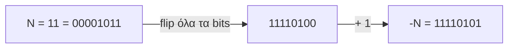

# Κεφάλαιο 2: Μνήμη και Μεταβλητές

<!--  -->

> **Στόχοι:** μετά από αυτό το κεφάλαιο θα μπορείτε να
> - εξηγείτε τι είναι bit, byte και διεύθυνση μνήμης, και πώς διαφέρει η κύρια από
>   τη δευτερεύουσα μνήμη·
> - μετατρέπετε αριθμούς ανάμεσα στο δυαδικό, το δεκαδικό και το δεκαεξαδικό σύστημα·
> - δηλώνετε μεταβλητές, να τους αναθέτετε τιμές και να εξηγείτε τι σημαίνει αυτό για
>   τη μνήμη·
> - επιλέγετε τύπο (`char`, `int`, `unsigned`, `float`, `double`, …) με βάση το εύρος
>   τιμών του·
> - αναπαριστάτε αρνητικούς ακεραίους σε συμπλήρωμα ως προς 2 και να αναγνωρίζετε την
>   υπερχείλιση ακεραίων·
> - τυπώνετε μεταβλητές με την `printf`, χρησιμοποιώντας ακολουθίες διαφυγής και
>   προσδιοριστικά μορφοποίησης.
>
> **Προαπαιτούμενα:** [Κεφάλαιο 0](../00-hello-world/), [Κεφάλαιο 1](../01-command-line/)
>
> **Χρόνος μελέτης:** ~2 ώρες

## Σύνοψη

Ένα πρόγραμμα δουλεύει με δεδομένα, και τα δεδομένα ζουν στη μνήμη του υπολογιστή.
Σε αυτή τη διάλεξη βλέπουμε πώς οργανώνεται η μνήμη (bits, bytes, διευθύνσεις), πώς
γράφουμε αριθμούς στο δυαδικό και στο δεκαεξαδικό σύστημα, και πώς η C μάς δίνει
πρόσβαση στη μνήμη μέσα από **μεταβλητές**: ονόματα για κομμάτια μνήμης με
συγκεκριμένο τύπο. Ο τύπος καθορίζει πόσα bytes πιάνει μια μεταβλητή και πώς
ερμηνεύονται τα bits της (ως χαρακτήρας ASCII, ως ακέραιος με ή χωρίς πρόσημο, ως
πραγματικός). Επειδή τα bytes είναι πεπερασμένα, και οι τιμές που χωράνε είναι
πεπερασμένες: έτσι προκύπτει η υπερχείλιση ακεραίων, πηγή πραγματικών καταστροφών.
Κλείνουμε με την `printf`, το βασικό μας εργαλείο για να βλέπουμε τις τιμές των
μεταβλητών.

## Θεωρία

### Bits και bytes

Το **bit** (binary digit, δυαδικό ψηφίο) είναι η μικρότερη μονάδα πληροφορίας σε
έναν υπολογιστή: παίρνει μία από δύο τιμές, `0` ή `1`. Ένα μόνο bit λέει πολύ λίγα,
γι' αυτό ο υπολογιστής ομαδοποιεί τα bits. **Byte** είναι μια ομάδα από bits που
αποθηκεύονται μαζί σε ένα κελί μνήμης. Σχεδόν πάντα ένα byte έχει 8 bits (λέγεται
και octet, οκτάδα), π.χ. `00101010`.

Κάθε ένα από τα 8 bits είναι ανεξάρτητα `0` ή `1`, άρα υπάρχουν $2^8 = 256$
διαφορετικά bytes. Γενικά, με $n$ bits φτιάχνουμε $2^n$ διαφορετικούς συνδυασμούς.
Αυτός ο απλός κανόνας εξηγεί όλα τα εύρη τιμών που θα δούμε παρακάτω.

### Η μνήμη οργανώνεται σε bytes: διευθύνσεις

Η μνήμη είναι μια μεγάλη σειρά από bytes, το ένα μετά το άλλο: `Byte 0`, `Byte 1`,
`Byte 2`, … . Το μέγεθός της μετριέται σε bytes: 1 KB (KiloByte) = 1.000 bytes,
1 MB (MegaByte) = 1.000.000 bytes, 1 GB (GigaByte) = 1.000.000.000 bytes. Οι
σημειώσεις του μαθήματος χρησιμοποιούν τις δυνάμεις του 2 (1 KB = $2^{10} = 1024$
bytes κ.ο.κ.)· συναντώνται και οι δύο ορισμοί.

Η θέση ενός κελιού στη μνήμη λέγεται **διεύθυνση** (address). Μια μνήμη με $N$ bytes
έχει διευθύνσεις από $0$ έως $N-1$. Για παράδειγμα, αν στο `Byte 2` είναι
αποθηκευμένο το `11100011`, λέμε ότι «στη διεύθυνση 2 υπάρχει το byte
$11100011_{(2)}$». Ο επεξεργαστής διαβάζει και γράφει bytes δίνοντας τη διεύθυνσή
τους. Οι διευθύνσεις θα γίνουν κεντρικές όταν φτάσουμε στους δείκτες
([Κεφάλαιο 11](../11-pointers-recursion/)).

### Κύρια και δευτερεύουσα μνήμη

Η **δευτερεύουσα μνήμη** (secondary memory) αποθηκεύει δεδομένα μόνιμα, σε υλικό
που τα κρατάει ακόμα και χωρίς ρεύμα: σκληροί δίσκοι, flash drives (USB sticks),
DVD. Η **κύρια μνήμη** (primary memory, η RAM) αποθηκεύει δεδομένα προσωρινά (χάνονται
όταν σβήσει ο υπολογιστής), αλλά ο επεξεργαστής έχει άμεση πρόσβαση σε αυτά και
μπορεί να τα επεξεργαστεί. Εκεί ζουν οι μεταβλητές ενός προγράμματος όσο τρέχει.

Όταν λέμε σκέτο «μνήμη», εννοούμε την κύρια μνήμη, εκτός αν διευκρινίσουμε κάτι άλλο.

### Δυαδικό, δεκαεξαδικό και οκταδικό σύστημα

Ένας **δυαδικός αριθμός** γράφεται με δύο σύμβολα, το `0` και το `1`· λέμε ότι
εκφράζεται με βάση το 2, ή στο δυαδικό σύστημα, ή ότι έχει δυαδική αναπαράσταση.
Όπως στο δεκαδικό, κάθε ψηφίο έχει βάρος μια δύναμη της βάσης, με το δεξιότερο ψηφίο
να έχει βάρος $2^0$. Έτσι

$$101010_{(2)} = 1 \cdot 2^5 + 0 \cdot 2^4 + 1 \cdot 2^3 + 0 \cdot 2^2 + 1 \cdot 2^1 + 0 \cdot 2^0 = 42_{(10)}$$

Ο δείκτης $(2)$ ή $(10)$ δείχνει τη βάση. Αντιστρέφοντας τη διαδικασία βρίσκουμε τη
δυαδική αναπαράσταση οποιουδήποτε δεκαδικού αριθμού (δείτε το παράδειγμα
«Μετατροπές ανάμεσα σε βάσεις»).

Ένας **δεκαεξαδικός αριθμός** (hexadecimal) χρησιμοποιεί 16 σύμβολα: `0`–`9` και
`A`–`F`, όπου `A` = 10, …, `F` = 15. Η μετατροπή γίνεται με τον ίδιο τρόπο:

$$2A_{(16)} = 2 \cdot 16^1 + 10 \cdot 16^0 = 42_{(10)}$$

Γιατί μας ενδιαφέρει το δεκαεξαδικό; Επειδή $16 = 2^4$, κάθε δεκαεξαδικό ψηφίο
αντιστοιχεί ακριβώς σε 4 bits, οπότε **ένα byte γράφεται πάντα με δύο δεκαεξαδικά
ψηφία** (`00` έως `FF`). Στο δεκαδικό χρειάζονται έως τρία ψηφία (`0` έως `255`), και
τα ψηφία δεν αντιστοιχούν σε συγκεκριμένα bits. Για παράδειγμα, το ίδιο byte γράφεται:

| Βάση | Αναπαράσταση |
| --- | --- |
| Δυαδικό | `0101 1111` |
| Δεκαεξαδικό | `5F` (`0101` = `5`, `1111` = `F`) |
| Δεκαδικό | `95` ($64 + 16 + 8 + 4 + 2 + 1$) |

Υπάρχει και το **οκταδικό** σύστημα (octal, βάση 8, ψηφία `0`–`7`), όπου κάθε ψηφίο
αντιστοιχεί σε 3 bits. Στη C και τα δύο εμφανίζονται στις σταθερές: `0x2A` είναι
δεκαεξαδικό, `052` (με μηδενικό μπροστά) είναι οκταδικό.

### Μεταβλητές και δηλώσεις

**Μεταβλητή** (variable) είναι ένα τμήμα της μνήμης με συγκεκριμένο όνομα. Για να
χρησιμοποιηθεί μια μεταβλητή στη C πρέπει πρώτα να **δηλωθεί** (declaration) με
κάποιον **τύπο** (type). Η μορφή της δήλωσης είναι

```c
τύπος όνομα;
```

Κάθε μέρος της δήλωσης λέει κάτι στον μεταγλωττιστή:

- ο **τύπος** λέει *πόση* μνήμη να δεσμεύσει για τα περιεχόμενα (και πώς να τα
  ερμηνεύει)·
- το **όνομα** κάνει τον μεταγλωττιστή να διαλέξει τη *διεύθυνση* της μνήμης όπου θα
  αποθηκευτεί η μεταβλητή· από εκεί και πέρα, κάθε φορά που γράφουμε το όνομα, ο
  μεταγλωττιστής ξέρει σε ποια bytes αναφερόμαστε.

Για παράδειγμα, με `int x;` ο μεταγλωττιστής μπορεί να δεσμεύσει 4 bytes για το `x`
ξεκινώντας από το `Byte 0`, ενώ με `char c;` 1 byte, π.χ. το `Byte N-1`. Ποια
ακριβώς διεύθυνση θα επιλεγεί δεν το ελέγχουμε εμείς· το σημαντικό είναι ότι το όνομα
και ο τύπος αρκούν για να βρεθούν τα σωστά bytes.

### Ερμηνεία δυαδικών ψηφίων: χαρακτήρες ASCII

Τα bits στη μνήμη δεν έχουν από μόνα τους νόημα· το νόημα το δίνει ο τύπος. Τα 8 bits
ενός `char` μπορούν να ερμηνευθούν ως **χαρακτήρας** κειμένου, με την αντιστοίχιση
του πίνακα **ASCII**. Για παράδειγμα, ο αριθμός $67_{(10)} = 43_{(16)}$ αντιστοιχεί
στο γράμμα `'C'`, το $65$ στο `'A'`, το $10$ στην αλλαγή γραμμής `'\n'` και το $0$
στον «κενό» χαρακτήρα `'\0'`.

Ο πίνακας ASCII έχει **128** χαρακτήρες (κωδικοί 0–127), επειδή είναι κώδικας 7 bits:
$2^7 = 128$. Οι πρώτοι 32 είναι χαρακτήρες ελέγχου (αλλαγή γραμμής, tab, «καμπανάκι»
κ.ά.) και οι υπόλοιποι γράμματα, ψηφία και σύμβολα. Ολόκληρο τον πίνακα τον βλέπετε
στο τερματικό με την εντολή `man ascii`: η `man` είναι η εντολή του Linux που μας
δίνει το εγχειρίδιο (manual) για ένα πρόγραμμα ή θέμα του συστήματος.

### Αναπαράσταση ακεραίων στη μνήμη

Ο τύπος `int`, που αναπαριστά ακεραίους, πιάνει *συνήθως* 4 bytes, δηλαδή 32 bits. Ο
αριθμός 42 αποθηκεύεται ως

```text
00000000000000000000000000101010   (4 bytes = 32 bit)
```

και η μετατροπή στο δεκαδικό γίνεται όπως πριν, από το δεξιότερο bit:
$0 \cdot 2^0 + 1 \cdot 2^1 + 0 \cdot 2^2 + 1 \cdot 2^3 + \dots = 42$.

Με 32 bits αναπαριστούμε $2^{32} = 4.294.967.296$ διαφορετικούς ακεραίους. Αυτό
φέρνει δύο προβλήματα:

1. **Το εύρος είναι πεπερασμένο.** Περίπου 4 δισεκατομμύρια τιμές ίσως να μην αρκούν
   για το πρόγραμμά μας. Ευτυχώς η C προσφέρει τύπους με μεγαλύτερο μέγεθος (π.χ. 64
   bit). Το πρόβλημα είναι υπαρκτό: το [πρόβλημα του 2038](https://en.wikipedia.org/wiki/Year_2038_problem)
   οφείλεται στο ότι πολλά συστήματα μετράνε τον χρόνο σε δευτερόλεπτα σε έναν
   προσημασμένο ακέραιο 32 bit, που θα εξαντληθεί το 2038.
2. **Υπάρχουν και αρνητικοί ακέραιοι.** Πώς αναπαριστούμε στο δυαδικό ότι ένας
   αριθμός είναι αρνητικός; Η απάντηση της C (και σχεδόν όλων των επεξεργαστών) είναι
   το συμπλήρωμα ως προς 2.

### Συμπλήρωμα ως προς 2

Στο **συμπλήρωμα ως προς 2** (two's complement) το πρόσημο φαίνεται από το
σημαντικότερο (αριστερότερο) bit του αριθμού: `0` σημαίνει θετικό (ή μηδέν), `1`
σημαίνει αρνητικό. Για να πάρουμε την αναπαράσταση του $-N$ από έναν θετικό δυαδικό
$N$:

1. αντιστρέφουμε (flip) όλα τα bits του $N$·
2. προσθέτουμε 1.



*Σχήμα: τα δύο βήματα για το $-11$ σε 8 bits.*

Γιατί αυτή η επιλογή; Επειδή με αυτήν η πρόσθεση δουλεύει με το ίδιο κύκλωμα για
θετικούς και αρνητικούς: αν προσθέσετε `00001011` και `11110101`, παίρνετε
`1 00000000`, και το κρατούμενο που περισσεύει από τα 8 bits χάνεται, οπότε μένει $0$.
Συνέπεια για τα εύρη: με $n$ bits ένας προσημασμένος ακέραιος παίρνει τιμές από
$-2^{n-1}$ έως $2^{n-1}-1$ (για 8 bits: $-128$ έως $127$), ενώ ένας μη προσημασμένος
(unsigned) από $0$ έως $2^n - 1$ (για 8 bits: $0$ έως $255$).

### Οι τύποι μεταβλητών της C

Ο πίνακας συνοψίζει τους βασικούς τύπους, με τα συνηθισμένα μεγέθη που δίνουν οι
διαφάνειες. Τα μεγέθη δεν είναι εγγυημένα: εξαρτώνται από τον μεταγλωττιστή και το
σύστημα.

| Τύπος | Συνήθως (bytes) | Εύρος τιμών | Παράδειγμα τιμής |
| --- | --- | --- | --- |
| `char` | 1 | $-128$ … $127$ | `'B'`, `0x42` |
| `short int` | 2 | $-32.768$ … $32.767$ | `42` |
| `int` | 4 | $-2.147.483.648$ … $2.147.483.647$ | `42` |
| `long int` | 4 | όπως το `int` | `42L` |
| `float` | 4 | θετικές από $1.17 \cdot 10^{-38}$ έως $3.4 \cdot 10^{38}$ | `42.42F` |
| `double` | 8 | θετικές από $2.2 \cdot 10^{-308}$ έως $1.8 \cdot 10^{308}$ | `42.42` |
| `long double` | 8, 10, 12, 16 | | `42.42L` |
| `unsigned char` | 1 | $0$ … $255$ | `'B'`, `0x42` |
| `unsigned short int` | 2 | $0$ … $65.535$ | `42` |
| `unsigned int` | 4 | $0$ … $4.294.967.295$ | `42` |
| `unsigned long int` | 4 | $0$ … $4.294.967.295$ | `42LU` |

Παρατηρήστε ότι:

- κάθε ακέραιος τύπος έχει και μια `unsigned` εκδοχή με το ίδιο μέγεθος, που δεν
  αναπαριστά αρνητικούς και φτάνει στο διπλάσιο θετικό όριο·
- τα εύρη βγαίνουν κατευθείαν από τον κανόνα $2^n$ και το συμπλήρωμα ως προς 2·
- τα γράμματα στο τέλος μιας σταθεράς ορίζουν τον τύπο της: `L` για `long`, `U` για
  `unsigned`, `F` για `float`· ένας πραγματικός χωρίς κατάληξη (`42.42`) είναι
  `double`·
- ο `long int` είναι 4 bytes σε κάποια συστήματα (π.χ. Windows) αλλά 8 bytes στο
  Linux 64 bit που χρησιμοποιούμε στο εργαστήριο. Ο `long long int` (δεν είναι στον
  πίνακα των διαφανειών) είναι συνήθως 8 bytes σε όλα.

### Ανάθεση σε μεταβλητή

**Ανάθεση** (assignment) είναι η αποθήκευση μιας τιμής σε μια μεταβλητή. Μπορεί να
γίνει κατά τον ορισμό της (αυτό λέγεται **αρχικοποίηση**, initialization) ή αργότερα:

```c
int x = 42;   // ανάθεση κατά τον ορισμό
int y;
y = 42;       // ανάθεση μετά τον ορισμό
int z = 0x2A; // η ίδια τιμή σε δεκαεξαδικό
int w = 052;  // και σε οκταδικό
```

Και οι τέσσερις μεταβλητές έχουν την ίδια τιμή: $42$. Η βάση στην οποία γράφουμε μια
σταθερά αφορά μόνο τον πηγαίο κώδικα· στη μνήμη αποθηκεύονται πάντα τα ίδια bits.

Τι υπάρχει σε μια μεταβλητή *πριν* την ανάθεση; Ό,τι έτυχε να βρίσκεται σε εκείνα τα
bytes: ο μεταγλωττιστής δεσμεύει τη μνήμη, αλλά δεν τη «καθαρίζει». Γι' αυτό μια
μεταβλητή χωρίς ανάθεση έχει απρόβλεπτη τιμή («σκουπίδια») και δεν πρέπει να τη
διαβάζουμε. Μετά την `x = 42;`, τα 4 bytes της `x` γίνονται:

| Byte | Πριν την ανάθεση | Μετά την ανάθεση |
| --- | --- | --- |
| `Byte 0` | `00101010` | `00000000` |
| `Byte 1` | `01000010` | `00000000` |
| `Byte 2` | `11100011` | `00000000` |
| `Byte 3` | `11100011` | `00101010` |

Η διάταξη αυτή (το λιγότερο σημαντικό byte στο τέλος) είναι η σχηματική των
διαφανειών. Στους επεξεργαστές x86 που χρησιμοποιούμε, τα bytes ενός `int`
αποθηκεύονται με την αντίστροφη σειρά (little endian)· το θέμα επανέρχεται στο
[Κεφάλαιο 12](../12-pointers-arrays/).

### Υπερχείλιση ακεραίων

Αφού ένας `int` χωράει τιμές έως $2.147.483.647$, τι γίνεται αν ένας υπολογισμός
βγάλει μεγαλύτερο αποτέλεσμα; Τα bits που δεν χωράνε χάνονται και το αποτέλεσμα
«τυλίγεται» γύρω από το εύρος: αυτό λέγεται **υπερχείλιση ακεραίων** (integer
overflow). Για παράδειγμα, $2.000.000.000 + 2.000.000.000 = 4.000.000.000$ δεν χωράει
σε `int`, και το πρόγραμμα τυπώνει $4.000.000.000 - 2^{32} = -294.967.296$ (δείτε το
παράδειγμα «Το πρόγραμμα overflow»). Όπως στα γνωστά
σκίτσα με τα προβατάκια: μετράμε `32767` και το επόμενο είναι `-32768`.

Για προσημασμένους ακεραίους, η υπερχείλιση είναι στην πραγματικότητα
**απροσδιόριστη συμπεριφορά** (undefined behavior) στη C: το «τύλιγμα» είναι αυτό που
συνήθως βλέπουμε, αλλά ο μεταγλωττιστής δεν το εγγυάται. Για `unsigned` τύπους το
τύλιγμα (modulo $2^n$) είναι εγγυημένο. Η διόρθωση είναι πάντα η ίδια: επιλέξτε
τύπο με αρκετό εύρος για τις τιμές που θα χρειαστείτε.

Η υπερχείλιση δεν είναι θεωρητικό πρόβλημα. Η πρώτη πτήση του πυραύλου
[Ariane 5](https://en.wikipedia.org/wiki/Ariane_flight_V88) (1996) κατέληξε σε
καταστροφή, επειδή μια πραγματική τιμή μετατράπηκε σε ακέραιο 16 bit που δεν τη
χωρούσε. Το [πρόβλημα του 2000](https://en.wikipedia.org/wiki/Year_2000_problem)
(αποθήκευση του έτους με δύο ψηφία) και το πρόβλημα του 2038 είναι συγγενικά
προβλήματα αναπαράστασης.

### Ακέραιοι με συγκεκριμένο μέγεθος: sizeof και stdint.h

Είπαμε ότι ο `int` είναι *συνήθως* 4 bytes. Υπάρχουν δύο τρόποι να είμαστε βέβαιοι:

- Ο τελεστής **`sizeof`** δίνει το μέγεθος ενός τύπου ή μιας μεταβλητής σε bytes,
  π.χ. `sizeof(int)`. Θα τον δούμε αναλυτικά σε επόμενες διαλέξεις.
- Η βιβλιοθήκη **`<stdint.h>`** ορίζει ακέραιους τύπους με εγγυημένο πλήθος bits:
  `int8_t`, `uint8_t`, `int16_t`, `uint16_t`, `int32_t`, `uint32_t`, `int64_t`,
  `uint64_t`. Ο αριθμός είναι τα bits, και το `u` σημαίνει `unsigned`.

### Η συνάρτηση printf

Η συνάρτηση `printf()` τυπώνει δεδομένα στο αρχείο εξόδου **stdout** (standard
output), που συνήθως είναι το τερματικό. Έχει μεταβλητή λίστα παραμέτρων:

- Η πρώτη παράμετρος είναι το **αλφαριθμητικό μορφοποίησης** (format string): μια
  ακολουθία χαρακτήρων μέσα σε διπλά εισαγωγικά `" "`, που καθορίζει πώς θα
  τυπωθούν τα δεδομένα.
- Οι επόμενες παράμετροι είναι προαιρετικές· αν υπάρχουν, η `printf()` χρησιμοποιεί
  τις τιμές τους.

Το format string μπορεί να περιέχει τρία είδη πραγμάτων: απλούς χαρακτήρες, που
τυπώνονται όπως είναι· **ακολουθίες διαφυγής** (escape sequences)· και
**προσδιοριστικά μορφοποίησης** (format specifiers). Για παράδειγμα, στο
`printf("x = %d\n", x);` το `x = ` τυπώνεται αυτούσιο, το `%d` αντικαθίσταται από
την τιμή του `x` ως ακέραιος και το `\n` αλλάζει γραμμή.

### Ακολουθίες διαφυγής

Μια ακολουθία διαφυγής αποτελείται από μια ανάστροφη κεκλιμένη `\` (backslash) και
έναν χαρακτήρα. Χρησιμεύει για χαρακτήρες που δεν γράφονται εύκολα μέσα σε
εισαγωγικά: αλλαγή γραμμής, tab, ή τα ίδια τα `"` και `\`.

| Ακολουθία | Σημασία |
| --- | --- |
| `\n` | Αλλαγή γραμμής, σαν το πλήκτρο Enter |
| `\r` | Επαναφορά του δρομέα (cursor) στην αρχή της τρέχουσας γραμμής |
| `\t` | Κενό ίσο με ένα tab, σαν το πλήκτρο Tab |
| `\\` | Ανάστροφη κεκλιμένη (backslash) |
| `\"` | Διπλά εισαγωγικά (double quotes) |
| `\xNN` | Ο χαρακτήρας με κωδικό `NN` σε δεκαεξαδικό |
| `\a` | Ηχητικό σήμα (bell) |

Οι ακολουθίες διαφυγής είναι χαρακτήρες ASCII: στον πίνακα της `man ascii` θα δείτε
το `'\n'` με κωδικό 10, το `'\t'` με 9, το `'\a'` με 7. Έτσι το `"\x43"` τυπώνει `C`.

### Προσδιοριστικά μορφοποίησης

Ένα προσδιοριστικό μορφοποίησης αποτελείται από τον χαρακτήρα `%` και έναν ή
περισσότερους χαρακτήρες που λένε πώς να γίνει η μορφοποίηση. Κάθε προσδιοριστικό
«καταναλώνει» με τη σειρά την επόμενη παράμετρο της `printf`.

| Προσδιοριστικό | Σημασία |
| --- | --- |
| `%c` | Χαρακτήρας ASCII |
| `%d` ή `%i` | Ακέραιος (`int`) |
| `%u` | Μη προσημασμένος (`unsigned`) ακέραιος |
| `%f` | Πραγματικός (`float` ή `double`) |
| `%llu` | `unsigned long long int` |
| `%%` | Ο ίδιος ο χαρακτήρας `%` |

Τα προσδιοριστικά πρέπει να ταιριάζουν με τον τύπο της τιμής: το `%d` περιμένει
`int`, το `%lld` `long long`, το `%ld` `long`. Η πλήρης λίστα είναι στο
[εγχειρίδιο της printf](https://cplusplus.com/reference/cstdio/printf/)· το
[Εργαστήριο 3](https://progintro.github.io/lab-material/labs/lab03/) έχει έναν
συνοπτικό πίνακα. Το ίδιο byte μπορεί να τυπωθεί με διαφορετικούς τρόπους: με `%c`
ένας `char` που έχει τιμή 67 τυπώνεται `C`, με `%d` τυπώνεται `67`.

### Δηλώσεις πολλών μεταβλητών και δεσμευμένες λέξεις

Μεταβλητές του ίδιου τύπου μπορούν να δηλωθούν στην ίδια γραμμή, χωρισμένες με
κόμμα. Οι δύο παρακάτω μορφές είναι ισοδύναμες:

```c
int a;
int b;
int c;
```

```c
int a, b, c;
```

Τα ονόματα μεταβλητών αποτελούνται από γράμματα, ψηφία και `_`, και δεν ξεκινούν με
ψηφίο. Οι **δεσμευμένες λέξεις** (reserved keywords) της C έχουν προκαθορισμένο
νόημα για τον μεταγλωττιστή και **δεν** επιτρέπεται να χρησιμοποιηθούν ως ονόματα
μεταβλητών ή συναρτήσεων:

```text
auto      do        goto      signed    unsigned
break     double    if        sizeof    void
case      else      int       static    volatile
char      enum      long      struct    while
const     extern    register  switch
continue  for       return    typedef
default   float     short     union
```

Πολλές από αυτές τις γνωρίσατε ήδη (`int`, `char`, `return`)· οι υπόλοιπες θα
εμφανιστούν στα επόμενα κεφάλαια.

## Παραδείγματα

### Μετατροπές ανάμεσα σε βάσεις

*Εφαρμόζει: «Δυαδικό, δεκαεξαδικό και οκταδικό σύστημα».*

**Από δυαδικό σε δεκαδικό:** πολλαπλασιάζουμε κάθε ψηφίο με τη δύναμη του 2 της θέσης
του και προσθέτουμε: $101010_{(2)} = 32 + 8 + 2 = 42$. Με τα βάρη
`128 64 32 16 8 4 2 1` γραμμένα πάνω από τα bits, το `01011111` δίνει
$64 + 16 + 8 + 4 + 2 + 1 = 95$.

**Από δεκαδικό σε δυαδικό:** αντιστρέφουμε τη διαδικασία. Διαιρούμε διαδοχικά με το 2
και κρατάμε τα υπόλοιπα· διαβασμένα από το τελευταίο προς το πρώτο, δίνουν τα bits:

```text
42 / 2 = 21  υπόλοιπο 0
21 / 2 = 10  υπόλοιπο 1
10 / 2 =  5  υπόλοιπο 0
 5 / 2 =  2  υπόλοιπο 1
 2 / 2 =  1  υπόλοιπο 0
 1 / 2 =  0  υπόλοιπο 1   ->  42 = 101010 (2)
```

**Από δυαδικό σε δεκαεξαδικό και πίσω:** χωρίζουμε σε τετράδες από δεξιά και
μετατρέπουμε κάθε τετράδα σε ένα ψηφίο: `0101 1111` → `5F`, `0010 1010` → `2A`.
Αντίστροφα, `2A` → `0010 1010`. Έτσι τα `42`, `0x2A` και `052` στη C είναι ο ίδιος
αριθμός.

### Ο πίνακας ASCII στο τερματικό

*Εφαρμόζει: «Ερμηνεία δυαδικών ψηφίων: χαρακτήρες ASCII».*

Η διάλεξη ρώτησε: ποια εντολή του Linux μάς επιτρέπει να μάθουμε για ένα πρόγραμμα;
Η απάντηση είναι η `man`, που δεν περιορίζεται σε προγράμματα:

```sh
man ascii
```

Ανοίγει τη σελίδα `ascii(7)` με στήλες `Oct`, `Dec`, `Hex`, `Char`. Εκεί διαβάζετε,
για παράδειγμα:

```text
Oct   Dec   Hex   Char
103   67    43    C
012   10    0A    LF  '\n' (new line)
```

Βγαίνετε με `q`. Το ίδιο κάνετε και για τις συναρτήσεις της C: `man 3 printf`.

### Συμπλήρωμα ως προς 2 για το −11

*Εφαρμόζει: «Συμπλήρωμα ως προς 2».*

Έστω $N = 11_{(10)} = 00001011_{(2)}$ σε 8 bits. Για το $-N$:

```text
N           00001011
flip        11110100
+ 1       + 00000001
-N          11110101
```

Επαλήθευση: το σημαντικότερο bit είναι `1`, άρα ο αριθμός είναι αρνητικός· και
`00001011 + 11110101 = 1 00000000`, όπου το 9ο bit χάνεται και μένει $0 = 11 + (-11)$.
Αν διαβάσουμε τα ίδια bits ως `unsigned char`, παίρνουμε $245 = 256 - 11$: τα bits
είναι ίδια, αλλάζει μόνο η ερμηνεία.

### Το πρόγραμμα overflow

*Εφαρμόζει: «Υπερχείλιση ακεραίων», «Οι τύποι μεταβλητών της C».*

Τι θα τυπώσει το παρακάτω πρόγραμμα;

```c
#include <stdio.h>

int main() {
  printf("%d\n", 2000000000 + 2000000000);
  return 0;
}
```

```text
$ ./overflow
-294967296
```

Τι συνέβη; Και οι δύο σταθερές είναι `int`, άρα και το άθροισμα υπολογίζεται ως
`int`. Το σωστό αποτέλεσμα, $4.000.000.000$, ξεπερνάει το μέγιστο $2.147.483.647$, και
τα 32 bits που μένουν ερμηνεύονται σε συμπλήρωμα ως προς 2 ως
$4.000.000.000 - 2^{32} = -294.967.296$. Ο gcc συνήθως προειδοποιεί ήδη στη
μεταγλώττιση (`integer overflow in expression of type 'int'`)· μην αγνοείτε τις
προειδοποιήσεις.

Πώς το διορθώνουμε; Κάνουμε τον υπολογισμό σε τύπο 64 bit και τυπώνουμε με το
αντίστοιχο προσδιοριστικό:

```c
#include <stdio.h>

int main() {
  printf("%lld\n", 2000000000LL + 2000000000LL);
  return 0;
}
```

```text
$ ./overflow
4000000000
```

Η κατάληξη `LL` κάνει τις σταθερές `long long`. Αφού το αποτέλεσμα είναι θετικό, θα
μπορούσαμε να χρησιμοποιήσουμε και `unsigned int` με `%u` (χωράει έως
$4.294.967.295$), αλλά με πολύ μικρό περιθώριο.

### Τύποι και printf σε ένα πρόγραμμα

*Εφαρμόζει: «Ερμηνεία δυαδικών ψηφίων», «Ακολουθίες διαφυγής», «Προσδιοριστικά
μορφοποίησης».* Το πρόγραμμα δεν είναι από τις διαφάνειες· συνδυάζει τους πίνακές
τους για να τους δοκιμάσετε:

```c
#include <stdio.h>

int main() {
  char c = 'C';
  unsigned int u = 4000000000U;
  printf("c = %c (%d), x = %d\n", c, c, 0x2A);
  printf("u = %u, sizeof(int) = %zu\n", u, sizeof(int));
  printf("100%% \"done\"\tbye\\\n");
  return 0;
}
```

```text
$ ./types
c = C (67), x = 42
u = 4000000000, sizeof(int) = 4
100% "done"	bye\
```

Ο ίδιος `char` τυπώνεται ως γράμμα με `%c` και ως κωδικός ASCII με `%d`· το
`4000000000` χωράει σε `unsigned int` αλλά όχι σε `int`· το αποτέλεσμα της `sizeof`
τυπώνεται με `%zu`· στην τελευταία γραμμή, `%%` δίνει `%`, `\"` δίνει `"`, `\t` ένα
tab και `\\` μια `\`.

### Συμβουλές για το εργαστήριο

- Στο [Εργαστήριο 2](https://progintro.github.io/lab-material/labs/lab02/), τυπώστε
  το `number` του `readint.c` *πριν* το διαβάσετε: θα δείτε ό,τι είχε η μνήμη. Η
  επέκταση «Υψηλή ακρίβεια» του `calc.c` ζητάει αριθμούς έως $10^{18}$, που δεν
  χωράνε σε `int`· χρειάζεστε `long long` με `%lld`.
- Το [Εργαστήριο 3](https://progintro.github.io/lab-material/labs/lab03/) έχει στην
  αρχή πίνακα με τα προσδιοριστικά (`%d`, `%ld`, `%lld`, `%u`, `%lu`, `%llu`, `%f`,
  `%Lf`). Παράξενα αρνητικά αποτελέσματα για μεγάλους αριθμούς σημαίνουν σχεδόν
  πάντα υπερχείλιση.

## Κύρια σημεία

1. Το bit είναι η μικρότερη μονάδα πληροφορίας (0 ή 1)· ένα byte είναι συνήθως 8
   bits, και γενικά με $n$ bits αναπαριστούμε $2^n$ τιμές (256 για ένα byte).
2. Η μνήμη είναι μια σειρά από bytes και η θέση κάθε byte λέγεται διεύθυνση·
   «μνήμη» σκέτο σημαίνει την κύρια (προσωρινή, άμεσα προσβάσιμη) και όχι τη
   δευτερεύουσα (μόνιμη) μνήμη.
3. Ο ίδιος αριθμός γράφεται διαφορετικά σε κάθε βάση· ένα byte γράφεται πάντα με δύο
   δεκαεξαδικά ψηφία, επειδή κάθε δεκαεξαδικό ψηφίο είναι 4 bits.
4. Μεταβλητή είναι ένα τμήμα της μνήμης με όνομα και πρέπει να δηλωθεί με τύπο· ο
   τύπος ορίζει πόση μνήμη δεσμεύεται και το όνομα οδηγεί στη διεύθυνσή της.
5. Τα bits δεν έχουν νόημα από μόνα τους: ο τύπος ορίζει αν ερμηνεύονται ως
   χαρακτήρας ASCII (128 χαρακτήρες, `man ascii`), ακέραιος ή πραγματικός.
6. Ο `int` είναι συνήθως 4 bytes (32 bits), άρα έχει πεπερασμένο εύρος· τα μεγέθη
   των τύπων είναι «συνήθη» και όχι εγγυημένα, και κάθε ακέραιος έχει `unsigned`
   εκδοχή.
7. Οι αρνητικοί ακέραιοι αναπαρίστανται σε συμπλήρωμα ως προς 2: αντιστρέφουμε όλα
   τα bits και προσθέτουμε 1· το σημαντικότερο bit δείχνει το πρόσημο.
8. Μια μεταβλητή παίρνει τιμή κατά τον ορισμό της ή αργότερα, με σταθερά σε δεκαδικό,
   δεκαεξαδικό (`0x2A`) ή οκταδικό (`052`)· πριν την πρώτη ανάθεση περιέχει ό,τι
   υπήρχε στη μνήμη.
9. Όταν ένα αποτέλεσμα δεν χωράει στον τύπο του έχουμε υπερχείλιση: το
   `2000000000 + 2000000000` σε `int` τυπώνει `-294967296`· η διόρθωση είναι τύπος με
   μεγαλύτερο εύρος.
10. Με `sizeof` μαθαίνουμε το μέγεθος ενός τύπου, και με το `<stdint.h>` δηλώνουμε
    ακεραίους με ακριβές πλήθος bits (`int32_t`, `uint64_t` κ.ά.).
11. Η `printf` τυπώνει στο stdout· το format string περιέχει απλούς χαρακτήρες,
    ακολουθίες διαφυγής (`\n`, `\t`, `\\`, `\"`) και προσδιοριστικά (`%c`, `%d`, `%u`,
    `%f`, `%llu`, `%%`) που πρέπει να ταιριάζουν με τους τύπους των τιμών.
12. Μεταβλητές ίδιου τύπου δηλώνονται μαζί με κόμμα (`int a, b, c;`), και οι
    δεσμευμένες λέξεις δεν μπορούν να γίνουν ονόματα.

## Ορολογία

| Ελληνικά | English | Σύντομος ορισμός |
| --- | --- | --- |
| δυαδικό ψηφίο | bit (binary digit) | Η μικρότερη μονάδα πληροφορίας: 0 ή 1 |
| byte, οκτάδα | byte, octet | Ομάδα (συνήθως 8) bits σε ένα κελί μνήμης |
| διεύθυνση | address | Η θέση ενός κελιού (byte) στη μνήμη |
| κύρια μνήμη | primary memory (RAM) | Προσωρινή μνήμη με άμεση πρόσβαση από τον επεξεργαστή |
| δευτερεύουσα μνήμη | secondary memory | Μόνιμη αποθήκευση: δίσκοι, flash, DVD |
| δυαδικό σύστημα | binary | Αρίθμηση με βάση το 2 |
| δεκαεξαδικό σύστημα | hexadecimal | Αρίθμηση με βάση το 16 (`0`–`9`, `A`–`F`) |
| οκταδικό σύστημα | octal | Αρίθμηση με βάση το 8 |
| μεταβλητή | variable | Τμήμα της μνήμης με όνομα και τύπο |
| δήλωση | declaration | Εισαγωγή μεταβλητής με τύπο και όνομα |
| τύπος | type | Πόση μνήμη πιάνει μια τιμή και πώς ερμηνεύεται |
| ανάθεση | assignment | Αποθήκευση τιμής σε μεταβλητή (`x = 42;`) |
| αρχικοποίηση | initialization | Ανάθεση κατά τον ορισμό (`int x = 42;`) |
| πίνακας ASCII | ASCII table | Αντιστοίχιση κωδικών 0–127 σε χαρακτήρες |
| συμπλήρωμα ως προς 2 | two's complement | Αναπαράσταση αρνητικών: flip όλα τα bits και +1 |
| μη προσημασμένος | unsigned | Ακέραιος τύπος χωρίς αρνητικές τιμές |
| υπερχείλιση ακεραίων | integer overflow | Αποτέλεσμα που δεν χωράει στον τύπο του |
| αλφαριθμητικό μορφοποίησης | format string | Η πρώτη παράμετρος της `printf` |
| ακολουθία διαφυγής | escape sequence | `\` και ένας χαρακτήρας, π.χ. `\n` |
| προσδιοριστικό μορφοποίησης | format specifier | `%` και χαρακτήρες, π.χ. `%d` |
| τυπική έξοδος | standard output (stdout) | Το αρχείο όπου γράφει η `printf` |
| δεσμευμένη λέξη | reserved keyword | Λέξη της C που δεν γίνεται όνομα (`int`, `if`, …) |

## Συχνά λάθη

- **Υπερχείλιση σε `int`.** Γινόμενα ή αθροίσματα μεγάλων αριθμών βγαίνουν ξαφνικά
  αρνητικά (`2000000000 + 2000000000` → `-294967296`). Διόρθωση: `long long` με
  `%lld`, ή `unsigned long long` με `%llu`, και σταθερές με κατάληξη `LL`.
- **Μεγάλος τύπος, μικρός υπολογισμός.** `long long r = 2000000000 + 2000000000;`
  εξακολουθεί να υπερχειλίζει, γιατί το άθροισμα υπολογίζεται σε `int` *πριν* την
  ανάθεση. Διόρθωση: `2000000000LL + 2000000000`.
- **Λάθος προσδιοριστικό στην `printf`.** `printf("%d\n", x)` με `long long x` ή
  `printf("%d\n", 3.14)` τυπώνει σκουπίδια· ο gcc με `-Wall` προειδοποιεί
  (`format '%d' expects argument of type 'int'`). Διόρθωση: το προσδιοριστικό του
  τύπου (`%lld`, `%f`, `%zu` για `sizeof`).
- **Ανάγνωση μεταβλητής χωρίς τιμή.** `int n; printf("%d\n", n);` τυπώνει ό,τι
  υπήρχε στη μνήμη. Διόρθωση: αρχικοποιείτε πάντα πριν διαβάσετε.
- **Μηδενικό μπροστά από σταθερά.** `int x = 052;` δεν είναι 52 αλλά 42, γιατί είναι
  οκταδικό. Διόρθωση: μη γράφετε αρχικά μηδενικά σε δεκαδικές σταθερές.
- **`%` ή `\` χωρίς διαφυγή.** `printf("100%\n")` δεν τυπώνει `100%`. Διόρθωση:
  `%%` και `\\`.
- **Δεσμευμένη λέξη ως όνομα.** `int int = 5;` ή `int new, for;` δεν μεταγλωττίζεται
  (`expected identifier`). Διόρθωση: άλλο όνομα.

## Διάβασμα

- **Διαφάνειες:** [Διάλεξη 2](https://github.com/progintro/progintro.github.io/releases/download/2025/lec02.pdf), σελ. 1–35. Bits, bytes και διευθύνσεις: σελ. 5–8· βάσεις αρίθμησης: σελ. 9–11· δήλωση μεταβλητής: σελ. 12–15· ASCII: σελ. 16–17· αναπαράσταση ακεραίων και συμπλήρωμα ως προς 2: σελ. 18–22· τύποι: σελ. 23· ανάθεση: σελ. 24–25· υπερχείλιση και `<stdint.h>`: σελ. 26–27· `printf`: σελ. 28–30· δηλώσεις πολλών μεταβλητών και δεσμευμένες λέξεις: σελ. 31–32.
- **Σημειώσεις:** Οι διαφάνειες συνιστούν να έχετε καλύψει τις σημειώσεις του κ. Σταματόπουλου μέχρι τη σελίδα 35 και τις σελίδες 58–71 (K04). Για αυτό το κεφάλαιο ειδικά:
  - [Κεφάλαιο 0: Εισαγωγή](https://progintro.github.io/notes/chapters/00-intro/), ενότητες «Η δομή του υπολογιστή», «Η πληροφορία στον υπολογιστή» (K04, σελ. 9–10)
  - [Κεφάλαιο 2: Μεταβλητές, τύποι, τελεστές και παραστάσεις](https://progintro.github.io/notes/chapters/02-types-operators/), ενότητα «Μεταβλητές, σταθερές, τύποι και δηλώσεις στην C» (K04, σελ. 30–33)
  - Οι σελίδες 58–71 καλύπτουν το [Κεφάλαιο 4: Συναρτήσεις](https://progintro.github.io/notes/chapters/04-functions/) μέχρι την ενότητα «Μετατροπές μεταξύ δεκαδικών και δυαδικών αριθμών», προετοιμασία για το [Κεφάλαιο 3](../03-functions/).
- **Εργαστήριο:**
  - [Εργαστήριο 2](https://progintro.github.io/lab-material/labs/lab02/): «Βήμα 3» (`readint.c`), ασκήσεις `calc.c` (με την επέκταση «Υψηλή ακρίβεια») και `pyth.c`
  - [Εργαστήριο 3](https://progintro.github.io/lab-material/labs/lab03/): ο πίνακας προσδιοριστικών της `printf` και η άσκηση `seq.c`
- **Βιβλίο:** K&R, §2.1–2.4, όπως προτείνουν οι σημειώσεις.
- **Άλλα:**
  - [Bits and bytes](https://web.stanford.edu/class/cs101/bits-bytes.html) (Stanford CS101)
  - Wikipedia: [ASCII](https://en.wikipedia.org/wiki/ASCII), [Escape sequences in C](https://en.wikipedia.org/wiki/Escape_sequences_in_C), [Two's complement](https://en.wikipedia.org/wiki/Two%27s_complement), [Integer overflow](https://en.wikipedia.org/wiki/Integer_overflow)
  - `printf`: [tips](https://web.mit.edu/10.001/Web/Course_Notes/c_Notes/tips_printf.html) και [reference](https://cplusplus.com/reference/cstdio/printf/)
  - Συμπλήρωμα ως προς 2: [γραπτή εξήγηση](https://www.cs.cornell.edu/~tomf/notes/cps104/twoscomp.html) και [βίντεο](https://www.youtube.com/watch?v=O8AzBv6EG3c)
  - Προβλήματα αναπαράστασης: [Ariane 5](https://en.wikipedia.org/wiki/Ariane_flight_V88), [Year 2000](https://en.wikipedia.org/wiki/Year_2000_problem), [Year 2038](https://en.wikipedia.org/wiki/Year_2038_problem), [xkcd 2697](https://xkcd.com/2697/)
  - Τερματικό: `man ascii`, `man 3 printf`

## Ασκήσεις

<!-- exercises -->

### Από τις διαφάνειες

- [Πόσοι χαρακτήρες ASCII υπάρχουν](../../questions/slides/slides-lec02-ascii-count.md): Διάλεξη 2: Μνήμη και Μεταβλητές, διαφάνεια 17 · ★☆☆ · short-answer
- [Πόσα διαφορετικά bytes υπάρχουν](../../questions/slides/slides-lec02-byte-values.md): Διάλεξη 2: Μνήμη και Μεταβλητές, διαφάνεια 5 · ★☆☆ · short-answer
- [Δεκαεξαδικά ψηφία ενός byte](../../questions/slides/slides-lec02-hex-digits.md): Διάλεξη 2: Μνήμη και Μεταβλητές, διαφάνεια 10 · ★☆☆ · short-answer
- [Πόσο μεγάλος είναι ένας int](../../questions/slides/slides-lec02-int-size.md): Διάλεξη 2: Μνήμη και Μεταβλητές, διαφάνεια 27 · ★☆☆ · short-answer
- [Ακέραιοι με 32 bit](../../questions/slides/slides-lec02-int32-count.md): Διάλεξη 2: Μνήμη και Μεταβλητές, διαφάνεια 18 · ★☆☆ · short-answer
- [Η εντολή για να μάθουμε για ένα πρόγραμμα](../../questions/slides/slides-lec02-man.md): Διάλεξη 2: Μνήμη και Μεταβλητές, διαφάνεια 16 · ★☆☆ · tooling
- [Αρνητικοί αριθμοί σε συμπλήρωμα ως προς 2](../../questions/slides/slides-lec02-twos-complement.md): Διάλεξη 2: Μνήμη και Μεταβλητές, διαφάνεια 21 · ★☆☆ · short-answer
- [Υπερχείλιση ακεραίων](../../questions/slides/slides-lec02-overflow.md): Διάλεξη 2: Μνήμη και Μεταβλητές, διαφάνεια 26 · ★★☆ · debug

### Από τα εργαστήρια

- [Στοιχεία φοιτητή (Παλιό θέμα)](../../questions/labs/lab-lab00-about.md): Εργαστήριο 0, Άσκηση 1 · ★☆☆ · programming
- [Υπερχείλιση ακεραίων](../../questions/labs/lab-lab00-overflow.md): Εργαστήριο 0, Άσκηση 2 · ★☆☆ · short-answer
- [Εκτύπωση χαρακτήρων](../../questions/labs/lab-lab04-printchar.md): Εργαστήριο 4, Άσκηση 1 · ★☆☆ · programming

### Από τα θέματα εξετάσεων

- [Rickroll Τριπλέτες](../../questions/exams/exam-2023-fall-ex4-q3.md): Online τελική εξέταση Δεκεμβρίου 2023, Εξέταση #4 (Rick Astley Themed), Θέμα 3 · ★★★ · programming

### Σχετικές ασκήσεις από άλλα κεφάλαια

- [Η συνάρτηση about](../../questions/exams/exam-2024-sep-q1.md): Εξέταση Σεπτεμβρίου 2024, Θέμα 1 · ★☆☆ · programming (κεφ. 3)
- [Διακοπή ρεύματος και μνήμη](../../questions/slides/slides-lec03-power-outage.md): Διάλεξη 3: Συναρτήσεις, διαφάνεια 3 · ★☆☆ · multiple-choice (κεφ. 3)
- [Τυπώνοντας τον Πίνακα ASCII](../../questions/exams/exam-2023-fall-ex15-q2.md): Online τελική εξέταση Δεκεμβρίου 2023, Εξέταση #15, Θέμα 2 · ★★☆ · programming (κεφ. 6)
- [Μέγιστος Κοινός Διαιρέτης](../../questions/exams/exam-2023-fall-ex6-q1.md): Online τελική εξέταση Δεκεμβρίου 2023, Εξέταση #6 (Crypto Themed), Θέμα 1 · ★☆☆ · programming (κεφ. 6)
- [Mystery](../../questions/exams/exam-2025-sep-q1.md): Εξέταση Σεπτεμβρίου 2025, Θέμα 1 · ★☆☆ · trace (κεφ. 6)
- [Mystery](../../questions/exams/exam-2026-sep-q1.md): Εξέταση Σεπτεμβρίου 2026, Θέμα 1 · ★☆☆ · trace (κεφ. 6)
- [Η εικασία Collatz](../../questions/homework/hw-2023-hw0-collatz.md): Εργασία 0 (2023-24), Άσκηση 3 · ★★☆ · programming (κεφ. 6)
- [Οι Ακολουθίες Aliquot](../../questions/homework/hw-2025-hw0-aliquot.md): Εργασία 0 (2025-26), Άσκηση 3 · ★★☆ · programming (κεφ. 6)
- [Αρνητικό γινόμενο σε βρόχο](../../questions/slides/slides-lec08-product-overflow.md): Διάλεξη 8: Ροή Ελέγχου #2, διαφάνεια 2 · ★☆☆ · debug (κεφ. 8)
- [Δεκαεξαδικοί](../../questions/exams/exam-2023-fall-ex1-q1.md): Online τελική εξέταση Δεκεμβρίου 2023, Εξέταση #1 (Coreutils Themed), Θέμα 1 · ★☆☆ · programming (κεφ. 9)
- [ASCII Encoding](../../questions/exams/exam-2024-jul-q1.md): Εξέταση Ιουλίου 2024, Θέμα 1 · ★☆☆ · programming (κεφ. 9)
- [Το Πρόβλημα του Τρόλεϊ (trolley)](../../questions/homework/hw-2024-hw0-trolley.md): Εργασία 0 (2024-25), Άσκηση 3 · ★★☆ · programming (κεφ. 9)
- [Ένα απλό κομπιουτεράκι](../../questions/labs/lab-lab02-calc.md): Εργαστήριο 2, Άσκηση 1 · ★☆☆ · programming (κεφ. 9)
- [Διάβασμα ακεραίου με scanf](../../questions/labs/lab-lab02-readint.md): Εργαστήριο 2, Βήμα 3 · ★☆☆ · short-answer (κεφ. 9)
- [Κωδικοποίηση και αποκωδικοποίηση κειμένου](../../questions/labs/lab-lab04-encode-decode.md): Εργαστήριο 4, Άσκηση 4 · ★★☆ · programming (κεφ. 9)
- [Η συνάρτηση paws](../../questions/exams/exam-2026-jun-q2.md): Εξέταση Ιουνίου 2026, Θέμα 2 · ★★☆ · debug (κεφ. 10)
- [Μέση Τιμή Τυχαίων Μεταβλητών - mean](../../questions/exams/exam-2025-sep-q3.md): Εξέταση Σεπτεμβρίου 2025, Θέμα 3 · ★☆☆ · programming (κεφ. 12)
- [Πετυχαίνοντας τον στόχο (Παλιό θέμα)](../../questions/labs/lab-lab08-legolas.md): Εργαστήριο 8, Άσκηση 3 · ★★☆ · programming (κεφ. 12)
- [Η συνάρτηση dog](../../questions/exams/exam-2025-jan-q2.md): Εξέταση Ιανουαρίου 2025, Θέμα 2 · ★☆☆ · trace (κεφ. 14)
- [Κατοπτρικά Πρώτα Τετράγωνα](../../questions/homework/hw-2023-hw1-mirror.md): Εργασία 1 (2023-24), Άσκηση 2 · ★★★ · programming (κεφ. 15)
- [Παραγοντοποίηση ημιπρώτων (factor)](../../questions/homework/hw-2024-hw1-factor.md): Εργασία 1 (2024-25), Άσκηση 3 (Bonus) · ★★★ · programming (κεφ. 15)
- [Αγαπήσιμοι Αριθμοί](../../questions/exams/exam-2023-fall-ex0-q4.md): Online τελική εξέταση Δεκεμβρίου 2023, Εξέταση #0 (Valentine's Themed), Θέμα 4 · ★★☆ · programming (κεφ. 16)
- [Clyde Πρώτοι](../../questions/exams/exam-2023-fall-ex11-q4.md): Online τελική εξέταση Δεκεμβρίου 2023, Εξέταση #11, Θέμα 4 · ★★☆ · programming (κεφ. 16)
- [Τυχεροί Αριθμοί](../../questions/exams/exam-2023-fall-ex13-q4.md): Online τελική εξέταση Δεκεμβρίου 2023, Εξέταση #13, Θέμα 4 · ★★☆ · programming (κεφ. 16)
- [Οι Καλύτεροι Αριθμοί, Παμψηφεί](../../questions/exams/exam-2024-dec-q2.md): Κατατακτήριες Δεκεμβρίου 2024, Θέμα 2 · ★★☆ · programming (κεφ. 16)
- [Ο Γρίφος του Στέργιου](../../questions/homework/hw-2025-bonus0-stergios.md): Bonus #0 (2025-26, προαιρετική) · ★★★ · programming (κεφ. 16)
- [Σκαλί-σκαλί (Παλιό θέμα, Προαιρετικό)](../../questions/labs/lab-lab05-ladder.md): Εργαστήριο 5, Άσκηση 3 · ★★★ · programming (κεφ. 16)
- [Ο τυχερός αριθμός σε δυαδικό](../../questions/slides/slides-lec24-binary-literal.md): Διάλεξη 24: Προχωρημένα Θέματα, διαφάνεια 32 · ★☆☆ · trace (κεφ. 24)

<!-- /exercises -->

## Ερωτήσεις αυτοαξιολόγησης

1. Πόσες διαφορετικές τιμές παίρνει μια ομάδα 16 bits;[^q1]
2. Μετατρέψτε το $1100100_{(2)}$ σε δεκαδικό και σε δεκαεξαδικό.[^q2]
3. Τι αποφασίζει ο μεταγλωττιστής από τον τύπο και τι από το όνομα μιας δήλωσης όπως `int x;`;[^q3]
4. Ποια είναι η αναπαράσταση του $-1$ σε 8 bits με συμπλήρωμα ως προς 2;[^q4]
5. Γιατί ο `char` έχει εύρος $-128$ έως $127$ ενώ ο `unsigned char` $0$ έως $255$;[^q5]
6. Τι τιμή έχει η `int y = 0x10 + 010;`;[^q6]
7. Τι τυπώνει η `printf("%c%c\n", 72, 0x69);`;[^q7]
8. Γιατί το `long long r = 2000000000 + 2000000000;` δεν δίνει 4000000000;[^q8]
9. Ποιο προσδιοριστικό χρησιμοποιείτε για `unsigned int` και ποιο για να τυπώσετε το σύμβολο `%`;[^q9]

[^q1]: $2^{16} = 65.536$, όσες και οι τιμές του `short` ή του `unsigned short`.
[^q2]: $64 + 32 + 4 = 100_{(10)}$· σε τετράδες `0110 0100`, δηλαδή $64_{(16)}$.
[^q3]: Από τον τύπο πόσα bytes θα δεσμεύσει (και πώς θα τα ερμηνεύει)· από το όνομα, σε ποια διεύθυνση θα αποθηκεύσει τη μεταβλητή, ώστε να τη βρίσκει κάθε φορά που τη χρησιμοποιούμε.
[^q4]: `00000001` → flip `11111110` → +1 `11111111`.
[^q5]: Και οι δύο έχουν 8 bits, δηλαδή 256 τιμές. Ο προσημασμένος τις μοιράζει σε αρνητικές και μη αρνητικές ($-2^7$ έως $2^7 - 1$), ο `unsigned` τις κρατάει όλες για μη αρνητικές ($0$ έως $2^8 - 1$).
[^q6]: $16 + 8 = 24$: το `0x10` είναι δεκαεξαδικό και το `010` οκταδικό.
[^q7]: `Hi`: 72 είναι ο κωδικός ASCII του `H` και $69_{(16)} = 105$ του `i`.
[^q8]: Οι δύο σταθερές είναι `int`, οπότε το άθροισμα υπολογίζεται σε `int` και υπερχειλίζει πριν ανατεθεί στο `r`. Χρειάζεται `2000000000LL`.
[^q9]: `%u` για `unsigned int` και `%%` για το `%`.

<!--  -->
