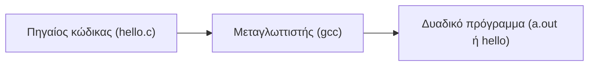
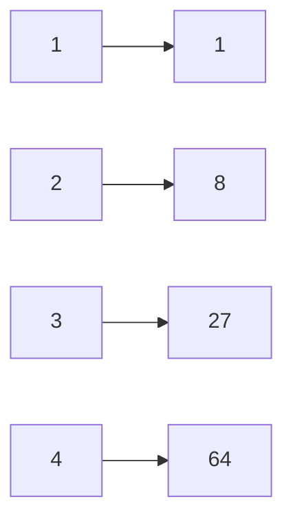
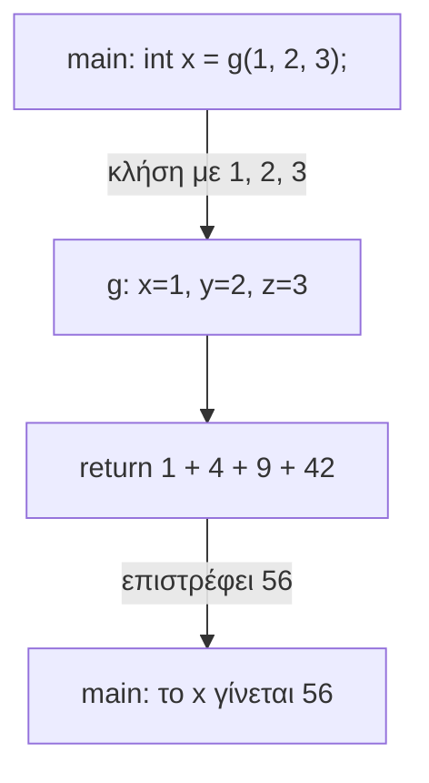

# Κεφάλαιο 3: Συναρτήσεις

<!--  -->

> **Στόχοι:** μετά από αυτό το κεφάλαιο θα μπορείτε να
> - επιλέγετε τον κατάλληλο τύπο ακεραίου ή πραγματικού αριθμού και να γνωρίζετε το
>   εύρος τιμών του·
> - γράφετε σταθερές σε δεκαδική, δεκαεξαδική και οκταδική μορφή·
> - εξηγείτε τι είναι η υπερχείλιση ακεραίων (integer overflow) και πώς την αποφεύγετε·
> - τυπώνετε τιμές με την `printf`, χρησιμοποιώντας ακολουθίες διαφυγής και
>   προσδιοριστικά μορφοποίησης·
> - διαβάζετε τα μηνύματα λάθους του `gcc`·
> - εξηγείτε κάθε γραμμή του Hello World και τι σημαίνει το exit code ενός προγράμματος·
> - ορίζετε και καλείτε δικές σας συναρτήσεις στη C.
>
> **Προαπαιτούμενα:** [Κεφάλαιο 0](../00-hello-world/), [Κεφάλαιο 1](../01-command-line/), [Κεφάλαιο 2](../02-memory-variables/)
>
> **Χρόνος μελέτης:** ~2 ώρες

## Σύνοψη

Η διάλεξη κλείνει πρώτα τους λογαριασμούς με τις μεταβλητές: τους βασικούς τύπους της C
και τα εύρη τους, την ανάθεση τιμής, την υπερχείλιση ακεραίων και το τύπωμα τιμών με την
`printf`. Έπειτα ξαναπιάνει το Hello World και το αναλύει γραμμή προς γραμμή: σχόλια,
`#include`, `printf`, τη συνάρτηση `main` και το `return 0`. Το συμπέρασμα είναι ότι
ένα πρόγραμμα C είναι μια σειρά από **συναρτήσεις**, και η εκτέλεση ξεκινά από τη
`main`. Γι' αυτό το δεύτερο μισό ορίζει τη συνάρτηση, πρώτα όπως στα μαθηματικά και μετά
όπως στη C (τύπος επιστροφής, όνομα, ορίσματα, σώμα, κλήση). Τέλος, με την τεχνική του
pair programming, λύνουμε δύο challenges: το Πυθαγόρειο θεώρημα με συναρτήσεις και
την προσέγγιση του π με τη σειρά του Leibniz.

## Θεωρία

<a id="s3-1"></a><a id="τύποι-μεταβλητών"></a>

### §3.1 Τύποι μεταβλητών

Κάθε μεταβλητή στη C έχει έναν **τύπο** (type), που καθορίζει πόσα bytes πιάνει στη μνήμη
και ποιες τιμές μπορεί να πάρει (βλ. [Κεφάλαιο 2](../02-memory-variables/)). Τα
μεγέθη δεν είναι ίδια σε κάθε υπολογιστή· ο πίνακας δίνει τα *συνηθισμένα*:

| Τύπος | Bytes | Εύρος τιμών | Παράδειγμα τιμής |
| --- | --- | --- | --- |
| `char` | 1 | -128 … 127 | `'B'`, `0x42` |
| `short int` | 2 | -32.768 … 32.767 | `42` |
| `int` | 4 | -2.147.483.648 … 2.147.483.647 | `42` |
| `long int` | 4 | όπως το `int` | `42L` |
| `float` | 4 | μικρότερη θετική $1.17 \cdot 10^{-38}$, μεγαλύτερη $3.4 \cdot 10^{38}$ | `42.42F` |
| `double` | 8 | μικρότερη θετική $2.2 \cdot 10^{-308}$, μεγαλύτερη $1.8 \cdot 10^{308}$ | `42.42` |
| `long double` | 8, 10, 12 ή 16 | | `42.42L` |
| `unsigned char` | 1 | 0 … 255 | `'B'`, `0x42` |
| `unsigned short int` | 2 | 0 … 65535 | `42` |
| `unsigned int` | 4 | 0 … 4.294.967.295 | `42` |
| `unsigned long int` | 4 | 0 … 4.294.967.295 | `42LU` |

Οι τύποι χωρίς πρόσημο (**unsigned**) χρησιμοποιούν όλα τα bits για το μέγεθος: φτάνουν
στο διπλάσιο θετικό όριο αλλά δεν έχουν αρνητικούς. Το γράμμα στο τέλος μιας σταθεράς
(suffix) δίνει τον τύπο της: `L` για `long` (ή `long double`), `U` για `unsigned`, `F`
για `float`· μια σταθερά με υποδιαστολή χωρίς suffix, όπως `42.42`, είναι `double`. Ο
`char` είναι κι αυτός ακέραιος: ο χαρακτήρας `'B'` και το `0x42` (66) είναι η ίδια
τιμή. Για τον `long int` οι σημειώσεις γράφουν «συνήθως 4, μερικές φορές 8» bytes· στα
64-bit συστήματα Linux είναι 8.

<a id="s3-2"></a><a id="ανάθεση-σε-μεταβλητή"></a>

### §3.2 Ανάθεση σε μεταβλητή

**Ανάθεση** (assignment) είναι η εγγραφή μιας τιμής σε μια μεταβλητή. Γίνεται είτε
κατά τον ορισμό της (`int x = 42;`) είτε αργότερα (`int y;` και μετά `y = 42;`).
Πριν από την ανάθεση, τα 4 bytes της `y` περιέχουν ό,τι είχε μείνει σε εκείνη τη θέση
μνήμης: τυχαία bits («σκουπίδια»). Μετά την ανάθεση περιέχουν τη δυαδική αναπαράσταση
του 42, δηλαδή `00000000 00000000 00000000 00101010`.

Την ίδια τιμή μπορείτε να τη γράψετε σε διαφορετικές βάσεις. Το πρόθεμα `0x` σημαίνει
**δεκαεξαδικό** (`0x2A` $= 2 \cdot 16 + 10 = 42$), ενώ ένα σκέτο `0` μπροστά σημαίνει
**οκταδικό** (`052` $= 5 \cdot 8 + 2 = 42$). Άρα `int x = 0x2A;` και `x = 052;` αναθέτουν
και τα δύο 42. Προσοχή λοιπόν: το `052` *δεν* είναι το 52.

<a id="s3-3"></a><a id="υπερχείλιση-ακεραίων"></a>

### §3.3 Υπερχείλιση ακεραίων

Ένας `int` των 4 bytes χωράει μέχρι το 2.147.483.647. Η πράξη `2000000000 + 2000000000`
γίνεται σε `int`· το σωστό αποτέλεσμα 4.000.000.000 δεν χωράει, και τα bits που μένουν
ερμηνεύονται ως αρνητικός αριθμός: $4.000.000.000 - 2^{32} = -294.967.296$. Αυτό είναι η
**υπερχείλιση ακεραίων** (integer overflow): ο αριθμός «τυλίγεται» σαν κοντέρ, π.χ. μετά
το 32.767 ενός `short` έρχεται το -32.768. Το πρόγραμμα δεν σταματά, απλώς βγάζει λάθος
αποτέλεσμα, γι' αυτό το σφάλμα είναι ύπουλο. Η διόρθωση είναι υπολογισμός σε τύπο που
χωράει το αποτέλεσμα, π.χ. `long long` (σταθερές με suffix `LL`) ή, για μη αρνητικά
αποτελέσματα, `unsigned`.

<a id="s3-4"></a><a id="ακέραιοι-με-συγκεκριμένη-ακρίβεια"></a>

### §3.4 Ακέραιοι με συγκεκριμένη ακρίβεια

Αφού το μέγεθος ενός `int` είναι «συνήθως» 4 bytes, πώς μπορούμε να είμαστε σίγουροι;

- Ο τελεστής `sizeof` δίνει το μέγεθος ενός τύπου σε bytes, π.χ. `sizeof(int)`. Θα τον
  δούμε αναλυτικά σε επόμενες διαλέξεις.
- Η βιβλιοθήκη `<stdint.h>` ορίζει ακεραίους με εγγυημένο πλήθος bits:
  `int8_t`, `uint8_t`, `int16_t`, `uint16_t`, `int32_t`, `uint32_t`, `int64_t`,
  `uint64_t`. Ο αριθμός είναι τα bits και το `u` σημαίνει unsigned· π.χ. ο `uint64_t`
  είναι ακέραιος χωρίς πρόσημο 64 bits σε κάθε υπολογιστή.

<a id="s3-5"></a><a id="η-συνάρτηση-printf"></a>

### §3.5 Η συνάρτηση printf

Η `printf()` τυπώνει δεδομένα στο αρχείο εξόδου `stdout` (standard output), δηλαδή κατά
κανόνα στο τερματικό. Δέχεται **μεταβλητό πλήθος παραμέτρων**:

1. Η πρώτη είναι το **αλφαριθμητικό μορφοποίησης** (format string): μια ακολουθία
   χαρακτήρων μέσα σε διπλά εισαγωγικά `" "` που ορίζει *πώς* θα τυπωθούν τα δεδομένα.
2. Οι επόμενες είναι προαιρετικές: οι τιμές που θα τυπωθούν.

Το format string περιέχει τρία είδη πραγμάτων: **απλούς χαρακτήρες**, που τυπώνονται
όπως είναι, **ακολουθίες διαφυγής** (escape sequences) και **προσδιοριστικά
μορφοποίησης** (format specifiers). Στο `printf("x = %d\n", x);` το `x = ` είναι απλοί
χαρακτήρες, το `%d` η θέση της τιμής της `x` και το `\n` αλλαγή γραμμής.

<a id="s3-6"></a><a id="ακολουθίες-διαφυγής"></a>

### §3.6 Ακολουθίες διαφυγής

Μια **ακολουθία διαφυγής** είναι μια ανάστροφη κεκλιμένη `\` (backslash) ακολουθούμενη
από έναν χαρακτήρα. Αναπαριστά χαρακτήρες που δεν γράφονται εύκολα μέσα σε εισαγωγικά:

| Ακολουθία | Σημασία |
| --- | --- |
| `\n` | Αλλαγή γραμμής, σαν το πλήκτρο Enter |
| `\r` | Επιστροφή του δρομέα (cursor) στην αρχή της τρέχουσας γραμμής |
| `\t` | Κενό ίσο με ένα tab, σαν το πλήκτρο Tab |
| `\\` | Τύπωμα της ανάστροφης κεκλιμένης |
| `\"` | Τύπωμα διπλών εισαγωγικών |
| `\xNN` | Ο χαρακτήρας με δεκαεξαδικό κωδικό `NN` |
| `\a` | Ηχητικό σήμα |

Το `\"` χρειάζεται γιατί ένα σκέτο `"` θα έκλεινε το αλφαριθμητικό. Για τον ίδιο λόγο η
`\` γράφεται διπλή.

<a id="s3-7"></a><a id="προσδιοριστικά-μορφοποίησης"></a>

### §3.7 Προσδιοριστικά μορφοποίησης

Ένα **προσδιοριστικό μορφοποίησης** είναι ο χαρακτήρας `%` και ένας ή περισσότεροι
χαρακτήρες που λένε πώς να τυπωθεί η αντίστοιχη τιμή: το πρώτο προσδιοριστικό
αντιστοιχεί στην πρώτη τιμή μετά το format string, το δεύτερο στη δεύτερη, κ.ο.κ.

| Προσδιοριστικό | Σημασία |
| --- | --- |
| `%c` | ASCII χαρακτήρας |
| `%d` ή `%i` | Ακέραιος |
| `%u` | Ακέραιος unsigned (χωρίς πρόσημο) |
| `%f` | Πραγματικός (`float`, και `double`) |
| `%llu` | `long long unsigned int` |
| `%%` | Ο ίδιος ο χαρακτήρας `%` |

Η πλήρης λίστα (πλάτος πεδίου, ακρίβεια δεκαδικών κ.λπ.) είναι στο
[reference της printf](https://cplusplus.com/reference/cstdio/printf/). Το
προσδιοριστικό πρέπει να ταιριάζει με τον τύπο της τιμής· αν τυπώσετε `double` με `%d`
θα πάρετε σκουπίδια.

<a id="s3-8"></a><a id="συμμετρία-και-μηνύματα-λάθους"></a>

### §3.8 Συμμετρία και μηνύματα λάθους

Στον προγραμματισμό *συνήθως* υπάρχει συμμετρία: παρενθέσεις, εισαγωγικά και άγκιστρα
(curly braces) `{ }` που ανοίγουν πρέπει να κλείνουν. Τα περισσότερα συντακτικά λάθη
των πρώτων εβδομάδων είναι ένα «ορφανό» σύμβολο ή ένα ξεχασμένο ερωτηματικό `;`. Όταν ο `gcc` δεν μπορεί να μεταγλωττίσει, τυπώνει ένα μήνυμα της μορφής
`αρχείο:γραμμή:στήλη: error: περιγραφή`, και από κάτω τη γραμμή με ένα `^` στο σημείο που
μπερδεύτηκε. **Διαβάστε το μήνυμα:** λέει ακριβώς τι περίμενε. Έχετε υπόψη ότι ο
μεταγλωττιστής καταλαβαίνει το λάθος εκεί που *δεν* βρίσκει αυτό που περίμενε, οπότε το
πραγματικό λάθος είναι συχνά λίγο πιο πριν (π.χ. στο τέλος της προηγούμενης γραμμής).

<a id="s3-9"></a><a id="δηλώσεις-πολλών-μεταβλητών"></a>

### §3.9 Δηλώσεις πολλών μεταβλητών

Μεταβλητές του ίδιου τύπου μπορούν να δηλωθούν στην ίδια γραμμή, χωρισμένες με κόμμα:
`int a; int b; int c;` γράφεται ισοδύναμα `int a, b, c;`. Μπορείτε να αρχικοποιήσετε
και μερικές από αυτές: `double a = 3.0, b = 4.0;`.

<a id="s3-10"></a><a id="δεσμευμένες-λέξεις"></a>

### §3.10 Δεσμευμένες λέξεις

Οι **δεσμευμένες λέξεις** (reserved keywords) έχουν προκαθορισμένο νόημα για τον
μεταγλωττιστή και **δεν** επιτρέπεται να χρησιμοποιηθούν ως ονόματα μεταβλητών ή
συναρτήσεων:

```text
auto      break     case      char      const     continue  default
do        double    else      enum      extern    float     for
goto      if        int       long      register  return    short
signed    sizeof    static    struct    switch    typedef   union
unsigned  void      volatile  while
```

Μια δήλωση όπως `int return;` δεν μεταγλωττίζεται. Τις περισσότερες θα τις
συναντήσετε στα επόμενα κεφάλαια.

<a id="s3-11"></a><a id="από-τον-πηγαίο-κώδικα-στο-εκτελέσιμο"></a>

### §3.11 Από τον πηγαίο κώδικα στο εκτελέσιμο

**Μεταγλωττιστής** (compiler) είναι ένα πρόγραμμα που μετατρέπει εντολές μιας γλώσσας
προγραμματισμού σε κώδικα μηχανής, ώστε να μπορεί να τον διαβάσει και να τον εκτελέσει
ο υπολογιστής. Στο μάθημα χρησιμοποιούμε τον [GNU C Compiler](https://en.wikipedia.org/wiki/GNU_Compiler_Collection), `gcc`.



*Σχήμα: η μεταγλώττιση σε απλοποιημένη μορφή.*

Η εικόνα είναι προσεγγιστική· λεπτομέρειες (π.χ. η σύνδεση με βιβλιοθήκες) προστίθενται
σε επόμενες διαλέξεις, και μία από αυτές τη βλέπουμε ήδη στο challenge του
Πυθαγορείου. Χωρίς επιλογές, ο `gcc hello.c` γράφει το εκτελέσιμο στο αρχείο `a.out`· με
`-o hello` διαλέγετε εσείς το όνομα.

<a id="s3-12"></a><a id="η-ανατομία-του-hello-world"></a>

### §3.12 Η ανατομία του Hello World

```c
/* File: helloworld.c */
#include <stdio.h>

int main() {
  printf("Hello world\n");
  return 0;
}
```

- **Σχόλια (comments):** κείμενο του προγραμματιστή που συνοδεύει τον κώδικα για να τον
  κάνει πιο σαφή σε τρίτους ή σε εμάς τους ίδιους, όταν έχει περάσει καιρός. Γράφεται
  ανάμεσα σε `/*` και `*/` (και σε πολλές γραμμές), ή σε μία γραμμή μετά από `//`. Ο
  μεταγλωττιστής τα αγνοεί.
- **Η οδηγία `#include`** (directive): το `#include <stdio.h>` συμπεριλαμβάνει στο
  πρόγραμμα τα περιεχόμενα του αρχείου `stdio.h` (standard input output), που περιέχει
  τις δηλώσεις των βασικών συναρτήσεων εξόδου (οθόνη) και εισόδου (πληκτρολόγιο).
- **`printf`:** συνάρτηση βιβλιοθήκης, δηλωμένη στο `stdio.h` (γι' αυτό κάνουμε
  `#include`). Τυπώνει το αλφαριθμητικό `"Hello world\n"`· το `\n` αλλάζει γραμμή μετά
  το μήνυμα.
- **Η συνάρτηση `main`:** ένα πρόγραμμα C αποτελείται από συναρτήσεις. Για να
  εκτελεστεί, πρέπει να έχει **ακριβώς μία** συνάρτηση `main`, που καλείται πρώτη όταν
  ξεκινά το πρόγραμμα.
- **`return 0;`:** επιστρέφει την τιμή της συνάρτησης. Η τιμή που επιστρέφει η `main`
  είναι και το **exit code** του προγράμματος, που δείχνει αν ολοκληρώθηκε με επιτυχία.
  Το `0` σημαίνει επιτυχία· κάθε άλλη τιμή σημαίνει ότι το πρόγραμμα **απέτυχε**. Στο
  shell το βλέπετε με `echo $?` αμέσως μετά την εκτέλεση
  (βλ. [Κεφάλαιο 1](../01-command-line/)).
- **Εντολές (statements):** οι εντολές μιας συνάρτησης βρίσκονται μέσα σε άγκιστρα
  `{ }` και η καθεμία τελειώνει με `;` (semicolon, το ελληνικό ερωτηματικό).

<a id="s3-13"></a><a id="συναρτήσεις-στα-μαθηματικά"></a>

### §3.13 Συναρτήσεις στα μαθηματικά

Στα μαθηματικά, **συνάρτηση** είναι μια αντιστοίχιση ανάμεσα σε δύο σύνολα, το **σύνολο
ορισμού** (domain) και το **σύνολο τιμών** (co-domain), κατά την οποία κάθε στοιχείο του
συνόλου ορισμού αντιστοιχίζεται σε **ένα και μόνο** στοιχείο του συνόλου τιμών. Για
παράδειγμα η $f(x) = x^3$ με $f: \mathbb{Z} \to \mathbb{Z}$:



*Σχήμα: η $f(x) = x^3$ αντιστοιχίζει κάθε στοιχείο του συνόλου ορισμού (αριστερά) σε
ακριβώς ένα του συνόλου τιμών (δεξιά).*

Μια συνάρτηση μπορεί να έχει πολλές παραμέτρους (**πολυπαραμετρική**):
$g(x, y, z) = x^2 + y^2 + z^2 + 42$ με $g: \mathbb{R} \times \mathbb{R} \times \mathbb{R} \to \mathbb{R}$,
ή $h(x, y) = x + y + 1$ με $h: \mathbb{R} \times \mathbb{N} \to \mathbb{R}$. Κάθε
παράμετρος έχει το δικό της σύνολο. Οι παράμετροι είναι οι **είσοδοι** και η τιμή της
συνάρτησης η **έξοδος**.

**Αποτίμηση** μιας συνάρτησης είναι ο υπολογισμός της για συγκεκριμένες τιμές:
οι είσοδοι 2, 4, 8 μπαίνουν στη $g$ και βγαίνει
$g(2, 4, 8) = 2^2 + 4^2 + 8^2 + 42 = 126$.

<a id="s3-14"></a><a id="συναρτήσεις-στη-c-ορισμός"></a>

### §3.14 Συναρτήσεις στη C: ορισμός

Στη C, **συνάρτηση** είναι μια σειρά υπολογισμών που παίρνουν τις εισόδους της
συνάρτησης και παράγουν την έξοδο. Όπως στα μαθηματικά, κάθε είσοδος και η έξοδος έχουν
έναν **τύπο**, δηλαδή το σύνολο τιμών που μπορούν να πάρουν· ο `int`, για παράδειγμα,
αντιπροσωπεύει τους ακεραίους. Η $g$ γράφεται:

```c
int g(int x, int y, int z) {
  return x * x + y * y + z * z + 42;
}
```

Ο **ορισμός συνάρτησης** (function definition) έχει τρία μέρη:

1. **Τύπος επιστροφής και όνομα**, στη μορφή `τύπος όνομα`: εδώ `int g`. Όποτε καλούμε
   `g(...)` περιμένουμε ακέραιο αποτέλεσμα.
2. **Ορίσματα** (arguments) ή δεδομένα εισόδου, μέσα σε παρενθέσεις, το καθένα επίσης
   στη μορφή `τύπος όνομα` και χωρισμένα με κόμμα: `int x, int y, int z` είναι τρία
   ακέραια ορίσματα με ονόματα `x`, `y`, `z`. Κάθε όρισμα θέλει τον δικό του τύπο (όχι
   `int x, y, z`).
3. **Σώμα** (body) μέσα σε άγκιστρα `{ }`, με τον υπολογισμό της τιμής. Η εντολή
   `return` υπολογίζει την παράσταση και **επιστρέφει** το αποτέλεσμα σε όποιον κάλεσε
   τη συνάρτηση. Οι εντολές του σώματος τελειώνουν με `;`.

Η `main` είναι κι αυτή μια τέτοια συνάρτηση: τύπος επιστροφής `int`, όνομα `main`.
Στη διάλεξη εμφανίζεται και με ορίσματα, `int main(int argc, char **argv)`· τι
περιέχουν τα `argc` και `argv` θα το δούμε στα ορίσματα γραμμής εντολών.

<a id="s3-15"></a><a id="κλήση-συνάρτησης"></a>

### §3.15 Κλήση συνάρτησης

Η **κλήση συνάρτησης** (function call) γίνεται με το όνομά της και στη συνέχεια τα
ορίσματα μέσα σε παρενθέσεις, χωρισμένα με κόμμα. Η κλήση είναι παράσταση: η τιμή της
είναι ό,τι επιστρέφει η συνάρτηση, και μπορεί να ανατεθεί σε μεταβλητή ή να δοθεί ως
όρισμα σε άλλη συνάρτηση.

```c
int x = g(1, 2, 3);   /* x, y, z της g παίρνουν 1, 2, 3 */
```



*Σχήμα: η ροή μιας κλήσης συνάρτησης και της επιστροφής της.*

Προσέξτε ότι τα `x` της `main` και `x` της `g` είναι *διαφορετικές* μεταβλητές που
απλώς έχουν το ίδιο όνομα· το πώς «βλέπει» κάθε συνάρτηση τις μεταβλητές της είναι
θέμα εμβέλειας, που θα το δούμε αργότερα. Η συνάρτηση πρέπει να είναι ορισμένη (πιο
πάνω στο αρχείο) πριν την καλέσετε, όπως η `g` πάνω από τη `main`.

<a id="s3-16"></a><a id="pair-programming"></a>

### §3.16 Pair programming

Το **pair programming** είναι μια τεχνική ανάπτυξης λογισμικού όπου δύο προγραμματιστές
δουλεύουν μαζί σε έναν υπολογιστή. Ο ένας, ο **driver**, γράφει κώδικα· ο άλλος, ο
**observer** ή **navigator**, ελέγχει (review) κάθε γραμμή καθώς γράφεται. Οι δύο αλλάζουν
ρόλους συχνά. Όπως λέει ο Jeff Dean, χρειάζεται να βρείτε κάποιον συμβατό με τον τρόπο
σκέψης σας, ώστε μαζί να αποτελείτε μια συμπληρωματική δύναμη. Τα δύο challenges της
διάλεξης λύθηκαν έτσι, σε ζευγάρια.

## Παραδείγματα

<a id="s3-17"></a><a id="μεταγλώττιση-και-εκτέλεση-του-hello-world"></a>

### §3.17 Μεταγλώττιση και εκτέλεση του Hello World

Εφαρμόζει: «Από τον πηγαίο κώδικα στο εκτελέσιμο», «Η ανατομία του Hello World».

```text
$ gcc hello.c
$ ls
a.out  hello.c
$ ./a.out
Hello world
$ file a.out
a.out: ELF 64-bit LSB shared object, x86-64, version 1 (SYSV), dynamically
linked, interpreter /lib64/ld-linux-x86-64.so.2, BuildID[sha1]=52fa5999c10d767a
5ff30f662346478333de74bf, for GNU/Linux 3.2.0, not stripped
$ gcc -o hello hello.c
$ ./hello
Hello world
```

Η εντολή `file` επιβεβαιώνει ότι το `a.out` είναι δυαδικό εκτελέσιμο (ELF) για
επεξεργαστή x86-64, όχι κείμενο. Με `-o hello` το εκτελέσιμο παίρνει όνομα της
επιλογής μας.

<a id="s3-18"></a><a id="ένα-ξεχασμένο-ερωτηματικό"></a>

### §3.18 Ένα ξεχασμένο ερωτηματικό

Εφαρμόζει: «Συμμετρία και μηνύματα λάθους». Αν λείπει το `;` μετά την `printf`:

```text
$ gcc -o hello hello.c
hello.c: In function 'main':
hello.c:4:26: error: expected ';' before 'return'
    4 |   printf("Hello world\n")
      |                          ^
      |                          ;
    5 |   return 0;
      |   ~~~~~~
```

Το μήνυμα λέει ότι στη γραμμή 4, στήλη 26, ο μεταγλωττιστής περίμενε `;` πριν το
`return`, και προτείνει μάλιστα πού να το βάλετε. Το λάθος εντοπίζεται όταν ο
μεταγλωττιστής συναντά το `return` της γραμμής 5, αλλά αναφέρεται στο τέλος της
γραμμής 4.

<a id="s3-19"></a><a id="υπερχείλιση-στην-πράξη"></a>

### §3.19 Υπερχείλιση στην πράξη

Εφαρμόζει: «Υπερχείλιση ακεραίων», «Προσδιοριστικά μορφοποίησης».

```c
#include <stdio.h>

int main() {
  printf("%d\n", 2000000000 + 2000000000);
  return 0;
}
```

```text
$ ./overflow
-294967296
```

Και οι δύο σταθερές είναι `int`, άρα και η πρόσθεση γίνεται σε `int` και υπερχειλίζει
(ο `gcc` μάλιστα προειδοποιεί για integer overflow κατά τη μεταγλώττιση). Για να
πάρετε 4000000000, κάντε την πράξη σε μεγαλύτερο τύπο και τυπώστε με το αντίστοιχο
προσδιοριστικό, π.χ. `printf("%lld\n", 2000000000LL + 2000000000LL);`.

<a id="s3-20"></a><a id="challenge-1-πυθαγόρειο-θεώρημα-pythc"></a>

### §3.20 Challenge #1: Πυθαγόρειο θεώρημα (pyth.c)

Εφαρμόζει: «Συναρτήσεις στη C: ορισμός», «Κλήση συνάρτησης», «Η συνάρτηση printf».
Ζητείται πρόγραμμα που, με δεδομένα τα μήκη των καθέτων πλευρών ενός ορθογωνίου
τριγώνου, τυπώνει το εμβαδόν και την περίμετρό του. Η λύση της διάλεξης βάζει κάθε
υπολογισμό σε δική του συνάρτηση:

```c
#include <stdio.h>
#include <math.h>
/* Returns the area of a right triangle */
double compute_area(double a, double b) {
  return (a * b) / 2.0;
}
/* Returns the perimeter of a right triangle */
double compute_perimeter(double a, double b) {
  double c = sqrt(a * a + b * b);  // hypotenuse
  double perimeter = a + b + c;
  return perimeter;
}

int main(int argc, char **argv) {
  double a = 3.0, b = 4.0;
  printf("Area of triangle: %f\n", compute_area(a, b));
  printf("Triangle perimeter: %f\n", compute_perimeter(a, b));
  return 0;
}
```

```text
$ gcc -o pyth pyth.c
/usr/bin/X11/ld: /tmp/cc9jUwzF.o: in function `compute_perimeter':
pyth.c:(.text+0x5b): undefined reference to `sqrt'
collect2: error: ld returned 1 exit status
$ gcc -o pyth pyth.c -lm
$ ./pyth
Area of triangle: 6.000000
Triangle perimeter: 12.000000
```

Η υποτείνουσα βγαίνει από το Πυθαγόρειο θεώρημα, $c = \sqrt{a^2 + b^2}$, με τη `sqrt`
της μαθηματικής βιβλιοθήκης. Η πρώτη μεταγλώττιση αποτυγχάνει με `undefined reference
to 'sqrt'`: το λάθος δεν το βγάζει ο μεταγλωττιστής αλλά ο **συνδέτης** (linker, `ld`).
Το `#include <math.h>` απλώς *δηλώνει* την `sqrt`· ο κώδικάς της βρίσκεται στη
μαθηματική βιβλιοθήκη, που ζητιέται ρητά με `-lm`. Αυτή είναι μία από τις
«λεπτομέρειες» που λείπουν από το απλό σχήμα της μεταγλώττισης. Η `main` καλεί τις
συναρτήσεις μέσα στις κλήσεις της `printf`, που τυπώνει την τιμή τους με `%f` (6
δεκαδικά). Εδώ τα 3 και 4 είναι γραμμένα στο πρόγραμμα· η ίδια άσκηση στο
[Εργαστήριο 2](https://progintro.github.io/lab-material/labs/lab02/) (`pyth.c`) ζητά
να διαβάζονται ως είσοδος.

<a id="s3-21"></a><a id="challenge-2-προσέγγιση-του-π"></a>

### §3.21 Challenge #2: Προσέγγιση του π

Εφαρμόζει: «Τύποι μεταβλητών», «Η συνάρτηση printf». Ο Leibniz έδειξε ότι

$$\frac{\pi}{4} = \sum_{i=0}^{\infty} \frac{(-1)^i}{2i+1} = \frac{1}{1} - \frac{1}{3} + \frac{1}{5} - \frac{1}{7} + \cdots$$

Μπορούμε να γράψουμε πρόγραμμα που προσεγγίζει το π; Αθροίζουμε πεπερασμένο πλήθος
όρων (εδώ 100000). Αντί να υπολογίζουμε το $(-1)^i$ με δύναμη, κρατάμε αριθμητή που
αλλάζει πρόσημο και παρονομαστή που αυξάνει κατά 2 σε κάθε βήμα:

```c
#include <stdio.h>

/* A simple way to approximate pi */
int main() {
  int i;
  double numerator = 1;
  double denominator = 1;
  double sum = 0;
  for (i = 0; i < 100000; i++) {
    sum += numerator / denominator;
    numerator = numerator * (-1);
    denominator = denominator + 2;
  }
  printf("Pi is approximately: %f\n", 4 * sum);
}
```

```text
$ gcc -o pi pi.c
$ ./pi
Pi is approximately: 3.141583
```

Ο βρόχος `for` επαναλαμβάνει το σώμα του 100000 φορές (τους βρόχους τους βλέπουμε
αναλυτικά στο [Κεφάλαιο 6](../06-control-flow/)). Οι μεταβλητές είναι `double`, ώστε η
διαίρεση `numerator / denominator` να δίνει πραγματικό αποτέλεσμα. Με 100000 όρους
το αποτέλεσμα είναι σωστό σε 4 δεκαδικά (π = 3.14159…): η σειρά συγκλίνει αργά.

## Κύρια σημεία

1. Ένα πρόγραμμα C είναι μια σειρά από συναρτήσεις.
2. Η εκτέλεση του προγράμματος ξεκινά από τη συνάρτηση `main`, που πρέπει να υπάρχει
   ακριβώς μία φορά.
3. Κάθε τύπος έχει συγκεκριμένο μέγεθος και εύρος τιμών· τα μεγέθη είναι «συνήθη», όχι
   εγγυημένα, και για εγγυημένο μέγεθος υπάρχουν οι τύποι του `<stdint.h>`.
4. Ένας υπολογισμός που ξεπερνά το εύρος του τύπου του υπερχειλίζει σιωπηλά και δίνει
   λάθος αποτέλεσμα· η λύση είναι μεγαλύτερος τύπος.
5. Οι σταθερές γράφονται και σε δεκαεξαδικό (`0x2A`) ή οκταδικό (`052`)· ένα αρχικό `0`
   αλλάζει τη βάση.
6. Η `printf` τυπώνει στο `stdout` με βάση ένα format string που περιέχει απλούς
   χαρακτήρες, ακολουθίες διαφυγής (`\n`, `\t`, …) και προσδιοριστικά (`%d`, `%f`, …).
7. Τα μηνύματα λάθους του `gcc` δίνουν αρχείο, γραμμή και στήλη· διαβάστε τα, και ψάξτε
   και λίγο πριν από το σημείο που δείχνουν.
8. Η τιμή που επιστρέφει η `main` είναι το exit code: `0` σημαίνει επιτυχία, οτιδήποτε
   άλλο αποτυχία, και το βλέπετε με `echo $?`.
9. Στα μαθηματικά, συνάρτηση είναι αντιστοίχιση όπου κάθε στοιχείο του συνόλου ορισμού
   αντιστοιχεί σε ένα και μόνο στοιχείο του συνόλου τιμών.
10. Στη C, ο ορισμός συνάρτησης έχει τύπο επιστροφής και όνομα, ορίσματα με τύπους σε
    παρενθέσεις, και σώμα σε `{ }` που επιστρέφει την τιμή με `return`.
11. Μια συνάρτηση καλείται με το όνομά της και τα ορίσματα σε παρενθέσεις, χωρισμένα με
    κόμμα· η κλήση έχει ως τιμή ό,τι επιστρέφει η συνάρτηση.
12. Οι συναρτήσεις της `math.h`, όπως η `sqrt`, χρειάζονται `-lm` κατά τη μεταγλώττιση.

## Ορολογία

| Ελληνικά | English | Σύντομος ορισμός |
| --- | --- | --- |
| τύπος | type | Το σύνολο τιμών και το μέγεθος μιας μεταβλητής |
| ανάθεση | assignment | Εγγραφή τιμής σε μεταβλητή |
| υπερχείλιση ακεραίων | integer overflow | Αποτέλεσμα εκτός εύρους του τύπου, που «τυλίγεται» |
| αλφαριθμητικό μορφοποίησης | format string | Το πρώτο όρισμα της `printf` |
| ακολουθία διαφυγής | escape sequence | `\` και ένας χαρακτήρας, π.χ. `\n` |
| προσδιοριστικό μορφοποίησης | format specifier | `%` και χαρακτήρες, π.χ. `%d` |
| δεσμευμένη λέξη | reserved keyword | Λέξη με προκαθορισμένο νόημα, όχι για ονόματα |
| μεταγλωττιστής | compiler | Μετατρέπει πηγαίο κώδικα σε κώδικα μηχανής |
| συνδέτης | linker | Συνδέει τον κώδικά μας με βιβλιοθήκες (π.χ. `-lm`) |
| οδηγία | directive | Γραμμή με `#`, π.χ. `#include` |
| κωδικός εξόδου | exit code | Η τιμή που επιστρέφει η `main` |
| συνάρτηση | function | Υπολογισμός από εισόδους σε έξοδο, με όνομα |
| σύνολο ορισμού / τιμών | domain / co-domain | Τα σύνολα εισόδων και εξόδων |
| ορισμός συνάρτησης | function definition | Τύπος, όνομα, ορίσματα και σώμα |
| όρισμα | argument | Δεδομένο εισόδου μιας συνάρτησης |
| κλήση συνάρτησης | function call | Εκτέλεση της συνάρτησης με συγκεκριμένα ορίσματα |
| προγραμματισμός σε ζεύγη | pair programming | Driver γράφει, navigator ελέγχει, αλλάζουν ρόλους |

## Διάβασμα

- **Διαφάνειες:** [Διάλεξη 3](https://github.com/progintro/progintro.github.io/releases/download/2025/lec03.pdf), σελ. 1–47. Τύποι, ανάθεση, υπερχείλιση: σελ. 5–9· `printf`, ακολουθίες διαφυγής, προσδιοριστικά: σελ. 10–12· συμμετρία και μηνύματα λάθους: σελ. 13–14· δηλώσεις και δεσμευμένες λέξεις: σελ. 15–16· μεταγλώττιση και ανάλυση του Hello World: σελ. 17–27· συναρτήσεις: σελ. 28–37· pair programming και challenges: σελ. 38–44.
- **Σημειώσεις:** οι διαφάνειες συνιστούν να έχετε καλύψει τις σημειώσεις του κ. Σταματόπουλου μέχρι τη σελίδα 35, και τις σελίδες 58–71. Συγκεκριμένα για αυτή τη διάλεξη:
  - [Κεφάλαιο 1: Πρώτα προγράμματα σε C](https://progintro.github.io/notes/chapters/01-first-programs/), ενότητες «Καλημέρα κόσμε της C» και «Πόσο είναι το $\pi$;» (K04, σελ. 19–23)
  - [Κεφάλαιο 2: Μεταβλητές, τύποι, τελεστές και παραστάσεις](https://progintro.github.io/notes/chapters/02-types-operators/), ενότητα «Μεταβλητές, σταθερές, τύποι και δηλώσεις στην C» (K04, σελ. 30–33)
  - [Κεφάλαιο 4: Συναρτήσεις, εμβέλεια και αναδρομή](https://progintro.github.io/notes/chapters/04-functions/), ενότητες «Δομή ενός προγράμματος C – Συναρτήσεις», «Συνάρτηση ύψωσης σε δύναμη», «Συνάρτηση υπολογισμού παραγοντικού» (K04, σελ. 58–62)· οι σελ. 63–69 («Εμβέλεια και χρόνος ζωής μεταβλητών», «Υπολογισμός παραγοντικού με αναδρομή») προετοιμάζουν επόμενα κεφάλαια.
- **Εργαστήριο:**
  - [Εργαστήριο 2](https://progintro.github.io/lab-material/labs/lab02/): άσκηση `pyth.c` (το Challenge #1 με είσοδο από τον χρήστη) και το παράρτημα «Αποσφαλμάτωση προγραμμάτων (Πράξη 1η)» για τα συντακτικά λάθη
  - [Εργαστήριο 5](https://progintro.github.io/lab-material/labs/lab05/): άσκηση `collatz.c`, ερωτήματα 1.1–1.2 (συναρτήσεις `isodd` και `collatz_it`)
- **Άλλα:**
  - Wikipedia: [Integer overflow](https://en.wikipedia.org/wiki/Integer_overflow), [Escape sequences in C](https://en.wikipedia.org/wiki/Escape_sequences_in_C), [GNU Compiler Collection](https://en.wikipedia.org/wiki/GNU_Compiler_Collection)
  - `printf`: [tips](https://web.mit.edu/10.001/Web/Course_Notes/c_Notes/tips_printf.html) και [reference](https://cplusplus.com/reference/cstdio/printf/)
  - [Ubuntu: The Linux command line for beginners](https://ubuntu.com/tutorials/command-line-for-beginners#1-overview)
  - Pair programming: Wikipedia [Software development](https://en.wikipedia.org/wiki/Software_development), [Code review](https://en.wikipedia.org/wiki/Code_review)· [Jeff Dean quotes](https://www.brainyquote.com/authors/jeff-dean-quotes)

## Συχνά λάθη

- **Ξεχασμένο `;`.** `printf("Hello world\n")` χωρίς `;` δίνει
  `error: expected ';' before 'return'`. Διόρθωση: βάλτε `;` στο τέλος της εντολής που δείχνει το `^`.
- **Ορφανά εισαγωγικά ή άγκιστρα.** `printf("Hello world!\n);` δίνει
  `missing terminating " character`· ένα `}` που λείπει δίνει σφάλμα στο τέλος του αρχείου
  (`expected declaration or statement at end of input`). Διόρθωση: ελέγξτε τη
  συμμετρία.
- **Υπερχείλιση.** Γινόμενα ή αθροίσματα μεγάλων `int` βγάζουν αρνητικούς ή παράλογους
  αριθμούς. Διόρθωση: `long long` ή `unsigned` και το αντίστοιχο προσδιοριστικό.
- **Αρχικό μηδέν.** `int x = 052;` δίνει 42, όχι 52: είναι οκταδικό.
- **Λάθος προσδιοριστικό.** `printf("%d\n", 3.5);` τυπώνει σκουπίδια (ο `gcc -Wall`
  προειδοποιεί `format '%d' expects argument of type 'int'`). Διόρθωση: `%f` για
  πραγματικούς.
- **Χωρίς `-lm`.** `undefined reference to 'sqrt'` από τον `ld`. Διόρθωση:
  `gcc -o pyth pyth.c -lm`.
- **Κοινός τύπος σε ορίσματα.** `int g(int x, y, z)` δεν μεταγλωττίζεται· κάθε όρισμα
  θέλει δικό του τύπο: `int g(int x, int y, int z)`.
- **Δεσμευμένη λέξη ως όνομα.** `int for = 3;` ή `double double;` δεν μεταγλωττίζονται.
- **Χρήση μεταβλητής πριν την ανάθεση.** `int y; printf("%d\n", y);` τυπώνει ό,τι
  σκουπίδι υπάρχει στη μνήμη.

<!-- misconceptions -->

### Τι δυσκόλεψε την τάξη

Από τα Kahoot των διαλέξεων: οι ερωτήσεις όπου μια λάθος απάντηση μάζεψε πολλές ψήφους, με το ποσοστό σωστών απαντήσεων.

- **[Κ3.8](../../questions/kahoot/kahoot-function-return-type.md)** Ο τύπος επιστροφής μιας συνάρτησης (28% σωστές): Το 25% επέλεξε `int`, μπερδεύοντας τον τύπο της παραμέτρου `x` με τον τύπο επιστροφής· η τιμή του `x * x` μετατρέπεται σε `double` κατά την επιστροφή.
- **[Κ3.5](../../questions/kahoot/kahoot-printf-char-42.md)** printf με %c και 42 (48% σωστές): Το 24% επέλεξε `42`, σαν το `%c` να τυπώνει τον αριθμό· το `%c` τυπώνει τον χαρακτήρα με αυτόν τον κωδικό ASCII.
- **[Κ3.3](../../questions/kahoot/kahoot-c-program-functions.md)** Από τι αποτελείται ένα πρόγραμμα C (55% σωστές): Το 30% επέλεξε «μια σειρά από εντολές»· οι εντολές όμως υπάρχουν μόνο μέσα στο σώμα συναρτήσεων, και το πρόγραμμα οργανώνεται σε συναρτήσεις, με πρώτη τη `main`.

<!-- /misconceptions -->

## Ερωτήσεις κατανόησης

- <a id="e3-1"></a>**[Ε3.1](#e3-1)** Γιατί ο `unsigned char` φτάνει μέχρι το 255 ενώ ο `char` μέχρι το 127;[^q1]
- <a id="e3-2"></a>**[Ε3.2](#e3-2)** Ποια τιμή έχει η `x` μετά το `int x = 0x10;` και ποια μετά το `x = 010;`;[^q2]
- <a id="e3-3"></a>**[Ε3.3](#e3-3)** Τι θα τυπώσει το `printf("100%%\tOK\n");`;[^q3]
- <a id="e3-4"></a>**[Ε3.4](#e3-4)** Ποια τέσσερα πράγματα βλέπετε σε ένα μήνυμα λάθους του `gcc` όπως το `hello.c:4:26: error: ...`;[^q4]
- <a id="e3-5"></a>**[Ε3.5](#e3-5)** Πώς ξέρει το shell αν ένα πρόγραμμα C πέτυχε, και πώς το ελέγχετε εσείς;[^q5]
- <a id="e3-6"></a>**[Ε3.6](#e3-6)** Ονομάστε τα τρία μέρη του ορισμού `double compute_area(double a, double b) { ... }`.[^q6]
- <a id="e3-7"></a>**[Ε3.7](#e3-7)** Τι επιστρέφει η κλήση `g(0, 0, 0)` της συνάρτησης `g` της διάλεξης;[^q7]
- <a id="e3-8"></a>**[Ε3.8](#e3-8)** Γιατί το `#include <math.h>` δεν αρκεί για να χρησιμοποιήσετε την `sqrt`;[^q8]

<!-- kahoot -->

### Kahoot από το αμφιθέατρο (Κ3.1–Κ3.8)

Ερωτήσεις που παίχτηκαν στις διαλέξεις, με το ποσοστό των φοιτητών που απάντησαν σωστά.

- <a id="k3-1"></a>**[Κ3.1](../../questions/kahoot/kahoot-printf-format-order.md)** Προσδιοριστικά %d με σειρά: 87% σωστές απαντήσεις
- <a id="k3-2"></a>**[Κ3.2](../../questions/kahoot/kahoot-square-double-return.md)** Τιμή επιστροφής double: 58% σωστές απαντήσεις
- <a id="k3-3"></a>**[Κ3.3](../../questions/kahoot/kahoot-c-program-functions.md)** Από τι αποτελείται ένα πρόγραμμα C: 55% σωστές απαντήσεις
- <a id="k3-4"></a>**[Κ3.4](../../questions/kahoot/kahoot-printf-carriage-return.md)** Η ακολουθία `\r`: 48% σωστές απαντήσεις
- <a id="k3-5"></a>**[Κ3.5](../../questions/kahoot/kahoot-printf-char-42.md)** printf με %c και 42: 48% σωστές απαντήσεις
- <a id="k3-6"></a>**[Κ3.6](../../questions/kahoot/kahoot-printf-escapes-backslash-quote.md)** Ακολουθίες διαφυγής για `\\` και `"`: 43% σωστές απαντήσεις
- <a id="k3-7"></a>**[Κ3.7](../../questions/kahoot/kahoot-function-definition-parts.md)** Τα μέρη του ορισμού συνάρτησης: 31% σωστές απαντήσεις
- <a id="k3-8"></a>**[Κ3.8](../../questions/kahoot/kahoot-function-return-type.md)** Ο τύπος επιστροφής μιας συνάρτησης: 28% σωστές απαντήσεις

<!-- /kahoot -->

## Ασκήσεις

<!-- exercises -->

### Ζέσταμα: από τις διαφάνειες (Α3.1–Α3.6)

- <a id="a3-1"></a>**[Α3.1](../../questions/slides/slides-lec03-function-call.md)** Τιμή μετά από κλήση συνάρτησης: Διάλεξη 3: Συναρτήσεις, διαφάνεια 37 · ★☆☆ · trace · `slides-lec03-function-call`
- <a id="a3-2"></a>**[Α3.2](../../questions/slides/slides-lec03-int-size.md)** Πόσα bytes είναι ένας int;: Διάλεξη 3: Συναρτήσεις, διαφάνεια 9 · ★☆☆ · short-answer · `slides-lec03-int-size`
- <a id="a3-3"></a>**[Α3.3](../../questions/slides/slides-lec03-power-outage.md)** Διακοπή ρεύματος και μνήμη: Διάλεξη 3: Συναρτήσεις, διαφάνεια 3 · ★☆☆ · multiple-choice · `slides-lec03-power-outage`
- <a id="a3-4"></a>**[Α3.4](../../questions/slides/slides-lec03-pyth.md)** Πυθαγόρειο θεώρημα (pyth.c): Διάλεξη 3: Συναρτήσεις, διαφάνεια 40 · ★☆☆ · programming · `slides-lec03-pyth`
- <a id="a3-5"></a>**[Α3.5](../../questions/slides/slides-lec03-leibniz-pi.md)** Προσέγγιση του π με τη σειρά Leibniz: Διάλεξη 3: Συναρτήσεις, διαφάνεια 43 · ★★☆ · programming · `slides-lec03-leibniz-pi`
- <a id="a3-6"></a>**[Α3.6](../../questions/slides/slides-lec03-overflow.md)** Υπερχείλιση ακεραίων: Διάλεξη 3: Συναρτήσεις, διαφάνεια 8 · ★★☆ · trace · `slides-lec03-overflow`

### Εργαστήριο (Α3.7)

- <a id="a3-7"></a>**[Α3.7](../../questions/labs/lab-lab02-pyth.md)** Πυθαγόρειο θεώρημα: Εργαστήριο 2, Άσκηση 2 · ★☆☆ · programming · `lab-lab02-pyth`

### Θέματα εξετάσεων (Α3.8)

- <a id="a3-8"></a>**[Α3.8](../../questions/exams/exam-2024-sep-q1.md)** Η συνάρτηση about: Εξέταση Σεπτεμβρίου 2024, Θέμα 1 · ★☆☆ · programming · `exam-2024-sep-q1`

### Σχετικές ασκήσεις από άλλα κεφάλαια

- **[Α4.4](../../questions/slides/slides-lec04-grade-program.md)** Υπολογισμός βαθμολογίας πρωτοετών: Διάλεξη 4: Git και Τελεστές, διαφάνεια 8 · ★☆☆ · programming · `slides-lec04-grade-program`
- **[Α4.5](../../questions/slides/slides-lec04-max-conditional.md)** Συνάρτηση max με τον τελεστή συνθήκης: Διάλεξη 4: Git και Τελεστές, διαφάνεια 31 · ★☆☆ · programming · `slides-lec04-max-conditional`
- **[Α4.8](../../questions/slides/slides-lec04-operators-as-functions.md)** Τελεστές ως συναρτήσεις: Διάλεξη 4: Git και Τελεστές, διαφάνειες 21 και 25 · ★☆☆ · short-answer · `slides-lec04-operators-as-functions`
- **[Α5.7](../../questions/slides/slides-lec05-ternary-max.md)** Συνάρτηση max με τον τελεστή συνθήκης: Διάλεξη 5: Τελεστές και Εντολές, διαφάνεια 13 · ★☆☆ · programming · `slides-lec05-ternary-max`
- **[Α6.20](../../questions/exams/exam-2023-dec-q1.md)** Κάντο όπως ο Βιετά: Κατατακτήριες Δεκεμβρίου 2023, Θέμα 1 · ★★☆ · programming · `exam-2023-dec-q1`
- **[Α6.21](../../questions/exams/exam-2023-fall-ex10-q2.md)** Ασημένιο Κλάσμα: Online τελική εξέταση Δεκεμβρίου 2023, Εξέταση #10, Θέμα 2 · ★★☆ · programming · `exam-2023-fall-ex10-q2`
- **[Α6.22](../../questions/exams/exam-2023-fall-ex13-q1.md)** Κάντο όπως ο Βιετά: Online τελική εξέταση Δεκεμβρίου 2023, Εξέταση #13, Θέμα 1 · ★★☆ · programming · `exam-2023-fall-ex13-q1`
- **[Α6.17](../../questions/exams/exam-2024-dec-q1.md)** Προσεγγίζοντας το π: Κατατακτήριες Δεκεμβρίου 2024, Θέμα 1 · ★☆☆ · programming · `exam-2024-dec-q1`
- **[Α6.13](../../questions/labs/lab-lab03-seq.md)** Υπολογισμός αθροίσματος σειράς: Εργαστήριο 3, Άσκηση 1 · ★★☆ · programming · `lab-lab03-seq`
- **[Α8.7](../../questions/homework/hw-2023-hw1-newton.md)** Η Μέθοδος Newton-Raphson: Εργασία 1 (2023-24), Άσκηση 1 · ★★☆ · programming · `hw-2023-hw1-newton`
- **[Α11.15](../../questions/labs/lab-lab05-collatz.md)** Η εικασία του Collatz: Εργαστήριο 5, Άσκηση 1 · ★★☆ · programming · `lab-lab05-collatz`
- **[Α11.14](../../questions/labs/lab-lab06-myprog.md)** Πέρασμα δεδομένων μέσω δεικτών: Εργαστήριο 6, Άσκηση 1 · ★☆☆ · programming · `lab-lab06-myprog`
- **[Α14.2](../../questions/slides/slides-lec14-local-param.md)** Αύξηση παραμέτρου μέσα σε συνάρτηση: Διάλεξη 14, διαφάνειες 11–12 · ★☆☆ · trace · `slides-lec14-local-param`
- **[Α15.16](../../questions/homework/hw-2023-hw1-mirror.md)** Κατοπτρικά Πρώτα Τετράγωνα: Εργασία 1 (2023-24), Άσκηση 2 · ★★★ · programming · `hw-2023-hw1-mirror`
- **[Α23.1](../../questions/slides/slides-lec23-implicit-declaration.md)** Κλήση πριν από τον ορισμό: Διάλεξη 23, διαφάνειες 19-21 · ★☆☆ · debug · `slides-lec23-implicit-declaration`
- **[Α26.4](../../questions/slides/slides-lecmake-sqrt-errors.md)** Compiler error ή linking error; (math.h και libm.so): How to Make? (προσκεκλημένη διάλεξη), διαφάνειες 6-8 · ★☆☆ · debug · `slides-lecmake-sqrt-errors`

<!-- /exercises -->

[^q1]: Ο `char` αφιερώνει ένα από τα 8 bits στο πρόσημο (εύρος -128…127), ενώ ο `unsigned char` τα χρησιμοποιεί όλα για το μέγεθος (0…255).
[^q2]: 16 (δεκαεξαδικό 10) και 8 (οκταδικό 10).
[^q3]: `100%`, ένα tab, `OK` και αλλαγή γραμμής· το `%%` τυπώνει ένα `%`.
[^q4]: Το αρχείο (`hello.c`), τη γραμμή (4), τη στήλη (26) και την περιγραφή του λάθους.
[^q5]: Από το exit code, δηλαδή την τιμή που επιστρέφει η `main` (`0` = επιτυχία). Το βλέπετε με `echo $?` αμέσως μετά την εκτέλεση.
[^q6]: Τύπος επιστροφής και όνομα (`double compute_area`), ορίσματα (`double a, double b`), σώμα (`{ ... }`).
[^q7]: 42, αφού $0 + 0 + 0 + 42 = 42$.
[^q8]: Το `math.h` περιέχει μόνο τη δήλωση της `sqrt`. Ο κώδικάς της είναι στη μαθηματική βιβλιοθήκη, που πρέπει να συνδεθεί με `-lm`.

<!--  -->
