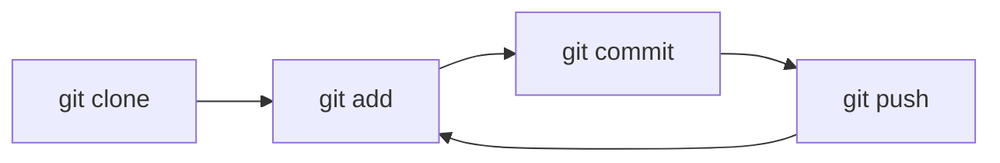
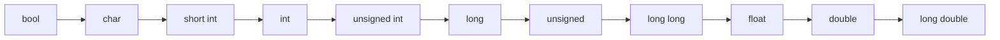

# Κεφάλαιο 4: Git και Τελεστές

<!--  -->

> **Στόχοι:** μετά από αυτό το κεφάλαιο θα μπορείτε να εξηγείτε τι είναι το pair
> programming και το version control, να κάνετε τον κύκλο `clone`, `add`, `commit`,
> `push` του git, να κατατάσσετε και να υπολογίζετε κάθε είδος τελεστή της C, και να
> προβλέπετε τη σειρά υπολογισμού από την προτεραιότητα και την προσεταιριστικότητα.
>
> **Προαπαιτούμενα:** [Κεφάλαιο 1](../01-command-line/), [Κεφάλαιο 2](../02-memory-variables/), [Κεφάλαιο 3](../03-functions/)
>
> **Χρόνος μελέτης:** ~2,5 ώρες

## Σύνοψη

Η διάλεξη έχει τρία μέρη. Ξεκινάει με live coding σε μορφή pair programming: γράφουμε
μαζί ένα πρόγραμμα που υπολογίζει τον βαθμό του μαθήματος από τα ορίσματα της γραμμής
εντολών. Μετά γνωρίζουμε το **git**, το σύστημα version control με το οποίο θα
γράφετε και θα υποβάλλετε όλες τις εργασίες του μαθήματος, και τον κύκλο των τεσσάρων
εντολών του. Το μεγαλύτερο μέρος αφορά τους **τελεστές** της C: τι είναι τελεστής
και τελεστέος, πώς κατατάσσονται, τι κάνει ο καθένας, και με ποια σειρά
υπολογίζονται σε μια παράσταση. Ένα λάθος στη σειρά ή στον τύπο τους (π.χ. ακέραια
διαίρεση) δίνει σιωπηλά λάθος αποτέλεσμα.

## Θεωρία

### Pair programming

**Pair programming** είναι μια τεχνική ανάπτυξης λογισμικού στην οποία δύο
προγραμματιστές δουλεύουν μαζί σε έναν υπολογιστή. Ο ένας, ο **driver**, γράφει τον
κώδικα· ο άλλος, ο **observer** ή **navigator**, ελέγχει (review) κάθε γραμμή τη
στιγμή που γράφεται. Οι δύο αλλάζουν ρόλους συχνά. Το όφελος είναι ότι τα λάθη
πιάνονται αμέσως και ότι δύο διαφορετικοί τρόποι σκέψης συμπληρώνουν ο ένας τον άλλο.
Όπως λέει ο Jeff Dean, χρειάζεται να βρείτε κάποιον «συμβατό με τον τρόπο που
σκέφτεστε, ώστε οι δύο μαζί να είστε μια συμπληρωματική δύναμη». Στη διάλεξη 2–3
εθελοντές έγραψαν έτσι το πρόγραμμα βαθμολογίας (βλ.
[Παραδείγματα](#πρόγραμμα-υπολογισμού-βαθμολογίας)).

### Ορίσματα της main: argc, argv και atoi

Η `main` μπορεί να δεχτεί ορίσματα από τη γραμμή εντολών:
`int main(int argc, char **argv)`. Η παράμετρος **`argc`** λέει πόσα ορίσματα
περάσαμε στο πρόγραμμα, και η **`argv`** περιέχει το κείμενο κάθε ορίσματος: το
`argv[1]` είναι το 1ο όρισμα, το `argv[2]` το 2ο, κ.ο.κ. Το `argv[0]` είναι το ίδιο το
όνομα του προγράμματος, γι' αυτό το `./grade 70 80 100` έχει `argc == 4`.

Τα ορίσματα είναι κείμενο, όχι αριθμοί. Η συνάρτηση βιβλιοθήκης **`atoi`** (από το
`stdlib.h`) μετατρέπει ένα αλφαριθμητικό (ASCII) σε ακέραιο (integer):
`atoi("70")` δίνει `70`. Αν σας ενοχλεί πόσο «μαγική» φαίνεται η `main` με τα
ορίσματά της, μην ανησυχείτε: είναι από τις δυσκολότερες συναρτήσεις της C και θα
χτίσουμε σταδιακά το υπόβαθρο (πίνακες, δείκτες, συμβολοσειρές) για να γίνει
κατανοητή.

### Version control

Όποιος έχει φακέλους με αρχεία `final.docx`, `final-final.docx`,
`final-final-final.docx` ξέρει το πρόβλημα: η «τελική» μορφή δεν είναι ποτέ τελική.
**Version control** είναι ένα σύστημα που παρακολουθεί όλες τις αλλαγές που γίνονται
στον κώδικα και κρατάει ιστορικό αρχείο τους. Το θέλουμε γιατί:

- τα περισσότερα προγράμματα αλλάζουν με τον χρόνο· δεν υπάρχει «τελική μορφή»·
- κάνουμε αλλαγές και κρατάμε μόνο τα αρχεία που χρειαζόμαστε, χωρίς να χάνουμε
  πληροφορία·
- μπορούμε να ανατρέξουμε σε οποιαδήποτε αλλαγή έγινε, ανά πάσα στιγμή.

### Git και GitHub

Το **git** είναι το δημοφιλέστερο πρόγραμμα version control σήμερα (το χρησιμοποιεί
περίπου το 90% των χρηστών/project). Την πρώτη του έκδοση την έγραψε ο Linus Torvalds
το 2005. Το **GitHub** ([github.com](https://github.com/)) είναι μια δημοφιλής και (για την ώρα)
δωρεάν πλατφόρμα όπου αποθηκεύουμε τον κώδικά μας. Στο μάθημα θα τα χρησιμοποιήσουμε
για τη γραφή **και την υποβολή** των εργασιών σας.

Ένα **repository (αποθετήριο)** είναι ένας φάκελος με αρχεία μαζί με όλο το ιστορικό
τους. Υπάρχει ένα αντίγραφο στο GitHub (το **απομακρυσμένο**, remote, στον server) και
ένα στον υπολογιστή σας (το **τοπικό**). Σε επίπεδο βασικής χρήσης, όση χρειάζεται το
μάθημα, η δουλειά με το git είναι τέσσερα βήματα:



*Σχήμα: ο κύκλος ανάπτυξης με git: ένα `clone` στην αρχή, μετά επαναλαμβάνουμε
`add`, `commit`, `push`.*

- **`git clone`** αντιγράφει το repository με όλα τα αρχεία σε έναν τοπικό φάκελο,
  που δημιουργείται αν δεν υπάρχει. Π.χ. το
  `git clone git@github.com:progintro/hw0-barbouni-2005.git` φτιάχνει τον φάκελο
  `hw0-barbouni-2005`. Γίνεται μία φορά ανά repository.
- **`git add`** προσθέτει αρχεία στο **staging area** (προσωρινή λίστα) για
  μελλοντική αποθήκευση στο repository. Ένα καινούργιο αρχείο που δεν έχει γίνει ακόμα
  `add` είναι **untracked**: το git το βλέπει αλλά δεν το παρακολουθεί.
- **`git commit`** αποθηκεύει (καταχωρεί) τις αλλαγές του staging area στο **τοπικό**
  repository, μαζί με ένα μήνυμα που περιγράφει την αλλαγή. Κάθε commit είναι ένα
  σημείο του ιστορικού στο οποίο μπορείτε να επιστρέψετε.
- **`git push`** ανεβάζει τα τοπικά commits στον απομακρυσμένο server. Μέχρι να γίνει
  push, οι αλλαγές σας υπάρχουν μόνο στον υπολογιστή σας.
- **`git pull`** κατεβάζει αλλαγές από τον server (αν υπάρχουν). Είναι χρήσιμο όταν
  δουλεύουν πολλοί προγραμματιστές ή όταν δουλεύετε από πολλούς υπολογιστές, ώστε να
  μη χρειάζεται νέο `clone` κάθε φορά.
- **`git status`** δεν αλλάζει τίποτα· δείχνει αν υπάρχουν αλλαγές, ποια αρχεία είναι
  untracked και ποια είναι έτοιμα για commit. Τρέξτε το μετά από κάθε βήμα.

Η σειρά έχει σημασία: αν ξεχάσετε το `git add`, τα `commit` και `push` «απογειώνονται»
χωρίς τα αρχεία σας. Για να δουλέψουν τα `clone`/`push` με διεύθυνση
`git@github.com:...`, πρέπει να έχετε φτιάξει κλειδί SSH για τον λογαριασμό σας στο
GitHub και να έχετε ρυθμίσει το git, όπως περιγράφει το Φυλλάδιο 1 του εργαστηρίου
([Εργαστήριο 1](https://progintro.github.io/lab-material/labs/lab01/), Βήμα 6).

### Τελεστής και τελεστέος

Οι **τελεστές (operators)** της C είναι σύμβολα που κάνουν μαθηματικούς,
συγκριτικούς, δυαδικούς (bit), υποθετικούς ή λογικούς υπολογισμούς. Οι **τελεστέοι
(operands)** είναι τα αντικείμενα (μεταβλητές, σταθερές) πάνω στα οποία δουλεύουν. Στο
`x + 42` ο τελεστής είναι το `+` (πρόσθεση), ο 1ος τελεστέος η μεταβλητή `x` και ο
2ος η σταθερά `42`. Κάθε τελεστής, όπως και μια συνάρτηση, **επιστρέφει μια τιμή**.

Ο τελεστής θυμίζει συνάρτηση και οι τελεστέοι τα ορίσματά της
([Κεφάλαιο 3](../03-functions/)): το πρόγραμμα παίρνει δεδομένα εισόδου και υπολογίζει
μια έξοδο, αποτελείται από συναρτήσεις που παίρνουν ορίσματα και υπολογίζουν μια
έξοδο, και οι συναρτήσεις χρησιμοποιούν τελεστές και τελεστέους για να υπολογίσουν
μια έξοδο («it's turtles all the way down»). Αν ο `+` για ακεραίους ήταν συνάρτηση, θα είχε πρωτότυπο κάτι σαν
`int plus(int a, int b)`, και ο `>` κάτι σαν `int greater(int a, int b)`.

### Κατηγοριοποίηση των τελεστών

Με βάση το **arity**, δηλαδή πόσους τελεστέους έχουν, οι τελεστές είναι:

- **μοναδιαίοι (unary)**, με έναν τελεστέο: `!x`, `~x`, `-x`, `x++`, `(double)x`·
- **δυαδικοί (binary)**, με δύο: `x + y`, `x < y`, `x && y`, `x = y`·
- **τριαδικοί (ternary)**, με τρεις: ο μοναδικός είναι ο τελεστής συνθήκης `c ? a : b`.

Με βάση τη χρήση τους χωρίζονται σε αριθμητικούς, συγκριτικούς, λογικούς, bitwise,
συνθήκης, μετατροπής, ανάθεσης (και οι συγγενείς τους: αύξησης/μείωσης και
παράθεσης). Τέλος, κάθε τελεστής έχει **προτεραιότητα** και **προσεταιριστικότητα**,
που ορίζουν τη σειρά υπολογισμού.

### Αριθμητικοί τελεστές

| Τελεστής | Ερμηνεία | Παραδείγματα |
| --- | --- | --- |
| `+` | πρόσθεση | `40 + 2` → `42`, `40.0 + 2.0` → `42.0` |
| `-` | αφαίρεση | `44 - 2` → `42`, `44.0 - 2.0` → `42.0` |
| `*` | πολλαπλασιασμός | `42 * 2` → `84`, `42.0 * 2.0` → `84.0` |
| `/` | διαίρεση | `85.0 / 2.0` → `42.5`, `85 / 2` → `42` |
| `%` | υπόλοιπο | `7 % 2` → `1` |

Είναι δυαδικοί (τα `+` και `-` υπάρχουν και ως μοναδιαίοι, π.χ. `-x`). Προσέξτε τη
διαίρεση: όταν **και οι δύο** τελεστέοι είναι ακέραιοι, το `/` κάνει **ακέραια
διαίρεση** και δίνει το πηλίκο, πετώντας το κλασματικό μέρος (`85 / 2` είναι `42`,
`3 / 4` είναι `0`). Το `%` ορίζεται μόνο για ακεραίους.

### Συγκριτικοί τελεστές

Οι **συγκριτικοί τελεστές (comparison / relational operators)** συγκρίνουν δύο
τελεστέους και επιστρέφουν `0` (ψευδές) ή `1` (αληθές). Είναι δυαδικοί.

| Τελεστής | Ερώτηση | Παραδείγματα |
| --- | --- | --- |
| `==` | ίσοι τελεστέοι; | `42 == 0` → `0`, `42 == 42` → `1` |
| `!=` | διαφορετικοί; | `42 != 0` → `1`, `42 != 42` → `0` |
| `>` | αριστερός μεγαλύτερος; | `42 > 0` → `1`, `42 > 42` → `0` |
| `<` | αριστερός μικρότερος; | `42 < 0` → `0`, `42 < 44` → `1` |
| `>=` | μεγαλύτερος ή ίσος; | `42 >= 42` → `1`, `42 >= 43` → `0` |
| `<=` | μικρότερος ή ίσος; | `42 <= 42` → `1`, `42 <= 41` → `0` |

Η ισότητα γράφεται με **δύο** `=`· το ένα `=` είναι ανάθεση.

### Λογικοί τελεστές

Οι **λογικοί τελεστές (logical operators)** συνδυάζουν αληθείς και ψευδείς τιμές:

| Τελεστής | Ερμηνεία | Παραδείγματα |
| --- | --- | --- |
| `&&` | λογική σύζευξη (AND, ∧): αληθείς και οι δύο; | `42 > 0 && 2 > 3` → `0`, `42 > 0 && 3 > 2` → `1` |
| `\|\|` | λογική διάζευξη (OR, ∨): αληθής ένας από τους δύο; | `2 > 3 \|\| 42 > 0` → `1`, `2 > 3 \|\| 42 < 0` → `0` |
| `!` | λογική άρνηση (NOT, ¬): ψευδής ο τελεστέος; | `!(42 < 0)` → `1`, `!(42 > 0)` → `0` |

Οι `&&` και `||` είναι δυαδικοί, ο `!` μοναδιαίος. **Σημαντικό:** για τους λογικούς
τελεστές της C, το **μηδέν σημαίνει «ψευδές»** και **οποιαδήποτε μη μηδενική τιμή
σημαίνει «αληθές»**. Τα `1`, `42` και `-5` είναι όλα εξίσου αληθή, άρα `!42` είναι
`0` και `-5 && 42` είναι `1`. Το αποτέλεσμα ενός λογικού τελεστή είναι πάντα `0` ή
`1`.

### Bitwise τελεστές

Οι **bitwise τελεστές** δουλεύουν πάνω στα bit των **ακεραίων** αριθμών, ένα bit
κάθε φορά. Είναι βολικό να τους βλέπουμε σε δεκαεξαδικό, όπου κάθε ψηφίο είναι 4 bit
(`0xF` = `1111`, `0x0` = `0000`).

| Τελεστής | Ερμηνεία | Παραδείγματα |
| --- | --- | --- |
| `&` | σύζευξη bit (bitwise AND) | `0xFF & 0xF0` → `0xF0`, `0xFF & 0x00` → `0x00` |
| `\|` | διάζευξη bit (bitwise OR) | `0xFF \| 0xF0` → `0xFF`, `0xF0 \| 0x0F` → `0xFF` |
| `^` | αποκλειστική διάζευξη (bitwise XOR) | `0xFF ^ 0xFF` → `0x00`, `0x00 ^ 0xFF` → `0xFF` |
| `~` | άρνηση bit (bitwise NOT) | `~0xF0` → `0x0F`, `~0x05` → `0xFA` (σε 8 bit) |
| `<<` | ολίσθηση αριστερά κατά N bit, σαν πολλαπλασιασμός με $2^N$ | `2 << 4` → `32`, `4 << 1` → `8` |
| `>>` | ολίσθηση δεξιά κατά N bit, σαν διαίρεση με $2^N$ | `8 >> 1` → `4`, `32 >> 4` → `2` |

Ο `~` είναι μοναδιαίος, οι υπόλοιποι δυαδικοί. Τα παραδείγματα του `~` ισχύουν για
ένα byte (8 bit)· σε `int` 32 bit όλα τα πάνω bit γίνονται επίσης 1, οπότε
`~0xF0` είναι `0xFFFFFF0F`.

Δύο χρήσιμα μοτίβα: το `&` με μια **μάσκα** κρατάει μόνο τα bit όπου η μάσκα έχει 1
(π.χ. `x & 0x80` απομονώνει το πιο σημαντικό bit ενός byte), και το `|` **ανάβει** τα
bit όπου η μάσκα έχει 1 και αφήνει τα υπόλοιπα ίδια. Μην μπερδεύετε `&` με `&&` και
`|` με `||`: `2 & 1` είναι `0`, ενώ `2 && 1` είναι `1`.

### Τελεστής συνθήκης

Ο **τελεστής συνθήκης (conditional operator)** ελέγχει μια συνθήκη· αν είναι αληθής
επιστρέφει την πρώτη τιμή, αλλιώς τη δεύτερη:

```text
συνθήκη ? τιμή1 : τιμή2
```

Έτσι `(42 > 0) ? 8 : 16` επιστρέφει `8` και `(42 == 0) ? 8 : 16` επιστρέφει `16`.
Είναι ο μοναδικός **τριαδικός** τελεστής της C. Επειδή είναι παράσταση (έχει τιμή),
μπαίνει όπου μπαίνει και μια τιμή: `max = (a > b) ? a : b;`.

### Τελεστής μετατροπής και σιωπηρή μετατροπή τύπων

Ο **τελεστής μετατροπής (cast operator)** αλλάζει τον τύπο ενός τελεστέου:
`(τύπος)τελεστέος`. Είναι μοναδιαίος. Αυτό λέγεται και **ρητή μετατροπή τύπου
(explicit type conversion)**.

- `(int)42.67` επιστρέφει `42`: τα ψηφία μετά την υποδιαστολή **αποκόπτονται**, δεν
  στρογγυλοποιούνται.
- `(char)67.8` επιστρέφει `'C'`: αποκοπή σε `67`, που είναι ο κωδικός ASCII του `C`.
- `(double)3` επιστρέφει `3.0`.
- `(double)3/4` επιστρέφει `0.75`: το cast έχει μεγαλύτερη προτεραιότητα από το `/`,
  οπότε μετατρέπεται πρώτα το `3` και η διαίρεση γίνεται με πραγματικούς. Αντίθετα,
  `(double)(3/4)` είναι `0.0`, γιατί η ακέραια διαίρεση `3/4` δίνει ήδη `0`.

Όταν ένας τελεστής έχει τελεστέους **διαφορετικών τύπων**, ο μεταγλωττιστής προσθέτει
αυτόματα μετατροπή στον «μεγαλύτερο» από τους δύο τύπους. Αυτή είναι η **σιωπηρή
μετατροπή τύπων (implicit type conversion)**. Το `40 + 2.0` είναι ισοδύναμο με
`(double)40 + 2.0`, δηλαδή με `40.0 + 2.0`, και δίνει `double`. Η ιεραρχία των
διαφανειών, από τον «μικρότερο» στον «μεγαλύτερο» τύπο, είναι:



*Σχήμα: η ιεραρχία της σιωπηρής μετατροπής· ο «μικρότερος» τύπος μετατρέπεται στον
«μεγαλύτερο».*

Μετατροπή γίνεται και στην ανάθεση: η τιμή μετατρέπεται στον τύπο της μεταβλητής,
με απώλεια πληροφορίας αν ο τύπος δεν τη χωράει (`int i = 42.67;` δίνει `i == 42`).

### Τελεστής ανάθεσης

Ο **τελεστής ανάθεσης (assignment operator)** `=` παίρνει την τιμή του δεξιού
τελεστέου (**rvalue**), την αναθέτει στη **μεταβλητή** του αριστερού τελεστέου
(**lvalue**) και **την επιστρέφει**. Το `x = 42` αναθέτει `42` στο `x` και επιστρέφει
`42`. Αριστερά πρέπει να υπάρχει κάτι που έχει θέση στη μνήμη (μια μεταβλητή)· το
`42 = x` δεν μεταγλωττίζεται.

Επειδή η ανάθεση επιστρέφει τιμή και έχει προσεταιριστικότητα από δεξιά προς
αριστερά, μπορούμε να αναθέσουμε σε πολλές μεταβλητές ταυτόχρονα: το `x = y = 42`
είναι ισοδύναμο με `x = (y = 42)`.

### Συνδυαστικοί τελεστές ανάθεσης

Οι **συνδυαστικοί τελεστές ανάθεσης (compound assignment operators)** κάνουν μια
πράξη και σώζουν το αποτέλεσμα με συντομογραφία:

```text
τελεστέος1 op= τελεστέος2
```

όπου `op` οποιοσδήποτε από τους `+`, `-`, `*`, `%`, `/`, `&`, `^`, `|`, `<<`, `>>`.
Το `a += b` είναι ισοδύναμο με `a = a + b`, το `a *= b` με `a = a * b`, και ομοίως για
τους άλλους. Προσοχή: ολόκληρο το δεξί μέλος υπολογίζεται πρώτα, οπότε το
`a *= b + 1` σημαίνει `a = a * (b + 1)`.

### Τελεστές αύξησης και μείωσης

Ο **τελεστής αύξησης** `++` μπαίνει πριν ή μετά από το όνομα μιας μεταβλητής και την
αυξάνει κατά 1· ο **τελεστής μείωσης** `--` τη μειώνει κατά 1. Η θέση τους καθορίζει
**ποια τιμή επιστρέφουν**:

| Μορφή | Γραφή | Επιστρέφει |
| --- | --- | --- |
| επιθεματική (postfix) | `a++`, `a--` | την τιμή του `a` **πριν** την αύξηση/μείωση |
| προθεματική (prefix) | `++a`, `--a` | την τιμή του `a` **μετά** την αύξηση/μείωση |

```c
a = 5;
b = a++;   /* b == 5, a == 6 */
c = ++a;   /* c == 7, a == 7 */
```

Ως αυτόνομες εντολές (`a++;` ή `++a;`) κάνουν ακριβώς το ίδιο· η διαφορά φαίνεται μόνο
όταν η τιμή τους χρησιμοποιείται μέσα σε μεγαλύτερη παράσταση.

### Τελεστής παράθεσης

Ο **τελεστής παράθεσης (comma operator)** `,` υπολογίζει τον πρώτο τελεστέο, αγνοεί το
αποτέλεσμα και επιστρέφει τον δεύτερο: το `12, 42` επιστρέφει `42`. Έχει σχετικά
περιορισμένες χρήσεις και συνήθως χρησιμοποιείται με τελεστές ανάθεσης, π.χ.
`i = 0, j = 10` (δύο αναθέσεις σε μία παράσταση). Έχει τη **χαμηλότερη**
προτεραιότητα από όλους, οπότε `x = 12, 42;` αναθέτει `12` στο `x`, ενώ
`x = (12, 42);` αναθέτει `42`.

### Προτεραιότητα και προσεταιριστικότητα

Η **προτεραιότητα (precedence)** ενός τελεστή καθορίζει τη σειρά με την οποία
εκτελούνται οι υπολογισμοί. Ο πολλαπλασιασμός έχει υψηλότερη προτεραιότητα από την
πρόσθεση, άρα `5 * 6 + 3 * 4` είναι `(5 * 6) + (3 * 4)` = `42`.

Αν δύο τελεστές έχουν την ίδια προτεραιότητα, η **προσεταιριστικότητα
(associativity)** καθορίζει τη σειρά: **από αριστερά προς τα δεξιά** ή το αντίστροφο.
Ο πολλαπλασιασμός και η διαίρεση έχουν την ίδια προτεραιότητα και
προσεταιριστικότητα από αριστερά προς τα δεξιά, άρα `90 * 50 / 100` είναι
`(90 * 50) / 100` = `4500 / 100` = `45`. Με ακεραίους η σειρά αλλάζει το αποτέλεσμα:
`50 / 100 * 90` είναι `(50 / 100) * 90` = `0 * 90` = `0`.

| Θέση | Τελεστές | Προσεταιριστικότητα |
| --- | --- | --- |
| 1 | `()` (παρενθέσεις, κλήση συνάρτησης), `[]`, `->`, `.`, `++` `--` (επιθεματικά) | αριστερά προς δεξιά |
| 2 | `++` `--` (προθεματικά), `!`, `~`, `*` (έμμεση αναφορά), `&` (διεύθυνση), `+` `-` (μοναδιαία), `(τύπος)`, `sizeof` | δεξιά προς αριστερά |
| 3 | `*` `/` `%` | αριστερά προς δεξιά |
| 4 | `+` `-` | αριστερά προς δεξιά |
| 5 | `<<` `>>` | αριστερά προς δεξιά |
| 6 | `<` `<=` `>` `>=` | αριστερά προς δεξιά |
| 7 | `==` `!=` | αριστερά προς δεξιά |
| 8 | `&` | αριστερά προς δεξιά |
| 9 | `^` | αριστερά προς δεξιά |
| 10 | `\|` | αριστερά προς δεξιά |
| 11 | `&&` | αριστερά προς δεξιά |
| 12 | `\|\|` | αριστερά προς δεξιά |
| 13 | `?:` | δεξιά προς αριστερά |
| 14 | `=` `+=` `-=` `*=` `/=` `%=` `&=` `^=` `\|=` `<<=` `>>=` | δεξιά προς αριστερά |
| 15 | `,` | αριστερά προς δεξιά |

Η θέση 1 έχει την υψηλότερη προτεραιότητα. Χρήσιμοι κανόνες: μοναδιαίοι πριν από
αριθμητικούς, αριθμητικοί πριν από συγκριτικούς, συγκριτικοί πριν από λογικούς, και
ανάθεση σχεδόν τελευταία (γι' αυτό το `x = a + b > c` αναθέτει το αποτέλεσμα της
σύγκρισης). Οι τελεστές `*` (έμμεση αναφορά), `&` (διεύθυνση), `->`, `.` και `[]` θα
τους δούμε με τους δείκτες και τους πίνακες. **Δεν είστε σίγουροι για την ακριβή
σειρά; Χρησιμοποιήστε παρενθέσεις `()`.**

## Παραδείγματα

### Πρόγραμμα υπολογισμού βαθμολογίας

*Εφαρμόζει: συναρτήσεις ([Κεφάλαιο 3](../03-functions/)), `argc`/`argv`/`atoi`,
αριθμητικούς τελεστές, προτεραιότητα.* Το live coding της διάλεξης. Ο βαθμός των
πρωτοετών είναι 50% Τελική Εξέταση + 30% Ασκήσεις + 20% Εργαστήριο, με κάθε βαθμό
ακέραιο στο [0, 100]. Στα μαθηματικά:

$$\mathrm{grade}(f, h, l) = 0.5 f + 0.3 h + 0.2 l$$

Έλεγχος ορθότητας: $\mathrm{grade}(70, 80, 100) = 35 + 24 + 20 = 79$. Πώς το γράφουμε
σε C; Μια περσινή λύση:

```c
#include <stdio.h>
#include <stdlib.h>

// The grade function computes the final grade for first year students
// according to https://progintro.github.io
int grade(int final_exam, int homework, int lab) {
  return final_exam*50/100 + homework*30/100 + lab*20/100;
}

int main(int argc, char **argv) {
  if (argc != 4) {
    printf("Run as: grade final_exam homework lab\n");
    return 1;
  }
  int final_exam = atoi(argv[1]);
  int homework = atoi(argv[2]);
  int lab = atoi(argv[3]);
  int final_grade = grade(final_exam, homework, lab);
  printf("My grade is: %d\n", final_grade);
  return 0;
}
```

```text
$ gcc -o grade grade.c
$ ./grade 70 80 100
My grade is: 79
$ ./grade 70 80
Run as: grade final_exam homework lab
```

Παρατηρήστε:

- Το `argc != 4` ελέγχει ότι δόθηκαν ακριβώς τρία ορίσματα (το `argv[0]` είναι το
  όνομα του προγράμματος). Αλλιώς τυπώνουμε οδηγίες χρήσης και επιστρέφουμε `1`
  (αποτυχία).
- Τα `argv[1]`…`argv[3]` είναι κείμενο· το `atoi` τα κάνει ακεραίους.
- Όλα είναι `int`, άρα το `50%` γράφεται `*50/100` και **όχι** `*0.5` ή `*(50/100)`.
  Επειδή `*` και `/` έχουν ίδια προτεραιότητα και προσεταιριστικότητα από αριστερά,
  το `final_exam*50/100` είναι `(final_exam*50)/100`: πρώτα πολλαπλασιασμός, μετά
  διαίρεση. Το `50/100*final_exam` θα έδινε πάντα `0`.
- Κάθε όρος περικόπτεται χωριστά από την ακέραια διαίρεση, οπότε ο βαθμός δεν
  στρογγυλοποιείται: `./grade 71 81 99` δίνει `35 + 24 + 19 = 78`, ενώ ο ακριβής
  βαθμός είναι 78,6.

Η διάλεξη αφήνει και έναν **κανόνα αναπροσαρμογής**: αν ο βαθμός των Ασκήσεων είναι
πάνω από 3 μονάδες μεγαλύτερος από τον βαθμό της Τελικής Εξέτασης, ο βαθμός των
Ασκήσεων αναπροσαρμόζεται σε Τελική Εξέταση + 3. Πώς θα το εκφράσουμε; Είναι άσκηση
(βλ. [Ασκήσεις](#ασκήσεις))· ο [τελεστής συνθήκης](#τελεστής-συνθήκης) αρκεί.

### Ο κύκλος του git βήμα προς βήμα

*Εφαρμόζει: `clone`, `add`, `commit`, `push`, `pull`, `status`.* Η διάλεξη κάνει τον
κύκλο ζωντανά στο repository της hw0:

```sh
git clone git@github.com:progintro/hw0-barbouni-2005.git
cd hw0-barbouni-2005
ls                              # ένα αρχείο README.md
git status                      # καμία αλλαγή
touch command/solution.txt      # νέο αρχείο
git status                      # command/solution.txt: untracked
git add command/solution.txt
git status                      # έτοιμο για commit
git commit                      # γράψτε ένα μήνυμα για την αλλαγή
git status                      # μένει να σώσουμε και εκτός υπολογιστή
git push                        # ανέβασμα στο GitHub
```

Μετά το `push`, ελέγξτε ότι οι αλλαγές σας εμφανίζονται στη σελίδα του repository στο
GitHub. Για το `pull`: κάντε μια αλλαγή σε ένα αρχείο από το web UI του GitHub και
μετά τρέξτε `git pull` στον φάκελό σας· η αλλαγή εμφανίζεται τοπικά. Το ίδιο κάνει
και η Άσκηση 1 του [Εργαστηρίου 1](https://progintro.github.io/lab-material/labs/lab01/)
με ένα αρχείο `info.txt`.

### Κατηγορίες και «πρωτότυπα» τελεστών

*Εφαρμόζει: τελεστής/τελεστέος, arity.* Οι διαφάνειες ρωτούν για κάθε ομάδα «τι
τύπου τελεστές είναι;» και «τι τύπο θα είχαν αν ήταν συναρτήσεις;». Οι αριθμητικοί,
οι συγκριτικοί, οι `&&`/`||` και οι bitwise εκτός του `~` είναι δυαδικοί, άρα για
`int` θα έμοιαζαν με `int f(int a, int b)`· οι `!`, `~` και το cast είναι μοναδιαίοι
(`int f(int a)`, `double to_double(int a)`)· ο `? :` είναι τριαδικός
(`int cond(int c, int a, int b)`). Για πραγματικούς τελεστέους ο ίδιος τελεστής θα
ήταν άλλη «συνάρτηση» (`double plus(double a, double b)`), γι' αυτό `85 / 2` και
`85.0 / 2.0` δίνουν διαφορετικό αποτέλεσμα.

### Μέγιστο με τον τελεστή συνθήκης

*Εφαρμόζει: τελεστή συνθήκης, συναρτήσεις.* «Πώς θα φτιάχναμε μια συνάρτηση `max`;»
Αφού το `? :` επιστρέφει τιμή, αρκεί μία εντολή `return`:

```c
int max(int a, int b) {
  return (a > b) ? a : b;
}
```

## Κύρια σημεία

1. Στο pair programming ο driver γράφει κώδικα και ο navigator ελέγχει κάθε γραμμή· οι
   ρόλοι αλλάζουν συχνά.
2. Στην `main(int argc, char **argv)` το `argc` είναι το πλήθος των ορισμάτων και το
   `argv[1]` το 1ο όρισμα ως κείμενο· το `atoi` το κάνει ακέραιο.
3. Το version control κρατάει όλο το ιστορικό των αλλαγών· το git είναι το
   δημοφιλέστερο, και στο GitHub θα γράφετε και θα υποβάλλετε τις εργασίες σας.
4. Ο κύκλος του git είναι `clone` μία φορά και μετά `add`, `commit`, `push`· το `pull`
   φέρνει αλλαγές από τον server. Μην ξεχνάτε το `add` πριν από `commit` και `push`.
5. Οι τελεστές κάνουν υπολογισμούς πάνω σε τελεστέους και επιστρέφουν μια τιμή, όπως οι
   συναρτήσεις με τα ορίσματά τους· κατά arity είναι μοναδιαίοι, δυαδικοί ή τριαδικοί.
6. Η διαίρεση δύο ακεραίων είναι ακέραια διαίρεση: `85 / 2` είναι `42`.
7. Οι συγκριτικοί και οι λογικοί τελεστές επιστρέφουν `0` ή `1`· για τους λογικούς το
   μηδέν είναι «ψευδές» και κάθε μη μηδενική τιμή (`1`, `42`, `-5`) «αληθές».
8. Οι bitwise τελεστές δουλεύουν στα bit των ακεραίων· η ολίσθηση κατά N bit
   ισοδυναμεί με πολλαπλασιασμό ή διαίρεση με $2^N$.
9. Το cast `(τύπος)τελεστέος` κάνει ρητή μετατροπή, και από πραγματικό σε ακέραιο
   αποκόπτει (δεν στρογγυλοποιεί)· σε μικτές παραστάσεις γίνεται σιωπηρή μετατροπή στον
   «μεγαλύτερο» τύπο.
10. Η ανάθεση αναθέτει το rvalue στο lvalue και επιστρέφει την τιμή, γι' αυτό
    `x = y = 42` σημαίνει `x = (y = 42)`· το `a op= b` σημαίνει `a = a op b`.
11. Το `a++` επιστρέφει την τιμή πριν την αύξηση, το `++a` την τιμή μετά.
12. Ο τελεστής παράθεσης υπολογίζει τον πρώτο τελεστέο, τον αγνοεί και επιστρέφει τον
    δεύτερο.
13. Η προτεραιότητα ορίζει ποιος τελεστής εφαρμόζεται πρώτος και η
    προσεταιριστικότητα τη σειρά για ίση προτεραιότητα· όταν δεν είστε σίγουροι,
    χρησιμοποιήστε παρενθέσεις.

## Ορολογία

| Ελληνικά | English | Σύντομος ορισμός |
| --- | --- | --- |
| προγραμματισμός σε ζεύγη | pair programming | Δύο προγραμματιστές σε έναν υπολογιστή, driver και navigator |
| έλεγχος εκδόσεων | version control | Σύστημα που κρατάει το ιστορικό όλων των αλλαγών |
| αποθετήριο | repository | Φάκελος αρχείων μαζί με το ιστορικό τους |
| προσωρινή λίστα | staging area | Οι αλλαγές που θα μπουν στο επόμενο commit |
| καταχώρηση | commit | Αποθήκευση των αλλαγών στο τοπικό repository |
| τελεστής | operator | Σύμβολο που κάνει υπολογισμό και επιστρέφει τιμή |
| τελεστέος | operand | Μεταβλητή ή σταθερά πάνω στην οποία δουλεύει ο τελεστής |
| πλήθος τελεστέων | arity | Μοναδιαίος (1), δυαδικός (2), τριαδικός (3) |
| τελεστής μετατροπής | cast operator | `(τύπος)τελεστέος`, ρητή μετατροπή τύπου |
| σιωπηρή μετατροπή | implicit type conversion | Αυτόματη μετατροπή στον «μεγαλύτερο» τύπο |
| τελεστής ανάθεσης | assignment operator | `=`· αναθέτει και επιστρέφει την τιμή |
| lvalue / rvalue | lvalue / rvalue | Αριστερός (μεταβλητή) / δεξιός (τιμή) τελεστέος της ανάθεσης |
| επιθεματικός / προθεματικός | postfix / prefix | `a++` (παλιά τιμή) / `++a` (νέα τιμή) |
| τελεστής παράθεσης | comma operator | `a, b`: υπολογίζει το `a`, επιστρέφει το `b` |
| προτεραιότητα | precedence | Ποιος τελεστής εφαρμόζεται πρώτος |
| προσεταιριστικότητα | associativity | Σειρά υπολογισμού για ίση προτεραιότητα |

## Συχνά λάθη

- **`git commit` χωρίς `git add`.** Το νέο αρχείο μένει untracked και δεν ανεβαίνει
  ποτέ. Διόρθωση: `git status`, `git add <αρχείο>`, ξανά `commit` και `push`.
- **Commit χωρίς push.** Οι αλλαγές υπάρχουν μόνο στον υπολογιστή σας και το GitHub δεν
  τις βλέπει· για τις εργασίες μετράει ό,τι έχει γίνει push. Ελέγξτε τη σελίδα του
  repository.
- **`Permission denied (publickey)` στο `clone`/`push`.** Δεν έχει προστεθεί κλειδί SSH
  στο GitHub. Ακολουθήστε το Βήμα 6 του Εργαστηρίου 1.
- **`push` που απορρίπτεται (`rejected ... fetch first`).** Υπάρχουν στο GitHub commits
  που δεν έχετε τοπικά (π.χ. από το web UI). Τρέξτε πρώτα `git pull`.
- **Ακέραια διαίρεση.** `final_exam * (50/100)` ή `3 / 4` δίνουν `0`. Διόρθωση:
  πολλαπλασιασμός πριν από τη διαίρεση, ή ένας τελεστέος `double` (`3.0 / 4`,
  `(double)3 / 4`).
- **Cast στη λάθος θέση ή αναμονή στρογγυλοποίησης.** `(double)(3 / 4)` είναι `0.0`
  (η ακέραια διαίρεση έγινε πρώτα)· `(int)42.67` είναι `42`, όχι `43`.
- **`=` αντί για `==`.** `if (x = 42)` αναθέτει και είναι πάντα αληθές· ο gcc με
  `-Wall` προειδοποιεί (`suggest parentheses around assignment used as truth value`).
- **`&` αντί για `&&` (ή `|` αντί για `||`).** `2 & 1` είναι `0`, `2 && 1` είναι `1`.
- **Τα παραδείγματα του `~` σε `int`.** `~0xF0` σε `int` είναι `0xFFFFFF0F`, όχι
  `0x0F`· η απάντηση των διαφανειών ισχύει για ένα byte.
- **Κόμμα χωρίς παρενθέσεις.** `x = 12, 42;` αναθέτει `12`, αφού το `,` έχει τη
  χαμηλότερη προτεραιότητα.
- **Υποθέσεις για την προτεραιότητα.** `x & 1 == 0` σημαίνει `x & (1 == 0)`, γιατί το
  `==` (θέση 7) προηγείται του `&` (θέση 8). Διόρθωση: `(x & 1) == 0`.

## Διάβασμα

- **Διαφάνειες:** [Διάλεξη 4](https://github.com/progintro/progintro.github.io/releases/download/2025/lec04.pdf), σελ. 1–44. Pair programming: σελ. 5–7· πρόγραμμα βαθμολογίας και `argc`/`argv`/`atoi`: σελ. 8–10, 38· version control και git: σελ. 11–19· τελεστές: σελ. 20–37· προτεραιότητα και προσεταιριστικότητα: σελ. 39–41.
- **Σημειώσεις:** [Κεφάλαιο 2: Μεταβλητές, τύποι, τελεστές και παραστάσεις](https://progintro.github.io/notes/chapters/02-types-operators/), ενότητα «Εντολές αντικατάστασης, τελεστές και παραστάσεις» (K04, σελ. 34–43). Οι διαφάνειες συνιστούν να έχετε καλύψει τις σημειώσεις του κ. Σταματόπουλου μέχρι τη σελίδα 43, δηλαδή ολόκληρη αυτή την ενότητα.
- **Εργαστήριο:** [Εργαστήριο 1](https://progintro.github.io/lab-material/labs/lab01/): «Βήμα 6: Git και GitHub» (λογαριασμός, κλειδί SSH, `git config`) και «Άσκηση 1: Το πρώτο σας repository (info.txt)».
- **Βιβλίο:** K&R, §2.5–§2.12, όπως προτείνουν οι σημειώσεις.
- **Άλλα:**
  - Wikipedia (σελ. 5): [Software development](https://en.wikipedia.org/wiki/Software_development), [Computer programmer](https://en.wikipedia.org/wiki/Computer_programmer), [Source code](https://en.wikipedia.org/wiki/Source_code), [Code review](https://en.wikipedia.org/wiki/Code_review)
  - Wikipedia: [Git](https://en.wikipedia.org/wiki/Git), [Arity](https://en.wikipedia.org/wiki/Arity), [Comma operator](https://en.wikipedia.org/wiki/Comma_operator), [Value (lvalues και rvalues)](https://en.wikipedia.org/wiki/Value_(computer_science))
  - [Type conversion in C](https://www.geeksforgeeks.org/type-conversion-c/), [List of operators](https://www.tutorialspoint.com/cprogramming/c_operators.htm), [Precedence and associativity (cppreference)](https://en.cppreference.com/w/c/language/operator_precedence)
  - Προαιρετικά: [Git Cheat Sheet](https://education.github.com/git-cheat-sheet-education.pdf), [Git Tutorial](https://product.hubspot.com/blog/git-and-github-tutorial-for-beginners)
  - Για το pair programming: [Jeff Dean quotes](https://www.brainyquote.com/authors/jeff-dean-quotes), [Jeff and Sanjay (The New Yorker)](https://www.newyorker.com/magazine/2018/12/10/the-friendship-that-made-google-huge)

## Ασκήσεις

<!-- exercises -->

### Από τις διαφάνειες

- [Η τιμή του 0xbeef | 0xcafe0000](../../questions/slides/slides-lec04-cafebeef.md): Διάλεξη 4: Git και Τελεστές, διαφάνεια 30 · ★☆☆ · multiple-choice
- [Ο κύκλος clone, add, commit, push, pull](../../questions/slides/slides-lec04-git-cycle.md): Διάλεξη 4: Git και Τελεστές, διαφάνειες 15-18 · ★☆☆ · tooling
- [Κανόνας αναπροσαρμογής βαθμού ασκήσεων](../../questions/slides/slides-lec04-grade-adjustment.md): Διάλεξη 4: Git και Τελεστές, διαφάνεια 8 · ★☆☆ · programming
- [Υπολογισμός βαθμολογίας πρωτοετών](../../questions/slides/slides-lec04-grade-program.md): Διάλεξη 4: Git και Τελεστές, διαφάνεια 8 · ★☆☆ · programming
- [Συνάρτηση max με τον τελεστή συνθήκης](../../questions/slides/slides-lec04-max-conditional.md): Διάλεξη 4: Git και Τελεστές, διαφάνεια 31 · ★☆☆ · programming
- [Απομόνωση του πιο σημαντικού bit](../../questions/slides/slides-lec04-msb.md): Διάλεξη 4: Git και Τελεστές, διαφάνεια 29 · ★☆☆ · multiple-choice
- [Τι τύπου τελεστές είναι;](../../questions/slides/slides-lec04-operator-arity.md): Διάλεξη 4: Git και Τελεστές, διαφάνειες 25-28 και 31 · ★☆☆ · short-answer
- [Τελεστές ως συναρτήσεις](../../questions/slides/slides-lec04-operators-as-functions.md): Διάλεξη 4: Git και Τελεστές, διαφάνειες 21 και 25 · ★☆☆ · short-answer
- [Προτεραιότητα και προσεταιριστικότητα](../../questions/slides/slides-lec04-precedence.md): Διάλεξη 4: Git και Τελεστές, διαφάνεια 39 · ★☆☆ · trace
- [Τι επιστρέφει το (double)3/4;](../../questions/slides/slides-lec04-cast-division.md): Διάλεξη 4: Git και Τελεστές, διαφάνεια 32 · ★★☆ · trace

### Από τα εργαστήρια

- [Το πρώτο σας repository](../../questions/labs/lab-lab01-info.md): Εργαστήριο 1, Άσκηση 1 · ★☆☆ · tooling

### Από τις εργασίες

- [Νέο URL στο GitHub (pages)](../../questions/homework/hw-2025-hw0-pages.md): Εργασία 0 (2025-26), Άσκηση 1 · ★☆☆ · tooling

### Από τα θέματα εξετάσεων

- [Άρτια Bits](../../questions/exams/exam-2023-fall-ex8-q1.md): Online τελική εξέταση Δεκεμβρίου 2023, Εξέταση #8, Θέμα 1 · ★☆☆ · programming

### Σχετικές ασκήσεις από άλλα κεφάλαια

- [Ξεκινώντας με την γραμμή εντολών (bandit)](../../questions/homework/hw-2023-hw0-bandit.md): Εργασία 0 (2023-24), Άσκηση 2 · ★★☆ · tooling (κεφ. 1)
- [Παιχνίδια με Κονσόλα (cmdline)](../../questions/homework/hw-2025-hw0-cmdline.md): Εργασία 0 (2025-26), Άσκηση 2 · ★★☆ · tooling (κεφ. 1)
- [Κάντο όπως ο Βιετά](../../questions/exams/exam-2023-dec-q1.md): Κατατακτήριες Δεκεμβρίου 2023, Θέμα 1 · ★★☆ · programming (κεφ. 6)
- [Ασημένιο Κλάσμα](../../questions/exams/exam-2023-fall-ex10-q2.md): Online τελική εξέταση Δεκεμβρίου 2023, Εξέταση #10, Θέμα 2 · ★★☆ · programming (κεφ. 6)
- [Κάντο όπως ο Βιετά](../../questions/exams/exam-2023-fall-ex13-q1.md): Online τελική εξέταση Δεκεμβρίου 2023, Εξέταση #13, Θέμα 1 · ★★☆ · programming (κεφ. 6)
- [Τυπώνοντας τον Πίνακα ASCII](../../questions/exams/exam-2023-fall-ex15-q2.md): Online τελική εξέταση Δεκεμβρίου 2023, Εξέταση #15, Θέμα 2 · ★★☆ · programming (κεφ. 6)
- [Μέγιστος Κοινός Διαιρέτης](../../questions/exams/exam-2023-fall-ex6-q1.md): Online τελική εξέταση Δεκεμβρίου 2023, Εξέταση #6 (Crypto Themed), Θέμα 1 · ★☆☆ · programming (κεφ. 6)
- [Προσεγγίζοντας το π](../../questions/exams/exam-2024-dec-q1.md): Κατατακτήριες Δεκεμβρίου 2024, Θέμα 1 · ★☆☆ · programming (κεφ. 6)
- [Εύρεση Πρώτων Παραγόντων - factor](../../questions/exams/exam-2026-jan-q3.md): Εξέταση Ιανουαρίου 2026, Θέμα 3 · ★★☆ · programming (κεφ. 6)
- [Η εικασία Collatz](../../questions/homework/hw-2023-hw0-collatz.md): Εργασία 0 (2023-24), Άσκηση 3 · ★★☆ · programming (κεφ. 6)
- [Η Μέθοδος Newton-Raphson](../../questions/homework/hw-2023-hw1-newton.md): Εργασία 1 (2023-24), Άσκηση 1 · ★★☆ · programming (κεφ. 8)
- [Αποκωδικοποίηση](../../questions/exams/exam-2023-fall-ex8-q2.md): Online τελική εξέταση Δεκεμβρίου 2023, Εξέταση #8, Θέμα 2 · ★★☆ · programming (κεφ. 9)
- [Εαυτοί Αριθμοί](../../questions/exams/exam-2023-dec-q2.md): Κατατακτήριες Δεκεμβρίου 2023, Θέμα 2 · ★★☆ · programming (κεφ. 16)
- [Το στοιχείο χωρίς ζευγάρι](../../questions/slides/slides-lec16-single-unpaired.md): Διάλεξη 16, διαφάνεια 14 · ★★☆ · programming (κεφ. 16)

<!-- /exercises -->

## Ερωτήσεις αυτοαξιολόγησης

1. Ποιοι είναι οι δύο ρόλοι στο pair programming και τι κάνει ο καθένας;[^q1]
2. Αν τρέξετε `./grade 70 80 100`, ποια είναι η τιμή του `argc` και τι περιέχει το `argv[2]`;[^q2]
3. Σε ποια κατάσταση είναι ένα αρχείο που μόλις δημιουργήσατε με `touch` και σε ποια μετά το `git add`;[^q3]
4. Κάνατε `git commit` αλλά οι αλλαγές δεν φαίνονται στο GitHub. Γιατί;[^q4]
5. Ποια η τιμή των `85 / 2`, `85.0 / 2`, `7 % 2` και `-5 && 42`;[^q5]
6. Τι επιστρέφει το `(int)-42.67`, και γιατί όχι `-43`;[^q6]
7. Με `a = 3`, ποιες είναι οι τιμές των `a` και `b` μετά το `b = a++ * 2;`;[^q7]
8. Γιατί στο πρόγραμμα βαθμολογίας γράφουμε `final_exam*50/100` και όχι `50/100*final_exam`;[^q8]

[^q1]: Ο driver γράφει τον κώδικα και ο observer/navigator ελέγχει (review) κάθε γραμμή καθώς γράφεται· αλλάζουν ρόλους συχνά.
[^q2]: `argc == 4` (το όνομα του προγράμματος και τρία ορίσματα)· το `argv[2]` είναι το κείμενο `"80"`, που το `atoi` κάνει ακέραιο `80`.
[^q3]: Πριν: untracked (το git δεν το παρακολουθεί). Μετά το `git add`: στο staging area, έτοιμο για commit.
[^q4]: Το `commit` αποθηκεύει μόνο στο τοπικό repository· χρειάζεται `git push` για να ανέβουν οι αλλαγές στο GitHub.
[^q5]: `42` (ακέραια διαίρεση), `42.5` (σιωπηρή μετατροπή σε `double`), `1`, και `1` (και οι δύο μη μηδενικοί, άρα αληθείς).
[^q6]: `-42`: το cast αποκόπτει το δεκαδικό μέρος (προς το μηδέν), δεν στρογγυλοποιεί.
[^q7]: Το `a++` επιστρέφει την παλιά τιμή `3`, άρα `b == 6`, και μετά `a == 4`.
[^q8]: Επειδή όλα είναι `int` και `*`, `/` υπολογίζονται από αριστερά: το `final_exam*50` γίνεται πρώτο και μετά διαιρείται με 100. Το `50/100` είναι ακέραια διαίρεση που δίνει `0`, άρα όλος ο όρος θα γινόταν `0`.

<!--  -->
