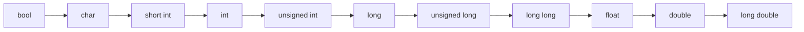
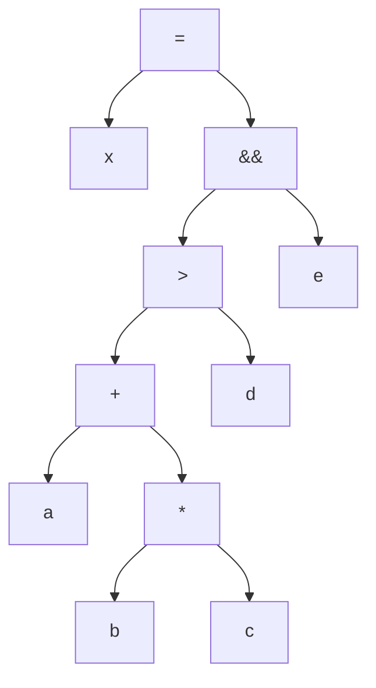
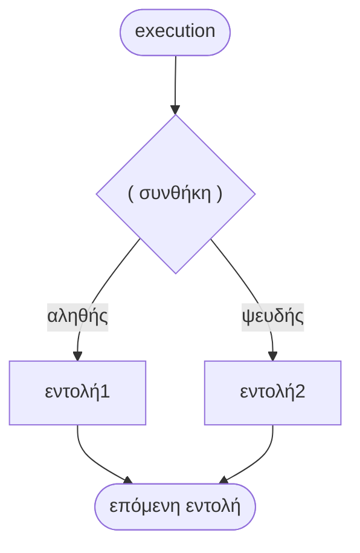

# Κεφάλαιο 5: Τελεστές και Εντολές

<!--  -->

> **Στόχοι:** μετά από αυτό το κεφάλαιο θα μπορείτε να
> - κατατάσσετε κάθε τελεστή της C κατά πλήθος τελεστέων (μοναδιαίος, δυαδικός,
>   τριαδικός) και κατά οικογένεια (αριθμητικός, συγκριτικός, λογικός, bitwise, …)·
> - υπολογίζετε με το χέρι την τιμή εκφράσεων με ακέραια διαίρεση, `%`, συγκρίσεις,
>   λογικούς και bitwise τελεστές·
> - χρησιμοποιείτε τον τελεστή συνθήκης `? :`, το cast και να προβλέπετε τις σιωπηρές
>   μετατροπές τύπων·
> - ξεχωρίζετε το `a++` από το `++a` και να ιχνηλατείτε εντολές που τα περιέχουν·
> - εφαρμόζετε τους κανόνες προτεραιότητας και προσεταιριστικότητας, και να βάζετε
>   παρενθέσεις όταν δεν είστε σίγουροι·
> - διακρίνετε έκφραση από εντολή και να γράφετε απλές εντολές `if` και `if-else`.
>
> **Προαπαιτούμενα:** [Κεφάλαιο 2](../02-memory-variables/), [Κεφάλαιο 3](../03-functions/), [Κεφάλαιο 4](../04-git-operators/)
>
> **Χρόνος μελέτης:** ~2,5 ώρες

## Σύνοψη

Οι τελεστές είναι τα «ρήματα» της C: με αυτούς κάνουμε πράξεις, συγκρίνουμε τιμές,
συνδυάζουμε συνθήκες, πειράζουμε bits και αποθηκεύουμε αποτελέσματα σε μεταβλητές.
Η διάλεξη περνάει όλες τις οικογένειες τελεστών της C (αριθμητικούς, συγκριτικούς,
λογικούς, bitwise, συνθήκης, μετατροπής, ανάθεσης, αύξησης/μείωσης και παράθεσης)
και εξηγεί πώς η C αποφασίζει τη σειρά των πράξεων με την προτεραιότητα και την
προσεταιριστικότητα. Στη συνέχεια βλέπουμε πώς από τελεστές φτιάχνονται εκφράσεις
και από εκφράσεις εντολές, και κάνουμε το πρώτο βήμα στη ροή ελέγχου με την `if`
και την `if-else`. Σχεδόν κάθε γραμμή κώδικα που θα γράψετε στο μάθημα χρησιμοποιεί
κάτι από αυτό το κεφάλαιο, και πολλά «περίεργα» αποτελέσματα (π.χ. ένας βαθμός που
βγαίνει μικρότερος απ' ό,τι περιμένατε) εξηγούνται από αυτό.

## Θεωρία

### Κατηγορίες τελεστών

Ένας **τελεστής (operator)** είναι ένα σύμβολο που εφαρμόζεται σε μία ή περισσότερες
τιμές, τους **τελεστέους (operands)**, και δίνει ένα αποτέλεσμα. Τους τελεστές τους
κατατάσσουμε με δύο τρόπους:

- **Κατά πλήθος τελεστέων:** **μοναδιαίοι (unary)** με έναν τελεστέο (π.χ. `!x`,
  `-x`, `x++`), **δυαδικοί (binary)** με δύο (π.χ. `a + b`, `a < b`) και
  **τριαδικοί (ternary)** με τρεις. Η C έχει έναν μόνο τριαδικό τελεστή, τον τελεστή
  συνθήκης `? :`.
- **Κατά οικογένεια:** αριθμητικοί, συγκριτικοί, λογικοί, συνθήκης, bitwise,
  μετατροπής και ανάθεσης (μαζί με τις παραλλαγές τους).

Ένας χρήσιμος τρόπος σκέψης: ένας τελεστής συμπεριφέρεται σαν μια συνάρτηση με
ειδική σύνταξη. Το `a + b` για δύο `int` μοιάζει με μια συνάρτηση
`int add(int a, int b)`: παίρνει δύο ορίσματα και επιστρέφει μία τιμή.

### Αριθμητικοί τελεστές

Οι **αριθμητικοί τελεστές (arithmetic operators)** είναι δυαδικοί και δουλεύουν σε
ακέραιους και σε αριθμούς κινητής υποδιαστολής:

| Τελεστής | Ερμηνεία | Παραδείγματα |
| --- | --- | --- |
| `+` | πρόσθεση | `40 + 2` δίνει `42`, `40.0 + 2.0` δίνει `42.0` |
| `-` | αφαίρεση | `44 - 2` δίνει `42`, `44.0 - 2.0` δίνει `42.0` |
| `*` | πολλαπλασιασμός | `42 * 2` δίνει `84`, `42.0 * 2.0` δίνει `84.0` |
| `/` | διαίρεση | `85.0 / 2.0` δίνει `42.5`, `85 / 2` δίνει `42` |
| `%` | υπόλοιπο | `7 % 2` δίνει `1` |

Ο τύπος του αποτελέσματος εξαρτάται από τον τύπο των τελεστέων. Το σημαντικότερο
παράδειγμα είναι η **ακέραια διαίρεση (integer division)**: όταν και οι δύο τελεστέοι
του `/` είναι ακέραιοι, το αποτέλεσμα είναι ακέραιο πηλίκο και το δεκαδικό μέρος
**χάνεται**. Γι' αυτό `85 / 2` είναι `42` και όχι `42.5`, και `3 / 4` είναι `0`. Ο
τελεστής `%` (modulo) δίνει το υπόλοιπο της ακέραιας διαίρεσης και εφαρμόζεται μόνο
σε ακέραιους. Με αρνητικούς τελεστέους η C κόβει το πηλίκο προς το μηδέν: `-7 / 2`
είναι `-3` και `-7 % 2` είναι `-1`. Υπάρχουν και μοναδιαίοι `+` και `-` (π.χ. `-x`).

### Συγκριτικοί τελεστές

Οι **συγκριτικοί τελεστές (comparison ή relational operators)** συγκρίνουν δύο
τελεστέους και δίνουν ακέραιο αποτέλεσμα: **`1` (αληθές)** ή **`0` (ψευδές)**. Είναι
όλοι δυαδικοί:

| Τελεστής | Ερμηνεία | Παραδείγματα |
| --- | --- | --- |
| `==` | ίσοι τελεστέοι; | `42 == 0` δίνει `0`, `42 == 42` δίνει `1` |
| `!=` | διαφορετικοί τελεστέοι; | `42 != 0` δίνει `1`, `42 != 42` δίνει `0` |
| `>` | ο αριστερός μεγαλύτερος του δεξιού; | `42 > 0` δίνει `1`, `42 > 42` δίνει `0` |
| `<` | ο αριστερός μικρότερος του δεξιού; | `42 < 0` δίνει `0`, `42 < 44` δίνει `1` |
| `>=` | ο αριστερός μεγαλύτερος ή ίσος; | `42 >= 42` δίνει `1`, `42 >= 43` δίνει `0` |
| `<=` | ο αριστερός μικρότερος ή ίσος; | `42 <= 42` δίνει `1`, `42 <= 41` δίνει `0` |

Προσέξτε ότι η ισότητα γράφεται με **δύο** `=`. Το ένα `=` είναι ανάθεση.

### Λογικοί τελεστές

Οι **λογικοί τελεστές (logical operators)** συνδυάζουν αληθείς και ψευδείς τιμές:

| Τελεστής | Ερμηνεία | Παραδείγματα |
| --- | --- | --- |
| `&&` | λογική σύζευξη (AND, ∧): είναι και οι δύο αληθείς; | `42 > 0 && 2 > 3` δίνει `0`, `42 > 0 && 3 > 2` δίνει `1` |
| `\|\|` | λογική διάζευξη (OR, ∨): είναι ένας από τους δύο αληθής; | `2 > 3 \|\| 42 > 0` δίνει `1`, `2 > 3 \|\| 42 < 0` δίνει `0` |
| `!` | λογική άρνηση (NOT, ¬): είναι ο τελεστέος ψευδής; | `!(42 < 0)` δίνει `1`, `!(42 > 0)` δίνει `0` |

Οι `&&` και `||` είναι δυαδικοί, ο `!` μοναδιαίος. Ο πιο σημαντικός κανόνας του
κεφαλαίου είναι ο εξής: **στην C το μηδέν (`0`) σημαίνει «ψευδές» και οποιαδήποτε
άλλη, μη μηδενική, τιμή σημαίνει «αληθές».** Το `1`, το `42` και το `-5` είναι όλα
εξίσου αληθή. Οι τελεστές *παράγουν* πάντα `0` ή `1`, αλλά *δέχονται* οποιαδήποτε
τιμή· γι' αυτό το `!42` είναι `0` και το `if (n)` σημαίνει «αν το `n` δεν είναι
μηδέν».

Οι `&&` και `||` υπολογίζουν πρώτα τον αριστερό τελεστέο και σταματούν αν το
αποτέλεσμα έχει ήδη κριθεί (short-circuit evaluation): στο `0 && x` το `x` δεν
υπολογίζεται καθόλου.

### Bitwise τελεστές

Οι **bitwise τελεστές (bitwise operators)** δουλεύουν πάνω στα μεμονωμένα bit
**ακέραιων** αριθμών: εφαρμόζουν την πράξη σε κάθε θέση bit ξεχωριστά. Είναι όλοι
δυαδικοί εκτός από τον `~`, που είναι μοναδιαίος.

| Τελεστής | Ερμηνεία | Παραδείγματα |
| --- | --- | --- |
| `&` | σύζευξη bit (bitwise AND) | `0xFF & 0xF0` δίνει `0xF0`, `0xFF & 0x00` δίνει `0x00` |
| `\|` | διάζευξη bit (bitwise OR) | `0xFF \| 0xF0` δίνει `0xFF`, `0xF0 \| 0x0F` δίνει `0xFF` |
| `^` | αποκλειστική διάζευξη bit (bitwise XOR) | `0xFF ^ 0xFF` δίνει `0x00`, `0x00 ^ 0xFF` δίνει `0xFF` |
| `~` | άρνηση bit (bitwise NOT) | `~0xF0` δίνει `0x0F`, `~0x05` δίνει `0xFA` (σε ένα byte) |
| `<<` | ολίσθηση αριστερά (shift left) κατά N bit, ισοδύναμο με πολλαπλασιασμό επί $2^N$ | `2 << 4` δίνει `32`, `4 << 1` δίνει `8` |
| `>>` | ολίσθηση δεξιά (shift right) κατά N bit, ισοδύναμο με διαίρεση διά $2^N$ | `8 >> 1` δίνει `4`, `32 >> 4` δίνει `2` |

Η δεκαεξαδική γραφή (`0x…`) βολεύει εδώ, γιατί κάθε δεκαεξαδικό ψηφίο αντιστοιχεί σε
ακριβώς 4 bit: `0xF0` είναι `1111 0000`. Τρεις χρήσεις που θα συναντάτε συχνά:

- **Απομόνωση bit με `&` και μάσκα (mask):** το `x & m` κρατάει μόνο τα bit του `x`
  που είναι `1` και στη μάσκα `m`, και μηδενίζει τα υπόλοιπα.
- **Ενεργοποίηση bit με `|`:** το `x | m` κάνει `1` τα bit της μάσκας και αφήνει τα
  άλλα όπως ήταν.
- **Αντιστροφή bit με `^`:** το `x ^ m` αντιστρέφει τα bit της μάσκας.

Προσοχή: τα παραδείγματα του `~` στον πίνακα υποθέτουν τιμή ενός byte (8 bit). Σε
ένα `int` 32 bit το `~0x05` είναι `0xFFFFFFFA`. Μην μπερδεύετε επίσης τα `&`/`|` (bit
προς bit) με τα `&&`/`||` (λογικά, με αποτέλεσμα `0` ή `1`).

### Ο τελεστής συνθήκης

Ο **τελεστής συνθήκης (conditional operator)** ελέγχει μια συνθήκη και, αν είναι
αληθής, δίνει την πρώτη τιμή, αλλιώς τη δεύτερη:

```text
συνθήκη ? τιμή1 : τιμή2
```

Για παράδειγμα, `(42 > 0) ? 8 : 16` δίνει `8`, ενώ `(42 == 0) ? 8 : 16` δίνει `16`.
Είναι ο μοναδικός **τριαδικός** τελεστής της C (τρεις τελεστέοι: η συνθήκη και οι δύο
τιμές). Επειδή είναι *έκφραση*, μπορεί να μπει οπουδήποτε χρειάζεται μια τιμή, π.χ.
στο δεξί μέλος μιας ανάθεσης ή σε ένα `return`. Υπολογίζεται μόνο η τιμή που
επιλέγεται.

### Ο τελεστής μετατροπής (cast)

Ο **τελεστής μετατροπής (cast operator)** αλλάζει τον τύπο ενός τελεστέου:

```text
(τύπος)τελεστέος
```

| Έκφραση | Αποτέλεσμα |
| --- | --- |
| `(int)42.67` | `42`: τα ψηφία μετά την υποδιαστολή **αποκόπτονται**, δεν στρογγυλοποιούνται |
| `(char)67.8` | `'C'`: γίνεται `67`, ο κωδικός ASCII του `C` |
| `(double)3` | `3.0` |
| `(double)3/4` | ; (δείτε τα «Παραδείγματα») |

Η μετατροπή που γράφουμε ρητά με cast λέγεται **ρητή μετατροπή τύπου (explicit type
conversion)**. Το cast είναι μοναδιαίος τελεστής με υψηλή προτεραιότητα: εφαρμόζεται
μόνο στον τελεστέο που ακολουθεί αμέσως, όχι σε όλη την έκφραση.

### Σιωπηρή μετατροπή τύπων

Όταν οι τελεστέοι ενός τελεστή έχουν διαφορετικούς τύπους, ο μεταγλωττιστής προσθέτει
αυτόματα μια μετατροπή προς τον «μεγαλύτερο» από τους δύο τύπους. Αυτό λέγεται
**σιωπηρή μετατροπή τύπων (implicit type conversion)**. Για παράδειγμα, το

```c
40 + 2.0
```

είναι ισοδύναμο με `(double)40 + 2.0`, δηλαδή με `40.0 + 2.0`, και δίνει `double`.
Η σειρά των τύπων, από τον «μικρότερο» στον «μεγαλύτερο», όπως τη δείχνουν οι
διαφάνειες:



*Σχήμα: η ιεραρχία της σιωπηρής μετατροπής· σε μικτή πράξη ο «μικρότερος» τύπος
μετατρέπεται στον «μεγαλύτερο».*

Η μετατροπή γίνεται **ανά τελεστή**, όχι για όλη την έκφραση μαζί. Στο `1 / 2 * 2.0`
υπολογίζεται πρώτα το `1 / 2` ως ακέραια διαίρεση (`0`) και μόνο μετά μετατρέπεται σε
`double`, οπότε το αποτέλεσμα είναι `0.0`.

### Ο τελεστής ανάθεσης

Ο **τελεστής ανάθεσης (assignment operator)** `=` παίρνει την τιμή του δεξιού
τελεστέου (**rvalue**), την αναθέτει στη μεταβλητή του αριστερού τελεστέου
(**lvalue**) και **επιστρέφει** αυτή την τιμή. Αριστερά πρέπει να υπάρχει κάτι που
έχει θέση στη μνήμη (μια μεταβλητή)· το `42 = x` δεν έχει νόημα.

```c
x = 42          // αναθέτει 42 στην x και επιστρέφει 42
x = y = 42      // ισοδύναμο με x = (y = 42)
```

Επειδή η ανάθεση είναι έκφραση με τιμή, μπορούμε να αναθέσουμε σε πολλές μεταβλητές
ταυτόχρονα. Αυτό λειτουργεί επειδή ο `=` έχει προσεταιριστικότητα από δεξιά προς τα
αριστερά: πρώτα γίνεται το `y = 42`, που επιστρέφει `42`, και αυτό ανατίθεται στο `x`.

### Συνδυαστικοί τελεστές ανάθεσης

Οι **συνδυαστικοί τελεστές ανάθεσης (compound assignment operators)** κάνουν μια
πράξη και αποθηκεύουν το αποτέλεσμα με συντομογραφία:

```text
τελεστέος1 op= τελεστέος2
```

όπου `op` είναι οποιοσδήποτε από τους `+`, `-`, `*`, `%`, `/`, `&`, `^`, `|`, `<<`,
`>>`. Το `a += b` είναι ισοδύναμο με `a = a + b`, το `a *= b` με `a = a * b`, και
ομοίως για τους υπόλοιπους. Προσοχή: το δεξί μέλος υπολογίζεται ολόκληρο πρώτα, άρα
`a *= b + 1` σημαίνει `a = a * (b + 1)`.

### Τελεστές αύξησης και μείωσης

Ο **τελεστής αύξησης (increment operator)** `++` μπαίνει πριν ή μετά από το όνομα μιας
μεταβλητής και την αυξάνει κατά 1· ο **τελεστής μείωσης (decrement operator)** `--`
τη μειώνει κατά 1. Η θέση του έχει σημασία για την **τιμή που επιστρέφει**:

| Μορφή | Όνομα | Τι επιστρέφει |
| --- | --- | --- |
| `a++` | επιθεματική (postfix) αύξηση | την τιμή του `a` **πριν** την αύξηση |
| `a--` | επιθεματική (postfix) μείωση | την τιμή του `a` **πριν** τη μείωση |
| `++a` | προθεματική (prefix) αύξηση | την τιμή του `a` **μετά** την αύξηση |
| `--a` | προθεματική (prefix) μείωση | την τιμή του `a` **μετά** τη μείωση |

Σε κάθε περίπτωση η μεταβλητή αλλάζει. Αν η έκφραση στέκεται μόνη της (`i++;`), οι δύο
μορφές κάνουν το ίδιο. Η διαφορά φαίνεται όταν η τιμή χρησιμοποιείται:

```c
a = 5;
b = a++;   // b = 5, a = 6
c = ++a;   // a = 7, c = 7
```

Μην αλλάζετε την ίδια μεταβλητή δύο φορές στην ίδια έκφραση (π.χ. `i = i++ + ++i;`):
το αποτέλεσμα δεν ορίζεται από τη γλώσσα.

### Ο τελεστής παράθεσης (κόμμα)

Ο **τελεστής παράθεσης (comma operator)** `,` υπολογίζει τον πρώτο τελεστέο, αγνοεί
το αποτέλεσμά του και επιστρέφει τον δεύτερο. Για παράδειγμα, `12, 42` δίνει `42`.
Έχει σχετικά περιορισμένες χρήσεις και συνήθως χρησιμοποιείται μαζί με τελεστές
ανάθεσης, για να γίνουν δύο αναθέσεις σε ένα σημείο όπου η γραμματική επιτρέπει μία
έκφραση: `i = 0, j = 10`. Επειδή έχει τη χαμηλότερη προτεραιότητα από όλους τους
τελεστές, το `x = 12, 42;` αναθέτει `12` στο `x`· για να πάρει το `x` την τιμή `42`
χρειάζονται παρενθέσεις: `x = (12, 42);`.

Μην τον συγχέετε με τα κόμματα που χωρίζουν ορίσματα συνάρτησης (`f(a, b)`) ή
μεταβλητές σε μια δήλωση (`int a, b;`): εκεί το κόμμα είναι απλώς διαχωριστικό.

### Προτεραιότητα και προσεταιριστικότητα

Η **προτεραιότητα (precedence)** ενός τελεστή καθορίζει τη σειρά με την οποία θα
γίνουν οι υπολογισμοί. Ο πολλαπλασιασμός, για παράδειγμα, έχει υψηλότερη
προτεραιότητα από την πρόσθεση, άρα το `5 * 6 + 3 * 4` σημαίνει `(5 * 6) + (3 * 4)`.

Αν δύο τελεστές έχουν την ίδια προτεραιότητα, η **προσεταιριστικότητα
(associativity)** τους καθορίζει τη σειρά: από αριστερά προς τα δεξιά ή το
αντίστροφο. Ο πολλαπλασιασμός και η διαίρεση έχουν την ίδια προτεραιότητα και
προσεταιριστικότητα από αριστερά προς τα δεξιά, άρα το `90 * 50 / 100` σημαίνει
`(90 * 50) / 100`. Με ακέραιους αυτό **δεν** είναι το ίδιο με `90 * (50 / 100)`.

Ο πλήρης πίνακας, από την υψηλότερη προτεραιότητα (1) στη χαμηλότερη (15):

| Θέση | Τελεστές | Προσεταιριστικότητα |
| --- | --- | --- |
| 1 | `()` (παρενθέσεις, κλήση συνάρτησης), `[]`, `->`, `.`, `++` `--` (επιθεματικά) | αριστερά προς δεξιά |
| 2 | `++` `--` (προθεματικά), `!`, `~`, `*` (έμμεση αναφορά), `&` (διεύθυνση), `+` `-` (μοναδιαία), `(τύπος)` (cast), `sizeof` | δεξιά προς αριστερά |
| 3 | `*`, `/`, `%` | αριστερά προς δεξιά |
| 4 | `+`, `-` (δυαδικά) | αριστερά προς δεξιά |
| 5 | `<<`, `>>` | αριστερά προς δεξιά |
| 6 | `<`, `<=`, `>`, `>=` | αριστερά προς δεξιά |
| 7 | `==`, `!=` | αριστερά προς δεξιά |
| 8 | `&` | αριστερά προς δεξιά |
| 9 | `^` | αριστερά προς δεξιά |
| 10 | `\|` | αριστερά προς δεξιά |
| 11 | `&&` | αριστερά προς δεξιά |
| 12 | `\|\|` | αριστερά προς δεξιά |
| 13 | `?:` | δεξιά προς αριστερά |
| 14 | `=`, `+=`, `-=`, `*=`, `/=`, `%=`, `&=`, `^=`, `\|=`, `<<=`, `>>=` | δεξιά προς αριστερά |
| 15 | `,` | αριστερά προς δεξιά |

Δεν χρειάζεται να αποστηθίσετε όλον τον πίνακα. Κρατήστε τη γενική εικόνα:
μοναδιαίοι, μετά αριθμητικοί, μετά ολισθήσεις, συγκρίσεις, bitwise, λογικοί, συνθήκη,
ανάθεση και τέλος κόμμα. Δύο σημεία θέλουν προσοχή: οι bitwise `&`, `^`, `|` έχουν
**χαμηλότερη** προτεραιότητα από τα `==` και `!=`, και η ανάθεση έχει χαμηλότερη
προτεραιότητα από σχεδόν όλα. Ο κανόνας των διαφανειών: **δεν είμαστε σίγουροι για
την ακριβή σειρά; Χρησιμοποιούμε παρενθέσεις `()`!**

Το παρακάτω δέντρο δείχνει πώς ομαδοποιεί ο μεταγλωττιστής την έκφραση
`x = a + b * c > d && e`:



*Σχήμα: οι τελεστές με υψηλότερη προτεραιότητα βρίσκονται πιο βαθιά στο δέντρο και
υπολογίζονται πρώτοι.*

### Εκφράσεις και εντολές

Κάθε έγκυρος συνδυασμός τελεστών και τελεστέων (μεταβλητών, σταθερών, κλήσεων
συναρτήσεων) λέγεται **έκφραση (expression)**, και κάθε έκφραση έχει μια τιμή. Για
παράδειγμα:

```c
final_exam * 50 / 100 + homework * 30 / 100 + lab * 20 / 100
```

Μια συνάρτηση αποτελείται από εκφράσεις που συνδυάζονται και εκτελούνται με τον
τρόπο που καθορίζουν κάποιες συντακτικές δομές, οι **εντολές (statements)**. Οι
εντολές εκτελούνται **διαδοχικά**, **υπό συνθήκη** ή **επανειλημμένα**. Η εντολή

```c
if (argc != 4) {
    ....
}
```

για παράδειγμα, εκτελεί το σώμα της μόνο υπό συνθήκη. Η διαφορά είναι ουσιαστική: μια
έκφραση *υπολογίζει μια τιμή*, ενώ μια εντολή *κάνει κάτι* (και δεν έχει τιμή).

### Κατηγορίες εντολών

Οι εντολές της C χωρίζονται σε πέντε κατηγορίες:

1. **Κενές εντολές (empty / null statements):** το σκέτο `;`, που δεν εκτελεί τίποτα
   (no-operation ή no-op). Το `;;;;;` είναι πέντε κενές εντολές. Η χρησιμότητά τους
   φαίνεται σε συνδυασμό με άλλες εντολές.
2. **Εντολές έκφρασης (expression statements):** μια έκφραση που τελειώνει με
   semicolon, π.χ. `x = 4;` ή `z = ++y;`. Το semicolon (`;`) είναι διαχωριστικό
   εντολών: δείχνει πού τελειώνει η εντολή.
3. **Σύνθετες εντολές (compound statements) ή blocks:** μια σειρά από εντολές
   μέσα σε αγκύλες `{ }`, που μετράει συντακτικά ως μία εντολή.
4. **Εντολές συνθήκης (conditional statements):** `if`, `if-else`.
5. **Εντολές επανάληψης (iteration statements):** οι βρόχοι.

Όλες αναλύονται διεξοδικά στο [Κεφάλαιο 6](../06-control-flow/).

### Ροή ελέγχου: οι εντολές if και if-else

**Ροή ελέγχου (control flow)** είναι η σειρά με την οποία εκτελούνται οι εντολές ενός
προγράμματος. Την καθορίζουν οι **εντολές ροής ελέγχου (control flow statements)** και
συνήθως την οπτικοποιούμε με ένα **διάγραμμα ροής (flowchart)**.

Η **εντολή `if`** εκτελεί μια εντολή μόνο αν μια λογική συνθήκη είναι αληθής, δηλαδή
μη μηδενική. Οι παρενθέσεις γύρω από τη συνθήκη είναι **υποχρεωτικές**:

```text
if ( συνθήκη )
    εντολή
```

Η «εντολή» μπορεί να είναι οποιασδήποτε κατηγορίας: κενή (`if (year > 1) ;`),
έκφρασης (`if (year > 1) year++;`) ή block (`if (year > 1) { year++; }`).

Η **εντολή `if-else`** επεκτείνει την `if` ώστε να εκτελεί μια άλλη εντολή όταν η
συνθήκη είναι ψευδής· εκτελείται ακριβώς μία από τις δύο:

```text
if ( συνθήκη )
    εντολή1
else
    εντολή2
```



*Σχήμα: διάγραμμα ροής της `if-else`· χωρίς `else`, ο κλάδος «ψευδής» πηγαίνει κατευθείαν
στην επόμενη εντολή.*

Για πολλές συνθήκες, εμφωλευμένες `if` και το πρόβλημα του dangling `else`, δείτε το
[Κεφάλαιο 6](../06-control-flow/).

## Παραδείγματα

### Απομόνωση του πιο σημαντικού bit

*Εφαρμόζει: bitwise τελεστές.* Πώς απομονώνουμε το πιο σημαντικό bit ενός byte; Οι
επιλογές είναι `byte & 0xFF`, `byte & 0x80`, `byte | 0xFF` και `byte | 0x80`. Το πιο
σημαντικό bit είναι το αριστερότερο, και η μάσκα με `1` μόνο εκεί είναι `1000 0000` =
`0x80`. Το `&` μηδενίζει όλα τα bit εκτός από εκείνα της μάσκας, π.χ.
`1011 0110 & 1000 0000` = `1000 0000`. Το `byte & 0xFF` επιστρέφει όλο το byte, ενώ οι
επιλογές με `|` *ενεργοποιούν* bit αντί να τα απομονώνουν. Σωστή απάντηση:
`byte & 0x80`, που είναι μη μηδενικό (αληθές) αν και μόνο αν το πιο σημαντικό bit είναι
`1`.

### Συνδυασμός τιμών με bitwise OR

*Εφαρμόζει: bitwise OR, δεκαεξαδική γραφή.* Ποια η τιμή της `0xbeef | 0xcafe0000`;
Γράψτε τους δύο αριθμούς με 8 δεκαεξαδικά ψηφία ο καθένας:

```text
  0x0000beef
| 0xcafe0000
  ----------
  0xcafebeef
```

Σε κάθε θέση ο ένας από τους δύο έχει `0`, και `x | 0 = x`, οπότε τα δύο κομμάτια
απλώς «κολλάνε». Από τις επιλογές `0xffffffff`, `0xcafebeef`, `0xbeefcafe`,
`0xfaceb00c` σωστή είναι η `0xcafebeef`. Με αυτόν τον τρόπο (συχνά μαζί με `<<`)
συνθέτουμε μια μεγάλη τιμή από μικρότερα κομμάτια.

### Μια συνάρτηση max με τον τελεστή συνθήκης

*Εφαρμόζει: τελεστής συνθήκης, συναρτήσεις.* Οι διαφάνειες ρωτούν πώς θα φτιάχναμε
μια συνάρτηση `max`. Ο τελεστής συνθήκης την κάνει μία γραμμή:

```c
#include <stdio.h>

int max(int a, int b) {
    return (a > b) ? a : b;
}

int main(void) {
    printf("%d\n", max(42, 8));
    printf("%d\n", max(-5, 16));
    return 0;
}
```

```text
$ ./max
42
16
```

### Cast και διαίρεση: (double)3/4

*Εφαρμόζει: cast, σιωπηρή μετατροπή, προτεραιότητα.* Πόσο κάνει `(double)3/4`; Το
cast έχει μεγαλύτερη προτεραιότητα από τη διαίρεση, άρα η έκφραση σημαίνει
`((double)3) / 4`. Το `3` γίνεται `3.0`, και στη μικτή πράξη `3.0 / 4` το `4`
μετατρέπεται σιωπηρά σε `4.0`. Αποτέλεσμα: `0.75`. Συγκρίνετε:

| Έκφραση | Τιμή | Γιατί |
| --- | --- | --- |
| `3 / 4` | `0` | ακέραια διαίρεση |
| `(double)3 / 4` | `0.75` | ο αριθμητής είναι `double` |
| `3 / (double)4` | `0.75` | ο παρονομαστής είναι `double` |
| `(double)(3 / 4)` | `0.0` | η ακέραια διαίρεση έγινε πρώτα |

### Πρόγραμμα υπολογισμού βαθμολογίας

*Εφαρμόζει: αριθμητικοί τελεστές, ακέραια διαίρεση, προτεραιότητα, `if`.* Το
πρόγραμμα των διαφανειών διαβάζει τρεις βαθμούς από τη γραμμή εντολών (με `atoi`, που
μετατρέπει ένα string σε `int`) και υπολογίζει τον τελικό βαθμό με βάρη 50%, 30% και
20%. Οι διαφάνειες δείχνουν μόνο τον κώδικα των συναρτήσεων· εδώ έχουν προστεθεί τα
`#include`.

```c
#include <stdio.h>
#include <stdlib.h>

int grade(int final_exam, int homework, int lab) {
    return final_exam * 50 / 100 + homework * 30 / 100 + lab * 20 / 100;
}

int main(int argc, char **argv) {
    if (argc != 4) {
        printf("Run as: grade final_exam homework lab\n");
        return 1;
    }
    int final_exam = atoi(argv[1]);
    int homework = atoi(argv[2]);
    int lab = atoi(argv[3]);
    int final_grade = grade(final_exam, homework, lab);
    printf("My grade is: %d\n", final_grade);
    return 0;
}
```

Η `if (argc != 4)` είναι μια εντολή συνθήκης: αν δεν δόθηκαν ακριβώς τρία ορίσματα
(συν το όνομα του προγράμματος), τυπώνει οδηγίες και τερματίζει με κωδικό `1`.

Η έκφραση στη `grade` ομαδοποιείται ως
`((final_exam * 50) / 100) + ((homework * 30) / 100) + ((lab * 20) / 100)`: `*` και `/`
πριν από το `+`, και από αριστερά προς τα δεξιά μεταξύ τους. Επειδή όλα είναι `int`,
**κάθε** διαίρεση κόβει το δεκαδικό μέρος της. Μερικές εκτελέσεις:

```text
$ ./grade
Run as: grade final_exam homework lab
$ ./grade 100 100 100
My grade is: 100
$ ./grade 85 75 95
My grade is: 83
$ ./grade 9 9 9
My grade is: 7
```

Με 85, 75 και 95 ο σωστός βαθμός είναι $42.5 + 22.5 + 19 = 84$, αλλά το πρόγραμμα
βγάζει `83`, γιατί το `42.5` και το `22.5` έγιναν `42` και `22`. Με τρία 9 ο βαθμός
θα έπρεπε να είναι 9, αλλά βγαίνει `4 + 2 + 1 = 7`. Αν αντίθετα γράφαμε
`final_exam * (50 / 100)`, το `50 / 100` θα ήταν `0` και ο βαθμός θα μηδενιζόταν. Για
ακριβές αποτέλεσμα θα κάναμε τους υπολογισμούς σε `double` (π.χ. `final_exam * 0.5`)
και θα στρογγυλοποιούσαμε μόνο στο τέλος.

### Προτεραιότητα στην πράξη

*Εφαρμόζει: προτεραιότητα, προσεταιριστικότητα.* Οι δύο εκφράσεις των διαφανειών:

- `5 * 6 + 3 * 4`: οι πολλαπλασιασμοί πρώτα, `30 + 12`, άρα **`42`**.
- `90 * 50 / 100`: ίδια προτεραιότητα, από αριστερά προς τα δεξιά, `4500 / 100`, άρα
  **`45`**. Με την αντίθετη σειρά, `90 * (50 / 100)` = `90 * 0` = `0`.

Αυτή ακριβώς η σειρά κάνει τη συνάρτηση `grade` να δίνει λογικά αποτελέσματα.

### Ιχνηλάτηση εντολών έκφρασης

*Εφαρμόζει: αύξηση και μείωση, εντολές έκφρασης.* Οι διαφάνειες ρωτούν ποιες είναι οι
τιμές των `x`, `y`, `z` μετά τις εντολές `x = 4; y = 7; z = ++y; y = z - (x++);
z = x - (--y);` (που δείχνουν και κλεισμένες σε `{ }`, ως σύνθετη εντολή). Φτιάξτε
πίνακα με τις τρεις τιμές μετά από κάθε εντολή, θυμούμενοι ότι το `++y` δίνει τη *νέα*
τιμή και το `x++` την *παλιά*· η απάντηση είναι στην ερώτηση αυτοαξιολόγησης 6.

### Μέγιστο με if-else

*Εφαρμόζει: `if-else`, τελεστής συνθήκης.* Το κλασικό παράδειγμα:

```c
if (x > y)
    max = x;
else
    max = y;
```

Οι διαφάνειες ρωτούν: θα μπορούσαμε να «ζήσουμε» χωρίς `else`; Υπάρχει εναλλακτικός
τρόπος να γράψουμε το παραπάνω; Τι κάνουμε όταν έχουμε πάνω από δύο συνθήκες; Χωρίς
`else`, δίνουμε πρώτα στο `max` μια αρχική τιμή (`max = y;`) και τη διορθώνουμε με
απλή `if`. Εναλλακτικά, ο τελεστής συνθήκης το κάνει σε μία έκφραση:
`max = (x > y) ? x : y;`. Για περισσότερες συνθήκες χρειαζόμαστε εμφωλευμένες `if`,
το θέμα του [Κεφαλαίου 6](../06-control-flow/).

## Κύρια σημεία

1. Οι τελεστές κατατάσσονται σε μοναδιαίους, δυαδικούς και τριαδικούς, και σε
   οικογένειες: αριθμητικούς, συγκριτικούς, λογικούς, συνθήκης, bitwise, μετατροπής
   και ανάθεσης.
2. Η διαίρεση μεταξύ ακεραίων δίνει ακέραιο πηλίκο: `85 / 2` είναι `42` και `3 / 4`
   είναι `0`· ο `%` δίνει το υπόλοιπο.
3. Οι συγκριτικοί και οι λογικοί τελεστές δίνουν `0` (ψευδές) ή `1` (αληθές).
4. Στην C το μηδέν σημαίνει «ψευδές» και κάθε μη μηδενική τιμή «αληθές»· το `1`, το
   `42` και το `-5` είναι εξίσου αληθή.
5. Οι bitwise τελεστές δουλεύουν σε κάθε bit ακεραίων: `&` για απομόνωση με μάσκα,
   `|` για ενεργοποίηση, `^` για αντιστροφή, `~` για άρνηση· ολίσθηση κατά N
   αριστερά/δεξιά ισοδυναμεί με πολλαπλασιασμό/διαίρεση με $2^N$.
6. Ο τελεστής συνθήκης `συνθήκη ? τιμή1 : τιμή2` είναι ο μόνος τριαδικός τελεστής και,
   ως έκφραση, μπορεί να μπει όπου χρειάζεται μια τιμή.
7. Το cast `(τύπος)τελεστέος` κάνει ρητή μετατροπή τύπου· από πραγματικό σε ακέραιο
   τα δεκαδικά αποκόπτονται, δεν στρογγυλοποιούνται.
8. Σε μικτές πράξεις ο μεταγλωττιστής μετατρέπει σιωπηρά τον «μικρότερο» τύπο στον
   «μεγαλύτερο», ξεχωριστά για κάθε τελεστή.
9. Η ανάθεση αποθηκεύει την τιμή του δεξιού μέλους (rvalue) στη μεταβλητή του
   αριστερού (lvalue) και επιστρέφει την τιμή, γι' αυτό γράφεται `x = y = 42`.
10. Το `a op= b` είναι συντομογραφία του `a = a op b`.
11. Το `a++` επιστρέφει την τιμή πριν την αύξηση, το `++a` την τιμή μετά την αύξηση·
    και τα δύο αυξάνουν το `a`.
12. Ο τελεστής παράθεσης υπολογίζει τον πρώτο τελεστέο, τον αγνοεί και επιστρέφει τον
    δεύτερο.
13. Η προτεραιότητα καθορίζει ποιος τελεστής εφαρμόζεται πρώτος· όταν είναι ίδια, την
    σειρά την ορίζει η προσεταιριστικότητα.
14. Δεν είμαστε σίγουροι για την ακριβή σειρά; Χρησιμοποιούμε παρενθέσεις `()`.
15. Έκφραση είναι κάθε έγκυρος συνδυασμός τελεστών και τελεστέων· οι εντολές
    συνδυάζουν εκφράσεις και εκτελούνται διαδοχικά, υπό συνθήκη ή επανειλημμένα.
16. Οι εντολές είναι κενές, έκφρασης, σύνθετες, συνθήκης ή επανάληψης· το `;`
    δείχνει πού τελειώνει μια εντολή.
17. Η `if` εκτελεί μια εντολή αν η συνθήκη είναι αληθής, η `if-else` επιλέγει μία από
    δύο· οι παρενθέσεις γύρω από τη συνθήκη είναι υποχρεωτικές.

## Ορολογία

| Ελληνικά | English | Σύντομος ορισμός |
| --- | --- | --- |
| τελεστής | operator | Σύμβολο που εφαρμόζεται σε τιμές και δίνει αποτέλεσμα |
| τελεστέος | operand | Τιμή στην οποία εφαρμόζεται ένας τελεστής |
| μοναδιαίος / δυαδικός / τριαδικός | unary / binary / ternary | Τελεστής με έναν / δύο / τρεις τελεστέους |
| ακέραια διαίρεση | integer division | `/` μεταξύ ακεραίων, που κρατάει μόνο το πηλίκο |
| συγκριτικός τελεστής | comparison / relational operator | `==`, `!=`, `<`, `>`, `<=`, `>=` |
| λογικός τελεστής | logical operator | `&&`, `\|\|`, `!` |
| bitwise τελεστής | bitwise operator | `&`, `\|`, `^`, `~`, `<<`, `>>`, bit προς bit |
| τελεστής συνθήκης | conditional operator | `σ ? α : β`, ο μόνος τριαδικός τελεστής |
| τελεστής μετατροπής | cast operator | `(τύπος)x`, ρητή μετατροπή τύπου |
| σιωπηρή μετατροπή τύπων | implicit type conversion | Αυτόματη μετατροπή σε μικτές πράξεις |
| τελεστής ανάθεσης | assignment operator | `=`: αποθηκεύει και επιστρέφει μια τιμή |
| συνδυαστικός τελεστής ανάθεσης | compound assignment | `+=`, `-=`, … |
| τελεστής αύξησης / μείωσης | increment / decrement operator | `++` / `--` |
| προθεματικός / επιθεματικός | prefix / postfix | Πριν / μετά τη μεταβλητή (`++a` / `a++`) |
| τελεστής παράθεσης | comma operator | `a, b`: υπολογίζει το `a`, επιστρέφει το `b` |
| προτεραιότητα | precedence | Ποιος τελεστής εφαρμόζεται πρώτος |
| προσεταιριστικότητα | associativity | Σειρά για τελεστές ίδιας προτεραιότητας |
| έκφραση | expression | Συνδυασμός τελεστών και τελεστέων με τιμή |
| εντολή | statement | Συντακτική δομή που εκτελείται |
| ροή ελέγχου | control flow | Η σειρά εκτέλεσης των εντολών |

## Συχνά λάθη

- **Ακέραια διαίρεση εκεί που θέλατε δεκαδικά.** `double avg = sum / n;` με `int sum,
  n` δίνει στρογγυλεμένο προς τα κάτω αποτέλεσμα (π.χ. `2.000000` αντί `2.500000`).
  Διόρθωση: `(double)sum / n`.
- **Cast στη λάθος θέση.** `(double)(3 / 4)` είναι `0.0`, γιατί η διαίρεση έγινε πριν
  από το cast. Διόρθωση: κάντε cast σε έναν τελεστέο, `(double)3 / 4`.
- **Περιμένετε στρογγυλοποίηση από το cast.** `(int)2.99` είναι `2`, όχι `3`.
- **`=` αντί για `==`.** `if (x = 0)` αναθέτει `0` και η συνθήκη είναι πάντα ψευδής·
  ο gcc με `-Wall` προειδοποιεί `suggest parentheses around assignment used as truth
  value`. Διόρθωση: `if (x == 0)`.
- **`&` αντί για `&&` (ή `|` αντί για `||`).** `if (a & b)` με `a = 1`, `b = 2` είναι
  ψευδές (`01 & 10` = `0`), ενώ `a && b` είναι αληθές. Χρησιμοποιήστε τα λογικά για
  συνθήκες.
- **Bitwise με σύγκριση χωρίς παρενθέσεις.** `if (x & 1 == 0)` σημαίνει
  `x & (1 == 0)`, δηλαδή πάντα `0`, γιατί το `==` έχει υψηλότερη προτεραιότητα από το
  `&`. Διόρθωση: `if ((x & 1) == 0)`.
- **Σύγχυση `a++` και `++a`.** `b = a++;` δίνει στο `b` την *παλιά* τιμή. Αν σας
  ενδιαφέρει η τιμή, ιχνηλατήστε με πίνακα.
- **Διπλή αλλαγή της ίδιας μεταβλητής σε μία έκφραση.** `i = i++ + 1;` ή
  `printf("%d %d", i++, i++);` έχουν απροσδιόριστη συμπεριφορά· ο gcc με `-Wall`
  λέει `operation on 'i' may be undefined`. Διόρθωση: σπάστε το σε δύο εντολές.
- **Κόμμα αντί για παρενθέσεις.** `x = 12, 42;` αφήνει `x = 12`. Αν θέλετε `42`, γράψτε
  `x = (12, 42);`, ή καλύτερα απλώς `x = 42;`.
- **Ξεχασμένες παρενθέσεις στην `if`.** `if x > 1` δεν μεταγλωττίζεται.

## Διάβασμα

- **Διαφάνειες:** [Διάλεξη 5](https://github.com/progintro/progintro.github.io/releases/download/2025/lec05.pdf), σελ. 1–35. Κατηγορίες τελεστών: σελ. 5· αριθμητικοί, συγκριτικοί, λογικοί: σελ. 7–9· bitwise: σελ. 10–12· συνθήκης και cast: σελ. 13–15· ανάθεση, αύξηση/μείωση, κόμμα: σελ. 16–19· πρόγραμμα βαθμολογίας: σελ. 20· προτεραιότητα: σελ. 21–24· εκφράσεις και εντολές: σελ. 25–28· `if` και `if-else`: σελ. 29–33.
- **Σημειώσεις:** [Κεφάλαιο 2: Μεταβλητές, τύποι, τελεστές και παραστάσεις](https://progintro.github.io/notes/chapters/02-types-operators/), ενότητα «Εντολές αντικατάστασης, τελεστές και παραστάσεις» (K04, σελ. 35–44)· [Κεφάλαιο 3: Η ροή του ελέγχου](https://progintro.github.io/notes/chapters/03-control-flow/), ενότητες «Η ροή του ελέγχου στην C», «Εντολή `if`» (K04, σελ. 47–50). Οι διαφάνειες συνιστούν να έχετε καλύψει τις σημειώσεις του κ. Σταματόπουλου μέχρι και τη σελίδα 62.
- **Εργαστήριο:** [Εργαστήριο 3](https://progintro.github.io/lab-material/labs/lab03/): ασκήσεις `root.c` (`if...else`), `birthdate.c` (ακέραια διαίρεση και `%`), `limit.c` (αποσφαλμάτωση εκφράσεων)
- **Βιβλίο:** K&R, §2.5–2.12 (τελεστές και παραστάσεις), όπως προτείνουν οι σημειώσεις.
- **Άλλα:** Wikipedia: [Comma operator](https://en.wikipedia.org/wiki/Comma_operator), [Control flow](https://en.wikipedia.org/wiki/Control_flow), [Conditional (computer programming)](https://en.wikipedia.org/wiki/Conditional_(computer_programming))

## Ασκήσεις

<!-- exercises -->

### Από τα εργαστήρια

- [Υπολογισμός ημέρας μίας δεδομένης ημερομηνίας](../../questions/labs/lab-lab03-birthdate.md): Εργαστήριο 3, Άσκηση 3 · ★☆☆ · programming

### Σχετικές ασκήσεις από άλλα κεφάλαια

- [Rickroll Τριπλέτες](../../questions/exams/exam-2023-fall-ex4-q3.md): Online τελική εξέταση Δεκεμβρίου 2023, Εξέταση #4 (Rick Astley Themed), Θέμα 3 · ★★★ · programming (κεφ. 2)
- [Πυθαγόρειο θεώρημα](../../questions/labs/lab-lab02-pyth.md): Εργαστήριο 2, Άσκηση 2 · ★☆☆ · programming (κεφ. 2)
- [Υπολογισμός ριζών τριωνύμου](../../questions/labs/lab-lab03-root.md): Εργαστήριο 3, Άσκηση 2 · ★★☆ · programming (κεφ. 6)
- [Μήνυμα από τον Καίσαρα](../../questions/exams/exam-2023-fall-ex6-q2.md): Online τελική εξέταση Δεκεμβρίου 2023, Εξέταση #6 (Crypto Themed), Θέμα 2 · ★☆☆ · programming (κεφ. 9)
- [Μετρητής λέξεων](../../questions/exams/exam-2024-sep-q4.md): Εξέταση Σεπτεμβρίου 2024, Θέμα 4 · ★★☆ · programming (κεφ. 9)
- [Κρυφό Μήνυμα](../../questions/exams/exam-2023-fall-ex7-q2.md): Online τελική εξέταση Δεκεμβρίου 2023, Εξέταση #7 (Star Wars Themed), Θέμα 2 · ★☆☆ · programming (κεφ. 18)

<!-- /exercises -->

## Ερωτήσεις αυτοαξιολόγησης

1. Τι δίνουν οι εκφράσεις `85 / 2`, `85.0 / 2`, `85 % 2` και `-7 / 2`;[^q1]
2. Ποια από τα `0`, `1`, `42`, `-5` θεωρούνται «αληθή» σε μια συνθήκη της C;[^q2]
3. Πόσο κάνει `0xF0 | 0x0F`, `0xF0 & 0x0F` και `3 << 2`;[^q3]
4. Γιατί το `(int)42.67` δίνει `42` και όχι `43`;[^q4]
5. Ποια η τιμή και ο τύπος της `40 + 2.0`;[^q5]
6. Ποιες είναι οι τιμές των `x`, `y`, `z` μετά τις εντολές `x = 4; y = 7; z = ++y; y = z - (x++); z = x - (--y);`;[^q6]
7. Γιατί μπορούμε να γράψουμε `x = y = 42`; Με ποια σειρά γίνονται οι αναθέσεις;[^q7]
8. Πόσο κάνουν `5 * 6 + 3 * 4` και `90 * 50 / 100`;[^q8]
9. Τι σημαίνει `if (x & 1 == 0)` και πώς το διορθώνουμε;[^q9]
10. Ποια η διαφορά ανάμεσα σε έκφραση και εντολή;[^q10]

[^q1]: `42` (ακέραια διαίρεση), `42.5` (σιωπηρή μετατροπή σε `double`), `1`, `-3` (το πηλίκο κόβεται προς το μηδέν).
[^q2]: Τα `1`, `42` και `-5`: κάθε μη μηδενική τιμή είναι αληθής· μόνο το `0` είναι ψευδές.
[^q3]: `0xFF`, `0x00` και `12` (ολίσθηση κατά 2 = πολλαπλασιασμός επί 4).
[^q4]: Η μετατροπή από πραγματικό σε ακέραιο αποκόπτει τα δεκαδικά ψηφία, δεν στρογγυλοποιεί.
[^q5]: `42.0`, τύπου `double`: το `40` μετατρέπεται σιωπηρά σε `40.0`.
[^q6]: `z = ++y` κάνει `y = 8`, `z = 8`· `y = z - (x++)` κάνει `y = 4`, `x = 5`· `z = x - (--y)` κάνει `y = 3`, `z = 2`. Τελικά `x = 5`, `y = 3`, `z = 2`.
[^q7]: Η ανάθεση επιστρέφει την τιμή που ανέθεσε και έχει προσεταιριστικότητα από δεξιά προς τα αριστερά: πρώτα `y = 42`, και η τιμή του (`42`) ανατίθεται στο `x`.
[^q8]: `42` (οι πολλαπλασιασμοί πρώτα) και `45` (από αριστερά προς τα δεξιά: `4500 / 100`).
[^q9]: Σημαίνει `x & (1 == 0)`, δηλαδή `x & 0`, που είναι πάντα `0`, γιατί το `==` έχει υψηλότερη προτεραιότητα από το `&`. Σωστά: `if ((x & 1) == 0)`.
[^q10]: Η έκφραση είναι συνδυασμός τελεστών και τελεστέων που υπολογίζει μια τιμή· η εντολή είναι μονάδα εκτέλεσης (π.χ. μια έκφραση με `;`, ένα block, μια `if`) που δεν έχει τιμή.

<!--  -->
