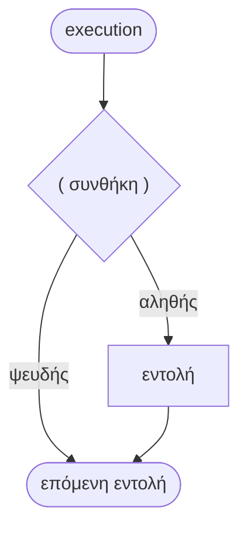
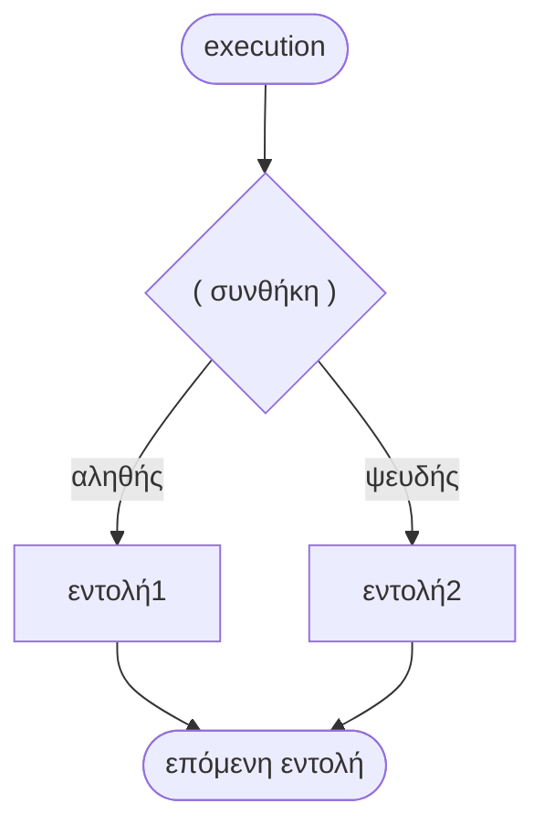
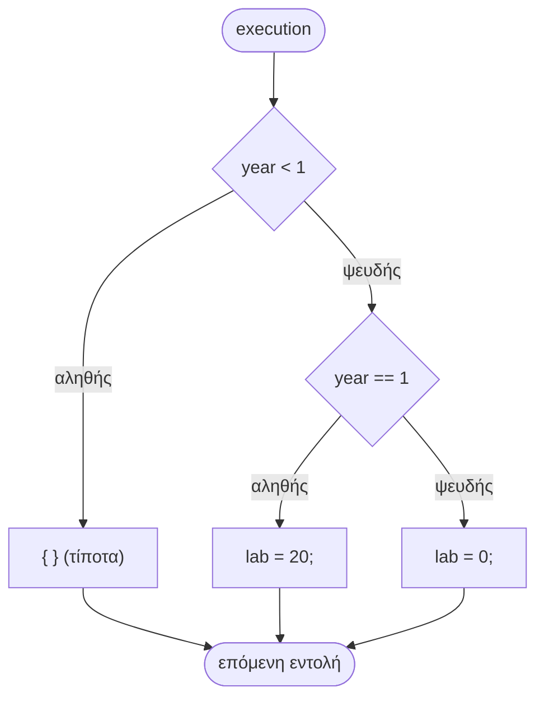
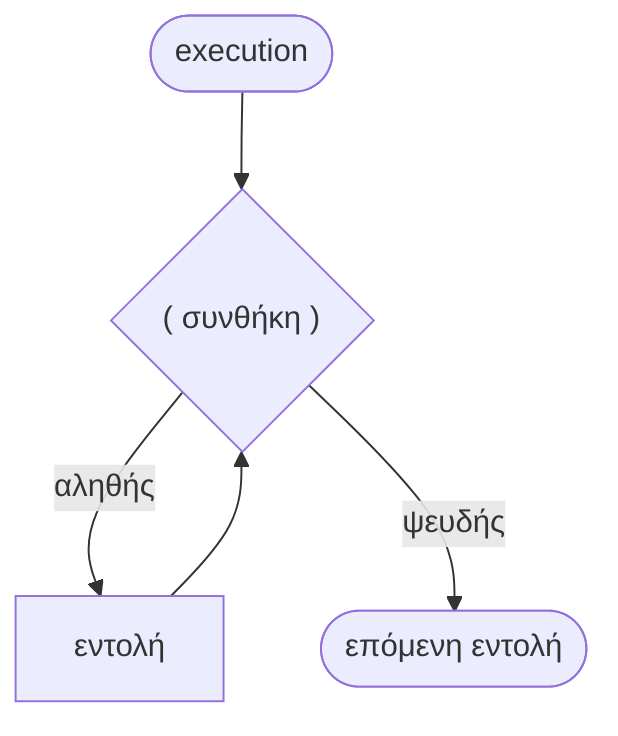
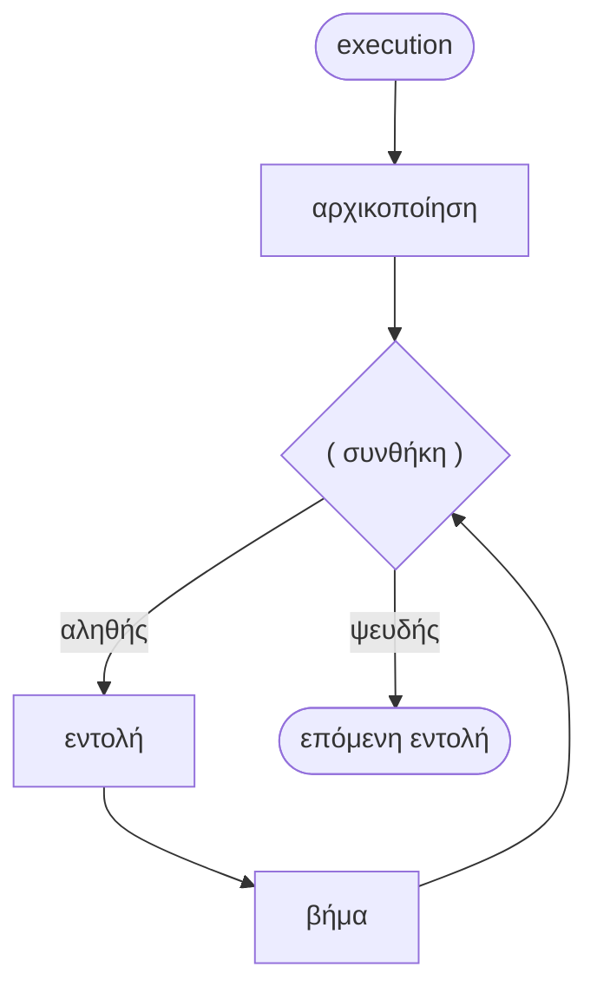
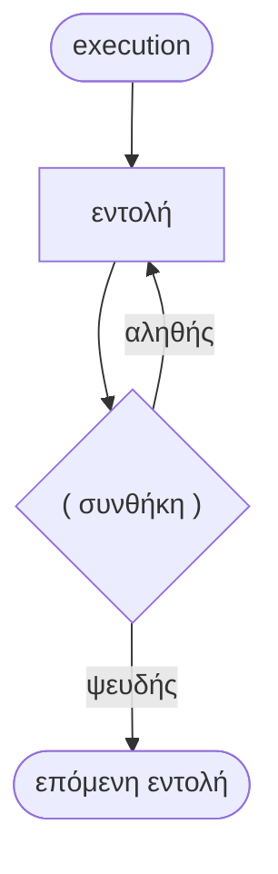

# Κεφάλαιο 6: Εντολές και Ροή Ελέγχου

<!--  -->

> **Στόχοι:** μετά από αυτό το κεφάλαιο θα μπορείτε να κατατάσσετε κάθε εντολή της
> C σε μία από πέντε κατηγορίες, να γράφετε `if`, `if-else` και αλυσίδες `else if`,
> να αποφεύγετε το dangling `else`, να γράφετε βρόχους `while`, `for` και `do-while`,
> να προβλέπετε πόσες φορές εκτελείται το σώμα τους και να διαβάζετε το διάγραμμα
> ροής κάθε εντολής ελέγχου.
>
> **Προαπαιτούμενα:** [Κεφάλαιο 2](../02-memory-variables/), [Κεφάλαιο 5](../05-operators-statements/)
>
> **Χρόνος μελέτης:** ~2 ώρες

## Σύνοψη

Η διάλεξη κατατάσσει τις εντολές της C σε πέντε κατηγορίες (κενές,
έκφρασης, σύνθετες, συνθήκης, επανάληψης) και περνάει στη **ροή ελέγχου**: στις
εντολές που αποφασίζουν *ποια* εντολή θα εκτελεστεί και *πόσες φορές*. Βλέπουμε την
`if` και την `if-else`, τις εμφωλευμένες `if` και την παγίδα του dangling `else`, και
τους τρεις βρόχους `while`, `for` και `do-while`, ο καθένας με το διάγραμμα ροής του. Με αυτά γράφουμε
προγράμματα που παίρνουν αποφάσεις και επαναλαμβάνουν υπολογισμούς.

## Θεωρία

### Κατηγορίες εντολών

Κάθε **εντολή (statement)** της C ανήκει σε μία από πέντε κατηγορίες:

| # | Κατηγορία | English | Παράδειγμα |
| --- | --- | --- | --- |
| 1 | Κενές εντολές | null / empty statements | `;` |
| 2 | Εντολές έκφρασης | expression statements | `x = 4;` |
| 3 | Σύνθετες εντολές | compound statements / blocks | `{ x = 4; y = 7; }` |
| 4 | Εντολές συνθήκης | conditional statements | `if (x > y) max = x;` |
| 5 | Εντολές επανάληψης | iteration statements / loops | `while (i < 42) i++;` |

Το semicolon (`;`) είναι το διαχωριστικό εντολών: δείχνει πού τελειώνει μια εντολή.
Οι κατηγορίες 4 και 5 είναι οι εντολές ροής ελέγχου.

### Κενή εντολή, εντολή έκφρασης, σύνθετη εντολή

Η **κενή εντολή (empty / null statement)** είναι ένα σκέτο `;` και δεν κάνει τίποτα
(**no-op**)· το `;;;;;` είναι πέντε κενές εντολές. Χρησιμεύει (και κρύβει παγίδες)
όταν γίνεται σώμα μιας `if` ή ενός βρόχου.

**Εντολή έκφρασης (expression statement)** είναι μια έκφραση που τελειώνει με
semicolon, π.χ. οι αναθέσεις, οι αυξήσεις και οι κλήσεις συναρτήσεων: `x = 4;`, `z = ++y;`.

**Σύνθετη εντολή (compound statement)** ή **block** είναι μια σειρά εντολών μέσα σε
αγκύλες `{ }`. Συντακτικά ένα block μετράει ως **μία** εντολή, οπότε όπου η C ζητάει
«μια εντολή» (π.χ. ως σώμα μιας `if`) μπορούμε να βάλουμε όσες θέλουμε μέσα σε
αγκύλες. Μετά το `}` δεν χρειάζεται `;`, και το άδειο block `{ }` κάνει ό,τι η κενή
εντολή.

### Ροή ελέγχου

**Ροή ελέγχου (control flow)** είναι η σειρά με την οποία εκτελούνται οι εντολές ενός
προγράμματος. Την καθορίζουν οι **εντολές ροής ελέγχου (control flow statements)**,
που παραλείπουν εντολές (συνθήκη) ή τις επαναλαμβάνουν (βρόχοι). Συνήθως την
οπτικοποιούμε με ένα **διάγραμμα ροής (flowchart)**: ένας ρόμβος είναι ο έλεγχος
μιας συνθήκης με δύο εξόδους, «αληθής» και «ψευδής», και ένα ορθογώνιο είναι μια
εντολή.

Μια συνθήκη στην C είναι απλώς μια έκφραση ([Κεφάλαιο 5](../05-operators-statements/)):
τιμή **μηδέν** σημαίνει **ψευδής**, **οποιαδήποτε άλλη** τιμή σημαίνει **αληθής**.
Γι' αυτό γράφουμε `while (1)` ή `if (n)`.

### Η εντολή if

Η **εντολή `if`** εκτελεί μια εντολή μόνο αν μια λογική συνθήκη είναι αληθής:

```text
if ( συνθήκη )
    εντολή
```

Οι παρενθέσεις γύρω από τη συνθήκη είναι **υποχρεωτικές**. Η εντολή μπορεί να είναι
οποιασδήποτε κατηγορίας: κενή (`if (year > 1) ;`, που δεν κάνει τίποτα), εντολή
έκφρασης (`if (year > 1) year++;`) ή block (`if (year > 1) { year++; }`). Οι δύο
τελευταίες κάνουν το ίδιο, αλλά με αγκύλες μια δεύτερη εντολή που θα προσθέσετε
αργότερα μπαίνει σίγουρα μέσα στην `if`.



*Σχήμα: διάγραμμα ροής της `if`.*

### Η εντολή if-else

Η **εντολή `if-else`** εκτελεί μια *άλλη* εντολή όταν η συνθήκη είναι ψευδής. Εκτελείται
ακριβώς μία από τις δύο, ποτέ και οι δύο και ποτέ καμία:

```text
if ( συνθήκη )
    εντολή1
else
    εντολή2
```



*Σχήμα: διάγραμμα ροής της `if-else`.*

Το `else` δεν είναι απαραίτητο (το ίδιο αποτέλεσμα βγαίνει με μια αρχική ανάθεση
και μια απλή `if`), αλλά δείχνει καθαρά ότι οι δύο περιπτώσεις αποκλείονται. Για
απλές επιλογές τιμής υπάρχει και ο τελεστής συνθήκης `? :` του
[Κεφαλαίου 5](../05-operators-statements/). Βλ. το παράδειγμα
[Μέγιστο δύο αριθμών](#μέγιστο-δύο-αριθμών).

### Εμφωλευμένες if και η αλυσίδα else if

Όταν έχουμε πάνω από δύο περιπτώσεις, χρησιμοποιούμε **εμφωλευμένες εντολές `if`
(nested if)**: το σώμα μιας `if` ή ενός `else` είναι άλλη `if`. Το `else if` δεν είναι
ξεχωριστή λέξη-κλειδί· είναι ένα `else` του οποίου η εντολή είναι μια νέα `if`. Στο
παράδειγμα των διαφανειών:

```c
lab = -1;
if (year < 1)
    { /* empty block */ }
else if (year == 1)
    lab = 20;
else
    lab = 0;
```

Οι συνθήκες ελέγχονται με τη σειρά και εκτελείται το σώμα της *πρώτης* αληθούς: για
`year < 1` το `lab` μένει `-1` (άδειο block), για `year == 1` γίνεται `20`, αλλιώς `0`.



*Σχήμα: η αλυσίδα `else if` ως δύο εμφωλευμένες `if-else`.*

### Το πρόβλημα του dangling else

Οι εμφωλευμένες `if` χωρίς αγκύλες μπορεί να είναι **αμφίσημες (ambiguous)**: σε ποια
`if` ανήκει ένα `else`; Ο μεταγλωττιστής **αγνοεί τη στοίχιση** και ακολουθεί έναν
κανόνα: **κάθε `else` ανήκει στην πλησιέστερη προηγούμενη `if` που δεν έχει ήδη
`else`.** Έτσι, στο

```c
if (year <= 1)
    if (year == 1)
        lab = 20;
else
    lab = 0;
```

το `else` ανήκει στην εσωτερική `if (year == 1)`, παρόλο που η στοίχιση λέει το
αντίθετο. Αυτό είναι το πρόβλημα του **dangling else**. Η λύση των διαφανειών: **αν
δεν είμαστε σίγουροι, χρησιμοποιούμε αγκύλες `{ }` για να υποδείξουμε τα όρια των
σύνθετων εντολών.** Ο gcc με `-Wall` προειδοποιεί: `suggest explicit braces to avoid
ambiguous 'else' [-Wdangling-else]`. Βλ. το παράδειγμα
[Είναι τα δύο προγράμματα ισοδύναμα;](#είναι-τα-δύο-προγράμματα-ισοδύναμα).

### Βρόχοι: η εντολή while

Οι **βρόχοι (loops)** ή δομές επανάληψης επαναλαμβάνουν μια εντολή, το **σώμα** του
βρόχου· κάθε εκτέλεσή του λέγεται **επανάληψη (iteration)**. Η **εντολή `while`**
επαναλαμβάνει το σώμα **όσο** η συνθήκη είναι αληθής:

```text
while ( συνθήκη )
    εντολή
```

Η συνθήκη ελέγχεται **πριν** από κάθε επανάληψη, οπότε αν είναι ψευδής από την αρχή το
σώμα δεν εκτελείται **καμία** φορά. Για να τελειώσει ο βρόχος, το σώμα πρέπει να
αλλάζει κάτι από το οποίο εξαρτάται η συνθήκη· αλλιώς έχουμε **ατέρμονα βρόχο
(infinite loop)**.



*Σχήμα: διάγραμμα ροής της `while`· ο έλεγχος γίνεται πριν από το σώμα.*

### Η εντολή for

Η **εντολή `for`** αρχικοποιεί μεταβλητές, επαναλαμβάνει μια εντολή όσο η συνθήκη
είναι αληθής, και στο τέλος κάθε επανάληψης εκτελεί το **βήμα**:

```text
for ( αρχικοποίηση ; συνθήκη ; βήμα )     αρχικοποίηση;
    εντολή                                while ( συνθήκη ) {
                                              εντολή
                                              βήμα;
                                          }
```

Η αρχικοποίηση εκτελείται **μία φορά**· μετά ελέγχεται η συνθήκη, εκτελείται το σώμα,
εκτελείται το βήμα, και ξανά από τον έλεγχο. Όπως δείχνει η δεξιά στήλη, η `for` είναι
απλώς πιο συμπαγής γραφή της `while`.



*Σχήμα: διάγραμμα ροής της `for`.*

Και τα τρία μέρη είναι προαιρετικά, αλλά τα δύο `;` μένουν πάντα. Συνθήκη που λείπει
θεωρείται πάντα αληθής, άρα το `for (;;)` είναι η κλασική γραφή του ατέρμονα βρόχου.
Ο βρόχος `for (i = 0; i < N; i++)` εκτελείται ακριβώς `N` φορές, για
`i = 0, 1, …, N-1`.

### Η εντολή do-while

Η **εντολή `do-while`** εκτελεί πρώτα μία φορά την εντολή και μετά ελέγχει τη συνθήκη
για το αν χρειάζεται άλλη επανάληψη:

```text
do
    εντολή
while ( συνθήκη );
```

Επειδή ο έλεγχος γίνεται στο τέλος, το σώμα εκτελείται **τουλάχιστον μία φορά** (π.χ.
ζητάμε μια τιμή από τον χρήστη μέχρι να είναι έγκυρη). Το τελικό `;` είναι **υποχρεωτικό**.



*Σχήμα: διάγραμμα ροής της `do-while`· το σώμα προηγείται του ελέγχου.*

### Σύγκριση των τριών βρόχων

| | `while` | `for` | `do-while` |
| --- | --- | --- | --- |
| Έλεγχος συνθήκης | πριν από κάθε επανάληψη | πριν από κάθε επανάληψη | μετά από κάθε επανάληψη |
| Ελάχιστες εκτελέσεις σώματος | 0 | 0 | 1 |
| Αρχικοποίηση / βήμα | χωριστά | στην επικεφαλίδα | χωριστά |
| `;` μετά τη συνθήκη | λάθος (κενό σώμα) | λάθος (κενό σώμα) | υποχρεωτικό |
| Ατέρμονας βρόχος | `while (1)` | `for (;;)` | `do … while (1);` |

Μετρητής με γνωστό εύρος: `for`· «όσο ισχύει κάτι»: `while`· «τουλάχιστον μία φορά»:
`do-while`. Οι `switch`, `break`, `continue` έρχονται στο [Κεφάλαιο 8](../08-control-flow-2/).

## Παραδείγματα

### Ιχνηλάτηση εντολών έκφρασης

*Εφαρμόζει: εντολή έκφρασης, `++`/`--` από το [Κεφάλαιο 5](../05-operators-statements/).*
Ποια η τιμή των `x`, `y`, `z` μετά από αυτές τις εντολές;

```c
x = 4;
y = 7;
z = ++y;
y = z - (x++);
z = x - (--y);
```

Το `++y` αλλάζει πρώτα και δίνει τη νέα τιμή· το `x++` δίνει την παλιά και αλλάζει μετά:

| Εντολή | `x` | `y` | `z` |
| --- | --- | --- | --- |
| `x = 4; y = 7;` | 4 | 7 | ? |
| `z = ++y;` | 4 | 8 | 8 |
| `y = z - (x++);` | 5 | 4 | 8 |
| `z = x - (--y);` | 5 | 3 | 2 |

### Μέγιστο δύο αριθμών

*Εφαρμόζει: `if-else`.* Οι διαφάνειες ρωτούν αν μπορούμε χωρίς `else`, αν υπάρχει
άλλος τρόπος, και τι κάνουμε με πάνω από δύο συνθήκες. Τρεις ισοδύναμες γραφές:

```c
if (x > y) max = x; else max = y;   /* 1: if-else */
max = y; if (x > y) max = x;        /* 2: χωρίς else */
max = (x > y) ? x : y;              /* 3: τελεστής συνθήκης */
``` Για περισσότερες από δύο
συνθήκες: εμφωλευμένες `if`.

### Είναι τα δύο προγράμματα ισοδύναμα;

*Εφαρμόζει: εμφωλευμένες `if`, dangling else.* Το πρώτο είναι η αλυσίδα `else if` της
Θεωρίας· το δεύτερο είναι:

```c
lab = -1;
if (year <= 1)
    if (year == 1)
        lab = 20;
else
    lab = 0;
```

Αν το `else` ανήκε στην εξωτερική `if`, όπως υπονοεί η στοίχιση, θα ήταν ισοδύναμα.
Ανήκει όμως στην εσωτερική, άρα:

| `year` | 1ο πρόγραμμα | 2ο πρόγραμμα |
| --- | --- | --- |
| `0` (ή αρνητικό) | `lab = -1` | `lab = 0` |
| `1` | `lab = 20` | `lab = 20` |
| `2` (ή μεγαλύτερο) | `lab = 0` | `lab = -1` |

**Δεν** είναι ισοδύναμα. Για να ανήκει το `else` στην εξωτερική `if`, κλείστε την
εσωτερική `if` σε αγκύλες: `if (year <= 1) { if (year == 1) lab = 20; } else lab = 0;`.

### Άθροισμα με while

*Εφαρμόζει: `while`.* Τι κάνει το παρακάτω πρόγραμμα;

```c
#include <stdio.h>

int main() {
    int i = 0;
    int sum = 0;
    while (i < 42) {
        sum += i;
        i++;
    }
    printf("%d %d\n", i, sum);
    return 0;
}
```

Ο βρόχος σταματάει όταν `i == 42`, αφού έχει προσθέσει $0 + \dots + 41 = 861$:

```text
$ ./a.out
42 861
```

Μετά τον βρόχο το `i` έχει την τιμή που *έκανε* τη συνθήκη ψευδή (42), όχι την
τελευταία για την οποία εκτελέστηκε το σώμα (41).

### Ατέρμονες βρόχοι: while (1) και for (;;)

*Εφαρμόζει: κενή εντολή, `while`, `for`.*

```c
while (1);
for (;;) ;
```

Ατέρμονες βρόχοι με κενό σώμα (στις διαφάνειες το `for (;;)` δεν έχει σώμα· εδώ
πήρε την κενή εντολή): το πρόγραμμα «κολλάει» μέχρι το Ctrl-C. Μια πάντα αληθής
συνθήκη έχει νόημα σε προγράμματα που τρέχουν συνεχώς (ένας server, ένα παιχνίδι) ή
που τερματίζουν από μέσα, π.χ. με `return` ή με την `break` μιας επόμενης διάλεξης.

### Το ερωτηματικό μετά το while

*Εφαρμόζει: κενή εντολή, `while`.* Τι κάνει το παρακάτω;

```c
i = 0;
while (i < 42);
    printf("%d\n", i++);
```

Το `;` μετά το `while (i < 42)` είναι κενή εντολή και *αυτή* είναι το σώμα. Το `i`
δεν αλλάζει ποτέ και το πρόγραμμα κολλάει χωρίς έξοδο· η `printf` βρίσκεται μετά τον
βρόχο και δεν εκτελείται ποτέ. Ο κώδικας μεταγλωττίζεται, αφού είναι συντακτικά σωστός.

### Μέτρηση με for

*Εφαρμόζει: `for`.* Ο πρώτος βρόχος τυπώνει 100 φορές `Hello world`· ο δεύτερος
είναι το γενικό παράδειγμα των διαφανειών:

```c
int i;
for ( i = 0 ; i < 100 ; i++ )
    printf("Hello world\n");

for ( i = 0 ; i < N ; i++ ) {
    printf("%d\n", i);
}
```

- *Πόσες φορές εκτελείται το block;* `N` φορές (αν `N > 0`), για `i = 0, …, N-1`· αν
  `N <= 0`, καμία.
- *Θα τυπωθεί το `N`;* Όχι: με `i == N` η συνθήκη είναι ψευδής πριν από την `printf`.
- *Τι γίνεται αν αλλάξω αρχικοποίηση ή βήμα;* Με `i = 1` το σώμα εκτελείται `N-1`
  φορές· με βήμα `i += 2` τυπώνονται μόνο οι ζυγοί κάτω από `N`· με `i--` το `i`
  απομακρύνεται από το `N` και ο βρόχος (θεωρητικά) δεν τελειώνει ποτέ.

### do-while μέχρι το 42

*Εφαρμόζει: `do-while`.* Τι κάνει το παρακάτω;

```c
i = 0;
do
    i++;
while (i < 42);
printf("%d\n", i);
```

Το `i` αυξάνεται και μετά ελέγχεται· όταν γίνει `42` ο έλεγχος αποτυγχάνει και
τυπώνεται `42`. Με `i = 100;` στην αρχή, η `do-while` εκτελεί το σώμα μία φορά και τυπώνει `101`, ενώ
ένα `while (i < 42) i++;` δεν θα το εκτελούσε καθόλου και θα έμενε `100`.

### Γρήγορος έλεγχος της λύσης με pipes και time

*Συμβουλή για την άσκηση `aliquot` της hw0.* Αντί να πληκτρολογείτε κάθε φορά την
είσοδο, στείλτε τη στο πρόγραμμα με pipe ([Κεφάλαιο 1](../01-command-line/)):

```sh
echo -e "138\n0\nf\n" | ./aliquot
```

Η `echo -e` ερμηνεύει κάθε `\n` ως αλλαγή γραμμής, οπότε το `./aliquot` διαβάζει τρεις
γραμμές: `138`, `0` και `f`. Με `time` μετράτε και τον χρόνο εκτέλεσης, και με
`ttyplot` (ίσως χρειαστεί να το εγκαταστήσετε) σχεδιάζετε την έξοδο στο τερματικό:

```sh
echo -e "138\n0\nf\n" | time ./aliquot
echo -e "2856\n0\nf\n" | ./aliquot | ttyplot
```

## Κύρια σημεία

1. Κάθε εντολή της C είναι κενή, έκφρασης, σύνθετη, συνθήκης ή επανάληψης.
2. Η κενή εντολή `;` δεν κάνει τίποτα· μετράει όταν γίνεται σώμα `if` ή βρόχου.
3. Μια έκφραση που τελειώνει σε `;` είναι εντολή έκφρασης.
4. Ένα block `{ }` μετράει ως μία εντολή και μπορεί να γίνει σώμα κάθε εντολής ελέγχου.
5. Ροή ελέγχου είναι η σειρά εκτέλεσης των εντολών· τη δείχνει ένα διάγραμμα ροής.
6. Η `if` εκτελεί μια εντολή μόνο αν η συνθήκη είναι μη μηδενική· οι παρενθέσεις είναι υποχρεωτικές.
7. Η `if-else` εκτελεί ακριβώς μία από δύο εντολές.
8. Για πάνω από δύο περιπτώσεις γράφουμε εμφωλευμένες `if`, συνήθως ως αλυσίδα `else if`.
9. Κάθε `else` ανήκει στην πλησιέστερη προηγούμενη `if` χωρίς `else`· η στοίχιση δεν μετράει.
10. Αν δεν είμαστε σίγουροι, χρησιμοποιούμε αγκύλες `{ }` για τα όρια των σύνθετων εντολών.
11. Η `while` ελέγχει πριν από κάθε επανάληψη, οπότε το σώμα της μπορεί να μην εκτελεστεί.
12. Ένα `;` αμέσως μετά από `while (...)` ή `for (...)` γίνεται το σώμα του βρόχου.
13. Οι `while (1)` και `for (;;)` χρησιμεύουν σε προγράμματα που τρέχουν συνεχώς.
14. Η `for` ισοδυναμεί με μια `while`· το `for (i = 0; i < N; i++)` εκτελείται `N` φορές.
15. Η `do-while` εκτελεί το σώμα τουλάχιστον μία φορά· το `;` στο τέλος είναι υποχρεωτικό.
16. Με `echo -e "..." | ./prog` δοκιμάζετε γρήγορα ένα πρόγραμμα, και με `time` το χρονομετράτε.

## Ορολογία

| Ελληνικά | English | Σύντομος ορισμός |
| --- | --- | --- |
| εντολή | statement | Η μονάδα εκτέλεσης ενός προγράμματος C |
| κενή εντολή | empty / null statement | Το σκέτο `;`, που δεν κάνει τίποτα (no-op) |
| εντολή έκφρασης | expression statement | Μια έκφραση που τελειώνει με `;` |
| σύνθετη εντολή | compound statement / block | Εντολές μέσα σε `{ }`, που μετράνε ως μία |
| ροή ελέγχου | control flow | Η σειρά με την οποία εκτελούνται οι εντολές |
| διάγραμμα ροής | flowchart | Σχήμα με ρόμβους (συνθήκες) και ορθογώνια (εντολές) |
| εμφωλευμένες if | nested if | `if` μέσα στο σώμα άλλης `if` ή `else` |
| κρεμασμένο else | dangling else | Αμφισημία για το σε ποια `if` ανήκει ένα `else` |
| βρόχος | loop | Εντολή που επαναλαμβάνει ένα σώμα |
| επανάληψη | iteration | Μία εκτέλεση του σώματος του βρόχου |
| ατέρμονας βρόχος | infinite loop | Βρόχος που δεν τερματίζει ποτέ |
| αρχικοποίηση / βήμα | initialization / step | Το πρώτο και το τρίτο μέρος της `for` |

## Συχνά λάθη

- **`;` μετά τη συνθήκη βρόχου.** `while (i < 42); printf(...);` κολλάει χωρίς έξοδο·
  `for (i = 0; i < N; i++);` εκτελεί το «σώμα» μία φορά, μετά τον βρόχο. Διόρθωση:
  σβήστε το `;`, βάλτε το σώμα σε `{ }`. Το ίδιο με `if (x > y); max = x;`.
- **Εμπιστοσύνη στη στοίχιση.** Δύο εντολές με εσοχή κάτω από `if` χωρίς αγκύλες: μόνο
  η πρώτη ανήκει στην `if`. Διόρθωση: `{ }`.
- **Dangling else.** Το `else` πάει στην εσωτερική `if` και βγαίνουν λάθος τιμές· ο
  gcc με `-Wall` λέει `suggest explicit braces to avoid ambiguous 'else'`.
- **Χωρίς παρενθέσεις.** `if x > 1` δεν μεταγλωττίζεται (`expected '(' before 'x'`).
- **Ξεχασμένο βήμα σε `while`:** ο βρόχος δεν τελειώνει. **Off-by-one:** `for (i = 0; i <= N; i++)` εκτελείται `N+1` φορές, όχι `N`.
- **Χωρίς `;` στο τέλος της `do-while`.** `do i++; while (i < 42)` δίνει `expected ';'`.
- **Ο μετρητής μετά τον βρόχο.** Μετά το `while (i < 42) { … i++; }` το `i` είναι `42`.

## Διάβασμα

- **Διαφάνειες:** [Διάλεξη 6](https://github.com/progintro/progintro.github.io/releases/download/2025/lec06.pdf), σελ. 1–29. Pipes και `time`: σελ. 2· κατηγορίες εντολών: σελ. 5–8· ροή ελέγχου, `if`, `if-else`: σελ. 9–13· εμφωλευμένες `if` και dangling else: σελ. 14–16· `while`: σελ. 17–21· `for`: σελ. 22–24· `do-while`: σελ. 25–26.
- **Σημειώσεις:** [Κεφάλαιο 3: Η ροή του ελέγχου](https://progintro.github.io/notes/chapters/03-control-flow/), ενότητες «Η ροή του ελέγχου στην C», «Εντολή `if`», «Εντολές βρόχου `while`», «Εντολή βρόχου `for`» (K04, σελ. 46–49 και 52–55). Οι διαφάνειες συνιστούν να έχετε καλύψει τις σημειώσεις του κ. Σταματόπουλου μέχρι και τη σελίδα 62, δηλαδή και το [Κεφάλαιο 4: Συναρτήσεις](https://progintro.github.io/notes/chapters/04-functions/) μέχρι την ενότητα «Συνάρτηση υπολογισμού παραγοντικού».
- **Εργαστήριο:** [Εργαστήριο 3](https://progintro.github.io/lab-material/labs/lab03/): εισαγωγή για τους τρεις βρόχους και τα διαγράμματα ροής τους, ασκήσεις `seq.c` (`while`, `for`, `do...while`), `root.c` (`if...else`), `birthdate.c`, `limit.c`
- **Βιβλίο:** K&R, κεφ. 3 (σελ. 85–100), όπως προτείνουν οι σημειώσεις.
- **Άλλα:**
  - Wikipedia: [Control flow](https://en.wikipedia.org/wiki/Control_flow), [Conditional (computer programming)](https://en.wikipedia.org/wiki/Conditional_(computer_programming)), [While loop](https://en.wikipedia.org/wiki/While_loop), [For loop](https://en.wikipedia.org/wiki/For_loop), [Dangling else](https://en.wikipedia.org/wiki/Dangling_else)
  - Για τις ακολουθίες aliquot: [σχετικό άρθρο (PDF)](https://math.dartmouth.edu/~carlp/upintconf.pdf)

## Ασκήσεις

<!-- exercises -->

### Από τις διαφάνειες

- [Τι τυπώνει η do-while](../../questions/slides/slides-lec06-do-while.md): Διάλεξη 6: Εντολές και Ροή Ελέγχου, διαφάνεια 26 · ★☆☆ · trace
- [Τιμές μετά από εντολές έκφρασης](../../questions/slides/slides-lec06-expression-statements.md): Διάλεξη 6: Εντολές και Ροή Ελέγχου, διαφάνεια 7 · ★☆☆ · trace
- [Πόσες φορές εκτελείται μια for](../../questions/slides/slides-lec06-for-count.md): Διάλεξη 6: Εντολές και Ροή Ελέγχου, διαφάνεια 24 · ★☆☆ · short-answer
- [Ο βρόχος for (;;)](../../questions/slides/slides-lec06-for-empty.md): Διάλεξη 6: Εντολές και Ροή Ελέγχου, διαφάνεια 23 · ★☆☆ · short-answer
- [Μέγιστο με if-else και εναλλακτικές](../../questions/slides/slides-lec06-if-else-max.md): Διάλεξη 6: Εντολές και Ροή Ελέγχου, διαφάνεια 13 · ★☆☆ · short-answer
- [Ο βρόχος while (1)](../../questions/slides/slides-lec06-while-forever.md): Διάλεξη 6: Εντολές και Ροή Ελέγχου, διαφάνεια 20 · ★☆☆ · short-answer
- [Άθροισμα με while](../../questions/slides/slides-lec06-while-sum.md): Διάλεξη 6: Εντολές και Ροή Ελέγχου, διαφάνεια 19 · ★☆☆ · trace
- [Το πρόβλημα του dangling else](../../questions/slides/slides-lec06-dangling-else.md): Διάλεξη 6: Εντολές και Ροή Ελέγχου, διαφάνεια 15 · ★★☆ · trace
- [Το ερωτηματικό μετά το while](../../questions/slides/slides-lec06-while-semicolon.md): Διάλεξη 6: Εντολές και Ροή Ελέγχου, διαφάνεια 21 · ★★☆ · trace

### Από τα εργαστήρια

- [Αποσφαλμάτωση αθροίσματος με όριο](../../questions/labs/lab-lab03-limit.md): Εργαστήριο 3, Άσκηση 4 · ★☆☆ · debug
- [Κατασκευή πυραμίδας](../../questions/labs/lab-lab04-pyramid.md): Εργαστήριο 4, Άσκηση 2 · ★☆☆ · programming
- [Υπολογισμός ριζών τριωνύμου](../../questions/labs/lab-lab03-root.md): Εργαστήριο 3, Άσκηση 2 · ★★☆ · programming
- [Υπολογισμός αθροίσματος σειράς](../../questions/labs/lab-lab03-seq.md): Εργαστήριο 3, Άσκηση 1 · ★★☆ · programming

### Από τις εργασίες

- [Η εικασία Collatz](../../questions/homework/hw-2023-hw0-collatz.md): Εργασία 0 (2023-24), Άσκηση 3 · ★★☆ · programming
- [Οι Ακολουθίες Aliquot](../../questions/homework/hw-2025-hw0-aliquot.md): Εργασία 0 (2025-26), Άσκηση 3 · ★★☆ · programming

### Από τα θέματα εξετάσεων

- [Μέγιστος Κοινός Διαιρέτης](../../questions/exams/exam-2023-fall-ex6-q1.md): Online τελική εξέταση Δεκεμβρίου 2023, Εξέταση #6 (Crypto Themed), Θέμα 1 · ★☆☆ · programming
- [Προσεγγίζοντας το π](../../questions/exams/exam-2024-dec-q1.md): Κατατακτήριες Δεκεμβρίου 2024, Θέμα 1 · ★☆☆ · programming
- [Mystery](../../questions/exams/exam-2025-sep-q1.md): Εξέταση Σεπτεμβρίου 2025, Θέμα 1 · ★☆☆ · trace
- [Mystery](../../questions/exams/exam-2026-sep-q1.md): Εξέταση Σεπτεμβρίου 2026, Θέμα 1 · ★☆☆ · trace
- [Κάντο όπως ο Βιετά](../../questions/exams/exam-2023-dec-q1.md): Κατατακτήριες Δεκεμβρίου 2023, Θέμα 1 · ★★☆ · programming
- [Ασημένιο Κλάσμα](../../questions/exams/exam-2023-fall-ex10-q2.md): Online τελική εξέταση Δεκεμβρίου 2023, Εξέταση #10, Θέμα 2 · ★★☆ · programming
- [Κάντο όπως ο Βιετά](../../questions/exams/exam-2023-fall-ex13-q1.md): Online τελική εξέταση Δεκεμβρίου 2023, Εξέταση #13, Θέμα 1 · ★★☆ · programming
- [Τυπώνοντας τον Πίνακα ASCII](../../questions/exams/exam-2023-fall-ex15-q2.md): Online τελική εξέταση Δεκεμβρίου 2023, Εξέταση #15, Θέμα 2 · ★★☆ · programming
- [Πετυχαίνοντας τον Στόχο](../../questions/exams/exam-2023-fall-ex9-q2.md): Online τελική εξέταση Δεκεμβρίου 2023, Εξέταση #9, Θέμα 2 · ★★☆ · programming
- [Εύρεση Πρώτων Παραγόντων - factor](../../questions/exams/exam-2026-jan-q3.md): Εξέταση Ιανουαρίου 2026, Θέμα 3 · ★★☆ · programming

### Από τα Kahoot στο αμφιθέατρο

- [while(!42)](../../questions/kahoot/kahoot-while-not-42.md): Kahoot «Επίλυση Προβλημάτων» (διάλεξη 7) · ★★★ · multiple-choice · 17% σωστές απαντήσεις
- [Πόσες φορές εκτελείται ένα for μέχρι N](../../questions/kahoot/kahoot-for-n-times-trap.md): Kahoot «Επίλυση Προβλημάτων» (διάλεξη 7), δύο εκδοχές · ★★★ · multiple-choice · 23% σωστές απαντήσεις
- [while γραμμένο ως for](../../questions/kahoot/kahoot-while-as-for.md): Kahoot «Τελεστές, Εντολές και Ροή Ελέγχου» (διάλεξη 6) · ★★★ · multiple-choice · 24% σωστές απαντήσεις
- [if χωρίς παρενθέσεις](../../questions/kahoot/kahoot-if-without-parens.md): Kahoot «Τελεστές, Εντολές και Ροή Ελέγχου» (διάλεξη 6) · ★★☆ · multiple-choice · 42% σωστές απαντήσεις
- [Ένα for χωρίς βήμα](../../questions/kahoot/kahoot-for-missing-increment.md): Kahoot «Επίλυση Προβλημάτων» (διάλεξη 7) · ★★☆ · multiple-choice · 56% σωστές απαντήσεις
- [Επαναλήψεις με βήμα 2](../../questions/kahoot/kahoot-for-step-two.md): Kahoot «Τελεστές, Εντολές και Ροή Ελέγχου» (διάλεξη 6) · ★★☆ · multiple-choice · 57% σωστές απαντήσεις
- [Η σύνταξη του for](../../questions/kahoot/kahoot-for-empty-init.md): Kahoot «Πίνακες» (διάλεξη 10) · ★★☆ · multiple-choice · 59% σωστές απαντήσεις
- [while και do-while](../../questions/kahoot/kahoot-while-vs-do-while.md): Kahoot «Τελεστές, Εντολές και Ροή Ελέγχου» (διάλεξη 6) · ★☆☆ · multiple-choice · 85% σωστές απαντήσεις
- [Απλό if-else](../../questions/kahoot/kahoot-if-else-trace.md): Kahoot «Τελεστές, Εντολές και Ροή Ελέγχου» (διάλεξη 6) · ★☆☆ · multiple-choice · 91% σωστές απαντήσεις

### Σχετικές ασκήσεις από άλλα κεφάλαια

- [Εκτύπωση χαρακτήρων](../../questions/labs/lab-lab04-printchar.md): Εργαστήριο 4, Άσκηση 1 · ★☆☆ · programming (κεφ. 2)
- [Προσέγγιση του π με τη σειρά Leibniz](../../questions/slides/slides-lec03-leibniz-pi.md): Διάλεξη 3: Συναρτήσεις, διαφάνεια 43 · ★★☆ · programming (κεφ. 3)
- [Mystery](../../questions/exams/exam-2025-jan-q1.md): Εξέταση Ιανουαρίου 2025, Θέμα 1 · ★☆☆ · trace (κεφ. 5)
- [Mystery](../../questions/exams/exam-2026-jan-q1.md): Εξέταση Ιανουαρίου 2026, Θέμα 1 · ★☆☆ · trace (κεφ. 5)
- [Η συνάρτηση mystery](../../questions/exams/exam-2026-jun-q1.md): Εξέταση Ιουνίου 2026, Θέμα 1 · ★☆☆ · trace (κεφ. 5)
- [Υπολογισμός ημέρας μίας δεδομένης ημερομηνίας](../../questions/labs/lab-lab03-birthdate.md): Εργαστήριο 3, Άσκηση 3 · ★☆☆ · programming (κεφ. 5)
- [switch και if-else](../../questions/kahoot/kahoot-switch-if-else-equivalence.md): Kahoot «Ροή Ελέγχου #2» (διάλεξη 8) · ★★☆ · multiple-choice · 46% σωστές απαντήσεις (κεφ. 8)
- [while(--i) με i = 0](../../questions/kahoot/kahoot-while-predecrement-overflow.md): Kahoot «Επίλυση Προβλημάτων» (διάλεξη 7) · ★★★ · multiple-choice · 17% σωστές απαντήσεις (κεφ. 8)
- [Το Πρόβλημα του Τρόλεϊ (trolley)](../../questions/homework/hw-2024-hw0-trolley.md): Εργασία 0 (2024-25), Άσκηση 3 · ★★☆ · programming (κεφ. 9)

<!-- /exercises -->

## Ερωτήσεις αυτοαξιολόγησης

1. Πόσες εντολές περιέχει η γραμμή `;;;;;` και τι κάνουν;[^q1]
2. Γιατί ένα block `{ … }` μπορεί να σταθεί ως σώμα μιας `if`, ενώ δύο σκέτες εντολές όχι;[^q2]
3. Σε ποια `if` ανήκει ένα `else` όταν υπάρχουν δύο υποψήφιες και δεν υπάρχουν αγκύλες;[^q3]
4. Ποια είναι η διαφορά ανάμεσα σε `while` και `do-while`; Δώστε μια περίπτωση όπου δίνουν διαφορετικό αποτέλεσμα.[^q4]
5. Γράψτε έναν βρόχο `while` ισοδύναμο με το `for (i = 0; i < 100; i++) printf("Hello world\n");`.[^q5]
6. Πόσες φορές εκτελείται το σώμα του `for (i = 0; i <= N; i++)`;[^q6]

[^q1]: Πέντε κενές εντολές· καμία δεν κάνει τίποτα (no-op).
[^q2]: Η `if` δέχεται ως σώμα μία εντολή. Ένα block είναι συντακτικά μία (σύνθετη) εντολή, ενώ δύο σκέτες εντολές είναι δύο: μόνο η πρώτη ανήκει στην `if`.
[^q3]: Στην πλησιέστερη προηγούμενη `if` που δεν έχει ήδη `else`, ανεξάρτητα από τη στοίχιση.
[^q4]: Η `while` ελέγχει πριν από το σώμα (0 ή περισσότερες εκτελέσεις), η `do-while` μετά (τουλάχιστον μία). Με `i = 100`, το `do i++; while (i < 42);` αφήνει `i = 101`, ενώ το `while (i < 42) i++;` αφήνει `i = 100`.
[^q5]: `i = 0; while (i < 100) { printf("Hello world\n"); i++; }`
[^q6]: `N + 1` φορές (για `i = 0, …, N`), αν `N >= 0`.

<!--  -->
