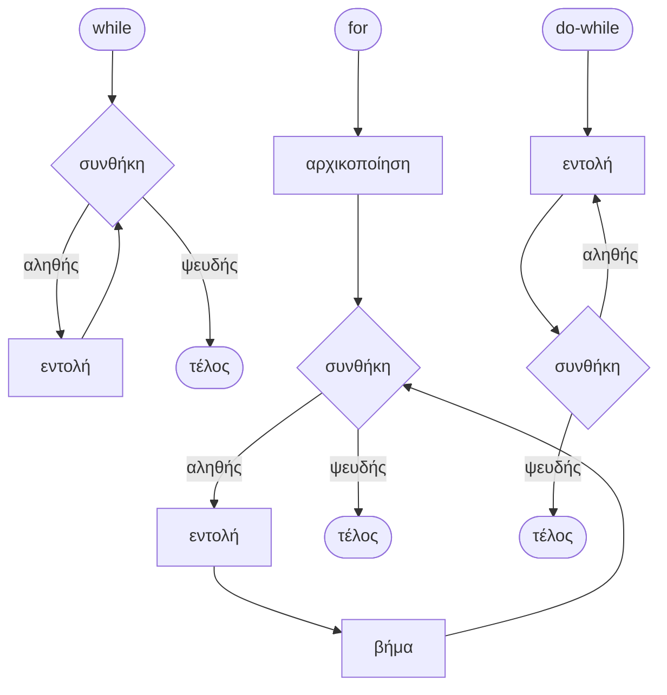
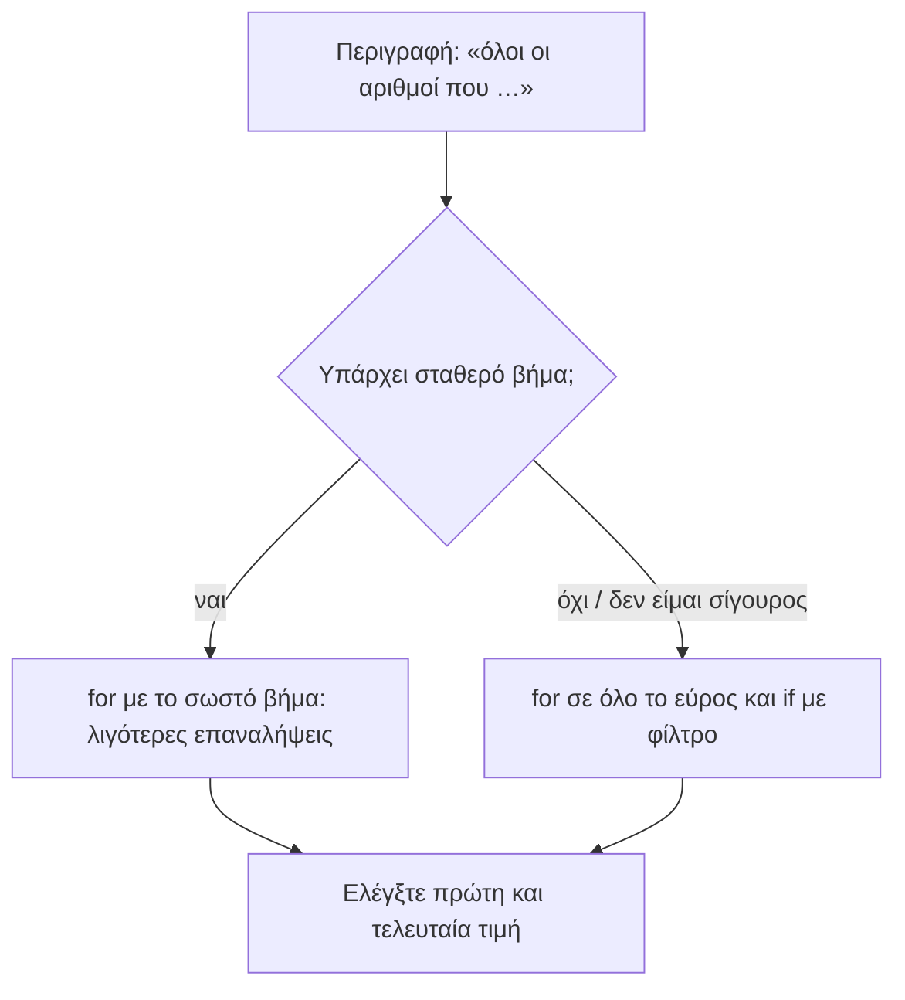
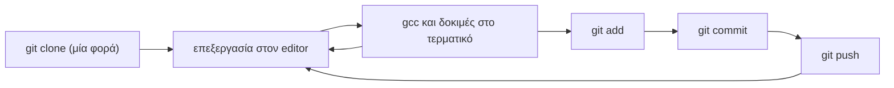

# Κεφάλαιο 7: Επίλυση Προβλημάτων

<!--  -->

> **Στόχοι:** μετά από αυτό το κεφάλαιο θα μπορείτε να
> - επιλέγετε ανάμεσα σε `while`, `for` και `do-while` και να σχεδιάζετε το
>   διάγραμμα ροής τους·
> - μετατρέπετε μια περιγραφή όπως «όλοι οι τριψήφιοι άρτιοι» σε αρχική τιμή,
>   συνθήκη και βήμα ενός βρόχου·
> - διαλέγετε ανάμεσα σε έναν βρόχο με φίλτρο (`if` στο σώμα) και έναν βρόχο που
>   πηγαίνει κατευθείαν στις τιμές που σας ενδιαφέρουν·
> - γράφετε χρήσιμα σχόλια και ένα `README.md` για τις εργασίες σας·
> - μορφοποιείτε τον κώδικά σας με συνέπεια, με ή χωρίς `clang-format`·
> - δουλεύετε με έναν editor, το git και τη γραμμή εντολών ως ενιαία ροή εργασίας.
>
> **Προαπαιτούμενα:** [Κεφάλαιο 1](../01-command-line/), [Κεφάλαιο 4](../04-git-operators/), [Κεφάλαιο 6](../06-control-flow/)
>
> **Χρόνος μελέτης:** ~1,5 ώρα

## Σύνοψη

Η διάλεξη αυτή είναι η πρώτη από τις διαλέξεις «Επίλυσης Προβλημάτων» του μαθήματος:
λιγότερη νέα θεωρία και περισσότερη πρακτική. Ξεκινά με μια σύντομη ανακεφαλαίωση
των τριών βρόχων της C (`while`, `for`, `do-while`) και δύο προβλήματα
προθέρμανσης, που δείχνουν πώς μια φράση όπως «όλοι οι τριψήφιοι περιττοί που
διαιρούνται με το 7» γίνεται αρχική τιμή, συνθήκη και βήμα ενός βρόχου. Το
μεγαλύτερο μέρος της ώρας ήταν ζωντανή δουλειά με εθελοντές από το ακροατήριο,
πάνω σε όσα κάνουν έναν κώδικα επαγγελματικό και όχι μόνο σωστό: σχόλια,
`README`, μορφοποίηση, editors, git και γραμμή εντολών, όλα όσα θα σας ζητηθούν
στις εργασίες.

## Θεωρία

### Γιατί μας ενδιαφέρει η ποιότητα του λογισμικού

Η διάλεξη άνοιξε με ένα επίκαιρο γεγονός: τη διακοπή λειτουργίας της υπηρεσίας
cloud AWS της Amazon τον Οκτώβριο του 2025, που επηρέασε επιχειρήσεις σε όλο τον
κόσμο. Η βασική αιτία (root cause) ήταν ένα υποσύστημα που παρακολουθεί την υγεία
των load balancers του δικτύου τους. Ο καθηγητής Ken Birman (Cornell) σχολίασε
ότι οι προγραμματιστές πρέπει να χτίζουν λογισμικό με καλύτερη **ανοχή σε
σφάλματα** (fault tolerance), δηλαδή λογισμικό που συνεχίζει να λειτουργεί σωστά
ακόμη κι όταν κάποιο κομμάτι του, ή κάποιο σύστημα από το οποίο εξαρτάται,
αποτύχει.

Το δίδαγμα για εμάς είναι ότι ένα λάθος σε ένα «μικρό» κομμάτι κώδικα μπορεί να
έχει τεράστιες συνέπειες. Οι σημειώσεις του μαθήματος το λένε ως εξής: ένα
πρόγραμμα C πρέπει να είναι **σωστό**, **αποδοτικό**, **εύρωστο** (να μην
«σκάει» για καμία είσοδο), **τεκμηριωμένο** και **ευανάγνωστο**. Τα δύο
τελευταία είναι το θέμα του δεύτερου μισού της διάλεξης.

### Ανακοινώσεις: ο διαγωνισμός GRCPC

Οι διαφάνειες έδειξαν τους πίνακες αποτελεσμάτων του GRCPC για το 2023, το 2024
και το 2025. Είναι ο ελληνικός περιφερειακός διαγωνισμός προγραμματισμού του ICPC
(ICPC Greece Regional Competition), όπου ομάδες φοιτητών λύνουν αλγοριθμικά
προβλήματα υπό πίεση χρόνου. Η κατάταξη γίνεται με βάση πόσα προβλήματα έλυσε κάθε
ομάδα και, σε ισοβαθμία, με βάση την ποινή χρόνου (penalty)· οι πίνακες δείχνουν
για κάθε πρόβλημα και πόσες προσπάθειες (tries) χρειάστηκαν. Ομάδες του ΕΚΠΑ εμφανίζονται στις υψηλές θέσεις: το 2025
η «The Ancient Missiles» πήρε χρυσό μετάλλιο και η «DITide and Conquer» ασημένιο.
Το μήνυμα είναι ότι οι δεξιότητες επίλυσης προβλημάτων που χτίζουμε εδώ είναι
ακριβώς αυτές που χρειάζονται τέτοιοι διαγωνισμοί.

### Flow: η κατάσταση πλήρους συγκέντρωσης

Η διάλεξη όρισε το **flow** (γνωστό και ως «in the zone» ή «locked in»), όπως
το περιγράφει η Wikipedia από τη θετική ψυχολογία: είναι η νοητική κατάσταση στην
οποία κάποιος είναι πλήρως απορροφημένος σε μια δραστηριότητα, με ενεργητική
συγκέντρωση, πλήρη εμπλοκή και απόλαυση της διαδικασίας, τόσο που αλλάζει η
αίσθηση του χρόνου. Ο προγραμματισμός είναι από τις δραστηριότητες που οδηγούν
εύκολα σε flow. Για να φτάσετε εκεί χρειάζεστε εργαλεία που δεν σας διακόπτουν:
έναν editor που ξέρετε καλά, μια σταθερή ροή εργασίας με git και κώδικα που
διαβάζεται χωρίς κόπο.

### Ανακεφαλαίωση: οι τρεις βρόχοι

Οι **δομές επανάληψης** (loops, βρόχοι) της C παρουσιάστηκαν αναλυτικά στο
[Κεφάλαιο 6](../06-control-flow/)· εδώ τις θυμόμαστε με τα διαγράμματα ροής
τους.

- Η **`while`** επαναλαμβάνει μια εντολή όσο η λογική συνθήκη είναι αληθής. Η
  συνθήκη ελέγχεται *πριν* από κάθε επανάληψη, άρα το σώμα μπορεί να μην
  εκτελεστεί ούτε μία φορά.
- Η **`for`** αρχικοποιεί μεταβλητές, επαναλαμβάνει μια εντολή όσο η συνθήκη
  είναι αληθής και στο τέλος κάθε επανάληψης εκτελεί το βήμα:
  `for ( αρχικοποίηση ; συνθήκη ; βήμα ) εντολή`.
- Η **`do-while`** εκτελεί πρώτα μία φορά την εντολή και *μετά* ελέγχει τη
  συνθήκη για το αν χρειάζεται άλλη επανάληψη. Το σώμα της εκτελείται πάντα
  τουλάχιστον μία φορά. Προσέξτε το `;` μετά το `while ( συνθήκη )`.



*Σχήμα: τα διαγράμματα ροής των `while`, `for` και `do-while`.*

Το παράδειγμα των διαφανειών για την `for` τυπώνει 100 φορές το `Hello world`,
γιατί το `i` παίρνει τις τιμές 0, 1, …, 99:

```c
int i;
for ( i = 0 ; i < 100 ; i++ )
    printf("Hello world\n");
```

### Από την περιγραφή στον βρόχο

Τα περισσότερα προβλήματα της μορφής «κάνε κάτι για όλους τους αριθμούς που …»
λύνονται με έναν βρόχο `for`, και το δύσκολο κομμάτι είναι να μεταφράσετε την
περιγραφή στα τρία μέρη του:

1. **Αρχική τιμή:** ποιος είναι ο *πρώτος* αριθμός που σας ενδιαφέρει; Αν η σειρά
   είναι φθίνουσα, είναι ο μεγαλύτερος.
2. **Συνθήκη:** μέχρι πού πάτε; Σκεφτείτε αν το όριο περιλαμβάνεται (`<=`, `>=`)
   ή όχι (`<`, `>`). Τα λάθη «κατά ένα» (off-by-one) στο όριο είναι από τα πιο
   συνηθισμένα.
3. **Βήμα:** πόσο απέχουν διαδοχικές τιμές; Το βήμα δεν είναι υποχρεωτικά `i++`:
   μπορεί να είναι `i -= 2` για φθίνουσα σειρά ή `i += 14` για να πηγαίνετε από
   πολλαπλάσιο σε πολλαπλάσιο.

Όταν οι τιμές που θέλετε δεν ακολουθούν απλό βήμα, ή δεν σας έρχεται αμέσως το
σωστό βήμα, υπάρχει μια δεύτερη στρατηγική: διατρέχετε ένα μεγαλύτερο σύνολο και
**φιλτράρετε** με μια `if` μέσα στο σώμα, για παράδειγμα με τον τελεστή υπολοίπου
`%` (`i % 7 == 0` σημαίνει «το `i` διαιρείται με το 7»).



*Σχήμα: δύο τρόποι να διατρέξετε τις τιμές που σας ενδιαφέρουν.*

Οι δύο λύσεις δίνουν το ίδιο αποτέλεσμα, αλλά η λύση με το βήμα κάνει λιγότερες
επαναλήψεις και δεν χρειάζεται `if`. Η λύση με το φίλτρο είναι συχνά πιο εύκολο να
τη γράψετε σωστά με την πρώτη. Σε κάθε περίπτωση, ελέγξτε ότι η πρώτη και η
τελευταία τιμή που βγάζει ο βρόχος είναι αυτές που περιμένετε.

Προσέξτε ακόμη ότι η `for` επιτρέπει πολλές αρχικοποιήσεις χωρισμένες με κόμμα:
`for (product = 1, i = 100; ...)` δίνει αρχική τιμή και στον **συσσωρευτή**
(accumulator) `product` και στη μεταβλητή του βρόχου. Ένας συσσωρευτής γινομένου
ξεκινά από το 1 (το ουδέτερο στοιχείο του πολλαπλασιασμού), όπως ένας
συσσωρευτής αθροίσματος ξεκινά από το 0.

### Σχολιασμός προγραμμάτων

Ένα **σχόλιο** (comment) είναι κείμενο μέσα στον κώδικα που ο μεταγλωττιστής
αγνοεί. Στη C γράφεται ανάμεσα σε `/*` και `*/` (και μπορεί να πιάνει πολλές
γραμμές) ή, από τη C99 και μετά, μετά από `//` μέχρι το τέλος της γραμμής:

```c
/* File: picomp.c
   Υπολογίζει το π από τη σειρά 1/1^2 + 1/2^2 + ... */
sum = sum + current;   // πρόσθεσε τον τρέχοντα όρο
```

Τα σχόλια γράφονται για ανθρώπους: για τον βαθμολογητή, για τους συνεργάτες σας
και, κυρίως, για εσάς σε έναν μήνα. Οι βασικοί κανόνες:

- **Εξηγήστε το «γιατί», όχι το «τι».** Το `i++; // αύξησε το i` δεν προσθέτει
  τίποτα. Ένα σχόλιο αξίζει όταν λέει κάτι που ο κώδικας δεν λέει: την ιδέα του
  αλγορίθμου, μια παραδοχή για την είσοδο, γιατί επιλέξατε αυτό το όριο.
- **Μη σχολιάζετε κάθε γραμμή.** Βάλτε ένα σύντομο σχόλιο στην αρχή κάθε
  ενότητας ή συνάρτησης που λέει τι προσπαθεί να πετύχει· τη μεγάλη εικόνα.
- **Τα σχόλια δεν διορθώνουν ασαφή κώδικα.** Αν χρειάζεστε ένα μεγάλο σχόλιο για να
  εξηγήσετε τι κάνει μια γραμμή, ίσως να χρειάζεται καλύτερα ονόματα μεταβλητών ή
  απλούστερο κώδικα.
- **Κρατήστε τα σχόλια ενημερωμένα.** Ένα σχόλιο που λέει άλλα από τον κώδικα είναι
  χειρότερο από κανένα σχόλιο.
- **Δώστε την πηγή.** Αν πήρατε μια ιδέα ή έναν τύπο από κάπου (βιβλίο, σελίδα,
  Wikipedia), βάλτε τον σύνδεσμο.

Οι σημειώσεις ορίζουν την **τεκμηρίωση** ως καλά ονόματα *μαζί με* σχόλια,
«τόση όση χρειάζεται για να κάνει το πρόγραμμα κατανοητό».

### Δημιουργία README

Το **`README.md`** είναι το αρχείο που συνοδεύει ένα project και εξηγεί τι είναι
και πώς χρησιμοποιείται. Η κατάληξη `.md` σημαίνει ότι γράφεται σε **Markdown**,
μια απλή μορφή κειμένου όπου `#` ξεκινά επικεφαλίδα, `-` ξεκινά λίστα και οι
τριπλές ανάποδες αποστρόφους περικλείουν κώδικα. Το GitHub εμφανίζει αυτόματα το
`README.md` στην πρώτη σελίδα κάθε repository, μορφοποιημένο.

Στις εργασίες του μαθήματος το `README.md` είναι μέρος της υποβολής: για
παράδειγμα η hw0 του 2025 ζητά `cmdline/README.md` με «μια σύντομη περιγραφή για
τον τρόπο που λύσατε το κάθε πρόβλημα». Ένα καλό `README` για μια άσκηση:

- περιγράφει τη **λειτουργία** του προγράμματος (τι κάνει, τι είσοδο περιμένει,
  τι έξοδο δίνει)·
- εξηγεί τη **λογική** της λύσης, την ιδέα που δεν φαίνεται εύκολα από τον
  κώδικα·
- σε μεγαλύτερα projects, περιγράφει τη **δομή**: ποια αρχεία υπάρχουν και τι
  κάνει το καθένα·
- λέει πώς **μεταγλωττίζεται και τρέχει** το πρόγραμμα.

Η διαφορά από τα σχόλια είναι το επίπεδο: στον κώδικα βάζετε σύντομα σχόλια για
κάθε ενότητα, στο `README` δίνετε την πιο εκτενή περιγραφή του συνόλου.

### Μορφοποίηση κώδικα

Ο μεταγλωττιστής δεν νοιάζεται για κενά και αλλαγές γραμμής, οι άνθρωποι όμως
νοιάζονται. Κώδικας με ασυνεπή **στοίχιση** (indentation) κρύβει λάθη: μια εντολή
μπορεί να *φαίνεται* μέσα σε μια `if` ενώ δεν είναι (θυμηθείτε το dangling `else`
στο [Κεφάλαιο 6](../06-control-flow/)). Οι σημειώσεις ζητούν:

- **συνεπή στοίχιση**: κάθε επίπεδο εμφώλευσης μετακινείται κατά τον ίδιο αριθμό
  κενών·
- γραμμές έως **80 χαρακτήρες**·
- **κενά γύρω από τους τελεστές**, όπου βοηθούν την ανάγνωση (`a = b + c;` αντί
  για `a=b+c;`).

Δεν χρειάζεται να τα κάνετε όλα με το χέρι. Το εργαλείο **`clang-format`**
ξαναγράφει ένα αρχείο C σύμφωνα με ένα στυλ, και είναι εγκατεστημένο στα Linux
εργαστήρια της σχολής:

```sh
clang-format -i -style=Google prog.c
```

Το `-i` (in place) αλλάζει το ίδιο το αρχείο και το `-style=Google` διαλέγει το
Google style guide. Αν θέλετε άλλο όριο χαρακτήρων ανά γραμμή, εξάγετε το στυλ σε
αρχείο, αλλάξτε το `ColumnLimit` και χρησιμοποιήστε το αρχείο:

```sh
clang-format -style=Google --dump-config > google.clang-format
clang-format -i -style=file:./google.clang-format prog.c
```

Το σημαντικό δεν είναι *ποιο* στυλ θα διαλέξετε αλλά να είστε **συνεπείς** μέσα
σε ένα project.

### Editors

Ο **editor** (επεξεργαστής κειμένου) είναι το εργαλείο με το οποίο περνάτε τις
περισσότερες ώρες ως προγραμματιστές, οπότε αξίζει να τον μάθετε καλά. Στο
μάθημα έχετε δει δύο οικογένειες:

- **editors τερματικού**, όπως ο `vim` (ή ο `nano`/`pico`), που τρέχουν μέσα σε
  ένα `ssh` και είναι διαθέσιμοι σε κάθε μηχάνημα Linux·
- **ολοκληρωμένα περιβάλλοντα ανάπτυξης** (IDE) όπως το **VS Code**, που δίνουν
  χρωματισμό σύνταξης, αυτόματη μορφοποίηση, ενσωματωμένο τερματικό και
  debugger, και μπορούν να δουλεύουν απευθείας πάνω στον λογαριασμό σας στη σχολή
  ([Εργαστήριο 2](https://progintro.github.io/lab-material/labs/lab02/)).

Όποιον κι αν διαλέξετε, μάθετε τις συντομεύσεις του και ρυθμίστε τον να
στοιχίζει με συνέπεια.

### Git και γραμμή εντολών

Ο κώδικας, τα σχόλια και το `README` ζουν σε ένα **repository** του git, και τα
εργαλεία της γραμμής εντολών δένουν τα πάντα μεταξύ τους. Ο κύκλος εργασίας που
θα επαναλαμβάνετε σε κάθε άσκηση είναι:



*Σχήμα: ο κύκλος εργασίας editor, τερματικό και git.*

Κάντε **μικρά, συχνά commits** με μηνύματα που λένε τι αλλάξατε, και `push` ώστε
η δουλειά σας να υπάρχει και στο GitHub. Αν κάτι χαλάσει, μπορείτε να γυρίσετε
σε μια προηγούμενη εκδοχή που δούλευε. Οι εντολές παρουσιάστηκαν στο
[Κεφάλαιο 1](../01-command-line/) και στο [Κεφάλαιο 4](../04-git-operators/).

## Παραδείγματα

### Προθέρμανση 1: τριψήφιοι άρτιοι σε φθίνουσα σειρά

Το πρόβλημα: «Θέλω να τυπώσω όλους τους τριψήφιους άρτιους σε φθίνουσα σειρά
(998 996 994 … 100). Πως;» Εφαρμόζουμε τα τρία βήματα από την ενότητα «Από την
περιγραφή στον βρόχο»: ο πρώτος αριθμός είναι ο μεγαλύτερος τριψήφιος άρτιος, το
998· ο τελευταίος είναι το 100, που περιλαμβάνεται, άρα η συνθήκη είναι
`i >= 100`· διαδοχικοί άρτιοι απέχουν 2 και πηγαίνουμε προς τα κάτω, άρα το
βήμα είναι `i -= 2`. Η λύση των διαφανειών είναι ένας βρόχος `for` με μια
μεταβλητή που μειώνεται:

```c
#include <stdio.h>

int main(int argc, char **argv) {
  int i;
  for (i = 998 ; i >= 100 ; i -= 2) {
    printf("%d\n", i);
  }
  return 0;
}
```

```text
$ gcc -o even even.c
$ ./even | head -3
998
996
994
$ ./even | tail -2
102
100
$ ./even | wc -l
450
```

Με τα `head`, `tail` και `wc -l` ελέγχουμε γρήγορα τα άκρα και το πλήθος: 450
αριθμοί, όσοι είναι οι άρτιοι από το 100 μέχρι το 998.

### Προθέρμανση 2: γινόμενο των τριψήφιων περιττών πολλαπλασίων του 7

Το πρόβλημα: «Θέλω να βρω το γινόμενο όλων των τριψήφιων περιττών που διαιρούνται
με το 7. Πως;» Οι διαφάνειες δίνουν δύο λύσεις, που αντιστοιχούν στις δύο
στρατηγικές της ίδιας ενότητας.

**Λύση με φίλτρο.** Ένας βρόχος `for` με μια μεταβλητή που αυξάνεται και έλεγχο
για `mod 7 = 0`:

```c
for (product = 1, i = 100 ; i <= 999 ; i += 2) {
  if ( i % 7 == 0 )
    product *= i;
}
```

Προσέξτε την αρχική τιμή: το 100 είναι *άρτιος*, και με βήμα 2 το `i` περνάει
μόνο από άρτιους (100, 102, …, 998). Όπως είναι γραμμένος, ο βρόχος υπολογίζει το
γινόμενο των άρτιων πολλαπλασίων του 7 (112, 126, …). Για τους περιττούς, η
αρχική τιμή πρέπει να είναι ο πρώτος τριψήφιος περιττός, `i = 101`.

**Λύση με βήμα.** Ο πρώτος τριψήφιος περιττός που διαιρείται με το 7 είναι το
$105 = 15 \cdot 7$. Τα επόμενα πολλαπλάσια του 7 εναλλάσσονται άρτιο, περιττό,
άρτιο, …, άρα διαδοχικά *περιττά* πολλαπλάσια απέχουν $2 \cdot 7 = 14$. Έτσι δεν
χρειάζεται καθόλου η `if`:

```c
for (prod = 1, i = 105 ; i <= 999 ; i += 14) {
    prod *= i;
}
```

Ο βρόχος κάνει 64 επαναλήψεις (105, 119, …, 987), ενώ η λύση με φίλτρο κάνει
450. Οι διαφάνειες δεν δείχνουν τον τύπο των `product` και `prod`. Το γινόμενο
αυτών των 64 αριθμών έχει 172 δεκαδικά ψηφία, οπότε δεν χωράει σε κανέναν ακέραιο
τύπο της C (ακόμη και ένας `unsigned long long` φτάνει μέχρι περίπου
$1{,}8 \cdot 10^{19}$). Το παρακάτω πρόγραμμα τρέχει και τις δύο λύσεις (με
διορθωμένη αρχική τιμή στην πρώτη) με `double`, που κρατά ένα προσεγγιστικό
αποτέλεσμα:

```c
#include <stdio.h>

int main(int argc, char **argv) {
  int i, count = 0;
  double product, prod;
  for (product = 1, i = 101; i <= 999; i += 2) {
    if (i % 7 == 0)
      product *= i;
  }
  for (prod = 1, i = 105; i <= 999; i += 14) {
    prod *= i;
    count++;
  }
  printf("product = %e\n", product);
  printf("prod    = %e (%d terms)\n", prod, count);
  return 0;
}
```

```text
$ gcc -o prod prod.c
$ ./prod
product = 1.211521e+171
prod    = 1.211521e+171 (64 terms)
```

Αν αφήσετε `i = 100` στην πρώτη λύση, τα δύο αποτελέσματα διαφέρουν
(`3.796882e+171` αντί για `1.211521e+171`): η σύγκριση δύο ανεξάρτητων λύσεων
είναι ένας φθηνός τρόπος να πιάνετε λάθη.

### Ζωντανή επίλυση με εθελοντές

Στο δεύτερο μέρος της διάλεξης 2-3 εθελοντές συνδέθηκαν με `ssh` (ως χρήστης
`ubuntu`) σε ένα κοινό μηχάνημα Ubuntu και δούλεψαν μπροστά στο ακροατήριο πάνω
στα θέματα «Σχολιασμός Προγραμμάτων», «Δημιουργία README», «Μορφοποίηση Κώδικα»,
«Editors» και «Git, Command Line». Οι διαφάνειες δεν καταγράφουν τι ακριβώς
γράφτηκε, οπότε το περιεχόμενο αυτών των θεμάτων βρίσκεται στις αντίστοιχες
ενότητες της «Θεωρίας». Μια άσκηση στο ίδιο πνεύμα για εσάς:

1. πάρτε ένα πρόγραμμα από μια παλιά σας άσκηση (π.χ. το `seq.c` του
   [Εργαστηρίου 3](https://progintro.github.io/lab-material/labs/lab03/))·
2. περάστε το από `clang-format -i -style=Google` και δείτε τη διαφορά με
   `git diff`·
3. σβήστε τα σχόλια που επαναλαμβάνουν τον κώδικα και προσθέστε ένα σύντομο
   σχόλιο πάνω από κάθε συνάρτηση·
4. γράψτε ένα `README.md` με τη λειτουργία, τη λογική και τον τρόπο
   μεταγλώττισης·
5. `git add`, `git commit` με μήνυμα που περιγράφει την αλλαγή, `git push`, και
   δείτε πώς εμφανίζεται το `README.md` στο GitHub.

Η διάλεξη έκλεισε με ένα Kahoot (οι ερωτήσεις του δεν είναι στις διαφάνειες)
και με διάβασμα για σχόλια και `README.md` (βλ. «Διάβασμα»).

## Κύρια σημεία

1. Ένα σφάλμα σε ένα μικρό κομμάτι λογισμικού μπορεί να ρίξει ολόκληρες υπηρεσίες,
   γι' αυτό οι προγραμματιστές πρέπει να χτίζουν λογισμικό με ανοχή σε σφάλματα.
2. Η `while` ελέγχει τη συνθήκη πριν από κάθε επανάληψη, η `for` προσθέτει
   αρχικοποίηση και βήμα, και η `do-while` εκτελεί το σώμα τουλάχιστον μία φορά
   πριν ελέγξει τη συνθήκη.
3. Για να γράψετε έναν βρόχο από μια περιγραφή, προσδιορίστε ρητά την πρώτη τιμή,
   τη συνθήκη τερματισμού (με ή χωρίς το όριο) και το βήμα, που μπορεί να είναι
   αρνητικό ή μεγαλύτερο του 1.
4. Μπορείτε να διατρέξετε ένα ευρύτερο εύρος και να φιλτράρετε με `if`, ή να
   υπολογίσετε το σωστό βήμα και να επισκεφθείτε μόνο τις τιμές που θέλετε· το
   δεύτερο κάνει λιγότερες επαναλήψεις.
5. Ελέγχετε πάντα την πρώτη και την τελευταία τιμή ενός βρόχου· μια αρχική τιμή
   με λάθος ισοτιμία (άρτιος αντί για περιττός) αλλάζει σιωπηλά το αποτέλεσμα.
6. Ο συσσωρευτής γινομένου ξεκινά από το 1 και ο συσσωρευτής αθροίσματος από το
   0, και ένα μεγάλο γινόμενο ξεπερνά γρήγορα κάθε ακέραιο τύπο.
7. Τα σχόλια εξηγούν το «γιατί» και τη μεγάλη εικόνα, όχι κάθε γραμμή, και πρέπει
   να συμφωνούν με τον κώδικα.
8. Το `README.md` περιγράφει τη λειτουργία, τη λογική, τη δομή και τον τρόπο
   εκτέλεσης ενός project, και είναι μέρος των υποβολών στις εργασίες.
9. Συνεπής στοίχιση, γραμμές έως 80 χαρακτήρες και κενά γύρω από τελεστές κάνουν
   τον κώδικα ευανάγνωστο· το `clang-format` τα εφαρμόζει αυτόματα.
10. Ένας editor που ξέρετε καλά, μαζί με το git και τη γραμμή εντολών, σχηματίζουν
    μια ροή εργασίας που σας αφήνει να συγκεντρωθείτε στο πρόβλημα (flow).

## Ορολογία

| Ελληνικά | English | Σύντομος ορισμός |
| --- | --- | --- |
| ανοχή σε σφάλματα | fault tolerance | Ικανότητα ενός συστήματος να λειτουργεί σωστά παρά την αποτυχία κάποιου μέρους του. |
| βασική αιτία | root cause | Το αρχικό σφάλμα από το οποίο ξεκίνησε μια αποτυχία. |
| κατάσταση ροής | flow | Κατάσταση πλήρους απορρόφησης και συγκέντρωσης σε μια δραστηριότητα. |
| δομή επανάληψης, βρόχος | loop | Εντολή που εκτελεί επανειλημμένα μια άλλη εντολή όσο ισχύει μια συνθήκη. |
| βήμα | step | Η έκφραση που αλλάζει τη μεταβλητή του βρόχου στο τέλος κάθε επανάληψης της `for`. |
| συσσωρευτής | accumulator | Μεταβλητή που μαζεύει ένα αποτέλεσμα (άθροισμα, γινόμενο) κατά τη διάρκεια ενός βρόχου. |
| λάθος κατά ένα | off-by-one error | Βρόχος που κάνει μία επανάληψη παραπάνω ή λιγότερο λόγω λάθους στο όριο. |
| σχόλιο | comment | Κείμενο μέσα στον κώδικα που αγνοεί ο μεταγλωττιστής (`/* */`, `//`). |
| τεκμηρίωση | documentation | Ονόματα, σχόλια και `README` που κάνουν ένα πρόγραμμα κατανοητό. |
| στοίχιση | indentation | Τα κενά στην αρχή κάθε γραμμής που δείχνουν το επίπεδο εμφώλευσης. |
| μορφοποιητής κώδικα | code formatter | Εργαλείο (π.χ. `clang-format`) που ξαναγράφει τον κώδικα σύμφωνα με ένα στυλ. |
| επεξεργαστής κειμένου | editor | Πρόγραμμα για τη σύνταξη του κώδικα (π.χ. `vim`, VS Code). |
| ολοκληρωμένο περιβάλλον ανάπτυξης | IDE | Editor με ενσωματωμένη μεταγλώττιση, τερματικό και debugger. |
| αποθετήριο | repository | Φάκελος που παρακολουθείται από το git, μαζί με το ιστορικό του. |

## Συχνά λάθη

- **Λάθος ισοτιμία στην αρχική τιμή.** `for (i = 100; i <= 999; i += 2)` με σκοπό
  τους περιττούς: περνάει μόνο από άρτιους και δεν βγάζει κανένα μήνυμα λάθους.
  Διόρθωση: ξεκινήστε από `i = 101`, και τυπώστε τις πρώτες τιμές για έλεγχο.
- **Λάθος στο όριο (off-by-one).** `for (i = 998; i > 100; i -= 2)` χάνει το 100.
  Διόρθωση: αποφασίστε ρητά αν το όριο περιλαμβάνεται και γράψτε `>=`.
- **Λάθος φορά βήματος.** `for (i = 998; i >= 100; i += 2)` δεν τερματίζει
  (μέχρι να υπερχειλίσει το `i`). Διόρθωση: σε φθίνουσα σειρά το βήμα μειώνει τη
  μεταβλητή (`i -= 2`).
- **Συσσωρευτής γινομένου από το 0.** Με `product = 0` το αποτέλεσμα είναι πάντα
  0. Διόρθωση: `product = 1`.
- **Υπερχείλιση σε μεγάλο γινόμενο.** Ένα `int` ή `long` γινόμενο 64 τριψήφιων
  αριθμών δίνει σκουπίδια (ή αρνητικό αριθμό). Διόρθωση: εκτιμήστε το μέγεθος του
  αποτελέσματος πριν διαλέξετε τύπο.
- **Σχόλια που επαναλαμβάνουν τον κώδικα.** `x = x + 1; /* πρόσθεσε 1 στο x */`.
  Διόρθωση: σβήστε το, και γράψτε σχόλιο για την ιδέα της ενότητας.
- **Σχόλια που δεν συμφωνούν με τον κώδικα**, μετά από μια αλλαγή. Διόρθωση:
  ενημερώνετε τα σχόλια στο ίδιο commit με τον κώδικα.
- **Άδειο ή αδιάφορο `README.md`** σε εργασία που το ζητά. Διόρθωση: περιγράψτε
  λειτουργία, λογική και τρόπο εκτέλεσης, όπως ζητά η εκφώνηση.
- **Ανάμεικτη στοίχιση** (tabs και κενά, ή 2 και 4 κενά στο ίδιο αρχείο), που
  κάνει μια εντολή να μοιάζει μέσα σε `if` ενώ δεν είναι. Διόρθωση:
  `clang-format -i -style=Google prog.c` πριν από κάθε υποβολή.
- **Δουλειά που δεν έγινε ποτέ `push`.** Τα commits υπάρχουν μόνο τοπικά και η
  υποβολή στο GitHub είναι παλιά. Διόρθωση: `git push` και έλεγχος της σελίδας του
  repository.

## Διάβασμα

- **Διαφάνειες:** [Διάλεξη 7](https://github.com/progintro/progintro.github.io/releases/download/2025/lec07.pdf), σελ. 1–23. AWS και ανοχή σε σφάλματα: σελ. 2· GRCPC: σελ. 3–5· flow: σελ. 8· βρόχοι: σελ. 9–12· προθέρμανση: σελ. 13–18· θέματα ζωντανής επίλυσης: σελ. 19–20· επόμενη φορά: σελ. 22.
- **Σημειώσεις:** [Κεφάλαιο 12: Καλές πρακτικές, συχνά λάθη και βιβλιογραφία](https://progintro.github.io/notes/chapters/12-good-practice/), ενότητες «Ένα πρόγραμμα C πρέπει να είναι …» και «Συχνά προγραμματιστικά λάθη στην C» (K04, σελ. 178–182)· [Κεφάλαιο 1: Πρώτα προγράμματα σε C](https://progintro.github.io/notes/chapters/01-first-programs/), ενότητες «Καλημέρα κόσμε της C» (σύνταξη σχολίων) και «Πόσο είναι το $\pi$;» (πρόγραμμα με σχόλια ανά γραμμή) (K04, σελ. 19–23)· [Κεφάλαιο 3: Η ροή του ελέγχου](https://progintro.github.io/notes/chapters/03-control-flow/), ενότητες «Εντολές βρόχου `while`» και «Εντολή βρόχου `for`» (K04, σελ. 52–55).
- **Εργαστήριο:** [Εργαστήριο 3](https://progintro.github.io/lab-material/labs/lab03/): εισαγωγή για τους τρεις βρόχους, άσκηση `seq.c` (`while`, `for`, `do...while`) και το παράρτημα για τα λογικά λάθη (`limit.c`)· [Εργαστήριο 2](https://progintro.github.io/lab-material/labs/lab02/): «Βήμα 1: Το περιβάλλον προγραμματισμού Visual Studio Code»· [Εργαστήριο 1](https://progintro.github.io/lab-material/labs/lab01/): «Βήμα 6: Git και GitHub» και «Άσκηση 1: Το πρώτο σας repository (info.txt)».
- **Άλλα:**
  - [How to write good comments](https://stackoverflow.blog/2021/12/23/best-practices-for-writing-code-comments/) (Stack Overflow Blog)
  - Οδηγοί για `README.md`: [Medium](https://medium.com/@kc_clintone/the-ultimate-guide-to-writing-a-great-readme-md-for-your-project-3d49c2023357), [banesullivan/README](https://github.com/banesullivan/README), [freeCodeCamp](https://www.freecodecamp.org/news/how-to-write-a-good-readme-file/)
  - Wikipedia: [Flow (psychology)](https://en.wikipedia.org/wiki/Flow_(psychology))
  - Αποτελέσματα GRCPC: [2023](https://grcpc.upatras.gr/wp-content/uploads/sites/177/2023/10/GRCPC-2023-RESULTS.pdf), [2024](https://grcpc.upatras.gr/wp-content/uploads/sites/177/2024/10/Scoreboard-GRCPC2024.pdf), [2025](https://grcpc.upatras.gr/wp-content/uploads/sites/177/2025/10/Greece_Universities_Scoreboard1.pdf)

## Ασκήσεις

<!-- exercises -->

### Από τις διαφάνειες

- [Τριψήφιοι άρτιοι σε φθίνουσα σειρά](../../questions/slides/slides-lec07-even-descending.md): Διάλεξη 7: Επίλυση Προβλημάτων, διαφάνεια 14 · ★☆☆ · programming
- [Γινόμενο τριψήφιων περιττών πολλαπλασίων του 7](../../questions/slides/slides-lec07-odd-multiples-of-7.md): Διάλεξη 7: Επίλυση Προβλημάτων, διαφάνεια 16 · ★★☆ · programming

### Από τα Kahoot στο αμφιθέατρο

- [Πώς γράφουμε σχόλια](../../questions/kahoot/kahoot-comment-syntax.md): Kahoot «Επίλυση Προβλημάτων» (διάλεξη 7) · ★★☆ · multiple-choice · 46% σωστές απαντήσεις
- [Καλό σχόλιο;](../../questions/kahoot/kahoot-good-comment.md): Kahoot «Επίλυση Προβλημάτων» (διάλεξη 7) · ★★☆ · multiple-choice · 61% σωστές απαντήσεις
- [Εργασία χωρίς σχόλια](../../questions/kahoot/kahoot-homework-comments.md): Kahoot «Επίλυση Προβλημάτων» (διάλεξη 7) · ★☆☆ · multiple-choice · 71% σωστές απαντήσεις
- [Η γλώσσα του README.md](../../questions/kahoot/kahoot-readme-markdown.md): Kahoot «Επίλυση Προβλημάτων» (διάλεξη 7) · ★☆☆ · multiple-choice · 84% σωστές απαντήσεις
- [Αξίζει να σχολιάζω τον κώδικα;](../../questions/kahoot/kahoot-comments-good-practice.md): Kahoot «Τύπωμα και Συναρτήσεις» (διάλεξη 3) · ★☆☆ · multiple-choice · 91% σωστές απαντήσεις

### Σχετικές ασκήσεις από άλλα κεφάλαια

- [Πολυπλοκότητα: γινόμενο περιττών πολλαπλασίων του 7](../../questions/slides/slides-lec15-complexity-odd-multiples-of-7.md): Διάλεξη 15, διαφάνεια 13 · ★☆☆ · short-answer (κεφ. 15)
- [Γιατί εξάσκηση στην επίλυση προβλημάτων;](../../questions/slides/slides-lec16-why-practice.md): Διάλεξη 16, διαφάνειες 5–6 · ★☆☆ · short-answer (κεφ. 16)

<!-- /exercises -->

## Ερωτήσεις αυτοαξιολόγησης

1. Ποια είναι η διαφορά ανάμεσα σε `while` και `do-while` ως προς το πόσες φορές
   μπορεί να εκτελεστεί το σώμα;[^q1]
2. Γράψτε την κεφαλίδα ενός βρόχου `for` που διατρέχει τα πολλαπλάσια του 5 από
   το 995 μέχρι και το 100, σε φθίνουσα σειρά.[^q2]
3. Γιατί ο βρόχος `for (i = 100; i <= 999; i += 2)` με `if (i % 7 == 0)` δεν βρίσκει
   κανένα περιττό πολλαπλάσιο του 7;[^q3]
4. Γιατί διαδοχικά περιττά πολλαπλάσια του 7 απέχουν 14;[^q4]
5. Από ποια τιμή πρέπει να ξεκινά ένας συσσωρευτής γινομένου και γιατί;[^q5]
6. Δώστε ένα παράδειγμα άχρηστου σχολίου και ένα παράδειγμα χρήσιμου σχολίου.[^q6]
7. Τι πρέπει να περιέχει το `README.md` μιας άσκησης;[^q7]
8. Τι κάνει η εντολή `clang-format -i -style=Google prog.c`;[^q8]
9. Με ποια σειρά εκτελείτε `git commit`, `git add` και `git push` για να ανεβάσετε
   μια αλλαγή στο GitHub;[^q9]

[^q1]: Η `while` ελέγχει τη συνθήκη πριν από το σώμα, άρα μπορεί να το εκτελέσει μηδέν φορές· η `do-while` εκτελεί το σώμα πρώτα, άρα τουλάχιστον μία φορά.
[^q2]: `for (i = 995; i >= 100; i -= 5)`: το 995 είναι το μεγαλύτερο τριψήφιο πολλαπλάσιο του 5 και το 100 περιλαμβάνεται.
[^q3]: Γιατί ξεκινά από άρτιο αριθμό και με βήμα 2 περνά μόνο από άρτιους· πρέπει να ξεκινά από το 101.
[^q4]: Τα πολλαπλάσια του 7 εναλλάσσονται άρτιο, περιττό· ανάμεσα σε δύο διαδοχικά περιττά μεσολαβεί ένα άρτιο, άρα απέχουν $2 \cdot 7 = 14$.
[^q5]: Από το 1, το ουδέτερο στοιχείο του πολλαπλασιασμού· με 0 το γινόμενο θα έμενε πάντα 0.
[^q6]: Άχρηστο: `i++; // αύξησε το i`. Χρήσιμο: ένα σχόλιο που εξηγεί την ιδέα, π.χ. ότι το βήμα 14 επισκέπτεται μόνο τα περιττά πολλαπλάσια του 7.
[^q7]: Τη λειτουργία του προγράμματος (είσοδος, έξοδος), τη λογική της λύσης και τον τρόπο μεταγλώττισης και εκτέλεσης· σε μεγάλα projects και τη δομή των αρχείων.
[^q8]: Ξαναγράφει το `prog.c` στη θέση του (`-i`) με στοίχιση και κενά σύμφωνα με το στυλ της Google.
[^q9]: `git add` (επιλογή αλλαγών), `git commit` (καταγραφή τοπικά), `git push` (αποστολή στο GitHub).

<!--  -->
