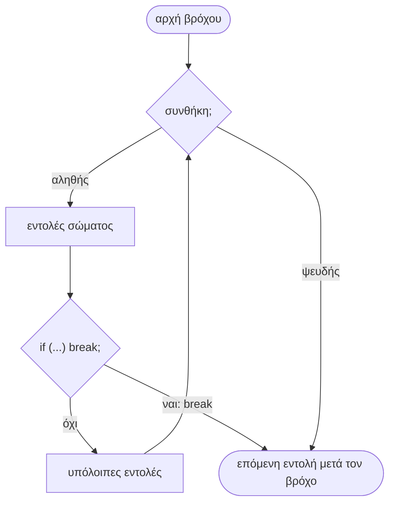
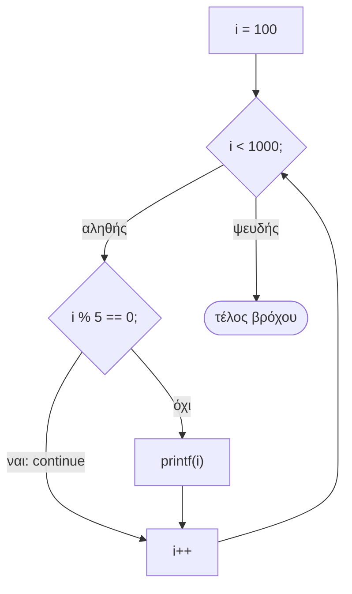
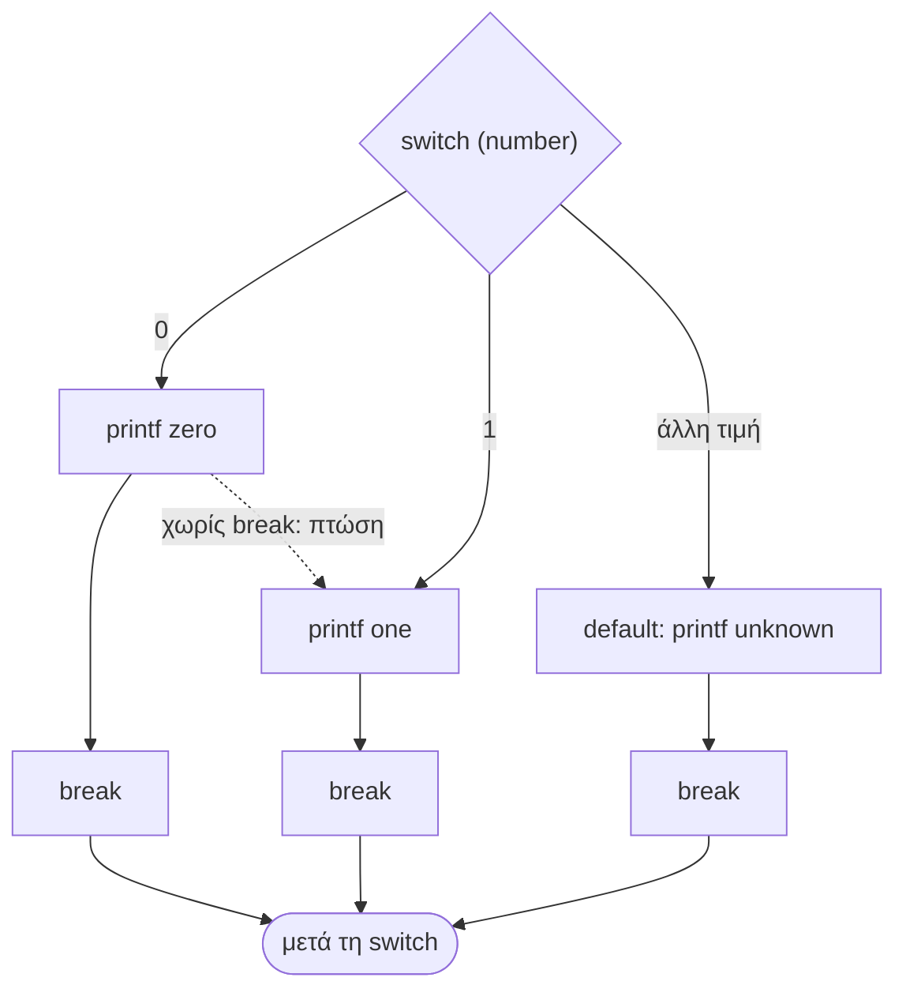

# Κεφάλαιο 8: Ροή Ελέγχου #2

<!--  -->

> **Στόχοι:** μετά από αυτό το κεφάλαιο θα μπορείτε να
> - σχεδιάζετε έναν βρόχο είτε «φιλτράροντας» όλες τις τιμές με `if` είτε
>   διαλέγοντας κατάλληλη αρχή και βήμα·
> - αναγνωρίζετε πότε ένα γινόμενο ή άθροισμα σε βρόχο ξεπερνά τα όρια του `int`·
> - σταματάτε έναν βρόχο νωρίς, με μεταβλητή-σημαία ή με `break`·
> - παραλείπετε μια επανάληψη με `continue`·
> - γράφετε μια `switch` αντί για μια αλυσίδα `else if`, με `case`, `default` και
>   `break`, και ομαδοποιείτε πολλά `case`·
> - εξηγείτε τι κάνει η `goto` και γιατί ο δομημένος προγραμματισμός την αποφεύγει.
>
> **Προαπαιτούμενα:** [Κεφάλαιο 6](../06-control-flow/), [Κεφάλαιο 7](../07-problem-solving/)
>
> **Χρόνος μελέτης:** ~1,5 ώρα

## Σύνοψη

Στο [Κεφάλαιο 6](../06-control-flow/) είδαμε την `if` και τους τρεις βρόχους της C.
Εδώ τους χρησιμοποιούμε σε μικρά προβλήματα με τριψήφιους αριθμούς και βλέπουμε τις
υπόλοιπες δομές ελέγχου της γλώσσας. Η `break` τερματίζει αμέσως έναν βρόχο και η
`continue` προχωρά στην επόμενη επανάληψη· και οι δύο αντικαθιστούν τις
μεταβλητές-σημαίες που θα χρειαζόμασταν αλλιώς. Η `switch` είναι ένας πιο καθαρός
τρόπος να γράψουμε μια αλυσίδα `else if` που συγκρίνει μια ακέραια τιμή με σταθερές.
Τέλος, η `goto` μεταφέρει την εκτέλεση σε μια ετικέτα· υπάρχει στη γλώσσα, αλλά ο
δομημένος προγραμματισμός (και αυτό το μάθημα) μας λέει να μην τη χρησιμοποιούμε.

## Θεωρία

### Υπερχείλιση σε βρόχους που πολλαπλασιάζουν

Η διάλεξη ξεκίνησε με ένα ερώτημα: ένας βρόχος πολλαπλασιάζει στο `prod` όλους τους
τριψήφιους περιττούς που διαιρούνται με το 7 (105, 119, …, 987), και το πρόγραμμα
τυπώνει έναν **αρνητικό** αριθμό, `-1187656959`. Τι συμβαίνει;

Ο βρόχος πολλαπλασιάζει 64 αριθμούς, ο καθένας μεγαλύτερος από 100, άρα το σωστό
αποτέλεσμα ξεπερνά το $10^{128}$. Ένας `int` των 32 bit χωράει μέχρι
$2^{31} - 1 = 2147483647$ (περίπου $2 \cdot 10^9$), όριο που το γινόμενο ξεπερνά ήδη
στον πέμπτο παράγοντα. Αυτό λέγεται **υπερχείλιση (overflow)**. Στην πράξη κρατιούνται
μόνο τα χαμηλά 32 bit, η τιμή «τυλίγεται» και μπορεί να βγει αρνητική· για
προσημασμένους ακεραίους όμως η C τη χαρακτηρίζει **απροσδιόριστη συμπεριφορά
(undefined behavior)**, οπότε δεν βασιζόμαστε σε κανένα αποτέλεσμα. Όταν ένας βρόχος
συσσωρεύει γινόμενο ή μεγάλο άθροισμα, εκτιμήστε πρώτα πόσο μεγάλο θα βγει. Ο
`long long` (64 bit, περίπου έως $9 \cdot 10^{18}$) μεταθέτει το όριο, αλλά εδώ δεν
αρκεί ούτε αυτός. Για τους τύπους και τα όριά τους δείτε το
[Κεφάλαιο 2](../02-memory-variables/).

### Δύο τρόποι να διατρέξουμε τις τιμές

Για το ίδιο πρόβλημα («το γινόμενο όλων των τριψήφιων περιττών που διαιρούνται με
το 7») οι διαφάνειες δίνουν δύο λύσεις, που δείχνουν δύο γενικές στρατηγικές.

1. **Φιλτράρισμα.** Διατρέχουμε ένα ευρύ σύνολο τιμών και κρατάμε με μια `if` μόνο
   όσες ικανοποιούν τη συνθήκη (εδώ `i % 7 == 0`). Είναι απλό και δύσκολα κάνει
   λάθος, αλλά ελέγχει πολλές τιμές που θα απορριφθούν.
2. **Κατάλληλη αρχή και βήμα.** Σκεφτόμαστε πρώτα ποιες ακριβώς τιμές θέλουμε.
   Ο πρώτος τριψήφιος περιττός που διαιρείται με το 7 είναι το $105 = 15 \cdot 7$,
   και κάθε επόμενος απέχει $14 = 2 \cdot 7$ (το 7 κρατά τη διαιρετότητα, το 2 την
   περιττότητα). Άρα `i = 105; i <= 999; i += 14`, χωρίς καμία `if`.

Η δεύτερη λύση κάνει 64 επαναλήψεις αντί για 450, αλλά απαιτεί σκέψη πριν από τον
κώδικα: αν η αρχή ή το βήμα είναι λάθος, ο βρόχος περνά από λάθος τιμές χωρίς
κανένα σημάδι. Π.χ. στην πρώτη λύση των διαφανειών το `i` ξεκινά από το 100 με
βήμα 2, οπότε περνά από τους **άρτιους** τριψήφιους (100, 102, …)· για τους
περιττούς η αρχή πρέπει να είναι 101. Ελέγχετε πάντα με το χέρι τις πρώτες τιμές
που παίρνει η μεταβλητή του βρόχου. Και οι δύο βρόχοι χρησιμοποιούν τον τελεστή
κόμμα στην αρχικοποίηση (`prod = 1, i = 105`) για να αρχικοποιήσουν δύο μεταβλητές.

### Πρόωρος τερματισμός με μεταβλητή-σημαία

Δεύτερο πρόβλημα: *να τυπωθεί (αν υπάρχει) ο **μικρότερος** τριψήφιος που είναι
πολλαπλάσιο του 2 και του 5 αλλά όχι του 4.* Ένας βρόχος από το 100 ως το 999 με
τη συνθήκη `i % 2 == 0 && i % 5 == 0 && i % 4 != 0` βρίσκει τον σωστό αριθμό, αλλά
δεν σταματά εκεί: τυπώνει **όλους** όσους την ικανοποιούν (110, 130, 150, …). Το
ζητούμενο όμως είναι ένας μόνο αριθμός.

Η πρώτη λύση είναι μια **μεταβλητή-σημαία (flag)**: μια ακέραια μεταβλητή `found`
που ξεκινά από 0 και γίνεται 1 όταν βρούμε τον αριθμό. Την προσθέτουμε στη συνθήκη
του βρόχου, `i < 1000 && !found`, οπότε μόλις γίνει 1 ο επόμενος έλεγχος αποτυγχάνει
και ο βρόχος τελειώνει. Η σημαία χρησιμεύει και μετά τον βρόχο: αν έμεινε 0, δεν
υπήρχε τέτοιος αριθμός (το «αν υπάρχει» της εκφώνησης). Το κόστος είναι μια επιπλέον
μεταβλητή και ένας έλεγχος ακόμα (αφού εκτελεστεί πρώτα το `i++`). Η C προσφέρει
έναν πιο άμεσο τρόπο για το ίδιο αποτέλεσμα.

### Η εντολή break

Η **εντολή `break` (break statement)** τερματίζει αμέσως τον βρόχο μέσα στον οποίο
βρίσκεται. Η εκτέλεση συνεχίζει με την πρώτη εντολή **μετά** το σώμα του βρόχου·
ό,τι απομένει στο σώμα, το βήμα της `for` και ο έλεγχος της συνθήκης παραλείπονται.
Η `break` λειτουργεί με τον ίδιο τρόπο στη `while`, στη `do-while` και στη `for`.



*Σχήμα: η `break` βγάζει την εκτέλεση από τον βρόχο αμέσως, χωρίς νέο έλεγχο της συνθήκης.*

Συνήθως η `break` βρίσκεται μέσα σε μια `if`: «αν βρήκαμε αυτό που ψάχνουμε, σταμάτα».
Έτσι ο βρόχος έχει δύο εξόδους: την κανονική (η συνθήκη έγινε ψευδής) και την
πρόωρη. Προσέξτε ότι η `break` βγαίνει μόνο από τον **πιο εσωτερικό** βρόχο (ή
`switch`) που την περιέχει· σε εμφωλευμένους βρόχους ο εξωτερικός συνεχίζει κανονικά.

### Η εντολή continue

Η **εντολή `continue` (continue statement)** διακόπτει την **τρέχουσα επανάληψη** του
βρόχου και προχωρά στην επόμενη. Οι εντολές του σώματος που ακολουθούν την
`continue` παραλείπονται, αλλά ο βρόχος δεν τελειώνει: στη `while` και στη
`do-while` η εκτέλεση πηγαίνει στον έλεγχο της συνθήκης, ενώ στη `for` εκτελείται
πρώτα το βήμα (π.χ. `i++`) και μετά ο έλεγχος. Όπως και η `break`, δουλεύει σε
`while`, `do-while` και `for`.



*Σχήμα: σε μια `for`, η `continue` πηγαίνει στο βήμα `i++` και όχι έξω από τον βρόχο.*

Η `continue` βοηθά να «πετάμε» νωρίς τις περιπτώσεις που δεν μας ενδιαφέρουν· το
ίδιο γίνεται και με μια `if` με την αντίθετη συνθήκη.

### Η εντολή switch

Ένα συχνό μοτίβο είναι μια αλυσίδα `else if` που συγκρίνει την **ίδια** έκφραση με
διαδοχικές σταθερές: «αν `number == 0` τύπωσε `zero`, αλλιώς αν `number == 1` τύπωσε
`one`, …». Η **εντολή `switch` (switch statement)** είναι η εναλλακτική της δομής
`if-else-if` γι' αυτή την περίπτωση: ελέγχει μία έκφραση για τις δυνατές τιμές της
και χειρίζεται κάθε περίπτωση διαφορετικά. Η γενική μορφή:

```text
switch (έκφραση) {
  case σταθερά1:
    εντολές
  case σταθερά2:
    εντολές
  ...
  default:
    εντολές
}
```

Υπολογίζεται μία φορά η τιμή της έκφρασης. Αν είναι ίση με τη σταθερά κάποιου
`case`, η εκτέλεση **μεταπηδά** στις εντολές μετά από αυτό το `case`· αλλιώς
μεταπηδά στο `default`. Το `default` είναι προαιρετικό: αν λείπει και δεν ταιριάζει
κανένα `case`, η εκτέλεση συνεχίζει μετά τη `switch`. Οι εντολές ενός `case` δεν
χρειάζονται αγκύλες.

Το κρίσιμο σημείο είναι ότι τα `case` είναι απλώς **σημεία εισόδου**, όχι χωριστά
blocks. Αφού η εκτέλεση μπει σε ένα `case`, συνεχίζει προς τα κάτω, περνώντας και
στις εντολές των επόμενων `case`, μέχρι να βρει `break` ή το τέλος της `switch`.
Αυτό λέγεται **πτώση (fall-through)**. Γι' αυτό κάθε ομάδα εντολών κλείνει με
`break`: η `break` ολοκληρώνει την εκτέλεση της `switch` και η ροή συνεχίζει μετά
την κλειστή αγκύλη της. Είναι η ίδια `break` με αυτή των βρόχων, με δεύτερη χρήση.



*Σχήμα: η `switch` μεταπηδά στο `case` που ταιριάζει· χωρίς `break` η εκτέλεση «πέφτει» στο επόμενο.*

Το `break` στο τελευταίο `default` δεν αλλάζει τίποτα, αλλά το βάζουμε για
ομοιομορφία και για ασφάλεια αν αργότερα προστεθεί `case` από κάτω.

### Πολλά case μαζί και περιορισμοί της switch

Η πτώση έχει και μια χρήσιμη εφαρμογή: **πολλά `case` μαζί**. Γράφουμε τα `case`
το ένα κάτω από το άλλο, χωρίς εντολές ανάμεσα (`case 12: case 1: case 2:`), και
βάζουμε τις κοινές εντολές και ένα `break` μετά το τελευταίο. Για τιμή 12, 1 ή 2 η
εκτέλεση μπαίνει σε κάποιο από τα τρία σημεία και πέφτει στις κοινές εντολές. Εκτός
από αυτή την περίπτωση, οι σημειώσεις θεωρούν κακή πρακτική να πέφτει ένα `case`
στο επόμενο.

Η `switch` είναι λιγότερο γενική από την αλυσίδα `else if`:

1. Σε κάθε `case` ελέγχεται **μόνο ισότητα** (`==`). Δεν γράφονται άλλες λογικές
   συνθήκες (π.χ. `>`, `<`)· για διαστήματα τιμών χρειαζόμαστε `if`.
2. Η έκφραση της `switch` και η σταθερά κάθε `case` πρέπει να είναι **ακέραιες**
   (ένα `double` δεν επιτρέπεται, ένα `char` όπως `'a'` επιτρέπεται). Οι σημειώσεις
   προσθέτουν ότι στα `case` μπαίνουν σταθερές, όχι μεταβλητές, και ότι δύο `case`
   δεν μπορούν να έχουν την ίδια σταθερά.

### Η εντολή goto και οι ετικέτες

Η **εντολή `goto` (goto statement)** μεταφέρει την εκτέλεση του προγράμματος σε άλλη
εντολή **της ίδιας συνάρτησης**, με την προϋπόθεση ότι η εντολή αυτή έχει μια
**ετικέτα (label)**. Η ετικέτα είναι ένα όνομα ακολουθούμενο από άνω-κάτω τελεία,
μπροστά από μια εντολή:

```text
goto label;
...
label:
```

Μετά την `goto label;` εκτελείται η εντολή μετά το `label:`, πιο πάνω ή πιο κάτω
στη συνάρτηση. Έτσι μπορούμε π.χ. να βγούμε από έναν βρόχο πηδώντας σε μια ετικέτα
αμέσως μετά από αυτόν. Οι σημειώσεις αναφέρουν ως εξειδικευμένη χρήση την έξοδο από
**εμφωλευμένους** βρόχους μονομιάς, που η `break` δεν κάνει. Μια ετικέτα πρέπει να
ακολουθείται από εντολή· στο τέλος ενός block βάζουμε την κενή εντολή `;`.

### Δομημένος προγραμματισμός: γιατί όχι goto

Ο **δομημένος προγραμματισμός (structured programming)** φτιάχνει τα προγράμματα
μόνο από ακολουθία, επιλογή (`if`, `switch`) και επανάληψη (βρόχους). Η `goto`
σπάει αυτή την ιδέα: η εκτέλεση πηδά οπουδήποτε στη συνάρτηση, οπότε για να
καταλάβετε μια γραμμή πρέπει να ξέρετε κάθε `goto` που οδηγεί σε αυτήν. Το
αποτέλεσμα είναι δυσνόητος **κώδικας-μακαρονάδα (spaghetti code)**, χρήσιμος μόνο σε
διαγωνισμούς δυσνόητου κώδικα (obfuscation contests, όπως ο IOCCC). Το επιχείρημα
έγινε γνωστό με το άρθρο του Edsger Dijkstra *Go To Statement Considered Harmful*.

Η απάντηση της διάλεξης στο «να χρησιμοποιήσω `goto`;» είναι σκέτο **ΟΧΙ**: μπορεί
κανείς να γράψει εκατομμύρια γραμμές κώδικα χωρίς να τη χρειαστεί. Στο πλαίσιο
αυτού του μαθήματος, σύμφωνα με τις σημειώσεις, η χρήση της **απαγορεύεται**.
Αναδιοργανώστε τη ροή με `break`, `continue`, μια σημαία ή μια συνάρτηση.

## Παραδείγματα

### Το γινόμενο των τριψήφιων περιττών πολλαπλασίων του 7

Εφαρμόζει: «Δύο τρόποι να διατρέξουμε τις τιμές», «Υπερχείλιση σε βρόχους που
πολλαπλασιάζουν». Οι δύο βρόχοι των διαφανειών, σε ένα πρόγραμμα:

```c
#include <stdio.h>

int main(int argc, char **argv) {
  int product, prod, i;

  // Τρόπος 1: φιλτράρισμα με if
  // (με αρχή 100 και βήμα 2 περνάμε από τους άρτιους· για περιττούς: 101)
  for (product = 1, i = 100; i <= 999; i += 2) {
    if (i % 7 == 0)
      product *= i;
  }

  // Τρόπος 2: αρχή 105 = 15 * 7, βήμα 14 = 2 * 7
  for (prod = 1, i = 105; i <= 999; i += 14) {
    prod *= i;
  }
  printf("%d\n", prod);
  return 0;
}
```

Η έξοδος που έδειξε η διάλεξη:

```text
$ ./prod
-1187656959
```

Ένας αρνητικός αριθμός από γινόμενο θετικών είναι το χαρακτηριστικό σύμπτωμα της
υπερχείλισης: το σωστό αποτέλεσμα έχει πάνω από 128 ψηφία. Δοκιμάστε να τυπώνετε το
`prod` σε κάθε επανάληψη για να δείτε σε ποιο βήμα «σπάει». (Ο τρόπος 1, όπως είναι
γραμμένος, πολλαπλασιάζει άρτιους αριθμούς και υπερχειλίζει κι αυτός.)

### Ο μικρότερος τριψήφιος: σημαία, break και goto

Εφαρμόζει: «Πρόωρος τερματισμός με μεταβλητή-σημαία», «Η εντολή break», «Η εντολή
goto και οι ετικέτες». Το πρόβλημα είναι να τυπωθεί ο μικρότερος τριψήφιος που είναι
πολλαπλάσιο του 2 και του 5 αλλά όχι του 4. Η πρώτη απόπειρα των διαφανειών:

```c
for (i = 100; i < 1000; i++) {
  if (i % 2 == 0 && i % 5 == 0 && i % 4 != 0) {
    printf("%d\n", i);
  }
}
```

«Υπάρχει κάποιο θέμα με αυτή την υλοποίηση;» Ναι: τυπώνει όλους τους 45 τέτοιους
αριθμούς (110, 130, …, 990), όχι μόνο τον μικρότερο. Δύο διορθώσεις, σε ένα
πρόγραμμα:

```c
#include <stdio.h>

int main(int argc, char **argv) {
  int i;

  // 1. Με μεταβλητή-σημαία στη συνθήκη
  int found = 0;
  for (i = 100; i < 1000 && !found; i++) {
    if (i % 2 == 0 && i % 5 == 0 && i % 4 != 0) {
      printf("%d\n", i);
      found = 1;
    }
  }

  // 2. Με break
  for (i = 100; i < 1000; i++) {
    if (i % 2 == 0 && i % 5 == 0 && i % 4 != 0) {
      printf("%d\n", i);
      break;
    }
  }
  return 0;
}
```

```text
$ ./smallest
110
110
```

Η τρίτη εκδοχή των διαφανειών χρησιμοποιεί `goto` σε μια ετικέτα αμέσως μετά τον
βρόχο. Τη δείχνουμε μόνο για να την αναγνωρίζετε· στο μάθημα δεν επιτρέπεται:

```c
for (i = 100; i < 1000; i++) {
  if (i % 2 == 0 && i % 5 == 0 && i % 4 != 0) {
    printf("%d\n", i);
    goto exit_for;
  }
}
exit_for:
  ;
```

Η έκδοση με `break` είναι η πιο σύντομη και λέει καθαρά την πρόθεση. Προσέξτε μια
λεπτή διαφορά: μετά τον βρόχο με σημαία το `i` είναι 111 (έγινε ένα `i++` ακόμα),
ενώ μετά την `break` είναι 110.

### Όλοι οι τριψήφιοι εκτός από τα πολλαπλάσια του 5

Εφαρμόζει: «Η εντολή continue». Όταν το `i` διαιρείται με το 5, η `continue`
παραλείπει το `printf` και η `for` προχωρά στο `i++`:

```c
for (i = 100; i < 1000; i++) {
  if (i % 5 == 0) {
    continue;
  }
  printf("%d\n", i);
}
```

Τυπώνονται 101, 102, 103, 104, 106, … : 720 αριθμοί συνολικά (900 τριψήφιοι μείον
180 πολλαπλάσια του 5). Ισοδύναμα θα γράφαμε `if (i % 5 != 0) printf(...)`.

### Το αγγλικό όνομα κάθε ψηφίου

Εφαρμόζει: «Η εντολή switch». Με αλυσίδα `else if`, όπως στις διαφάνειες:

```c
if (number == 0)
  printf("zero\n");
else if (number == 1)
  printf("one\n");
....
else if (number == 9)
  printf("nine\n");
else
  printf("unknown\n");
```

Όλες οι συνθήκες συγκρίνουν το ίδιο `number` με σταθερές, άρα ταιριάζει η `switch`.
Το πλήρες πρόγραμμα (οι διαφάνειες παραλείπουν τα `case` 2 ως 8):

```c
#include <stdio.h>

int main(int argc, char **argv) {
  for (int number = -1; number <= 10; number++) {
    switch (number) {
      case 0: printf("zero\n"); break;
      case 1: printf("one\n"); break;
      case 2: printf("two\n"); break;
      case 3: printf("three\n"); break;
      case 4: printf("four\n"); break;
      case 5: printf("five\n"); break;
      case 6: printf("six\n"); break;
      case 7: printf("seven\n"); break;
      case 8: printf("eight\n"); break;
      case 9: printf("nine\n"); break;
      default: printf("unknown\n"); break;
    }
  }
  return 0;
}
```

Τυπώνει `unknown`, μετά `zero` ως `nine` και ξανά `unknown` για το 10. Αν σβήσετε το
`break` του `case 8`, για `number == 8` θα τυπωθούν `eight` και `nine`: η εκτέλεση
πέφτει στο επόμενο `case`.

### Η εποχή κάθε μήνα

Εφαρμόζει: «Πολλά case μαζί και περιορισμοί της switch». Οι διαφάνειες δείχνουν
χειμώνα, άνοιξη και καλοκαίρι· εδώ έχει προστεθεί και το φθινόπωρο:

```c
switch (month) {
  case 12: case 1: case 2:
    printf("winter\n");
    break;
  case 3: case 4: case 5:
    printf("spring\n");
    break;
  case 6: case 7: case 8:
    printf("summer\n");
    break;
  case 9: case 10: case 11:
    printf("autumn\n");
    break;
  default:
    printf("unknown month\n");
    break;
}
```

Εδώ η `switch` είναι φυσική επιλογή: ο μήνας είναι ακέραιος και κάθε περίπτωση είναι
ισότητα με σταθερά. Αν όμως θέλατε «χειμώνας αν `month <= 2`», η `switch` δεν
μπορεί να το εκφράσει· θα χρειαζόταν `if`.

### Εφαρμογή στο εργαστήριο

Στο [Εργαστήριο 3](https://progintro.github.io/lab-material/labs/lab03/), η άσκηση
`birthdate.c` βρίσκει την ημέρα της εβδομάδας από το `IDAY % 7` (0 για Saturday, 1
για Sunday, …, 6 για Friday): το ίδιο μοτίβο με το όνομα ψηφίου, άρα καλή ευκαιρία
για `switch`.

## Κύρια σημεία

1. Ένα γινόμενο ή μεγάλο άθροισμα σε βρόχο ξεπερνά εύκολα τα όρια του `int`· ένα
   αρνητικό αποτέλεσμα από θετικούς παράγοντες είναι σύμπτωμα υπερχείλισης.
2. Έναν βρόχο μπορούμε να τον γράψουμε φιλτράροντας τις τιμές με `if` ή διαλέγοντας
   αρχή και βήμα ώστε να περνά μόνο από τις τιμές που θέλουμε· στη δεύτερη
   περίπτωση ελέγχουμε με το χέρι τις πρώτες τιμές.
3. Όταν θέλουμε μόνο το πρώτο αποτέλεσμα, ο βρόχος πρέπει να σταματά μόλις το βρει,
   αλλιώς τυπώνει όλα τα αποτελέσματα.
4. Μια μεταβλητή-σημαία (`found`) στη συνθήκη του βρόχου σταματά τον βρόχο και μας
   λέει μετά αν βρέθηκε κάτι.
5. Η `break` τερματίζει αμέσως τον πιο εσωτερικό βρόχο (`while`, `do-while`, `for`)
   ή `switch` που την περιέχει.
6. Η `continue` διακόπτει την τρέχουσα επανάληψη και συνεχίζει στην επόμενη· στη
   `for` εκτελείται πρώτα το βήμα.
7. Η `switch` είναι εναλλακτική της αλυσίδας `if-else-if` όταν ελέγχουμε μία έκφραση
   για τις δυνατές τιμές της.
8. Τα `case` είναι σημεία εισόδου: χωρίς `break` η εκτέλεση συνεχίζει στο επόμενο
   `case`· το `break` ολοκληρώνει την εκτέλεση της `switch`.
9. Πολλά `case` γραμμένα το ένα κάτω από το άλλο μοιράζονται τις ίδιες εντολές.
10. Σε κάθε `case` ελέγχεται μόνο ισότητα (όχι `>`, `<` κ.λπ.), και η έκφραση της
    `switch` και οι σταθερές των `case` πρέπει να είναι ακέραιες.
11. Η `goto label;` μεταφέρει την εκτέλεση στην εντολή με ετικέτα `label:` μέσα στην
    ίδια συνάρτηση.
12. Δομημένος προγραμματισμός σημαίνει όχι `goto`: οδηγεί σε δυσνόητο κώδικα
    (spaghetti code) και στο μάθημα δεν τη χρησιμοποιούμε.

## Ορολογία

| Ελληνικά | English | Σύντομος ορισμός |
| --- | --- | --- |
| υπερχείλιση | overflow | Αποτέλεσμα που δεν χωράει στον τύπο της μεταβλητής |
| απροσδιόριστη συμπεριφορά | undefined behavior | Περίπτωση όπου η C δεν ορίζει τι θα συμβεί |
| μεταβλητή-σημαία | flag | Μεταβλητή 0/1 που καταγράφει αν συνέβη κάτι |
| εντολή break | break statement | Τερματίζει αμέσως τον βρόχο ή τη `switch` |
| εντολή continue | continue statement | Προχωρά στην επόμενη επανάληψη του βρόχου |
| εντολή switch | switch statement | Επιλογή περίπτωσης με βάση μια ακέραια τιμή |
| περίπτωση | case | Σημείο εισόδου της `switch` για μια σταθερά |
| προεπιλογή | default | Η περίπτωση όταν δεν ταιριάζει κανένα `case` |
| πτώση | fall-through | Συνέχιση στο επόμενο `case` όταν λείπει το `break` |
| εντολή goto | goto statement | Άλμα σε εντολή με ετικέτα στην ίδια συνάρτηση |
| ετικέτα | label | Όνομα με `:` μπροστά από εντολή, στόχος της `goto` |
| δομημένος προγραμματισμός | structured programming | Προγράμματα μόνο από ακολουθία, επιλογή, επανάληψη |
| κώδικας-μακαρονάδα | spaghetti code | Κώδικας με μπερδεμένη ροή, δύσκολος στην ανάγνωση |

## Διάβασμα

- **Διαφάνειες:** [Διάλεξη 8](https://github.com/progintro/progintro.github.io/releases/download/2025/lec08.pdf), σελ. 1–25. Υπερχείλιση στο γινόμενο: σελ. 2· παραδείγματα βρόχων και σημαία: σελ. 5–8· `break`: σελ. 9–10· `continue`: σελ. 11–12· `switch`: σελ. 13–18· `goto` και δομημένος προγραμματισμός: σελ. 19–22.
- **Σημειώσεις:** [Κεφάλαιο 3: Η ροή του ελέγχου](https://progintro.github.io/notes/chapters/03-control-flow/), ενότητες «Εντολή `switch`», «Εντολές `break` και `continue`», «Εντολή `goto` και ετικέτες» (K04, σελ. 50–51 και 56–57). Οι διαφάνειες συνιστούν να έχετε καλύψει τις σημειώσεις του κ. Σταματόπουλου μέχρι και τη σελίδα 71, δηλαδή και το [Κεφάλαιο 4: Συναρτήσεις](https://progintro.github.io/notes/chapters/04-functions/) μέχρι την ενότητα «Μετατροπές μεταξύ δεκαδικών και δυαδικών αριθμών».
- **Εργαστήριο:** [Εργαστήριο 3](https://progintro.github.io/lab-material/labs/lab03/): ασκήσεις `seq.c` (βρόχοι), `birthdate.c` (αντιστοίχιση `IDAY % 7` σε ημέρα, κατάλληλη για `switch`)
- **Άλλα:**
  - [Break and Continue (W3Schools)](https://www.w3schools.com/c/c_break_continue.php)
  - [Switch statement (GeeksforGeeks)](https://www.geeksforgeeks.org/c-switch-statement/)
  - Wikipedia: [Considered harmful](https://en.wikipedia.org/wiki/Considered_harmful), [Spaghetti code](https://en.wikipedia.org/wiki/Spaghetti_code)
  - [IOCCC](https://ioccc.org/): διαγωνισμός δυσνόητου κώδικα C

## Συχνά λάθη

- **Ξεχασμένο `break` σε `case`.** Για `number == 0` τυπώνονται `zero` και `one`
  (και ό,τι ακολουθεί μέχρι το επόμενο `break`). Διόρθωση: κάθε ομάδα εντολών κλείνει
  με `break`, εκτός αν θέλετε σκόπιμα να ομαδοποιήσετε `case`.
- **Συνθήκη ή διάστημα σε `case`.** `case month <= 2:` δεν μεταγλωττίζεται, γιατί
  το `case` θέλει σταθερά. Διόρθωση: απαριθμήστε τις
  τιμές (`case 1: case 2:`) ή γράψτε `if`.
- **`switch` σε `double` ή σε μεταβλητή στο `case`.** Ο gcc απαντά `switch quantity
  not an integer` ή `case label does not reduce to an integer constant`. Διόρθωση:
  ακέραια έκφραση και σταθερές.
- **Βρόχος που «βρίσκει» και δεν σταματά.** Ζητείται ο μικρότερος και τυπώνονται
  όλοι. Διόρθωση: `break` (ή σημαία) μόλις βρεθεί το πρώτο.
- **`break` για έξοδο από δύο βρόχους.** Η `break` βγαίνει μόνο από τον εσωτερικό·
  ο εξωτερικός συνεχίζει. Διόρθωση: σημαία που ελέγχεται και στον εξωτερικό βρόχο, ή
  μεταφορά των βρόχων σε συνάρτηση που κάνει `return`.
- **`continue` σε `while` πριν από το βήμα.** Σε `while (i < N) { if (...) continue;
  i++; }` το `i++` παραλείπεται και ο βρόχος γίνεται ατέρμονας. Διόρθωση: αυξήστε τον
  μετρητή πριν από την `continue`, ή χρησιμοποιήστε `for`.
- **Υπερχείλιση.** Ένα γινόμενο θετικών βγαίνει αρνητικό ή μηδέν. Διόρθωση:
  εκτιμήστε το μέγεθος του αποτελέσματος και επιλέξτε τύπο (`long long`).
- **Λάθος αρχή ή βήμα.** Με `i = 100; i += 2` περνάτε από άρτιους αντί για
  περιττούς. Διόρθωση: γράψτε στο χαρτί τις πρώτες τιμές του μετρητή.

<!-- misconceptions -->

### Τι δυσκόλεψε την τάξη

Από τα Kahoot των διαλέξεων: οι ερωτήσεις όπου μια λάθος απάντηση μάζεψε πολλές ψήφους, με το ποσοστό σωστών απαντήσεων.

- **[while(--i) με i = 0](../../questions/kahoot/kahoot-while-predecrement-overflow.md)** (17% σωστές): Το 43% απάντησε ότι θα τυπώνει @ επ' άπειρον, χάνοντας ότι το `;` είναι η (κενή) εντολή του βρόχου και ότι το `i` κάποτε υπερχειλίζει και φτάνει ξανά στο 0.
- **[for χωρίς συνθήκη με break](../../questions/kahoot/kahoot-for-break-overflow.md)** (36% σωστές): Το 32% απάντησε ότι τελειώνει «μόνο όταν λιώσει η CPU», θεωρώντας ότι το `i` δεν θα γίνει ποτέ 0· όμως μετά τη μέγιστη τιμή του ο ακέραιος υπερχειλίζει σε αρνητικούς και φτάνει ξανά στο 0.
- **[switch και if-else](../../questions/kahoot/kahoot-switch-if-else-equivalence.md)** (46% σωστές): Το 53% απάντησε False, επειδή τα `case` δέχονται μόνο ακέραιες σταθερές· όμως μπορούμε να κάνουμε `switch` στην ίδια τη συνθήκη (`switch (x > 3.5)`), που είναι 0 ή 1.

<!-- /misconceptions -->

## Ερωτήσεις κατανόησης

1. Γιατί ένα γινόμενο θετικών ακεραίων σε βρόχο μπορεί να τυπωθεί αρνητικό;[^q1]
2. Ποιες τιμές παίρνει το `i` στο `for (i = 105; i <= 999; i += 14)` και γιατί το βήμα είναι 14;[^q2]
3. Ποια η διαφορά ανάμεσα σε `break` και `continue`;[^q3]
4. Σε μια `for`, εκτελείται το βήμα (`i++`) μετά από `continue`; Μετά από `break`;[^q4]
5. Τι θα τυπωθεί αν σε μια `switch` λείπουν όλα τα `break` και ταιριάξει το πρώτο `case`;[^q5]
6. Πώς γράφουμε ότι οι μήνες 12, 1 και 2 έχουν την ίδια συμπεριφορά σε μια `switch`;[^q6]
7. Μπορεί μια `switch` να χειριστεί τη συνθήκη `x > 100`; Γιατί;[^q7]
8. Σε ποιο σημείο μπορεί να μεταφέρει την εκτέλεση μια `goto`, και γιατί την αποφεύγουμε;[^q8]
9. Μετά από τον βρόχο με τη σημαία `found`, πώς ξέρουμε αν βρέθηκε αριθμός;[^q9]

<!-- kahoot -->

### Kahoot από το αμφιθέατρο

Ερωτήσεις που παίχτηκαν στις διαλέξεις, με το ποσοστό των φοιτητών που απάντησαν σωστά.

- [goto στο διαγώνισμα](../../questions/kahoot/kahoot-goto-in-exam.md): 97% σωστές απαντήσεις
- [Μόνο με break σταματά ένας βρόχος;](../../questions/kahoot/kahoot-break-only-way.md): 94% σωστές απαντήσεις
- [switch και if-else](../../questions/kahoot/kahoot-switch-if-else-equivalence.md): 46% σωστές απαντήσεις
- [for χωρίς συνθήκη με break](../../questions/kahoot/kahoot-for-break-overflow.md): 36% σωστές απαντήσεις
- [while(--i) με i = 0](../../questions/kahoot/kahoot-while-predecrement-overflow.md): 17% σωστές απαντήσεις

<!-- /kahoot -->

## Ασκήσεις

<!-- exercises -->

### Ζέσταμα: από τις διαφάνειες

- [Το αγγλικό όνομα κάθε ψηφίου](../../questions/slides/slides-lec08-digit-names.md): Διάλεξη 8: Ροή Ελέγχου #2, διαφάνεια 13 · ★☆☆ · programming
- [Υπάρχει θέμα με αυτή την υλοποίηση;](../../questions/slides/slides-lec08-print-all-issue.md): Διάλεξη 8: Ροή Ελέγχου #2, διαφάνεια 7 · ★☆☆ · debug
- [Γινόμενο τριψήφιων περιττών πολλαπλασίων του 7](../../questions/slides/slides-lec08-product-multiples-of-7.md): Διάλεξη 8: Ροή Ελέγχου #2, διαφάνεια 5 · ★☆☆ · programming
- [Αρνητικό γινόμενο σε βρόχο](../../questions/slides/slides-lec08-product-overflow.md): Διάλεξη 8: Ροή Ελέγχου #2, διαφάνεια 2 · ★☆☆ · debug
- [Η εποχή κάθε μήνα](../../questions/slides/slides-lec08-season.md): Διάλεξη 8: Ροή Ελέγχου #2, διαφάνεια 17 · ★☆☆ · programming
- [Ο μικρότερος τριψήφιος πολλαπλάσιο του 2 και του 5 αλλά όχι του 4](../../questions/slides/slides-lec08-smallest-three-digit.md): Διάλεξη 8: Ροή Ελέγχου #2, διαφάνεια 6 · ★☆☆ · programming

### Εργασίες

- [Η Μέθοδος Newton-Raphson](../../questions/homework/hw-2023-hw1-newton.md): Εργασία 1 (2023-24), Άσκηση 1 · ★★☆ · programming

### Σχετικές ασκήσεις από άλλα κεφάλαια

- [Συνεργασία (Prisoner's Dilemma)](../../questions/homework/hw-2023-hw2-coop.md): Εργασία 2 (2023-24), Άσκηση 3 · ★★☆ · programming (κεφ. 9)
- [Ο Αλγόριθμος RSA (rsa)](../../questions/homework/hw-2024-hw1-rsa.md): Εργασία 1 (2024-25), Άσκηση 2 · ★★★ · programming (κεφ. 11)
- [Τουρνουά](../../questions/exams/exam-2023-fall-ex2-q2.md): Online τελική εξέταση Δεκεμβρίου 2023, Εξέταση #2 (Pokémon Themed), Θέμα 2 · ★☆☆ · programming (κεφ. 12)
- [Ορίσματα γραμμής εντολής](../../questions/labs/lab-lab08-argcalc.md): Εργαστήριο 8, Άσκηση 2 · ★☆☆ · programming (κεφ. 12)
- [Σπάσε το PIN](../../questions/exams/exam-2023-fall-ex6-q3.md): Online τελική εξέταση Δεκεμβρίου 2023, Εξέταση #6 (Crypto Themed), Θέμα 3 · ★★☆ · programming (κεφ. 14)
- [Παλινδρομικός αριθμός](../../questions/slides/slides-lec16-palindrome-number.md): Διάλεξη 16, διαφάνεια 21 · ★☆☆ · programming (κεφ. 16)
- [Αντιστροφή ψηφίων αριθμού](../../questions/slides/slides-lec16-reverse-digits.md): Διάλεξη 16, διαφάνεια 13 · ★☆☆ · programming (κεφ. 16)

<!-- /exercises -->

[^q1]: Επειδή το γινόμενο ξεπερνά τη μέγιστη τιμή του `int` (υπερχείλιση)· στην πράξη κρατιούνται μόνο τα χαμηλά 32 bit και το bit του προσήμου μπορεί να γίνει 1. Για προσημασμένους ακεραίους είναι απροσδιόριστη συμπεριφορά.
[^q2]: 105, 119, 133, …, 987 (64 τιμές, η τελευταία το $105 + 63 \cdot 14 = 987$). Το 14 είναι $2 \cdot 7$: κρατά τον αριθμό πολλαπλάσιο του 7 και περιττό.
[^q3]: Η `break` τερματίζει ολόκληρο τον βρόχο· η `continue` τερματίζει μόνο την τρέχουσα επανάληψη και ο βρόχος συνεχίζει με την επόμενη.
[^q4]: Μετά από `continue` ναι (μετά γίνεται ο έλεγχος της συνθήκης)· μετά από `break` όχι, ο βρόχος τελειώνει αμέσως.
[^q5]: Οι εντολές όλων των `case` από εκεί και κάτω, μαζί με του `default`, μέχρι το τέλος της `switch` (fall-through).
[^q6]: `case 12: case 1: case 2:` το ένα κάτω από το άλλο, και μετά τις κοινές εντολές με ένα `break` στο τέλος.
[^q7]: Όχι. Κάθε `case` ελέγχει μόνο ισότητα με μια ακέραια σταθερά· για συγκρίσεις όπως `>` χρειάζεται `if`.
[^q8]: Σε οποιαδήποτε εντολή με ετικέτα μέσα στην ίδια συνάρτηση. Την αποφεύγουμε γιατί κάνει τη ροή δυσνόητη (spaghetti code) και σπάει τον δομημένο προγραμματισμό· στο μάθημα απαγορεύεται.
[^q9]: Από την τιμή της σημαίας: αν `found == 1` βρέθηκε και τυπώθηκε, αν έμεινε 0 δεν υπάρχει τέτοιος αριθμός.

<!--  -->
