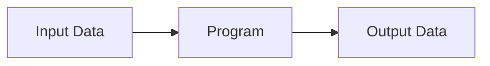
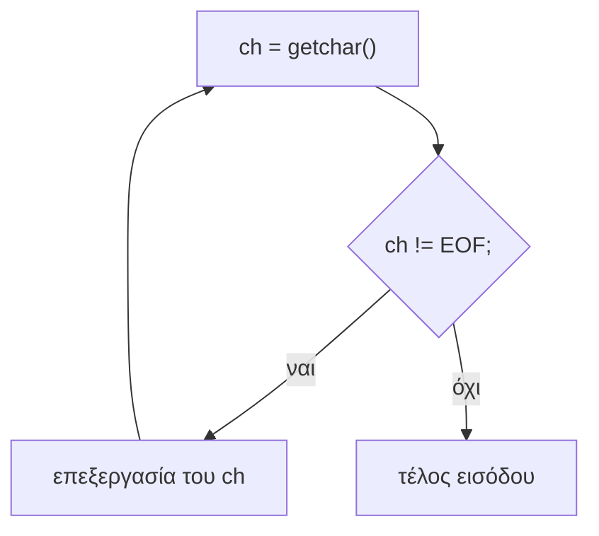
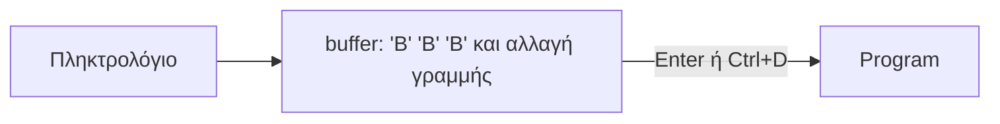

# Κεφάλαιο 9: Δεδομένα Εισόδου

<!--  -->

> **Στόχοι:** μετά από αυτό το κεφάλαιο θα μπορείτε να εξηγείτε γιατί η σύγκριση
> `float` με `==` είναι επικίνδυνη, να ονομάζετε τις τέσσερις πηγές δεδομένων
> εισόδου, να διαβάζετε χαρακτήρες με `getchar` μέχρι το `EOF` και να τους γράφετε
> με `putchar`, να εξηγείτε τον ρόλο του buffer και του Ctrl+D, και να διαβάζετε
> αριθμούς με `scanf` ελέγχοντας την τιμή επιστροφής της.
>
> **Προαπαιτούμενα:** [Κεφάλαιο 2](../02-memory-variables/), [Κεφάλαιο 6](../06-control-flow/), [Κεφάλαιο 8](../08-control-flow-2/)
>
> **Χρόνος μελέτης:** ~2 ώρες

## Σύνοψη

Ένα πρόγραμμα παίρνει δεδομένα εισόδου, τα επεξεργάζεται και παράγει δεδομένα
εξόδου. Η διάλεξη ξεκινά με δύο διευκρινίσεις (γιατί ένα `float` δεν είναι «ίσο» με
το `3.1` και πώς ονομάζουμε συναρτήσεις) και περνάει στις τέσσερις πηγές εισόδου:
ορίσματα γραμμής εντολών, πρότυπη είσοδο (`stdin`), αρχεία και δίκτυο. Εστιάζει στην
πρότυπη είσοδο: στη `getchar`, που διαβάζει έναν χαρακτήρα τη φορά και επιστρέφει
`EOF` στο τέλος, στην αδελφή της `putchar`, και στη `scanf`, τη «συμμετρική» της
`printf` για διάβασμα. Στην πορεία βλέπουμε τρεις κλασικές παγίδες: `char` αντί για
`int` για την τιμή της `getchar`, `scanf` χωρίς `&`, και `scanf` χωρίς έλεγχο της
τιμής επιστροφής. Σχεδόν κάθε εργασία του μαθήματος διαβάζει είσοδο, οπότε αυτά τα
εργαλεία θα τα χρησιμοποιείτε συνέχεια.

## Θεωρία

### Σύγκριση αριθμών κινητής υποδιαστολής με ==

Ο τελεστής `==` ελέγχει αν δύο τιμές είναι **ακριβώς** ίσες. Οι αριθμοί κινητής
υποδιαστολής (floating point) αποθηκεύονται σε δυαδική μορφή, και οι περισσότεροι
δεκαδικοί, όπως το `3.1`, **δεν αναπαρίστανται ακριβώς**: αποθηκεύεται η πλησιέστερη
τιμή που χωράει. Το `float` (συνήθως 4 bytes) κρατά λιγότερα ψηφία από το `double`
(8 bytes), και μια σταθερά όπως το `3.1` είναι `double`. Έτσι, μετά το
`float a = 3.1;` το `a` κρατά περίπου `3.0999999046`, ενώ στο `a == 3.1` η σύγκριση
γίνεται σε `double` με το `3.1000000000…`: οι τιμές διαφέρουν και η συνθήκη είναι
ψευδής (δείτε το [παράδειγμα](#ok-ή-not-ok)).

Κανόνας: **μη συγκρίνετε αριθμούς κινητής υποδιαστολής με `==`**. Ελέγξτε αν η
απόλυτη διαφορά τους είναι μικρότερη από μια μικρή ανοχή, π.χ. `fabs(a - 3.1) < 1e-6`
(η `fabs` είναι στο `math.h`).

### Ονόματα: camelCase και snake_case

Για ονόματα από πολλές λέξεις υπάρχουν δύο συνηθισμένα στυλ: **camelCase**, όπου
κάθε λέξη μετά την πρώτη ξεκινά με κεφαλαίο (`piApprox`), και **snake_case**, με
μικρά γράμματα και κάτω παύλα (`pi_approx`). Για κώδικα C (και Python) η διάλεξη
συνιστά **snake_case**: το `pi_approx` είναι (υποκειμενικά) καλύτερο από το
`piApprox`. Ο μεταγλωττιστής δέχεται και τα δύο· σημασία έχει να τηρείτε ένα στυλ.

### Δεδομένα εισόδου και εξόδου

Κάθε πρόγραμμα παίρνει **δεδομένα εισόδου** (input data), τα επεξεργάζεται και
παράγει **δεδομένα εξόδου** (output data).



*Σχήμα: το πρόγραμμα μετατρέπει δεδομένα εισόδου σε δεδομένα εξόδου.*

Τα δεδομένα εισόδου είναι **μια σειρά από χαρακτήρες (bytes)** που δίνει ο χρήστης
στο πρόγραμμα. Όταν πληκτρολογείτε τον «αριθμό» `42`, το πρόγραμμα λαμβάνει δύο
χαρακτήρες, `'4'` και `'2'`· η μετατροπή τους σε ακέραιο είναι δική του δουλειά.

### Οι τέσσερις πηγές εισόδου

1. **Ορίσματα** στη γραμμή εντολών (command-line arguments), π.χ.
   `./grade 80 100 90`.
2. **Πρότυπη είσοδος** (standard input, `stdin`): κείμενο που γράφουμε, συνήθως με
   το πληκτρολόγιο, ενώ το πρόγραμμα τρέχει. Είναι το θέμα αυτής της διάλεξης.
3. **Αρχεία** από το σύστημα αρχείων, όπως κάνει η `cat hello.txt` (επόμενες
   διαλέξεις).
4. **Δίκτυο** ή άλλες πηγές, π.χ. ένα User Interface (επόμενα εξάμηνα). Η `curl`,
   για παράδειγμα, διαβάζει μια σελίδα από το δίκτυο.

Με τα δύο πρώτα έχουμε καλύψει το «50%». Η πρότυπη είσοδος δεν είναι υποχρεωτικά το
πληκτρολόγιο: με ανακατεύθυνση (`<`) ή σωλήνωση (`|`) το ίδιο πρόγραμμα διαβάζει από
αρχείο ή από την έξοδο άλλου προγράμματος, χωρίς να το «ξέρει».

### Η συνάρτηση getchar

Η **`getchar`**, με μορφή `int getchar();`, ορίζεται στο `stdio.h`. Δεν παίρνει
όρισμα· διαβάζει **έναν** χαρακτήρα από το `stdin`, *εάν υπάρχει*, και τον επιστρέφει
ως ακέραιο (τον κωδικό ASCII του). Αν δεν υπάρχει άλλος, επιστρέφει την ειδική τιμή
**`EOF`** (End-Of-File, `-1`). Ο τύπος επιστροφής είναι `int` και όχι `char` ώστε να
χωράει, εκτός από όλους τους δυνατούς χαρακτήρες, και το `EOF`, που δεν μπερδεύεται
με κανέναν από αυτούς. Για τη συμπεριφορά μιας έτοιμης συνάρτησης της βιβλιοθήκης
ανοίγουμε ένα τερματικό και τρέχουμε `man getchar`.

Κάθε κλήση διαβάζει τον **επόμενο** χαρακτήρα, οπότε το βασικό μοτίβο ανάγνωσης όλης
της εισόδου είναι:

```c
int ch;
while ((ch = getchar()) != EOF) {
  /* επεξεργασία του ch */
}
```

Οι παρενθέσεις γύρω από την ανάθεση είναι απαραίτητες: το `!=` έχει μεγαλύτερη
προτεραιότητα από το `=`, και χωρίς αυτές το `ch` θα έπαιρνε το αποτέλεσμα της
σύγκρισης (0 ή 1).



*Σχήμα: ο βρόχος ανάγνωσης χαρακτήρων μέχρι το EOF.*

### Buffer, Enter και Ctrl+D

Όταν πληκτρολογείτε, οι χαρακτήρες αποθηκεύονται προσωρινά σε έναν **buffer**
(ενδιάμεση μνήμη) και προωθούνται στο πρόγραμμα **όταν πατήσετε Enter**, μαζί με την
αλλαγή γραμμής `'\n'`. Αυτή η λειτουργία του τερματικού, με είσοδο ανά γραμμή,
λέγεται canonical mode. Γι' αυτό η `getchar` «περιμένει» το Enter, και γι' αυτό η
γραμμή `BBB` φτάνει ως τέσσερις χαρακτήρες: `'B'`, `'B'`, `'B'`, `'\n'`.



*Σχήμα: οι χαρακτήρες περιμένουν στον buffer μέχρι το Enter ή το Ctrl+D.*

Για να δηλώσετε ότι **τελείωσαν** τα δεδομένα, στο Linux πατάτε συνήθως **Ctrl+D**.
Το Ctrl+D προωθεί ό,τι υπάρχει στον buffer, χωρίς αλλαγή γραμμής. Αν ο buffer είναι
άδειος (στην αρχή γραμμής), το πρόγραμμα δεν παίρνει τίποτα και η `getchar`
επιστρέφει `EOF`· άρα, αν έχετε γράψει κάτι χωρίς Enter, χρειάζεται δεύτερο Ctrl+D.
Όταν η είσοδος έρχεται από αρχείο (`./prog < file`) ή σωλήνωση, το `EOF` έρχεται
μόνο του στο τέλος των δεδομένων.

### Η συνάρτηση putchar

Η **`putchar`**, με μορφή `int putchar(int c);`, ορίζεται επίσης στο `stdio.h`.
Παίρνει έναν χαρακτήρα, τον τυπώνει στο **`stdout`** και τον επιστρέφει ως ακέραιο·
αν κάτι πάει στραβά στο τύπωμα, επιστρέφει `EOF`. Για να τυπώσετε το `C` γράφετε
`putchar('C');`. Είναι απλούστερο υποσύνολο της `printf`: το `putchar(ch)` κάνει ό,τι
και το `printf("%c", ch)`.

### Η τιμή της getchar πάει σε int, όχι σε char

Ένα `char` κρατά μόνο 256 τιμές, οπότε δεν μπορεί να ξεχωρίσει το `EOF` από κάθε
πραγματικό χαρακτήρα. Στα συνηθισμένα συστήματα, όπου το `char` είναι προσημασμένο,
το byte `0xff` (255) αποθηκεύεται ως `-1`, δηλαδή ίσο με το `EOF`: ένα έγκυρο byte
μοιάζει με τέλος εισόδου και το πρόγραμμα σταματά πρόωρα (δείτε την
[`cat` με `char`](#μια-cat-με-char)). Όπου το `char` είναι απρόσημο, το `EOF` γίνεται
255 και η σύγκριση με `EOF` δεν αληθεύει ποτέ, οπότε ο βρόχος δεν τελειώνει.

Κανόνας της διάλεξης: **η μεταβλητή που δέχεται την τιμή της `getchar` δηλώνεται
`int`**, εκτός αν είμαστε σίγουροι για το τι κάνουμε.

### Διάβασμα αριθμών χαρακτήρα-χαρακτήρα

Με τη `getchar` μπορούμε να διαβάσουμε και αριθμούς, χτίζοντας την τιμή ψηφίο-ψηφίο:
αν `val` είναι η τιμή των ψηφίων ως τώρα, ένα νέο ψηφίο `d` σε βάση `base` δίνει
$val \leftarrow base \cdot val + d$. Η τιμή του ψηφίου είναι `ch - '0'`, επειδή τα
`'0'`…`'9'` έχουν διαδοχικούς κωδικούς ASCII (48…57), και ένας χαρακτήρας είναι
έγκυρο ψηφίο σε βάση έως 10 αν `ch >= '0' && ch <= '0' + base - 1`. Αυτό κάνει η
[`getinteger`](#η-συνάρτηση-getinteger). Υπάρχει όμως και έτοιμος τρόπος: η `scanf`.

### Η συνάρτηση scanf

Η **`scanf`** ορίζεται στο header file `stdio.h` και διαβάζει δεδομένα εισόδου
**πολλών τύπων** από το `stdin`, αποθηκεύοντας τις τιμές τους σε μεταβλητές. Είναι η
**συμμετρική της `printf`**, για διάβασμα αντί για εκτύπωση:

```c
int scanf(const char *restrict format, ...);
int printf(const char *restrict format, ...);
```

Το πρώτο όρισμα είναι μια **συμβολοσειρά μορφοποίησης** (format string) με
προδιαγραφές όπως `%d` (`int`) ή `%f` (`float`)· τα `...` σημαίνουν ότι δέχεται όσα
ορίσματα της περάσουμε, ένα για κάθε προδιαγραφή (θα το δούμε σε άλλο μάθημα).

Η μεγάλη διαφορά: στην `printf` δίνουμε **τιμές**, ενώ στη `scanf` τις
**διευθύνσεις** των μεταβλητών, με τον τελεστή `&`: `scanf("%d", &n)`. Η C περνάει τα
ορίσματα με τιμή· με `scanf("%d", n)` η `scanf` θα έπαιρνε ένα αντίγραφο της τιμής
του `n` και δεν θα μπορούσε να το αλλάξει. Με το `&n` μαθαίνει τη θέση του `n` στη
μνήμη και γράφει εκεί την τιμή που διάβασε. Οι διευθύνσεις είναι το θέμα του
[Κεφαλαίου 11](../11-pointers-recursion/).

### Κενά και πολλές τιμές

Μία κλήση μπορεί να διαβάσει πολλές τιμές: `scanf("%d %d", &n1, &n2)`. Καθώς ψάχνει
για δεκαδικό ψηφίο, η `%d` **προσπερνά κενούς χαρακτήρες και αλλαγές γραμμής** πριν
από τον αριθμό, οπότε η είσοδος `   2   4` δίνει `n1 = 2` και `n2 = 4`, όπως και αν
οι αριθμοί ήταν σε διαφορετικές γραμμές.

### Η τιμή επιστροφής της scanf

Η `scanf` επιστρέφει **πόσα δεδομένα εισόδου διάβασε** και αποθήκευσε. Αν η είσοδος
τελειώσει πριν διαβάσει οτιδήποτε, επιστρέφει **`EOF`**. Για `scanf("%d", &n)`:

| Τιμή επιστροφής | Σημασία | Το `n` |
| --- | --- | --- |
| `1` | διαβάστηκε ακέραιος | έχει τη νέα τιμή |
| `0` | η είσοδος δεν ξεκινά με αριθμό (π.χ. `hello`) | δεν άλλαξε |
| `EOF` | τέλος εισόδου (π.χ. Ctrl+D) | δεν άλλαξε |

Αν δεν ελέγξουμε την τιμή επιστροφής και η ανάγνωση αποτύχει, το πρόγραμμα συνεχίζει
με τα «σκουπίδια» μιας μη αρχικοποιημένης μεταβλητής. Άρα ένα πρόγραμμα που δεν
ελέγχει τι επέστρεψε η `scanf` **δεν είναι σωστό**. Γράφουμε, για παράδειγμα,
`if (scanf("%d", &n) != 1) { printf("Invalid input\n"); return 1; }`.

## Παραδείγματα

### OK ή Not OK;

Εφαρμόζει τη [σύγκριση με `==`](#σύγκριση-αριθμών-κινητής-υποδιαστολής-με-). Τι θα
τυπώσει το παρακάτω πρόγραμμα;

```c
#include <stdio.h>
int main() {
    float a = 3.1;

    if(a == 3.1)
       printf("OK\n");
    else
       printf("Not OK\n");
    return 0;
}
```

```text
$ ./one
Not OK
```

Το `a` κρατά το `3.1` στρογγυλεμένο σε `float`, ενώ το `3.1` της σύγκρισης είναι
`double` με μεγαλύτερη ακρίβεια. Με `a == 3.1f` (σταθερά `float`) θα τυπωνόταν `OK`,
αλλά η ασφαλής λύση είναι η σύγκριση με ανοχή.

### Διαβάζω και τυπώνω έναν χαρακτήρα

Εφαρμόζει τη [`getchar`](#η-συνάρτηση-getchar) και τον έλεγχο για `EOF`.

```c
#include <stdio.h>
int main() {
  printf("Gimme a char: ");
  int ch = getchar();
  if (ch != EOF) {
    printf("You gave the char: %c\n", ch);
  } else {
    printf("input ended\n");
  }
  return 0;
}
```

```text
$ ./chartest
Gimme a char: BBB
You gave the char: B
```

Η `getchar` διαβάζει **μόνο έναν** χαρακτήρα, το πρώτο `B`· τα `BB\n` μένουν
αδιάβαστα. Αν πατήσετε αμέσως Ctrl+D, τυπώνεται `input ended`.

### Μετρητής χαρακτήρων

Διαδοχικές κλήσεις της `getchar` διαβάζουν διαδοχικούς χαρακτήρες. Τι κάνει το
παρακάτω πρόγραμμα;

```c
#include <stdio.h>
int main() {
  int ch, sum = 0;
  printf("Enter characters: ");
  while( (ch = getchar()) != EOF ) {
    printf("%c", ch);
    sum++;
  }
  printf("\nTotal characters: %d\n", sum);
  return 0;
}
```

```text
$ ./charcount
Enter characters: we'll always have paris
we'll always have paris
Total characters: 24
```

Τυπώνει ξανά ό,τι διαβάζει και στο τέλος το πλήθος των χαρακτήρων. Η φράση έχει 23
χαρακτήρες· ο 24ος είναι το `'\n'` του Enter. Η γραμμή επαναλαμβάνεται μόλις πατήσετε
Enter (τότε φτάνει ο buffer στο πρόγραμμα) και το σύνολο τυπώνεται με το Ctrl+D.

### Μια cat με char

Εφαρμόζει τις [`getchar`/`putchar`](#η-συνάρτηση-putchar) και τον κανόνα
[«`int`, όχι `char`»](#η-τιμή-της-getchar-πάει-σε-int-όχι-σε-char). Τι πρόβλημα έχει
η παρακάτω υλοποίηση της `cat`;

```c
#include <stdio.h>

int main() {
  char c;
  while((c = getchar()) != EOF)
    putchar(c);
  return 0;
}
```

```text
$ echo -e "hello\xffworld" | ./cat
hello
$ echo -e "hello\xffworld" | cat
hello�world
```

Το `echo -e` βάζει το byte `0xff` ανάμεσα στις δύο λέξεις. Η πραγματική `cat` το
αντιγράφει (το τερματικό το δείχνει ως `�`). Η δική μας το αποθηκεύει στο `char c`
ως `-1`, το βρίσκει ίσο με `EOF` και σταματά. Η διόρθωση είναι μία λέξη: `int c;`.

### Η συνάρτηση getinteger

Εφαρμόζει το [διάβασμα αριθμών χαρακτήρα-χαρακτήρα](#διάβασμα-αριθμών-χαρακτήρα-χαρακτήρα).
Θέλουμε ένα πρόγραμμα `addnums` που διαβάζει δύο αριθμούς και τους προσθέτει:

```text
$ ./addnums
Give me a number: 40
Give me another number: 2
Total: 42
```

Ένας τρόπος είναι με τη `getchar`, φτιάχνοντας μια συνάρτηση `getinteger` που
διαβάζει τους χαρακτήρες έναν-έναν και τους μετατρέπει σε αριθμό. Τι κάνει;

```c
#define ERROR -1          // Return value for illegal character

int getinteger(int base) {
  int ch;                 // No need to declare ch as int - no EOF handling
  int val = 0;                               // Initialize return value
  while ((ch = getchar()) != '\n')           // Read up to new line
    if (ch >= '0' && ch <= '0' + base - 1)   // Legal character?
      val = base * val + (ch - '0');         // Update return value
    else
      return ERROR;                          // Illegal character read
  return val;   // Everything OK - Return value of number read
}
```

Διαβάζει μέχρι την αλλαγή γραμμής· για κάθε έγκυρο ψηφίο της βάσης ενημερώνει το
`val`, και με τον πρώτο μη έγκυρο χαρακτήρα επιστρέφει `ERROR` (`-1`). Με είσοδο `42`
σε βάση 10 το `val` γίνεται 4 και μετά 10 · 4 + 2 = 42· με `getinteger(2)` και
είσοδο `101` γίνεται 1, 2, 5. Το `addnums` προκύπτει καλώντας τη δύο φορές. Ο άλλος
τρόπος για το ίδιο αποτέλεσμα είναι η `scanf`. Στις σημειώσεις η ίδια συνάρτηση
μετατρέπει δυαδικούς σε δεκαδικούς και αντίστροφα.

### Τετράγωνο με scanf

Εφαρμόζει τη [`scanf`](#η-συνάρτηση-scanf). Τι κάνει το παρακάτω πρόγραμμα;

```c
#include <stdio.h>
int main() {
  int n;
  printf("Gimme a number: ");
  scanf("%d", &n);
  printf("Square: %d\n", n * n);
  return 0;
}
```

Περνάμε τη **διεύθυνση** της `n` (`&n`), ώστε η `scanf` να μπορέσει να αναθέσει την
τιμή που διάβασε, και τυπώνουμε στο `stdout` το τετράγωνο του αριθμού που γράψαμε
στο `stdin`. Τι θα γινόταν αν γράφαμε `scanf("%d", n);`;

```text
$ ./scanf
Gimme a number: 3
Segmentation fault
```

Η `scanf` θα χρησιμοποιούσε την (μη αρχικοποιημένη) τιμή του `n` σαν διεύθυνση, και
η εγγραφή σε μια τυχαία διεύθυνση που δεν ανήκει στο πρόγραμμα προκαλεί
`Segmentation fault`. Ο `gcc -Wall` προειδοποιεί για αυτό το λάθος.

### Είναι σωστό αυτό το πρόγραμμα;

Εφαρμόζει την [τιμή επιστροφής της `scanf`](#η-τιμή-επιστροφής-της-scanf). Το
τετράγωνο της προηγούμενης ενότητας **δεν** είναι σωστό, καθώς δεν ελέγχουμε την
τιμή επιστροφής της `scanf` (`EOF` ή ίσως `0`):

```text
$ ./scanf
Gimme a number: 16
Square: 256
$ ./scanf
Gimme a number: Square:
1068701481
$ ./scanf
Gimme a number: hello
Square: 1072038564
```

Στη δεύτερη εκτέλεση πατήσαμε Ctrl+D (η `scanf` επέστρεψε `EOF`), στην τρίτη γράψαμε
`hello` (επέστρεψε `0`). Και στις δύο το `n` έμεινε με την τυχαία αρχική του τιμή και
τυπώθηκε ένα «τετράγωνο» χωρίς νόημα.

### Δύο αριθμοί με μία scanf

Εφαρμόζει τα [κενά και τις πολλές τιμές](#κενά-και-πολλές-τιμές).

```c
#include <stdio.h>
int main() {
  int n1, n2;
  printf("Gimme two numbers: ");
  scanf("%d %d", &n1, &n2);
  printf("Result: %d\n", n1 * n2);
  return 0;
}
```

```text
$ ./scanf2
Gimme two numbers:   2   4
Result: 8
```

Τα επιπλέον κενά δεν ενοχλούν, αφού η `%d` τα προσπερνά ψάχνοντας για ψηφίο. Ένα
σωστό πρόγραμμα θα έλεγχε και εδώ ότι η `scanf` επέστρεψε `2`.

### Συχνότητες γραμμάτων

Εφαρμόζει τον [βρόχο ανάγνωσης μέχρι το `EOF`](#η-συνάρτηση-getchar) και
«προλαβαίνει» τους πίνακες του [Κεφαλαίου 10](../10-arrays/). Τι κάνει ο κώδικας;

```c
int i, ch, total = 0;
int letfr[26];  // Letter occurrences and frequencies array
for (i=0 ; i < 26 ; i++)
  letfr[i] = 0;
while ((ch = getchar()) != EOF) {
  if (ch >= 'A' && ch <= 'Z') {
    letfr[ch-'A']++;            // Found upper case letter
    total++;
  }
  if (ch >= 'a' && ch <= 'z') {
    letfr[ch-'a']++;            // Found lower case letter
    total++;
  }
}
```

Μετρά πόσες φορές εμφανίζεται κάθε λατινικό γράμμα στην είσοδο, χωρίς διάκριση
πεζών-κεφαλαίων. Ο πίνακας `letfr` έχει 26 μετρητές, αρχικά 0, και το `ch - 'A'` (ή
`ch - 'a'`) δίνει τη θέση του γράμματος στο αλφάβητο (0 για `A`/`a`, 25 για `Z`/`z`).
Το `total` μετρά όλα τα γράμματα, για να υπολογιστούν αργότερα συχνότητες. Το πλήρες
πρόγραμμα, που τυπώνει και ιστόγραμμα, είναι στις σημειώσεις.

### Για το εργαστήριο και τις εργασίες

- Στο [Εργαστήριο 4](https://progintro.github.io/lab-material/labs/lab04/) γράφετε
  φίλτρα με `getchar`/`putchar` (`lowercase.c`, `encode.c`, `decode.c`) και τα
  δοκιμάζετε με σωληνώσεις, π.χ. `echo hello world | ./encode | ./decode`.
- Όταν μια εκφώνηση ορίζει τι γίνεται στο τέλος της εισόδου ή σε λάθος είσοδο,
  ξεχωρίστε τις τρεις περιπτώσεις της `scanf`: `1`, `0` και `EOF`. Το πρόγραμμα
  `trolley` της διάλεξης, π.χ., τερματίζει όταν δεν μπορεί να διαβάσει άλλο κόστος.

## Κύρια σημεία

1. Οι αριθμοί κινητής υποδιαστολής δεν αναπαρίστανται ακριβώς και ένα `float` δεν
   είναι ίσο με την ίδια σταθερά σε `double`· δεν τους συγκρίνουμε με `==`.
2. Για ονόματα σε κώδικα C η διάλεξη συνιστά snake_case (`pi_approx`) αντί για
   camelCase (`piApprox`).
3. Τα δεδομένα εισόδου είναι μια σειρά από χαρακτήρες (bytes) που δίνει ο χρήστης
   στο πρόγραμμα, από τέσσερις πηγές: ορίσματα, πρότυπη είσοδο, αρχεία και δίκτυο.
4. Η `getchar` διαβάζει έναν χαρακτήρα από το `stdin` και τον επιστρέφει ως `int`,
   ή `EOF` (`-1`) αν δεν υπάρχει άλλος.
5. Η `putchar` τυπώνει έναν χαρακτήρα στο `stdout` και είναι απλούστερο υποσύνολο
   της `printf`.
6. Η είσοδος από το πληκτρολόγιο περνά από buffer και φτάνει στο πρόγραμμα με το
   Enter (μαζί με το `'\n'`)· το Ctrl+D δηλώνει στο Linux το τέλος της εισόδου.
7. Η τιμή επιστροφής της `getchar` αποθηκεύεται σε `int`, όχι σε `char`, αλλιώς το
   byte `0xff` μπερδεύεται με το `EOF`.
8. Για να μάθετε πώς συμπεριφέρεται μια συνάρτηση της βιβλιοθήκης, τρέξτε
   `man getchar`, `man scanf` κ.λπ.
9. Η `scanf` είναι η συμμετρική της `printf` για διάβασμα και παίρνει τις διευθύνσεις
   των μεταβλητών (`&n`)· χωρίς `&` το πρόγραμμα καταρρέει.
10. Η `scanf` επιστρέφει πόσα δεδομένα διάβασε ή `EOF`· ένα πρόγραμμα που δεν ελέγχει
    την τιμή επιστροφής της δεν είναι σωστό.
11. Η `%d` της `scanf` προσπερνά κενά και αλλαγές γραμμής πριν από τον αριθμό.

## Ορολογία

| Ελληνικά | English | Σύντομος ορισμός |
| --- | --- | --- |
| δεδομένα εισόδου / εξόδου | input / output data | Ό,τι δίνεται στο πρόγραμμα / ό,τι παράγει. |
| πρότυπη είσοδος | standard input (`stdin`) | Η προεπιλεγμένη είσοδος, συνήθως το πληκτρολόγιο. |
| πρότυπη έξοδος | standard output (`stdout`) | Η προεπιλεγμένη έξοδος, συνήθως η οθόνη. |
| τέλος αρχείου | End-Of-File (`EOF`) | Τιμή (`-1`) που δηλώνει ότι δεν υπάρχει άλλη είσοδος. |
| ενδιάμεση μνήμη | buffer | Όπου περιμένουν οι χαρακτήρες πριν φτάσουν στο πρόγραμμα. |
| κανονική λειτουργία | canonical mode | Το τερματικό στέλνει την είσοδο ανά γραμμή. |
| συμβολοσειρά μορφοποίησης | format string | Το πρώτο όρισμα της `printf`/`scanf`, π.χ. `"%d %d"`. |
| διεύθυνση | address | Η θέση μιας μεταβλητής στη μνήμη, `&n`. |
| τιμή επιστροφής | return value | Η τιμή που δίνει πίσω μια συνάρτηση. |
| κινητή υποδιαστολή | floating point | Αναπαράσταση πραγματικών (`float`, `double`), κατά προσέγγιση. |
| camelCase / snake_case | camelCase / snake_case | Στυλ ονομάτων: `piApprox` / `pi_approx`. |

## Συχνά λάθη

- **`==` με αριθμούς κινητής υποδιαστολής.** Το `float a = 3.1; if (a == 3.1)`
  τυπώνει `Not OK`. Συγκρίνετε με ανοχή: `fabs(a - 3.1) < 1e-6`.
- **`char` για την τιμή της `getchar`.** Με `char c` η `cat` σταματά στο byte `0xff`
  (τυπώνει μόνο `hello`) ή δεν τελειώνει ποτέ. Δηλώστε `int c`.
- **Ανάθεση χωρίς παρενθέσεις.** Το `while (ch = getchar() != EOF)` βάζει στο `ch` 1
  ή 0, όχι τον χαρακτήρα. Γράψτε `while ((ch = getchar()) != EOF)`.
- **Ξεχνάτε το `'\n'`.** Ο μετρητής χαρακτήρων βγάζει 24 για φράση 23 χαρακτήρων: το
  Enter είναι κι αυτό χαρακτήρας.
- **«Κόλλησε» το πρόγραμμα.** Περιμένει είσοδο. Γράψτε κάτι και Enter, ή Ctrl+D για
  τέλος εισόδου (δύο φορές, αν έχετε ήδη γράψει κάτι στη γραμμή).
- **`scanf` χωρίς `&`.** Το `scanf("%d", n)` δίνει `Segmentation fault`. Γράψτε
  `scanf("%d", &n)` και μεταγλωττίζετε με `-Wall` για να το πιάνει ο `gcc`.
- **Δεν ελέγχετε την τιμή επιστροφής της `scanf`.** Με είσοδο `hello` ή Ctrl+D
  τυπώνεται κάτι σαν `Square: 1072038564`. Ελέγξτε `if (scanf(...) != 1)`.
- **Μπερδεύετε το `0` με το `EOF`.** Ο έλεγχος `scanf(...) == EOF` μόνος του δεν πιάνει
  την είσοδο `hello`, για την οποία η `scanf` επιστρέφει `0`.

## Διάβασμα

- **Διαφάνειες:** [Διάλεξη 9](https://github.com/progintro/progintro.github.io/releases/download/2025/lec09.pdf), σελ. 1–41. Σύγκριση `float` και ονόματα: σελ. 2–5· πηγές εισόδου: σελ. 8–13· `getchar`: σελ. 14–21· `putchar` και `cat`: σελ. 22–24· `getinteger`: σελ. 25–26, 38· `scanf`: σελ. 27–37· συχνότητες γραμμάτων: σελ. 39.
- **Σημειώσεις:** οι διαφάνειες παραπέμπουν στις σελίδες 28–29, 70–71, 78–79 και 86–87 των σημειώσεων του κ. Σταματόπουλου, δηλαδή στις ενότητες:
  - [Κεφάλαιο 1: Πρώτα προγράμματα σε C](https://progintro.github.io/notes/chapters/01-first-programs/), «Μετατροπή πεζών γραμμάτων σε κεφαλαία» (K04, σελ. 28–29)
  - [Κεφάλαιο 4: Συναρτήσεις, εμβέλεια και αναδρομή](https://progintro.github.io/notes/chapters/04-functions/), «Μετατροπές μεταξύ δεκαδικών και δυαδικών αριθμών» (K04, σελ. 70–71)
  - [Κεφάλαιο 5: Δείκτες και πίνακες](https://progintro.github.io/notes/chapters/05-pointers-arrays/), «Περί ανάγνωσης ακεραίων (και όχι μόνο)» (K04, σελ. 78–79) και «Ιστόγραμμα συχνοτήτων γραμμάτων στην είσοδο» (K04, σελ. 86–87)
  - Για αναφορά: [Κεφάλαιο 9: Είσοδος και έξοδος](https://progintro.github.io/notes/chapters/09-io/), «Είσοδος και έξοδος» (K04, σελ. 136–149), με τις `getchar`, `putchar`, `printf`, `scanf` και την ανακατεύθυνση.
- **Εργαστήριο:** [Εργαστήριο 4](https://progintro.github.io/lab-material/labs/lab04/): ασκήσεις `pyramid.c` (`putchar` και `scanf`), `lowercase.c` (βρόχος `getchar`/`putchar`), `encode.c` και `decode.c` (φίλτρα με ανακατεύθυνση και σωληνώσεις)
- **Άλλα:**
  - Αναφορά συναρτήσεων: [getchar](https://en.cppreference.com/w/c/io/getchar), [putchar](https://en.cppreference.com/w/c/io/putchar), [scanf](https://cplusplus.com/reference/cstdio/scanf/), [printf](https://cplusplus.com/reference/cstdio/printf/), και οι σελίδες `man getchar`, `man scanf`
  - Wikipedia: [Data buffer](https://en.wikipedia.org/wiki/Data_buffer), [End-of-Transmission character](https://en.wikipedia.org/wiki/End-of-Transmission_character), [Camel case](https://en.wikipedia.org/wiki/Camel_case), [Snake case](https://en.wikipedia.org/wiki/Snake_case)
  - POSIX: [Canonical mode input processing](https://pubs.opengroup.org/onlinepubs/7908799/xbd/termios.html#tag_008_001_006)

## Ασκήσεις

<!-- exercises -->

### Από τις διαφάνειες

- [Μετρητής χαρακτήρων με getchar](../../questions/slides/slides-lec09-charcount.md): Διάλεξη 9: Δεδομένα Εισόδου, διαφάνεια 20 · ★☆☆ · trace
- [Τι κάνει το πρόγραμμα με τη scanf;](../../questions/slides/slides-lec09-scanf-square.md): Διάλεξη 9: Δεδομένα Εισόδου, διαφάνεια 30 · ★☆☆ · trace
- [scanf με πολλά ορίσματα](../../questions/slides/slides-lec09-scanf-two.md): Διάλεξη 9: Δεδομένα Εισόδου, διαφάνεια 36–37 · ★☆☆ · trace
- [Άθροισμα δύο αριθμών από την πρότυπη είσοδο](../../questions/slides/slides-lec09-addnums.md): Διάλεξη 9: Δεδομένα Εισόδου, διαφάνεια 25–26 · ★★☆ · programming
- [Μια cat με char](../../questions/slides/slides-lec09-cat-char.md): Διάλεξη 9: Δεδομένα Εισόδου, διαφάνεια 23 · ★★☆ · debug
- [OK ή Not OK;](../../questions/slides/slides-lec09-float-equality.md): Διάλεξη 9: Δεδομένα Εισόδου, διαφάνεια 3 · ★★☆ · trace
- [Η συνάρτηση getinteger](../../questions/slides/slides-lec09-getinteger.md): Διάλεξη 9: Δεδομένα Εισόδου, διαφάνεια 26, 38 · ★★☆ · trace
- [Μέτρηση γραμμάτων στην είσοδο](../../questions/slides/slides-lec09-letter-frequencies.md): Διάλεξη 9: Δεδομένα Εισόδου, διαφάνεια 39 · ★★☆ · trace
- [scanf χωρίς &](../../questions/slides/slides-lec09-scanf-no-ampersand.md): Διάλεξη 9: Δεδομένα Εισόδου, διαφάνεια 32 · ★★☆ · short-answer
- [Είναι σωστό αυτό το πρόγραμμα;](../../questions/slides/slides-lec09-scanf-return.md): Διάλεξη 9: Δεδομένα Εισόδου, διαφάνεια 33–35 · ★★☆ · debug

### Από τα εργαστήρια

- [Ένα απλό κομπιουτεράκι](../../questions/labs/lab-lab02-calc.md): Εργαστήριο 2, Άσκηση 1 · ★☆☆ · programming
- [Διάβασμα ακεραίου με scanf](../../questions/labs/lab-lab02-readint.md): Εργαστήριο 2, Βήμα 3 · ★☆☆ · short-answer
- [Τροποποίηση κειμένου](../../questions/labs/lab-lab04-lowercase.md): Εργαστήριο 4, Άσκηση 3 · ★☆☆ · programming
- [Κωδικοποίηση και αποκωδικοποίηση κειμένου](../../questions/labs/lab-lab04-encode-decode.md): Εργαστήριο 4, Άσκηση 4 · ★★☆ · programming

### Από τις εργασίες

- [Συνεργασία (Prisoner's Dilemma)](../../questions/homework/hw-2023-hw2-coop.md): Εργασία 2 (2023-24), Άσκηση 3 · ★★☆ · programming
- [Το Πρόβλημα του Τρόλεϊ (trolley)](../../questions/homework/hw-2024-hw0-trolley.md): Εργασία 0 (2024-25), Άσκηση 3 · ★★☆ · programming
- [Επεξεργασία Ήχου (soundwave)](../../questions/homework/hw-2025-hw1-soundwave.md): Εργασία 1 (2025-26), Άσκηση 1 · ★★★ · programming

### Από τα θέματα εξετάσεων

- [Ραβασάκι](../../questions/exams/exam-2023-fall-ex0-q1.md): Online τελική εξέταση Δεκεμβρίου 2023, Εξέταση #0 (Valentine's Themed), Θέμα 1 · ★☆☆ · programming
- [Δεκαεξαδικοί](../../questions/exams/exam-2023-fall-ex1-q1.md): Online τελική εξέταση Δεκεμβρίου 2023, Εξέταση #1 (Coreutils Themed), Θέμα 1 · ★☆☆ · programming
- [Γραμμή και Γράμμα](../../questions/exams/exam-2023-fall-ex12-q1.md): Online τελική εξέταση Δεκεμβρίου 2023, Εξέταση #12, Θέμα 1 · ★☆☆ · programming
- [Ορεκτικό](../../questions/exams/exam-2023-fall-ex14-q1.md): Online τελική εξέταση Δεκεμβρίου 2023, Εξέταση #14, Θέμα 1 · ★☆☆ · programming
- [Πλαγιαστά Γράμματα](../../questions/exams/exam-2023-fall-ex15-q1.md): Online τελική εξέταση Δεκεμβρίου 2023, Εξέταση #15, Θέμα 1 · ★☆☆ · programming
- [Μήνυμα από τον Καίσαρα](../../questions/exams/exam-2023-fall-ex6-q2.md): Online τελική εξέταση Δεκεμβρίου 2023, Εξέταση #6 (Crypto Themed), Θέμα 2 · ★☆☆ · programming
- [Ανάβεις Φωτιές](../../questions/exams/exam-2023-fall-ex7-q1.md): Online τελική εξέταση Δεκεμβρίου 2023, Εξέταση #7 (Star Wars Themed), Θέμα 1 · ★☆☆ · programming
- [ASCII Encoding](../../questions/exams/exam-2024-jul-q1.md): Εξέταση Ιουλίου 2024, Θέμα 1 · ★☆☆ · programming
- [Αφαίρεση Μη Λατινικών Χαρακτήρων](../../questions/exams/exam-2023-fall-ex10-q1.md): Online τελική εξέταση Δεκεμβρίου 2023, Εξέταση #10, Θέμα 1 · ★★☆ · programming
- [Αναζητώντας τον Blinky](../../questions/exams/exam-2023-fall-ex11-q1.md): Online τελική εξέταση Δεκεμβρίου 2023, Εξέταση #11, Θέμα 1 · ★★☆ · programming
- [Pikaκίστικα](../../questions/exams/exam-2023-fall-ex2-q1.md): Online τελική εξέταση Δεκεμβρίου 2023, Εξέταση #2 (Pokémon Themed), Θέμα 1 · ★★☆ · programming
- [Προσθήκη Νιφάδων](../../questions/exams/exam-2023-fall-ex3-q1.md): Online τελική εξέταση Δεκεμβρίου 2023, Εξέταση #3 (Frozen Themed), Θέμα 1 · ★★☆ · programming
- [Αποκωδικοποίηση](../../questions/exams/exam-2023-fall-ex8-q2.md): Online τελική εξέταση Δεκεμβρίου 2023, Εξέταση #8, Θέμα 2 · ★★☆ · programming
- [Μετρητής λέξεων](../../questions/exams/exam-2024-sep-q4.md): Εξέταση Σεπτεμβρίου 2024, Θέμα 4 · ★★☆ · programming

### Σχετικές ασκήσεις από άλλα κεφάλαια

- [Πυθαγόρειο θεώρημα](../../questions/labs/lab-lab02-pyth.md): Εργαστήριο 2, Άσκηση 2 · ★☆☆ · programming (κεφ. 3)
- [Οι Ακολουθίες Aliquot](../../questions/homework/hw-2025-hw0-aliquot.md): Εργασία 0 (2025-26), Άσκηση 3 · ★★☆ · programming (κεφ. 6)
- [Κατασκευή πυραμίδας](../../questions/labs/lab-lab04-pyramid.md): Εργαστήριο 4, Άσκηση 2 · ★☆☆ · programming (κεφ. 6)
- [Αναποδογύρισμα](../../questions/exams/exam-2023-fall-ex5-q1.md): Online τελική εξέταση Δεκεμβρίου 2023, Εξέταση #5 (HP Themed), Θέμα 1 · ★☆☆ · programming (κεφ. 10)
- [Πρόσθεση δύο αριθμών από την είσοδο](../../questions/slides/slides-lec10-addnums.md): Διάλεξη 10, διαφάνεια 5 · ★☆☆ · programming (κεφ. 10)
- [Τι κάνει η getinteger;](../../questions/slides/slides-lec10-getinteger.md): Διάλεξη 10, διαφάνεια 17 · ★★☆ · trace (κεφ. 10)
- [Αλλαγή Τέρματος](../../questions/exams/exam-2023-fall-ex13-q2.md): Online τελική εξέταση Δεκεμβρίου 2023, Εξέταση #13, Θέμα 2 · ★☆☆ · programming (κεφ. 12)
- [Το μεγαλύτερο άλμα - polevault](../../questions/exams/exam-2026-sep-q3.md): Εξέταση Σεπτεμβρίου 2026, Θέμα 3 · ★★☆ · programming (κεφ. 12)
- [Κάδρο](../../questions/exams/exam-2023-fall-ex9-q4.md): Online τελική εξέταση Δεκεμβρίου 2023, Εξέταση #9, Θέμα 4 · ★★★ · programming (κεφ. 13)
- [Τα Πάνω Κάτω](../../questions/exams/exam-2023-fall-ex4-q2.md): Online τελική εξέταση Δεκεμβρίου 2023, Εξέταση #4 (Rick Astley Themed), Θέμα 2 · ★★☆ · programming (κεφ. 14)
- [Τι κάνει το πρόγραμμα με την getchar](../../questions/slides/slides-lec15-getchar-count.md): Διάλεξη 15, διαφάνεια 17 · ★☆☆ · trace (κεφ. 15)
- [Υποτείνουσα με scanf](../../questions/slides/slides-lec18-hypotenuse.md): Διάλεξη 18, διαφάνειες 29–30 · ★☆☆ · trace (κεφ. 18)
- [Επενδύσεις στο Χρηματιστήριο](../../questions/exams/exam-2026-jun-q3.md): Εξέταση Ιουνίου 2026, Θέμα 3 · ★★☆ · programming (κεφ. 25)

<!-- /exercises -->

## Ερωτήσεις αυτοαξιολόγησης

1. Γιατί η `getchar` επιστρέφει `int` και όχι `char`;[^q1]
2. Ποιες είναι οι τέσσερις πηγές δεδομένων εισόδου ενός προγράμματος;[^q2]
3. Γράφετε `abc` και Enter. Ποιους χαρακτήρες διαβάζει η `getchar` από τη γραμμή;[^q3]
4. Γιατί η `getchar` δεν επιστρέφει αμέσως μόλις πατήσετε ένα πλήκτρο;[^q4]
5. Γιατί γράφουμε `&n` στη `scanf` αλλά `n` στην `printf`;[^q5]
6. Τι επιστρέφει το `scanf("%d %d", &a, &b)` με είσοδο `7 x`;[^q6]
7. Τι επιστρέφει η `getinteger(10)` με είσοδο `4a2` και Enter;[^q7]

[^q1]: Για να χωράει, εκτός από όλους τους δυνατούς χαρακτήρες, και την τιμή `EOF` (`-1`), που δεν πρέπει να συμπίπτει με κανέναν χαρακτήρα.
[^q2]: Ορίσματα στη γραμμή εντολών, πρότυπη είσοδος (`stdin`), αρχεία, και δίκτυο ή άλλες πηγές.
[^q3]: Τέσσερις: `'a'`, `'b'`, `'c'` και `'\n'`.
[^q4]: Οι χαρακτήρες μένουν στον buffer του τερματικού και προωθούνται στο πρόγραμμα όταν πατήσετε Enter (ή Ctrl+D).
[^q5]: Η `scanf` πρέπει να αλλάξει τη μεταβλητή, άρα χρειάζεται τη διεύθυνσή της· η `printf` μόνο διαβάζει την τιμή της.
[^q6]: `1`: διαβάστηκε το `a = 7`, ενώ το `x` δεν είναι αριθμός, οπότε το `b` δεν άλλαξε.
[^q7]: `ERROR`, δηλαδή `-1`, γιατί το `'a'` δεν είναι έγκυρο ψηφίο στη βάση 10.

<!--  -->
