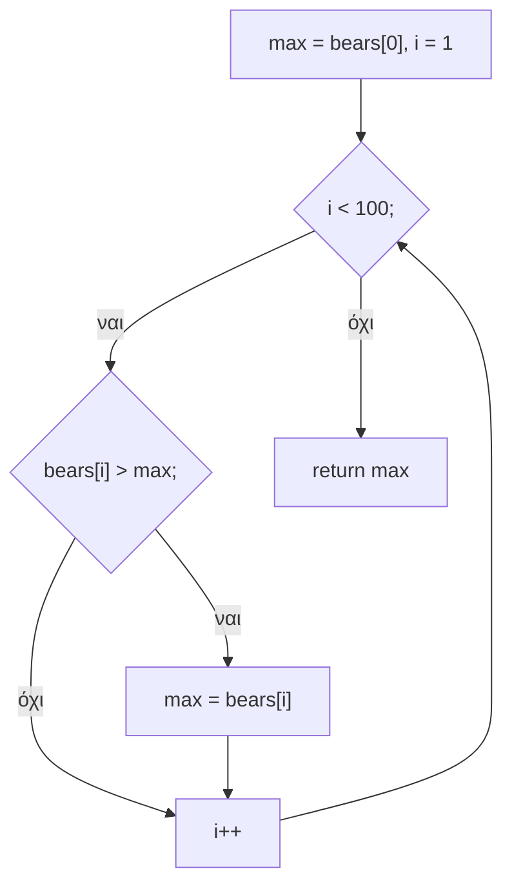

# Κεφάλαιο 10: Πίνακες

<!--  -->

> **Στόχοι:** μετά από αυτό το κεφάλαιο θα μπορείτε να διαβάζετε αριθμούς από την
> είσοδο με την `scanf` και να ελέγχετε την τιμή που επιστρέφει· να δηλώνετε, να
> αρχικοποιείτε και να χρησιμοποιείτε μονοδιάστατους πίνακες· να υπολογίζετε πόση
> μνήμη πιάνει ένας πίνακας και σε ποια διεύθυνση βρίσκεται κάθε στοιχείο του· να
> γράφετε συναρτήσεις που παίρνουν πίνακα (μέγιστο, μέσος όρος, αναζήτηση, `atoi`)·
> και να εξηγείτε γιατί η πρόσβαση εκτός ορίων είναι επικίνδυνη.
>
> **Προαπαιτούμενα:** [Κεφάλαιο 3](../03-functions/), [Κεφάλαιο 9](../09-input/)
>
> **Χρόνος μελέτης:** ~2,5 ώρες

## Σύνοψη

Η διάλεξη έχει δύο μέρη. Στο πρώτο γνωρίζουμε τη `scanf`, τη «συμμετρική» της
`printf` για διάβασμα: αντί να φτιάχνουμε με το χέρι συναρτήσεις όπως η
`getinteger` πάνω από την `getchar`, ζητάμε από τη βιβλιοθήκη να μετατρέψει την
είσοδο σε αριθμούς, αρκεί να της δώσουμε τη *διεύθυνση* της μεταβλητής και να
ελέγξουμε τι μας επέστρεψε. Στο δεύτερο μέρος εισάγουμε τους πίνακες, τη βασικότερη
δομή δεδομένων σχεδόν κάθε γλώσσας: ένα όνομα για πολλές τιμές ίδιου τύπου,
αποθηκευμένες σε συνεχόμενες θέσεις μνήμης και προσβάσιμες μέσω μιας θέσης (index).
Με το παράδειγμα των 100 αρκουδακιών βλέπουμε γιατί χωρίς πίνακες ο κώδικας δεν
κλιμακώνεται, και έπειτα γράφουμε τις πρώτες συναρτήσεις πάνω σε πίνακες. Οι
πίνακες είναι η βάση για τις συμβολοσειρές, τους δείκτες και σχεδόν όλους τους
αλγορίθμους του υπόλοιπου μαθήματος.

## Θεωρία

### Η συνάρτηση `scanf`

Στο [Κεφάλαιο 9](../09-input/) διαβάζαμε αριθμούς χαρακτήρα-χαρακτήρα με την
`getchar` και μια δική μας συνάρτηση `getinteger` (βλ. «Παραδείγματα»). Η πρότυπη
βιβλιοθήκη όμως μας δίνει έτοιμη λύση: τη **`scanf`**. Ορίζεται στο header file
`stdio.h` και διαβάζει δεδομένα εισόδου πολλών τύπων από το `stdin` του
προγράμματος, αποθηκεύοντας τις τιμές τους σε μεταβλητές.

Η δήλωσή της μοιάζει πολύ με της `printf`:

```c
int scanf(const char *restrict format, ...);
int printf(const char *restrict format, ...);
```

- Το πρώτο όρισμα είναι μια **συμβολοσειρά μορφοποίησης (format string)**, όπως
  `"%d"` για ακέραιο ή `"%d %d"` για δύο ακεραίους.
- Τα `...` σημαίνουν ότι δέχεται όσα ορίσματα της περάσουμε (πώς γίνεται αυτό θα
  το δούμε σε άλλο μάθημα).

Η `printf` μετατρέπει τιμές σε κείμενο, η `scanf` κείμενο σε τιμές. Για όλες τις
λεπτομέρειες τρέχουμε σε ένα τερματικό `man scanf`.

### Γιατί η `scanf` θέλει `&`

Στο `scanf("%d", &n);` δεν περνάμε την τιμή της `n` αλλά τη **διεύθυνσή (address)**
της στη μνήμη, με τον τελεστή `&`. Ο λόγος: τα ορίσματα στην C περνούν με τιμή, άρα
η `scanf` θα έπαιρνε ένα αντίγραφο του (αρχικοποίητου) περιεχομένου της `n` και δεν
θα είχε πώς να αλλάξει την ίδια τη μεταβλητή. Με τη διεύθυνση ξέρει *πού* να γράψει
την τιμή που διάβασε. (Οι διευθύνσεις και οι δείκτες είναι το θέμα του
[Κεφαλαίου 11](../11-pointers-recursion/)· εδώ αρκεί ο κανόνας.)

Αν ξεχάσουμε το `&` και γράψουμε `scanf("%d", n);`, η `scanf` θα ερμηνεύσει τα
σκουπίδια της `n` ως διεύθυνση και θα προσπαθήσει να γράψει εκεί. Το αποτέλεσμα
είναι συνήθως:

```text
$ ./scanf
Gimme a number: 3
Segmentation fault
```

Ο μεταγλωττιστής σάς προειδοποιεί αν μεταγλωττίζετε με `-Wall` (κάτι σαν «format
'%d' expects argument of type 'int *', but argument 2 has type 'int'»).

### Η τιμή επιστροφής της `scanf`

Η `scanf` επιστρέφει έναν `int`:

- αν επιτύχει, **πόσα δεδομένα εισόδου διάβασε** (και αποθήκευσε)·
- αν η είσοδος τελειώσει πριν διαβάσει οτιδήποτε, την τιμή **`EOF`** (End-Of-File,
  δηλαδή −1)·
- αν η είσοδος δεν ταιριάζει με τη μορφοποίηση (π.χ. γράμματα αντί για αριθμό),
  λιγότερα από όσα ζητήσαμε, ίσως και **0**.

Ένα πρόγραμμα που αγνοεί την τιμή επιστροφής *δεν είναι σωστό*: όταν η `scanf`
αποτύχει, η μεταβλητή μένει με ό,τι είχε πριν (εδώ σκουπίδια) και το πρόγραμμα
συνεχίζει σαν να μην έγινε τίποτα. Ο σωστός τρόπος είναι να ελέγχουμε ότι
επιστράφηκε ακριβώς ο αριθμός τιμών που ζητήσαμε:

```c
if (scanf("%d", &n) != 1) {
  printf("Invalid input\n");
  return 1;
}
```

### Πολλά ορίσματα και κενοί χαρακτήρες

Με μία κλήση μπορούμε να διαβάσουμε πολλές τιμές: `scanf("%d %d", &n1, &n2);`. Όταν
η `scanf` ψάχνει για δεκαδικό ψηφίο (`%d`), **αγνοεί τους κενούς χαρακτήρες
(whitespace)**, δηλαδή κενά, tabs και αλλαγές γραμμής, που προηγούνται του αριθμού.
Γι' αυτό η είσοδος `   2   4` διαβάζεται σωστά ως 2 και 4, όπως και το ίδιο ζευγάρι
γραμμένο σε δύο γραμμές. Με δύο τιμές, η σωστή συνθήκη ελέγχου είναι
`scanf(...) == 2`.

### Γιατί χρειαζόμαστε πίνακες: ο γρίφος με τα αρκουδάκια

Έστω ότι έχουμε 100 αρκουδάκια και ψάχνουμε το μεγαλύτερο. Τι κάνουμε; Τα κοιτάμε
ένα-ένα, κρατώντας στο μυαλό μας το μεγαλύτερο που έχουμε δει μέχρι τώρα. Ο στόχος
είναι η ελαχιστοποίηση του κόπου (ο καλός προγραμματιστής είναι «efficient», aka
τεμπέλης): δεν γίνεται να βρούμε το μέγιστο χωρίς να κοιτάξουμε το καθένα, αλλά
αρκεί να το κοιτάξουμε μία φορά.

Πώς το κωδικοποιούμε σε C, αν κάθε αρκουδάκι είναι ένας `int`; Με όσα ξέρουμε ως
τώρα, χρειαζόμαστε 100 μεταβλητές:

```c
int bear0, bear1, bear2, /* ..., */ bear99, max;
bear0 = 42; bear1 = 4; bear2 = 2; /* ... αρχικοποίηση μεταβλητών */
// find the max here: 99 σχεδόν ίδιες εντολές if
```

Ο κώδικας είναι πολύ επαναληπτικός και δεν γράφεται με βρόχο, γιατί δεν υπάρχει
τρόπος να πούμε «η μεταβλητή `bear` με αριθμό `i`». Αυτό λύνουν οι πίνακες.

### Δήλωση πίνακα

Ένας **πίνακας (array)** μας επιτρέπει να χειριζόμαστε ένα σύνολο από δεδομένα ίδιου
τύπου με ενιαίο και γενικό τρόπο. Στην C δηλώνεται με τη μορφή:

```text
τύπος όνομα[μέγεθος];
```

Για παράδειγμα `int bears[100];`. Η δήλωση έχει τρία μέρη:

- ο **τύπος (type)** λέει στον μεταγλωττιστή πόση μνήμη να δεσμεύσει για κάθε
  στοιχείο του πίνακα·
- το **όνομα (name)** κάνει τον μεταγλωττιστή να διαλέξει τη διεύθυνση της μνήμης
  όπου θα αποθηκεύσει τον πίνακα·
- το **μέγεθος (size)** λέει στον μεταγλωττιστή πόσες θέσεις αυτού του τύπου να
  κρατήσει. Το μέγεθος είναι **στατικό**: αφού δηλωθεί, δεν αλλάζει κατά την
  εκτέλεση.

Πίνακες ορίζονται για όλους τους τύπους της C: `int a[1024];`, `char b[2048];`,
`double c[512];`.

### Ο πίνακας στη μνήμη

Στο κάθε στοιχείο αναφερόμαστε με τη **θέση (index)** του στον πίνακα: για τον
`int bears[100];` τα στοιχεία είναι τα `bears[0]`, `bears[1]`, …, `bears[99]`. Τα
στοιχεία αποθηκεύονται σε **συνεχόμενες θέσεις μνήμης**. Αν `sizeof(int) == 4` και
ο μεταγλωττιστής τοποθετήσει τον πίνακα, ας πούμε, στη διεύθυνση 4, η μνήμη είναι:

| Bytes | Περιεχόμενο |
| --- | --- |
| 0–3 | (κάτι άλλο) |
| 4–7 | `bears[0]` |
| 8–11 | `bears[1]` |
| 12–15 | `bears[2]` |
| … | … |
| 400–403 | `bears[99]` |

Ο πίνακας `bears` καταλαμβάνει $4 \cdot 100 = 400$ bytes, στις διευθύνσεις 4–403.
Γενικά ένας πίνακας `N` στοιχείων τύπου `T` πιάνει `N * sizeof(T)` bytes.

Επειδή τα στοιχεία είναι συνεχόμενα και ίδιου μεγέθους, η διεύθυνση κάθε στοιχείου
υπολογίζεται αμέσως:

$$\text{διεύθυνση}(a[i]) = \text{αρχή του πίνακα} + i \cdot \text{sizeof}(\text{τύπος})$$

Για το `bears[2]`: $4 + 2 \cdot 4 = 12$, δηλαδή το στοιχείο ξεκινά από το 12ο byte.
Αυτός ο απλός υπολογισμός είναι ο λόγος που η πρόσβαση σε οποιοδήποτε στοιχείο
πίνακα κοστίζει το ίδιο, όσο μεγάλος κι αν είναι ο πίνακας, και ο λόγος που οι
θέσεις ξεκινούν από το 0: η θέση είναι η *απόσταση* από την αρχή.

### Χρήση στοιχείων πίνακα

Ένας πίνακας `N` στοιχείων έχει στοιχεία με θέσεις από το **0 μέχρι το N−1**. Κάθε
στοιχείο μπορεί να χρησιμοποιηθεί όπως μια μεταβλητή του ίδιου τύπου: σε εκφράσεις,
αναθέσεις, τελεστές και συνθήκες. Η θέση μπορεί να είναι οποιαδήποτε ακέραια
έκφραση, ακόμα και άλλο στοιχείο του πίνακα:

```c
bears[4] = 42;
bears[8] = bears[2] + 42;
bears[bears[4]] = 2;       /* bears[42] = 2 */
```

Η μεγάλη δύναμη είναι ότι η θέση μπορεί να είναι μεταβλητή, οπότε ένας βρόχος
`for (i = 0; i < 100; i++)` περνά από όλα τα στοιχεία με μία εντολή.

### Αρχικοποίηση πίνακα

Η σύνταξη είναι παρόμοια με την αρχικοποίηση μεταβλητής, με τις τιμές σε άγκιστρα,
χωρισμένες με κόμμα:

```c
int bears[100] = {
  11, 25, 26, 31, 14, 13, 19, 3, 2, 19, /* ... άλλες 90 τιμές */
};
```

Η πρώτη τιμή πάει στο `bears[0]`, η δεύτερη στο `bears[1]`, κ.ο.κ. Αν δεν
αρχικοποιήσουμε έναν τοπικό πίνακα, τα στοιχεία του έχουν σκουπίδια, όπως κάθε
τοπική μεταβλητή· γι' αυτό συχνά τον μηδενίζουμε με βρόχο πριν τον χρησιμοποιήσουμε.

### Πίνακας χαρακτήρων (string)

Ένας πίνακας από χαρακτήρες λέγεται και **αλφαριθμητικό** ή **συμβολοσειρά
(string)**. Επειδή χρησιμοποιούνται πολύ συχνά, η C έχει αρκετές συντομεύσεις για
αυτούς (θα τις δούμε στο [Κεφάλαιο 14](../14-scope-strings/)). Οι τρεις παρακάτω
δηλώσεις είναι ισοδύναμες:

```c
char hello[] = {'H', 'e', 'l', 'l', 'o', ' ', 'W', 'o', 'r', 'l', 'd',
                '\n', '\0'};
char hello[] = {72, 101, 108, 108, 111, 32, 87, 111, 114, 108, 100, 10, 0};
char hello[] = "Hello World\n";
```

Η δεύτερη γράφει τους ίδιους χαρακτήρες με τους κωδικούς τους ASCII. Η τρίτη
προσθέτει μόνη της στο τέλος τον **null byte** `'\0'`: τα string στην C
**τερματίζονται πάντα με το null byte**, και έτσι μια συνάρτηση ξέρει πού τελειώνει
η συμβολοσειρά χωρίς να της πούμε το μήκος. Όταν παραλείπουμε το μέγεθος (`[]`), ο
μεταγλωττιστής το υπολογίζει από την αρχικοποίηση· εδώ 13 (12 χαρακτήρες + `'\0'`).

| 0 | 1 | 2 | 3 | 4 | 5 | 6 | 7 | 8 | 9 | 10 | 11 | 12 |
| --- | --- | --- | --- | --- | --- | --- | --- | --- | --- | --- | --- | --- |
| `'H'` | `'e'` | `'l'` | `'l'` | `'o'` | `' '` | `'W'` | `'o'` | `'r'` | `'l'` | `'d'` | `'\n'` | `'\0'` |

### Οι πίνακες δεν ανατίθενται

Μπορούμε να αναθέσουμε τα στοιχεία ενός πίνακα σε άλλον με μία εντολή;

```c
int a[3] = {1, 2, 3};
int b[3] = {4, 5, 6};
b = a;   // does-not-compile
```

**Όχι, δεν επιτρέπεται στην C.** Ο gcc απαντά με
`error: assignment to expression with array type`. Για να αντιγράψουμε έναν πίνακα
αντιγράφουμε τα στοιχεία ένα-ένα με βρόχο: `for (i = 0; i < 3; i++) b[i] = a[i];`.
(Το γιατί θα φανεί όταν δούμε τη σχέση πινάκων και δεικτών στο
[Κεφάλαιο 12](../12-pointers-arrays/).)

### Πίνακες ως ορίσματα συναρτήσεων

Μια συνάρτηση μπορεί να πάρει πίνακα ως παράμετρο, π.χ.
`int find_max(int bears[100])` ή `int atoi(char digits[])`. Στη δεύτερη μορφή δεν
γράφουμε μέγεθος: η συνάρτηση πρέπει να ξέρει με άλλο τρόπο πού τελειώνει ο
πίνακας, είτε από σταθερό μέγεθος, είτε από ξεχωριστή παράμετρο `n`, είτε, για
string, από το `'\0'`. Οι σημειώσεις εξηγούν ότι στην πραγματικότητα η συνάρτηση
παίρνει τη διεύθυνση του πρώτου στοιχείου, άρα δεν γίνεται αντίγραφο του πίνακα και
οι αλλαγές στα στοιχεία του φαίνονται στον καλούντα· θα το δούμε αναλυτικά στα
Κεφάλαια [11](../11-pointers-recursion/) και [12](../12-pointers-arrays/).

### Πού είναι χρήσιμοι οι πίνακες

Ο πίνακας είναι η βασικότερη **δομή δεδομένων (data structure)** στην πλειοψηφία
των γλωσσών προγραμματισμού: μοντελοποιεί ένα σύνολο τιμών ίδιου τύπου, δεσμεύει
μνήμη μαζικά με μία δήλωση και δίνει άμεση αποθήκευση, προσπέλαση και μετατροπή
δεδομένων μέσω της θέσης.

### Πρόσβαση εκτός ορίων

Τι θα συμβεί αν προσπελάσουμε θέση έξω από τον πίνακα;

- **Υπερχείλιση (overflow):** θέση μετά το τέλος, π.χ. `bears[100]`.
- **Υποχείλιση (underflow):** θέση πριν την αρχή, π.χ. `bears[-1]`.

Η C δεν ελέγχει τα όρια: ο μεταγλωττιστής απλώς υπολογίζει «αρχή + θέση · μέγεθος»
και διαβάζει ή γράφει εκεί, σε μνήμη που ανήκει σε κάτι άλλο. Το standard της γλώσσας
κατατάσσει αυτή τη χρήση ως **απροσδιόριστη συμπεριφορά (undefined behavior)**: δεν
υπάρχει καμία εγγύηση για το τι θα γίνει. Στην πράξη, το πρόγραμμα θα κρασάρει
(`Segmentation fault`), θα αλλοιώσει σιωπηλά άλλες μεταβλητές ή, ακόμα χειρότερα,
κάποιος θα το εκμεταλλευτεί για να μας «χακάρει». Είναι ευθύνη του προγραμματιστή να
εξασφαλίσει ότι κάθε θέση `i` ικανοποιεί $0 \le i \le N-1$.

## Παραδείγματα

### Η `getinteger` με `getchar`

Η διάλεξη ξεκινά με το πρόβλημα «θέλω να διαβάσω δύο αριθμούς από την πρότυπη
είσοδο και να τους προσθέσω»:

```text
$ ./addnums
Give me a number: 40
Give me another number: 2
Total: 42
```

Με όσα ξέραμε, η λύση ήταν να διαβάζουμε τους χαρακτήρες έναν-έναν με την `getchar`
και να τους μετατρέπουμε σε αριθμό (μέθοδος του Horner, βλ.
[Κεφάλαιο 9](../09-input/)):

```c
#define ERROR -1        // Return value for illegal character

int getinteger(int base) {
  int ch;               // No need to declare ch as int - no EOF handling
  int val = 0;          // Initialize return value
  while ((ch = getchar()) != '\n')              // Read up to new line
    if (ch >= '0' && ch <= '0' + base - 1)      // Legal character?
      val = base * val + (ch - '0');            // Update return value
    else
      return ERROR;     // Illegal character read
  return val;           // Everything OK - Return value of number read
}
```

Η συνάρτηση διαβάζει μέχρι την αλλαγή γραμμής έναν ακέραιο γραμμένο στη βάση
`base` (έως 10): κάθε νόμιμο ψηφίο «σπρώχνει» την τιμή μία θέση αριστερά
(`base * val`) και προσθέτει το ψηφίο (`ch - '0'`). Με το πρώτο μη νόμιμο ψηφίο
επιστρέφει `ERROR`. Προσέξτε ότι το −1 είναι ταυτόχρονα και αποτέλεσμα λάθους, οπότε
δεν ξεχωρίζει από μια έγκυρη τιμή· και ότι δεν χειρίζεται το `EOF`. «Υπάρχει άλλος
τρόπος;» Ναι: η `scanf`.

### Το τετράγωνο ενός αριθμού με `scanf`

Εφαρμόζει τις ενότητες «Η συνάρτηση `scanf`» και «Γιατί η `scanf` θέλει `&`».

```c
#include <stdio.h>

int main() {
  int n;
  printf("Gimme a number: ");
  scanf("%d", &n);
  printf("Square: %d\n", n * n);
  return 0;
}
```

Τυπώνει στο `stdout` το τετράγωνο του αριθμού που γράψαμε στο `stdin`. Είναι
σωστό; Όχι, γιατί δεν ελέγχει την τιμή επιστροφής της `scanf`:

```text
$ ./scanf
Gimme a number: 16
Square: 256
$ ./scanf
Gimme a number: Square:
1068701481
$ ./scanf
Gimme a number: hello
Square: 1072038564
```

Στη δεύτερη εκτέλεση η είσοδος έκλεισε (Ctrl-D) χωρίς αριθμό, οπότε η `scanf`
επέστρεψε `EOF`· στην τρίτη το `hello` δεν είναι ακέραιος, οπότε επέστρεψε 0. Και
στις δύο η `n` έμεινε αρχικοποίητη και τυπώθηκε το τετράγωνο των σκουπιδιών της.

### Δύο αριθμοί με μία `scanf`

Εφαρμόζει την ενότητα «Πολλά ορίσματα και κενοί χαρακτήρες».

```c
#include <stdio.h>

int main() {
  int n1, n2;
  printf("Gimme two numbers: ");
  scanf("%d %d", &n1, &n2);
  printf("Result: %d\n", n1 * n2);
  return 0;
}
```

```text
$ ./scanf2
Gimme two numbers:   2   4
Result: 8
```

### Συχνότητες γραμμάτων με πίνακα

Πριν από τον ορισμό των πινάκων, η διάλεξη ρωτά «τι κάνει το παρακάτω πρόγραμμα;»
για ένα απόσπασμα από το `histogram.c` των σημειώσεων. Εδώ είναι μέσα σε `main`, με
έναν βρόχο εκτύπωσης στο τέλος που *δεν* υπάρχει στη διαφάνεια:

```c
#include <stdio.h>

int main() {
  int i, ch, total = 0;
  int letfr[26];   // Letter occurrences and frequencies array
  for (i = 0; i < 26; i++)
    letfr[i] = 0;
  while ((ch = getchar()) != EOF) {
    if (ch >= 'A' && ch <= 'Z') {
      letfr[ch - 'A']++;           // Found upper case letter
      total++;
    }
    if (ch >= 'a' && ch <= 'z') {
      letfr[ch - 'a']++;           // Found lower case letter
      total++;
    }
  }
  for (i = 0; i < 26; i++)         // not on the slide
    printf("%c: %d\n", 'a' + i, letfr[i]);
  printf("total: %d\n", total);
  return 0;
}
```

Ο `letfr` έχει έναν μετρητή ανά γράμμα. Η έκφραση `ch - 'A'` μετατρέπει ένα γράμμα
στη θέση του (`'A'` → 0, …, `'Z'` → 25), οπότε το `letfr[ch - 'A']++` αυξάνει τον
σωστό μετρητή χωρίς 26 εντολές `if`· κεφαλαία και πεζά μετρούν μαζί. Εφαρμόζει τη
«Χρήση στοιχείων πίνακα» και τον μηδενισμό με βρόχο. Το πλήρες πρόγραμμα των
σημειώσεων τυπώνει και ιστόγραμμα.

### Εύρεση μέγιστου στοιχείου: `find_max`

Η λύση του γρίφου με τα αρκουδάκια: μια συνάρτηση που παίρνει πίνακα 100 στοιχείων
και επιστρέφει το μέγιστο.

```c
int find_max(int bears[100]) {
  int i, max = bears[0];
  for (i = 1; i < 100; i++) {
    if (bears[i] > max) max = bears[i];
  }
  return max;
}
```



*Σχήμα: ο αλγόριθμος της `find_max`: μία σάρωση, 99 συγκρίσεις.*

Ξεκινάμε με το πρώτο στοιχείο ως «μέγιστο μέχρι τώρα» (όχι με 0, που θα ήταν λάθος
αν όλα τα στοιχεία ήταν αρνητικά) και κοιτάμε καθένα από τα υπόλοιπα μία φορά.
Εφαρμόζει τις ενότητες «Χρήση στοιχείων πίνακα» και «Πίνακες ως ορίσματα
συναρτήσεων».

### Μέσος όρος

«Θέλω μια συνάρτηση που να δέχεται έναν πίνακα 100 ακεραίων και να επιστρέφει τον
μέσο όρο.»

```c
int average(int grades[100]) {
  int i, sum = 0;
  for (i = 0; i < 100; i++) {
    sum += grades[i];
  }
  return sum / 100;
}
```

Το μοτίβο είναι ο συσσωρευτής: μηδενίζουμε το `sum` και προσθέτουμε κάθε στοιχείο.
Προσέξτε ότι `sum / 100` είναι ακέραια διαίρεση, άρα ο μέσος όρος στρογγυλεύεται
προς τα κάτω (για θετικά)· για ακριβές αποτέλεσμα θα επιστρέφαμε `double` και θα
γράφαμε `sum / 100.0`.

### Αναζήτηση στοιχείου: `find`

«Θέλω μια συνάρτηση που να δέχεται έναν πίνακα 100 ακεραίων και έναν ακέραιο και να
γυρνάει τη θέση του στοιχείου αν το βρήκε ή −1.»

```c
int find(int haystack[100], int needle) {
  int i;
  for (i = 0; i < 100; i++) {
    if (haystack[i] == needle) {
      return i;
    }
  }
  return -1;
}
```

Αυτή είναι η **σειριακή αναζήτηση (linear search)**: ψάχνουμε τη «βελόνα» στα
«άχυρα». Επιστρέφουμε αμέσως μόλις τη βρούμε, και μόνο αν ο βρόχος τελειώσει χωρίς
επιτυχία επιστρέφουμε −1. Το −1 λειτουργεί ως ένδειξη αποτυχίας γιατί δεν είναι
ποτέ έγκυρη θέση πίνακα. Πιο γρήγορους τρόπους αναζήτησης θα δούμε στο
[Κεφάλαιο 17](../17-binary-search-sorting/).

### Η `atoi`: από string σε ακέραιο

«Θέλω μια συνάρτηση `atoi` που να παίρνει έναν πίνακα χαρακτήρων (μόνο ψηφία) και
να επιστρέφει έναν ακέραιο.»

```c
int atoi(char digits[]) {
  int result = 0;
  for (int i = 0; digits[i]; i++) {
    result = 10 * result + digits[i] - '0';
  }
  return result;
}
```

Είναι η ίδια ιδέα με την `getinteger` σε βάση 10, αλλά τώρα οι χαρακτήρες έρχονται
από πίνακα αντί από την είσοδο. Η συνθήκη `digits[i]` σημαίνει `digits[i] != '\0'`:
ο βρόχος σταματά στο null byte που τερματίζει το string. Για `"472"`:
$0 \to 4 \to 47 \to 472$.

«Τι μπορεί να πάει στραβά με αυτήν τη συνάρτηση;» Η διάλεξη αφήνει την ερώτηση
ανοιχτή. Μερικές απαντήσεις: δεν ελέγχει ότι κάθε χαρακτήρας είναι ψηφίο (για
`"4a"` επιστρέφει σκουπίδια χωρίς ένδειξη λάθους)· δεν χειρίζεται πρόσημο· ένα
πολύ μακρύ string υπερχειλίζει τον `int`· και αν ο πίνακας δεν τελειώνει σε `'\0'`,
ο βρόχος συνεχίζει εκτός ορίων. Επιπλέον, το όνομα `atoi` υπάρχει ήδη στο
`stdlib.h`, οπότε σε πραγματικό πρόγραμμα θα διαλέγαμε άλλο όνομα.

### Συμβουλές για το εργαστήριο

Στο [Εργαστήριο 6](https://progintro.github.io/lab-material/labs/lab06/) η άσκηση
`judgement.c` ζητά `max_array`, `min_array` και `sum_array` πάνω σε πίνακα 10
βαθμολογιών που διαβάζονται με `scanf`: είναι οι `find_max` και `average` αυτού του
κεφαλαίου, με το μέγεθος ως παράμετρο `n` αντί για σταθερά 100. Η `sieve.c` (κόσκινο
του Ερατοσθένη) χρησιμοποιεί πίνακα από 0 και 1 όπου η θέση `i` λέει αν το `i` είναι
πρώτος, όπως ο `letfr` χρησιμοποιεί τη θέση για γράμμα.

## Κύρια σημεία

1. Η `scanf` (από το `stdio.h`) είναι η συμμετρική της `printf`: διαβάζει από το
   `stdin` τιμές σύμφωνα με μια συμβολοσειρά μορφοποίησης και τις αποθηκεύει σε
   μεταβλητές.
2. Στη `scanf` περνάμε τη διεύθυνση της μεταβλητής (`&n`), αλλιώς δεν μπορεί να
   γράψει την τιμή· χωρίς `&` το πρόγραμμα συνήθως κρασάρει με `Segmentation fault`.
3. Η `scanf` επιστρέφει πόσες τιμές διάβασε, ή `EOF` αν τελείωσε η είσοδος· ένα
   πρόγραμμα που δεν ελέγχει αυτήν την τιμή δεν είναι σωστό.
4. Όταν ψάχνει αριθμό, η `scanf` αγνοεί κενά, tabs και αλλαγές γραμμής.
5. Ένας πίνακας δηλώνεται ως `τύπος όνομα[μέγεθος];` και κρατά `μέγεθος` τιμές του
   ίδιου τύπου· το μέγεθος είναι στατικό.
6. Τα στοιχεία ενός πίνακα `N` θέσεων είναι τα `a[0]` έως `a[N-1]` και καθένα
   χρησιμοποιείται όπως μια απλή μεταβλητή· η θέση μπορεί να είναι οποιαδήποτε ακέραια
   έκφραση.
7. Τα στοιχεία αποθηκεύονται σε συνεχόμενες θέσεις μνήμης, οπότε ο πίνακας πιάνει
   `N * sizeof(τύπος)` bytes και το `a[i]` βρίσκεται στη διεύθυνση
   αρχή + `i * sizeof(τύπος)`.
8. Ένας πίνακας αρχικοποιείται με λίστα τιμών σε άγκιστρα· χωρίς αρχικοποίηση, ένας
   τοπικός πίνακας περιέχει σκουπίδια.
9. Ένα string είναι πίνακας χαρακτήρων που τερματίζεται πάντα με το null byte `'\0'`·
   το `"Hello World\n"` είναι συντομογραφία για τη λίστα των χαρακτήρων του μαζί με
   το `'\0'`.
10. Η ανάθεση ενός πίνακα σε άλλον (`b = a;`) δεν επιτρέπεται στην C· αντιγράφουμε
    στοιχείο προς στοιχείο.
11. Ο πίνακας είναι η βασικότερη δομή δεδομένων: μοντελοποιεί σύνολα τιμών, δεσμεύει
    μνήμη μαζικά με μία δήλωση και δίνει άμεση πρόσβαση σε κάθε στοιχείο.
12. Η πρόσβαση εκτός ορίων (`bears[100]`, `bears[-1]`) είναι απροσδιόριστη
    συμπεριφορά: μπορεί να κρασάρει το πρόγραμμα ή να το κάνει ευάλωτο σε επιθέσεις.
13. Εύρεση μέγιστου, άθροισμα/μέσος όρος και σειριακή αναζήτηση είναι τα βασικά
    μοτίβα βρόχου πάνω σε πίνακα.

## Ορολογία

| Ελληνικά | English | Σύντομος ορισμός |
| --- | --- | --- |
| πίνακας | array | Σύνολο στοιχείων ίδιου τύπου σε συνεχόμενες θέσεις μνήμης, με ένα όνομα. |
| θέση | index | Ο αριθμός (από 0) που επιλέγει ένα στοιχείο του πίνακα. |
| μέγεθος | size | Πόσα στοιχεία έχει ο πίνακας· στατικό μετά τη δήλωση. |
| συμβολοσειρά, αλφαριθμητικό | string | Πίνακας χαρακτήρων που τερματίζεται με `'\0'`. |
| null byte | null byte / null terminator | Ο χαρακτήρας `'\0'` (τιμή 0) που σημειώνει το τέλος ενός string. |
| συμβολοσειρά μορφοποίησης | format string | Το πρώτο όρισμα της `printf`/`scanf`, π.χ. `"%d %d"`. |
| διεύθυνση | address | Η θέση μιας μεταβλητής στη μνήμη· την παίρνουμε με `&`. |
| τέλος αρχείου | end-of-file (EOF) | Η τιμή −1 που επιστρέφουν `getchar`/`scanf` όταν τελειώσει η είσοδος. |
| κενοί χαρακτήρες | whitespace | Κενά, tabs και αλλαγές γραμμής. |
| δομή δεδομένων | data structure | Τρόπος οργάνωσης δεδομένων στη μνήμη για αποδοτική χρήση. |
| υπερχείλιση / υποχείλιση | overflow / underflow | Πρόσβαση μετά το τέλος / πριν την αρχή ενός πίνακα. |
| απροσδιόριστη συμπεριφορά | undefined behavior | Χρήση για την οποία το standard δεν εγγυάται κανένα αποτέλεσμα. |
| σειριακή αναζήτηση | linear search | Έλεγχος των στοιχείων ένα-ένα μέχρι να βρεθεί το ζητούμενο. |

## Συχνά λάθη

- **`scanf` χωρίς `&`.** Το `scanf("%d", n);` μεταγλωττίζεται (με προειδοποίηση
  στο `-Wall`) και κρασάρει με `Segmentation fault`. Γράφετε `scanf("%d", &n);` και
  μεταγλωττίζετε πάντα με `-Wall`.
- **Αγνόηση της τιμής επιστροφής της `scanf`.** Με είσοδο `hello` ή κενή είσοδο το
  πρόγραμμα τυπώνει σκουπίδια (`Square: 1072038564`). Ελέγχετε
  `if (scanf("%d", &n) != 1)`.
- **Θέσεις από 1 έως N.** Ο βρόχος `for (i = 1; i <= 100; i++)` χάνει το `bears[0]`
  και διαβάζει το ανύπαρκτο `bears[100]`. Οι θέσεις είναι `0` έως `N-1`:
  `for (i = 0; i < 100; i++)`.
- **Πρόσβαση εκτός ορίων.** Γράψιμο στο `a[N]` ή στο `a[-1]` μπορεί να περάσει
  απαρατήρητο και να αλλοιώσει άλλες μεταβλητές, ή να κρασάρει αργότερα. Ελέγχετε
  κάθε θέση που προέρχεται από την είσοδο πριν τη χρησιμοποιήσετε.
- **Αρχικοποίηση μέγιστου με 0.** Με `max = 0` η `find_max` σε πίνακα με μόνο
  αρνητικούς επιστρέφει 0. Ξεκινάτε με `max = a[0]`.
- **Μη μηδενισμένος πίνακας μετρητών.** Αν ξεχάσετε το `letfr[i] = 0`, οι μετρητές
  ξεκινούν από σκουπίδια και τα αποτελέσματα είναι τυχαία.
- **Ανάθεση πίνακα.** Το `b = a;` δίνει `error: assignment to expression with array
  type`. Αντιγράφετε με βρόχο.
- **Ακέραια διαίρεση στον μέσο όρο.** Το `sum / 100` για άθροισμα 1050 δίνει 10, όχι
  10.5. Χρησιμοποιείτε `double` και `100.0` όταν θέλετε δεκαδικά.

## Διάβασμα

- **Διαφάνειες:** [Διάλεξη 10](https://github.com/progintro/progintro.github.io/releases/download/2025/lec10.pdf),
  σελ. 1–52. `scanf` σελ. 5–16· `getinteger` και συχνότητες γραμμάτων σελ. 17–18·
  γρίφος με τα αρκουδάκια σελ. 20–27· δήλωση, μνήμη, χρήση και αρχικοποίηση πίνακα
  σελ. 28–36· `find_max` σελ. 37–38· διευθύνσεις και τύποι σελ. 39–40· strings
  σελ. 41· ανάθεση, χρησιμότητα, όρια σελ. 42–44· `average`, `find`, `atoi`
  σελ. 45–50.
- **Σημειώσεις:** η διάλεξη μαζί με την επόμενη καλύπτει τις σελίδες 73–103 των
  σημειώσεων του κ. Σταματόπουλου. Για αυτό το κεφάλαιο:
  [Κεφάλαιο 5: Δείκτες και πίνακες](https://progintro.github.io/notes/chapters/05-pointers-arrays/),
  ενότητες «Περί ανάγνωσης ακεραίων (και όχι μόνο)» (K04, σελ. 78–79), «Πίνακες»
  (K04, σελ. 80–85) και «Ιστόγραμμα συχνοτήτων γραμμάτων στην είσοδο» (K04,
  σελ. 86–87). Η ενότητα «Δείκτες» (K04, σελ. 72–77) ανήκει στο
  [Κεφάλαιο 11](../11-pointers-recursion/).
- **Εργαστήριο:** [Εργαστήριο 6](https://progintro.github.io/lab-material/labs/lab06/):
  ασκήσεις `sieve.c`, `judgement.c`.
- **Άλλα:**
  [Array (data type)](https://en.wikipedia.org/wiki/Array_(data_type)) και
  [Array (data structure)](https://en.wikipedia.org/wiki/Array_(data_structure)),
  [Array programming](https://en.wikipedia.org/wiki/Array_programming),
  [C Strings (w3schools)](https://www.w3schools.com/c/c_strings.php),
  [Data buffer](https://en.wikipedia.org/wiki/Data_buffer),
  [Memoization](https://en.wikipedia.org/wiki/Memoization)· `man scanf`.

## Ασκήσεις

<!-- exercises -->

### Από τις διαφάνειες

- [Πρόσθεση δύο αριθμών από την είσοδο](../../questions/slides/slides-lec10-addnums.md): Διάλεξη 10, διαφάνεια 5 · ★☆☆ · programming
- [Ανάθεση πίνακα σε πίνακα](../../questions/slides/slides-lec10-array-assign.md): Διάλεξη 10, διαφάνεια 42 · ★☆☆ · short-answer
- [Ποιος πίνακας πιάνει περισσότερη μνήμη;](../../questions/slides/slides-lec10-array-memory.md): Διάλεξη 10, διαφάνεια 40 · ★☆☆ · short-answer
- [Μέσος όρος πίνακα](../../questions/slides/slides-lec10-average.md): Διάλεξη 10, διαφάνειες 45-46 · ★☆☆ · programming
- [Αναζήτηση στοιχείου σε πίνακα](../../questions/slides/slides-lec10-find.md): Διάλεξη 10, διαφάνειες 47-48 · ★☆☆ · programming
- [Το μεγαλύτερο αρκουδάκι](../../questions/slides/slides-lec10-find-max.md): Διάλεξη 10, διαφάνειες 21-26 και 37 · ★☆☆ · programming
- [Πρόσβαση εκτός ορίων πίνακα](../../questions/slides/slides-lec10-out-of-bounds.md): Διάλεξη 10, διαφάνεια 44 · ★☆☆ · short-answer
- [Τι κάνει το πρόγραμμα με τη scanf;](../../questions/slides/slides-lec10-scanf-square.md): Διάλεξη 10, διαφάνειες 9-10 · ★☆☆ · trace
- [scanf με πολλά ορίσματα](../../questions/slides/slides-lec10-scanf-two-numbers.md): Διάλεξη 10, διαφάνειες 15-16 · ★☆☆ · trace
- [Η συνάρτηση atoi](../../questions/slides/slides-lec10-atoi.md): Διάλεξη 10, διαφάνειες 49-50 · ★★☆ · programming
- [Τι κάνει η getinteger;](../../questions/slides/slides-lec10-getinteger.md): Διάλεξη 10, διαφάνεια 17 · ★★☆ · trace
- [Τι κάνει ο πίνακας letfr;](../../questions/slides/slides-lec10-letter-frequency.md): Διάλεξη 10, διαφάνεια 18 · ★★☆ · trace
- [Είναι σωστό αυτό το πρόγραμμα;](../../questions/slides/slides-lec10-scanf-correct.md): Διάλεξη 10, διαφάνειες 12-14 · ★★☆ · debug
- [scanf χωρίς &](../../questions/slides/slides-lec10-scanf-no-ampersand.md): Διάλεξη 10, διαφάνεια 11 · ★★☆ · debug

### Από τα εργαστήρια

- [Πίνακες και συναρτήσεις](../../questions/labs/lab-lab06-judgement.md): Εργαστήριο 6, Άσκηση 4 · ★☆☆ · programming
- [Το κόσκινο του Ερατοσθένη](../../questions/labs/lab-lab06-sieve.md): Εργαστήριο 6, Άσκηση 2 · ★☆☆ · programming
- [Εντοπισμός σφάλματος μνήμης με τον gdb](../../questions/labs/lab-lab07-my_prog.md): Εργαστήριο 7, Άσκηση 6 · ★☆☆ · debug

### Από τα θέματα εξετάσεων

- [Αναποδογύρισμα](../../questions/exams/exam-2023-fall-ex5-q1.md): Online τελική εξέταση Δεκεμβρίου 2023, Εξέταση #5 (HP Themed), Θέμα 1 · ★☆☆ · programming
- [Η συνάρτηση cons](../../questions/exams/exam-2026-sep-q2.md): Εξέταση Σεπτεμβρίου 2026, Θέμα 2 · ★☆☆ · trace
- [Τοποθέτηση του Pacman](../../questions/exams/exam-2023-fall-ex11-q2.md): Online τελική εξέταση Δεκεμβρίου 2023, Εξέταση #11, Θέμα 2 · ★★☆ · programming
- [Φορτωμένο Έλκηθρο](../../questions/exams/exam-2023-fall-ex3-q2.md): Online τελική εξέταση Δεκεμβρίου 2023, Εξέταση #3 (Frozen Themed), Θέμα 2 · ★★☆ · programming
- [Αναγράμματα](../../questions/exams/exam-2023-fall-ex4-q1.md): Online τελική εξέταση Δεκεμβρίου 2023, Εξέταση #4 (Rick Astley Themed), Θέμα 1 · ★★☆ · programming
- [Μαγικό Ζευγάρι](../../questions/exams/exam-2023-fall-ex5-q2.md): Online τελική εξέταση Δεκεμβρίου 2023, Εξέταση #5 (HP Themed), Θέμα 2 · ★★☆ · programming
- [Η συνάρτηση paws](../../questions/exams/exam-2026-jun-q2.md): Εξέταση Ιουνίου 2026, Θέμα 2 · ★★☆ · debug

### Από τα Kahoot στο αμφιθέατρο

- [Διεύθυνση στοιχείου πίνακα char](../../questions/kahoot/kahoot-char-array-address.md): Kahoot «Πίνακες» (διάλεξη 10) · ★★★ · multiple-choice · 19% σωστές απαντήσεις
- [Χαρακτήρας σε συμβολοσειρά](../../questions/kahoot/kahoot-string-char-index.md): Kahoot «Πίνακες» (διάλεξη 10) · ★★★ · multiple-choice · 27% σωστές απαντήσεις
- [Διεύθυνση στοιχείου πίνακα int](../../questions/kahoot/kahoot-int-array-address.md): Kahoot «Πίνακες» (διάλεξη 10) · ★★☆ · multiple-choice · 47% σωστές απαντήσεις
- [Μέγεθος πίνακα int](../../questions/kahoot/kahoot-int-array-bytes.md): Kahoot «Πίνακες» (διάλεξη 10) · ★★☆ · multiple-choice · 49% σωστές απαντήσεις
- [Δείκτης μέσα σε δείκτη](../../questions/kahoot/kahoot-nested-index.md): Kahoot «Πίνακες» (διάλεξη 10) · ★★☆ · multiple-choice · 69% σωστές απαντήσεις
- [Αρχικοποίηση με περισσότερες τιμές](../../questions/kahoot/kahoot-excess-initializers.md): Kahoot «Πίνακες» (διάλεξη 10) · ★☆☆ · multiple-choice · 71% σωστές απαντήσεις
- [Το τελευταίο στοιχείο πίνακα](../../questions/kahoot/kahoot-last-element.md): Kahoot «Πίνακες» (διάλεξη 10) · ★☆☆ · multiple-choice · 81% σωστές απαντήσεις
- [Ο δείκτης του πρώτου στοιχείου](../../questions/kahoot/kahoot-first-index.md): Kahoot «Πίνακες» (διάλεξη 10) · ★☆☆ · multiple-choice · 82% σωστές απαντήσεις
- [Αντιγραφή πίνακα με ανάθεση](../../questions/kahoot/kahoot-array-assignment.md): Kahoot «Πίνακες» (διάλεξη 10) · ★☆☆ · multiple-choice · 84% σωστές απαντήσεις
- [Πρόσβαση εκτός ορίων](../../questions/kahoot/kahoot-out-of-bounds.md): Kahoot «Πίνακες» (διάλεξη 10) · ★☆☆ · multiple-choice · 85% σωστές απαντήσεις

### Σχετικές ασκήσεις από άλλα κεφάλαια

- [Γραμμή και Γράμμα](../../questions/exams/exam-2023-fall-ex12-q1.md): Online τελική εξέταση Δεκεμβρίου 2023, Εξέταση #12, Θέμα 1 · ★☆☆ · programming (κεφ. 9)
- [Δείκτης στη μέση πίνακα](../../questions/kahoot/kahoot-ptr-index-offset.md): Kahoot «Δείκτες και Αναδρομή» (διάλεξη 11) και «Δείκτες Παντού!» (διάλεξη 12) · ★★★ · short-answer · 12% σωστές απαντήσεις (κεφ. 11)
- [Η δική μας atoi](../../questions/slides/slides-lec11-atoi.md): Διάλεξη 11, διαφάνειες 41–42 · ★★☆ · programming (κεφ. 11)
- [Μέσος όρος πίνακα 100 ακεραίων](../../questions/slides/slides-lec11-average.md): Διάλεξη 11, διαφάνειες 37–38 · ★☆☆ · programming (κεφ. 11)
- [Θέση στοιχείου σε πίνακα ή -1](../../questions/slides/slides-lec11-find.md): Διάλεξη 11, διαφάνειες 39–40 · ★☆☆ · programming (κεφ. 11)
- [Στατιστικές](../../questions/exams/exam-2024-jul-q2.md): Εξέταση Ιουλίου 2024, Θέμα 2 · ★★☆ · programming (κεφ. 12)
- [Κινούμενος Μέσος Όρος - sma](../../questions/exams/exam-2025-jan-q3.md): Εξέταση Ιανουαρίου 2025, Θέμα 3 · ★★☆ · programming (κεφ. 12)
- [Προσεγγίζοντας την Λέξη](../../questions/exams/exam-2023-fall-ex12-q2.md): Online τελική εξέταση Δεκεμβρίου 2023, Εξέταση #12, Θέμα 2 · ★★☆ · programming (κεφ. 14)
- [Δίδυμοι Πρώτοι](../../questions/exams/exam-2023-fall-ex7-q3.md): Online τελική εξέταση Δεκεμβρίου 2023, Εξέταση #7 (Star Wars Themed), Θέμα 3 · ★★★ · programming (κεφ. 15)
- [Πολυπλοκότητα της atoi](../../questions/slides/slides-lec15-complexity-atoi.md): Διάλεξη 15, διαφάνεια 15 · ★☆☆ · short-answer (κεφ. 15)
- [Εαυτοί Αριθμοί](../../questions/exams/exam-2023-fall-ex12-q4.md): Online τελική εξέταση Δεκεμβρίου 2023, Εξέταση #12, Θέμα 4 · ★★☆ · programming (κεφ. 16)
- [Μέσος όρος πίνακα και πολυπλοκότητα](../../questions/slides/slides-lec16-average-complexity.md): Διάλεξη 16, διαφάνειες 8–9 · ★☆☆ · programming (κεφ. 16)
- [Αναζήτηση σε πίνακα και πολυπλοκότητα](../../questions/slides/slides-lec16-find-complexity.md): Διάλεξη 16, διαφάνειες 10 και 15 · ★☆☆ · programming (κεφ. 16)
- [sizeof ενός typedef πίνακα](../../questions/kahoot/kahoot-typedef-array-size.md): Kahoot «Δομές + Αρχεία», «Ταξινόμηση και Δομές» · ★★☆ · multiple-choice · 66% σωστές απαντήσεις (κεφ. 19)

<!-- /exercises -->

## Ερωτήσεις αυτοαξιολόγησης

1. Τι επιστρέφει η `scanf("%d %d", &a, &b)` αν η είσοδος είναι `5 x`, και τι αν η
   είσοδος είναι κενή;[^q1]
2. Γιατί γράφουμε `scanf("%d", &n)` αλλά `printf("%d", n)`;[^q2]
3. Ποιες είναι η πρώτη και η τελευταία έγκυρη θέση του `double c[512];` και πόσα
   bytes πιάνει ο πίνακας;[^q3]
4. Ο πίνακας `int a[50];` ξεκινά από τη διεύθυνση 1000 και `sizeof(int) == 4`. Σε
   ποια διεύθυνση ξεκινά το `a[10]`;[^q4]
5. Μετά τις εντολές `bears[4] = 42; bears[bears[4]] = 2;` ποιο στοιχείο έχει την
   τιμή 2;[^q5]
6. Πόσα στοιχεία έχει ο πίνακας `char s[] = "abc";` και ποιο είναι το τελευταίο;[^q6]
7. Γιατί η `find` επιστρέφει −1 όταν δεν βρει το στοιχείο;[^q7]
8. Τι επιστρέφει η `atoi` των διαφανειών για το string `"0042"`;[^q8]

[^q1]: Για `5 x` επιστρέφει 1 (διάβασε μόνο το `a`)· για κενή είσοδο επιστρέφει
    `EOF` (−1).

[^q2]: Η `printf` χρειάζεται μόνο την τιμή, ενώ η `scanf` πρέπει να γράψει στη
    μεταβλητή, άρα χρειάζεται τη διεύθυνσή της.

[^q3]: `c[0]` και `c[511]`· $512 \cdot 8 = 4096$ bytes (με `sizeof(double) == 8`).

[^q4]: $1000 + 10 \cdot 4 = 1040$.

[^q5]: Το `bears[42]`, γιατί η θέση `bears[4]` αποτιμάται πρώτα σε 42.

[^q6]: 4 στοιχεία: `'a'`, `'b'`, `'c'` και το τελευταίο είναι το `'\0'`.

[^q7]: Γιατί κάθε έγκυρη θέση είναι από 0 έως 99, οπότε το −1 δεν μπερδεύεται με
    επιτυχημένο αποτέλεσμα.

[^q8]: Το 42: τα αρχικά μηδενικά αφήνουν το `result` στο 0.

<!--  -->
