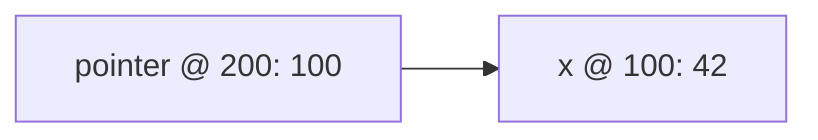
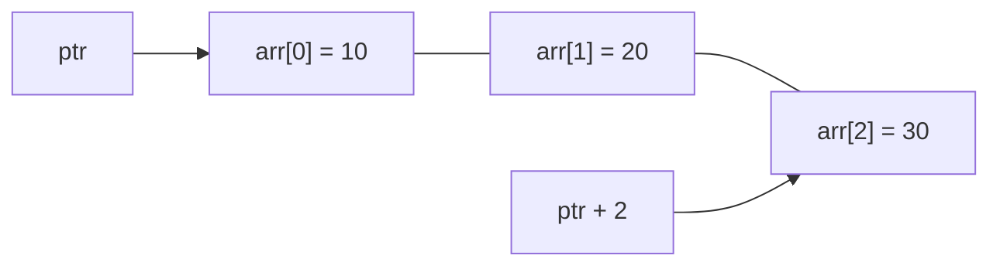
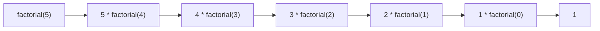

# Κεφάλαιο 11: Δείκτες και Αναδρομή

<!--  -->

> **Στόχοι:** μετά από αυτό το κεφάλαιο θα μπορείτε να εξηγείτε τι είναι η διεύθυνση
> μιας μεταβλητής και να τη βρίσκετε με τον τελεστή `&`· να δηλώνετε, να αρχικοποιείτε
> και να χρησιμοποιείτε δείκτες (`*`)· να ξέρετε πότε ένας δείκτης είναι `NULL` ή μη
> έγκυρος· να κάνετε αριθμητική δεικτών και να εξηγείτε γιατί το `ptr[n]` είναι το
> ίδιο με το `*(ptr + n)`· να γράφετε συναρτήσεις που δέχονται πίνακες· και να
> γράφετε μια απλή αναδρομική συνάρτηση με βάση τερματισμού.
>
> **Προαπαιτούμενα:** [Κεφάλαιο 2](../02-memory-variables/), [Κεφάλαιο 3](../03-functions/), [Κεφάλαιο 10](../10-arrays/)
>
> **Χρόνος μελέτης:** ~3 ώρες

## Σύνοψη

Η διάλεξη αυτή εισάγει έναν νέο τύπο, τον **δείκτη (pointer)**: μια μεταβλητή που δεν
κρατά έναν αριθμό ή έναν χαρακτήρα, αλλά τη διεύθυνση μιας άλλης μεταβλητής στη μνήμη.
Ξεκινάμε από το πώς η μνήμη οργανώνεται σε bytes με διευθύνσεις, βλέπουμε πώς
βρίσκουμε τη διεύθυνση μιας μεταβλητής με το `&` και πώς φτάνουμε από τη διεύθυνση
πίσω στη μεταβλητή με το `*`. Έπειτα μαθαίνουμε τις πράξεις που επιτρέπονται σε δείκτες
και ανακαλύπτουμε ότι η γνωστή μας σύνταξη `a[i]` των πινάκων είναι στην πραγματικότητα
αριθμητική δεικτών. Με αυτά γράφουμε συναρτήσεις που δουλεύουν πάνω σε πίνακες (μέσος
όρος, αναζήτηση, μια δική μας `atoi`). Η διάλεξη κλείνει με την **αναδρομή
(recursion)**, όπου μια συνάρτηση καλεί τον εαυτό της, με παράδειγμα το παραγοντικό.
Οι δείκτες είναι το θεμέλιο για όλο το υπόλοιπο μάθημα: δυναμική μνήμη,
συμβολοσειρές, λίστες και δέντρα.

## Θεωρία

<a id="s11-1"></a><a id="η-μνήμη-και-οι-διευθύνσεις"></a>

### §11.1 Η μνήμη και οι διευθύνσεις

Όπως είδαμε στο [Κεφάλαιο 2](../02-memory-variables/), η μνήμη του υπολογιστή είναι
μια μεγάλη σειρά από **bytes** (1 KB = 1.000 bytes, 1 MB = 1.000.000 bytes,
1 GB = 1.000.000.000 bytes). Μια μνήμη με N bytes έχει τα bytes 0, 1, …, N−1. Η θέση
ενός κελιού στη μνήμη λέγεται **διεύθυνση (address)**: για παράδειγμα, «στη διεύθυνση
2 υπάρχει το byte `11100011` (δυαδικό)».

Μια **μεταβλητή (variable)** είναι ένα τμήμα της μνήμης με συγκεκριμένο όνομα, και για
να χρησιμοποιηθεί πρέπει να έχει **δηλωθεί** με κάποιον **τύπο (type)**. Στη δήλωση
`int x;` ο τύπος λέει στον μεταγλωττιστή *πόση* μνήμη να δεσμεύσει (π.χ. 4 bytes για
έναν `int`), και το όνομα τον κάνει να διαλέξει *πού*, δηλαδή σε ποια διεύθυνση, θα
αποθηκευτεί η μεταβλητή.

Η **ανάθεση (assignment)** μπορεί να γίνει κατά τον ορισμό (`int x = 42;`), αργότερα
(`int x;` και μετά `x = 42;`) ή με δεκαεξαδική σταθερά (`int x = 0x2A;`, το ίδιο 42).
Πριν από την ανάθεση, τα bytes της `x` έχουν ό,τι «σκουπίδια» έτυχε να υπάρχουν εκεί·
μετά, κρατούν την αναπαράσταση του 42 (`00101010` στο δυαδικό).

<a id="s11-2"></a><a id="ο-τελεστής--η-διεύθυνση-μιας-μεταβλητής"></a>

### §11.2 Ο τελεστής `&`: η διεύθυνση μιας μεταβλητής

Τη διεύθυνση μιας μεταβλητής τη βρίσκουμε με τον μοναδιαίο τελεστή **`&`**
(ampersand). Αν η `x` τοποθετήθηκε στα bytes 100–103, τότε το `&x` είναι 100: η
διεύθυνση του *πρώτου* byte της.

| Διεύθυνση | Περιεχόμενο |
| --- | --- |
| 100 | `00000000` |
| 101 | `00000000` |
| 102 | `00000000` |
| 103 | `00101010` |

*Η `int x = 42;` στα bytes 100–103, όπως τη σχεδιάζουν οι διαφάνειες.*

Η διεύθυνση είναι πάντα ένας **ακέραιος** αριθμός, με όσα bits αποφασίσει ο
μεταγλωττιστής: 32 σε συστήματα 32 bit (`gcc -m32`), 64 σε συστήματα 64 bit. Και οι
διευθύνσεις **μπορούν να αλλάζουν από εκτέλεση σε εκτέλεση**: το 100 ισχύει για μία
εκτέλεση του προγράμματος, όχι για πάντα.

Οι διαφάνειες σχεδιάζουν τον ακέραιο με το σημαντικό του μέρος στο πρώτο byte και την
τιμή 42 στο τελευταίο. Η πραγματική σειρά των bytes εξαρτάται από τον επεξεργαστή
(endianness) και τη βλέπουμε στο [Κεφάλαιο 12](../12-pointers-arrays/).

<a id="s11-3"></a><a id="ο-τύπος-δείκτη"></a>

### §11.3 Ο τύπος δείκτη

Πέρα από τους βασικούς τύπους `int`, `char`, `double`, προσθέτουμε έναν νέο τύπο για να
αποθηκεύουμε διευθύνσεις. Ένας **δείκτης (pointer)** είναι μια μεταβλητή που περιέχει
τη διεύθυνση μνήμης ενός δεδομένου συγκεκριμένου τύπου. Η γενική μορφή της δήλωσης
είναι:

```c
τύπος * όνομα;      // π.χ.
int * pointer;
```

Ο τύπος `τύπος *` λέει στον μεταγλωττιστή ότι η διεύθυνση που θα αποθηκεύει ο δείκτης
είναι για δεδομένα τύπου `τύπος`: ο `int *` δείχνει σε `int`, ο `char *` σε `char`. Το
όνομα είναι, όπως πάντα, η μεταβλητή που κρατά την τιμή του δείκτη, και ο
μεταγλωττιστής επιλέγει πού θα αποθηκευτεί. Τα κενά γύρω από το `*` δεν έχουν σημασία:
`int *p`, `int * p` και `int* p` είναι το ίδιο. Σε δήλωση πολλών μεταβλητών όμως
το `*` ανήκει στο όνομα: `int *pa = &a, *pb = &b;` δηλώνει δύο δείκτες.

<a id="s11-4"></a><a id="αρχικοποίηση-ενός-δείκτη"></a>

### §11.4 Αρχικοποίηση ενός δείκτη

Αρχικοποιούμε έναν δείκτη με τη διεύθυνση μιας μεταβλητής του σωστού τύπου:

```c
int x = 42;
int *pointer = &x;
```

Τώρα λέμε ότι ο `pointer` **δείχνει (points to)** στη μεταβλητή `x`. Ο ίδιος ο δείκτης
είναι μια μεταβλητή με δική της θέση στη μνήμη. Αν η `x` είναι στη διεύθυνση 100 και ο
`pointer` στη 200, τότε το περιεχόμενο του `pointer` είναι 100 και το `&pointer` είναι
200· το `printf("%d, %d\n", pointer, &pointer);` των διαφανειών τυπώνει `100, 200`
(το σωστό format για διευθύνσεις είναι το `%p`, βλ. παρακάτω):



*Σχήμα: ο δείκτης (στη διεύθυνση 200) κρατά την τιμή 100, τη διεύθυνση της `x`.*

Το ίδιο γίνεται με κάθε τύπο: με `char c = 42; char *pointer = &c;` και τη `c` στη
διεύθυνση 150, ο `pointer` περιέχει 150. Η διαφορά είναι ότι ο `char` πιάνει 1 byte,
ενώ ο `int` 4.

<a id="s11-5"></a><a id="ο-τελεστής-sizeof"></a>

### §11.5 Ο τελεστής `sizeof`

Ο τελεστής **`sizeof`** υπολογίζει πόσα bytes πιάνει στη μνήμη ένας τύπος ή μια
μεταβλητή. Το αποτέλεσμα έχει τύπο `size_t` και το σωστό format για την `printf` είναι
το `%zu` (το `%d` συνήθως «δουλεύει», αλλά ο `gcc -Wall` προειδοποιεί):

```c
printf("int size: %zu\n", sizeof(int));   // int size: 4
```

Πόσο μεγάλος είναι ένας δείκτης; Όσο μια διεύθυνση, **ανεξάρτητα από τον τύπο στον
οποίο δείχνει**. Σε σύστημα 64 bit οι `int *`, `char *` και `double *` πιάνουν όλοι
8 bytes (σε 32 bit, 4). Ο τύπος του δείκτη δεν αλλάζει το μέγεθός του, αλλάζει το πώς
ερμηνεύεται η μνήμη όπου δείχνει.

<a id="s11-6"></a><a id="η-ειδική-τιμή-null"></a>

### §11.6 Η ειδική τιμή `NULL`

Όταν θέλουμε να δηλώσουμε ότι ένας δείκτης **δεν δείχνει σε κάποια μεταβλητή**, του
αναθέτουμε την τιμή **`NULL`** (τη διεύθυνση 0), και μπορούμε να την ελέγξουμε:

```c
int * ipointer = NULL;
if (ipointer == NULL) {
  printf("pointer does not point anywhere\n");
}
```

Δεν υπάρχει περίπτωση να βρίσκεται μια μεταβλητή στη διεύθυνση 0; Θεωρητικά ναι,
πρακτικά όχι: τα συστήματα κρατούν αυτή τη διεύθυνση εκτός χρήσης ακριβώς για να
σημαίνει «πουθενά». Ο Tony Hoare, που εισήγαγε τις null αναφορές, την ονόμασε «the
billion dollar mistake», γιατί η χρήση ενός `NULL` δείκτη σαν να ήταν έγκυρος είναι
μία από τις πιο συχνές αιτίες σφαλμάτων.

<a id="s11-7"></a><a id="αποαναφορά-ο-τελεστής-"></a>

### §11.7 Αποαναφορά: ο τελεστής `*`

Ο δείκτης δείχνει σε μια μεταβλητή· μπορούμε να φτάσουμε στη μεταβλητή έχοντας μόνο τη
διεύθυνσή της; Ναι: με τον μοναδιαίο τελεστή **`*`**, που λέγεται **αποαναφορά
(dereference)**. Το `*pointer` είναι η μεταβλητή στην οποία δείχνει ο `pointer`:

```c
int x = 42;
int *pointer = &x;
printf("%d\n", *pointer);   // 42
```

Η χρήση του `*pointer` είναι **ισοδύναμη με τη χρήση της μεταβλητής `x`**, και για
διάβασμα και για γράψιμο: το `*pointer = 7;` αλλάζει την `x`. Προσέξτε ότι το `*`
έχει δύο ρόλους: στη δήλωση (`int *p`) λέει «ο `p` είναι δείκτης», ενώ σε μια
έκφραση (`*p`) λέει «πήγαινε εκεί που δείχνει ο `p`».

<a id="s11-8"></a><a id="μη-έγκυροι-δείκτες"></a>

### §11.8 Μη έγκυροι δείκτες

Για να χρησιμοποιήσουμε το περιεχόμενο της διεύθυνσης όπου δείχνει ένας δείκτης, η
διεύθυνση πρέπει πρώτα να **υπάρχει**:

```c
int *pointer;
printf("%d\n", *pointer);   // μη αρχικοποιημένος δείκτης!
```

Αυτό κατά πάσα πιθανότητα θα τερματίσει με **segmentation fault**: ο `pointer` δεν
αρχικοποιήθηκε, άρα περιέχει μια τυχαία τιμή που δεν είναι έγκυρη διεύθυνση μνήμης. Το
ίδιο συμβαίνει με αποαναφορά ενός `NULL` δείκτη. Κανόνας: κάθε δείκτης είτε δείχνει σε
κάτι έγκυρο, είτε είναι `NULL` και ελέγχεται πριν χρησιμοποιηθεί.

<a id="s11-9"></a><a id="οι-τελεστές--και--είναι-συμπληρωματικοί"></a>

### §11.9 Οι τελεστές `*` και `&` είναι συμπληρωματικοί

Ο `*` δίνει τη μεταβλητή σε μια διεύθυνση, ο `&` τη διεύθυνση μιας μεταβλητής. Είναι
λοιπόν **αντίστροφοι**: όταν εφαρμόζονται σε έγκυρους δείκτες αλληλοαναιρούνται. Με
`int x = 42; int *pointer = &x;` τα `pointer`, `&*pointer` και `*&pointer` έχουν όλα
την ίδια τιμή. Για να τυπώσουμε μια διεύθυνση χρησιμοποιούμε το format **`%p`**, που
τη δείχνει στο δεκαεξαδικό:

```text
$ ./pointer_size
0x7ffcf94870cc 0x7ffcf94870cc 0x7ffcf94870cc
```

<a id="s11-10"></a><a id="πράξεις-με-δείκτες"></a>

### §11.10 Πράξεις με δείκτες

Σε δείκτες επιτρέπονται μόνο οι εξής πράξεις:

- πρόσθεση ή αφαίρεση ακεραίου σε/από δείκτη (και τα `++`, `--`, `+=`, `-=`)·
- αφαίρεση δύο δεικτών·
- σύγκριση δύο δεικτών ή σύγκριση με το 0 (`NULL`).

Το κρίσιμο σημείο είναι η πρόσθεση. **Η πρόσθεση ενός ακεραίου αυξάνει τη διεύθυνση
κατά το μέγεθος του τύπου όπου δείχνει ο δείκτης, πολλαπλασιασμένο με τον ακέραιο.**
Για `τύπος *pointer;` το `pointer += N` μεταφέρει τη διεύθυνση κατά
`N * sizeof(τύπος)` bytes:

```c
int *ipointer;    ipointer += 2;   // + 2 * sizeof(int)    = 8 bytes
char *cpointer;   cpointer += 2;   // + 2 * sizeof(char)   = 2 bytes
double *dpointer; dpointer += 2;   // + 2 * sizeof(double) = 16 bytes
```

Δηλαδή ο δείκτης μετακινείται κατά N **στοιχεία**, όχι κατά N bytes. Έτσι, αν ο
`int *pointer` δείχνει στη 100, το `++pointer` τον κάνει 104· αν ο `char *pointer`
δείχνει στη 150, το `--pointer` τον κάνει 149. Η αφαίρεση δύο δεικτών δίνει αντίστοιχα
πόσα στοιχεία απέχουν, και έχει νόημα, όπως και η σύγκρισή τους, μόνο όταν δείχνουν
στο ίδιο μπλοκ μνήμης, π.χ. στον ίδιο πίνακα (σημειώσεις, «Δείκτες»).

Γιατί να μετακινήσουμε έναν δείκτη; Η μνήμη δίπλα σε μια απλή μεταβλητή δεν μας ανήκει.
Έχει νόημα όταν ο δείκτης δείχνει μέσα σε **συνεχόμενες θέσεις ίδιου τύπου**, δηλαδή
σε έναν πίνακα.

<a id="s11-11"></a><a id="δείκτες-και-πίνακες-ptr--n-και-ptrn"></a>

### §11.11 Δείκτες και πίνακες: `*(ptr + n)` και `ptr[n]`

Τα στοιχεία ενός πίνακα είναι σε συνεχόμενες θέσεις ([Κεφάλαιο 10](../10-arrays/)).
Αν `ptr = &arr[0]`, τότε το `ptr + 2` δείχνει στο `arr[2]` και το `*(ptr + 2)` είναι το
ίδιο το `arr[2]`. Η έκφραση `*(ptr + n)`, «υπολόγισε τη διεύθυνση n στοιχεία μετά τον
δείκτη και δώσε μου τη μεταβλητή εκεί», είναι τόσο συχνή που η C έχει συντομογραφία:

```c
*(ptr + n)   // ⇔ ptr[n]
*(ptr + 3)   // ⇔ ptr[3]
```

Μας θυμίζει κάτι; Είναι ακριβώς η σύνταξη αναφοράς σε στοιχείο πίνακα. Και πράγματι,
το όνομα ενός πίνακα συμπεριφέρεται σαν δείκτης **κολλημένος** στο πρώτο του στοιχείο:
για `int a[100];` το `a` είναι το `&a[0]`, το `a[i]` είναι το `*(a + i)` και το
`a + i` είναι το `&a[i]`.



*Σχήμα: ο `ptr` δείχνει στο `arr[0]`· το `ptr + 2` δείχνει δύο στοιχεία (8 bytes) πιο
μετά, στο `arr[2]`.*

Γι' αυτό μια συνάρτηση που δέχεται πίνακα στην πραγματικότητα δέχεται τη διεύθυνση του
πρώτου στοιχείου: η παράμετρος `int grades[100]` είναι ισοδύναμη με `int *grades`, και
ο πίνακας δεν αντιγράφεται (σημειώσεις, «Πίνακες»).

<a id="s11-12"></a><a id="διαφορές-πινάκων-και-δεικτών"></a>

### §11.12 Διαφορές πινάκων και δεικτών

Παρόλο που η προσπέλαση στοιχείων είναι ίδια και ο πίνακας είναι ουσιαστικά δείκτης
στο πρώτο στοιχείο, πίνακας και δείκτης **δεν** είναι το ίδιο πράγμα. Με
`int a[100]; int *ptr;`:

| | Πίνακας `a` | Δείκτης `ptr` |
| --- | --- | --- |
| Αλλαγή διεύθυνσης | Δεν γίνεται: `a = ptr;` και `a++` είναι λάθη | Επιτρέπεται: `ptr = a;`, `ptr++` |
| Τι δημιουργεί η δήλωση | Θέσεις για τα στοιχεία (100 `int`) | Θέση για μία διεύθυνση |
| `sizeof` | Όλος ο πίνακας: `100 * sizeof(int)` | Μία διεύθυνση (8 σε 64 bit) |
| `&` | `&a` έχει τη διεύθυνση του πρώτου στοιχείου (`&a[0]`) | `&ptr` είναι η διεύθυνση του ίδιου του δείκτη |

<a id="s11-13"></a><a id="αναδρομή"></a>

### §11.13 Αναδρομή

**Αναδρομή (recursion)** είναι η μέθοδος κατά την οποία μια συνάρτηση **καλεί τον
εαυτό της** για να λύσει ένα υποπρόβλημα του αρχικού προβλήματος, έως ότου φτάσει σε
μια βάση τερματισμού, όπου η αναδρομή σταματά. Έχει δύο βασικά στοιχεία:

1. **Βασική περίπτωση τερματισμού (base case):** μια συνθήκη που καθορίζει πότε θα
   σταματήσει η αναδρομή, και η απάντηση δίνεται απευθείας.
2. **Αναδρομική περίπτωση (recursive case):** το τμήμα του κώδικα όπου η συνάρτηση
   καλεί τον εαυτό της με ένα «μικρότερο» πρόβλημα, που πλησιάζει τη βάση.

Το κλασικό παράδειγμα είναι το **παραγοντικό (factorial)**: το $n!$ ενός φυσικού
αριθμού είναι το γινόμενο όλων των θετικών ακεραίων μικρότερων ή ίσων του $n$. Ο
μαθηματικός του ορισμός είναι ήδη αναδρομικός:

$$n! = 1 \text{ αν } n = 0, \qquad n! = n \times (n-1)! \text{ αν } n > 0$$

και μεταφράζεται στην C σχεδόν λέξη προς λέξη:

```c
int factorial(int number) {
  if (number == 0) return 1;                  // base case
  else return number * factorial(number - 1); // recursive case
}
```

Η αναδρομική υλοποίηση είναι πολύ κοντά στον ορισμό, κι αυτό κάνει «εύκολο» τον
έλεγχο ορθότητας: αρκεί να ελέγξουμε ότι η βάση είναι σωστή και ότι κάθε βήμα
εφαρμόζει σωστά τον κανόνα. Κάθε κλήση περιμένει το αποτέλεσμα της επόμενης, και ο
πολλαπλασιασμός γίνεται στην «επιστροφή»:



*Σχήμα: η αλυσίδα κλήσεων του `factorial(5)`· οι τιμές επιστρέφονται από δεξιά προς τα
αριστερά: 1, 1, 2, 6, 24, 120.*

**Η αναδρομή πρέπει να τερματίζει.** Αν η βάση λείπει ή δεν φτάνεται ποτέ, η συνάρτηση
καλεί τον εαυτό της ξανά και ξανά. Κάθε κλήση που δεν έχει επιστρέψει πιάνει χώρο στη
μνήμη (στη στοίβα, βλ. [Κεφάλαιο 13](../13-memory/)), οπότε κάποια στιγμή η μνήμη αυτή
εξαντλείται και το πρόγραμμα καταρρέει, συνήθως με segmentation fault. Μην ξεχνάτε
λοιπόν να γράφετε σωστά base cases, που να καλύπτουν *όλες* τις εισόδους.

## Παραδείγματα

<a id="s11-14"></a><a id="τι-τυπώνει-αναθέσεις-μέσω-δεικτών"></a>

### §11.14 Τι τυπώνει: αναθέσεις μέσω δεικτών

Εφαρμογή της αποαναφοράς (`*`) για γράψιμο και διάβασμα:

```c
#include <stdio.h>
int main() {
  int a = 100, b = 200, c;
  int *ptr_a = &a, *ptr_b = &b, *ptr_c = &c;
  *ptr_c = a;
  *ptr_a = b;
  *ptr_b = *ptr_c;
  printf("%d %d %d", a, b, c);
  return 0;
}
```

Ακολουθούμε ποια μεταβλητή αλλάζει σε κάθε γραμμή: `*ptr_c = a` είναι `c = 100`·
`*ptr_a = b` είναι `a = 200`· `*ptr_b = *ptr_c` είναι `b = c`, δηλαδή `b = 100`. Τυπώνει
`200 100 100` (χωρίς αλλαγή γραμμής, αφού λείπει το `\n`). Οι δείκτες εδώ λειτουργούν
απλώς ως δεύτερα ονόματα για τις `a`, `b`, `c`.

<a id="s11-15"></a><a id="αναφορά-σε-στοιχεία-πίνακα-μέσω-δείκτη"></a>

### §11.15 Αναφορά σε στοιχεία πίνακα μέσω δείκτη

Εφαρμογή της αριθμητικής δεικτών σε πίνακα:

```c
#include <stdio.h>
int main() {
  int *ptr, arr[] = {10, 20, 30};
  ptr = &arr[0];
  printf("mem[%p], %d\n", ptr, *ptr);
  ptr += 2;
  printf("mem[%p], %d\n", ptr, *ptr);
  return 0;
}
```

```text
$ ./test
mem[0xffa35e60], 10
mem[0xffa35e68], 30
```

Το `ptr += 2` πρόσθεσε `2 * sizeof(int) = 8` στη διεύθυνση (`0x...60` → `0x...68`) και
ο δείκτης δείχνει πια στο `arr[2]`. Οι ίδιες οι διευθύνσεις θα είναι διαφορετικές
στον δικό σας υπολογιστή· η διαφορά 8 όχι.

<a id="s11-16"></a><a id="πώς-τυπώνω-μόνο-το-worldn"></a>

### §11.16 Πώς τυπώνω μόνο το `"World\n"`;

Από την προηγούμενη διάλεξη έχουμε μια συμβολοσειρά, και θέλουμε να τυπώσουμε μόνο το
δεύτερο μισό της:

```c
char hello[] = "Hello World\n";
char *world = &hello[6];
printf("%s", world);          // World
```

Το `%s` τυπώνει χαρακτήρες από τη διεύθυνση που του δίνουμε μέχρι το `'\0'`. Το
`&hello[6]` (ισοδύναμα `hello + 6`) είναι η διεύθυνση του `'W'`, άρα τυπώνεται
`World` και η αλλαγή γραμμής. Δεν χρειάστηκε καμία αντιγραφή: ο `world` απλώς δείχνει
μέσα στον ίδιο πίνακα.

<a id="s11-17"></a><a id="μέσος-όρος-ενός-πίνακα-100-ακεραίων"></a>

### §11.17 Μέσος όρος ενός πίνακα 100 ακεραίων

Μια συνάρτηση που δέχεται πίνακα 100 ακεραίων και επιστρέφει τον μέσο όρο:

```c
int average(int grades[100]) {
  int i, sum = 0;
  for (i = 0; i < 100; i++) {
    sum += grades[i];
  }
  return sum / 100;
}
```

Η συνάρτηση παίρνει τη διεύθυνση του πίνακα (όχι αντίγραφο) και διατρέχει τα στοιχεία
με `grades[i]`. Προσέξτε ότι το `sum / 100` είναι ακέραια διαίρεση: ο μέσος όρος
στρογγυλεύεται προς τα κάτω. Για ακρίβεια θα επιστρέφαμε `double` και θα γράφαμε
`sum / 100.0`.

<a id="s11-18"></a><a id="αναζήτηση-στοιχείου-σε-πίνακα"></a>

### §11.18 Αναζήτηση στοιχείου σε πίνακα

Μια συνάρτηση που δέχεται πίνακα 100 ακεραίων και έναν ακέραιο, και επιστρέφει τη θέση
του στοιχείου αν το βρει, αλλιώς `-1`:

```c
int find(int haystack[100], int needle) {
  int i;
  for (i = 0; i < 100; i++) {
    if (haystack[i] == needle) {
      return i;
    }
  }
  return -1;
}
```

Το `return i` μέσα στον βρόχο τερματίζει αμέσως τη συνάρτηση στην πρώτη εμφάνιση. Αν ο
βρόχος τελειώσει χωρίς να βρει τίποτα, φτάνουμε στο `return -1`. Το `-1` είναι
ασφαλής «σημαία αποτυχίας», γιατί δεν είναι ποτέ έγκυρη θέση πίνακα.

<a id="s11-19"></a><a id="η-δική-μας-atoi"></a>

### §11.19 Η δική μας `atoi`

Μια συνάρτηση που παίρνει πίνακα χαρακτήρων (μόνο ψηφία) και επιστρέφει τον ακέραιο που
αναπαριστά:

```c
int atoi(char digits[]) {
  int result = 0;
  for (int i = 0; digits[i]; i++) {
    result = 10 * result + digits[i] - '0';
  }
  return result;
}
```

Η συνθήκη `digits[i]` σταματά στο `'\0'` (τιμή 0) στο τέλος της συμβολοσειράς. Το
`digits[i] - '0'` μετατρέπει τον χαρακτήρα ψηφίου στην τιμή του (`'7' - '0' == 7`), και
το `10 * result +` «σπρώχνει» τα ψηφία που έχουμε ήδη μία θέση αριστερά: για `"123"` το
`result` γίνεται 1, 12, 123.

Τι μπορεί να πάει στραβά; Η συνάρτηση υποθέτει πολλά: αν η είσοδος έχει χαρακτήρα που
δεν είναι ψηφίο (π.χ. `"12a"` ή `"-5"`) υπολογίζει σκουπίδια χωρίς να το αναφέρει· αν
ο αριθμός δεν χωρά σε `int` έχουμε υπερχείλιση· και αν ο πίνακας δεν τελειώνει σε
`'\0'`, ο βρόχος διαβάζει εκτός ορίων. Επίσης το όνομα `atoi` συγκρούεται με τη
συνάρτηση της `stdlib.h`, οπότε σε πραγματικό πρόγραμμα θα διαλέγαμε άλλο όνομα.

<a id="s11-20"></a><a id="παραγοντικό-από-τη-γραμμή-εντολών"></a>

### §11.20 Παραγοντικό από τη γραμμή εντολών

Εφαρμογή της αναδρομής: ολόκληρο το πρόγραμμα, που διαβάζει τον αριθμό από τη γραμμή
εντολών (τα `argc`/`argv` τα εξηγούμε στο [Κεφάλαιο 12](../12-pointers-arrays/)):

```c
#include <stdio.h>
#include <stdlib.h>
// Compute the factorial of a number using the recursive
// formula.
int factorial(int number) {
  if (number == 0) return 1;
  else return number * factorial(number - 1);
}
int main(int argc, char **argv) {
  if (argc != 2) {
    printf("Program needs to be called as `./prog number`\n");
    return 1;
  }
  int number = atoi(argv[1]);
  printf("%d! = %d\n", number, factorial(number));
  return 0;
}
```

Οι διαφάνειες θέτουν τρεις ερωτήσεις για αυτό το πρόγραμμα:

- **Για κάποιους αριθμούς το αποτέλεσμα είναι αρνητικό. Τι συμβαίνει;**

  ```text
  $ ./fact 20
  20! = -2102132736
  ```

  Είναι **υπερχείλιση ακεραίου**: ο `int` των 32 bit φτάνει μέχρι 2.147.483.647. Το
  $12! = 479.001.600$ χωρά, αλλά ήδη το $13!$ δεν χωρά, και από εκεί και πέρα τα
  αποτελέσματα είναι λάθος (το αρνητικό πρόσημο είναι απλώς το πιο εμφανές σύμπτωμα).
- **Πόσες αναδρομικές κλήσεις κάνει το `factorial(5)`; Και το `factorial(N)`;** Το
  `factorial(5)` καλεί τα `factorial(4)`, …, `factorial(0)`: 5 αναδρομικές κλήσεις
  (6 κλήσεις συνολικά). Γενικά το `factorial(N)` κάνει N αναδρομικές κλήσεις.
- **Τι θα συμβεί αν δώσουμε αρνητικό αριθμό;** Το `number` δεν φτάνει ποτέ στο 0
  (−1, −2, −3, …), άρα η βάση δεν ενεργοποιείται ποτέ και η αναδρομή δεν τερματίζει,
  μέχρι να εξαντληθεί η στοίβα. Η διόρθωση είναι να ελέγχουμε την είσοδο ή να γράψουμε
  τη βάση ως `number <= 0`.

Για εξάσκηση στην αναδρομή, το [Εργαστήριο 5](https://progintro.github.io/lab-material/labs/lab05/)
έχει την ακολουθία Collatz και τους αριθμούς Fibonacci.

## Κύρια σημεία

1. Η μνήμη είναι μια σειρά από bytes, και η θέση κάθε byte λέγεται διεύθυνση· η
   διεύθυνση μιας μεταβλητής είναι η διεύθυνση του πρώτου της byte.
2. Ο τελεστής `&` δίνει τη διεύθυνση μιας μεταβλητής· η διεύθυνση είναι ακέραιος και
   μπορεί να αλλάζει από εκτέλεση σε εκτέλεση.
3. Ένας δείκτης (`τύπος *όνομα`) είναι μεταβλητή που κρατά τη διεύθυνση ενός δεδομένου
   του συγκεκριμένου τύπου.
4. Όλοι οι δείκτες έχουν το ίδιο μέγεθος, όσο μια διεύθυνση (8 bytes σε 64 bit),
   ανεξάρτητα από τον τύπο στον οποίο δείχνουν.
5. Ο τελεστής `*` (αποαναφορά) δίνει τη μεταβλητή όπου δείχνει ο δείκτης· οι `*` και
   `&` είναι αντίστροφοι, και οι διευθύνσεις τυπώνονται με `%p`.
6. Το `NULL` σημαίνει «πουθενά»· αποαναφορά ενός `NULL` ή μη αρχικοποιημένου δείκτη
   οδηγεί συνήθως σε segmentation fault.
7. Σε δείκτες επιτρέπονται πρόσθεση/αφαίρεση ακεραίου, αφαίρεση δύο δεικτών και
   σύγκριση· το `p + N` προχωρά κατά `N * sizeof(τύπος)` bytes, δηλαδή N στοιχεία.
8. Το `*(ptr + n)` γράφεται συντομότερα `ptr[n]`, και το όνομα ενός πίνακα είναι
    δείκτης κολλημένος στο πρώτο του στοιχείο.
9. Ένας πίνακας δεν μπορεί να αλλάξει διεύθυνση, και τα `sizeof`, `&` δίνουν άλλα
   αποτελέσματα σε πίνακα και σε δείκτη.
10. Μια συνάρτηση που δέχεται πίνακα δουλεύει πάνω στον ίδιο πίνακα, μέσω της
    διεύθυνσής του.
11. Αναδρομή είναι μια συνάρτηση που καλεί τον εαυτό της· χρειάζεται base case και
    recursive case που πλησιάζει τη βάση, και η αναδρομική υλοποίηση του
    παραγοντικού ακολουθεί κατά λέξη τον μαθηματικό ορισμό.
12. Η αναδρομή πρέπει να τερματίζει: χωρίς σωστή βάση για όλες τις εισόδους, το
    πρόγραμμα καταρρέει.

## Ορολογία

| Ελληνικά | English | Σύντομος ορισμός |
| --- | --- | --- |
| διεύθυνση | address | Η θέση ενός byte στη μνήμη· ένας ακέραιος. |
| δείκτης | pointer | Μεταβλητή που κρατά τη διεύθυνση ενός δεδομένου. |
| δείχνει σε | points to | Ο δείκτης κρατά τη διεύθυνση της μεταβλητής. |
| αποαναφορά | dereference | Πρόσβαση με `*` στη μεταβλητή όπου δείχνει ο δείκτης. |
| κενός δείκτης | null pointer (`NULL`) | Δείκτης με τιμή 0 που δεν δείχνει πουθενά. |
| μη έγκυρος δείκτης | invalid pointer | Δείκτης που δεν κρατά έγκυρη διεύθυνση. |
| σφάλμα κατάτμησης | segmentation fault | Τερματισμός από πρόσβαση σε μη επιτρεπτή μνήμη. |
| αριθμητική δεικτών | pointer arithmetic | Το `p + n` δείχνει `n` στοιχεία (όχι bytes) μετά. |
| αναδρομή | recursion | Μια συνάρτηση καλεί τον εαυτό της. |
| βασική περίπτωση | base case | Η συνθήκη όπου η αναδρομή σταματά. |
| αναδρομική περίπτωση | recursive case | Το σημείο όπου η συνάρτηση καλεί τον εαυτό της. |
| παραγοντικό | factorial | $n! = 1 \cdot 2 \cdots n$, με $0! = 1$. |
| υπερχείλιση | overflow | Αποτέλεσμα που δεν χωρά στον τύπο του. |

## Διάβασμα

- **Διαφάνειες:** [Διάλεξη 11](https://github.com/progintro/progintro.github.io/releases/download/2025/lec11.pdf),
  σελ. 1–50. Μνήμη και διευθύνσεις σελ. 5–11· δείκτες, `sizeof` και `NULL`
  σελ. 12–19· αποαναφορά και μη έγκυροι δείκτες σελ. 20–24· πράξεις με δείκτες
  σελ. 25–28· δείκτες και πίνακες σελ. 29–35· παραδείγματα με πίνακες σελ. 36–42·
  αναδρομή σελ. 43–48.
- **Σημειώσεις:** η διάλεξη μαζί με την επόμενη καλύπτει τις σελίδες 73–103 των
  σημειώσεων του κ. Σταματόπουλου:
  - [Κεφάλαιο 5: Δείκτες και πίνακες](https://progintro.github.io/notes/chapters/05-pointers-arrays/),
    ενότητες «Δείκτες» (K04, σελ. 72–77) και «Πίνακες» (K04, σελ. 80–85).
  - [Κεφάλαιο 4: Συναρτήσεις, εμβέλεια και αναδρομή](https://progintro.github.io/notes/chapters/04-functions/),
    ενότητες «Συνάρτηση υπολογισμού παραγοντικού» (K04, σελ. 62) και «Υπολογισμός
    παραγοντικού με αναδρομή» (K04, σελ. 69).
- **Εργαστήριο:**
  - [Εργαστήριο 6](https://progintro.github.io/lab-material/labs/lab06/): ασκήσεις
    `myprog.c` (πέρασμα δεδομένων μέσω δεικτών), `pointers.c` (πίνακες και αριθμητική
    δεικτών), `judgement.c` (πίνακες και συναρτήσεις).
  - [Εργαστήριο 5](https://progintro.github.io/lab-material/labs/lab05/): ασκήσεις
    `collatz.c` και `fib.c` (αναδρομή).
- **Άλλα:**
  - Tutorials για pointers: [W3Schools](https://www.w3schools.com/c/c_pointers.php),
    [Tutorialspoint](https://www.tutorialspoint.com/cprogramming/c_pointers.htm),
    [GeeksforGeeks](https://www.geeksforgeeks.org/c-pointers/),
    [Programiz](https://www.programiz.com/c-programming/c-pointers).
  - Tony Hoare, [«Null References: The Billion Dollar Mistake»](https://www.infoq.com/presentations/Null-References-The-Billion-Dollar-Mistake-Tony-Hoare/) (ομιλία).

## Συχνά λάθη

- **Αποαναφορά μη αρχικοποιημένου δείκτη.** `int *p; *p = 5;` → `Segmentation fault`
  (ή, χειρότερα, σιωπηλή αλλοίωση άλλης μνήμης). Αρχικοποιείτε κάθε δείκτη, έστω με
  `NULL`, και ελέγχετε πριν τον χρησιμοποιήσετε.
- **Διευθύνσεις με `%d`.** `printf("%d", ptr)` δίνει warning
  (`format '%d' expects argument of type 'int'`) και σε 64 bit τυπώνει μόνο το μισό της
  διεύθυνσης. Χρησιμοποιήστε `%p`.
- **Ένα `*` για πολλές μεταβλητές.** Στο `int *p, q;` μόνο ο `p` είναι δείκτης, ο `q`
  είναι `int`. Γράψτε `int *p, *q;`.
- **Σύγχυση του `*` της δήλωσης με το `*` της έκφρασης.** Το `int *p = &x;`
  αρχικοποιεί τον `p`, όχι το `*p`· αργότερα γράφετε `p = &x;`, όχι `*p = &x;`.
- **Αριθμητική δεικτών σε bytes.** Για `int *p` στη διεύθυνση 100, το `p + 1` είναι 104,
  όχι 101.
- **Ανάθεση σε πίνακα.** `int a[100]; a = ptr;` → `assignment to expression with array
  type`. Ένας πίνακας δεν αλλάζει διεύθυνση· χρησιμοποιήστε δείκτη.
- **Ακέραια διαίρεση στον μέσο όρο.** `sum / 100` με `int` χάνει το δεκαδικό μέρος.
  Γράψτε `sum / 100.0` και επιστρέψτε `double`.
- **Αναδρομή χωρίς (σωστό) base case.** `factorial(-1)` με βάση `number == 0` δεν
  τερματίζει → segmentation fault. Βεβαιωθείτε ότι κάθε είσοδος φτάνει στη βάση.
- **Υπερχείλιση στο παραγοντικό.** Από το `13!` και πάνω ο `int` υπερχειλίζει
  (`20! = -2102132736`). Ελέγξτε το εύρος της εισόδου ή χρησιμοποιήστε μεγαλύτερο τύπο.

<!-- misconceptions -->

### Τι δυσκόλεψε την τάξη

Από τα Kahoot των διαλέξεων: οι ερωτήσεις όπου μια λάθος απάντηση μάζεψε πολλές ψήφους, με το ποσοστό σωστών απαντήσεων.

- **[Κ11.13](../../questions/kahoot/kahoot-pointer-addition.md)** Άθροισμα δύο δεικτών (28% σωστές): Το 28% επέλεξε `166` και το 22% `84`, θεωρώντας ότι δύο δείκτες προστίθενται σαν ακέραιοι. Η C επιτρέπει δείκτη ± ακέραιο και διαφορά δύο δεικτών, όχι όμως άθροισμα δεικτών.
- **[Κ11.12](../../questions/kahoot/kahoot-pointer-plus-int-hex.md)** Δείκτης συν 4 σε δεκαεξαδικό (31% σωστές): Το 32% επέλεξε `0x4C` και το 22% `0x46`. Οι δεύτεροι ξέχασαν ότι το `+ 4` σημαίνει 4 × `sizeof(int)` bytes, ενώ οι πρώτοι πρόσθεσαν σωστά 16 bytes, αλλά μπέρδεψαν τη δεκαεξαδική πρόσθεση (16 = `0x10`).
- **[Κ11.9](../../questions/kahoot/kahoot-pointer-increment-scalar.md)** Αύξηση του ίδιου του δείκτη (37% σωστές): Το 25% επέλεξε `42`, θεωρώντας ότι το `ptr++` αυξάνει την τιμή του `x`. Στην πραγματικότητα αλλάζει τη διεύθυνση που κρατά ο δείκτης, όχι την τιμή στην οποία δείχνει.
- **[Κ11.8](../../questions/kahoot/kahoot-pointer-size.md)** Μέγεθος δεικτών (46% σωστές): Το 49% απάντησε False, μπερδεύοντας το μέγεθος του δείκτη με το μέγεθος του τύπου στον οποίο δείχνει. Κάθε δείκτης κρατά μια διεύθυνση, άρα όλοι έχουν το ίδιο μέγεθος (8 bytes σε 64-bit συστήματα).
- **[Κ11.6](../../questions/kahoot/kahoot-address-is-integer.md)** Διεύθυνση και ακέραιος (50% σωστές): Το 47% απάντησε False, ίσως επειδή η διεύθυνση έχει τύπο δείκτη ή επειδή τη βλέπουμε σε δεκαεξαδικό. Όμως κάθε διεύθυνση είναι ο αύξων αριθμός ενός byte στη μνήμη, δηλαδή ακέραιος.
- **[Κ11.4](../../questions/kahoot/kahoot-null-is-zero.md)** Η τιμή του NULL (65% σωστές): Το 28% απάντησε False, θεωρώντας το `NULL` ειδική τιμή χωρίς αριθμητική αναπαράσταση. Στην πράξη το `NULL` είναι η διεύθυνση 0.
- **[Κ11.3](../../questions/kahoot/kahoot-ptr-offset-equals-index.md)** *(ptr + 4) και ptr[4] (67% σωστές): Το 26% απάντησε False, θεωρώντας ότι οι αγκύλες είναι κάτι διαφορετικό από την αριθμητική δεικτών. Στην C το `ptr[n]` ορίζεται ακριβώς ως `*(ptr + n)`.

<!-- /misconceptions -->

## Ερωτήσεις κατανόησης

- <a id="e11-1"></a>**[Ε11.1](#e11-1)** Τι είναι η διεύθυνση μιας μεταβλητής `int` που πιάνει τα bytes 100–103;[^q1]
- <a id="e11-2"></a>**[Ε11.2](#e11-2)** Με `int x = 42; int *p = &x;`, τι είναι τα `p`, `*p` και `&p`;[^q2]
- <a id="e11-3"></a>**[Ε11.3](#e11-3)** Πόσα bytes πιάνουν ένας `char *` και ένας `double *` σε σύστημα 64 bit;[^q3]
- <a id="e11-4"></a>**[Ε11.4](#e11-4)** Γιατί το `int *p; printf("%d", *p);` πιθανότατα καταρρέει;[^q4]
- <a id="e11-5"></a>**[Ε11.5](#e11-5)** Ο `double *d` δείχνει στη διεύθυνση 1000. Πού δείχνει το `d + 3`;[^q5]
- <a id="e11-6"></a>**[Ε11.6](#e11-6)** Γράψτε το `arr[4]` με αριθμητική δεικτών.[^q6]
- <a id="e11-7"></a>**[Ε11.7](#e11-7)** Για `int a[100]; int *ptr = a;`, ποιο είναι το `sizeof(a)` και ποιο το
   `sizeof(ptr)` αν `sizeof(int) == 4` σε 64 bit;[^q7]
- <a id="e11-8"></a>**[Ε11.8](#e11-8)** Ποια είναι τα δύο στοιχεία κάθε αναδρομικής συνάρτησης;[^q8]
- <a id="e11-9"></a>**[Ε11.9](#e11-9)** Πόσες φορές καλείται συνολικά η `factorial` για `factorial(3)`;[^q9]

<!-- kahoot -->

### Kahoot από το αμφιθέατρο (Κ11.1–Κ11.14)

Ερωτήσεις που παίχτηκαν στις διαλέξεις, με το ποσοστό των φοιτητών που απάντησαν σωστά.

- <a id="k11-1"></a>**[Κ11.1](../../questions/kahoot/kahoot-recursion-terminates.md)** Τερματισμός αναδρομής: 87% σωστές απαντήσεις
- <a id="k11-2"></a>**[Κ11.2](../../questions/kahoot/kahoot-array-vs-pointer.md)** Πίνακας και δείκτης: 71% σωστές απαντήσεις
- <a id="k11-3"></a>**[Κ11.3](../../questions/kahoot/kahoot-ptr-offset-equals-index.md)** *(ptr + 4) και ptr[4]: 67% σωστές απαντήσεις
- <a id="k11-4"></a>**[Κ11.4](../../questions/kahoot/kahoot-null-is-zero.md)** Η τιμή του NULL: 65% σωστές απαντήσεις
- <a id="k11-5"></a>**[Κ11.5](../../questions/kahoot/kahoot-pointer-plus-one.md)** Η τιμή του ptr + 1: 61% σωστές απαντήσεις
- <a id="k11-6"></a>**[Κ11.6](../../questions/kahoot/kahoot-address-is-integer.md)** Διεύθυνση και ακέραιος: 50% σωστές απαντήσεις
- <a id="k11-7"></a>**[Κ11.7](../../questions/kahoot/kahoot-variable-increment-via-ptr.md)** Αλλαγή μεταβλητής και δείκτης: 48% σωστές απαντήσεις
- <a id="k11-8"></a>**[Κ11.8](../../questions/kahoot/kahoot-pointer-size.md)** Μέγεθος δεικτών: 46% σωστές απαντήσεις
- <a id="k11-9"></a>**[Κ11.9](../../questions/kahoot/kahoot-pointer-increment-scalar.md)** Αύξηση του ίδιου του δείκτη: 37% σωστές απαντήσεις
- <a id="k11-10"></a>**[Κ11.10](../../questions/kahoot/kahoot-deref-address-of.md)** Η έκφραση *&x: 35% σωστές απαντήσεις
- <a id="k11-11"></a>**[Κ11.11](../../questions/kahoot/kahoot-deref-increment.md)** Αύξηση μέσω δείκτη: 34% σωστές απαντήσεις
- <a id="k11-12"></a>**[Κ11.12](../../questions/kahoot/kahoot-pointer-plus-int-hex.md)** Δείκτης συν 4 σε δεκαεξαδικό: 31% σωστές απαντήσεις
- <a id="k11-13"></a>**[Κ11.13](../../questions/kahoot/kahoot-pointer-addition.md)** Άθροισμα δύο δεικτών: 28% σωστές απαντήσεις
- <a id="k11-14"></a>**[Κ11.14](../../questions/kahoot/kahoot-ptr-index-offset.md)** Δείκτης στη μέση πίνακα: 12% σωστές απαντήσεις

<!-- /kahoot -->

## Ασκήσεις

<!-- exercises -->

### Ζέσταμα: από τις διαφάνειες (Α11.1–Α11.13)

- <a id="a11-1"></a>**[Α11.1](../../questions/slides/slides-lec11-access-by-address.md)** Πρόσβαση σε μεταβλητή μόνο μέσω της διεύθυνσής της: Διάλεξη 11, διαφάνεια 20 · ★☆☆ · short-answer · `slides-lec11-access-by-address`
- <a id="a11-2"></a>**[Α11.2](../../questions/slides/slides-lec11-array-pointer-trace.md)** Αναφορά σε στοιχεία πίνακα μέσω δείκτη: Διάλεξη 11, διαφάνειες 29–30 · ★☆☆ · trace · `slides-lec11-array-pointer-trace`
- <a id="a11-3"></a>**[Α11.3](../../questions/slides/slides-lec11-assign-through-pointers.md)** Αναθέσεις μέσω δεικτών: Διάλεξη 11, διαφάνεια 24 · ★☆☆ · trace · `slides-lec11-assign-through-pointers`
- <a id="a11-4"></a>**[Α11.4](../../questions/slides/slides-lec11-average.md)** Μέσος όρος πίνακα 100 ακεραίων: Διάλεξη 11, διαφάνειες 37–38 · ★☆☆ · programming · `slides-lec11-average`
- <a id="a11-5"></a>**[Α11.5](../../questions/slides/slides-lec11-factorial.md)** Το παραγοντικό αναδρομικά σε C: Διάλεξη 11, διαφάνειες 44–45 · ★☆☆ · programming · `slides-lec11-factorial`
- <a id="a11-6"></a>**[Α11.6](../../questions/slides/slides-lec11-factorial-calls.md)** Πόσες αναδρομικές κλήσεις κάνει το factorial: Διάλεξη 11, διαφάνεια 46 · ★☆☆ · short-answer · `slides-lec11-factorial-calls`
- <a id="a11-7"></a>**[Α11.7](../../questions/slides/slides-lec11-factorial-overflow.md)** Αρνητικό παραγοντικό: Διάλεξη 11, διαφάνεια 46 · ★☆☆ · short-answer · `slides-lec11-factorial-overflow`
- <a id="a11-8"></a>**[Α11.8](../../questions/slides/slides-lec11-find.md)** Θέση στοιχείου σε πίνακα ή -1: Διάλεξη 11, διαφάνειες 39–40 · ★☆☆ · programming · `slides-lec11-find`
- <a id="a11-9"></a>**[Α11.9](../../questions/slides/slides-lec11-pointer-sizes.md)** Το μέγεθος δεικτών διαφορετικών τύπων: Διάλεξη 11, διαφάνεια 18 · ★☆☆ · trace · `slides-lec11-pointer-sizes`
- <a id="a11-10"></a>**[Α11.10](../../questions/slides/slides-lec11-print-world.md)** Πώς τυπώνω μόνο το World: Διάλεξη 11, διαφάνειες 34–35 · ★☆☆ · programming · `slides-lec11-print-world`
- <a id="a11-11"></a>**[Α11.11](../../questions/slides/slides-lec11-atoi.md)** Η δική μας atoi: Διάλεξη 11, διαφάνειες 41–42 · ★★☆ · programming · `slides-lec11-atoi`
- <a id="a11-12"></a>**[Α11.12](../../questions/slides/slides-lec11-atoi-pitfalls.md)** Τι μπορεί να πάει στραβά με την atoi: Διάλεξη 11, διαφάνεια 42 · ★★☆ · debug · `slides-lec11-atoi-pitfalls`
- <a id="a11-13"></a>**[Α11.13](../../questions/slides/slides-lec11-factorial-negative.md)** Αρνητικό όρισμα στο αναδρομικό παραγοντικό: Διάλεξη 11, διαφάνεια 46 · ★★☆ · short-answer · `slides-lec11-factorial-negative`

### Εργαστήριο (Α11.14–Α11.18)

- <a id="a11-14"></a>**[Α11.14](../../questions/labs/lab-lab06-myprog.md)** Πέρασμα δεδομένων μέσω δεικτών: Εργαστήριο 6, Άσκηση 1 · ★☆☆ · programming · `lab-lab06-myprog`
- <a id="a11-15"></a>**[Α11.15](../../questions/labs/lab-lab05-collatz.md)** Η εικασία του Collatz: Εργαστήριο 5, Άσκηση 1 · ★★☆ · programming · `lab-lab05-collatz`
- <a id="a11-16"></a>**[Α11.16](../../questions/labs/lab-lab05-fib.md)** Η ακολουθία Fibonacci: Εργαστήριο 5, Άσκηση 2 · ★★☆ · programming · `lab-lab05-fib`
- <a id="a11-17"></a>**[Α11.17](../../questions/labs/lab-lab06-pointers.md)** Πίνακες και αριθμητική δεικτών: Εργαστήριο 6, Άσκηση 3 · ★★☆ · trace · `lab-lab06-pointers`
- <a id="a11-18"></a>**[Α11.18](../../questions/labs/lab-lab08-wages.md)** Υπολογισμός μισθών: Εργαστήριο 8, Άσκηση 4 · ★★☆ · debug · `lab-lab08-wages`

### Εργασίες (Α11.19–Α11.21)

- <a id="a11-19"></a>**[Α11.19](../../questions/homework/hw-2024-hw1-gcd.md)** Ο Αλγόριθμος του Ευκλείδη (gcd): Εργασία 1 (2024-25), Άσκηση 1 · ★★☆ · programming · `hw-2024-hw1-gcd`
- <a id="a11-20"></a>**[Α11.20](../../questions/homework/hw-2023-hw1-flawless.md)** Άψογα Τετράγωνα (Bonus): Εργασία 1 (2023-24), Άσκηση 3 (Bonus) · ★★★ · programming · `hw-2023-hw1-flawless`
- <a id="a11-21"></a>**[Α11.21](../../questions/homework/hw-2024-hw1-rsa.md)** Ο Αλγόριθμος RSA (rsa): Εργασία 1 (2024-25), Άσκηση 2 · ★★★ · programming · `hw-2024-hw1-rsa`

### Θέματα εξετάσεων (Α11.22)

- <a id="a11-22"></a>**[Α11.22](../../questions/exams/exam-2026-jan-q6.md)** Ο Στέργιος Ξαναχτυπά: Εξέταση Ιανουαρίου 2026, Θέμα 6 · ★☆☆ · trace · `exam-2026-jan-q6`

### Σχετικές ασκήσεις από άλλα κεφάλαια

- **[Α10.15](../../questions/labs/lab-lab06-judgement.md)** Πίνακες και συναρτήσεις: Εργαστήριο 6, Άσκηση 4 · ★☆☆ · programming · `lab-lab06-judgement`
- **[Α10.14](../../questions/slides/slides-lec10-scanf-no-ampersand.md)** scanf χωρίς &: Διάλεξη 10, διαφάνεια 11 · ★★☆ · debug · `slides-lec10-scanf-no-ampersand`
- **[Α12.7](../../questions/slides/slides-lec12-pointer-copy-loop.md)** Περιεχόμενα του x μετά από βρόχο με δείκτη: Διάλεξη 12, διαφάνεια 25 · ★★☆ · trace · `slides-lec12-pointer-copy-loop`
- **[Α13.2](../../questions/slides/slides-lec13-infinite-recursion.md)** Γιατί η αναδρομή πρέπει να τελειώνει;: Διάλεξη 13, διαφάνεια 27 · ★☆☆ · short-answer · `slides-lec13-infinite-recursion`
- **[Α14.10](../../questions/homework/hw-2024-hw2-jason.md)** Το Δικό σου Chatbot (jason): Εργασία 2 (2024-25), Άσκηση 3 · ★★★ · programming · `hw-2024-hw2-jason`
- **[Α15.10](../../questions/slides/slides-lec15-complexity-factorial.md)** Πολυπλοκότητα του αναδρομικού παραγοντικού: Διάλεξη 15, διαφάνεια 25 · ★★☆ · short-answer · `slides-lec15-complexity-factorial`
- **[Α15.11](../../questions/slides/slides-lec15-complexity-fibonacci.md)** Πολυπλοκότητα του αναδρομικού Fibonacci: Διάλεξη 15, διαφάνεια 27 · ★★☆ · short-answer · `slides-lec15-complexity-fibonacci`
- **[Α16.18](../../questions/homework/hw-2025-bonus0-stergios.md)** Ο Γρίφος του Στέργιου: Bonus #0 (2025-26, προαιρετική) · ★★★ · programming · `hw-2025-bonus0-stergios`
- **[Α16.16](../../questions/labs/lab-lab05-ladder.md)** Σκαλί-σκαλί (Παλιό θέμα, Προαιρετικό): Εργαστήριο 5, Άσκηση 3 · ★★★ · programming · `lab-lab05-ladder`
- **[Α16.9](../../questions/slides/slides-lec16-atoi.md)** Η atoi και τι μπορεί να πάει στραβά: Διάλεξη 16, διαφάνειες 16–17 · ★★☆ · programming · `slides-lec16-atoi`
- **[Α16.11](../../questions/slides/slides-lec16-fibonacci-efficient.md)** Αποδοτική αναδρομική Fibonacci: Διάλεξη 16, διαφάνεια 26 · ★★☆ · programming · `slides-lec16-fibonacci-efficient`
- **[Α16.3](../../questions/slides/slides-lec16-get-two-chars.md)** Η συνάρτηση get_two_chars: Διάλεξη 16, διαφάνεια 20 · ★☆☆ · programming · `slides-lec16-get-two-chars`
- **[Α16.7](../../questions/slides/slides-lec16-swap.md)** Η συνάρτηση swap: Διάλεξη 16, διαφάνειες 22–23 · ★☆☆ · programming · `slides-lec16-swap`
- **[Α22.19](../../questions/exams/exam-2024-jul-q4.md)** Reverse Inorder Traversal: Εξέταση Ιουλίου 2024, Θέμα 4 · ★★☆ · programming · `exam-2024-jul-q4`
- **[Α22.14](../../questions/labs/lab-lab09-tree.md)** Δυαδικά δένδρα: Εργαστήριο 9, Άσκηση 4 · ★★☆ · programming · `lab-lab09-tree`
- **[Α25.5](../../questions/exams/exam-2023-dec-q3.md)** Σκαλί-Σκαλί: Κατατακτήριες Δεκεμβρίου 2023, Θέμα 3 · ★★☆ · programming · `exam-2023-dec-q3`
- **[Α25.7](../../questions/exams/exam-2023-fall-ex2-q4.md)** Ανεβαίνοντας Επίπεδο: Online τελική εξέταση Δεκεμβρίου 2023, Εξέταση #2 (Pokémon Themed), Θέμα 4 · ★★☆ · programming · `exam-2023-fall-ex2-q4`
- **[Α25.12](../../questions/exams/exam-2024-dec-q4.md)** Λύσε τον Λαβύρινθο: Κατατακτήριες Δεκεμβρίου 2024, Θέμα 4 · ★★★ · programming · `exam-2024-dec-q4`
- **[Α25.14](../../questions/exams/exam-2024-sep-q6.md)** Γεμίζοντας με χρώμα: Εξέταση Σεπτεμβρίου 2024, Θέμα 6 · ★★★ · programming · `exam-2024-sep-q6`
- **[Α25.4](../../questions/homework/hw-2025-hw2-elevate.md)** Ανελκυστήρες για Ανυπόμονους και Ανυπόμονες (elevate): Εργασία 2 (2025-26), Άσκηση 1 · ★★★ · programming · `hw-2025-hw2-elevate`

<!-- /exercises -->

[^q1]: Η διεύθυνση του πρώτου byte της, 100.
[^q2]: `p` είναι η διεύθυνση της `x`· `*p` είναι η ίδια η `x` (42)· `&p` είναι η διεύθυνση του δείκτη `p`.
[^q3]: 8 bytes ο καθένας: ο δείκτης κρατά μια διεύθυνση, ανεξάρτητα από τον τύπο.
[^q4]: Ο `p` δεν αρχικοποιήθηκε, άρα δεν περιέχει έγκυρη διεύθυνση· η αποαναφορά του δίνει συνήθως segmentation fault.
[^q5]: Στη 1000 + 3 · 8 = 1024.
[^q6]: `*(arr + 4)`.
[^q7]: `sizeof(a)` είναι 400, `sizeof(ptr)` είναι 8.
[^q8]: Η βασική περίπτωση τερματισμού (base case) και η αναδρομική περίπτωση (recursive case).
[^q9]: 4 φορές: `factorial(3)`, `(2)`, `(1)`, `(0)`, δηλαδή 3 αναδρομικές κλήσεις.

<!--  -->
