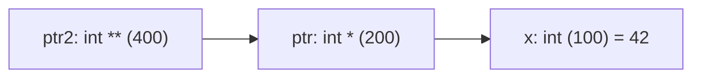
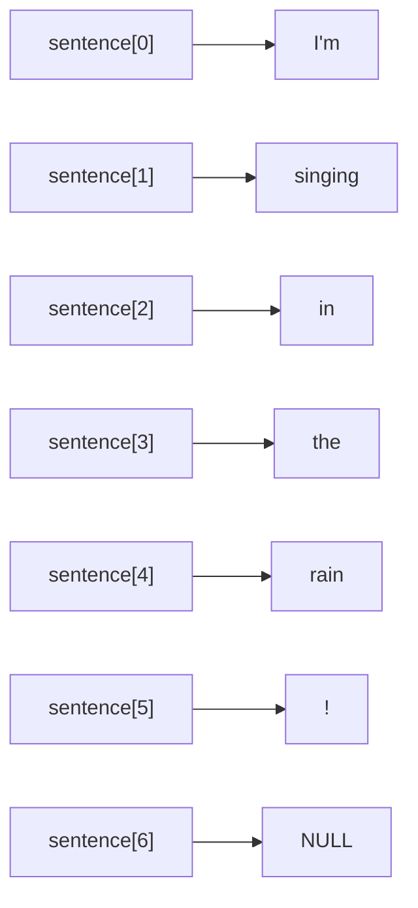
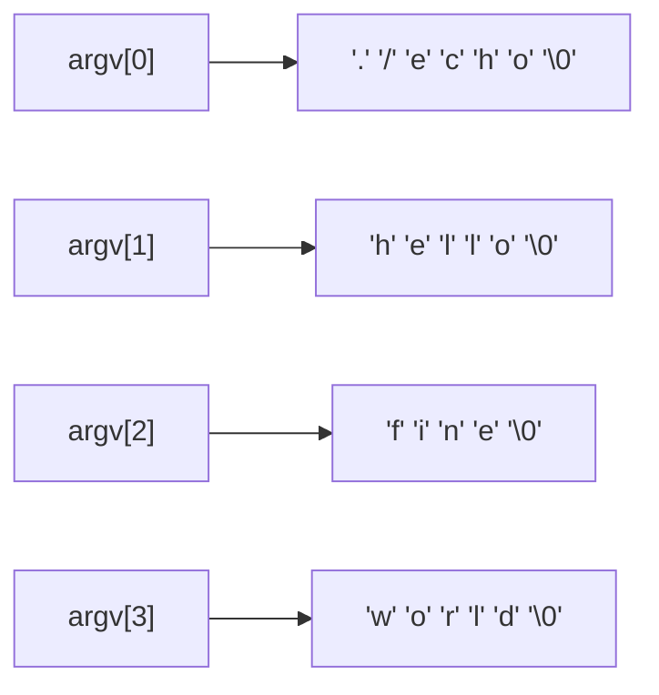

# Κεφάλαιο 12: Δείκτες και Πίνακες

<!--  -->

> **Στόχοι:** μετά από αυτό το κεφάλαιο θα μπορείτε να χρησιμοποιείτε πολυδιάστατους
> πίνακες και να υπολογίζετε πού βρίσκεται στη μνήμη το `a[i][j]`· να χειρίζεστε
> δείκτες σε δείκτες, πίνακες από δείκτες και το `argv`· να δεσμεύετε δυναμικούς
> πίνακες με `malloc`· και να εξηγείτε τι είναι το endianness.
>
> **Προαπαιτούμενα:** [Κεφάλαιο 10](../10-arrays/), [Κεφάλαιο 11](../11-pointers-recursion/)
>
> **Χρόνος μελέτης:** ~2,5 ώρες

## Σύνοψη

Η διάλεξη πηγαίνει τους πίνακες και τους δείκτες ένα βήμα πιο πέρα. Οι δισδιάστατοι
πίνακες της C είναι πίνακες από πίνακες, αποθηκευμένοι γραμμή-γραμμή σε συνεχόμενη
μνήμη, οπότε η θέση του `a[i][j]` βγαίνει με έναν απλό τύπο. Οι δείκτες σε δείκτες
και οι πίνακες από δείκτες (με κορυφαίο παράδειγμα το `argv`) προσθέτουν ένα επίπεδο
έμμεσης αναφοράς. Η `malloc` δίνει πίνακες με μέγεθος που αποφασίζεται κατά την
εκτέλεση, και το endianness εξηγεί τη σειρά των bytes ενός ακεραίου. Όλα αυτά
στηρίζουν τις δομές δεδομένων του δεύτερου μισού του μαθήματος.

## Θεωρία

### Ο πίνακας στη μνήμη

Ένας **πίνακας (array)** κρατά δεδομένα ίδιου τύπου ([Κεφάλαιο 10](../10-arrays/)).
Στη δήλωση `int bears[100];` ο **τύπος (type)** ορίζει πόση μνήμη παίρνει κάθε
στοιχείο, το **όνομα (name)** κάνει τον μεταγλωττιστή να διαλέξει μια διεύθυνση για
τον πίνακα, και το **μέγεθος (size)** πόσα στοιχεία θα κρατήσει. Το μέγεθος είναι
στατικό: δεν αλλάζει κατά την εκτέλεση. Στα στοιχεία αναφερόμαστε με τη **θέση
(index)** τους, `bears[0]` έως `bears[99]`, και αυτά κάθονται σε συνεχόμενες θέσεις.
Με `sizeof(int) == 4` και αρχή στη διεύθυνση 4:

| Bytes | 0–3 | 4–7 | 8–11 | … | 400–403 |
| --- | --- | --- | --- | --- | --- |
| Περιεχόμενο | (άλλο) | `bears[0]` | `bears[1]` | … | `bears[99]` |

Ο πίνακας πιάνει $4 \cdot 100 = 400$ bytes (4–403), και το `bears[i]` βρίσκεται στη
διεύθυνση «αρχή + `i * sizeof(int)`».

### Δισδιάστατοι πίνακες

Εικόνες, επιστημονικά και οικονομικά δεδομένα ή μια σκακιέρα έχουν φυσικά
περισσότερες **διαστάσεις (dimensions)**. Ένας **δισδιάστατος πίνακας
(two-dimensional array)** είναι πίνακας από (υπο)πίνακες:
`τύπος όνομα[γραμμές][στήλες];`. Οι **γραμμές (rows)** είναι πόσους υποπίνακες έχει
(1η διάσταση) και οι **στήλες (columns)** πόσα στοιχεία έχει ο καθένας (2η διάσταση),
άρα συνολικά γραμμές × στήλες στοιχεία. Το `a[i][j]` είναι το στοιχείο της γραμμής
`i` και της στήλης `j`, με μέτρηση από το 0, και χρησιμοποιείται όπως μια απλή
μεταβλητή. Η αρχικοποίηση δίνει μία λίστα σε αγκύλες ανά γραμμή (εδώ η γραμμή 0
είναι 1, 4, 7, 10 και η γραμμή 1 είναι 3, 6, 9, 12):

```c
int array[2][4] = {
    {1, 4, 7, 10},
    {3, 6, 9, 12},
};
```

Σε αρχικοποίηση μπορεί να παραλειφθεί μόνο το μέγεθος της **πρώτης** διάστασης
(`char arr[][2] = {{'a','b'},{'c','d'}};`, από τις σημειώσεις)· ο λόγος φαίνεται
στον υπολογισμό διευθύνσεων παρακάτω.

### Αποθήκευση κατά γραμμές και sizeof

Η μνήμη είναι μονοδιάστατη, γι' αυτό η C αποθηκεύει τον πίνακα **κατά γραμμές
(row-major order)**: όλη η γραμμή 0, αμέσως μετά η γραμμή 1. Για τον παραπάνω
`array`, με αρχή στο 100 (κάθε στοιχείο πιάνει 4 bytes):

| Bytes | 100 | 104 | 108 | 112 | 116 | 120 | 124 | 128 |
| --- | --- | --- | --- | --- | --- | --- | --- | --- |
| Τιμή | 1 | 4 | 7 | 10 | 3 | 6 | 9 | 12 |
| Στοιχείο | `[0][0]` | `[0][1]` | `[0][2]` | `[0][3]` | `[1][0]` | `[1][1]` | `[1][2]` | `[1][3]` |

Αφού ο πίνακας είναι πίνακας από πίνακες, το `array[0]` είναι από μόνο του ένας
πίνακας 4 ακεραίων (bytes 100–115) και το `array[1]` ο επόμενος (116–131). Γι' αυτό
`sizeof(array[0])` και `sizeof(array[1])` τυπώνουν 16 και `sizeof(array)` 32 (οι
διαφάνειες τυπώνουν με `%d`· για `size_t` το σωστό είναι `%zu`), και
`sizeof(array) / sizeof(array[0])` δίνει το πλήθος των γραμμών.

### Υπολογισμός διεύθυνσης στοιχείου

Για `int array[X][Y];`, για να φτάσουμε στο `a[i][j]` προσπερνάμε `i` γραμμές των `Y`
ακεραίων και μετά `j` ακεραίους:

```text
&a[i][j] = StartAddressOfArray + i * Y * sizeof(int) + j * sizeof(int)
IndexOfElementIJ = i * Y + j
```

Ο δεύτερος είναι η θέση σε έναν νοητό μονοδιάστατο πίνακα `X * Y` ακεραίων. Και οι δύο χρειάζονται **μόνο τον αριθμό `Y` των στηλών**. Γι' αυτό
η πρώτη διάσταση μπορεί να παραλειφθεί, και μια συνάρτηση που δέχεται δισδιάστατο
πίνακα γράφει την παράμετρο π.χ. `int matr[][12]` (σημειώσεις, «Πολυδιάστατοι
πίνακες»). Έλεγχος με τον πίνακα παραπάνω: το `a[1][2]` είναι στο
$100 + 1 \cdot 4 \cdot 4 + 2 \cdot 4 = 124$, όπου πράγματι βρίσκεται το 9.

### Πίνακες περισσότερων διαστάσεων

Πίνακες τριών ή περισσότερων διαστάσεων λειτουργούν με τον ίδιο τρόπο, με περισσότερα
ζεύγη αγκυλών (π.χ. `int rubiksCube[6][3][3];`), και είναι πάλι συνεχόμενοι στη μνήμη:
για `[X][Y][Z]` η θέση του `[i][j][k]` είναι `i * Y * Z + j * Z + k`. Η διάλεξη ρωτά:
**είναι απαραίτητοι οι πολυδιάστατοι πίνακες;** Όχι· μπορούμε να κρατήσουμε τα ίδια
δεδομένα σε μονοδιάστατο πίνακα και να υπολογίζουμε μόνοι μας τη θέση. Είναι όμως
βολικοί, γιατί τον λογαριασμό τον κάνει ο μεταγλωττιστής.

### Δείκτες: υπενθύμιση

Ένας **δείκτης (pointer)** κρατά μια διεύθυνση μνήμης
([Κεφάλαιο 11](../11-pointers-recursion/)). Ο μοναδιαίος `*` κάνει **αποαναφορά
(dereference)**: μετά το `int *pointer = &x;` το `*pointer` είναι ισοδύναμο με το
`x`, για ανάγνωση και για εγγραφή (αν το `x` είναι στη διεύθυνση 100, ο `pointer`
περιέχει την τιμή 100).

Στην **αριθμητική δεικτών (pointer arithmetic)**, αν ο `p` δείχνει σε `int`, ο `p + 2`
δείχνει δύο ακεραίους (όχι bytes) πιο μετά, το `*(p + 2)` ισοδυναμεί με `p[2]` και το
`p++` πάει στο επόμενο στοιχείο. Το όνομα ενός πίνακα σε έκφραση μετατρέπεται σε
δείκτη στο πρώτο του στοιχείο, άρα το `p = x;` κάνει τον `p` να δείχνει στο `x[0]`.

### Δείκτης σε δείκτη

Ένας δείκτης έχει κι αυτός διεύθυνση, που μπορεί να αποθηκευτεί σε άλλον δείκτη. Ο
**δείκτης σε δείκτη (pointer to pointer)** δηλώνεται με δύο αστερίσκους: μετά από
`int x = 42; int *ptr = &x; int **ptr2 = &ptr;` ο `ptr2` είναι δείκτης σε `int *`
(διαβάστε τον τύπο από δεξιά). Με τις διευθύνσεις της διαφάνειας:

| Μεταβλητή | Τύπος | Διεύθυνση | Τιμή |
| --- | --- | --- | --- |
| `x` | `int` | 100 | 42 |
| `ptr` | `int *` | 200 | 100 |
| `ptr2` | `int **` | 400 | 200 |



*Σχήμα: κάθε `*` ακολουθεί ένα βέλος· `*ptr2` είναι ο `ptr` (100), `**ptr2` ο `x` (42).*

Η διάλεξη ρωτά τι τυπώνει το `printf("%p %d", *ptr2, **ptr2);`: μια διεύθυνση (σε
δεκαεξαδικό, διαφορετική σε κάθε εκτέλεση) και το 42. Το ίδιο γενικεύεται σε `int ***`.
**Γιατί έχει σημασία;** Δέντρα και γράφοι είναι κόμβοι που δείχνουν σε άλλους κόμβους
([Κεφάλαιο 21](../21-lists-trees/)), και το `argv` και οι δυναμικοί δισδιάστατοι
πίνακες έχουν τύπους `char **` και `int **`.

### Πίνακες από δείκτες

Οι δείκτες μπαίνουν και σε πίνακες: ο **πίνακας από δείκτες (array of pointers)**
`int *ptr[3];` έχει τρία στοιχεία τύπου `int *`. Το `*ptr[2]` σημαίνει `*(ptr[2])`,
γιατί οι αγκύλες έχουν μεγαλύτερη προτεραιότητα από τον μοναδιαίο `*`.

Η συνηθέστερη χρήση είναι ένας πίνακας συμβολοσειρών, `char *sentence[]`: κάθε
στοιχείο δείχνει στον πρώτο χαρακτήρα μιας συμβολοσειράς, και σε αντίθεση με έναν
δισδιάστατο πίνακα `char` οι συμβολοσειρές μπορούν να έχουν διαφορετικά μήκη. Συχνά
το τελευταίο στοιχείο είναι ο **κενός δείκτης (null pointer)** `NULL`, που λειτουργεί
ως «φρουρός»: ένας βρόχος με συνθήκη `sentence[i]` σταματά εκεί χωρίς να ξέρει το
πλήθος.



*Σχήμα: πίνακας από δείκτες σε συμβολοσειρές διαφορετικού μήκους, με `NULL` στο τέλος.*

### Το argv

Το πιο γνωστό παράδειγμα πίνακα από δείκτες είναι η παράμετρος της `main` για τα
**ορίσματα γραμμής εντολών (command-line arguments)**:
`int main(int argc, char * argv[])`. Το `argc` είναι το πλήθος των ορισμάτων **μαζί με
το όνομα του προγράμματος**, και το `argv[i]` δείχνει στη συμβολοσειρά του `i`-οστού
ορίσματος. Για `./echo hello fine world` έχουμε `argc = 4`:



*Σχήμα: το `argv` για `./echo hello fine world` (`argc = 4`).*

Τα πραγματικά ορίσματα ξεκινούν από το `argv[1]`, και το `argv[argc]` είναι `NULL`
(σημειώσεις, «Ορίσματα γραμμής εντολών»). Επειδή ένας πίνακας περνά σε συνάρτηση ως
δείκτης στο πρώτο του στοιχείο, η παράμετρος γράφεται ισοδύναμα `char **argv`.

### Δυναμικοί πίνακες με malloc

Όταν το μέγεθος γίνεται γνωστό μόνο κατά την εκτέλεση (π.χ. διαβάζεται από την
είσοδο), χρησιμοποιούμε **δυναμικούς πίνακες (dynamic arrays)**:

```text
τύπος * όνομα = malloc(μέγεθος * sizeof(τύπος));
```

Η `malloc` (από το `stdlib.h`) δεσμεύει μνήμη και επιστρέφει τη διεύθυνσή της, που
την κρατά ένας δείκτης στον τύπο των στοιχείων. Το όρισμα είναι σε **bytes**, γι' αυτό
πολλαπλασιάζουμε το πλήθος με `sizeof(τύπος)`. Το
`int * array = malloc(N * sizeof(int));` δημιουργεί πίνακα `N` ακεραίων, που χάρη στην
αριθμητική δεικτών χρησιμοποιείται κανονικά, από `array[0]` έως `array[N - 1]`. Η
μνήμη αυτή βρίσκεται στον **σωρό (heap)**, το θέμα του [Κεφαλαίου 13](../13-memory/).

Από τις σημειώσεις: η `malloc` δεν αρχικοποιεί τη μνήμη (οι τιμές 1, 3, 3, 7 της
διαφάνειας είναι ενδεικτικές)· αν αποτύχει επιστρέφει `NULL`, οπότε ελέγχουμε πάντα
το αποτέλεσμα· και ό,τι δεσμεύσαμε το αποδεσμεύουμε με `free`. Το `sizeof` ενός
δείκτη είναι το μέγεθος μιας διεύθυνσης (8 bytes σε σύστημα 64 bit), όχι του μπλοκ,
οπότε το πλήθος των στοιχείων το κρατάμε σε μεταβλητή. Ένας δυναμικός δισδιάστατος
πίνακας `N × M` φτιάχνεται με έναν `int **` που δείχνει σε `N` δείκτες γραμμών, με
κάθε γραμμή από δική της `malloc`, ή με έναν μονοδιάστατο πίνακα `N * M` και τη θέση
`i * M + j`.

### Endianness

Ένας `int` αποτελείται από πολλά bytes. **Endianness** λέμε τη σειρά με την οποία
αποθηκεύονται: **little endian** από το μικρότερο (λιγότερο σημαντικό) byte προς το
μεγαλύτερο, **big endian** αντίστροφα. Για τα διαδοχικά bytes `68 65 6c 6c` (ASCII
`'h' 'e' 'l' 'l'`):

| Μηχάνημα | byte +0 | byte +1 | byte +2 | byte +3 | Ακέραιος |
| --- | --- | --- | --- | --- | --- |
| little endian | `68` | `65` | `6c` | `6c` | `0x6c6c6568` |
| big endian | `68` | `65` | `6c` | `6c` | `0x68656c6c` |

Οι x86 και οι περισσότεροι ARM είναι little endian (τα σχήματα μνήμης των διαφανειών
για τους δείκτες είναι σχεδιασμένα big endian, που διαβάζεται ευκολότερα). Το
endianness μετράει σε δυαδικά δεδομένα, π.χ. κεφαλίδες αρχείων εικόνας και ήχου.

## Παραδείγματα

### Η σκακιέρα

Εφαρμόζει τους «Δισδιάστατους πίνακες»: κάθε κελί είναι ένας `char` (κεφαλαία για τον
έναν παίκτη, πεζά για τον άλλο, κενό για άδειο τετράγωνο).

```c
#include <stdio.h>

int main() {
    char chessBoard[8][8] = {
        {'R', 'N', 'B', 'Q', 'K', 'B', 'N', 'R'},
        {'P', 'P', 'P', 'P', 'P', 'P', 'P', 'P'},
        {' ', ' ', ' ', ' ', ' ', ' ', ' ', ' '},
        {' ', ' ', ' ', ' ', ' ', ' ', ' ', ' '},
        {' ', ' ', ' ', ' ', ' ', ' ', ' ', ' '},
        {' ', ' ', ' ', ' ', ' ', ' ', ' ', ' '},
        {'p', 'p', 'p', 'p', 'p', 'p', 'p', 'p'},
        {'r', 'n', 'b', 'q', 'k', 'b', 'n', 'r'}
    };
    chessBoard[1][4] = ' ';
    chessBoard[3][4] = 'p';
    return 0;
}
```

Οι δύο αναθέσεις κάνουν την κίνηση e2–e4 (γραμμή 1 → γραμμή 3, στήλη 4). Με τη
σύμβαση του πίνακα το πιόνι θα έπρεπε να είναι `'P'`· η διαφάνεια γράφει `'p'`. Για
εκτύπωση, ο εξωτερικός βρόχος διατρέχει τις γραμμές και ο εσωτερικός τις στήλες.

### Ο κύβος του Rubik

Εφαρμόζει τους «Πίνακες περισσότερων διαστάσεων»: 6 έδρες × 3 × 3 = 54 ακέραιοι.

```c
int rubiksCube[6][3][3] = {
    {{0, 0, 0}, {0, 0, 0}, {0, 0, 0}}, // Face 1 (e.g., Red)
    {{1, 1, 1}, {1, 1, 1}, {1, 1, 1}}, // Face 2 (e.g., Green)
    {{2, 2, 2}, {2, 2, 2}, {2, 2, 2}}, // Face 3 (e.g., Blue)
    {{3, 3, 3}, {3, 3, 3}, {3, 3, 3}}, // Face 4 (e.g., Yellow)
    {{4, 4, 4}, {4, 4, 4}, {4, 4, 4}}, // Face 5 (e.g., Orange)
    {{5, 5, 5}, {5, 5, 5}, {5, 5, 5}}  // Face 6 (e.g., White)
};
```

### Βρόχος με αριθμητική δεικτών

Εφαρμόζει τη «Δείκτες: υπενθύμιση». Ποια είναι τα περιεχόμενα του `x` μετά την
εκτέλεση;

```c
int * p;
int x[] = {5, 7, 2, 3, 6, 0, 1, 4};
p = x;
while (*p = *(p+2))
  p++;
```

Η συνθήκη είναι **ανάθεση**: αντιγράφει στο `*p` την τιμή δύο θέσεις πιο μετά, και
αφού η τιμή μιας ανάθεσης είναι η τιμή που ανατέθηκε, ο βρόχος σταματά μόλις
αντιγραφεί ένα 0. Ο πίνακας αλλάζει όσο τρέχει ο βρόχος, οπότε ιχνηλατήστε βήμα-βήμα.
Για όσους δυσκολεύονται με τους δείκτες, η διάλεξη προτείνει το βίντεο των βοηθών
(δείτε το Διάβασμα).

### Πίνακας από δείκτες σε ακεραίους

Εφαρμόζει τους «Πίνακες από δείκτες»:

```c
#include <stdio.h>
int main() {
  int *ptr[3], a = 100, b = 200, c = 300;
  ptr[0] = &a;
  ptr[1] = &b;
  ptr[2] = &c;
  printf("%d %d %d\n", *ptr[2], *ptr[1], *ptr[0]);
  return 0;
}
```

```text
$ ./example
300 200 100
```

### Μια πρόταση ως πίνακας από συμβολοσειρές

Εφαρμόζει τους «Πίνακες από δείκτες» με φρουρό `NULL`:

```c
#include <stdio.h>
int main() {
  char *sentence[] = {
      "I'm", "singing", "in", "the", "rain", "!", NULL
  };
  int i;
  for(i = 0 ; sentence[i]; i++) {
      printf("%s\n", sentence[i]);
  }
  return 0;
}
```

```text
$ ./sentence
I'm
singing
in
the
rain
!
```

### Ένα απλό echo

Εφαρμόζει «Το argv»: τυπώνει όλα τα ορίσματα, μαζί με το όνομα του προγράμματος. Για
ορίσματα-αριθμούς (π.χ. `argcalc.c` του εργαστηρίου 8) χρειάζεται η `atoi`.

```c
#include <stdio.h>
int main(int argc, char * argv[]) {
  int i;
  for(i = 0 ; i < argc ; i++) {
    printf("%s\n", argv[i]);
  }
  return 0;
}
```

```text
$ ./echo hello fine world
./echo
hello
fine
world
```

### Πόση μνήμη δεσμεύει η malloc

Εφαρμόζει τους «Δυναμικούς πίνακες». Πόση μνήμη δεσμεύει κάθε κλήση και τι τυπώνει το
`printf`;

```c
int * nums = malloc(100 * sizeof(int));
double * coeffs = malloc(100 * sizeof(double));
char * str = malloc(100 * sizeof(char));
printf("%zu %zu %zu\n", sizeof(nums), sizeof(coeffs), sizeof(str));
```

```text
$ ./dynamic
8 8 8
```

Κάθε κλήση δεσμεύει `100 * sizeof(τύπος)` bytes, αλλά το `printf` τυπώνει το μέγεθος
των ίδιων των δεικτών: 8 bytes ο καθένας σε σύστημα 64 bit. Για την άσκηση `array.c`
του εργαστηρίου 7: διαβάστε το `N`, δεσμεύστε, ελέγξτε για `NULL`, και στο τέλος
`free`.

### Βλέποντας τα bytes ενός ακεραίου

Εφαρμόζει το «Endianness». Μετατρέπουμε (cast) τη διεύθυνση του `x` σε `char *`, που
προχωρά ένα byte τη φορά. Τι θα τυπώσει;

```c
#include <stdio.h>
int main() {
  int x = 42;
  char * bytes = (char*)&x;
  int i;
  for(i = 0; i < sizeof(int) / sizeof(char); i++)
     printf("%02x\n", bytes[i]);
  return 0;
}
```

```text
$ ./int
2a
00
00
00
```

Το 42 είναι `0x0000002a`· πρώτο τυπώνεται το λιγότερο σημαντικό byte, άρα το
μηχάνημα είναι little endian. Επειδή το `char` είναι συνήθως προσημασμένο, ένα byte
`0x80` θα έβγαινε `ffffff80` με `%02x`· με `unsigned char *` αυτό δεν συμβαίνει.

## Κύρια σημεία

1. Ένας δισδιάστατος πίνακας είναι πίνακας από πίνακες, `τύπος όνομα[γραμμές][στήλες]`,
   αρχικοποιείται με μία λίστα ανά γραμμή, και το `a[i][j]` είναι μια απλή μεταβλητή.
2. Αποθηκεύεται κατά γραμμές σε συνεχόμενη μνήμη· `sizeof(array[0])` είναι μία γραμμή,
   `sizeof(array)` όλος ο πίνακας.
3. Για `int array[X][Y]` η θέση του `a[i][j]` είναι `i * Y + j`: χρειάζεται μόνο το `Y`,
   γι' αυτό μόνο η πρώτη διάσταση μπορεί να παραλειφθεί.
4. Πίνακες περισσότερων διαστάσεων λειτουργούν ίδια· δεν είναι απαραίτητοι, αλλά
   απλοποιούν τον κώδικα.
5. Το `*pointer` ισοδυναμεί με τη μεταβλητή όπου δείχνει ο δείκτης· ένας `int **`
   κρατά τη διεύθυνση ενός δείκτη, και κάθε `*` ακολουθεί ένα επίπεδο.
6. Οι δείκτες μπαίνουν σε πίνακες· ένας πίνακας `char *` με `NULL` στο τέλος κρατά
   συμβολοσειρές διαφορετικού μήκους.
7. Το `argv` είναι πίνακας από `char *` (ισοδύναμα `char **`) με `argc` στοιχεία, και
   το `argv[0]` είναι το όνομα του προγράμματος.
8. Το `malloc(μέγεθος * sizeof(τύπος))` φτιάχνει στον σωρό πίνακα με μέγεθος που
   αποφασίζεται κατά την εκτέλεση· το `sizeof` του δείκτη είναι 8, όχι το μέγεθος του
   μπλοκ.
9. Endianness είναι η σειρά των bytes ενός ακεραίου: στο little endian πρώτο είναι το
   λιγότερο σημαντικό· με έναν `char *` το διαπιστώνουμε.

## Ορολογία

| Ελληνικά | English | Σύντομος ορισμός |
| --- | --- | --- |
| πίνακας / θέση | array / index | Στοιχεία ίδιου τύπου σε συνεχόμενη μνήμη / ο `i` στο `a[i]`. |
| δισδιάστατος πίνακας | two-dimensional array | Πίνακας από πίνακες, `a[γραμμές][στήλες]`. |
| αποθήκευση κατά γραμμές | row-major order | Οι γραμμές αποθηκεύονται η μία μετά την άλλη. |
| αποαναφορά | dereference | Πρόσβαση με `*` εκεί όπου δείχνει ένας δείκτης. |
| δείκτης σε δείκτη | pointer to pointer | Δείκτης που κρατά διεύθυνση δείκτη, π.χ. `int **`. |
| πίνακας από δείκτες | array of pointers | Πίνακας με στοιχεία τύπου δείκτη, π.χ. `char *s[5]`. |
| κενός δείκτης | null pointer (`NULL`) | Δείκτης που δεν δείχνει πουθενά· συχνά σημαδεύει το τέλος. |
| ορίσματα γραμμής εντολών | command-line arguments | Οι λέξεις της κλήσης, στα `argc`/`argv`. |
| δυναμικός πίνακας | dynamic array | Πίνακας με μέγεθος που αποφασίζεται κατά την εκτέλεση. |
| σωρός | heap | Η περιοχή μνήμης από την οποία δεσμεύει η `malloc`. |
| σειρά bytes | endianness | Η σειρά αποθήκευσης των bytes ενός ακεραίου. |

## Συχνά λάθη

- **`a[i, j]` αντί για `a[i][j]`.** Το κόμμα είναι τελεστής, άρα σημαίνει `a[j]`.
- **Μπέρδεμα γραμμών και στηλών.** Στο `int a[2][4]` το `a[3][1]` είναι εκτός ορίων
  (`Segmentation fault`): ο πρώτος δείκτης είναι η γραμμή.
- **Παράλειψη της δεύτερης διάστασης.** Το `int m[][] = {{1, 2}, {3, 4}};` δίνει
  `array type has incomplete element type`. Γράψτε `int m[][2]`.
- **`sizeof` δείκτη ως μέγεθος πίνακα** (8, όχι 400) ή **`sizeof` με `%d`**
  (`format '%d' expects argument of type 'int'`): κρατήστε το πλήθος σε μεταβλητή
  και τυπώνετε το `sizeof` με `%zu`.
- **Ξεχασμένο `sizeof` ή `stdlib.h` στη `malloc`.** Το `malloc(100)` χωρά μόνο 25
  `int`· χωρίς `#include <stdlib.h>` ο `gcc` λέει
  `implicit declaration of function 'malloc'`.
- **Χωρίς έλεγχο για `NULL` ή αρχικοποίηση.** Η `malloc` μπορεί να αποτύχει και δεν
  μηδενίζει τη μνήμη: ελέγξτε `if (array == NULL)` και γράψτε πριν διαβάσετε.
- **`argv[1]` χωρίς έλεγχο του `argc`.** Χωρίς όρισμα το `argv[1]` είναι `NULL` και το
  `atoi(argv[1])` δίνει `Segmentation fault`. Ελέγξτε `if (argc < 2)`· και θυμηθείτε
  ότι για `./prog a b c` το `argc` είναι 4.
- **Πίνακας από δείκτες χωρίς φρουρό `NULL`.** Το `for (i = 0; sentence[i]; i++)`
  βγαίνει έξω από τον πίνακα.

## Διάβασμα

- **Διαφάνειες:** [Διάλεξη 12](https://github.com/progintro/progintro.github.io/releases/download/2025/lec12.pdf),
  σελ. 1–45: μονοδιάστατοι πίνακες 5–10· δισδιάστατοι 11–22· πολυδιάστατοι 23·
  δείκτες σε δείκτες 24–28· πίνακες από δείκτες και `argv` 29–35· `malloc` 36–40·
  endianness 41–43.
- **Σημειώσεις:** η διάλεξη ζητά να διαβάσετε τις σελ. 73–103:
  - [Κεφάλαιο 5](https://progintro.github.io/notes/chapters/05-pointers-arrays/):
    «Δείκτες» (K04, σελ. 72–77), «Περί ανάγνωσης ακεραίων (και όχι μόνο)» (78–79),
    «Πίνακες» (80–85), «Ιστόγραμμα συχνοτήτων γραμμάτων στην είσοδο» (86–87).
  - [Κεφάλαιο 6](https://progintro.github.io/notes/chapters/06-memory-strings/):
    «Δυναμική δέσμευση μνήμης» (K04, σελ. 88–92), «Συμβολοσειρές» (93–96), «Πίνακες
    δεικτών και δείκτες σε δείκτες» (97), «Ορίσματα γραμμής εντολών» (98–99),
    «Πολυδιάστατοι πίνακες» (100–102), «Αρχικοποίηση πινάκων» (103).
- **Εργαστήριο:** [Εργαστήριο 6](https://progintro.github.io/lab-material/labs/lab06/):
  `pointers.c`· [Εργαστήριο 7](https://progintro.github.io/lab-material/labs/lab07/):
  `twodim.c`, `array.c`, `mines.c`·
  [Εργαστήριο 8](https://progintro.github.io/lab-material/labs/lab08/): `argcalc.c`.
- **Άλλα:** [Endianness](https://en.wikipedia.org/wiki/Endianness) (Wikipedia)· βίντεο
  [«Εισαγωγή στους Pointers»](http://www.youtube.com/watch?v=tH2JW8HsPNw) από τους
  βοηθούς του μαθήματος· `man 3 malloc`.

## Ασκήσεις

<!-- exercises -->

### Από τις διαφάνειες

- [Στοιχείο δισδιάστατου πίνακα](../../questions/slides/slides-lec12-2d-element.md): Διάλεξη 12, διαφάνεια 14 · ★☆☆ · trace
- [Πίνακας από δείκτες](../../questions/slides/slides-lec12-array-of-pointers.md): Διάλεξη 12, διαφάνεια 29 · ★☆☆ · trace
- [Δείκτης σε δείκτη](../../questions/slides/slides-lec12-pointer-to-pointer.md): Διάλεξη 12, διαφάνεια 27 · ★☆☆ · trace
- [Παράδειγμα endianness](../../questions/slides/slides-lec12-endianness.md): Διάλεξη 12, διαφάνεια 42 · ★★☆ · trace
- [Πόση μνήμη δεσμεύει η malloc και τι λέει το sizeof](../../questions/slides/slides-lec12-malloc-sizeof.md): Διάλεξη 12, διαφάνειες 39–40 · ★★☆ · short-answer
- [Είναι απαραίτητοι οι πολυδιάστατοι πίνακες;](../../questions/slides/slides-lec12-multidim-necessary.md): Διάλεξη 12, διαφάνεια 23 · ★★☆ · short-answer
- [Περιεχόμενα του x μετά από βρόχο με δείκτη](../../questions/slides/slides-lec12-pointer-copy-loop.md): Διάλεξη 12, διαφάνεια 25 · ★★☆ · trace

### Από τα εργαστήρια

- [Δυναμική δέσμευση μνήμης για μονοδιάστατο πίνακα](../../questions/labs/lab-lab07-array.md): Εργαστήριο 7, Άσκηση 2 · ★☆☆ · programming
- [Ορίσματα γραμμής εντολής](../../questions/labs/lab-lab08-argcalc.md): Εργαστήριο 8, Άσκηση 2 · ★☆☆ · programming
- [Δισδιάστατοι πίνακες](../../questions/labs/lab-lab07-twodim.md): Εργαστήριο 7, Άσκηση 1 · ★★☆ · programming
- [Πετυχαίνοντας τον στόχο (Παλιό θέμα)](../../questions/labs/lab-lab08-legolas.md): Εργαστήριο 8, Άσκηση 3 · ★★☆ · programming

### Από τις εργασίες

- [FauxtoShop: περιστροφή εικόνας BMP](../../questions/homework/hw-2023-hw2-fauxtoshop.md): Εργασία 2 (2023-24), Άσκηση 1 · ★★★ · programming

### Από τα θέματα εξετάσεων

- [Αλλαγή Τέρματος](../../questions/exams/exam-2023-fall-ex13-q2.md): Online τελική εξέταση Δεκεμβρίου 2023, Εξέταση #13, Θέμα 2 · ★☆☆ · programming
- [Τουρνουά](../../questions/exams/exam-2023-fall-ex2-q2.md): Online τελική εξέταση Δεκεμβρίου 2023, Εξέταση #2 (Pokémon Themed), Θέμα 2 · ★☆☆ · programming
- [Μέση Τιμή Τυχαίων Μεταβλητών - mean](../../questions/exams/exam-2025-sep-q3.md): Εξέταση Σεπτεμβρίου 2025, Θέμα 3 · ★☆☆ · programming
- [Περιστροφή Πίνακα](../../questions/exams/exam-2023-fall-ex1-q3.md): Online τελική εξέταση Δεκεμβρίου 2023, Εξέταση #1 (Coreutils Themed), Θέμα 3 · ★★☆ · programming
- [Κινήσεις σε Πλέγμα](../../questions/exams/exam-2023-fall-ex11-q3.md): Online τελική εξέταση Δεκεμβρίου 2023, Εξέταση #11, Θέμα 3 · ★★☆ · programming
- [Πολλαπλασιασμός Πινάκων](../../questions/exams/exam-2023-fall-ex8-q3.md): Online τελική εξέταση Δεκεμβρίου 2023, Εξέταση #8, Θέμα 3 · ★★☆ · programming
- [Πολύτιμοι Πίνακες](../../questions/exams/exam-2023-fall-ex9-q3.md): Online τελική εξέταση Δεκεμβρίου 2023, Εξέταση #9, Θέμα 3 · ★★☆ · programming
- [Στατιστικές](../../questions/exams/exam-2024-jul-q2.md): Εξέταση Ιουλίου 2024, Θέμα 2 · ★★☆ · programming
- [Κινούμενος Μέσος Όρος - sma](../../questions/exams/exam-2025-jan-q3.md): Εξέταση Ιανουαρίου 2025, Θέμα 3 · ★★☆ · programming
- [Το μεγαλύτερο άλμα - polevault](../../questions/exams/exam-2026-sep-q3.md): Εξέταση Σεπτεμβρίου 2026, Θέμα 3 · ★★☆ · programming

### Από τα Kahoot στο αμφιθέατρο

- [Διεύθυνση στοιχείου δισδιάστατου πίνακα](../../questions/kahoot/kahoot-2d-element-address.md): Kahoot «Πίνακες και Δείκτες» (διάλεξη 12) · ★★★ · multiple-choice · 33% σωστές απαντήσεις
- [Χαρακτήρας από πίνακα συμβολοσειρών](../../questions/kahoot/kahoot-string-array-element.md): Kahoot «Δείκτες Παντού!» (διάλεξη 12) και «Πίνακες και Δείκτες» (διάλεξη 12) · ★★★ · multiple-choice · 38% σωστές απαντήσεις
- [sizeof μιας γραμμής](../../questions/kahoot/kahoot-sizeof-row.md): Kahoot «Πίνακες και Δείκτες» (διάλεξη 12) · ★★☆ · multiple-choice · 42% σωστές απαντήσεις
- [Ο τύπος του argv](../../questions/kahoot/kahoot-argv-type.md): Kahoot «Δείκτες Παντού!» (διάλεξη 12) και «Πίνακες και Δείκτες» (διάλεξη 12) · ★★☆ · multiple-choice · 44% σωστές απαντήσεις
- [Το τελευταίο στοιχείο δισδιάστατου πίνακα](../../questions/kahoot/kahoot-2d-last-element.md): Kahoot «Πίνακες και Δείκτες» (διάλεξη 12) · ★★☆ · multiple-choice · 67% σωστές απαντήσεις
- [sizeof δισδιάστατου πίνακα](../../questions/kahoot/kahoot-sizeof-2d-double.md): Kahoot «Πίνακες και Δείκτες» (διάλεξη 12) · ★★☆ · multiple-choice · 68% σωστές απαντήσεις
- [Πλήθος στοιχείων δισδιάστατου πίνακα](../../questions/kahoot/kahoot-2d-array-count.md): Kahoot «Δείκτες Παντού!» (διάλεξη 12) και «Πίνακες και Δείκτες» (διάλεξη 12) · ★☆☆ · multiple-choice · 81% σωστές απαντήσεις
- [Στατικοί και δυναμικοί πίνακες](../../questions/kahoot/kahoot-static-vs-dynamic-arrays.md): Kahoot «Δείκτες Παντού!» (διάλεξη 12) και «Πίνακες και Δείκτες» (διάλεξη 12) · ★☆☆ · multiple-choice · 92% σωστές απαντήσεις
- [Διαστάσεις πίνακα](../../questions/kahoot/kahoot-3d-array-dims.md): Kahoot «Δείκτες Παντού!» (διάλεξη 12) και «Πίνακες και Δείκτες» (διάλεξη 12) · ★☆☆ · multiple-choice · 93% σωστές απαντήσεις

### Σχετικές ασκήσεις από άλλα κεφάλαια

- [Άρτια Bits](../../questions/exams/exam-2023-fall-ex8-q1.md): Online τελική εξέταση Δεκεμβρίου 2023, Εξέταση #8, Θέμα 1 · ★☆☆ · programming (κεφ. 4)
- [Πετυχαίνοντας τον Στόχο](../../questions/exams/exam-2023-fall-ex9-q2.md): Online τελική εξέταση Δεκεμβρίου 2023, Εξέταση #9, Θέμα 2 · ★★☆ · programming (κεφ. 6)
- [Επεξεργασία Ήχου (soundwave)](../../questions/homework/hw-2025-hw1-soundwave.md): Εργασία 1 (2025-26), Άσκηση 1 · ★★★ · programming (κεφ. 9)
- [Τοποθέτηση του Pacman](../../questions/exams/exam-2023-fall-ex11-q2.md): Online τελική εξέταση Δεκεμβρίου 2023, Εξέταση #11, Θέμα 2 · ★★☆ · programming (κεφ. 10)
- [Φορτωμένο Έλκηθρο](../../questions/exams/exam-2023-fall-ex3-q2.md): Online τελική εξέταση Δεκεμβρίου 2023, Εξέταση #3 (Frozen Themed), Θέμα 2 · ★★☆ · programming (κεφ. 10)
- [Μαγικό Ζευγάρι](../../questions/exams/exam-2023-fall-ex5-q2.md): Online τελική εξέταση Δεκεμβρίου 2023, Εξέταση #5 (HP Themed), Θέμα 2 · ★★☆ · programming (κεφ. 10)
- [Ο Αλγόριθμος του Ευκλείδη (gcd)](../../questions/homework/hw-2024-hw1-gcd.md): Εργασία 1 (2024-25), Άσκηση 1 · ★★☆ · programming (κεφ. 11)
- [Ο Αλγόριθμος RSA (rsa)](../../questions/homework/hw-2024-hw1-rsa.md): Εργασία 1 (2024-25), Άσκηση 2 · ★★★ · programming (κεφ. 11)
- [Πίνακες και αριθμητική δεικτών](../../questions/labs/lab-lab06-pointers.md): Εργαστήριο 6, Άσκηση 3 · ★★☆ · trace (κεφ. 11)
- [Δυναμική δέσμευση μνήμης για δισδιάστατο πίνακα](../../questions/labs/lab-lab07-mines.md): Εργαστήριο 7, Άσκηση 3 · ★★☆ · programming (κεφ. 13)
- [Κινήσεις σε πλέγμα (Παλιό θέμα)](../../questions/labs/lab-lab07-pacman.md): Εργαστήριο 7, Άσκηση 5 · ★★★ · programming (κεφ. 13)
- [Δυναμικός δισδιάστατος πίνακας MxN](../../questions/slides/slides-lec13-dynamic-2d.md): Διάλεξη 13, διαφάνειες 56–58 · ★★☆ · programming (κεφ. 13)
- [Ταιριαστές Καρδιές](../../questions/exams/exam-2023-fall-ex0-q2.md): Online τελική εξέταση Δεκεμβρίου 2023, Εξέταση #0 (Valentine's Themed), Θέμα 2 · ★★☆ · programming (κεφ. 14)
- [Εντοπισμός Διπλών Ορισμάτων](../../questions/exams/exam-2023-fall-ex1-q2.md): Online τελική εξέταση Δεκεμβρίου 2023, Εξέταση #1 (Coreutils Themed), Θέμα 2 · ★★☆ · programming (κεφ. 14)
- [Μεταμορφώσιμες Προτάσεις](../../questions/exams/exam-2023-fall-ex5-q4.md): Online τελική εξέταση Δεκεμβρίου 2023, Εξέταση #5 (HP Themed), Θέμα 4 · ★★★ · programming (κεφ. 14)
- [Η συνάρτηση transform](../../questions/exams/exam-2025-sep-q2.md): Εξέταση Σεπτεμβρίου 2025, Θέμα 2 · ★☆☆ · trace (κεφ. 14)
- [Επεξεργασία συμβολοσειρών](../../questions/labs/lab-lab08-string.md): Εργαστήριο 8, Άσκηση 1 · ★★☆ · programming (κεφ. 14)
- [Είναι το πρώτο όρισμα "--boo";](../../questions/slides/slides-lec14-check-boo.md): Διάλεξη 14, διαφάνεια 42 · ★☆☆ · programming (κεφ. 14)
- [Πολυπλοκότητα πολλαπλασιασμού πινάκων](../../questions/kahoot/kahoot-matrix-multiplication.md): Kahoot «Δυαδική Αναζήτηση, Ταξινόμηση, Πολυπλοκότητα και άλλα» και «Πολυπλοκότητα και άλλα» (διάλεξη 15) · ★★☆ · multiple-choice · 49% σωστές απαντήσεις (κεφ. 15)
- [Πολυπλοκότητα εύρεσης μέγιστου σε πίνακα N x N](../../questions/slides/slides-lec15-complexity-find-max-2d.md): Διάλεξη 15, διαφάνεια 23 · ★☆☆ · short-answer (κεφ. 15)
- [Πολυπλοκότητα δυναμικού πίνακα με malloc](../../questions/slides/slides-lec15-complexity-malloc.md): Διάλεξη 15, διαφάνεια 19 · ★☆☆ · short-answer (κεφ. 15)
- [char *array[], char **array και char array[10][10]](../../questions/slides/slides-lec16-char-pointer-arrays.md): Διάλεξη 16, διαφάνεια 19 · ★★☆ · short-answer (κεφ. 16)
- [yes αν ένα στοιχείο υπάρχει σε δισδιάστατο πίνακα](../../questions/slides/slides-lec16-search-2d.md): Διάλεξη 16, διαφάνεια 24 · ★☆☆ · programming (κεφ. 16)
- [Πλησιάζοντας στον Στόχο](../../questions/exams/exam-2023-fall-ex10-q4.md): Online τελική εξέταση Δεκεμβρίου 2023, Εξέταση #10, Θέμα 4 · ★★☆ · programming (κεφ. 17)
- [Η συνάρτηση compute](../../questions/exams/exam-2026-jan-q2.md): Εξέταση Ιανουαρίου 2026, Θέμα 2 · ★★☆ · trace (κεφ. 17)
- [Αλλαγή Μεγέθους](../../questions/exams/exam-2023-fall-ex4-q4.md): Online τελική εξέταση Δεκεμβρίου 2023, Εξέταση #4 (Rick Astley Themed), Θέμα 4 · ★★☆ · programming (κεφ. 18)
- [Κόψιμο Αρχείων](../../questions/exams/exam-2023-fall-ex7-q4.md): Online τελική εξέταση Δεκεμβρίου 2023, Εξέταση #7 (Star Wars Themed), Θέμα 4 · ★☆☆ · programming (κεφ. 18)
- [Προβλέποντας το Μέλλον (future)](../../questions/homework/hw-2024-hw2-future.md): Εργασία 2 (2024-25), Άσκηση 1 · ★★☆ · programming (κεφ. 18)
- [Μέτρηση στατιστικών αρχείων](../../questions/labs/lab-lab10-count.md): Εργαστήριο 10, Άσκηση 4 · ★☆☆ · programming (κεφ. 18)
- [Σύγκριση αρχείων](../../questions/labs/lab-lab10-filediff.md): Εργαστήριο 10, Άσκηση 3 · ★☆☆ · programming (κεφ. 18)
- [Αρχεία κειμένου](../../questions/labs/lab-lab10-more.md): Εργαστήριο 10, Άσκηση 1 · ★★☆ · programming (κεφ. 18)
- [Μέγεθος δισδιάστατου πίνακα και μιας γραμμής του](../../questions/slides/slides-lec18-2d-sizeof.md): Διάλεξη 18, διαφάνεια 2 · ★☆☆ · short-answer (κεφ. 18)
- [Ακέραιοι από αρχείο κειμένου με fread](../../questions/slides/slides-lec18-fread-int.md): Διάλεξη 18, διαφάνειες 50–51 · ★★☆ · trace (κεφ. 18)
- [Μια λέξη σε char[7] με scanf](../../questions/slides/slides-lec18-scanf-string.md): Διάλεξη 18, διαφάνειες 31–35 · ★★☆ · debug (κεφ. 18)
- [Zoomba: συντομότερη διαδρομή σε δωμάτιο](../../questions/homework/hw-2023-hw3-zoomba.md): Εργασία 3 (2023-24), Άσκηση 1 · ★★★ · programming (κεφ. 22)
- [Λύσε τον Λαβύρινθο](../../questions/exams/exam-2024-dec-q4.md): Κατατακτήριες Δεκεμβρίου 2024, Θέμα 4 · ★★★ · programming (κεφ. 25)
- [Γεμίζοντας με χρώμα](../../questions/exams/exam-2024-sep-q6.md): Εξέταση Σεπτεμβρίου 2024, Θέμα 6 · ★★★ · programming (κεφ. 25)
- [Το Καλό το Μονοπάτι - path](../../questions/exams/exam-2025-sep-q5.md): Εξέταση Σεπτεμβρίου 2025, Θέμα 5 · ★★★ · programming (κεφ. 25)
- [Περικύκλωση - encirclement](../../questions/exams/exam-2026-jan-q5.md): Εξέταση Ιανουαρίου 2026, Θέμα 5 · ★★★ · programming (κεφ. 25)

<!-- /exercises -->

## Ερωτήσεις αυτοαξιολόγησης

1. Πόσα bytes έχει ο `double m[3][5];` (`sizeof(double) == 8`), και πού βρίσκεται το
   `a[2][3]` του `int a[10][20];` αν αυτός ξεκινά στο 1000;[^q1]
2. Γιατί ο αριθμός των γραμμών δεν εμφανίζεται στον τύπο της διεύθυνσης του
   `a[i][j]`;[^q2]
3. Για `./prog one two`, ποιο είναι το `argc` και τι περιέχει το `argv[0]`;[^q3]
4. Τι δεσμεύει το `malloc(100 * sizeof(double))` και πόσο είναι το `sizeof` του
   δείκτη που το κρατά;[^q4]
5. Με ποια σειρά βρίσκονται τα bytes του `0x12345678` σε little endian;[^q5]

[^q1]: 120 bytes· $1000 + 2 \cdot 20 \cdot 4 + 3 \cdot 4 = 1172$.

[^q2]: Για να φτάσουμε στη γραμμή `i` προσπερνάμε `i` γραμμές μήκους `Y`.

[^q3]: `argc` είναι 3 και το `argv[0]` δείχνει στο `"./prog"`.

[^q4]: 800 bytes στον σωρό· ο δείκτης είναι 8 bytes σε σύστημα 64 bit.

[^q5]: `78`, `56`, `34`, `12`.

<!--  -->
