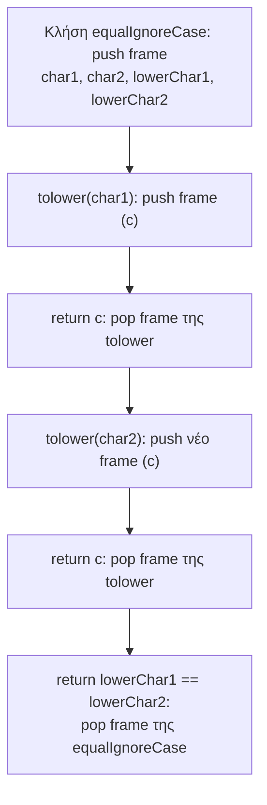
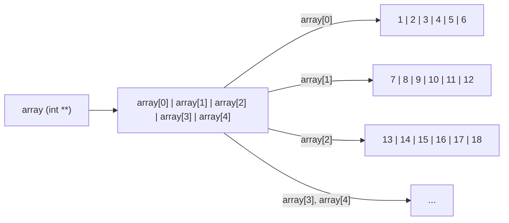

# Κεφάλαιο 13: Μνήμη

<!--  -->

> **Στόχοι:** μετά από αυτό το κεφάλαιο θα μπορείτε να
> εξηγείτε τι είναι το endianness και να το διαπιστώνετε με έναν `char *`· να
> ξεχωρίζετε τη στοίβα από τον σωρό και να λέτε τι αποθηκεύεται στην καθεμία· να
> σχεδιάζετε τα stack frames μιας σειράς κλήσεων συναρτήσεων· να εξηγείτε γιατί η
> ατέρμονη αναδρομή και οι τεράστιοι τοπικοί πίνακες δίνουν `Segmentation fault`·
> και να δεσμεύετε, να μεγαλώνετε και να αποδεσμεύετε μνήμη στον σωρό με `malloc`,
> `calloc`, `realloc` και `free`, και για δισδιάστατους πίνακες.
>
> **Προαπαιτούμενα:** [Κεφάλαιο 3](../03-functions/), [Κεφάλαιο 11](../11-pointers-recursion/), [Κεφάλαιο 12](../12-pointers-arrays/)
>
> **Χρόνος μελέτης:** ~3 ώρες

## Σύνοψη

Μέχρι τώρα οι μεταβλητές μας «απλώς υπήρχαν»: τις δηλώναμε και ο μεταγλωττιστής
φρόντιζε για τη μνήμη τους. Η διάλεξη αυτή ανοίγει το καπό και δείχνει πού ακριβώς
ζουν τα δεδομένα ενός προγράμματος C. Ξεκινά με το endianness, δηλαδή τη σειρά των
bytes ενός ακεραίου, και περνά στις κατηγορίες μνήμης: τη στοίβα (stack), όπου κάθε
κλήση συνάρτησης παίρνει το δικό της stack frame, και τον σωρό (heap), από τον οποίο
δεσμεύουμε μνήμη όσο τρέχει το πρόγραμμα. Βλέπουμε γιατί η στοίβα έχει όριο (και
γιατί μια αναδρομή χωρίς τέλος «σκάει»), και μαθαίνουμε όλο τον κύκλο ζωής της
δυναμικής μνήμης: `malloc`/`calloc`, έλεγχος για `NULL`, `realloc` και `free`. Η
διαχείριση μνήμης είναι η βάση για τις δυναμικές δομές δεδομένων (λίστες, δέντρα)
του δεύτερου μισού του μαθήματος και απαραίτητη για την Εργασία #1 και την εξέταση.

## Θεωρία

### Endianness

Ένας `int` πιάνει πολλά bytes (συνήθως 4), οπότε πρέπει να αποφασιστεί με ποια
σειρά μπαίνουν στη μνήμη. **Endianness** λέμε αυτόν τον τρόπο αποθήκευσης: στο
**little endian** τα bytes αποθηκεύονται από το μικρότερο (λιγότερο σημαντικό) προς το
μεγαλύτερο, στο **big endian** από το μεγαλύτερο προς το μικρότερο.

Αν στη μνήμη υπάρχουν διαδοχικά τα bytes `68 65 6c 6c` (ASCII `'h' 'e' 'l' 'l'`) και
τα διαβάσουμε ως έναν ακέραιο:

| Μηχάνημα | byte +0 | byte +1 | byte +2 | byte +3 | Ακέραιος |
| --- | --- | --- | --- | --- | --- |
| little endian | `68` | `65` | `6c` | `6c` | `0x6c6c6568` |
| big endian | `68` | `65` | `6c` | `6c` | `0x68656c6c` |

Στο little endian το πρώτο byte στη μνήμη είναι το μικρότερο byte του αριθμού. Οι
υπολογιστές x86 που χρησιμοποιούμε είναι little endian· το επιβεβαιώνουμε στο
παράδειγμα «Βλέποντας τα bytes του 42». Το θέμα το είδατε πρώτη φορά στο
[Κεφάλαιο 12](../12-pointers-arrays/).

### Η μνήμη οργανώνεται σε bytes

Υπενθύμιση: η μνήμη είναι μια σειρά από $N$ bytes αριθμημένα από 0 έως $N-1$, και
κάθε byte έχει 8 bits. Το μέγεθός της μετράμε σε bytes: 1 KB (KiloByte) = 1.000 bytes,
1 MB (MegaByte) = 1.000.000 bytes, 1 GB (GigaByte) = 1.000.000.000 bytes. Ο αριθμός
ενός byte είναι η **διεύθυνσή** του (address), αυτή που κρατά ένας pointer.

### Κατηγορίες μνήμης

Ένα πρόγραμμα C χρησιμοποιεί τρεις κατηγορίες μνήμης:

1. τη **στοίβα** (stack), για τις τοπικές μεταβλητές των συναρτήσεων·
2. τον **σωρό** (heap), για τη μνήμη που ζητάμε ρητά με `malloc`·
3. την **παγκόσμια / στατική μνήμη** (global / static memory), για μεταβλητές που
   ζουν όσο όλο το πρόγραμμα.

Η διάλεξη καλύπτει τις δύο πρώτες και αφήνει την τρίτη για αργότερα. Σύμφωνα με τις
σημειώσεις, εκεί φυλάσσονται οι εξωτερικές (καθολικές) μεταβλητές και οι τοπικές
`static`, θέμα που συνδέεται με την εμβέλεια ([Κεφάλαιο 14](../14-scope-strings/)).

### Η στοίβα (stack)

Η **στοίβα** είναι μια **συνεχόμενη** περιοχή της μνήμης όπου προστίθενται και
αφαιρούνται στοιχεία με σειρά **Last-In-First-Out (LIFO)**: το τελευταίο στοιχείο που
προστέθηκε είναι το πρώτο που θα αφαιρεθεί, όπως σε μια στοίβα από πιάτα. Δεν
μπορούμε να βγάλουμε ένα πιάτο από τη μέση.

Στο σχήμα των διαφανειών η στοίβα ξεκινά από το τέλος της μνήμης (byte 32000) και
μεγαλώνει προς τις μικρότερες διευθύνσεις. Μετά το
`char a = 61; char b = 62; char c = 63;` και, λίγο αργότερα, το `char d = 64;`:

| Διεύθυνση | Περιεχόμενο | Μεταβλητή |
| --- | --- | --- |
| 31996 | (ελεύθερο) | |
| 31997 | 64 | `d` (μπήκε τελευταία) |
| 31998 | 63 | `c` |
| 31999 | 62 | `b` |
| 32000 | 61 | `a` (μπήκε πρώτη) |

Όταν τα `d` και `c` πάψουν να χρειάζονται, φεύγουν με την αντίστροφη σειρά: πρώτα
το `d`, μετά το `c`, και μένουν τα `a`, `b`. Η στοίβα λοιπόν μεγαλώνει και μικραίνει
μόνο από την κορυφή της, και γι' αυτό η διαχείρισή της είναι απλή και γρήγορη.

### Τι αποθηκεύεται στη στοίβα: το stack frame

Σε κάθε κλήση μιας συνάρτησης μπαίνουν στη στοίβα:

1. οι **τοπικές μεταβλητές** που ορίζονται μέσα στη συνάρτηση·
2. τα **ορίσματα** που περνάμε στην κλήση·
3. **προσωρινά δεδομένα** (συνήθως μερικά bytes) που αποθηκεύει ο μεταγλωττιστής
   για τη συγκεκριμένη κλήση.

Ο χώρος αυτός δεσμεύεται σε **κάθε** κλήση και λέγεται **διάγραμμα ενεργοποίησης**
(activation record ή **stack frame**) της συνάρτησης. Για τη συνάρτηση

```c
int equalIgnoreCase(char char1, char char2) {
    char lowerChar1 = tolower(char1);
    char lowerChar2 = tolower(char2);
    return lowerChar1 == lowerChar2;
}
```

το frame περιέχει (από κάτω προς τα πάνω) τα `char1`, `char2`, ένα προσωρινό
`CompTmp1`, τα `lowerChar1`, `lowerChar2` και ένα προσωρινό `CompTmp2`. Τα ονόματα
`CompTmp` είναι σχηματικά· το τι ακριβώς κρατά ο μεταγλωττιστής εκεί δεν μας
απασχολεί.

Όταν η `equalIgnoreCase` καλεί την `tolower`, ένα **νέο frame** μπαίνει πάνω από το
δικό της, με το όρισμα `c` και τα προσωρινά της (`CompTmp3`–`CompTmp5`). Όταν εκτελεστεί η `return` της
`tolower`, το frame της αφαιρείται ολόκληρο, και η εκτέλεση συνεχίζει στην
`equalIgnoreCase`. Η δεύτερη κλήση `tolower(char2)` φτιάχνει ξανά ένα καινούργιο frame
στην ίδια θέση, και η `return` της `equalIgnoreCase` αφαιρεί και το δικό της. Έτσι οι
τοπικές μεταβλητές μιας συνάρτησης υπάρχουν μόνο όσο εκτελείται η κλήση της.



*Σχήμα: η ζωή των stack frames κατά την εκτέλεση της `equalIgnoreCase`.*

### Γιατί η αναδρομή πρέπει να τελειώνει

Στο [Κεφάλαιο 11](../11-pointers-recursion/) είπαμε ότι η αναδρομή πρέπει να έχει
βάση. Τώρα φαίνεται το γιατί: κάθε αναδρομική κλήση προσθέτει ένα νέο frame στη
στοίβα, και τα frames αφαιρούνται μόνο όταν οι κλήσεις επιστρέψουν. Μια αναδρομή
χωρίς τέλος γεμίζει τη στοίβα μέχρι να ξεπεράσει το όριό της, και το λειτουργικό
σύστημα τερματίζει το πρόγραμμα με `Segmentation fault` (αυτό λέγεται και stack
overflow). Ισχύει και το αντίστροφο: επειδή κάθε κλήση έχει το δικό της frame, οι
μεταβλητές διαφορετικών κλήσεων της ίδιας αναδρομικής συνάρτησης δεν μπερδεύονται.

### Το μέγεθος της στοίβας

Στα περισσότερα συστήματα η στοίβα περιορίζεται σε μερικά megabytes (MBs), επειδή δεν
περιμένουμε εκατομμύρια εμφωλευμένες κλήσεις ή πολύ μεγάλα τοπικά δεδομένα. Το όριο
το βλέπουμε με την εντολή `ulimit -s`:

```text
$ ulimit -s
8192
```

Η τιμή είναι σε KB, δηλαδή 8 MB. Ένας τοπικός πίνακας μεγαλύτερος από αυτό (π.χ.
`char bomb[9000000];`, 9 MB) δεν χωρά στη στοίβα και το πρόγραμμα κρασάρει πριν
καν τυπώσει κάτι. Με `ulimit -s unlimited` το όριο αίρεται, αλλά είναι γενικά **κακή
πρακτική** το πρόγραμμά μας να στηρίζεται σε unlimited stack: στον υπολογιστή που θα
το τρέξει κάποιος άλλος (ή ο αυτόματος βαθμολογητής) το όριο θα είναι το συνηθισμένο.
Για μεγάλους πίνακες η λύση είναι ο σωρός.

### Ο σωρός (heap)

Ο **σωρός** είναι ένα σύνολο από τοποθεσίες μνήμης σε τυχαία σειρά, σαν ένας σωρός
ρούχα: τα κομμάτια του δεν δεσμεύονται και δεν ελευθερώνονται με σειρά LIFO, αλλά
όποτε και όπου τα ζητήσουμε. Σε αντίθεση με τη στοίβα, ο σωρός μπορεί να δεσμεύσει
**ολόκληρη τη διαθέσιμη μνήμη**, άρα εκεί χωρούν οι μεγάλοι πίνακες. Το τίμημα είναι
ότι τη μνήμη του σωρού τη διαχειριζόμαστε εμείς: τη ζητάμε ρητά και την επιστρέφουμε
ρητά.

| | Στοίβα (stack) | Σωρός (heap) |
| --- | --- | --- |
| Τι κρατά | τοπικές μεταβλητές, ορίσματα, προσωρινά | ό,τι δεσμεύουμε με `malloc` |
| Οργάνωση | συνεχόμενη, LIFO | τοποθεσίες σε τυχαία σειρά |
| Μέγεθος | λίγα MB (`ulimit -s`) | έως όλη τη διαθέσιμη μνήμη |
| Ποιος αποδεσμεύει | αυτόματα, με την `return` | εμείς, με `free` |

### Δυναμικοί πίνακες με malloc

Με τη βοήθεια των pointers φτιάχνουμε **δυναμικούς** πίνακες: πίνακες των οποίων το
μέγεθος καθορίζεται την ώρα που τρέχει το πρόγραμμα. Η γενική μορφή είναι

```c
τύπος * όνομα = malloc(μέγεθος * sizeof(τύπος));
```

- `τύπος * όνομα`: δήλωση pointer σε δεδομένα `τύπος`, ο τύπος κάθε στοιχείου.
- `malloc` (από το `stdlib.h`): δεσμεύει μνήμη **στον σωρό** και επιστρέφει τη
  διεύθυνση όπου θα βάλουμε τα στοιχεία.
- `μέγεθος * sizeof(τύπος)`: ο αριθμός των **bytes** που πρέπει να δεσμευτούν για να
  χωρέσουν `μέγεθος` στοιχεία.

Μετά το `int * array = malloc(4 * sizeof(int));` ο pointer `array` ζει στη στοίβα
(είναι τοπική μεταβλητή) και δείχνει σε 4 συνεχόμενους ακεραίους στον σωρό, τα
`array[0]` έως `array[3]`. Με `N` αντί για 4 έχουμε πίνακα `N` ακεραίων, τα
`array[0]` έως `array[N - 1]`.

Οι τιμές 1, 3, 3, 7 που δείχνουν οι διαφάνειες μέσα στο μπλοκ είναι ενδεικτικές: η
`malloc` **δεν αρχικοποιεί** τη μνήμη. Και το `sizeof` του pointer δίνει το μέγεθος
μιας διεύθυνσης (8 bytes σε σύστημα 64 bit), όχι του μπλοκ, οπότε το πλήθος των
στοιχείων το κρατάμε σε δική μας μεταβλητή.

### Οι τύποι void και void *

Ο τύπος **`void`** («κενό») δηλώνει το κενό σύνολο, έναν τύπο που δεν μπορεί να έχει
τιμές. Μια συνάρτηση με τύπο επιστροφής `void` δεν επιστρέφει τίποτα (η `return;`
απλώς τερματίζει). Δήλωση μεταβλητής `void a;` **δεν** επιτρέπεται.

Ο τύπος **`void *`** («δείκτης σε κενό») είναι ένας pointer σε «κάτι», δηλαδή απλώς
μια διεύθυνση χωρίς πληροφορία για το τι βρίσκεται εκεί. Γι' αυτό τον επιστρέφουν οι
συναρτήσεις δέσμευσης:

```c
void *malloc(size_t size);
void *calloc(size_t nmemb, size_t size);
```

Το αποτέλεσμα ανατίθεται σε `int *`, `double *`, `char *`, ανάλογα με τη χρήση· όλοι
οι pointers έχουν το ίδιο μέγεθος. Στη C η μετατροπή από `void *` γίνεται αυτόματα,
οπότε cast (`(int *) malloc(...)`) δεν χρειάζεται. Η **`calloc`** κάνει ό,τι και η
`malloc` για `nmemb` στοιχεία μεγέθους `size` το καθένα, αλλά επιπλέον **μηδενίζει**
όλη τη μνήμη πριν επιστρέψει τον pointer.

### Ελέγχουμε ΠΑΝΤΑ το αποτέλεσμα της malloc

Αν δεν υπάρχει αρκετή μνήμη, η `malloc` επιστρέφει τον **`NULL`** pointer. Αν
συνεχίσουμε σαν να μη συνέβη τίποτα, η πρώτη εγγραφή στον «πίνακα» γίνεται στη
διεύθυνση `NULL` και το πρόγραμμα κρασάρει με `Segmentation fault`. Γι' αυτό μετά από
κάθε `malloc` (και `calloc`, `realloc`) ελέγχουμε την τιμή επιστροφής:

```c
int * array = malloc(4 * sizeof(int));
if (!array) {          // ισοδύναμα: if (array == NULL)
    fprintf(stderr, "array allocation failed\n");
    exit(1);
}
```

Το μήνυμα λάθους πάει στο `stderr` και η `exit(1)` (από το `stdlib.h`) τερματίζει το
πρόγραμμα με κωδικό αποτυχίας. Εναλλακτικά, η `perror("array allocation")` τυπώνει
στο `stderr` το μήνυμά μας μαζί με την περιγραφή του λάθους του συστήματος. Σε μια
συνάρτηση που δεν θέλει να τερματίσει όλο το πρόγραμμα, ο χειρισμός («fail
gracefully») μπορεί να είναι μια `return` με κωδικό λάθους.

### Αποδέσμευση μνήμης με free

Η μνήμη που δεσμεύτηκε με `malloc`/`calloc` απελευθερώνεται με τη συνάρτηση `free`
(πάλι από το `stdlib.h`):

```c
void free(void *ptr);
```

Ως μόνο όρισμα παίρνει τον pointer στη μνήμη που δεσμεύτηκε αρχικά. Φροντίζουμε
**κάθε κλήση `malloc` να συνοδεύεται από μία `free`**. Αν δεν απελευθερώσουμε μνήμη
που δεν χρειαζόμαστε πια, έχουμε **διαρροή μνήμης** (memory leak): το πρόγραμμα
κρατά όλο και περισσότερη μνήμη που δεν μπορεί να ξαναχρησιμοποιήσει.

Μετά το `free(array);` τα 4 κελιά του σωρού επιστρέφουν στο σύστημα, αλλά ο pointer
`array` στη στοίβα **εξακολουθεί να κρατά την ίδια διεύθυνση**: δείχνει πλέον σε
μνήμη που δεν είναι δική μας (dangling pointer). Δύο πράγματα **απαγορεύονται**:

- **χρήση μετά την αποδέσμευση** (use after free), π.χ. `array[0] = 4;` μετά το
  `free(array);`·
- **διπλή αποδέσμευση** (double free), π.χ. δεύτερο `free(array);`.

Και στις δύο περιπτώσεις, στην καλύτερη το πρόγραμμα θα κρασάρει, και στη χειρότερη
μπορεί να έχουμε **security vulnerability**, δηλαδή κενό ασφαλείας που εκμεταλλεύεται
κάποιος επιτιθέμενος. Το χειρότερο είναι ότι συχνά το πρόγραμμα φαίνεται να δουλεύει.

### Αλλαγή μεγέθους με realloc

Όσο τρέχει το πρόγραμμα μπορεί να χρειαστούμε περισσότερη (ή λιγότερη) μνήμη. Με την
`realloc` προσπαθούμε να αλλάξουμε το μέγεθος ενός δυναμικού πίνακα:

```c
array = realloc(array, 8192 * sizeof(int));   // από 4 σε 8192 ακεραίους
if (!array) {...}
```

- Τα **περιεχόμενα διατηρούνται**: τα 1, 3, 3, 7 είναι ακόμη στις θέσεις 0–3.
- Η `realloc` **μπορεί να αλλάξει τη διεύθυνση** του μπλοκ μέσα στον σωρό (αν δεν
  χωρά να μεγαλώσει εκεί που είναι, το αντιγράφει αλλού). Γι' αυτό αναθέτουμε το
  αποτέλεσμα ξανά στον pointer και δεν κρατάμε αντίγραφα της παλιάς διεύθυνσης.
- Ισχύει ο ίδιος έλεγχος: **πάντα** ελέγχουμε για `NULL` αποτέλεσμα.

Στο τέλος, μία `free(array);` αποδεσμεύει το (νέο) μπλοκ.

### Δυναμικοί δισδιάστατοι πίνακες

Για έναν πίνακα ακεραίων `M × N` με διαστάσεις γνωστές μόνο την ώρα της εκτέλεσης,
δεσμεύουμε πρώτα έναν πίνακα από `M` pointers (`int *`), έναν για κάθε γραμμή, και
μετά, για κάθε γραμμή, έναν πίνακα από `N` ακεραίους:

```c
int ** array = malloc(M * sizeof(int*));
for (int i = 0; i < M; i++)
    array[i] = malloc(N * sizeof(int));   // + έλεγχος για NULL σε κάθε κλήση
```

Το `array` είναι `int **` (δείκτης σε δείκτη, [Κεφάλαιο 12](../12-pointers-arrays/)).
Το `array[i]` είναι ο pointer της γραμμής `i` και το `array[i][j]` το στοιχείο της
στήλης `j` σε αυτήν, ακριβώς όπως σε έναν στατικό δισδιάστατο πίνακα. Η διαφορά είναι
ότι οι γραμμές **δεν** είναι πια συνεχόμενες στη μνήμη: η καθεμία είναι ένα
ξεχωριστό μπλοκ στον σωρό.



*Σχήμα: δυναμικός πίνακας με `M = 5`, `N = 6`· το `array[1][3]` είναι 10 και το
`array[2][2]` είναι 15.*

Η αποδέσμευση γίνεται με την **αντίστροφη** σειρά: **πρώτα** οι υποπίνακες (οι
γραμμές) και **μετά** ο πίνακας των pointers. Αν κάνουμε πρώτα `free(array)`, δεν
μπορούμε πια να διαβάσουμε τα `array[i]` για να τα αποδεσμεύσουμε (θα ήταν use after
free).

```c
for (int i = 0; i < M; i++)
    free(array[i]);
free(array);
```

## Παραδείγματα

### Βλέποντας τα bytes του 42

Εφαρμόζει το «Endianness». Τι θα τυπώσει το παρακάτω;

```c
#include <stdio.h>
int main() {
  int x = 42;
  char * bytes = (char*)&x;
  int i;
  for(i = 0; i < sizeof(int) / sizeof(char); i++)
     printf("%02x\n", bytes[i]);
  return 0;
}
```

```text
$ ./int
2a
00
00
00
```

Ο pointer `bytes` δείχνει στο πρώτο byte του `x`, και επειδή `sizeof(char) == 1`
προχωρά ένα byte τη φορά. Το 42 είναι `0x0000002a`· πρώτο στη μνήμη βρίσκεται το
λιγότερο σημαντικό byte `2a`, άρα ο υπολογιστής είναι little endian (σε big endian θα
βλέπαμε `00 00 00 2a`).

### Τα frames της equalIgnoreCase

Εφαρμόζει το «Τι αποθηκεύεται στη στοίβα». Οι διαφάνειες γράφουν μόνες τους μια
`tolower` (αντί για αυτή του `ctype.h`) για να φαίνεται και το frame της. Ακολουθήστε
την εκτέλεση και σχεδιάστε τη στοίβα σε κάθε βήμα (το `gcc` ίσως προειδοποιήσει
για σύγκρουση με την ενσωματωμένη `tolower`):

```c
#include <stdio.h>

char tolower(char c) {
    if (c >= 'A' && c <= 'Z')
        return c + ('a' - 'A');
    return c;
}

int equalIgnoreCase(char char1, char char2) {
    char lowerChar1 = tolower(char1);
    char lowerChar2 = tolower(char2);
    return lowerChar1 == lowerChar2;
}

int main() {
    printf("%d\n", equalIgnoreCase('Q', 'q'));
    return 0;
}
```

Το πρόγραμμα τυπώνει `1`. Η στοίβα σε κάθε βήμα είναι αυτή του σχήματος της
«Θεωρίας».

### Ατέρμονη αναδρομή

Εφαρμόζει το «Γιατί η αναδρομή πρέπει να τελειώνει».

```c
void recurse() {
  recurse();
}

int main() {
  recurse();
  return 0;
}
```

```text
$ gcc -o rec rec.c
$ ./rec
Segmentation fault
```

Κάθε κλήση της `recurse` βάζει ένα frame στη στοίβα και καμία δεν επιστρέφει, οπότε η
στοίβα ξεπερνά τα 8 MB της.

### Ένας πίνακας-βόμβα στη στοίβα

Εφαρμόζει το «Μέγεθος της στοίβας». Τι θα κάνει το ακόλουθο πρόγραμμα;

```c
#include <stdio.h>

int main() {
  char bomb[9000000];
  printf("Hello World\n");
  return 0;
}
```

```text
$ gcc -o hello hello.c
$ ulimit -s
8192
$ ./hello
Segmentation fault
$ ulimit -s unlimited
$ ulimit -s
unlimited
$ ./hello
Hello World
```

Ο τοπικός πίνακας των 9 MB δεν χωρά στα 8 MB της στοίβας, γι' αυτό δεν τυπώνεται
καν το `Hello World`. Με unlimited stack δουλεύει, αλλά όπως είπαμε δεν
στηριζόμαστε σε αυτό.

### Ο ίδιος πίνακας στον σωρό

Εφαρμόζει τον «Σωρό» και τον «Έλεγχο της malloc». Με
`char *bomb = malloc(sizeof(char) * 9000000);` στη θέση του τοπικού πίνακα το
πρόγραμμα τυπώνει `Hello World`: τα 9 MB στον σωρό δεν είναι πρόβλημα. Αν ζητήσουμε
`900000000000L` bytes (900 GB, περισσότερα από τη μνήμη του υπολογιστή), **πάλι**
τυπώνει `Hello World`: η `malloc` αποτυγχάνει ήσυχα και επιστρέφει `NULL`, που απλώς
δεν το χρησιμοποιούμε. Μόλις όμως προσθέσουμε `bomb[0] = 'A';`, το πρόγραμμα γράφει
στη διεύθυνση `NULL`:

```text
$ ./heap
Segmentation fault
```

Η σωστή εκδοχή ελέγχει το αποτέλεσμα και βγαίνει με κατανοητό μήνυμα:

```c
#include <stdio.h>
#include <stdlib.h>
int main() {
  char *bomb = malloc(sizeof(char) * 900000000000L);
  if (!bomb) {
    fprintf(stderr, "array allocation failed\n");
    exit(1);
  }
  bomb[0] = 'a';
  printf("Hello World\n");
  free(bomb);
  return 0;
}
```

(Οι διαφάνειες παραλείπουν το `free(bomb);`· εδώ το προσθέσαμε, αφού κάθε `malloc`
συνοδεύεται από μία `free`.)

### Δυναμικός πίνακας M × N

Εφαρμόζει τους «Δυναμικούς δισδιάστατους πίνακες», με τις `perror` της σελ. 64.
Γεμίζουμε τον πίνακα με 1, 2, 3, … όπως στο σχήμα και τυπώνουμε τα δύο στοιχεία που
σημειώνει η διάλεξη:

```c
#include <stdio.h>
#include <stdlib.h>

int main() {
    int M = 5, N = 6;
    int ** array = malloc(M * sizeof(int*));
    if (!array) {
        perror("array allocation");
        exit(1);
    }
    for (int i = 0; i < M; i++) {
        array[i] = malloc(N * sizeof(int));
        if (!array[i]) {
            perror("array[i] failed");
            exit(1);
        }
        for (int j = 0; j < N; j++)
            array[i][j] = i * N + j + 1;
    }
    printf("%d %d\n", array[1][3], array[2][2]);
    for (int i = 0; i < M; i++)
        free(array[i]);
    free(array);
    return 0;
}
```

```text
$ ./dyn2d
10 15
```

Αυτό ακριβώς χρειάζεστε στην άσκηση `mines.c` του εργαστηρίου 7, όπου οι διαστάσεις
διαβάζονται από την είσοδο. Στην τελική εξέταση θα χρειαστεί να διαχειριστείτε
δεδομένα που το μέγεθός τους δεν ξέρετε εκ των προτέρων.

### Κουίζ: ένας πίνακας 5 × 5 μέσα σε συνάρτηση

Το κουίζ στο τέλος της διάλεξης δείχνει τρεις διαδοχικές εκδοχές μιας `void bar()`
που φτιάχνει δυναμικά πίνακα 5 × 5 (δείτε την άσκηση «Κουίζ: πίνακας 5x5 σε
συνάρτηση»). Η πρώτη δεν ελέγχει για `NULL` και δεν αποδεσμεύει τίποτα. Η δεύτερη
ελέγχει κάθε `malloc` και κάνει `return;` σε αποτυχία. Η τρίτη προσθέτει στο τέλος
τις `free` με τη σωστή σειρά. Ακόμη και η τρίτη έχει ένα κενό: αν αποτύχει η
`malloc` της γραμμής 3, η `return;` αφήνει δεσμευμένα το `array` και τις γραμμές 0–2.
Κάθε έξοδος από μια συνάρτηση πρέπει να αποδεσμεύει ό,τι έχει δεσμευτεί ως εκείνη
τη στιγμή.

## Κύρια σημεία

1. Endianness είναι η σειρά των bytes ενός ακεραίου στη μνήμη: στο little endian
   πρώτο είναι το λιγότερο σημαντικό byte, στο big endian το περισσότερο σημαντικό.
2. Ένα πρόγραμμα C έχει τρεις κατηγορίες μνήμης: τη στοίβα, τον σωρό και την
   παγκόσμια/στατική μνήμη.
3. Η στοίβα είναι συνεχόμενη περιοχή μνήμης με σειρά LIFO: ό,τι μπήκε τελευταίο
   βγαίνει πρώτο.
4. Σε κάθε κλήση συνάρτησης δεσμεύεται στη στοίβα ένα stack frame (activation record)
   με τις τοπικές μεταβλητές, τα ορίσματα και προσωρινά δεδομένα του μεταγλωττιστή.
5. Το frame αφαιρείται όταν η συνάρτηση επιστρέψει, γι' αυτό οι τοπικές μεταβλητές
   ζουν μόνο όσο εκτελείται η κλήση.
6. Η αναδρομή πρέπει να τελειώνει, γιατί κάθε κλήση προσθέτει ένα frame· μια
   ατέρμονη αναδρομή γεμίζει τη στοίβα και δίνει `Segmentation fault`.
7. Η στοίβα είναι λίγα MB (`ulimit -s`, συνήθως 8192 KB)· μεγάλοι τοπικοί πίνακες
   δεν χωρούν, και είναι κακή πρακτική να στηριζόμαστε σε `ulimit -s unlimited`.
8. Ο σωρός είναι σύνολο τοποθεσιών μνήμης σε τυχαία σειρά και μπορεί να δεσμεύσει
   όλη τη διαθέσιμη μνήμη.
9. Το `τύπος * όνομα = malloc(μέγεθος * sizeof(τύπος));` φτιάχνει στον σωρό πίνακα με
   μέγεθος που αποφασίζεται κατά την εκτέλεση· χρειάζεται `#include <stdlib.h>`.
10. Οι `malloc`/`calloc` επιστρέφουν `void *`, μια διεύθυνση που ανατίθεται σε pointer
    οποιουδήποτε τύπου· η `calloc` επιπλέον μηδενίζει τη μνήμη.
11. Ελέγχουμε ΠΑΝΤΑ το αποτέλεσμα των `malloc`/`calloc`/`realloc` για `NULL`, αλλιώς η
    πρώτη χρήση δίνει `Segmentation fault`.
12. Κάθε `malloc` συνοδεύεται από μία `free`· μνήμη που δεν αποδεσμεύεται είναι
    διαρροή μνήμης (memory leak).
13. Η χρήση μνήμης μετά την `free` και η διπλή `free` απαγορεύονται: στην καλύτερη
    κρασάρουν, στη χειρότερη ανοίγουν κενό ασφαλείας.
14. Η `realloc` αλλάζει το μέγεθος ενός δυναμικού πίνακα, διατηρεί τα περιεχόμενα
    και μπορεί να αλλάξει τη διεύθυνσή του.
15. Ένας δυναμικός πίνακας `M × N` είναι ένας `int **` προς `M` pointers γραμμών, με
    κάθε γραμμή από δική της `malloc`· αποδεσμεύουμε πρώτα τις γραμμές και μετά τον
    πίνακα των pointers.

## Ορολογία

| Ελληνικά | English | Σύντομος ορισμός |
| --- | --- | --- |
| σειρά bytes | endianness | Η σειρά αποθήκευσης των bytes ενός ακεραίου. |
| στοίβα | stack | Συνεχόμενη μνήμη LIFO για τοπικές μεταβλητές και ορίσματα. |
| διάγραμμα ενεργοποίησης | activation record / stack frame | Ο χώρος στη στοίβα για μία κλήση συνάρτησης. |
| υπερχείλιση στοίβας | stack overflow | Η στοίβα ξεπερνά το όριό της, π.χ. από ατέρμονη αναδρομή. |
| σωρός | heap | Μνήμη που δεσμεύουμε και αποδεσμεύουμε ρητά. |
| παγκόσμια / στατική μνήμη | global / static memory | Μνήμη για μεταβλητές που ζουν όσο το πρόγραμμα. |
| δυναμικός πίνακας | dynamic array | Πίνακας με μέγεθος που αποφασίζεται κατά την εκτέλεση. |
| κενός τύπος | `void` | Τύπος χωρίς τιμές· π.χ. συνάρτηση που δεν επιστρέφει τίποτα. |
| δείκτης σε κενό | `void *` | Pointer σε «κάτι»: σκέτη διεύθυνση. |
| κενός δείκτης | null pointer (`NULL`) | Pointer που δεν δείχνει πουθενά· η `malloc` τον δίνει σε αποτυχία. |
| διαρροή μνήμης | memory leak | Μνήμη που δεσμεύτηκε και δεν αποδεσμεύτηκε ποτέ. |
| χρήση μετά την αποδέσμευση | use after free | Πρόσβαση σε μνήμη μετά την `free` της. |
| διπλή αποδέσμευση | double free | Δεύτερη `free` στον ίδιο pointer. |

## Συχνά λάθη

- **Μεγάλος τοπικός πίνακας.** Το `char bomb[9000000];` ή ένα `int grid[5000][5000];`
  μέσα σε συνάρτηση δίνει `Segmentation fault` πριν την πρώτη εντολή. Δεσμεύστε τον
  με `malloc`.
- **Αναδρομή χωρίς βάση ή με βάση που δεν φτάνεται.** Σύμπτωμα: `Segmentation fault`
  μετά από πολλές κλήσεις. Ελέγξτε ότι κάθε κλήση πλησιάζει τη βάση.
- **Χωρίς έλεγχο για `NULL`.** Όταν η `malloc` αποτύχει, το `bomb[0] = 'A';` κρασάρει.
  Γράφετε πάντα `if (!p) { ... }` αμέσως μετά.
- **Ξεχασμένο `#include <stdlib.h>`.** Ο `gcc` λέει
  `implicit declaration of function 'malloc'` (ή `'exit'`, `'free'`).
- **`sizeof(int)` αντί για `sizeof(int*)` στον πίνακα των γραμμών.** Σε σύστημα 64 bit
  ένας pointer είναι 8 bytes και ένας `int` 4, οπότε δεσμεύεται η μισή μνήμη. Για
  `int **` γράφετε `malloc(M * sizeof(int*))`.
- **Ανάγνωση μνήμης της `malloc` χωρίς αρχικοποίηση.** Τυπώνονται «σκουπίδια».
  Αρχικοποιήστε, ή χρησιμοποιήστε `calloc` αν θέλετε μηδενικά.
- **Διαρροή μνήμης.** Μια `malloc` χωρίς αντίστοιχη `free`, ή μια πρόωρη `return` που
  προσπερνά τις `free` (όπως στο κουίζ). Ελέγξτε κάθε δρόμο εξόδου.
- **Χρήση μετά την `free` ή διπλή `free`.** Η glibc συχνά σταματά το πρόγραμμα με
  `free(): double free detected` ή `double free or corruption`· άλλες φορές το
  πρόγραμμα «δουλεύει» τυχαία. Μετά την `free` μην αγγίζετε τον pointer.
- **Λάθος σειρά αποδέσμευσης σε δισδιάστατο πίνακα.** Το `free(array);` πριν από τα
  `free(array[i]);` διαβάζει αποδεσμευμένη μνήμη. Πρώτα οι γραμμές, μετά ο πίνακας.
- **Παλιά διεύθυνση μετά τη `realloc`.** Ένας δεύτερος pointer που κρατούσε την παλιά
  διεύθυνση μπορεί να δείχνει πλέον σε αποδεσμευμένη μνήμη. Χρησιμοποιείτε μόνο ό,τι
  επέστρεψε η `realloc`. Επιπλέον, αν η `realloc` αποτύχει επιστρέφει `NULL` αλλά το
  παλιό μπλοκ μένει δεσμευμένο, οπότε το `array = realloc(array, ...)` το «χάνει»· σε
  πρόγραμμα που δεν τερματίζει αμέσως, κρατήστε το αποτέλεσμα πρώτα σε προσωρινό
  pointer.
- **`void a;`.** Δεν μεταγλωττίζεται (`variable or field 'a' declared void`): `void`
  δεν είναι τύπος μεταβλητής, μόνο `void *` είναι.

## Διάβασμα

- **Διαφάνειες:** [Διάλεξη 13](https://github.com/progintro/progintro.github.io/releases/download/2025/lec13.pdf),
  σελ. 1–64: endianness σελ. 5–7· κατηγορίες μνήμης σελ. 8–9· στοίβα και stack
  frames σελ. 10–26· αναδρομή και μέγεθος στοίβας σελ. 27–31· σωρός και `malloc`
  σελ. 32–40· `void` και `void *` σελ. 41–42· έλεγχος για `NULL` σελ. 43–46· `free`
  σελ. 47–51· `realloc` σελ. 52–55· δυναμικοί δισδιάστατοι πίνακες σελ. 56–58 και 64·
  κουίζ σελ. 61–63.
- **Σημειώσεις:**
  - [Κεφάλαιο 6: Δυναμική μνήμη, συμβολοσειρές και πολυδιάστατοι πίνακες](https://progintro.github.io/notes/chapters/06-memory-strings/),
    ενότητες «Δυναμική δέσμευση μνήμης» (K04, σελ. 88–92) και «Πολυδιάστατοι
    πίνακες» (K04, σελ. 100–102, για τη δυναμική δέσμευση με `int **`).
  - [Κεφάλαιο 4: Συναρτήσεις, εμβέλεια και αναδρομή](https://progintro.github.io/notes/chapters/04-functions/),
    ενότητα «Εμβέλεια και χρόνος ζωής μεταβλητών» (K04, σελ. 63–68), για τη στοίβα,
    τη στατική μνήμη και την αναδρομή.
- **Εργαστήριο:** [Εργαστήριο 7](https://progintro.github.io/lab-material/labs/lab07/):
  ασκήσεις `array.c`, `mines.c`, και το παράρτημα «Σφάλματα διαχείρισης μνήμης» με
  την άσκηση `my_prog.c` (εντοπισμός σφάλματος μνήμης με τον `gdb`).
- **Άλλα** (οι σύνδεσμοι της σελ. 59):
  - [Memory management and heap](https://en.wikipedia.org/wiki/Memory_management) (Wikipedia).
  - [Stack memory](https://en.wikipedia.org/wiki/Stack-based_memory_allocation) (Wikipedia).
  - [Activation records](https://www.codingninjas.com/studio/library/activation-record-in-compiler-design) (Coding Ninjas).
  - [Dynamic memory allocation in C](https://en.wikipedia.org/wiki/C_dynamic_memory_allocation) (Wikipedia).
  - [Memory leaks](https://en.wikipedia.org/wiki/Memory_leak) (Wikipedia).
  - [Data segment](https://en.wikipedia.org/wiki/Data_segment) και
    [bss section](https://en.wikipedia.org/wiki/.bss) (Wikipedia· για άλλη φορά).
  - [Endianness](https://en.wikipedia.org/wiki/Endianness) (Wikipedia).
  - `man 3 malloc` (καλύπτει `malloc`, `calloc`, `realloc`, `free`).

## Ασκήσεις

<!-- exercises -->

### Από τις διαφάνειες

- [Τι γίνεται μετά την free;](../../questions/slides/slides-lec13-after-free.md): Διάλεξη 13, διαφάνειες 47–51 · ★☆☆ · short-answer
- [Γιατί η αναδρομή πρέπει να τελειώνει;](../../questions/slides/slides-lec13-infinite-recursion.md): Διάλεξη 13, διαφάνεια 27 · ★☆☆ · short-answer
- [Τα stack frames της equalIgnoreCase](../../questions/slides/slides-lec13-stack-frames.md): Διάλεξη 13, διαφάνειες 20–26 · ★☆☆ · short-answer
- [Δυναμικός δισδιάστατος πίνακας MxN](../../questions/slides/slides-lec13-dynamic-2d.md): Διάλεξη 13, διαφάνειες 56–58 · ★★☆ · programming
- [Ένας τεράστιος πίνακας στον σωρό](../../questions/slides/slides-lec13-heap-bomb.md): Διάλεξη 13, διαφάνειες 43–46 · ★★☆ · trace
- [Κουίζ: πίνακας 5x5 σε συνάρτηση](../../questions/slides/slides-lec13-quiz-5x5.md): Διάλεξη 13, διαφάνειες 61–63 · ★★☆ · debug
- [Ένας τεράστιος πίνακας στη στοίβα](../../questions/slides/slides-lec13-stack-bomb.md): Διάλεξη 13, διαφάνειες 28–31 · ★★☆ · trace

### Από τα εργαστήρια

- [Δυναμική δέσμευση μνήμης για δισδιάστατο πίνακα](../../questions/labs/lab-lab07-mines.md): Εργαστήριο 7, Άσκηση 3 · ★★☆ · programming
- [Κινήσεις σε πλέγμα (Παλιό θέμα)](../../questions/labs/lab-lab07-pacman.md): Εργαστήριο 7, Άσκηση 5 · ★★★ · programming

### Από τα θέματα εξετάσεων

- [Debugging](../../questions/exams/exam-2023-fall-ex1-q4.md): Online τελική εξέταση Δεκεμβρίου 2023, Εξέταση #1 (Coreutils Themed), Θέμα 4 · ★★☆ · debug
- [Κάδρο](../../questions/exams/exam-2023-fall-ex9-q4.md): Online τελική εξέταση Δεκεμβρίου 2023, Εξέταση #9, Θέμα 4 · ★★★ · programming

### Σχετικές ασκήσεις από άλλα κεφάλαια

- [Ο Στέργιος Ξαναχτυπά](../../questions/exams/exam-2026-jan-q6.md): Εξέταση Ιανουαρίου 2026, Θέμα 6 · ★☆☆ · trace (κεφ. 11)
- [Περιστροφή Πίνακα](../../questions/exams/exam-2023-fall-ex1-q3.md): Online τελική εξέταση Δεκεμβρίου 2023, Εξέταση #1 (Coreutils Themed), Θέμα 3 · ★★☆ · programming (κεφ. 12)
- [Αλλαγή Τέρματος](../../questions/exams/exam-2023-fall-ex13-q2.md): Online τελική εξέταση Δεκεμβρίου 2023, Εξέταση #13, Θέμα 2 · ★☆☆ · programming (κεφ. 12)
- [Πολλαπλασιασμός Πινάκων](../../questions/exams/exam-2023-fall-ex8-q3.md): Online τελική εξέταση Δεκεμβρίου 2023, Εξέταση #8, Θέμα 3 · ★★☆ · programming (κεφ. 12)
- [Πολύτιμοι Πίνακες](../../questions/exams/exam-2023-fall-ex9-q3.md): Online τελική εξέταση Δεκεμβρίου 2023, Εξέταση #9, Θέμα 3 · ★★☆ · programming (κεφ. 12)
- [FauxtoShop: περιστροφή εικόνας BMP](../../questions/homework/hw-2023-hw2-fauxtoshop.md): Εργασία 2 (2023-24), Άσκηση 1 · ★★★ · programming (κεφ. 12)
- [Δυναμική δέσμευση μνήμης για μονοδιάστατο πίνακα](../../questions/labs/lab-lab07-array.md): Εργαστήριο 7, Άσκηση 2 · ★☆☆ · programming (κεφ. 12)
- [Παράδειγμα endianness](../../questions/slides/slides-lec12-endianness.md): Διάλεξη 12, διαφάνεια 42 · ★★☆ · trace (κεφ. 12)
- [Πόση μνήμη δεσμεύει η malloc και τι λέει το sizeof](../../questions/slides/slides-lec12-malloc-sizeof.md): Διάλεξη 12, διαφάνειες 39–40 · ★★☆ · short-answer (κεφ. 12)
- [Η συνάρτηση dog](../../questions/exams/exam-2025-jan-q2.md): Εξέταση Ιανουαρίου 2025, Θέμα 2 · ★☆☆ · trace (κεφ. 14)
- [Συνένωση Αλφαριθμητικών - join](../../questions/exams/exam-2025-jan-q5.md): Εξέταση Ιανουαρίου 2025, Θέμα 5 · ★★☆ · programming (κεφ. 14)
- [Δίδυμοι Πρώτοι](../../questions/exams/exam-2023-fall-ex7-q3.md): Online τελική εξέταση Δεκεμβρίου 2023, Εξέταση #7 (Star Wars Themed), Θέμα 3 · ★★★ · programming (κεφ. 15)
- [Μετρώντας τα Αστέρια - stars](../../questions/exams/exam-2025-jan-q6.md): Εξέταση Ιανουαρίου 2025, Θέμα 6 · ★★★ · programming (κεφ. 16)
- [Χτίζοντας έναν χιονάνθρωπο (Παλιό θέμα)](../../questions/labs/lab-lab07-olaf.md): Εργαστήριο 7, Άσκηση 4 · ★★★ · programming (κεφ. 16)
- [Δισδιάστατος πίνακας στον σωρό](../../questions/slides/slides-lec16-heap-2d-array.md): Διάλεξη 16, διαφάνεια 25 · ★★☆ · programming (κεφ. 16)
- [Η συνάρτηση compute](../../questions/exams/exam-2026-jan-q2.md): Εξέταση Ιανουαρίου 2026, Θέμα 2 · ★★☆ · trace (κεφ. 17)
- [Καλύτερο Ταίριασμα](../../questions/exams/exam-2023-fall-ex0-q3.md): Online τελική εξέταση Δεκεμβρίου 2023, Εξέταση #0 (Valentine's Themed), Θέμα 3 · ★★★ · programming (κεφ. 18)
- [Κρυμμένο Μήνυμα](../../questions/exams/exam-2023-fall-ex10-q3.md): Online τελική εξέταση Δεκεμβρίου 2023, Εξέταση #10, Θέμα 3 · ★★☆ · programming (κεφ. 18)
- [Μίνι Βάση Δεδομένων](../../questions/exams/exam-2023-fall-ex2-q3.md): Online τελική εξέταση Δεκεμβρίου 2023, Εξέταση #2 (Pokémon Themed), Θέμα 3 · ★★★ · programming (κεφ. 18)
- [Ταξινόμηση Αρχείων Καταγραφής](../../questions/exams/exam-2023-fall-ex6-q4.md): Online τελική εξέταση Δεκεμβρίου 2023, Εξέταση #6 (Crypto Themed), Θέμα 4 · ★★☆ · programming (κεφ. 18)
- [Ταξινόμηση Πακέτων](../../questions/exams/exam-2023-fall-ex8-q4.md): Online τελική εξέταση Δεκεμβρίου 2023, Εξέταση #8, Θέμα 4 · ★★★ · programming (κεφ. 18)
- [Προβλέποντας το Μέλλον (future)](../../questions/homework/hw-2024-hw2-future.md): Εργασία 2 (2024-25), Άσκηση 1 · ★★☆ · programming (κεφ. 18)
- [Δομές και δείκτες](../../questions/labs/lab-lab09-person.md): Εργαστήριο 9, Άσκηση 2 · ★★☆ · programming (κεφ. 19)
- [Αντιστροφή λίστας](../../questions/exams/exam-2024-sep-q5.md): Εξέταση Σεπτεμβρίου 2024, Θέμα 5 · ★★☆ · programming (κεφ. 21)
- [Μεσαίο Στοιχείο Λίστας](../../questions/exams/exam-2025-sep-q4.md): Εξέταση Σεπτεμβρίου 2025, Θέμα 4 · ★★☆ · programming (κεφ. 21)
- [Ν-οστό Στοιχείο Λίστας](../../questions/exams/exam-2026-sep-q4.md): Εξέταση Σεπτεμβρίου 2026, Θέμα 4 · ★★☆ · programming (κεφ. 21)
- [Zoomba: συντομότερη διαδρομή σε δωμάτιο](../../questions/homework/hw-2023-hw3-zoomba.md): Εργασία 3 (2023-24), Άσκηση 1 · ★★★ · programming (κεφ. 22)
- [Το Νερό Νεράκι](../../questions/exams/exam-2023-dec-q4.md): Κατατακτήριες Δεκεμβρίου 2023, Θέμα 4 · ★★★ · programming (κεφ. 25)
- [Η Τριπλέτα Στόχος](../../questions/exams/exam-2024-dec-q3.md): Κατατακτήριες Δεκεμβρίου 2024, Θέμα 3 · ★★★ · programming (κεφ. 25)
- [Η Μεγαλύτερη Χωρητικότητα - capacity](../../questions/exams/exam-2026-sep-q5.md): Εξέταση Σεπτεμβρίου 2026, Θέμα 5 · ★★★ · programming (κεφ. 25)

<!-- /exercises -->

## Ερωτήσεις αυτοαξιολόγησης

1. Τι σημαίνει LIFO και γιατί ταιριάζει στις κλήσεις συναρτήσεων;[^q1]
2. Ποια τρία είδη δεδομένων μπαίνουν σε ένα stack frame;[^q2]
3. Γιατί ο `char bomb[9000000];` κρασάρει ως τοπική μεταβλητή, ενώ ο ίδιος πίνακας
   με `malloc` όχι;[^q3]
4. Τι είναι διαρροή μνήμης και πώς την αποφεύγουμε;[^q4]
5. Μετά το `free(array);` τι τιμή έχει ο `array`;[^q5]
6. Γιατί μετά τη `realloc` αναθέτουμε το αποτέλεσμα ξανά στον pointer;[^q6]
7. Πόσες κλήσεις `malloc` και πόσες `free` χρειάζεται ένας δυναμικός πίνακας
   `M × N` με `int **`;[^q7]

[^q1]: Last-In-First-Out: βγαίνει πρώτο ό,τι μπήκε τελευταίο. Η συνάρτηση που
    κλήθηκε τελευταία είναι η πρώτη που επιστρέφει.

[^q2]: Οι τοπικές μεταβλητές, τα ορίσματα και προσωρινά δεδομένα του μεταγλωττιστή.

[^q3]: Η στοίβα είναι περιορισμένη (συνήθως 8 MB) ενώ ο σωρός μπορεί να δεσμεύσει
    όλη τη διαθέσιμη μνήμη.

[^q4]: Μνήμη που δεσμεύτηκε και δεν αποδεσμεύτηκε· την αποφεύγουμε με μία `free` για
    κάθε `malloc`, σε κάθε δρόμο εξόδου.

[^q5]: Την ίδια διεύθυνση με πριν, που όμως δεν είναι πια δική μας (dangling
    pointer).

[^q6]: Γιατί η `realloc` μπορεί να μετακινήσει το μπλοκ σε άλλη διεύθυνση.

[^q7]: $M + 1$ κλήσεις `malloc` και $M + 1$ κλήσεις `free`.

<!--  -->
