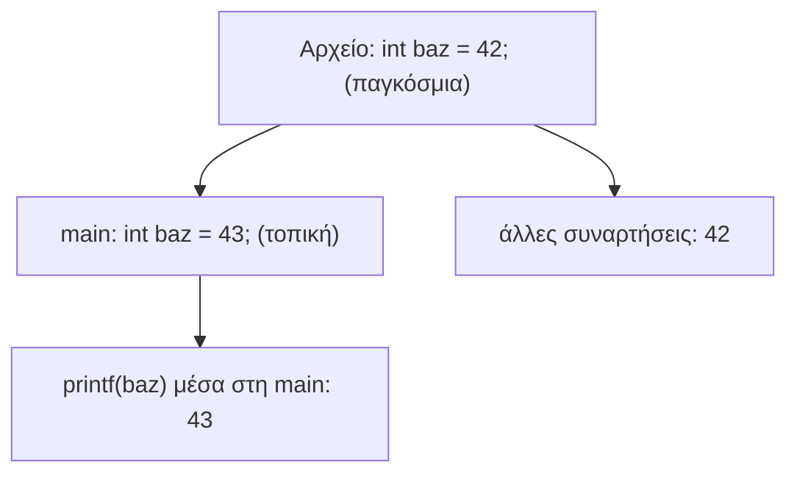

# Κεφάλαιο 14: Εμβέλεια, Μνήμη και Συμβολοσειρές

<!--  -->

> **Στόχοι:** μετά από αυτό το κεφάλαιο θα μπορείτε να βρίσκετε την εμβέλεια κάθε
> μεταβλητής, να ξεχωρίζετε τοπικές, παγκόσμιες και στατικές μεταβλητές και να λέτε
> σε ποια μνήμη ζει η καθεμία· να εξηγείτε την επισκίαση· και να χρησιμοποιείτε (και
> να υλοποιείτε) τις `strlen`, `strcmp`, `strcpy` και `strcat`, γνωρίζοντας τους
> κινδύνους τους.
>
> **Προαπαιτούμενα:** [Κεφάλαιο 10](../10-arrays/), [Κεφάλαιο 12](../12-pointers-arrays/),
> [Κεφάλαιο 13](../13-memory/)
>
> **Χρόνος μελέτης:** ~2 ώρες

## Σύνοψη

Η διάλεξη κλείνει την εικόνα της μνήμης ενός προγράμματος C. Ξεκινά από την
εμβέλεια: από πού είναι ορατή μια μεταβλητή, ανάλογα με το πού δηλώθηκε, και τι
γίνεται όταν δύο μεταβλητές έχουν το ίδιο όνομα. Έπειτα προσθέτει την τρίτη
κατηγορία μνήμης, την παγκόσμια / στατική, όπου ζουν οι παγκόσμιες και οι `static`
μεταβλητές και τα string literals, και δείχνει με το `nm` πώς τα καταγράφει ο
μεταγλωττιστής. Τέλος, περνά στις συμβολοσειρές και στις βασικές συναρτήσεις της
`string.h`, με πιθανές υλοποιήσεις τους. Είναι καθημερινά εργαλεία για κάθε
πρόγραμμα που δουλεύει με κείμενο ή με ορίσματα γραμμής εντολών.

## Θεωρία

### Εμβέλεια μεταβλητής

**Εμβέλεια** (scope) μιας μεταβλητής λέγεται το μέρος του προγράμματος όπου η
μεταβλητή είναι ορατή / προσβάσιμη με το όνομά της. Την εμβέλεια την καθορίζει **το
σημείο της δήλωσης**. Υπάρχουν δύο είδη μεταβλητών και εμβέλειας: οι **τοπικές
μεταβλητές** (local variables), που δηλώνονται μέσα σε συνάρτηση, και οι
**παγκόσμιες μεταβλητές** (global variables), που δηλώνονται έξω από κάθε συνάρτηση.

### Τοπικές μεταβλητές

Μια **τοπική μεταβλητή** δηλώνεται μέσα στο σώμα μιας συνάρτησης. Η εμβέλειά της
αρχίζει **από το σημείο της δήλωσης** και φτάνει **ως το τέλος του block εντολών**
(`{ … }`) όπου ορίστηκε: πριν από τη δήλωση το όνομα δεν υπάρχει ακόμη, μετά το `}`
δεν υπάρχει πια. Οι τοπικές μεταβλητές αποθηκεύονται στη **στοίβα** (stack), στο
frame της κλήσης ([Κεφάλαιο 13](../13-memory/)). Οι **παράμετροι** είναι κι αυτές
τοπικές μεταβλητές, με εμβέλεια όλο το σώμα της συνάρτησης· αρχικοποιούνται κατά την
κλήση με τις τιμές των ορισμάτων.

Αφού μια τοπική μεταβλητή δεν είναι ορατή σε άλλη συνάρτηση, **μπορούμε να
χρησιμοποιούμε το ίδιο όνομα σε διαφορετικές συναρτήσεις**: κάθε δήλωση είναι άλλη
μεταβλητή, σε άλλη θέση μνήμης. Για τον ίδιο λόγο, το `foo(i)` δίνει στη `foo`
**αντίγραφο της τιμής** του `i`· ό,τι κι αν κάνει η `foo` στην παράμετρό της, το `i`
του καλούντος δεν αλλάζει.

### Παγκόσμιες μεταβλητές

Μια **παγκόσμια μεταβλητή** δηλώνεται έξω από οποιαδήποτε συνάρτηση. Η εμβέλειά της
είναι **από το σημείο της δήλωσης ως το τέλος του αρχείου**: κάθε συνάρτηση που
ορίζεται πιο κάτω μπορεί να τη διαβάσει και να την αλλάξει.

```c
int baz = 42;
void foo() { printf("baz: %d\n", baz); }   /* βλέπει την baz */
void bar() { baz++; }                      /* και αυτή */
```

Οι σημειώσεις προσθέτουν δύο πράγματα. Οι παγκόσμιες μεταβλητές είναι εύκολος
δρόμος επικοινωνίας μεταξύ συναρτήσεων, αλλά η εκτεταμένη χρήση τους κάνει τα
προγράμματα δυσανάγνωστα και τις συναρτήσεις λιγότερο γενικής χρήσης. Και οι μη
αρχικοποιημένες παγκόσμιες ξεκινούν με 0, ενώ οι μη αρχικοποιημένες τοπικές έχουν
απροσδιόριστη τιμή.

### Επισκίαση μεταβλητής

Όταν μια δήλωση μεταβλητής βρίσκεται **μέσα στην εμβέλεια άλλης μεταβλητής με το ίδιο
όνομα**, η εσωτερική μεταβλητή **επισκιάζει** (shadows) την εξωτερική: μέσα στο
εσωτερικό block το όνομα αναφέρεται στην εσωτερική. Η εξωτερική δεν αλλάζει και
ξαναγίνεται ορατή όταν κλείσει το block. Το ίδιο ισχύει για εμφωλευμένα blocks μιας
συνάρτησης: ισχύει πάντα η πιο «κοντινή» δήλωση.



*Σχήμα: η τοπική `baz` της `main` επισκιάζει την παγκόσμια μόνο μέσα στη `main`.*

Η επισκίαση είναι νόμιμη C αλλά συχνή πηγή λαθών: νομίζουμε ότι αλλάζουμε μια
μεταβλητή και αλλάζουμε άλλη. Ο `gcc` προειδοποιεί γι' αυτήν με `-Wshadow`.

### Στατικές μεταβλητές

Μια μεταβλητή λέγεται **στατική** (static) όταν **διατηρεί την τιμή της ανάμεσα σε
κλήσεις συναρτήσεων, μέχρι το τέλος του προγράμματος**. Τη δηλώνουμε μέσα σε
συνάρτηση με τη λέξη `static`, π.χ. `static int counter = 0;`. Η εμβέλειά της είναι
όπως μιας τοπικής (μόνο η συνάρτηση τη βλέπει), ο **χρόνος ζωής** της όμως είναι όλο
το πρόγραμμα: δεν ζει στη στοίβα, οπότε δεν χάνεται όταν επιστρέφει η συνάρτηση.
**Η αρχικοποίηση στη δήλωση γίνεται μόνο μία φορά**, πριν από την πρώτη κλήση· κάθε
επόμενη κλήση βρίσκει την τιμή που άφησε η προηγούμενη.

Προσοχή: αν η ανάθεση γραφτεί **έξω** από τη δήλωση (`static int counter;` και μετά
`counter = 0;`), είναι απλή εντολή που εκτελείται σε κάθε κλήση, και η τιμή δεν
διατηρείται. Οι σημειώσεις αναφέρουν και μια δεύτερη σημασία: το `static` μπροστά σε
παγκόσμια μεταβλητή περιορίζει την εμβέλειά της στο αρχείο όπου ορίζεται.

### Η παγκόσμια / στατική μνήμη

Ένα πρόγραμμα C έχει τρεις κατηγορίες μνήμης: τη **στοίβα** (stack), τον **σωρό**
(heap) και την **παγκόσμια / στατική μνήμη** (global / static memory). Η τελευταία
είναι ένα μέρος της μνήμης του προγράμματος, ξεχωριστό από τη στοίβα και τον σωρό,
όπου αποθηκεύονται οι παγκόσμιες μεταβλητές, οι στατικές μεταβλητές και δεδομένα του
προγράμματος (ακόμη και ο ίδιος ο κώδικας). **Αρχικοποιείται όταν ξεκινά το
πρόγραμμα και αποδεσμεύεται όταν τερματίσει.** Έχει υποκατηγορίες (data, code,
`.bss`), που η διάλεξη αφήνει για άλλο μάθημα.

| Κατηγορία | Τι κρατά | Πότε δεσμεύεται / αποδεσμεύεται |
| --- | --- | --- |
| στοίβα | τοπικές μεταβλητές, παράμετροι | στην κλήση / στην επιστροφή |
| σωρός | ό,τι ζητάμε με `malloc` | με `malloc` / με `free` |
| παγκόσμια / στατική | παγκόσμιες, `static`, string literals, κώδικας | στην αρχή / στο τέλος του προγράμματος |

### Σύμβολα, .bss και data

Κάθε αρχείο C μπορεί να ορίζει τις δικές του παγκόσμιες μεταβλητές, και ο
μεταγλωττιστής **σώζει τα ονόματά τους ως σύμβολα** (symbols) στο αρχείο αντικειμένου
(`.o`). Το εργαλείο `nm` τα εμφανίζει με ένα γράμμα για το είδος τους: `T` για κώδικα
(συναρτήσεις), `B` για το `.bss` (μεταβλητές χωρίς αρχικοποίηση ή με 0), `D` για το
data (μεταβλητές αρχικοποιημένες με μη μηδενικές τιμές). Το μικρό γράμμα σημαίνει
σύμβολο τοπικό στο αρχείο: η `static int counter` της `foo` εμφανίζεται ως
`b counter.0`.

Η διαφορά `.bss` και data φαίνεται στο μέγεθος του αρχείου. Για το `.bss` αρκεί να
γραφτεί **πόσος χώρος χρειάζεται**· ο χώρος δίνεται γεμάτος μηδενικά όταν ξεκινά το
πρόγραμμα. Αν όμως η μεταβλητή αρχικοποιηθεί με **μη μηδενικές τιμές**, ο
μεταγλωττιστής αποθηκεύει **στο αρχείο** όλο τον χώρο και όλες τις τιμές. Έτσι ένας
τεράστιος παγκόσμιος πίνακας χωρίς αρχικοποίηση δεν μεγαλώνει το `.o`, ενώ με `= {1}`
το κάνει εκατοντάδες MB.

### String literals στη στατική μνήμη

Οι συμβολοσειρές σε εισαγωγικά (**string literals**) που **δεν** χρησιμοποιούνται για
την αρχικοποίηση ενός τοπικού πίνακα αποθηκεύονται κι αυτές στη στατική μνήμη:

```c
char *str1 = "Hello World";   /* δείκτης σε string της στατικής μνήμης */
char str2[] = "Hello World";  /* τοπικός πίνακας 12 char, στη στοίβα */
```

Ο `str1` είναι δείκτης που δείχνει σε ένα literal της στατικής μνήμης· δύο ίδια
literals μπορεί να είναι **το ίδιο αντίγραφο**, στην ίδια διεύθυνση. Στον `str2` οι
χαρακτήρες **αντιγράφονται** σε νέο πίνακα στη στοίβα, με δική του διεύθυνση. Οι
σημειώσεις προσθέτουν ότι τα literals δεν επιτρέπεται να αλλάξουν: τους χαρακτήρες
του `str2` μπορούμε να τους αλλάξουμε, αυτούς όπου δείχνει ο `str1` όχι.

### Συμβολοσειρές

Ένας πίνακας από χαρακτήρες λέγεται **αλφαριθμητικό** ή **συμβολοσειρά** (string).
Οι τρεις δηλώσεις που είδαμε στο [Κεφάλαιο 10](../10-arrays/) είναι ισοδύναμες:

```c
char hello[] = {'H', 'e', 'l', 'l', 'o', ' ', 'W', 'o', 'r', 'l', 'd',
                '\n', '\0'};
char hello[] = {72, 101, 108, 108, 111, 32, 87, 111, 114, 108, 100, 10, 0};
char hello[] = "Hello World\n";
```

Τα string **τερματίζονται πάντα με το null byte** `'\0'`. Η μορφή με τα εισαγωγικά
το προσθέτει μόνη της, οπότε ο πίνακας έχει 13 θέσεις για 12 χαρακτήρες. Το null
byte είναι ο μόνος τρόπος να ξέρει μια συνάρτηση πού τελειώνει ένα string: όλες οι
συναρτήσεις παρακάτω **διατρέχουν τους χαρακτήρες μέχρι να βρουν `'\0'`**. Σε ένα
string αναφερόμαστε και με δείκτη `char *` στον πρώτο χαρακτήρα του· έτσι περνά σε
συναρτήσεις.

### Οι συναρτήσεις της string.h

Οι συναρτήσεις βιβλιοθήκης για συμβολοσειρές δηλώνονται στο `string.h`
(`#include <string.h>`):

```c
size_t strlen(const char *s);
int strcmp(const char *s1, const char *s2);
char *strcpy(char *dst, const char *src);
char *strcat(char *dst, const char *src);
```

- Η **`strlen`** επιστρέφει το πλήθος των χαρακτήρων **χωρίς να μετρά το null
  byte**: το `strlen("hello world")` είναι 11. Επιστρέφει `size_t` (μη προσημασμένο),
  που τυπώνεται με `%zu`. Το μήκος δεν είναι αποθηκευμένο πουθενά· η `strlen`
  διατρέχει όλο το string.
- Η **`strcmp`** ελέγχει αν δύο συμβολοσειρές Α και Β είναι ίσες. Αν είναι,
  επιστρέφει **0**· αλλιώς **θετική** τιμή αν Α > Β, **αρνητική** αν Α < Β. Συγκρίνει
  χαρακτήρα προς χαρακτήρα με βάση τους κωδικούς ASCII, ως την πρώτη διαφορά
  (λεξικογραφική σειρά). Εγγυημένο είναι μόνο το πρόσημο. Δύο string **δεν**
  συγκρίνονται με `==`: αυτό συγκρίνει διευθύνσεις.
- Η **`strcpy`** **αντιγράφει** το string του 2ου ορίσματος στο 1ο, μαζί με το null
  byte, και επιστρέφει τον προορισμό. Έτσι «αναθέτουμε» string, αφού οι πίνακες δεν
  ανατίθενται με `=`.
- Η **`strcat`** **συνενώνει** (concatenates) δύο συμβολοσειρές στην πρώτη: αρχίζει
  την αντιγραφή του 2ου ορίσματος **από το τέλος (το null byte) του πρώτου**.

**Η `strcpy` είναι ιδιαίτερα επικίνδυνη** (θέμα ασφάλειας!): γράφει στη μνήμη **χωρίς
να ελέγχει αν υπάρχει αρκετός χώρος**. Αν ο προορισμός είναι μικρότερος, γράφει πάνω
σε ό,τι ακολουθεί (buffer overflow). Τον έλεγχο πρέπει να τον κάνουμε εμείς, και
ελαχιστοποιούμε τη χρήση της. Η `strncpy` (`man strncpy`) δέχεται και μέγιστο πλήθος
χαρακτήρων: λίγο καλύτερη, αλλά πάλι κακή επιλογή, γιατί μπορεί να αφήσει τον
προορισμό χωρίς null byte. **Η `strcat` έχει ακριβώς τα ίδια προβλήματα**: ελέγχουμε
πάντα ότι ο πίνακας του 1ου ορίσματος χωρά και τα δύο string και το null byte.

Η διάλεξη αφήνει για μελέτη και τις `strdup`, `strchr` και `strtok` (δείτε
«Διάβασμα»)· την `strtok` τη χρησιμοποιεί το [Εργαστήριο 8](https://progintro.github.io/lab-material/labs/lab08/).

### Η έκφραση *str++

Οι υλοποιήσεις των συναρτήσεων αυτών γράφονται συνήθως με εκφράσεις όπως το
`*str++`. Ο μεταθεματικός (postfix) `++` έχει **μεγαλύτερη προτεραιότητα** από το `*`,
οπότε το `*str++` σημαίνει `*(str++)`: δίνει τον χαρακτήρα όπου δείχνει ο `str`
**τώρα**, και μετά **ο δείκτης** προχωρά στον επόμενο. Αντίθετα, το `(*str)++` αυξάνει
**τον χαρακτήρα** και ο δείκτης μένει στη θέση του. Η προτεραιότητα των τελεστών
([Κεφάλαιο 5](../05-operators-statements/)) μετράει λοιπόν, και οι παρενθέσεις
αλλάζουν το νόημα.

| Έκφραση | Τιμή | Τι αλλάζει |
| --- | --- | --- |
| `*str++`, `*(str++)` | ο τρέχων χαρακτήρας | ο δείκτης `str` προχωρά |
| `(*str)++` | ο τρέχων χαρακτήρας | ο χαρακτήρας αυξάνεται κατά 1 |

## Παραδείγματα

### Η εμβέλεια μέσα στη foo

Εφαρμογή της «Τοπικές μεταβλητές».

```c
void foo(int bar) {
  printf("%d\n", bar);
  int i = 42;
  printf("%d\n", i);
  int j;
  for (j = 0; j < i; j++)
    printf("%d %d\n", bar, i * j);
}
```

Η εμβέλεια του `bar` είναι όλο το σώμα (αρχικοποιείται κατά την κλήση)· του `i`, από
το `int i = 42;` ως το `}` (στην πρώτη `printf` δεν υπάρχει ακόμη)· του `j`, από το
`int j;` ως το `}`.

### Το ίδιο όνομα σε δύο συναρτήσεις

Εφαρμογή της «Τοπικές μεταβλητές». Τι επιστρέφει αυτό το πρόγραμμα;

```c
void foo() {
  int i = 43;
}
int main() {
  int i = 42;
  foo();
  return i;
}
```

```text
$ gcc -o local local.c
$ ./local
$ echo $?
42
```

Το `i` της `foo` είναι άλλη μεταβλητή, στο frame της `foo`· το 43 δεν αγγίζει το `i`
της `main`. Το ίδιο ισχύει με όρισμα: στο `local2.c` η `foo` γίνεται
`void foo(int i) { i++; }` και η `main` καλεί `foo(i);`. Το `./local2; echo $?`
τυπώνει πάλι `42`: η παράμετρος πήρε αντίγραφο του 42 και έγινε 43, το `i` της
`main` όχι.

### Μια παγκόσμια και μια τοπική baz

Εφαρμογή της «Επισκίαση μεταβλητής». Τι θα τυπώσει;

```c
#include <stdio.h>
int baz = 42;
int main() {
  int baz = 43;
  printf("baz: %d\n", baz);
  return 0;
}
```

```text
$ ./shadow
baz: 43
```

Η παγκόσμια `baz` έχει εμβέλεια όλο το αρχείο, αλλά μέσα στη `main` την επισκιάζει η
τοπική.

### Ένας μετρητής με static

Εφαρμογή της «Στατικές μεταβλητές». Τι θα τυπώσει;

```c
#include <stdio.h>
void foo() {
  static int counter = 0; int i = 0;
  counter++; i++;
  printf("%d %d\n", counter, i);
}
int main() {
  foo(); foo(); foo();
  return 0;
}
```

```text
$ ./static
1 1
2 1
3 1
```

Το `counter` αρχικοποιείται μία φορά και μετρά τις κλήσεις· το `i` ξαναγίνεται 0 σε
κάθε κλήση. Αν η πρώτη γραμμή της `foo` γίνει
`static int counter; int i = 0; counter = 0;`, το `counter = 0` εκτελείται σε κάθε
κλήση και το πρόγραμμα τυπώνει `1 1` τρεις φορές.

### Παράδειγμα με κάθε μνήμη

Εφαρμογή της «Η παγκόσμια / στατική μνήμη».

```c
#include <stdlib.h>
char global[3] = {42, 24, 55};
void foo(char c1, char c2) {
  char c3 = 63;
  char * tmp = malloc(3 * sizeof(char));
  tmp[0] = 42; tmp[1] = 255; tmp[2] = 255;
}
int main() {
  foo(61, 62);
  return 0;
}
```

Κατά την εκτέλεση της `foo` (οι διευθύνσεις είναι ενδεικτικές):

| Περιοχή | Περιεχόμενο |
| --- | --- |
| παγκόσμια / στατική | `global`: 42, 24, 55 (bytes 1–3) |
| σωρός | το μπλοκ της `malloc`: 42, 255, 255 |
| στοίβα | `c1` = 61 (byte 32000), `c2` = 62 (31999), `c3` = 63 (31998) |

Ο `global` υπάρχει σε όλη την εκτέλεση. Τα `c1`, `c2`, `c3` (και ο ίδιος ο δείκτης
`tmp`) ζουν στη στοίβα μόνο όσο τρέχει η `foo`. Το μπλοκ του σωρού μένει δεσμευμένο
και μετά την επιστροφή, αφού δεν καλείται `free`, και όταν χαθεί ο `tmp` δεν
μπορούμε πια να το ελευθερώσουμε.

### Ο πίνακας των 400 MB

Εφαρμογή της «Σύμβολα, .bss και data». Το `memory.c`:

```c
int global_buffer[10];
void foo() {
  static int counter = 0;
  counter++;
}
int main() {
  foo();
  return 0;
}
```

```text
$ gcc -c memory.c
$ nm memory.o
0000000000000028 b counter.0
0000000000000000 T foo
0000000000000000 B global_buffer
0000000000000016 T main
$ du -sh memory.o
4.0K    memory.o
```

Οι `foo` και `main` είναι κώδικας (`T`), ο `global_buffer` και ο `counter` είναι στο
`.bss`. Με `int global_buffer[100000000];` (400.000.000 bytes) το `nm` δείχνει τον
`counter` στο `0000000017d78400`, δηλαδή 400.000.000, αμέσως μετά τον πίνακα, αλλά το
`memory.o` μένει **4.0K**: γράφεται μόνο το μέγεθος. Με
`int global_buffer[100000000] = {1};` όμως:

```text
$ gcc -c memory.c
$ nm memory.o
0000000000000000 b counter.0
0000000000000000 T foo
0000000000000000 D global_buffer
0000000000000016 T main
$ du -sh memory.o
382M    memory.o
```

Ο πίνακας πέρασε στο data (`D`) και ο μεταγλωττιστής έγραψε στο αρχείο όλα τα
400 MB (382 MiB). Οι Συχνές Ερωτήσεις του μαθήματος συνδέουν το σφάλμα
`section size is larger than file size` με τέτοιους πίνακες: αν τον θέλετε με
μηδενικά, μην τον αρχικοποιείτε, απλώς δηλώστε τον παγκόσμιο.

### Δείκτες και πίνακες με το ίδιο literal

Εφαρμογή της «String literals στη στατική μνήμη».

```c
#include <stdio.h>
int main() {
  char * str1 = "Hello World", * str2 = "Hello World";
  printf("%p %p\n", str1, str2);
  return 0;
}
```

```text
$ gcc -o const const.c
$ ./const
0x5588197ac004 0x5588197ac004
```

Οι δύο δείκτες δείχνουν στο ίδιο αντίγραφο του literal. Με πίνακες,
`char str1[] = "Hello World", str2[] = "Hello World";`, η έξοδος γίνεται:

```text
$ ./const
0x7ffc2576ccc4 0x7ffc2576ccb8
```

Δύο διευθύνσεις στη στοίβα (`0x7ffc…`), σε απόσταση 12 bytes: όσο ένας πίνακας των
11 χαρακτήρων και του null byte.

### Το μήκος του πρώτου ορίσματος

Εφαρμογή της «Οι συναρτήσεις της string.h».

```c
#include <stdio.h>
#include <string.h>
int main(int argc, char ** argv) {
  if (argc != 2) return 1;
  printf("Arg1 length: %zu\n", strlen(argv[1]));
  return 0;
}
```

```text
$ gcc -o strlen strlen.c
$ ./strlen "hello world"
Arg1 length: 11
```

Τα εισαγωγικά κάνουν το `hello world` ένα όρισμα· το κενό μετράει, το null byte όχι.

### Η strcmp από τη γραμμή εντολών

Εφαρμογή της «Οι συναρτήσεις της string.h».

```c
#include <stdio.h>
#include <string.h>
int main(int argc, char ** argv) {
  if (argc != 3) return 1;
  printf("strcmp(arg1, arg2): %d\n",
         strcmp(argv[1], argv[2]));
  return 0;
}
```

```text
$ ./strcmp foo bar
strcmp(arg1, arg2): 4
$ ./strcmp foo foo
strcmp(arg1, arg2): 0
$ ./strcmp f bar
strcmp(arg1, arg2): 4
$ ./strcmp bar f
strcmp(arg1, arg2): -4
$ ./strcmp bar c
strcmp(arg1, arg2): -1
$ ./strcmp bar ba
strcmp(arg1, arg2): 114
```

Στο `foo`/`bar` η πρώτη διαφορά είναι `'f' - 'b'` = 102 − 98 = 4. Στο `bar`/`ba` το
`ba` τελειώνει πρώτο, οπότε συγκρίνεται το `'r'` (114) με το `'\0'` (0). Η σειρά
είναι λεξικογραφική: το `f` είναι «μεγαλύτερο» από το `bar` παρότι είναι πιο κοντό.

### Αντιγραφή και συνένωση

Εφαρμογή της «Οι συναρτήσεις της string.h».

```c
#include <stdio.h>
#include <string.h>
int main(int argc, char ** argv) {
  char hello[16] = "Hello!";
  char world[16];
  strcpy(world, hello);
  printf("world: %s\n", world);
  return 0;
}
```

```text
$ ./strcpy
world: Hello!
```

Το πρόγραμμα της `strcat` έχει στο σώμα του:

```c
char hello[16] = "Hello ";
char world[16] = "World!";
strcat(hello, world);
printf("concat: %s\n", hello);
```

```text
$ ./strcat
concat: Hello World!
```

Ο χώρος φτάνει: το `"Hello World!"` θέλει 12 χαρακτήρες και το null byte, 13 από τα
16 bytes του `hello`. Με `char hello[8]` η `strcat` θα έγραφε έξω από τον πίνακα.

### Πιθανές υλοποιήσεις

Εφαρμογή της «Η έκφραση *str++». Οι υλοποιήσεις των διαφανειών (η βιβλιοθήκη δηλώνει
τα ορίσματα που δεν αλλάζουν ως `const char *`):

```c
size_t strlen(char * str) {
  size_t length = 0;
  while (*str++) length++;
  return length;
}

int strcmp(char * str1, char * str2) {
  while (*str1 && (*str1 == *str2)) {
    str1++;
    str2++;
  }
  return *str1 - *str2;
}

char * strcpy(char * dst, char * src) {
  char * original_dst = dst;
  while (*src) *dst++ = *src++;
  *dst = '\0';
  return original_dst;
}

char *strcat(char *dst, char *src) {
  char *original_dst = dst;
  while (*dst) dst++;
  while (*src) *dst++ = *src++;
  *dst = '\0';
  return original_dst;
}
```

- **`strlen`:** το `*str++` διαβάζει τον τρέχοντα χαρακτήρα και προχωρά τον δείκτη· ο
  βρόχος σταματά στο `'\0'` (ψευδές) χωρίς να το μετρήσει.
- **`strcmp`:** προχωρά όσο οι χαρακτήρες είναι ίσοι και το πρώτο string δεν
  τελείωσε, και επιστρέφει τη διαφορά των πρώτων διαφορετικών χαρακτήρων (0 αν
  τελείωσαν μαζί).
- **`strcpy`:** κρατά την αρχική τιμή του `dst`, γιατί ο βρόχος τον μετακινεί,
  αντιγράφει ως το `'\0'` και γράφει το null byte ρητά. Κανένας έλεγχος χώρου.
- **`strcat`:** ο πρώτος βρόχος φτάνει στο null byte του `dst`· από εκεί συνεχίζει
  όπως η `strcpy`.

### Είναι παλινδρομικό;

Εφαρμογή της «Οι συναρτήσεις της string.h». Ένα string είναι παλινδρομικό αν
διαβάζεται ίδιο και από τις δύο μεριές. Η λύση των διαφανειών:

```c
int isPalindrome(char *str) {
    int left = 0;
    int right = strlen(str) - 1;
    while (left < right) {
        if (str[left] != str[right]) return 0;
        left++;
        right--;
    }
    return 1;
}
```

Δύο δείκτες θέσης ξεκινούν από τις άκρες και πλησιάζουν· με την πρώτη διαφορά η
απάντηση είναι «όχι», κι αν συναντηθούν, «ναι». Το `strlen(str) - 1` είναι ο
τελευταίος ορατός χαρακτήρας, πριν από το null byte. Η διάλεξη θέτει και την ερώτηση
«πώς ελέγχω αν το πρώτο όρισμα του προγράμματός μου είναι `"--boo"`;», που τη
βρίσκετε στις «Ασκήσεις».

## Κύρια σημεία

1. Εμβέλεια είναι το μέρος του προγράμματος όπου μια μεταβλητή είναι ορατή, και την
   καθορίζει το σημείο της δήλωσης.
2. Μια τοπική μεταβλητή (και μια παράμετρος) είναι ορατή από τη δήλωσή της ως το
   τέλος του block της και ζει στη στοίβα· με το ίδιο όνομα σε άλλη συνάρτηση είναι
   άλλη μεταβλητή.
3. Μια παγκόσμια μεταβλητή δηλώνεται έξω από συναρτήσεις και είναι ορατή από τη
   δήλωσή της ως το τέλος του αρχείου.
4. Μια εσωτερική δήλωση με το ίδιο όνομα επισκιάζει την εξωτερική μέσα στο block της.
5. Μια `static` μεταβλητή συνάρτησης αρχικοποιείται μία φορά και κρατά την τιμή της
   ανάμεσα στις κλήσεις, εκτός αν της αναθέσουμε τιμή σε ξεχωριστή εντολή.
6. Υπάρχουν τρεις κατηγορίες μνήμης, η στοίβα, ο σωρός και η παγκόσμια / στατική
   μνήμη, που ζει από την αρχή ως το τέλος του προγράμματος.
7. Οι παγκόσμιες και οι στατικές μεταβλητές γίνονται σύμβολα του αρχείου
   αντικειμένου (`nm`), και μόνο όσες έχουν μη μηδενικές αρχικές τιμές πιάνουν χώρο
   στο αρχείο.
8. Τα string literals που δεν αρχικοποιούν τοπικό πίνακα ζουν στη στατική μνήμη, ενώ
   ο `char s[] = "…"` είναι δικό του αντίγραφο στη στοίβα.
9. Ένα string είναι πίνακας χαρακτήρων που τελειώνει πάντα με το null byte `'\0'`.
10. Η `strlen` μετρά χωρίς το null byte, η `strcmp` επιστρέφει 0, θετικό ή αρνητικό,
    η `strcpy` αντιγράφει και η `strcat` συνενώνει.
11. Το `*str++` σημαίνει `*(str++)`, όχι `(*str)++`: η προτεραιότητα των τελεστών
    μετράει.
12. Οι `strcpy` και `strcat` δεν ελέγχουν αν χωρά το αποτέλεσμα, οπότε τον έλεγχο τον
    κάνουμε πάντα εμείς.

## Ορολογία

| Ελληνικά | English | Σύντομος ορισμός |
| --- | --- | --- |
| εμβέλεια | scope | Το μέρος του προγράμματος όπου ένα όνομα είναι ορατό. |
| τοπική μεταβλητή | local variable | Δηλώνεται σε συνάρτηση· ορατή ως το τέλος του block. |
| παγκόσμια μεταβλητή | global variable | Δηλώνεται έξω από συναρτήσεις· ορατή ως το τέλος του αρχείου. |
| επισκίαση | shadowing | Εσωτερική δήλωση με ίδιο όνομα κρύβει την εξωτερική. |
| στατική μεταβλητή | static variable | Κρατά την τιμή της ανάμεσα σε κλήσεις, ως το τέλος του προγράμματος. |
| χρόνος ζωής | lifetime | Το διάστημα της εκτέλεσης όπου υπάρχει η μεταβλητή. |
| παγκόσμια / στατική μνήμη | global / static memory | Μνήμη που ζει όσο το πρόγραμμα. |
| σύμβολο | symbol | Όνομα συνάρτησης ή μεταβλητής σε αρχείο αντικειμένου. |
| σταθερή συμβολοσειρά | string literal | Κείμενο σε εισαγωγικά μέσα στον κώδικα. |
| συμβολοσειρά / αλφαριθμητικό | string | Πίνακας `char` που τελειώνει με `'\0'`. |
| null byte | null byte | Ο χαρακτήρας `'\0'` που σημαδεύει το τέλος. |
| συνένωση | concatenation | Προσάρτηση ενός string στο τέλος άλλου. |
| υπερχείλιση buffer | buffer overflow | Εγγραφή πέρα από το τέλος ενός πίνακα. |

## Διάβασμα

- **Διαφάνειες:** [Διάλεξη 14](https://github.com/progintro/progintro.github.io/releases/download/2025/lec14.pdf),
  σελ. 1–46: εμβέλεια, τοπικές και παγκόσμιες μεταβλητές 5–13· επισκίαση 14–16·
  στατικές μεταβλητές 17–19· κατηγορίες μνήμης και στατική μνήμη 20–27·
  συμβολοσειρές και `string.h` 28–41· ερωτήσεις (`--boo`, παλινδρομικό) 42–44.
- **Σημειώσεις:** η διάλεξη λέει ότι κάλυψε τις σελ. 63–68, 74–76 και 93–96 των
  διαφανειών του κ. Σταματόπουλου:
  - [Κεφάλαιο 4: Συναρτήσεις, εμβέλεια και αναδρομή](https://progintro.github.io/notes/chapters/04-functions/),
    ενότητα «Εμβέλεια και χρόνος ζωής μεταβλητών» (K04, σελ. 63–68)·
  - [Κεφάλαιο 5: Δείκτες και πίνακες](https://progintro.github.io/notes/chapters/05-pointers-arrays/),
    ενότητα «Δείκτες» (K04, σελ. 74–76)·
  - [Κεφάλαιο 6: Δυναμική μνήμη, συμβολοσειρές και πολυδιάστατοι πίνακες](https://progintro.github.io/notes/chapters/06-memory-strings/),
    ενότητα «Συμβολοσειρές» (K04, σελ. 93–96).
- **Εργαστήριο:** [Εργαστήριο 8](https://progintro.github.io/lab-material/labs/lab08/):
  άσκηση `string.c` (`strcpy`, `mystrlen`, `mystrcat`, `strcmp`, `strcat`, `strtok`)
  και `argcalc.c` (ορίσματα γραμμής εντολών ως string).
- **Άλλα:** [Static variable](https://en.wikipedia.org/wiki/Static_variable) (Wikipedia)
  και [Static variables in C](https://www.geeksforgeeks.org/static-variables-in-c/)·
  [Data segment](https://en.wikipedia.org/wiki/Data_segment) και
  [.bss](https://en.wikipedia.org/wiki/.bss)·
  [Variable shadowing](https://en.wikipedia.org/wiki/Variable_shadowing)·
  [Why strcpy and strncpy are not safe to use](https://www.geeksforgeeks.org/why-strcpy-and-strncpy-are-not-safe-to-use/)·
  [strdup](https://en.cppreference.com/w/c/experimental/dynamic/strdup),
  [strchr](https://cplusplus.com/reference/cstring/strchr/),
  [strtok](https://cplusplus.com/reference/cstring/strtok/)· `man strncpy`, `man nm`.

## Συχνά λάθη

- **Αναμονή ότι η συνάρτηση αλλάζει τη μεταβλητή του καλούντος.** Το `foo(i)` με
  `i++` μέσα στη `foo` αφήνει το `i` της `main` ίδιο.
- **Χρήση μεταβλητής έξω από το block της.** Ένα `int k` δηλωμένο μέσα σε `for` ή `if`
  δεν υπάρχει μετά το `}`: `error: 'k' undeclared`.
- **Άθελη επισκίαση.** Μια τοπική με το όνομα μιας παγκόσμιας κάνει τις αλλαγές να
  «χάνονται». Μεταγλωττίστε με `-Wshadow` και δώστε άλλα ονόματα.
- **`static` με ανάθεση σε χωριστή εντολή.** Το `static int c; c = 0;` μηδενίζει τον
  μετρητή σε κάθε κλήση· βάλτε την αρχικοποίηση στη δήλωση.
- **Τεράστιος αρχικοποιημένος παγκόσμιος πίνακας.** Το `= {1}` σε πίνακα 400 MB δίνει
  αρχείο 382 MB ή `section size is larger than file size`.
- **Αλλαγή ενός string literal.** Το `char *s = "abc"; s[0] = 'x';` μπορεί να δώσει
  `Segmentation fault`· για string που αλλάζει γράψτε `char s[] = "abc";`.
- **Χωρίς χώρο για το null byte.** Το `char s[5] = "hello";` δεν έχει θέση για το
  `'\0'`, και η `strlen` ή η `printf("%s")` διαβάζουν πέρα από τον πίνακα. Ένα string
  θέλει `strlen + 1` bytes.
- **Σύγκριση string με `==`, ή `if (strcmp(a, b))` για ισότητα.** Το πρώτο συγκρίνει
  διευθύνσεις· το δεύτερο είναι αληθές όταν **διαφέρουν**. Γράψτε
  `strcmp(a, b) == 0`.
- **`strcpy`/`strcat` σε μικρό πίνακα.** Γράφουν πέρα από το τέλος χωρίς
  προειδοποίηση (buffer overflow, π.χ. `*** stack smashing detected ***`)· ελέγξτε τα
  μήκη πριν.
- **`strlen` με `%d`.** Ο `gcc -Wall` λέει `format '%d' expects argument of type
  'int'`· η `strlen` επιστρέφει `size_t`, που τυπώνεται με `%zu`.

<!-- misconceptions -->

### Τι δυσκόλεψε την τάξη

Από τα Kahoot των διαλέξεων: οι ερωτήσεις όπου μια λάθος απάντηση μάζεψε πολλές ψήφους, με το ποσοστό σωστών απαντήσεων.

- **[Πού αποθηκεύονται οι τοπικές μεταβλητές](../../questions/kahoot/kahoot-local-variable-storage.md)** (23% σωστές): Το 55% απάντησε «Στην στοίβα», ξεχνώντας τις τοπικές `static` μεταβλητές, που έχουν τοπική εμβέλεια αλλά ζουν στη στατική μνήμη για όλη την εκτέλεση.
- **[Η strcat με τον εαυτό της](../../questions/kahoot/kahoot-strcat-self-overflow.md)** (24% σωστές): Το 34% επέλεξε `bananabananabananabanana` και το 24% `bananabanana`, κοιτάζοντας μόνο τη λογική της συνένωσης: ο πίνακας έχει 10 bytes, οπότε ήδη η πρώτη `strcat` γράφει εκτός ορίων, και η επικάλυψη πηγής και προορισμού είναι από μόνη της απροσδιόριστη συμπεριφορά.
- **[strcpy από literal σε πίνακα](../../questions/kahoot/kahoot-strcpy-literal-to-array.md)** (32% σωστές): Το 24% απάντησε ότι θα κρασάρει, μπερδεύοντας τους ρόλους: η `strcpy` γράφει στον πίνακα `s2`, που είναι εγγράψιμος και χωράει τα 6 bytes του `"World"`· το literal `s1` μόνο διαβάζεται.
- **[Η τιμή της strcmp για ίσες συμβολοσειρές](../../questions/kahoot/kahoot-strcmp-equal.md)** (48% σωστές): Το 30% επέλεξε 1, διαβάζοντας την `strcmp` σαν έλεγχο ισότητας που επιστρέφει «αληθές» όταν οι συμβολοσειρές είναι ίδιες.
- **[Πού αποθηκεύεται το char str[]](../../questions/kahoot/kahoot-char-array-storage.md)** (49% σωστές): Το 31% απάντησε «Στην στοίβα», υποθέτοντας σιωπηρά ότι η δήλωση είναι μέσα σε συνάρτηση· αν είναι παγκόσμια, ο πίνακας βρίσκεται στη στατική μνήμη.
- **[Δύο είδη εμβέλειας](../../questions/kahoot/kahoot-two-kinds-of-scope.md)** (63% σωστές): Το 31% απάντησε False, πιθανόν θεωρώντας τις `static` μεταβλητές τρίτο είδος εμβέλειας· η `static` αλλάζει τον χρόνο ζωής και τη μνήμη, όχι το από πού είναι ορατή μια τοπική μεταβλητή.

<!-- /misconceptions -->

## Ερωτήσεις κατανόησης

1. Ποια είναι η εμβέλεια μιας παραμέτρου συνάρτησης και ποια μιας παγκόσμιας
   μεταβλητής;[^q1]
2. Σε ποια μνήμη ζει μια `static int` μεταβλητή μιας συνάρτησης, και γιατί δεν χάνεται
   η τιμή της;[^q2]
3. Γιατί ο παγκόσμιος `int a[100000000];` δεν μεγαλώνει το `.o`, ενώ ο
   `int a[100000000] = {1};` το κάνει 382 MB;[^q3]
4. Τι επιστρέφουν τα `strlen("abc")` και `sizeof("abc")`;[^q4]
5. Ποια είναι η διαφορά ανάμεσα στο `*p++` και το `(*p)++`;[^q5]
6. Με ποια συνθήκη ελέγχουμε αν δύο string `a` και `b` είναι ίσα;[^q6]

<!-- kahoot -->

### Kahoot από το αμφιθέατρο

Ερωτήσεις που παίχτηκαν στις διαλέξεις, με το ποσοστό των φοιτητών που απάντησαν σωστά.

- [Πού δηλώνονται οι παγκόσμιες μεταβλητές](../../questions/kahoot/kahoot-global-declaration.md): 93% σωστές απαντήσεις
- [Δύο είδη εμβέλειας](../../questions/kahoot/kahoot-two-kinds-of-scope.md): 63% σωστές απαντήσεις
- [Διαδοχικές strcat](../../questions/kahoot/kahoot-strcat-sequence.md): 60% σωστές απαντήσεις
- [Πού αποθηκεύεται το char str[]](../../questions/kahoot/kahoot-char-array-storage.md): 49% σωστές απαντήσεις
- [Η τιμή της strcmp για ίσες συμβολοσειρές](../../questions/kahoot/kahoot-strcmp-equal.md): 48% σωστές απαντήσεις
- [strcpy από literal σε πίνακα](../../questions/kahoot/kahoot-strcpy-literal-to-array.md): 32% σωστές απαντήσεις
- [Η strcat με τον εαυτό της](../../questions/kahoot/kahoot-strcat-self-overflow.md): 24% σωστές απαντήσεις
- [Πού αποθηκεύονται οι τοπικές μεταβλητές](../../questions/kahoot/kahoot-local-variable-storage.md): 23% σωστές απαντήσεις

<!-- /kahoot -->

## Ασκήσεις

<!-- exercises -->

### Ζέσταμα: από τις διαφάνειες

- [Είναι το πρώτο όρισμα "--boo";](../../questions/slides/slides-lec14-check-boo.md): Διάλεξη 14, διαφάνεια 42 · ★☆☆ · programming
- [Αύξηση παραμέτρου μέσα σε συνάρτηση](../../questions/slides/slides-lec14-local-param.md): Διάλεξη 14, διαφάνειες 11–12 · ★☆☆ · trace
- [Τοπική μεταβλητή με το ίδιο όνομα σε δύο συναρτήσεις](../../questions/slides/slides-lec14-local-same-name.md): Διάλεξη 14, διαφάνειες 9–10 · ★☆☆ · trace
- [Παλινδρομικό string](../../questions/slides/slides-lec14-palindrome.md): Διάλεξη 14, διαφάνειες 43–44 · ★☆☆ · programming
- [Επισκίαση παγκόσμιας μεταβλητής](../../questions/slides/slides-lec14-shadowing.md): Διάλεξη 14, διαφάνειες 14–16 · ★☆☆ · trace
- [Στατική και τοπική μεταβλητή σε τρεις κλήσεις](../../questions/slides/slides-lec14-static-counter.md): Διάλεξη 14, διαφάνειες 17–18 · ★☆☆ · trace
- [Στατική μεταβλητή με ανάθεση εκτός δήλωσης](../../questions/slides/slides-lec14-static-assign.md): Διάλεξη 14, διαφάνεια 19 · ★★☆ · trace
- [Η έκφραση *str++](../../questions/slides/slides-lec14-str-plus-plus.md): Διάλεξη 14, διαφάνεια 34 · ★★☆ · short-answer

### Εργαστήριο

- [Επεξεργασία συμβολοσειρών](../../questions/labs/lab-lab08-string.md): Εργαστήριο 8, Άσκηση 1 · ★★☆ · programming

### Εργασίες

- [Το Δικό σου Chatbot (jason)](../../questions/homework/hw-2024-hw2-jason.md): Εργασία 2 (2024-25), Άσκηση 3 · ★★★ · programming

### Θέματα εξετάσεων

- [Η συνάρτηση dog](../../questions/exams/exam-2025-jan-q2.md): Εξέταση Ιανουαρίου 2025, Θέμα 2 · ★☆☆ · trace
- [Η συνάρτηση transform](../../questions/exams/exam-2025-sep-q2.md): Εξέταση Σεπτεμβρίου 2025, Θέμα 2 · ★☆☆ · trace
- [Ταιριαστές Καρδιές](../../questions/exams/exam-2023-fall-ex0-q2.md): Online τελική εξέταση Δεκεμβρίου 2023, Εξέταση #0 (Valentine's Themed), Θέμα 2 · ★★☆ · programming
- [Εντοπισμός Διπλών Ορισμάτων](../../questions/exams/exam-2023-fall-ex1-q2.md): Online τελική εξέταση Δεκεμβρίου 2023, Εξέταση #1 (Coreutils Themed), Θέμα 2 · ★★☆ · programming
- [Προσεγγίζοντας την Λέξη](../../questions/exams/exam-2023-fall-ex12-q2.md): Online τελική εξέταση Δεκεμβρίου 2023, Εξέταση #12, Θέμα 2 · ★★☆ · programming
- [Κρεμάλα](../../questions/exams/exam-2023-fall-ex12-q3.md): Online τελική εξέταση Δεκεμβρίου 2023, Εξέταση #12, Θέμα 3 · ★★☆ · programming
- [Δυνατότητες](../../questions/exams/exam-2023-fall-ex15-q4.md): Online τελική εξέταση Δεκεμβρίου 2023, Εξέταση #15, Θέμα 4 · ★★☆ · programming
- [Εύρεση Λέξεων](../../questions/exams/exam-2023-fall-ex3-q3.md): Online τελική εξέταση Δεκεμβρίου 2023, Εξέταση #3 (Frozen Themed), Θέμα 3 · ★★☆ · programming
- [Τα Πάνω Κάτω](../../questions/exams/exam-2023-fall-ex4-q2.md): Online τελική εξέταση Δεκεμβρίου 2023, Εξέταση #4 (Rick Astley Themed), Θέμα 2 · ★★☆ · programming
- [Σπάσε το PIN](../../questions/exams/exam-2023-fall-ex6-q3.md): Online τελική εξέταση Δεκεμβρίου 2023, Εξέταση #6 (Crypto Themed), Θέμα 3 · ★★☆ · programming
- [Συνένωση Αλφαριθμητικών - join](../../questions/exams/exam-2025-jan-q5.md): Εξέταση Ιανουαρίου 2025, Θέμα 5 · ★★☆ · programming
- [Μεταμορφώσιμες Προτάσεις](../../questions/exams/exam-2023-fall-ex5-q4.md): Online τελική εξέταση Δεκεμβρίου 2023, Εξέταση #5 (HP Themed), Θέμα 4 · ★★★ · programming

### Σχετικές ασκήσεις από άλλα κεφάλαια

- [Αναζητώντας τον Blinky](../../questions/exams/exam-2023-fall-ex11-q1.md): Online τελική εξέταση Δεκεμβρίου 2023, Εξέταση #11, Θέμα 1 · ★★☆ · programming (κεφ. 9)
- [Αναγράμματα](../../questions/exams/exam-2023-fall-ex4-q1.md): Online τελική εξέταση Δεκεμβρίου 2023, Εξέταση #4 (Rick Astley Themed), Θέμα 1 · ★★☆ · programming (κεφ. 10)
- [Η ακολουθία Fibonacci](../../questions/labs/lab-lab05-fib.md): Εργαστήριο 5, Άσκηση 2 · ★★☆ · programming (κεφ. 11)
- [Κάδρο](../../questions/exams/exam-2023-fall-ex9-q4.md): Online τελική εξέταση Δεκεμβρίου 2023, Εξέταση #9, Θέμα 4 · ★★★ · programming (κεφ. 13)
- [Πολυπλοκότητα της strcmp](../../questions/slides/slides-lec15-complexity-strcmp.md): Διάλεξη 15, διαφάνεια 31 · ★★☆ · short-answer (κεφ. 15)
- [Πολυπλοκότητα της strlen](../../questions/slides/slides-lec15-complexity-strlen.md): Διάλεξη 15, διαφάνεια 29 · ★☆☆ · short-answer (κεφ. 15)
- [Κρυμμένο Μήνυμα](../../questions/exams/exam-2023-fall-ex10-q3.md): Online τελική εξέταση Δεκεμβρίου 2023, Εξέταση #10, Θέμα 3 · ★★☆ · programming (κεφ. 18)
- [Επιλογή](../../questions/exams/exam-2023-fall-ex5-q3.md): Online τελική εξέταση Δεκεμβρίου 2023, Εξέταση #5 (HP Themed), Θέμα 3 · ★★☆ · programming (κεφ. 18)
- [Ταξινόμηση Αρχείων Καταγραφής](../../questions/exams/exam-2023-fall-ex6-q4.md): Online τελική εξέταση Δεκεμβρίου 2023, Εξέταση #6 (Crypto Themed), Θέμα 4 · ★★☆ · programming (κεφ. 18)
- [Ταξινόμηση Πακέτων](../../questions/exams/exam-2023-fall-ex8-q4.md): Online τελική εξέταση Δεκεμβρίου 2023, Εξέταση #8, Θέμα 4 · ★★★ · programming (κεφ. 18)
- [World Cup 2026](../../questions/exams/exam-2026-jun-q4.md): Εξέταση Ιουνίου 2026, Θέμα 4 · ★★★ · programming (κεφ. 19)
- [Δομές και δείκτες](../../questions/labs/lab-lab09-person.md): Εργαστήριο 9, Άσκηση 2 · ★★☆ · programming (κεφ. 19)
- [Σπάστε το πρόγραμμά σας σε αρθρώματα](../../questions/labs/lab-lab10-more-modules.md): Εργαστήριο 10, Άσκηση 5 · ★★☆ · tooling (κεφ. 23)
- [DNA Matching](../../questions/homework/hw-2023-hw2-dna.md): Εργασία 2 (2023-24), Άσκηση 2 · ★★★ · programming (κεφ. 25)
- [Το Καλύτερο GPS (jabbamaps)](../../questions/homework/hw-2024-hw2-jabbamaps.md): Εργασία 2 (2024-25), Άσκηση 2 · ★★★ · programming (κεφ. 25)

<!-- /exercises -->

[^q1]: Η παράμετρος: όλο το σώμα της συνάρτησης. Η παγκόσμια: από τη δήλωσή της ως το
    τέλος του αρχείου.
[^q2]: Στην παγκόσμια / στατική μνήμη, που υπάρχει από την αρχή ως το τέλος του
    προγράμματος, όχι στο frame της στοίβας.
[^q3]: Ο πρώτος είναι στο `.bss`: γράφεται μόνο το μέγεθος και ο χώρος γεμίζει με
    μηδενικά στην εκκίνηση. Ο δεύτερος είναι στο data: όλες οι τιμές γράφονται στο
    αρχείο.
[^q4]: 3 και 4: η `strlen` δεν μετρά το `'\0'`, ο πίνακας όμως το περιέχει.
[^q5]: Το `*p++` δίνει την τιμή όπου δείχνει ο `p` και προχωρά τον δείκτη· το `(*p)++`
    αυξάνει την τιμή και ο δείκτης μένει.
[^q6]: `strcmp(a, b) == 0`· το `a == b` συγκρίνει διευθύνσεις.

<!--  -->
