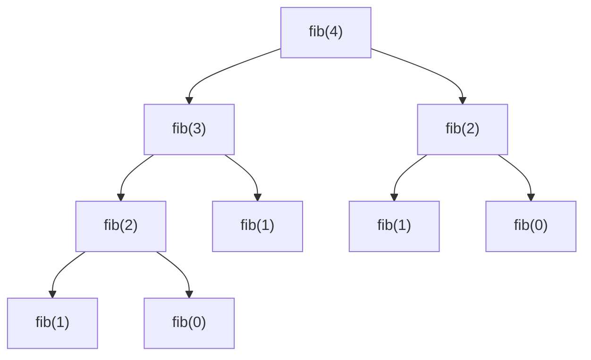

# Κεφάλαιο 15: Πολυπλοκότητα και Προεπεξεργαστής

<!--  -->

> **Στόχοι:** μετά από αυτό το κεφάλαιο θα μπορείτε να εξηγείτε τι μετρά η χρονική
> και η χωρική πολυπλοκότητα ενός αλγορίθμου· να διαβάζετε τους συμβολισμούς $O$,
> $\Omega$ και $\Theta$ και να κατατάσσετε τις συνηθισμένες κλάσεις πολυπλοκότητας·
> να εκτιμάτε την πολυπλοκότητα βρόχων, εμφωλευμένων βρόχων και αναδρομικών
> συναρτήσεων· και να χρησιμοποιείτε τον προεπεξεργαστή (`#include`, `#define`,
> `#if`, `#ifdef`, `gcc -E`, `-D`).
>
> **Προαπαιτούμενα:** [Κεφάλαιο 0](../00-hello-world/),
> [Κεφάλαιο 11](../11-pointers-recursion/), [Κεφάλαιο 12](../12-pointers-arrays/),
> [Κεφάλαιο 14](../14-scope-strings/)
>
> **Χρόνος μελέτης:** ~2 ώρες

## Σύνοψη

Η διάλεξη έχει δύο μέρη. Στο πρώτο μαθαίνουμε να συγκρίνουμε αλγορίθμους με την
**πολυπλοκότητα**: πώς μεγαλώνει ο χρόνος εκτέλεσης και η μνήμη που χρειάζονται
καθώς μεγαλώνει το μέγεθος του προβλήματος. Ο συμβολισμός Big-O μάς επιτρέπει να
αγνοούμε σταθερές και λεπτομέρειες του μηχανήματος και να κρατάμε μόνο τον ρυθμό
αύξησης. Στη συνέχεια εφαρμόζουμε την ιδέα σε προγράμματα που έχουμε ήδη δει (βρόχοι,
`atoi`, `strlen`, `strcmp`, αναδρομή) και βλέπουμε ότι ένα καλύτερο σκεπτικό μπορεί
να ρίξει την πολυπλοκότητα από $O(n)$ σε $O(\sqrt{n})$. Στο δεύτερο μέρος γνωρίζουμε
τον **προεπεξεργαστή**, το πρώτο στάδιο του `gcc`, που μετασχηματίζει τον πηγαίο
κώδικα πριν από τη μεταγλώττιση με τις οδηγίες `#include`, `#define` και τις οδηγίες
μεταγλώττισης υπό συνθήκη.

## Θεωρία

### Τι είναι η πολυπλοκότητα

Για να συγκρίνουμε δύο αυτοκίνητα κοιτάμε μετρήσιμα χαρακτηριστικά: τελική
ταχύτητα, επιτάχυνση, κατανάλωση. Για να συγκρίνουμε δύο αλγορίθμους χρειαζόμαστε
επίσης ένα μέτρο. Η **πολυπλοκότητα (complexity)** είναι ένα μέτρο εκτίμησης της
απόδοσης ενός αλγορίθμου *ως συνάρτηση του μεγέθους του προβλήματος* που λύνει. Δύο
είναι οι βασικές μετρικές:

1. **Χρονική πολυπλοκότητα (time complexity):** πόσο χρόνο χρειάζεται η εκτέλεση.
2. **Χωρική πολυπλοκότητα (space complexity):** πόση μνήμη απαιτείται.

Αν $n$ είναι το μέγεθος του προβλήματος (το πλήθος των στοιχείων ενός πίνακα, το
μήκος μιας συμβολοσειράς, η τιμή ενός αριθμού), θέλουμε να εκφράσουμε τον χρόνο
εκτέλεσης ως $t = f(n)$.

Ο χρόνος σε δευτερόλεπτα δεν είναι καλό μέτρο: το ίδιο πρόγραμμα κάνει ένα λεπτό σε
έναν αργό υπολογιστή και δευτερόλεπτα σε έναν γρήγορο. Γι' αυτό μετράμε **βήματα**
(πόσες φορές εκτελείται ένας βρόχος, πόσες κλήσεις γίνονται) και μας ενδιαφέρει πώς
αυξάνονται όταν αυξάνεται το $n$, όχι ο ακριβής αριθμός τους. Η θεωρία της
πολυπλοκότητας είναι ολόκληρος κλάδος της πληροφορικής· ένας από τους πιο γνωστούς
ερευνητές του είναι ο Χρίστος Παπαδημητρίου, συν-συγγραφέας και του κόμικ
*Logicomix*.

### Ο συμβολισμός Big-O, Ω και Θ

Οι κλάσεις πολυπλοκότητας ορίζονται με τρεις συμβολισμούς. Για δύο συναρτήσεις $f$
και $g$ του μεγέθους $n$:

- **Άνω όριο, $O$ (Big-O):**

$$g = O(f) \iff \exists c. \exists n_0. \forall n > n_0. \quad g(n) < c \cdot f(n)$$

- **Κάτω όριο, $\Omega$:**

$$g = \Omega(f) \iff \exists c. \exists n_0. \forall n > n_0. \quad g(n) > c \cdot f(n)$$

- **Τάξη μεγέθους, $\Theta$:**

$$g = \Theta(f) \iff \exists c_1, c_2. \exists n_0. \forall n > n_0. \quad c_1 \cdot f(n) < g(n) < c_2 \cdot f(n)$$

Διαβάστε τον ορισμό του $O$ ως εξής: *από κάποιο σημείο $n_0$ και μετά*, η $g$ δεν
ξεπερνά ποτέ ένα σταθερό πολλαπλάσιο της $f$. Πριν από το $n_0$ μπορεί να συμβαίνει
οτιδήποτε· οι μικρές είσοδοι δεν μετράνε. Η σταθερά $c$ «απορροφά» τους σταθερούς
παράγοντες: ένας βρόχος που κάνει $n/2$ ή $3n + 5$ βήματα είναι και οι δύο $O(n)$.
Το $\Omega$ λέει το αντίστροφο (η $g$ μεγαλώνει *τουλάχιστον* όσο η $f$), και το
$\Theta$ ότι ισχύουν και τα δύο, δηλαδή η $g$ μεγαλώνει *ακριβώς* με τον ρυθμό της
$f$. Στην πράξη, όταν λέμε «ο αλγόριθμος είναι $O(n)$», εννοούμε συνήθως το πιο
σφικτό άνω όριο που ξέρουμε.

Η γραφική παράσταση των διαφανειών το δείχνει: οι καμπύλες $f(x)$ και $c \cdot g(x)$
διασταυρώνονται αρκετές φορές, αλλά μετά από ένα σημείο $x_0$ η $c \cdot g(x)$ μένει
πάντα πάνω από την $f(x)$, άρα $f(x) = O(g(x))$.

### Διάταξη των κλάσεων πολυπλοκότητας

Οι συνηθισμένες κλάσεις, από την ταχύτερη στην πιο αργή, είναι:

$$O(1) < O(\log n) < O(\sqrt{n}) < O(n) < O(n \log n) < O(n^2) < O(n^3) < O(2^n) < O(n!) < O(n^n)$$

| Κλάση | Όνομα | Παράδειγμα από τη διάλεξη |
| --- | --- | --- |
| $O(1)$ | σταθερή (constant) | υπολογισμός βαθμού με έναν τύπο |
| $O(\log n)$ | λογαριθμική (logarithmic) | κατοπτρικός αριθμός (ψηφία του $n$) |
| $O(\sqrt{n})$ | τετραγωνική ρίζα | άθροισμα τέλειων τετραγώνων, 2η εκδοχή |
| $O(n)$ | γραμμική (linear) | `strlen`, `atoi`, παραγοντικό |
| $O(n \log n)$ | log-linear | (καλές ταξινομήσεις, [Κεφάλαιο 17](../17-binary-search-sorting/)) |
| $O(n^2)$ | τετραγωνική (quadratic) | μέγιστο σε πίνακα $n \times n$ |
| $O(n^3)$ | κυβική, πολυωνυμική | τρεις εμφωλευμένοι βρόχοι |
| $O(2^n)$ | εκθετική (exponential) | αναδρομικό Fibonacci |
| $O(n!)$ | παραγοντική | όλες οι διατάξεις $n$ στοιχείων |

Οι γραφικές παραστάσεις των διαφανειών δείχνουν πόσο γρήγορα απομακρύνονται οι
καμπύλες: για $n = 100$ η $\log_2 n$ είναι περίπου 7 και η $\sqrt{n}$ είναι 10, ενώ η
$n^2$ είναι 10.000 και η $2^n$ έχει 31 ψηφία. Οι αλγόριθμοι μέχρι το πολυωνυμικό
επίπεδο είναι συνήθως πρακτικοί· οι εκθετικοί και οι παραγοντικοί γίνονται άχρηστοι
ήδη για μερικές δεκάδες στοιχεία.

### Πώς εκτιμούμε την πολυπλοκότητα ενός προγράμματος

Μερικοί απλοί κανόνες καλύπτουν όλα τα παραδείγματα της διάλεξης:

- **Σειρά εντολών χωρίς βρόχους:** $O(1)$, όσες εντολές κι αν είναι.
- **Ένας βρόχος που τρέχει $n$ φορές** με $O(1)$ σώμα: $O(n)$. Το βήμα δεν αλλάζει
  την κλάση: `i += 2` κάνει $n/2$ επαναλήψεις, που είναι πάλι $O(n)$.
- **Εμφωλευμένοι βρόχοι:** οι επαναλήψεις πολλαπλασιάζονται· δύο βρόχοι των $n$
  δίνουν $O(n^2)$.
- **Βρόχος που διαιρεί** την τιμή με μια σταθερά σε κάθε βήμα (π.χ. `n /= 10`):
  τρέχει τόσες φορές όσα τα ψηφία, $O(\log n)$.
- **Κλήση συνάρτησης μέσα σε βρόχο:** πολλαπλασιάστε το κόστος της κλήσης με τις
  επαναλήψεις.
- **Αναδρομή:** μετράμε τις κλήσεις. Μία κλήση ανά επίπεδο με βάθος $n$ δίνει $O(n)$·
  δύο κλήσεις ανά επίπεδο δίνουν δέντρο κλήσεων με έως $2^n$ κόμβους.

Για τη **μνήμη** μετράμε ό,τι μεγαλώνει με το $n$: έναν πίνακα $n$ θέσεων (π.χ. με
`malloc`) και, στην αναδρομή, τα πλαίσια στη **στοίβα (stack)**: κάθε ενεργή κλήση
κρατά τις δικές της τοπικές μεταβλητές, οπότε βάθος αναδρομής $n$ σημαίνει $O(n)$
μνήμη. Σταθερό πλήθος μεταβλητών είναι $O(1)$ χώρος.

Προσέξτε **ως προς τι** μετράτε: στην `atoi` το $n$ είναι το πλήθος των ψηφίων, στην
`mirror` η *τιμή* του αριθμού, στην `strcmp` τα μήκη δύο συμβολοσειρών.

### Μεταγλωττιστής και προεπεξεργαστής

**Μεταγλωττιστής (compiler)** είναι ένα πρόγραμμα που μετατρέπει εντολές μιας γλώσσας
προγραμματισμού σε κώδικα μηχανής, ώστε να μπορεί να τον διαβάσει και να τον τρέξει
ο υπολογιστής ([Κεφάλαιο 0](../00-hello-world/)). Με την εντολή
`gcc hello.c -o hello` ο πηγαίος κώδικας (source code) `hello.c` γίνεται δυαδικό
πρόγραμμα (binary program) `hello`.

Ο `gcc` δεν δουλεύει σε ένα βήμα: εσωτερικά περνά τον κώδικα από διαδοχικά στάδια. Το
πρώτο είναι ο **προεπεξεργαστής (preprocessor)**, ένα υποσύστημα του μεταγλωττιστή
που καλείται αυτόματα πριν από την πραγματική μεταγλώττιση. Παίρνει ένα αρχείο C και
παράγει ένα *άλλο* αρχείο C, εφαρμόζοντας τις οδηγίες που απευθύνονται σε αυτόν.
Δουλεύει μόνο με κείμενο: δεν ξέρει τι είναι μεταβλητή ή τύπος.


*Σχήμα: ο προεπεξεργαστής είναι το πρώτο στάδιο μέσα στον `gcc`.*

Την έξοδο του προεπεξεργαστή τη βλέπουμε με την επιλογή `-E` του `gcc` ή τρέχοντας
απευθείας το πρόγραμμα του προεπεξεργαστή, `cpp`:

```sh
gcc -E hello.c -o processed.c
cpp hello.c -o processed.c
```

Το `processed.c` είναι ο **προεπεξεργασμένος πηγαίος κώδικας (preprocessed source
code)**: αυτό που πραγματικά μεταγλωττίζεται. Οι γραμμές που αρχίζουν με `#` στην
έξοδο (π.χ. `# 1 "hello.c"`) είναι σημειώσεις για τον μεταγλωττιστή σχετικά με το
από ποιο αρχείο και ποια γραμμή προήλθε κάθε κομμάτι.

### Οδηγίες προεπεξεργαστή

Όλες οι **οδηγίες προς τον προεπεξεργαστή (preprocessor directives)** αρχίζουν με το
σύμβολο `#`. Οι πιο συνηθισμένες είναι:

1. `#include`: εισαγωγή αρχείου.
2. `#define`: ορισμός μακροεντολών.
3. `#if`, `#else`, `#elif`, `#endif`: μεταγλώττιση υπό συνθήκη.
4. `#ifdef`, `#ifndef`: έλεγχος αν έχει οριστεί μια μακροεντολή.

Δεν τελειώνουν με `;`, γιατί δεν είναι εντολές της C.

### Η οδηγία `#include`

Η `#include <file.h>` εισάγει *τα περιεχόμενα* του αρχείου `file.h` στο σημείο όπου
γράφτηκε η οδηγία, σαν να τα είχαμε αντιγράψει εκεί. Τα αρχεία αυτά είναι συνήθως
**αρχεία επικεφαλίδας (header files)** με δηλώσεις συναρτήσεων, σταθερές και
μακροεντολές· για παράδειγμα, το `stdio.h` δηλώνει την `printf`.

Πού βρίσκονται; Η μορφή με `< >` τα ψάχνει σε προκαθορισμένους φακέλους του
λειτουργικού (π.χ. `/usr/include`) ή σε φακέλους που δίνουμε με το όρισμα `-I` του
`gcc`. Η δεύτερη μορφή, `#include "file.h"`, ψάχνει *πρώτα* στον φάκελο όπου
βρίσκεται το πηγαίο αρχείο και μετά στους ίδιους φακέλους με τη μορφή `< >`. Η πρώτη
μορφή είναι για τις βιβλιοθήκες του συστήματος, η δεύτερη για τα δικά μας αρχεία.
Η οργάνωση ενός προγράμματος σε πολλά αρχεία έρχεται στο
[Κεφάλαιο 23](../23-code-organization/).

### Η οδηγία `#define` και οι μακροεντολές

Η `#define` ορίζει **μακροεντολές (macros)**: ονόματα που ο προεπεξεργαστής
αντικαθιστά με το κείμενο που τους αντιστοιχίσαμε, όπου τα βρει ως ξεχωριστή λέξη
(όχι μέσα σε `"..."` ή σε σχόλια). Δύο χρήσεις:

1. **Ορισμός σταθεράς:** `#define TRUE 1`. Κάθε `TRUE` γίνεται `1`.
2. **Ορισμός υπολογισμού (μακροεντολή με παραμέτρους):**

```c
#define MAX(A, B) ((A) > (B) ? (A) : (B))
```

Το `MAX(x + 1, y)` γίνεται `((x + 1) > (y) ? (x + 1) : (y))`. Μοιάζει με κλήση
συνάρτησης, αλλά δεν είναι: δεν υπάρχουν τύποι ούτε κλήση, μόνο **αντικατάσταση
κειμένου πριν από τη μεταγλώττιση**. Γι' αυτό:

- Βάζουμε **παρενθέσεις** γύρω από κάθε παράμετρο και γύρω από όλο το κείμενο.
  Χωρίς αυτές οι τελεστές του κώδικα γύρω από τη μακροεντολή «μπερδεύονται» με τους
  δικούς της λόγω προτεραιότητας (δείτε το [παράδειγμα με το `PROD`](#prod)).
- Μια παράμετρος που εμφανίζεται δύο φορές στο κείμενο υπολογίζεται δύο φορές: το
  `MAX(i++, j++)` αυξάνει μία από τις δύο μεταβλητές δύο φορές.

Η τιμή μιας μακροεντολής μπορεί να δοθεί και **από τη γραμμή εντολών**, με τη σύνταξη
`-DMACRO=VALUE` του `gcc`· το σκέτο `-DMACRO` την ορίζει με τιμή `1`. Έτσι ένα
πρόγραμμα αλλάζει συμπεριφορά χωρίς να αλλάξει ούτε γράμμα του κώδικα.

### Μεταγλώττιση υπό συνθήκη: `#if`, `#else`, `#endif`

Οι οδηγίες `#if` / `#else` / `#endif` μοιάζουν με το `if` της C, αλλά δρουν **στο
επίπεδο του κώδικα**: δεν αποφασίζουν τι θα εκτελεστεί, αλλά *ποιες γραμμές θα
μείνουν* στο αρχείο που θα μεταγλωττιστεί. Ό,τι βρίσκεται ανάμεσα σε `#if` και
`#endif` κρατιέται μόνο αν η ακέραια παράσταση μετά το `#if` είναι μη μηδενική· αλλιώς
κρατιέται το τμήμα του `#else`. Το `#elif` είναι συντομογραφία για `#else` που
περιέχει άλλο `#if`. Η παράσταση υπολογίζεται από τον προεπεξεργαστή, άρα πρέπει να
περιέχει σταθερές και μακροεντολές, όχι μεταβλητές του προγράμματος.

Μια συνηθισμένη χρήση είναι το `#if 0 ... #endif`, που «σβήνει» προσωρινά ένα κομμάτι
κώδικα χωρίς να το σβήσουμε πραγματικά.

### Οι οδηγίες `#ifdef` και `#ifndef`

Με το `#ifdef NAME` ελέγχουμε αν η μακροεντολή `NAME` *έχει οριστεί* (με `#define` ή
με `-DNAME`), ανεξάρτητα από την τιμή της· το `#ifndef NAME` ελέγχει το αντίθετο.
Ισοδύναμα γράφεται `#if defined(NAME)` και `#if !defined(NAME)`. Τυπικές χρήσεις:

- **Μηνύματα αποσφαλμάτωσης (debugging)** που ενεργοποιούνται με `-DDEBUG` και
  εξαφανίζονται εντελώς από το τελικό πρόγραμμα όταν δεν το δίνουμε.
- **Include guards**: ένα αρχείο επικεφαλίδας τυλίγεται σε
  `#ifndef NAME_H` / `#define NAME_H` / `#endif`, ώστε τα περιεχόμενά του να
  συμπεριληφθούν μόνο μία φορά (δείτε το Παράρτημα του Εργαστηρίου 10).

## Παραδείγματα

### Γινόμενο των περιττών πολλαπλασίων του 7

*Εφαρμόζει: «Πώς εκτιμούμε την πολυπλοκότητα».* Θέλουμε το γινόμενο όλων των
περιττών από το 1 μέχρι το `N` που διαιρούνται με το 7 (το πρόβλημα του
[Κεφαλαίου 7](../07-problem-solving/)). Ένας βρόχος με μια μεταβλητή που αυξάνεται
κατά 2 και έλεγχο για `% 7 == 0`:

```c
for (product = 1, i = 1; i < N; i += 2) {
  if (i % 7 == 0)
    product *= i;
}
```

**Χρόνος: $O(N)$, χώρος: $O(1)$.** Ο βρόχος κάνει περίπου $N/2$ επαναλήψεις, και η
σταθερά $1/2$ δεν αλλάζει την κλάση. Ο χώρος είναι δύο μεταβλητές, όσο μεγάλο κι αν
είναι το `N`. (Αν το «μέχρι το `N`» περιλαμβάνει το `N`, η συνθήκη πρέπει να είναι
`i <= N`.)

### Η `atoi`

*Εφαρμόζει: έναν βρόχο ανά στοιχείο.* Η συνάρτηση του
[Κεφαλαίου 10](../10-arrays/) μετατρέπει έναν πίνακα χαρακτήρων (μόνο ψηφία) σε
ακέραιο:

```c
int atoi(char digits[]) {
  int result = 0;
  for (int i = 0; digits[i]; i++) {
    result = 10 * result + digits[i] - '0';
  }
  return result;
}
```

**Χρόνος: $O(N)$, χώρος: $O(1)$**, όπου $N$ το πλήθος των ψηφίων: μία επανάληψη ανά
ψηφίο και μόνο δύο τοπικές μεταβλητές. (Το όνομα `atoi` συμπίπτει με τη συνάρτηση
της `stdlib.h`· εδώ είναι δική μας υλοποίηση.)

### Μέτρηση χαρακτήρων με `getchar`

*Εφαρμόζει: βρόχος ανά χαρακτήρα εισόδου.* Διαδοχικές κλήσεις της `getchar()`
διαβάζουν διαδοχικούς χαρακτήρες ([Κεφάλαιο 9](../09-input/)). Το πρόγραμμα
ξανατυπώνει μια γραμμή και μετρά τους χαρακτήρες της:

```c
#include <stdio.h>

int main() {
  int ch, sum = 0;
  printf("Enter characters: ");
  while ((ch = getchar()) != '\n' && ch != EOF) {
    printf("%c", ch);
    sum++;
  }
  printf("\nTotal characters: %d\n", sum);
  return 0;
}
```

```text
$ echo hello | ./count
Enter characters: hello
Total characters: 5
```

**Χρόνος: $O(N)$, χώρος: $O(1)$**, με $N$ το μήκος της γραμμής: το πρόγραμμα *δεν*
αποθηκεύει τη γραμμή, κρατά μόνο τον τρέχοντα χαρακτήρα και τον μετρητή.

### Δυναμικός πίνακας με `malloc`

*Εφαρμόζει: χωρική πολυπλοκότητα.* Με τους δείκτες μπορούμε να φτιάξουμε
**δυναμικούς πίνακες**, το μέγεθος των οποίων αποφασίζεται τη στιγμή που τρέχει το
πρόγραμμα ([Κεφάλαιο 12](../12-pointers-arrays/),
[Κεφάλαιο 13](../13-memory/)):

```c
int *array = malloc(N * sizeof(int));
for (int i = 0; i < N; i++)
  array[i] = i * i;
```

**Χρόνος: $O(N)$, χώρος: $O(N)$.** Εδώ ο χώρος μεγαλώνει με το `N`, γιατί
δεσμεύουμε `N` ακεραίους. (Σε πλήρες πρόγραμμα ελέγχουμε αν η `malloc` επέστρεψε
`NULL` και καλούμε `free` στο τέλος.)

### Υπολογισμός βαθμολογίας

*Εφαρμόζει: $O(1)$.* Το γνωστό μας παράδειγμα από τα [Κεφάλαια 4](../04-git-operators/) και
[5](../05-operators-statements/):

```c
// Compute grades using the class formula
int grade(int final_exam, int homework, int lab, int year) {
  if (year <= 1) {
    return final_exam * 50 / 100 + homework * 30 / 100 + lab * 20 / 100;
  } else {
    return final_exam * 70 / 100 + homework * 30 / 100;
  }
}
```

**Χρόνος: $O(1)$, χώρος: $O(1)$.** Δεν υπάρχει βρόχος ούτε αναδρομή· ο αριθμός των
πράξεων είναι ο ίδιος για κάθε είσοδο.

### Μέγιστο στοιχείο σε πίνακα N × N

*Εφαρμόζει: εμφωλευμένοι βρόχοι.*

```c
int find_max(int **matrix, size_t n) {
  int i, j, max = -1;
  for (i = 0; i < n; i++) {
    for (j = 0; j < n; j++) {
      if (matrix[i][j] > max) max = matrix[i][j];
    }
  }
  return max;
}
```

**Χρόνος: $O(n^2)$, χώρος: $O(1)$.** Ο εσωτερικός βρόχος τρέχει $n$ φορές για κάθε
μία από τις $n$ επαναλήψεις του εξωτερικού: $n \cdot n$ συγκρίσεις. Προσέξτε ότι η
αρχική τιμή `max = -1` δουλεύει μόνο αν όλα τα στοιχεία είναι μη αρνητικά· η γενική
λύση είναι `max = matrix[0][0]`.

### Παραγοντικό και Fibonacci

*Εφαρμόζει: πολυπλοκότητα αναδρομής* ([Κεφάλαιο 11](../11-pointers-recursion/)).

```c
int factorial(int n) {
  if (n == 0) return 1;
  return n * factorial(n - 1);
}
```

**Χρόνος: $O(n)$, χώρος: $O(n)$.** Το `factorial(n)` κάνει μία αλυσίδα $n + 1$
κλήσεων. Ο χώρος *δεν* είναι $O(1)$: πριν επιστρέψει η πρώτη κλήση, και οι $n + 1$
κλήσεις είναι ενεργές ταυτόχρονα, η καθεμία με το δικό της πλαίσιο στη στοίβα.

```c
int fib(int n) {
  if (n == 0 || n == 1) return 1;
  return fib(n - 1) + fib(n - 2);
}
```

**Χρόνος: $O(2^n)$, χώρος: $O(n)$.** Κάθε κλήση κάνει *δύο* αναδρομικές κλήσεις, οπότε
οι κλήσεις σχηματίζουν δέντρο που σχεδόν διπλασιάζεται σε κάθε επίπεδο, και οι ίδιες
τιμές υπολογίζονται ξανά και ξανά:



*Σχήμα: το δέντρο κλήσεων του `fib(4)`· το `fib(2)` υπολογίζεται δύο φορές.*

Η μνήμη όμως μένει $O(n)$: σε κάθε στιγμή είναι ενεργές μόνο οι κλήσεις ενός
μονοπατιού από τη ρίζα ως ένα φύλλο, και το μακρύτερο μονοπάτι έχει μήκος $n$.

### `strlen` και `strcmp`

*Εφαρμόζει: βρόχος ανά χαρακτήρα.* Μια πιθανή υλοποίηση της `strlen`
([Κεφάλαιο 14](../14-scope-strings/)):

```c
size_t strlen(char *str) {
  size_t length = 0;
  while (*str++) length++;
  return length;
}
```

**Χρόνος: $O(n)$, χώρος: $O(1)$**, όπου $n$ το μήκος της συμβολοσειράς. Η C δεν
αποθηκεύει πουθενά το μήκος· για να το βρει, η `strlen` πρέπει να διατρέξει όλη τη
συμβολοσειρά μέχρι το `'\0'`.

```c
int strcmp(char *str1, char *str2) {
  while (*str1 && (*str1 == *str2)) {
    str1++;
    str2++;
  }
  return *str1 - *str2;
}
```

**Χρόνος: $O(\min(m, n))$, χώρος: $O(1)$**, για συμβολοσειρές μήκους $n$ και $m$. Ο
βρόχος σταματά στην πρώτη διαφορά ή στο τέλος της συντομότερης, άρα δεν μπορεί να
κάνει περισσότερα βήματα από το μικρότερο μήκος.

### Άθροισμα τέλειων τετραγώνων

*Εφαρμόζει: κλήση μέσα σε βρόχο και βελτίωση πολυπλοκότητας.* Θέλουμε το άθροισμα
των τέλειων τετραγώνων στο διάστημα `[low, high]`, με τα όρια από τη γραμμή εντολών.
Πρώτη εκδοχή: ελέγχουμε κάθε αριθμό.

```c
int isPerfectSquare(int num) {
  int root = sqrt(num);
  return root * root == num;
}
// ... στη main:
int low = atoi(argv[1]);
int high = atoi(argv[2]);
int i, sum = 0;
for (i = low; i <= high; i++) {
  if (isPerfectSquare(i))
    sum += i;
}
```

**Χρόνος: $O(n)$, χώρος: $O(1)$**, όπου $n$ το πλήθος των αριθμών του διαστήματος
(η `sqrt` μετράει εδώ ως ένα βήμα). Δεύτερη εκδοχή: αντί να ψάχνουμε ποιοι αριθμοί
είναι τετράγωνα, *παράγουμε* απευθείας τα τετράγωνα $i^2$ για $i$ από $\sqrt{low}$ ως
$\sqrt{high}$:

```c
int low = atoi(argv[1]);
int high = atoi(argv[2]);
int i, sum = 0;
for (i = sqrt(low); i <= sqrt(high); i++)
  sum += i * i;
```

**Χρόνος: $O(\sqrt{n})$, χώρος: $O(1)$.** Για διάστημα ενός εκατομμυρίου αριθμών ο
βρόχος κάνει περίπου χίλιες επαναλήψεις αντί για ένα εκατομμύριο. Το δίδαγμα: η
μεγαλύτερη βελτίωση έρχεται από καλύτερο σκεπτικό, όχι από «γρηγορότερο» κώδικα.

Προσοχή σε μια λεπτομέρεια: η ανάθεση `i = sqrt(low)` κόβει το δεκαδικό μέρος. Αν το
`low` δεν είναι τέλειο τετράγωνο, π.χ. `low = 5`, το `i` ξεκινά από το 2 και το
άθροισμα περιλαμβάνει το 4, που είναι εκτός διαστήματος. Η σωστή αρχή είναι το
μικρότερο `i` με `i * i >= low`. Και οι δύο εκδοχές χρειάζονται `#include <math.h>`
και μεταγλώττιση με `-lm`.

### Κατοπτρικός αριθμός

*Εφαρμόζει: $O(\log n)$.* Η `mirror` επιστρέφει τον αριθμό με τα ψηφία ανάποδα
(`1234` → `4321`):

```c
int mirror(int n) {
  int result = 0, tmp;
  while (n > 0) {
    tmp = n % 10;
    result = 10 * result + tmp;
    n /= 10;
  }
  return result;
}
```

**Χρόνος: $O(\log n)$, χώρος: $O(1)$.** Κάθε επανάληψη διαιρεί το `n` με το 10, οπότε
ο βρόχος τρέχει τόσες φορές όσα είναι τα ψηφία του $n$, δηλαδή περίπου $\log_{10} n$.
Εδώ το «μέγεθος» είναι η *τιμή* του $n$, όχι το πλήθος των ψηφίων του.

Η διάλεξη κλείνει το μέρος αυτό με ένα ανοιχτό ερώτημα: τι χρονική πολυπλοκότητα έχει
ο έλεγχος αν ένας αριθμός είναι πρώτος; Σκεφτείτε μέχρι πού χρειάζεται να δοκιμάσετε
διαιρέτες (δείτε την αντίστοιχη άσκηση).

### Η μακροεντολή `PROD`

<a id="prod"></a>

*Εφαρμόζει: «Η οδηγία `#define`», `gcc -E`.* Τι επιστρέφει το παρακάτω πρόγραμμα;

```c
#define PROD 2*5
int main() {
  return 20 / PROD;
}
```

Η πρώτη σκέψη είναι $20 / 10 = 2$. Ο προεπεξεργαστής όμως αντικαθιστά *κείμενο*:

```text
$ cpp prod.c
# 0 "prod.c"
# 0 "<built-in>"
# 0 "<command-line>"
# 1 "/usr/include/stdc-predef.h" 1 3 4
# 0 "<command-line>" 2
# 1 "prod.c"


int main() {
  return 20 / 2*5;
}
$ gcc -o prod prod.c
$ ./prod
$ echo $?
50
```

Το `20 / 2*5` υπολογίζεται από αριστερά προς τα δεξιά: `(20 / 2) * 5 = 50`. Με
`#define PROD (2*5)` το αποτέλεσμα θα ήταν 2. Την τιμή που επιστρέφει η `main` τη
βλέπουμε με `echo $?` ([Κεφάλαιο 1](../01-command-line/)).

Αν σβήσουμε τη γραμμή `#define` και δώσουμε την τιμή από τη γραμμή εντολών:

```text
$ gcc -DPROD=10 -o prod prod.c
$ ./prod
$ echo $?
2
```

### `#if 0` / `#else`

*Εφαρμόζει: «Μεταγλώττιση υπό συνθήκη».* Σε τι θα προεπεξεργαστεί το πρόγραμμα;

```c
int main() {
#if 0
  return 42;
#else
  return 1;
#endif
}
```

```text
$ gcc -E example.c
# 0 "example.c"
# 0 "<built-in>"
# 0 "<command-line>"
# 1 "/usr/include/stdc-predef.h" 1 3 4
# 0 "<command-line>" 2
# 1 "example.c"
int main() {


  return 1;

}
```

Το `return 42;` δεν υπάρχει καν στον κώδικα που φτάνει στον μεταγλωττιστή· στη θέση
των οδηγιών και του κομματιού που αφαιρέθηκε μένουν κενές γραμμές, ώστε οι αριθμοί
γραμμών στα μηνύματα λάθους να ταιριάζουν με το αρχικό αρχείο.

### Μηνύματα αποσφαλμάτωσης με `#ifdef DEBUG`

*Εφαρμόζει: «Οι οδηγίες `#ifdef` και `#ifndef`».*

```c
#define DEBUG
#ifdef DEBUG
  printf("debugging is on\n");
#else
  printf("debugging is off\n");
#endif
#ifndef DEBUG
  printf("optimizations are on\n");
#endif
```

Με το `#define DEBUG` στην αρχή τυπώνεται μόνο `debugging is on`. Αν σβήσουμε αυτή τη
γραμμή, τυπώνονται `debugging is off` και `optimizations are on`. Αντί να αλλάζουμε
τον κώδικα, μπορούμε να αφήσουμε έξω το `#define DEBUG` και να μεταγλωττίζουμε με
`gcc -DDEBUG` όταν θέλουμε τα μηνύματα.

## Κύρια σημεία

1. Η πολυπλοκότητα μετρά την απόδοση ενός αλγορίθμου ως συνάρτηση του μεγέθους $n$
   του προβλήματος, σε χρόνο εκτέλεσης και σε χώρο μνήμης.
2. $g = O(f)$ σημαίνει ότι από κάποιο $n_0$ και μετά $g(n) < c \cdot f(n)$· το $O$ είναι
   άνω όριο, το $\Omega$ κάτω όριο και το $\Theta$ τάξη μεγέθους.
3. Οι σταθερές και οι όροι χαμηλότερης τάξης δεν μετράνε: $n/2$ και $3n + 5$ είναι
   και τα δύο $O(n)$.
4. Από την ταχύτερη στην πιο αργή: $O(1)$, $O(\log n)$, $O(\sqrt{n})$, $O(n)$,
   $O(n \log n)$, $O(n^2)$, $O(n^3)$, $O(2^n)$, $O(n!)$, $O(n^n)$.
5. Ένας βρόχος $n$ επαναλήψεων είναι $O(n)$, δύο εμφωλευμένοι $O(n^2)$, ένας βρόχος
   που διαιρεί με 10 είναι $O(\log n)$.
6. Η αναδρομή κοστίζει και σε μνήμη: βάθος $n$ σημαίνει $O(n)$ χώρο στη στοίβα· το
   αναδρομικό Fibonacci είναι $O(2^n)$ σε χρόνο.
7. Η `strlen` είναι $O(n)$ και η `strcmp` $O(\min(m, n))$.
8. Ένα καλύτερο σκεπτικό αλλάζει την κλάση: το άθροισμα τέλειων τετραγώνων πέφτει από
   $O(n)$ σε $O(\sqrt{n})$.
9. Ο προεπεξεργαστής είναι το πρώτο στάδιο του `gcc`· μετασχηματίζει το κείμενο του
   προγράμματος πριν από τη μεταγλώττιση, και την έξοδό του τη βλέπουμε με `gcc -E` ή
   `cpp`.
10. Οι οδηγίες του αρχίζουν με `#`: `#include`, `#define`, `#if`/`#else`/`#elif`/
    `#endif`, `#ifdef`/`#ifndef`.
11. Το `#include <...>` ψάχνει στους φακέλους του συστήματος και του `-I`· το
    `#include "..."` πρώτα στον φάκελο του πηγαίου αρχείου.
12. Μια μακροεντολή αντικαθίσταται ως κείμενο, γι' αυτό χρειάζεται παρενθέσεις: με
    `#define PROD 2*5` το `20 / PROD` κάνει 50.
13. Με `-DMACRO=VALUE` δίνουμε τιμή σε μακροεντολή από τη γραμμή εντολών, και με
    `#ifdef` / `#ifndef` ενεργοποιούμε κώδικα, π.χ. μηνύματα αποσφαλμάτωσης.

## Ορολογία

| Ελληνικά | English | Σύντομος ορισμός |
| --- | --- | --- |
| πολυπλοκότητα | complexity | Μέτρο απόδοσης ενός αλγορίθμου ως συνάρτηση του μεγέθους του προβλήματος. |
| χρονική / χωρική πολυπλοκότητα | time / space complexity | Πώς αυξάνεται ο χρόνος / η μνήμη με το $n$. |
| άνω όριο | upper bound, Big-O | $g = O(f)$: η $g$ δεν ξεπερνά τη $c \cdot f$ για μεγάλα $n$. |
| κάτω όριο | lower bound, $\Omega$ | $g = \Omega(f)$: η $g$ είναι τουλάχιστον $c \cdot f$ για μεγάλα $n$. |
| τάξη μεγέθους | order of growth, $\Theta$ | Ισχύουν ταυτόχρονα $O$ και $\Omega$. |
| σταθερή / λογαριθμική / γραμμική | constant / logarithmic / linear | $O(1)$ / $O(\log n)$ / $O(n)$. |
| τετραγωνική / εκθετική | quadratic / exponential | $O(n^2)$ / $O(2^n)$. |
| μεταγλωττιστής | compiler | Μετατρέπει πηγαίο κώδικα σε κώδικα μηχανής. |
| προεπεξεργαστής | preprocessor | Πρώτο στάδιο του μεταγλωττιστή· μετασχηματίζει το κείμενο του κώδικα. |
| οδηγία προεπεξεργαστή | preprocessor directive | Γραμμή που αρχίζει με `#`, π.χ. `#include`. |
| αρχείο επικεφαλίδας | header file | Αρχείο `.h` με δηλώσεις, που εισάγεται με `#include`. |
| μακροεντολή | macro | Όνομα (με ή χωρίς παραμέτρους) που αντικαθίσταται με κείμενο. |
| μεταγλώττιση υπό συνθήκη | conditional compilation | Κράτημα ή αφαίρεση κώδικα με `#if` / `#ifdef`. |

## Συχνά λάθη

- **Μέτρηση του χρόνου σε δευτερόλεπτα αντί για βήματα.** «Τρέχει σε 0,1 s, άρα είναι
  γρήγορο» δεν λέει τίποτα για $n$ δέκα φορές μεγαλύτερο. Μετρήστε πώς αυξάνονται οι
  επαναλήψεις με το $n$.
- **«Ο βρόχος με `i += 2` είναι $O(n/2)$».** Οι σταθερές παραλείπονται: είναι $O(n)$.
- **Ξεχνάτε τη στοίβα στην αναδρομή.** Το `factorial` δεν έχει πίνακα, αλλά χρειάζεται
  $O(n)$ μνήμη για τις $n$ ενεργές κλήσεις.
- **Κλήση $O(n)$ μέσα σε βρόχο.** `for (i = 0; i < strlen(s); i++)` καλεί την `strlen`
  σε κάθε επανάληψη, άρα γίνεται $O(n^2)$. Υπολογίστε το μήκος μία φορά πριν από τον
  βρόχο.
- **Μακροεντολή χωρίς παρενθέσεις.** `#define PROD 2*5` και `20 / PROD` δίνει 50, όχι
  2· `#define SQUARE(X) X * X` και `SQUARE(a + 1)` δίνει `a + 1 * a + 1`. Γράψτε
  `(2*5)` και `((X) * (X))`.
- **Παράμετρος με παρενέργεια σε μακροεντολή.** `MAX(i++, j++)` αυξάνει μία μεταβλητή
  δύο φορές. Μην περνάτε `++`, `--` ή κλήσεις συναρτήσεων σε μακροεντολές.
- **`;` στο τέλος του `#define`.** `#define N 10;` κάνει το `int a[N];` να γίνει
  `int a[10;];` και ο `gcc` βγάζει συντακτικό λάθος σε γραμμή που φαίνεται σωστή.
  Κοιτάξτε την έξοδο του `gcc -E`.
- **`undefined reference to 'sqrt'`.** Οι συναρτήσεις της `math.h` χρειάζονται
  `-lm` στη μεταγλώττιση: `gcc squares.c -o squares -lm`.
- **Το `i = sqrt(low)` κόβει προς τα κάτω** και προσθέτει τετράγωνο εκτός διαστήματος
  όταν το `low` δεν είναι τέλειο τετράγωνο (π.χ. `low = 5` προσθέτει το 4).
- **`#include "stdio.h"` αντί για `<stdio.h>`** (δουλεύει, αλλά ψάχνει πρώτα στον
  φάκελό σας) ή **`#include <myfile.h>`** για δικό σας αρχείο (`fatal error:
  myfile.h: No such file or directory`, εκτός αν δώσετε `-I.`).

## Διάβασμα

- **Διαφάνειες:** [Διάλεξη 15](https://github.com/progintro/progintro.github.io/releases/download/2025/lec15.pdf),
  σελ. 1–54: πολυπλοκότητα και Big-O 5–12· παραδείγματα ανάλυσης 13–39·
  μεταγλωττιστές και προεπεξεργαστής 40–43· οδηγίες 44–52.
- **Σημειώσεις:** η διάλεξη ζητά τις σελ. 154–159 και 161 των διαφανειών του
  κ. Σταματόπουλου:
  - [Κεφάλαιο 10: Ο προεπεξεργαστής της C](https://progintro.github.io/notes/chapters/10-preprocessor/),
    ενότητα «Ο προεπεξεργαστής της C» (K04, σελ. 154–159).
  - [Κεφάλαιο 11: Ταξινόμηση και αναζήτηση](https://progintro.github.io/notes/chapters/11-sorting-searching/),
    ενότητα «Ταξινόμηση πινάκων», οι παράγραφοι για την πολυπλοκότητα χρόνου και τον
    συμβολισμό $O$ (K04, σελ. 161).
- **Εργαστήριο:** [Εργαστήριο 6](https://progintro.github.io/lab-material/labs/lab06/):
  `sieve.c` (μέγεθος πίνακα με `#define`, πρώτοι αριθμοί)·
  [Εργαστήριο 10](https://progintro.github.io/lab-material/labs/lab10/): Παράρτημα
  «Οργάνωση προγράμματος σε πολλαπλά αρχεία» (αρχεία επικεφαλίδας, include guards).
- **Άλλα:** [Big O notation](https://en.wikipedia.org/wiki/Big_O_notation) και
  [C preprocessor](https://en.wikipedia.org/wiki/C_preprocessor) (Wikipedia)·
  `man cpp`, `man gcc` (επιλογές `-E`, `-D`, `-I`).

## Ασκήσεις

<!-- exercises -->

### Από τις διαφάνειες

- [Πολυπλοκότητα της atoi](../../questions/slides/slides-lec15-complexity-atoi.md): Διάλεξη 15, διαφάνεια 15 · ★☆☆ · short-answer
- [Πολυπλοκότητα εύρεσης μέγιστου σε πίνακα N x N](../../questions/slides/slides-lec15-complexity-find-max-2d.md): Διάλεξη 15, διαφάνεια 23 · ★☆☆ · short-answer
- [Πολυπλοκότητα υπολογισμού βαθμολογίας](../../questions/slides/slides-lec15-complexity-grade.md): Διάλεξη 15, διαφάνεια 21 · ★☆☆ · short-answer
- [Πολυπλοκότητα δυναμικού πίνακα με malloc](../../questions/slides/slides-lec15-complexity-malloc.md): Διάλεξη 15, διαφάνεια 19 · ★☆☆ · short-answer
- [Πολυπλοκότητα: γινόμενο περιττών πολλαπλασίων του 7](../../questions/slides/slides-lec15-complexity-odd-multiples-of-7.md): Διάλεξη 15, διαφάνεια 13 · ★☆☆ · short-answer
- [Πολυπλοκότητα της strlen](../../questions/slides/slides-lec15-complexity-strlen.md): Διάλεξη 15, διαφάνεια 29 · ★☆☆ · short-answer
- [Τι κάνει το πρόγραμμα με την getchar](../../questions/slides/slides-lec15-getchar-count.md): Διάλεξη 15, διαφάνεια 17 · ★☆☆ · trace
- [Τι επιστρέφει το πρόγραμμα με τη μακροεντολή PROD](../../questions/slides/slides-lec15-macro-prod.md): Διάλεξη 15, διαφάνεια 47 · ★☆☆ · trace
- [Σε τι προεπεξεργάζεται το #if 0](../../questions/slides/slides-lec15-preprocess-if-else.md): Διάλεξη 15, διαφάνεια 50 · ★☆☆ · trace
- [Πολυπλοκότητα του αναδρομικού παραγοντικού](../../questions/slides/slides-lec15-complexity-factorial.md): Διάλεξη 15, διαφάνεια 25 · ★★☆ · short-answer
- [Πολυπλοκότητα του αναδρομικού Fibonacci](../../questions/slides/slides-lec15-complexity-fibonacci.md): Διάλεξη 15, διαφάνεια 27 · ★★☆ · short-answer
- [Πολυπλοκότητα εύρεσης κατόπτρου ακεραίου](../../questions/slides/slides-lec15-complexity-mirror.md): Διάλεξη 15, διαφάνεια 37 · ★★☆ · short-answer
- [Άθροισμα τέλειων τετραγώνων: δύο εκδοχές](../../questions/slides/slides-lec15-complexity-perfect-squares.md): Διάλεξη 15, διαφάνεια 33 · ★★☆ · short-answer
- [Πολυπλοκότητα της strcmp](../../questions/slides/slides-lec15-complexity-strcmp.md): Διάλεξη 15, διαφάνεια 31 · ★★☆ · short-answer
- [Πολυπλοκότητα ελέγχου αν ένας αριθμός είναι πρώτος](../../questions/slides/slides-lec15-prime-complexity.md): Διάλεξη 15, διαφάνεια 39 · ★★☆ · short-answer

### Από τις εργασίες

- [Κατοπτρικά Πρώτα Τετράγωνα](../../questions/homework/hw-2023-hw1-mirror.md): Εργασία 1 (2023-24), Άσκηση 2 · ★★★ · programming
- [Παραγοντοποίηση ημιπρώτων (factor)](../../questions/homework/hw-2024-hw1-factor.md): Εργασία 1 (2024-25), Άσκηση 3 (Bonus) · ★★★ · programming

### Από τα θέματα εξετάσεων

- [Δίδυμοι Πρώτοι](../../questions/exams/exam-2023-fall-ex7-q3.md): Online τελική εξέταση Δεκεμβρίου 2023, Εξέταση #7 (Star Wars Themed), Θέμα 3 · ★★★ · programming

### Σχετικές ασκήσεις από άλλα κεφάλαια

- [Η ακολουθία Fibonacci](../../questions/labs/lab-lab05-fib.md): Εργαστήριο 5, Άσκηση 2 · ★★☆ · programming (κεφ. 11)
- [Συνένωση Αλφαριθμητικών - join](../../questions/exams/exam-2025-jan-q5.md): Εξέταση Ιανουαρίου 2025, Θέμα 5 · ★★☆ · programming (κεφ. 14)
- [Εύρεση μηδενός σε πίνακα](../../questions/exams/exam-2024-sep-q3.md): Εξέταση Σεπτεμβρίου 2024, Θέμα 3 · ★★☆ · programming (κεφ. 17)
- [Αντιστροφή λίστας](../../questions/exams/exam-2024-sep-q5.md): Εξέταση Σεπτεμβρίου 2024, Θέμα 5 · ★★☆ · programming (κεφ. 21)
- [Μεσαίο Στοιχείο Λίστας](../../questions/exams/exam-2025-sep-q4.md): Εξέταση Σεπτεμβρίου 2025, Θέμα 4 · ★★☆ · programming (κεφ. 21)
- [Ν-οστό Στοιχείο Λίστας](../../questions/exams/exam-2026-sep-q4.md): Εξέταση Σεπτεμβρίου 2026, Θέμα 4 · ★★☆ · programming (κεφ. 21)
- [Reverse Inorder Traversal](../../questions/exams/exam-2024-jul-q4.md): Εξέταση Ιουλίου 2024, Θέμα 4 · ★★☆ · programming (κεφ. 22)
- [Αθροιστής Δέντρων - sumtree](../../questions/exams/exam-2025-jan-q4.md): Εξέταση Ιανουαρίου 2025, Θέμα 4 · ★☆☆ · programming (κεφ. 22)
- [Διερμηνέας Αριθμητικών Εκφράσεων - eval](../../questions/exams/exam-2026-jan-q4.md): Εξέταση Ιανουαρίου 2026, Θέμα 4 · ★★☆ · programming (κεφ. 22)
- [Το Νερό Νεράκι](../../questions/exams/exam-2023-dec-q4.md): Κατατακτήριες Δεκεμβρίου 2023, Θέμα 4 · ★★★ · programming (κεφ. 25)
- [Βέλτιστη Μοιρασιά Πίτσας](../../questions/exams/exam-2024-jul-q3.md): Εξέταση Ιουλίου 2024, Θέμα 3 · ★★★ · programming (κεφ. 25)
- [Επενδύσεις στο Χρηματιστήριο](../../questions/exams/exam-2026-jun-q3.md): Εξέταση Ιουνίου 2026, Θέμα 3 · ★★☆ · programming (κεφ. 25)
- [Η Μεγαλύτερη Χωρητικότητα - capacity](../../questions/exams/exam-2026-sep-q5.md): Εξέταση Σεπτεμβρίου 2026, Θέμα 5 · ★★★ · programming (κεφ. 25)

<!-- /exercises -->

## Ερωτήσεις αυτοαξιολόγησης

1. Ποιες είναι οι δύο μετρικές της πολυπλοκότητας, και γιατί δεν μετράμε τον χρόνο σε
   δευτερόλεπτα;[^q1]
2. Ισχύει ότι $5n^2 + 3n = O(n^2)$; Ισχύει ότι $5n^2 + 3n = O(n)$;[^q2]
3. Τι χρονική και τι χωρική πολυπλοκότητα έχουν δύο εμφωλευμένοι βρόχοι από 0 ως `n`
   με σώμα $O(1)$;[^q3]
4. Γιατί το αναδρομικό `factorial` έχει χωρική πολυπλοκότητα $O(n)$ ενώ ο επαναληπτικός
   υπολογισμός έχει $O(1)$;[^q4]
5. Σε τι επεκτείνεται το `MAX(a, b + 1)` με τον ορισμό της διάλεξης;[^q5]
6. Ποια η διαφορά ανάμεσα σε `#include <file.h>` και `#include "file.h"`;[^q6]
7. Πώς θα μεταγλωττίσετε το πρόγραμμα με το `#ifdef DEBUG` (χωρίς τη γραμμή
   `#define DEBUG`) ώστε να τυπώσει `debugging is on`;[^q7]

[^q1]: Ο χρόνος εκτέλεσης και ο χώρος μνήμης. Τα δευτερόλεπτα εξαρτώνται από το μηχάνημα· μας ενδιαφέρει πώς αυξάνονται τα βήματα με το $n$.

[^q2]: Ναι, με $c = 6$ για $n > 3$. Όχι· το $n^2$ ξεπερνά κάθε $c \cdot n$.

[^q3]: Χρόνος $O(n^2)$, χώρος $O(1)$.

[^q4]: Κάθε αναδρομική κλήση κρατά πλαίσιο στη στοίβα, και οι $n + 1$ κλήσεις είναι ενεργές ταυτόχρονα· ο βρόχος χρησιμοποιεί σταθερό πλήθος μεταβλητών.

[^q5]: `((a) > (b + 1) ? (a) : (b + 1))`.

[^q6]: Η μορφή με `< >` ψάχνει στους φακέλους του συστήματος και του `-I`· η μορφή με `" "` ψάχνει πρώτα στον φάκελο του πηγαίου αρχείου.

[^q7]: `gcc -DDEBUG prog.c -o prog`.

<!--  -->
