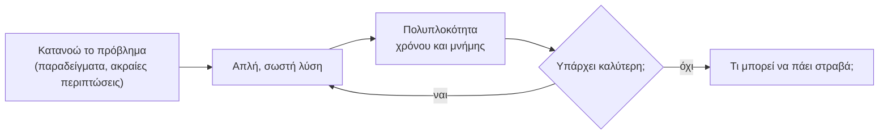
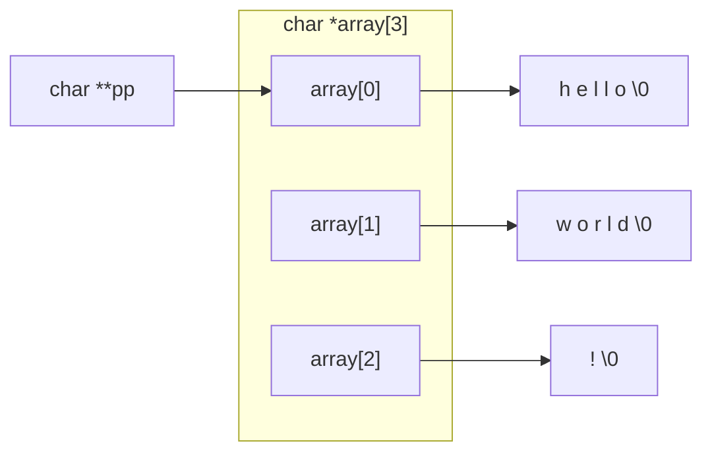
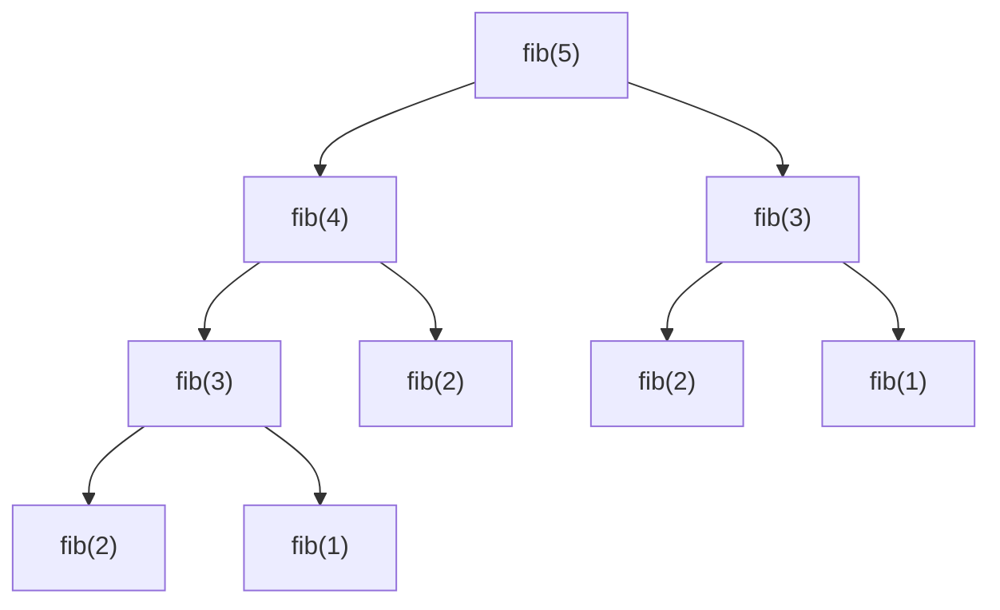

# Κεφάλαιο 16: Επίλυση Προβλημάτων #2

<!--  -->

> **Στόχοι:** μετά από αυτό το κεφάλαιο θα μπορείτε να
> εκτιμάτε τη χρονική και τη χωρική πολυπλοκότητα μιας μικρής συνάρτησης· να
> ανταλλάσσετε χρόνο με μνήμη (ή το αντίστροφο) όταν ψάχνετε διπλότυπα σε πίνακα· να
> χειρίζεστε τα ψηφία ενός αριθμού με `/` και `%`· να ξεχωρίζετε τα `char *array[]`,
> `char **array` και `char array[10][10]`· να «επιστρέφετε» πολλές τιμές μέσω
> δεικτών· να βγαίνετε από εμφωλευμένους βρόχους· να φτιάχνετε δισδιάστατο πίνακα
> στον σωρό· να γράφετε αποδοτική αναδρομική Fibonacci· και να μετράτε μνήμη και να
> εξετάζετε δυαδικά αρχεία για την Εργασία #1.
>
> **Προαπαιτούμενα:** [Κεφάλαιο 10](../10-arrays/), [Κεφάλαιο 11](../11-pointers-recursion/), [Κεφάλαιο 12](../12-pointers-arrays/), [Κεφάλαιο 13](../13-memory/), [Κεφάλαιο 15](../15-complexity-preprocessor/)
>
> **Χρόνος μελέτης:** ~2,5 ώρες

## Σύνοψη

Η διάλεξη αυτή είναι μια διάλεξη εξάσκησης, με την ίδια λογική με το
[Κεφάλαιο 7](../07-problem-solving/): δεν εισάγει νέα στοιχεία της γλώσσας, αλλά
θέτει μια σειρά από μικρά προβλήματα «Θέλω μια συνάρτηση που … Πώς;» και τα λύνει
ζωντανά, με εθελοντές από το ακροατήριο. Τα προβλήματα ανακυκλώνουν όλη την ύλη ως
τώρα: πίνακες, ψηφία αριθμών, συμβολοσειρές, δείκτες, δισδιάστατους πίνακες, τον σωρό
και την αναδρομή. Το νέο στοιχείο είναι η ερώτηση που συνοδεύει σχεδόν κάθε πρόβλημα:
«Χρονική και χωρική πολυπλοκότητα;» Μετά το [Κεφάλαιο 15](../15-complexity-preprocessor/)
δεν αρκεί μια λύση που δουλεύει· θέλουμε να ξέρουμε πόσο κοστίζει και αν υπάρχει
καλύτερη. Η διάλεξη κλείνει με πρακτικές απαντήσεις σε ερωτήσεις για την Εργασία #1.

## Θεωρία

<a id="s16-1"></a><a id="γιατί-εξασκούμαστε-στην-επίλυση-προβλημάτων"></a>

### §16.1 Γιατί εξασκούμαστε στην επίλυση προβλημάτων

Η επίλυση προβλημάτων είναι δεξιότητα, όχι γνώση που αποστηθίζεται: το «δεν δουλεύει,
γιατί;» και το εξίσου ύπουλο «δουλεύει, γιατί;» απαντώνται μόνο με εξάσκηση. Οι
διαφάνειες δίνουν τέσσερις λόγους: **εξάσκηση**, **γνώση** (κάθε λυμένο πρόβλημα
γίνεται μοτίβο για το επόμενο), **εφαρμογές** (τα ίδια μοτίβα εμφανίζονται σε
εργασίες, εξετάσεις και πραγματικό κώδικα) και **δημιουργία / σύνθεση ιδεών**. Γι' αυτό
πολλά προβλήματα της διάλεξης είναι γνωστά από προηγούμενα κεφάλαια· η αξία είναι να
τα λύνετε γρήγορα και να τα αναλύετε.



*Σχήμα: η σειρά ερωτήσεων που θέτει η διάλεξη για κάθε πρόβλημα.*

<a id="s16-2"></a><a id="χρονική-και-χωρική-πολυπλοκότητα-μιας-συνάρτησης"></a>

### §16.2 Χρονική και χωρική πολυπλοκότητα μιας συνάρτησης

Η **χρονική πολυπλοκότητα** (time complexity) μετρά πώς μεγαλώνει το πλήθος των
βημάτων όσο μεγαλώνει η είσοδος $n$· η **χωρική πολυπλοκότητα** (space complexity)
μετρά πόση *επιπλέον* μνήμη χρειάζεται, πέρα από την είσοδο. Και οι δύο γράφονται με
τον συμβολισμό $O$ του [Κεφαλαίου 15](../15-complexity-preprocessor/). Πρακτικοί
κανόνες:

- Ένα πέρασμα από τα $n$ στοιχεία με σταθερή δουλειά ανά βήμα: $O(n)$ χρόνος. Δύο
  εμφωλευμένοι βρόχοι πάνω στα $n$: $O(n^2)$.
- Λίγες βοηθητικές μεταβλητές: $O(1)$ μνήμη· ένας βοηθητικός πίνακας $n$ θέσεων: $O(n)$.
- Η αναδρομή κοστίζει μνήμη: κάθε ενεργή κλήση έχει το stack frame της
  ([Κεφάλαιο 13](../13-memory/)), άρα βάθος $n$ σημαίνει $O(n)$ μνήμη.
- Αναλύουμε τη **χειρότερη περίπτωση** (worst case). Η σειριακή αναζήτηση μπορεί να
  βρει το στοιχείο με την πρώτη, αλλά όταν λείπει ελέγχει και τα $n$: είναι $O(n)$.
- Με σταθερό μέγεθος (ακριβώς 100 στοιχεία) όλα είναι τυπικά $O(1)$· η ουσιαστική
  ερώτηση είναι πώς κλιμακώνεται η λύση όταν το 100 γίνει $n$.

<a id="s16-3"></a><a id="χρόνος-ή-μνήμη-το-αντιστάθμισμα"></a>

### §16.3 Χρόνος ή μνήμη: το αντιστάθμισμα

Συχνά μια λύση γίνεται ταχύτερη αν ξοδέψει μνήμη, ή το αντίστροφο: αυτό είναι το
**αντιστάθμισμα χρόνου–μνήμης** (time–space tradeoff). Το «βρες το στοιχείο που
εμφανίζεται δύο φορές» το δείχνει καθαρά:

| Ιδέα | Χρόνος | Μνήμη |
| --- | --- | --- |
| Σύγκριση κάθε ζεύγους με δύο εμφωλευμένους βρόχους | $O(n^2)$ | $O(1)$ |
| Ταξινόμηση και σύγκριση γειτονικών στοιχείων | $O(n \log n)$ | ανάλογα με την ταξινόμηση |
| Πίνακας «το έχω δει» με μία θέση ανά δυνατή τιμή | $O(n)$ | $O(k)$, $k$ το εύρος των τιμών |

Η τρίτη ιδέα δουλεύει μόνο όταν οι τιμές έχουν μικρό, γνωστό εύρος (π.χ. 0–999): για
τυχαίους `int` θα χρειαζόταν $2^{32}$ θέσεις. Η ταξινόμηση έρχεται στο
[Κεφάλαιο 17](../17-binary-search-sorting/).

Μερικές φορές μια ιδιότητα του προβλήματος δίνει και τα δύο. Όταν «όλα τα στοιχεία
είναι διπλά εκτός από ένα», αρκεί το **αποκλειστικό Ή** (XOR, `^`) του
[Κεφαλαίου 4](../04-git-operators/), χάρη στις ιδιότητες

$$x \oplus x = 0, \qquad x \oplus 0 = x, \qquad x \oplus y = y \oplus x$$

Το XOR όλων των στοιχείων μηδενίζει κάθε ζευγάρι, όποια σειρά κι αν έχουν, και αφήνει
μόνο το μοναδικό: $O(n)$ χρόνος, $O(1)$ μνήμη.

<a id="s16-4"></a><a id="τα-ψηφία-ενός-αριθμού"></a>

### §16.4 Τα ψηφία ενός αριθμού

Για μη αρνητικό ακέραιο `n`, το `n % 10` είναι το **τελευταίο ψηφίο** και το `n / 10`
ο αριθμός **χωρίς** αυτό (123 → 3 και 12). Επαναλαμβάνοντας μέχρι `n == 0` παίρνουμε τα
ψηφία από δεξιά προς τα αριστερά. Το αντίστροφο μοτίβο, `r = 10 * r + digit`, σπρώχνει
ό,τι έχουμε μία θέση αριστερά και προσθέτει ψηφίο στις μονάδες. Τα δύο μαζί δίνουν την
αντιστροφή ψηφίων, και από εκεί τον έλεγχο **παλινδρομικού** αριθμού (palindrome:
διαβάζεται ίδια και από τις δύο μεριές, π.χ. 12321). Ο βρόχος κάνει τόσα βήματα όσα τα
ψηφία, δηλαδή $O(\log n)$.

Δύο προσοχές: ο αντεστραμμένος αριθμός μπορεί να μη χωρά σε `int` (το 1000000009 χωρά,
το 9000000001 όχι)· και για αρνητικό `n` το `n % 10` είναι αρνητικό στη C (το πρόσημο
ακολουθεί τον διαιρετέο), οπότε το -45 γίνεται -54.

<a id="s16-5"></a><a id="από-χαρακτήρες-σε-αριθμό-η-atoi-και-τα-όριά-της"></a>

### §16.5 Από χαρακτήρες σε αριθμό: η `atoi` και τα όριά της

Το ίδιο μοτίβο `10 * result + digit`, με `digit = c - '0'`, μετατρέπει μια
συμβολοσειρά ψηφίων σε ακέραιο, σε $O(n)$ χρόνο και $O(1)$ μνήμη
([Κεφάλαιο 11](../11-pointers-recursion/)). Στο «Τι μπορεί να πάει στραβά;» η
απάντηση είναι οι υποθέσεις που ο καλών μπορεί να παραβιάσει:

- **Μη ψηφία.** Το `"-5"` ή το `"12a"` δίνουν σκουπίδια χωρίς ένδειξη λάθους, και ο
  καλών δεν ξεχωρίζει το `"0"` από μια αποτυχία.
- **Υπερχείλιση.** Πάνω από `INT_MAX` (2147483647) ο αριθμός δεν χωρά· η υπερχείλιση
  προσημασμένου ακεραίου είναι απροσδιόριστη συμπεριφορά.
- **Χωρίς `'\0'`.** Ο βρόχος διαβάζει εκτός ορίων.
- **Όνομα.** Η `atoi` υπάρχει ήδη στη `stdlib.h` και οι δύο συγκρούονται.

<a id="s16-6"></a><a id="λίγα-μαθηματικά-αντί-για-εξαντλητική-αναζήτηση"></a>

### §16.6 Λίγα μαθηματικά αντί για εξαντλητική αναζήτηση

Για το άθροισμα των τέλειων τετραγώνων στο $[a, b]$, η πρώτη ιδέα ελέγχει κάθε αριθμό
του διαστήματος: $O(b - a)$ έλεγχοι. Όμως έως το $b$ υπάρχουν μόνο
$\lfloor\sqrt{b}\rfloor$ τετράγωνα· αν διατρέξουμε τα $k = 1, 2, \dots$ και
προσθέσουμε τα $k^2$ του διαστήματος, κάνουμε $O(\sqrt{b})$ βήματα: για $b = 10^{12}$,
ένα εκατομμύριο αντί για ένα τρισεκατομμύριο. Ο τύπος

$$1^2 + 2^2 + \dots + m^2 = \frac{m(m+1)(2m+1)}{6}$$

δίνει την απάντηση σε σταθερό χρόνο, ως διαφορά των αθροισμάτων για
$m = \lfloor\sqrt{b}\rfloor$ και $m = \lfloor\sqrt{a-1}\rfloor$. Το δίδαγμα: πριν
γράψετε βρόχο, σκεφτείτε αν η δομή του προβλήματος σας γλιτώνει από το να επισκεφθείτε
όλη την είσοδο. Τα αθροίσματα μεγαλώνουν γρήγορα, οπότε χρειάζεται `long long`.

<a id="s16-7"></a><a id="char-array-char-array-και-char-array1010"></a>

### §16.7 `char *array[]`, `char **array` και `char array[10][10]`

Και με τις τρεις γράφουμε `array[i][j]`, αλλά περιγράφουν διαφορετικά πράγματα στη
μνήμη ([Κεφάλαιο 12](../12-pointers-arrays/)):

| Δήλωση | Τι είναι | `sizeof` (64 bit) |
| --- | --- | --- |
| `char *array[3]` | πίνακας από 3 pointers, ο καθένας προς δική του συμβολοσειρά | 24 |
| `char **array` | **μία** μεταβλητή δείκτη, προς ένα `char *` | 8 |
| `char array[10][10]` | 100 συνεχόμενοι χαρακτήρες σε 10 γραμμές· κανένας pointer | 100 |



*Σχήμα: πίνακας από pointers και ένας `char **` προς το πρώτο στοιχείο του· ο
`char array[10][10]` δεν έχει βέλη, μόνο 100 συνεχόμενα bytes.*

- Ο `char *array[]` σε έκφραση γίνεται δείκτης στο πρώτο του στοιχείο, δηλαδή
  `char **`. Γι' αυτό, **ως παράμετρος**, το `char *argv[]` και το `char **argv`
  είναι το ίδιο.
- Ο `char array[10][10]` γίνεται δείκτης στην πρώτη **γραμμή**, τύπου `char (*)[10]`,
  **όχι** `char **`. Η θέση του `array[i][j]` υπολογίζεται (`i * 10 + j`), ενώ στον
  `char *array[]` διαβάζεται πρώτα ο pointer `array[i]`. Σε συνάρτηση περνά ως
  `char array[][10]`, με γνωστό το πλήθος των στηλών.

<a id="s16-8"></a><a id="πολλές-τιμές-από-μία-συνάρτηση-δείκτες-ως-ορίσματα"></a>

### §16.8 Πολλές τιμές από μία συνάρτηση: δείκτες ως ορίσματα

Μια συνάρτηση επιστρέφει με `return` **μία** τιμή, και τα ορίσματα περνούν **κατά
τιμή** (call by value): η συνάρτηση παίρνει αντίγραφα. Γι' αυτό μια
`void swap(int x, int y)` ανταλλάσσει τα αντίγραφα και δεν αλλάζει τίποτα στον
καλούντα. Η λύση είναι να περάσουμε τις **διευθύνσεις** (`swap(&a, &b)`) και η
συνάρτηση να γράψει μέσω των δεικτών (`*a = ...`).

Με το ίδιο μοτίβο μια συνάρτηση «επιστρέφει» όσες τιμές θέλει: ο καλών δίνει μια
διεύθυνση για κάθε αποτέλεσμα (**παράμετρος εξόδου**, output parameter), και το
`return` μένει ελεύθερο για να πει αν η κλήση πέτυχε, όπως στη `scanf`. Έτσι γράφεται
η `get_two_chars`. Εναλλακτικά ο καλών δίνει έναν πίνακα `char out[2]` να γεμίσει· οι
δομές (`struct`), που ομαδοποιούν πολλές τιμές, έρχονται στο
[Κεφάλαιο 19](../19-structs/).

<a id="s16-9"></a><a id="έξοδος-από-εμφωλευμένους-βρόχους"></a>

### §16.9 Έξοδος από εμφωλευμένους βρόχους

Η αναζήτηση σε δισδιάστατο πίνακα θέλει δύο εμφωλευμένους βρόχους,
$O(\text{γραμμές} \cdot \text{στήλες})$. Η παγίδα είναι η έξοδος: το `break` βγάζει
**μόνο από τον εσωτερικό** βρόχο ([Κεφάλαιο 8](../08-control-flow-2/)), οπότε ο
εξωτερικός συνεχίζει και το `"yes"` μπορεί να τυπωθεί πολλές φορές. Τρεις σωστοί τρόποι:

1. **Συνάρτηση με `return`**, που βγαίνει από όλους τους βρόχους μαζί. Ο πιο καθαρός.
2. **Σημαία** (flag) `found` στις συνθήκες και των δύο βρόχων.
3. **`goto`** σε ετικέτα μετά τους βρόχους: μία από τις λίγες αποδεκτές χρήσεις της.

<a id="s16-10"></a><a id="δισδιάστατος-πίνακας-στον-σωρό"></a>

### §16.10 Δισδιάστατος πίνακας στον σωρό

Όταν οι διαστάσεις γίνονται γνωστές μόνο στην εκτέλεση, ο πίνακας φτιάχνεται στον σωρό,
με δύο τρόπους:

- **`int **` με μία `malloc` ανά γραμμή**, όπως στο [Κεφάλαιο 13](../13-memory/):
  γράφουμε `grid[i][j]`, αλλά χρειάζονται $M + 1$ κλήσεις `malloc` και $M + 1$ `free`
  (πρώτα οι γραμμές), και οι γραμμές δεν είναι συνεχόμενες.
- **Ένα μπλοκ `M × N`**, με υπολογισμό της θέσης όπως κάνει ο μεταγλωττιστής για τους
  στατικούς πίνακες: πρώτα προσπερνάμε `i` γραμμές και μετά `j` στοιχεία.

```c
int *grid = malloc(M * N * sizeof(int));   // + έλεγχος για NULL
grid[i * N + j] = 42;                      // το "grid[i][j]"
free(grid);                                // μία free για όλα
```

<a id="s16-11"></a><a id="αναδρομή-χωρίς-επανυπολογισμούς"></a>

### §16.11 Αναδρομή χωρίς επανυπολογισμούς

Η αναδρομική Fibonacci του ορισμού, `fib(n) = fib(n-1) + fib(n-2)`, είναι σωστή αλλά
εκθετική: η `fib(n-1)` ξαναϋπολογίζει την `fib(n-2)` που υπολογίζει και ο δεύτερος
κλάδος, σε κάθε επίπεδο. Το πλήθος των κλήσεων μεγαλώνει όπως οι ίδιοι οι αριθμοί
Fibonacci (περίπου $1{,}6^n$): για `fib(40)` πάνω από 300 εκατομμύρια.



*Σχήμα: μέρος του δέντρου κλήσεων της απλής `fib(5)`· η `fib(3)` υπολογίζεται δύο
φορές και η `fib(2)` τρεις.*

Στο «Γίνεται αναδρομικά και αποδοτικά;» η απάντηση είναι ναι:

- **Απομνημόνευση (memoization):** κρατάμε κάθε αποτέλεσμα σε πίνακα `memo[]` την
  πρώτη φορά και το επιστρέφουμε αμέσως στις επόμενες. $O(n)$ χρόνος και μνήμη.
- **Οι δύο τελευταίες τιμές ως ορίσματα:** κάθε κλήση κουβαλά τα $F_k$, $F_{k+1}$ και
  κάνει μία μόνο αναδρομική κλήση, άρα μια αλυσίδα $n$ κλήσεων.

Το ίδιο πρόβλημα είναι το ερώτημα 2.6 (`fib_rec_fast`) του `fib.c` στο
[Εργαστήριο 5](https://progintro.github.io/lab-material/labs/lab05/).

<a id="s16-12"></a><a id="εργαλεία-για-την-εργασία-1"></a>

### §16.12 Εργαλεία για την Εργασία #1

Η Εργασία #1 επεξεργάζεται αρχεία wav, έχει όριο μνήμης και διαβάζει δυαδικά δεδομένα.
Η διάλεξη απαντά σε τρεις ερωτήσεις γι' αυτήν:

- **Πόση μνήμη χρησιμοποιεί το πρόγραμμά μου;** Η `/usr/bin/time -v ./prog` (με όλη τη
  διαδρομή, αλλιώς τρέχει η ενσωματωμένη `time` του shell) τυπώνει τη γραμμή «Maximum
  resident set size (kbytes)», τη μέγιστη μνήμη της διεργασίας. Η `memusage ./prog`
  δείχνει τη χρήση του σωρού (peak και κλήσεις `malloc`/`free`).
- **Πώς διαβάζω δυαδικά δεδομένα;** Όχι με `cat`. Οι `xxd` και `hexdump -C` δείχνουν τα
  bytes σε δεκαεξαδική μορφή δίπλα στους χαρακτήρες· η `hexedit` τα επεξεργάζεται. Για
  σύγκριση με την αναμενόμενη έξοδο, η `cmp` αναφέρει το πρώτο byte που διαφέρει (και
  τίποτα αν τα αρχεία είναι ίδια) και η `vbindiff` δείχνει δύο αρχεία δίπλα-δίπλα.
- **Πώς φτιάχνω υποεντολές;** Μια υποεντολή (subcommand), όπως το `info` στο
  `./soundwave info`, είναι απλώς το `argv[1]`: ελέγχουμε πρώτα το `argc` και μετά
  συγκρίνουμε με `strcmp` (0 σημαίνει ίσες) και καλούμε μια συνάρτηση ανά υποεντολή.

## Παραδείγματα

<a id="s16-13"></a><a id="προθέρμανση-μέσος-όρος-και-αναζήτηση"></a>

### §16.13 Προθέρμανση: μέσος όρος και αναζήτηση

Οι λύσεις των διαφανειών για τα δύο πρώτα προβλήματα, με πίνακα 100 ακεραίων:

```c
int average(int grades[100]) {
  int i, sum = 0;
  for(i = 0; i < 100; i++) {
    sum += grades[i];
  }
  return sum / 100;
}

int find(int haystack[100], int needle) {
  int i;
  for(i = 0; i < 100; i++) {
    if (haystack[i] == needle) {
      return i;
    }
  }
  return -1;
}
```

Και οι δύο είναι $O(n)$ χρόνος και $O(1)$ μνήμη («Χρονική και χωρική
πολυπλοκότητα»). Στην `average` το `sum / 100` είναι ακέραια διαίρεση (5,5 γίνεται
5)· για ακρίβεια επιστρέψτε `double` με `sum / 100.0`. Στη `find` το `return i`
σταματά στην πρώτη εμφάνιση και το `-1` σημαίνει «δεν βρέθηκε», αφού δεν είναι ποτέ
έγκυρη θέση. Σε ταξινομημένο πίνακα η δυαδική αναζήτηση του
[Κεφαλαίου 17](../17-binary-search-sorting/) θα έκανε $O(\log n)$.

<a id="s16-14"></a><a id="διπλό-και-μοναδικό-στοιχείο"></a>

### §16.14 Διπλό και μοναδικό στοιχείο

Για το «στοιχείο που υπάρχει δύο φορές» (ο `{8, 1, 5, 42, 7, 3, 42}` δίνει 42), η απλή
λύση της πρώτης γραμμής του πίνακα της Θεωρίας, και για το «όλα διπλά εκτός από ένα»
η λύση με XOR:

```c
int find_duplicate(int a[], int n) {     // O(n^2) χρόνος, O(1) μνήμη
  for (int i = 0; i < n; i++)
    for (int j = i + 1; j < n; j++)
      if (a[i] == a[j])
        return a[i];
  return -1;
}

int find_single(int a[], int n) {        // O(n) χρόνος, O(1) μνήμη
  int x = 0;
  for (int i = 0; i < n; i++)
    x ^= a[i];
  return x;
}
```

Στη `find_duplicate` το `j` ξεκινά από `i + 1`, ώστε κάθε ζεύγος να ελεγχθεί μία φορά
και κανένα στοιχείο να μη συγκριθεί με τον εαυτό του. Για τον `{4, 9, 2, 4, 7, 2, 9}` η
`find_single` δίνει $(4 \oplus 4) \oplus (9 \oplus 9) \oplus (2 \oplus 2) \oplus 7 = 7$.

<a id="s16-15"></a><a id="αντιστροφή-ψηφίων-και-παλινδρομικοί-αριθμοί"></a>

### §16.15 Αντιστροφή ψηφίων και παλινδρομικοί αριθμοί

Με το μοτίβο «Τα ψηφία ενός αριθμού»:

```c
int reverse(int n) {
  int rev = 0;
  while (n != 0) {
    rev = rev * 10 + n % 10;   // κόλλα το τελευταίο ψηφίο του n στο rev
    n /= 10;                   // και πέτα το από το n
  }
  return rev;
}

int is_palindrome(int n) {
  return n >= 0 && n == reverse(n);
}
```

Τα `reverse(123)`, `reverse(1200)` και `reverse(-45)` δίνουν 321, 21 και -54· το
`is_palindrome(12321)` δίνει 1 και το `is_palindrome(1231)` 0. Το 1200 γίνεται 21
γιατί ένας ακέραιος δεν έχει αρχικά μηδενικά, κάτι που δεν πειράζει τον έλεγχο
παλινδρομικού. Εναλλακτικά, βάλτε τα ψηφία σε πίνακα και συγκρίνετε με δύο δείκτες
θέσης που κινούνται από τα άκρα προς τη μέση.

<a id="s16-16"></a><a id="η-atoi"></a>

### §16.16 Η `atoi`

Η λύση των διαφανειών:

```c
int atoi(char digits[]) {
  int result = 0;
  for(int i = 0; digits[i]; i++) {
    result = 10 * result + digits[i] - '0';
  }
  return result;
}
```

Για το `"123"` το `result` γίνεται 1, 12, 123. Τα προβλήματά της αναλύονται στη
Θεωρία («Από χαρακτήρες σε αριθμό»). Μια ανθεκτικότερη εκδοχή ελέγχει κάθε χαρακτήρα
με `'0' <= c && c <= '9'`, χειρίζεται το πρόσημο και επιστρέφει την επιτυχία χωριστά
από την τιμή (με παράμετρο εξόδου).

<a id="s16-17"></a><a id="άθροισμα-τέλειων-τετραγώνων-σε-διάστημα"></a>

### §16.17 Άθροισμα τέλειων τετραγώνων σε διάστημα

```c
long long sum_squares(long long a, long long b) {
  long long sum = 0;
  for (long long k = 0; k * k <= b; k++)
    if (k * k >= a)
      sum += k * k;
  return sum;
}
```

Η `sum_squares(10, 50)` δίνει $16 + 25 + 36 + 49 = 126$. Η
`sum_squares(1, 1000000000000LL)` κάνει ένα εκατομμύριο βήματα, τελειώνει ακαριαία
και δίνει 333333833333500000, όσο και ο τύπος της Θεωρίας με $m = 10^6$.

<a id="s16-18"></a><a id="η-get_two_chars"></a>

### §16.18 Η `get_two_chars`

Δύο χαρακτήρες «επιστρέφονται» μέσω παραμέτρων εξόδου, και το `return` λέει αν
πέτυχε η ανάγνωση:

```c
int get_two_chars(char *first, char *second) {
  int c1 = getchar();
  int c2 = getchar();
  if (c1 == EOF || c2 == EOF)
    return 0;
  *first = c1;
  *second = c2;
  return 1;
}
```

Με `char a, b;` και `while (get_two_chars(&a, &b)) printf("[%c%c]\n", a, b);`, η
είσοδος `abcde` τυπώνει `[ab]` και `[cd]`· το μονό `e` αγνοείται. Οι `c1`, `c2` είναι
`int` γιατί η `getchar` επιστρέφει `int` ώστε να χωρά το `EOF`
([Κεφάλαιο 9](../09-input/)). Στην Εργασία #1, όπου οι δομές απαγορεύονται και η
είσοδος διαβάζεται μόνο με `getchar`, έτσι γράφονται βοηθητικές που διαβάζουν πεδία
πολλών bytes.

<a id="s16-19"></a><a id="η-swap"></a>

### §16.19 Η `swap`

Οι διαφάνειες δίνουν τη `main` και ζητούν τη `swap(...)` που λείπει. Η λύση:

```c
#include <stdio.h>

void swap(int *a, int *b) {
  int tmp = *a;
  *a = *b;
  *b = tmp;
}

int main() {
  int a = 100, b = 200;
  printf("%d %d\n", a, b);
  swap(&a, &b);
  printf("%d %d\n", a, b);
  return 0;
}
```

```text
$ ./swap
100 200
200 100
```

Η `tmp` χρειάζεται γιατί μετά το `*a = *b` η αρχική τιμή του `*a` έχει χαθεί. Οι
παράμετροι λέγονται κι αυτές `a` και `b`, αλλά είναι άλλες μεταβλητές (τύπου `int *`),
τοπικές στη `swap`.

<a id="s16-20"></a><a id="yes-αν-ένα-στοιχείο-υπάρχει-σε-δισδιάστατο-πίνακα"></a>

### §16.20 «yes» αν ένα στοιχείο υπάρχει σε δισδιάστατο πίνακα

Με τον πρώτο τρόπο της «Έξοδος από εμφωλευμένους βρόχους»:

```c
int contains(int grid[ROWS][COLS], int needle) {
  for (int i = 0; i < ROWS; i++)
    for (int j = 0; j < COLS; j++)
      if (grid[i][j] == needle)
        return 1;          // βγαίνει και από τους δύο βρόχους
  return 0;
}
```

Η `main` κάνει `if (contains(grid, 7)) printf("yes\n");` και το `"yes"` τυπώνεται μία
φορά. Με σημαία, οι βρόχοι θα γίνονταν `for (i = 0; i < ROWS && !found; i++)` και
αντίστοιχα για τον εσωτερικό.

<a id="s16-21"></a><a id="αποδοτική-αναδρομική-fibonacci"></a>

### §16.21 Αποδοτική αναδρομική Fibonacci

Με απομνημόνευση («Αναδρομή χωρίς επανυπολογισμούς»):

```c
#define MAXN 92

long long memo[MAXN + 1];   // global: αρχικοποιείται με μηδενικά

long long fib(int n) {
  if (n <= 1)
    return n;
  if (memo[n] != 0)         // το έχουμε ήδη υπολογίσει
    return memo[n];
  memo[n] = fib(n - 1) + fib(n - 2);
  return memo[n];
}
```

Το 0 σημαίνει «δεν έχει υπολογιστεί», αφού για $n \ge 2$ κανένας αριθμός Fibonacci δεν
είναι 0. Η `fib(50)` δίνει 12586269025 και η `fib(92)`, ο μεγαλύτερος που χωρά σε
`long long`, 7540113804746346429, ακαριαία. Η απλή εκδοχή θα έκανε περίπου
$2{,}4 \cdot 10^{19}$ κλήσεις για τη `fib(92)`: αιώνες, ακόμη και με ένα δισεκατομμύριο
κλήσεις το δευτερόλεπτο. Η δεύτερη τεχνική, με τις δύο τελευταίες τιμές ως ορίσματα:

```c
long long fib_acc(int n, long long a, long long b) {
  return n == 0 ? a : fib_acc(n - 1, b, a + b);
}
```

Η `fib_acc(50, 0, 1)` δίνει πάλι 12586269025, με 51 κλήσεις.

<a id="s16-22"></a><a id="υποεντολές-με-argv1"></a>

### §16.22 Υποεντολές με `argv[1]`

Ο σκελετός μιας `main` με υποεντολές, για την Εργασία #1:

```c
#include <stdio.h>
#include <string.h>

int main(int argc, char **argv) {
  if (argc < 2) {
    fprintf(stderr, "Usage: %s info|rate ...\n", argv[0]);
    return 1;
  }
  if (strcmp(argv[1], "info") == 0) {
    printf("running info\n");
  } else if (strcmp(argv[1], "rate") == 0 && argc == 3) {
    printf("running rate with %s\n", argv[2]);
  } else {
    fprintf(stderr, "Unknown subcommand: %s\n", argv[1]);
    return 1;
  }
  return 0;
}
```

Το `./sub rate 2.0` τυπώνει `running rate with 2.0`, ενώ το `./sub foo` τυπώνει
μήνυμα λάθους στο `stderr` και τερματίζει με κωδικό 1. Στην πράξη κάθε κλάδος καλεί τη
δική του συνάρτηση (`do_info()`, `do_rate(...)`).

## Κύρια σημεία

1. Η επίλυση προβλημάτων μαθαίνεται με εξάσκηση: κάθε λυμένο πρόβλημα γίνεται μοτίβο
   για το επόμενο.
2. Για κάθε λύση ρωτάμε «χρονική και χωρική πολυπλοκότητα;», στη χειρότερη περίπτωση.
3. Ο μέσος όρος και η σειριακή αναζήτηση σε $n$ στοιχεία είναι $O(n)$ χρόνος και
   $O(1)$ μνήμη.
4. Συχνά ανταλλάσσουμε μνήμη με χρόνο: το διπλό στοιχείο βρίσκεται σε $O(n^2)$ χωρίς
   μνήμη, σε $O(n \log n)$ με ταξινόμηση, ή σε $O(n)$ με βοηθητικό πίνακα αν οι τιμές
   έχουν μικρό εύρος.
5. Όταν όλα τα στοιχεία είναι διπλά εκτός από ένα, το XOR όλων τους δίνει το μοναδικό
   σε $O(n)$ χρόνο και $O(1)$ μνήμη.
6. Τα `n % 10`, `n / 10` και `10 * r + digit` δίνουν την αντιστροφή ψηφίων, τον
   έλεγχο παλινδρομικού και την `atoi`.
7. Μια συνάρτηση που μετατρέπει δεδομένα πρέπει να σκεφτεί την άκυρη είσοδο, την
   υπερχείλιση και το τερματικό `'\0'`.
8. Λίγα μαθηματικά αλλάζουν την πολυπλοκότητα: τα τέλεια τετράγωνα έως $b$ είναι μόνο
   $\sqrt{b}$.
9. Ο `char *array[]` είναι πίνακας από pointers, ο `char **array` ένας pointer και ο
   `char array[10][10]` 100 συνεχόμενοι χαρακτήρες· ως παράμετροι, μόνο οι δύο πρώτοι
   είναι ισοδύναμοι.
10. Τα ορίσματα περνούν κατά τιμή· για να αλλάξει μεταβλητές του καλούντος (`swap`) ή να
    «επιστρέψει» πολλές τιμές, μια συνάρτηση παίρνει τις διευθύνσεις τους.
11. Το `break` βγάζει μόνο από τον εσωτερικό βρόχο· για εμφωλευμένους βρόχους
    χρησιμοποιούμε `return`, σημαία ή `goto`.
12. Ένας δισδιάστατος πίνακας στον σωρό είναι είτε `int **` με μία `malloc` ανά γραμμή
    είτε ένα μπλοκ `M × N` με δείκτη `i * N + j`.
13. Η απλή αναδρομική Fibonacci είναι εκθετική· με απομνημόνευση ή με τις δύο
    τελευταίες τιμές ως ορίσματα γίνεται $O(n)$.
14. Για την Εργασία #1: `/usr/bin/time -v` και `memusage` μετρούν μνήμη· `xxd`,
    `hexdump`, `hexedit`, `cmp` και `vbindiff` δείχνουν και συγκρίνουν δυαδικά αρχεία·
    οι υποεντολές είναι σύγκριση του `argv[1]` με `strcmp`.

## Ορολογία

| Ελληνικά | English | Σύντομος ορισμός |
| --- | --- | --- |
| χρονική πολυπλοκότητα | time complexity | Πώς αυξάνονται τα βήματα με το μέγεθος της εισόδου. |
| χωρική πολυπλοκότητα | space complexity | Πόση επιπλέον μνήμη χρειάζεται σε σχέση με την είσοδο. |
| χειρότερη περίπτωση | worst case | Η είσοδος που κάνει τον αλγόριθμο να δουλέψει περισσότερο. |
| αντιστάθμισμα χρόνου–μνήμης | time–space tradeoff | Ταχύτερη λύση με περισσότερη μνήμη, ή το αντίστροφο. |
| αποκλειστικό Ή | XOR (`^`) | Bit 1 όταν τα δύο bits διαφέρουν· $x \oplus x = 0$. |
| παλινδρομικός | palindrome | Που διαβάζεται ίδια και από τις δύο μεριές. |
| κλήση κατά τιμή | call by value | Η συνάρτηση παίρνει αντίγραφα των ορισμάτων. |
| παράμετρος εξόδου | output parameter | Δείκτης μέσω του οποίου η συνάρτηση γράφει ένα αποτέλεσμα. |
| σημαία | flag | Μεταβλητή που καταγράφει ότι συνέβη κάτι (π.χ. `found`). |
| απομνημόνευση | memoization | Αποθήκευση αποτελεσμάτων ώστε να μην ξαναϋπολογίζονται. |
| υποεντολή | subcommand | Λέξη στο `argv[1]` που επιλέγει τι θα κάνει το πρόγραμμα. |

## Διάβασμα

- **Διαφάνειες:** [Διάλεξη 16](https://github.com/progintro/progintro.github.io/releases/download/2025/lec16.pdf),
  σελ. 1–28: γιατί εξάσκηση σελ. 5–6· μέσος όρος σελ. 8–9· αναζήτηση σελ. 10 και 15·
  διπλό στοιχείο σελ. 11· αντιστροφή ψηφίων σελ. 13· μοναδικό στοιχείο σελ. 14· `atoi`
  σελ. 16–17· τέλεια τετράγωνα σελ. 18· `char *array[]` / `char **` / `char [10][10]`
  σελ. 19· `get_two_chars` σελ. 20· παλινδρομικός σελ. 21· `swap` σελ. 22–23·
  δισδιάστατη αναζήτηση σελ. 24· δισδιάστατος στον σωρό σελ. 25· Fibonacci σελ. 26·
  Εργασία #1 σελ. 27.
- **Σημειώσεις:**
  - [Κεφάλαιο 11: Ταξινόμηση και αναζήτηση](https://progintro.github.io/notes/chapters/11-sorting-searching/),
    ενότητες «Ταξινόμηση πινάκων» (K04, σελ. 160–166, για τον συμβολισμό $O$) και
    «Αναζήτηση σε πίνακες» (K04, σελ. 172).
  - [Κεφάλαιο 5: Δείκτες και πίνακες](https://progintro.github.io/notes/chapters/05-pointers-arrays/),
    ενότητα «Δείκτες» (K04, σελ. 72–77, για τη `swap`).
  - [Κεφάλαιο 6: Δυναμική μνήμη, συμβολοσειρές και πολυδιάστατοι πίνακες](https://progintro.github.io/notes/chapters/06-memory-strings/),
    ενότητες «Πίνακες δεικτών και δείκτες σε δείκτες» (K04, σελ. 97) και
    «Πολυδιάστατοι πίνακες» (K04, σελ. 100–102).
  - [Κεφάλαιο 3: Η ροή του ελέγχου](https://progintro.github.io/notes/chapters/03-control-flow/),
    ενότητες «Εντολές `break` και `continue`» και «Εντολή `goto` και ετικέτες» (K04,
    σελ. 56–57).
- **Εργαστήρια:**
  [Εργαστήριο 5](https://progintro.github.io/lab-material/labs/lab05/): άσκηση `fib.c`
  (ερωτήματα 2.3–2.6)·
  [Εργαστήριο 6](https://progintro.github.io/lab-material/labs/lab06/): άσκηση
  `myprog.c` (αποτελέσματα μέσω δεικτών)·
  [Εργαστήριο 7](https://progintro.github.io/lab-material/labs/lab07/): ασκήσεις
  `twodim.c` και `mines.c` (δισδιάστατοι πίνακες, στατικοί και στον σωρό).
- **Άλλα:** `man 1 time`, `man 1 memusage`, `man 1 xxd`, `man 1 hexdump`, `man 1 cmp`,
  `man 3 strcmp`.

## Συχνά λάθη

- **Ακέραια διαίρεση στον μέσο όρο.** Το `sum / 100` δίνει 5 αντί για 5,5. Επιστρέψτε
  `double` με `sum / 100.0`.
- **Πολυπλοκότητα της καλύτερης περίπτωσης.** «Η `find` είναι $O(1)$ γιατί μπορεί να
  το βρει πρώτο» είναι λάθος: αναλύουμε τη χειρότερη, $O(n)$.
- **Σύγκριση στοιχείου με τον εαυτό του.** Με `for (j = 0; ...)` αντί για `j = i + 1`,
  το `a[i] == a[j]` ισχύει για `i == j` και «βρίσκεται» διπλό σε κάθε πίνακα.
- **Υπερχείλιση.** `reverse(1999999999)` ή `atoi("99999999999")` δίνουν λάθος αριθμό.
  Χρησιμοποιήστε ευρύτερο τύπο ή ελέγξτε πριν πολλαπλασιάσετε με 10.
- **`swap` κατά τιμή.** Η `void swap(int x, int y)` δεν αλλάζει τίποτα στην `main`.
  Δηλώστε `int *` παραμέτρους και καλέστε `swap(&a, &b)`.
- **Δισδιάστατος πίνακας σε παράμετρο `char **`.** Το `f(grid)` με `char grid[10][10]`
  δίνει incompatible pointer type (στο gcc 14 σφάλμα) και, αν τρέξει, κρασάρει.
  Δηλώστε `char grid[][10]`.
- **`break` σε εμφωλευμένους βρόχους.** Το `"yes"` τυπώνεται πολλές φορές. Βάλτε την
  αναζήτηση σε συνάρτηση με `return`.
- **`char` για το αποτέλεσμα της `getchar`.** Το `EOF` δεν ξεχωρίζει αξιόπιστα.
  Κρατήστε το σε `int` και ελέγξτε το πριν το αποθηκεύσετε.
- **`time -v` αντί για `/usr/bin/time -v`.** Η ενσωματωμένη `time` του shell δεν
  δέχεται `-v`.
- **`argv[1]` χωρίς έλεγχο του `argc`.** Το `./soundwave` χωρίς ορίσματα περνά `NULL`
  στην `strcmp` και κρασάρει. Ελέγξτε πρώτα `argc < 2`.

<!-- misconceptions -->

<!-- /misconceptions -->

## Ερωτήσεις κατανόησης

- <a id="e16-1"></a>**[Ε16.1](#e16-1)** Ποια η χρονική και ποια η χωρική πολυπλοκότητα της `average` για $n$
   στοιχεία;[^q1]
- <a id="e16-2"></a>**[Ε16.2](#e16-2)** Γιατί η σειριακή αναζήτηση είναι $O(n)$, αφού μερικές φορές τελειώνει σε ένα
   βήμα;[^q2]
- <a id="e16-3"></a>**[Ε16.3](#e16-3)** Γιατί το XOR όλων των στοιχείων δίνει το μοναδικό στοιχείο χωρίς ζευγάρι;[^q3]
- <a id="e16-4"></a>**[Ε16.4](#e16-4)** Τι δίνουν τα `4567 % 10` και `4567 / 10`;[^q4]
- <a id="e16-5"></a>**[Ε16.5](#e16-5)** Πόσα βήματα κάνει ο βρόχος των τέλειων τετραγώνων για $b = 10^{12}$;[^q5]
- <a id="e16-6"></a>**[Ε16.6](#e16-6)** Μπορείτε να περάσετε έναν `char grid[10][10]` σε παράμετρο `char **`;[^q6]
- <a id="e16-7"></a>**[Ε16.7](#e16-7)** Γιατί η `void swap(int x, int y)` δεν δουλεύει;[^q7]
- <a id="e16-8"></a>**[Ε16.8](#e16-8)** Στο ένα μπλοκ `M × N`, πού βρίσκεται το στοιχείο γραμμής `i`, στήλης `j`;[^q8]
- <a id="e16-9"></a>**[Ε16.9](#e16-9)** Γιατί η απλή αναδρομική `fib` είναι αργή, και τι κάνει η απομνημόνευση;[^q9]
- <a id="e16-10"></a>**[Ε16.10](#e16-10)** Πώς βλέπετε τη μέγιστη μνήμη που χρησιμοποίησε το πρόγραμμά σας;[^q10]

<!-- kahoot -->

<!-- /kahoot -->

## Ασκήσεις

<!-- exercises -->

### Ζέσταμα: από τις διαφάνειες (Α16.1–Α16.15)

- <a id="a16-1"></a>**[Α16.1](../../questions/slides/slides-lec16-average-complexity.md)** Μέσος όρος πίνακα και πολυπλοκότητα: Διάλεξη 16, διαφάνειες 8–9 · ★☆☆ · programming · `slides-lec16-average-complexity`
- <a id="a16-2"></a>**[Α16.2](../../questions/slides/slides-lec16-find-complexity.md)** Αναζήτηση σε πίνακα και πολυπλοκότητα: Διάλεξη 16, διαφάνειες 10 και 15 · ★☆☆ · programming · `slides-lec16-find-complexity`
- <a id="a16-3"></a>**[Α16.3](../../questions/slides/slides-lec16-get-two-chars.md)** Η συνάρτηση get_two_chars: Διάλεξη 16, διαφάνεια 20 · ★☆☆ · programming · `slides-lec16-get-two-chars`
- <a id="a16-4"></a>**[Α16.4](../../questions/slides/slides-lec16-palindrome-number.md)** Παλινδρομικός αριθμός: Διάλεξη 16, διαφάνεια 21 · ★☆☆ · programming · `slides-lec16-palindrome-number`
- <a id="a16-5"></a>**[Α16.5](../../questions/slides/slides-lec16-reverse-digits.md)** Αντιστροφή ψηφίων αριθμού: Διάλεξη 16, διαφάνεια 13 · ★☆☆ · programming · `slides-lec16-reverse-digits`
- <a id="a16-6"></a>**[Α16.6](../../questions/slides/slides-lec16-search-2d.md)** yes αν ένα στοιχείο υπάρχει σε δισδιάστατο πίνακα: Διάλεξη 16, διαφάνεια 24 · ★☆☆ · programming · `slides-lec16-search-2d`
- <a id="a16-7"></a>**[Α16.7](../../questions/slides/slides-lec16-swap.md)** Η συνάρτηση swap: Διάλεξη 16, διαφάνειες 22–23 · ★☆☆ · programming · `slides-lec16-swap`
- <a id="a16-8"></a>**[Α16.8](../../questions/slides/slides-lec16-why-practice.md)** Γιατί εξάσκηση στην επίλυση προβλημάτων;: Διάλεξη 16, διαφάνειες 5–6 · ★☆☆ · short-answer · `slides-lec16-why-practice`
- <a id="a16-9"></a>**[Α16.9](../../questions/slides/slides-lec16-atoi.md)** Η atoi και τι μπορεί να πάει στραβά: Διάλεξη 16, διαφάνειες 16–17 · ★★☆ · programming · `slides-lec16-atoi`
- <a id="a16-10"></a>**[Α16.10](../../questions/slides/slides-lec16-char-pointer-arrays.md)** char *array[], char **array και char array[10][10]: Διάλεξη 16, διαφάνεια 19 · ★★☆ · short-answer · `slides-lec16-char-pointer-arrays`
- <a id="a16-11"></a>**[Α16.11](../../questions/slides/slides-lec16-fibonacci-efficient.md)** Αποδοτική αναδρομική Fibonacci: Διάλεξη 16, διαφάνεια 26 · ★★☆ · programming · `slides-lec16-fibonacci-efficient`
- <a id="a16-12"></a>**[Α16.12](../../questions/slides/slides-lec16-find-duplicate.md)** Το στοιχείο που υπάρχει δύο φορές: Διάλεξη 16, διαφάνεια 11 · ★★☆ · programming · `slides-lec16-find-duplicate`
- <a id="a16-13"></a>**[Α16.13](../../questions/slides/slides-lec16-heap-2d-array.md)** Δισδιάστατος πίνακας στον σωρό: Διάλεξη 16, διαφάνεια 25 · ★★☆ · programming · `slides-lec16-heap-2d-array`
- <a id="a16-14"></a>**[Α16.14](../../questions/slides/slides-lec16-single-unpaired.md)** Το στοιχείο χωρίς ζευγάρι: Διάλεξη 16, διαφάνεια 14 · ★★☆ · programming · `slides-lec16-single-unpaired`
- <a id="a16-15"></a>**[Α16.15](../../questions/slides/slides-lec16-sum-perfect-squares.md)** Άθροισμα τέλειων τετραγώνων σε διάστημα: Διάλεξη 16, διαφάνεια 18 · ★★☆ · programming · `slides-lec16-sum-perfect-squares`

### Εργαστήριο (Α16.16–Α16.17)

- <a id="a16-16"></a>**[Α16.16](../../questions/labs/lab-lab05-ladder.md)** Σκαλί-σκαλί (Παλιό θέμα, Προαιρετικό): Εργαστήριο 5, Άσκηση 3 · ★★★ · programming · `lab-lab05-ladder`
- <a id="a16-17"></a>**[Α16.17](../../questions/labs/lab-lab07-olaf.md)** Χτίζοντας έναν χιονάνθρωπο (Παλιό θέμα): Εργαστήριο 7, Άσκηση 4 · ★★★ · programming · `lab-lab07-olaf`

### Εργασίες (Α16.18)

- <a id="a16-18"></a>**[Α16.18](../../questions/homework/hw-2025-bonus0-stergios.md)** Ο Γρίφος του Στέργιου: Bonus #0 (2025-26, προαιρετική) · ★★★ · programming · `hw-2025-bonus0-stergios`

### Θέματα εξετάσεων (Α16.19–Α16.26)

- <a id="a16-19"></a>**[Α16.19](../../questions/exams/exam-2023-dec-q2.md)** Εαυτοί Αριθμοί: Κατατακτήριες Δεκεμβρίου 2023, Θέμα 2 · ★★☆ · programming · `exam-2023-dec-q2`
- <a id="a16-20"></a>**[Α16.20](../../questions/exams/exam-2023-fall-ex0-q4.md)** Αγαπήσιμοι Αριθμοί: Online τελική εξέταση Δεκεμβρίου 2023, Εξέταση #0 (Valentine's Themed), Θέμα 4 · ★★☆ · programming · `exam-2023-fall-ex0-q4`
- <a id="a16-21"></a>**[Α16.21](../../questions/exams/exam-2023-fall-ex11-q4.md)** Clyde Πρώτοι: Online τελική εξέταση Δεκεμβρίου 2023, Εξέταση #11, Θέμα 4 · ★★☆ · programming · `exam-2023-fall-ex11-q4`
- <a id="a16-22"></a>**[Α16.22](../../questions/exams/exam-2023-fall-ex12-q4.md)** Εαυτοί Αριθμοί: Online τελική εξέταση Δεκεμβρίου 2023, Εξέταση #12, Θέμα 4 · ★★☆ · programming · `exam-2023-fall-ex12-q4`
- <a id="a16-23"></a>**[Α16.23](../../questions/exams/exam-2023-fall-ex13-q4.md)** Τυχεροί Αριθμοί: Online τελική εξέταση Δεκεμβρίου 2023, Εξέταση #13, Θέμα 4 · ★★☆ · programming · `exam-2023-fall-ex13-q4`
- <a id="a16-24"></a>**[Α16.24](../../questions/exams/exam-2024-dec-q2.md)** Οι Καλύτεροι Αριθμοί, Παμψηφεί: Κατατακτήριες Δεκεμβρίου 2024, Θέμα 2 · ★★☆ · programming · `exam-2024-dec-q2`
- <a id="a16-25"></a>**[Α16.25](../../questions/exams/exam-2023-fall-ex3-q4.md)** Χτίζοντας έναν Χιονάνθρωπο: Online τελική εξέταση Δεκεμβρίου 2023, Εξέταση #3 (Frozen Themed), Θέμα 4 · ★★★ · programming · `exam-2023-fall-ex3-q4`
- <a id="a16-26"></a>**[Α16.26](../../questions/exams/exam-2025-jan-q6.md)** Μετρώντας τα Αστέρια - stars: Εξέταση Ιανουαρίου 2025, Θέμα 6 · ★★★ · programming · `exam-2025-jan-q6`

### Σχετικές ασκήσεις από άλλα κεφάλαια

- **[Α11.20](../../questions/homework/hw-2023-hw1-flawless.md)** Άψογα Τετράγωνα (Bonus): Εργασία 1 (2023-24), Άσκηση 3 (Bonus) · ★★★ · programming · `hw-2023-hw1-flawless`
- **[Α15.17](../../questions/homework/hw-2024-hw1-factor.md)** Παραγοντοποίηση ημιπρώτων (factor): Εργασία 1 (2024-25), Άσκηση 3 (Bonus) · ★★★ · programming · `hw-2024-hw1-factor`
- **[Α25.5](../../questions/exams/exam-2023-dec-q3.md)** Σκαλί-Σκαλί: Κατατακτήριες Δεκεμβρίου 2023, Θέμα 3 · ★★☆ · programming · `exam-2023-dec-q3`
- **[Α25.10](../../questions/exams/exam-2023-fall-ex14-q4.md)** Τρόποι να Φάμε Παϊδάκια: Online τελική εξέταση Δεκεμβρίου 2023, Εξέταση #14, Θέμα 4 · ★★★ · programming · `exam-2023-fall-ex14-q4`
- **[Α25.7](../../questions/exams/exam-2023-fall-ex2-q4.md)** Ανεβαίνοντας Επίπεδο: Online τελική εξέταση Δεκεμβρίου 2023, Εξέταση #2 (Pokémon Themed), Θέμα 4 · ★★☆ · programming · `exam-2023-fall-ex2-q4`

<!-- /exercises -->

[^q1]: $O(n)$ χρόνος (ένα πέρασμα) και $O(1)$ μνήμη (μόνο `i` και `sum`).
[^q2]: Η πολυπλοκότητα αναφέρεται στη χειρότερη περίπτωση, όταν το στοιχείο λείπει
    και ελέγχονται και τα $n$.
[^q3]: Επειδή $x \oplus x = 0$, $x \oplus 0 = x$ και η σειρά δεν παίζει ρόλο: τα
    ζευγάρια μηδενίζονται και μένει το μοναδικό.
[^q4]: 7 (το τελευταίο ψηφίο) και 456.
[^q5]: Περίπου $\sqrt{10^{12}} = 10^6$.
[^q6]: Όχι. Ο `grid` γίνεται `char (*)[10]` και δεν περιέχει pointers· η παράμετρος
    πρέπει να είναι `char grid[][10]`.
[^q7]: Τα ορίσματα περνούν κατά τιμή: ανταλλάσσει αντίγραφα, όχι τις μεταβλητές του
    καλούντος.
[^q8]: Στη θέση `i * N + j`.
[^q9]: Ξαναϋπολογίζει τις ίδιες τιμές, με εκθετικό πλήθος κλήσεων. Η απομνημόνευση
    κρατά κάθε `fib(k)` σε πίνακα ώστε να υπολογίζεται μία φορά: $O(n)$.
[^q10]: Με `/usr/bin/time -v ./prog`, γραμμή «Maximum resident set size».

<!--  -->
