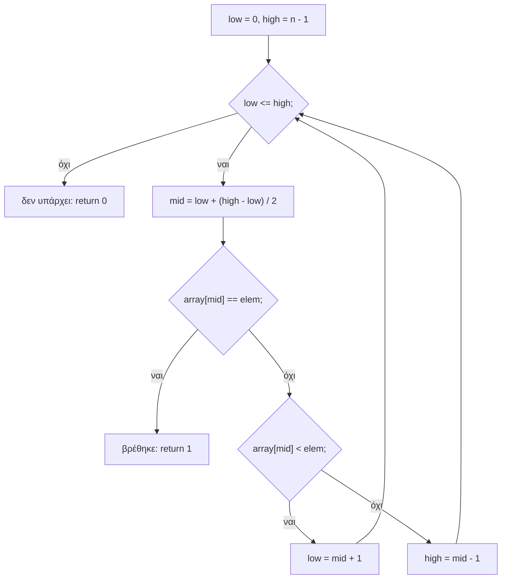
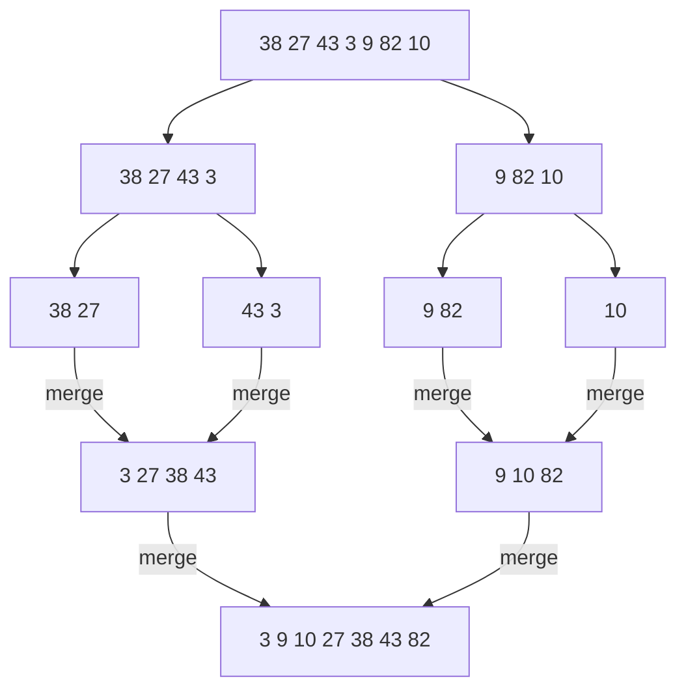

# Κεφάλαιο 17: Δυαδική Αναζήτηση και Ταξινόμηση

<!--  -->

> **Στόχοι:** μετά από αυτό το κεφάλαιο θα μπορείτε να υλοποιείτε γραμμική και δυαδική
> αναζήτηση και να εξηγείτε πότε και γιατί η δεύτερη είναι ταχύτερη· να αποφεύγετε την
> υπερχείλιση στον υπολογισμό του μέσου· να γράφετε και να ιχνηλατείτε τους αλγορίθμους
> ταξινόμησης επιλογής, εισαγωγής, φυσαλίδας, συγχώνευσης και την ταχυταξινόμηση· και
> να δίνετε την πολυπλοκότητα χρόνου και χώρου του καθενός.
>
> **Προαπαιτούμενα:** [Κεφάλαιο 11](../11-pointers-recursion/) (δείκτες, αναδρομή),
> [Κεφάλαιο 15](../15-complexity-preprocessor/) (πολυπλοκότητα)
>
> **Χρόνος μελέτης:** ~2,5 ώρες

## Σύνοψη

Η διάλεξη εξετάζει δύο από τα πιο κλασικά προβλήματα της πληροφορικής: πώς βρίσκουμε
ένα στοιχείο σε μια ακολουθία (αναζήτηση) και πώς βάζουμε μια ακολουθία σε σειρά
(ταξινόμηση). Η γραμμική αναζήτηση ελέγχει τα στοιχεία ένα προς ένα σε χρόνο $O(n)$·
αν όμως η ακολουθία είναι ταξινομημένη, η δυαδική αναζήτηση μοιράζει κάθε φορά το
διάστημα στη μέση και τελειώνει σε $O(\log n)$ βήματα. Η ταξινόμηση είναι λοιπόν το
κλειδί για γρήγορη αναζήτηση. Η διάλεξη παρουσιάζει τρεις απλούς αλγορίθμους
ταξινόμησης σε $O(n^2)$ (επιλογής, εισαγωγής, φυσαλίδας) και δύο αναδρομικούς
αλγορίθμους «διαίρει και βασίλευε» (συγχώνευσης και ταχυταξινόμηση) με $O(n \log n)$.
Βλέπουμε επίσης ότι ακόμη και ένας «απλός» αλγόριθμος όπως η δυαδική αναζήτηση κρύβει
ένα λεπτό σφάλμα υπερχείλισης.

## Θεωρία

### Αναζήτηση και η ιδέα της διχοτόμησης

**Αναζήτηση** (search) είναι το πρόβλημα να βρούμε αν ένα στοιχείο υπάρχει σε μια
συλλογή στοιχείων και, αν ναι, σε ποια θέση. Η διάλεξη ξεκινά με παιχνίδια. Αν
μαντεύουμε έναν κρυμμένο αριθμό στο $[1, 100]$ ρωτώντας «είναι ο 1;», «είναι ο 2;», …
χρειαζόμαστε στη χειρότερη περίπτωση 100 ερωτήσεις· αν ρωτάμε «είναι μεγαλύτερος από
το μέσο του διαστήματος;», κάθε απάντηση πετά τους μισούς υποψηφίους. Σε ένα λεξικό
ανοίγουμε κάπου στη μέση και, επειδή τα λήμματα είναι σε αλφαβητική σειρά, ξέρουμε αν
θα πάμε μπροστά ή πίσω. Στο Guess Who οι καλές ερωτήσεις χωρίζουν τους υποψήφιους
χαρακτήρες σε δύο περίπου ίσα μέρη.

Η κοινή ιδέα είναι η **διχοτόμηση**: αν κάθε ερώτηση μειώνει τους υποψηφίους στο μισό,
τότε από $n$ υποψηφίους μένει ένας μετά από περίπου $\log_2 n$ ερωτήσεις. Για $n = 100$
αυτό είναι 7 ερωτήσεις ($2^7 = 128 \geq 100$) και για $n = 10^9$ μόλις 30
($2^{30} \approx 1{,}07 \cdot 10^9$). Το λεξικό μάς δείχνει και την προϋπόθεση: η
διχοτόμηση δουλεύει μόνο όταν τα δεδομένα είναι σε **σειρά**.

### Γραμμική αναζήτηση

Η **γραμμική** ή **σειριακή αναζήτηση** (linear / serial search) είναι ο απλούστερος
αλγόριθμος αναζήτησης ενός στοιχείου σε μια ακολουθία. Ξεκινά από το πρώτο στοιχείο
και σε κάθε βήμα συγκρίνει το στοιχείο που ψάχνουμε με το τρέχον της ακολουθίας. Αν
είναι ίσα σταματά, αλλιώς συνεχίζει στο επόμενο, μέχρι να φτάσει στο τελευταίο.

```c
for (i = 0; i < 100; i++)
  if (haystack[i] == needle)
    return i;
return -1;
```

Συνηθίζεται η συνάρτηση να επιστρέφει τη θέση του στοιχείου ή `-1` όταν δεν το βρει,
αφού το `-1` δεν είναι ποτέ έγκυρη θέση πίνακα. Στη χειρότερη περίπτωση (το στοιχείο
είναι τελευταίο ή λείπει) κάνει $n$ συγκρίσεις, άρα η **χρονική πολυπλοκότητα** είναι
$O(n)$, ενώ ο **χώρος** που χρειάζεται είναι σταθερός, $O(1)$ (μόνο ο μετρητής `i`).
Το πλεονέκτημά της είναι ότι δεν απαιτεί τίποτα από τα δεδομένα: δουλεύει και σε
αταξινόμητο πίνακα.

Μπορούμε να βρούμε ένα στοιχείο πιο γρήγορα από $O(n)$; Σε αταξινόμητο πίνακα όχι:
οποιοδήποτε στοιχείο που δεν κοιτάξαμε μπορεί να είναι αυτό που ψάχνουμε. Χρειαζόμαστε
επιπλέον πληροφορία για τα δεδομένα, και αυτή είναι η ταξινόμηση.

### Ταξινομημένη ακολουθία

Μια ακολουθία στοιχείων $a_i$ λέγεται **ταξινομημένη** (sorted) ως προς έναν τελεστή
σύγκρισης $\leq_\alpha$ αν και μόνο αν

$$\forall i \leq j.\ a_i \leq_\alpha a_j$$

δηλαδή κάθε στοιχείο «προηγείται ή ισούται» με όλα όσα ακολουθούν. Η ταξινόμηση
εξαρτάται πάντα από τη σχέση διάταξης που διαλέγουμε:

- Η $1, 7, 8, 10, 19$ είναι ταξινομημένη ως προς τη συνηθισμένη σύγκριση ακεραίων,
  $a_i \leq_\alpha a_j \Leftrightarrow a_i \leq a_j$: είναι σε **αύξουσα** σειρά.
- Η $19, 10, 8, 7, 1$ είναι ταξινομημένη ως προς τον τελεστή
  $a_i \leq_\varphi a_j \Leftrightarrow -a_i \leq -a_j \Leftrightarrow a_j \leq a_i$:
  είναι σε **φθίνουσα** σειρά.

Με τον ίδιο τρόπο ταξινομούμε και άλλα δεδομένα, αρκεί να ορίσουμε τη σύγκριση: λέξεις
αλφαβητικά, ή εγγραφές φοιτητών ως προς τον βαθμό τους. Στη συνέχεια, «ταξινομημένος
πίνακας» σημαίνει ακέραιοι σε αύξουσα σειρά.

### Δυαδική αναζήτηση

Η **δυαδική αναζήτηση** (binary search) βρίσκει αν ένα στοιχείο υπάρχει σε μια
**ταξινομημένη** ακολουθία. Σε κάθε βήμα χωρίζει την ακολουθία σε δύο τμήματα και
συγκρίνει το στοιχείο με το **μεσαίο** στοιχείο:

- αν είναι ίσα, το βρήκαμε·
- αν το μεσαίο είναι μικρότερο, το στοιχείο (αν υπάρχει) βρίσκεται δεξιά του μέσου·
- αν το μεσαίο είναι μεγαλύτερο, βρίσκεται αριστερά του.

Ο αλγόριθμος συνεχίζει στο κατάλληλο τμήμα, μέχρι να βρει το στοιχείο ή να δείξει ότι
δεν μπορεί να βρίσκεται πουθενά (το τμήμα άδειασε). Στον κώδικα, το τμήμα που μένει
να ψάξουμε είναι οι θέσεις από `low` έως `high` (και οι δύο μέσα)· αρχικά είναι όλος ο
πίνακας, `low = 0` και `high = n - 1`.



*Σχήμα: η ροή της δυαδικής αναζήτησης· κάθε γύρος μικραίνει το `[low, high]` στο μισό.*

Προσέξτε τρεις λεπτομέρειες που κάνουν τον αλγόριθμο σωστό:

1. Η συνθήκη είναι `low <= high` και όχι `low < high`: όταν `low == high` μένει ακόμη
   ένα στοιχείο να ελέγξουμε.
2. Τα νέα όρια είναι `mid + 1` και `mid - 1`, όχι `mid`: το `array[mid]` το ελέγξαμε
   ήδη. Με `low = mid` ο βρόχος μπορεί να μην τερματίσει ποτέ.
3. Ο πίνακας **πρέπει** να είναι ταξινομημένος. Σε αταξινόμητο πίνακα η δυαδική
   αναζήτηση δεν «σκάει», απλώς δίνει λάθος απάντηση.

### Υπερχείλιση στον υπολογισμό του μέσου

Η πρώτη υλοποίηση της διάλεξης υπολογίζει το μέσο με το προφανές
`mid = (low + high) / 2;` και έχει σφάλμα. Τα `low` και `high` είναι έγκυρες θέσεις,
άρα χωρούν σε `int`, αλλά το **άθροισμά** τους μπορεί να ξεπεράσει το `INT_MAX`
($2^{31} - 1 = 2147483647$). Αυτό συμβαίνει σε πίνακες με περισσότερα από περίπου
$2^{30}$ (ένα δισεκατομμύριο) στοιχεία: για `low = 1500000000` και
`high = 2000000000` το άθροισμα είναι $3{,}5 \cdot 10^9$. Η υπερχείλιση
προσημασμένου ακεραίου είναι **απροσδιόριστη συμπεριφορά** (undefined behavior)· στην
πράξη το άθροισμα «τυλίγεται» σε αρνητικό αριθμό (με τον `gcc` το `mid` βγαίνει
`-397483648` αντί για `1750000000`) και το `array[mid]` διαβάζει εκτός ορίων.

Η διόρθωση είναι να υπολογίζουμε την **απόσταση** των ορίων και να προσθέτουμε το
μισό της στο `low`:

```c
mid = low + (high - low) / 2;
```

Η διαφορά `high - low` δεν ξεπερνά ποτέ το μέγεθος του πίνακα, οπότε δεν υπάρχει
υπερχείλιση, και μαθηματικά το αποτέλεσμα είναι το ίδιο. Η διάλεξη τονίζει ότι ο
αλγόριθμος θεωρείται διάσημα **δύσκολος** να υλοποιηθεί **σωστά**: λάθη στη συνθήκη,
στα όρια και στον μέσο έχουν βρεθεί ακόμη και σε βιβλία και βιβλιοθήκες (δείτε τους
συνδέσμους στο «Διάβασμα»). Το ίδιο μοτίβο `(lower + upper) / 2` εμφανίζεται και στην
ταχυταξινόμηση παρακάτω.

### Πολυπλοκότητα της δυαδικής αναζήτησης

Κάθε γύρος του βρόχου κάνει σταθερή δουλειά και υποδιπλασιάζει το μέγεθος του
διαστήματος: $n, n/2, n/4, \ldots, 1$. Μετά από $k$ γύρους μένουν περίπου $n / 2^k$
στοιχεία, άρα ο βρόχος τελειώνει μετά από το πολύ περίπου $\log_2 n + 1$ γύρους. Η
χρονική πολυπλοκότητα είναι λοιπόν **$O(\log n)$** και ο χώρος **$O(1)$** (τρεις
μεταβλητές, ανεξάρτητα από το $n$).

| $n$ | γραμμική (χειρότερη) | δυαδική (χειρότερη) |
| --- | --- | --- |
| 100 | 100 | 7 |
| $10^6$ | $10^6$ | 20 |
| $2 \cdot 10^9$ | $2 \cdot 10^9$ | 31 |

Η διαφορά είναι τεράστια, αλλά έχει ένα κόστος: ο πίνακας πρέπει πρώτα να
ταξινομηθεί, κάτι που (όπως θα δούμε) κοστίζει τουλάχιστον $O(n \log n)$. Η ταξινόμηση
αξίζει όταν ψάχνουμε πολλές φορές στα ίδια δεδομένα. Η δυαδική αναζήτηση υπάρχει
έτοιμη στη βιβλιοθήκη της C ως η συνάρτηση `bsearch` του `stdlib.h`.

### Αλγόριθμοι ταξινόμησης και η swap

**Ταξινόμηση** (sorting) είναι η αναδιάταξη των στοιχείων μιας ακολουθίας ώστε να
γίνει ταξινομημένη. Η διάλεξη παρουσιάζει πέντε αλγορίθμους: bubblesort, selection
sort, insertion sort, merge sort και quicksort. Όλοι ταξινομούν έναν πίνακα `int`
**επί τόπου**, δηλαδή αλλάζουν τον ίδιο τον πίνακα που τους δίνουμε μέσω δείκτη
(`int *x`).

Οι περισσότεροι χρησιμοποιούν ως βασικό βήμα την **αντιμετάθεση** (swap) δύο
στοιχείων. Επειδή στη C τα ορίσματα περνούν με τιμή, μια `swap(int a, int b)` θα
άλλαζε μόνο τα τοπικά της αντίγραφα. Η `swap` πρέπει να παίρνει **δείκτες** στις δύο
μεταβλητές και να αλλάζει τις τιμές μέσω αποαναφοράς, με μια βοηθητική μεταβλητή
(`void swap(int *a, int *b)`, κώδικας στα «Παραδείγματα»). Την καλούμε με
διευθύνσεις: `swap(&a, &b)` για μεταβλητές, `swap(&x[i], &x[j])` για στοιχεία πίνακα
(θυμηθείτε το [Κεφάλαιο 11](../11-pointers-recursion/)).

### Ταξινόμηση επιλογής (selection sort)

Η **ταξινόμηση επιλογής** βρίσκει το μικρότερο από όλα τα στοιχεία και το
αντιμεταθέτει με το πρώτο· έπειτα βρίσκει το μικρότερο από τα υπόλοιπα και το
αντιμεταθέτει με το δεύτερο, κ.ο.κ. Μετά από $n - 1$ επιλογές ο πίνακας είναι
ταξινομημένος (το τελευταίο στοιχείο μένει αναγκαστικά στη θέση του).

```c
for (i = 1 ; i <= n - 1 ; i++) {
  min = i - 1;
  for (j = i ; j <= n - 1 ; j++)
    if (x[j] < x[min])
      min = j;
  swap(&x[i-1], &x[min]);
}
```

Στον γύρο `i` το `min` ξεκινά από τη θέση `i - 1` και ο εσωτερικός βρόχος ψάχνει στις
θέσεις `i` έως `n - 1` για κάτι μικρότερο. **Αναλλοίωτη** (invariant): μετά τον γύρο
`i`, οι θέσεις `0` έως `i - 1` περιέχουν τα `i` μικρότερα στοιχεία, ταξινομημένα.
Ο εσωτερικός βρόχος κάνει $(n-1) + (n-2) + \ldots + 1 = n(n-1)/2$ συγκρίσεις
ό,τι κι αν περιέχει ο πίνακας, οπότε ο χρόνος είναι **$O(n^2)$**· ο χώρος είναι
**$O(1)$**. Κάνει όμως το πολύ $n - 1$ αντιμεταθέσεις.

### Ταξινόμηση εισαγωγής (insertion sort)

Η **ταξινόμηση εισαγωγής** δουλεύει όπως ταξινομούμε τα χαρτιά στο χέρι: κρατά ένα
ταξινομημένο πρόθεμα και **εισάγει** το επόμενο στοιχείο στη σωστή θέση μέσα του.
Τοποθετεί το δεύτερο στοιχείο πριν ή μετά το πρώτο, το τρίτο στη σωστή θέση ανάμεσα
στα δύο πρώτα, κ.ο.κ.

```c
for (i = 1 ; i <= n - 1 ; i++) {
  j = i - 1;
  while (j >= 0 && x[j] > x[j+1]) {
    swap(&x[j], &x[j+1]);
    j--;
  }
}
```

Το νέο στοιχείο ξεκινά στη θέση `i` και «βουλιάζει» προς τα αριστερά με διαδοχικές
αντιμεταθέσεις όσο ο αριστερός του γείτονας είναι μεγαλύτερος. Η σειρά των ελέγχων
`j >= 0 && x[j] > x[j+1]` έχει σημασία: λόγω βραχυκύκλωσης του `&&`, το `x[j]` δεν
διαβάζεται ποτέ για `j == -1`. Στη χειρότερη περίπτωση (πίνακας σε φθίνουσα σειρά) κάθε
στοιχείο ταξιδεύει ως την αρχή, άρα ο χρόνος είναι **$O(n^2)$** και ο χώρος
**$O(1)$**. Σε πίνακα σχεδόν ταξινομημένο όμως ο `while` σταματά αμέσως και ο
αλγόριθμος είναι πολύ γρήγορος.

### Ταξινόμηση φυσαλίδας (bubblesort)

Η **ταξινόμηση φυσαλίδας** συγκρίνει ζευγάρια **διαδοχικών** στοιχείων, από το τέλος
του πίνακα προς την αρχή, και αντιμεταθέτει όσα δεν είναι στη σωστή σειρά. Μετά το
πρώτο πέρασμα το μικρότερο στοιχείο έχει «ανέβει σαν φυσαλίδα» στη θέση 0· το δεύτερο
πέρασμα φέρνει το δεύτερο μικρότερο στη θέση 1, κ.ο.κ. Μετά από $n - 1$ περάσματα ο
πίνακας είναι ταξινομημένος.

```c
for (i = 1 ; i <= n - 1 ; i++)
  for (j = n - 1 ; j >= i ; j--)
    if (x[j-1] > x[j])
      swap(&x[j-1], &x[j]);
```

Ο εσωτερικός βρόχος σταματά στο `i`, γιατί οι θέσεις `0` έως `i - 2` έχουν ήδη
τακτοποιηθεί από τα προηγούμενα περάσματα. Ο χρόνος είναι **$O(n^2)$** και ο χώρος
**$O(1)$**.

### Διαίρει και βασίλευε

Οι τρεις παραπάνω αλγόριθμοι τοποθετούν ένα στοιχείο ανά πέρασμα και γι' αυτό κάνουν
$O(n^2)$ δουλειά. Για να πάμε ταχύτερα χρησιμοποιούμε τη στρατηγική **διαίρει και
βασίλευε** (divide and conquer), που ήδη είδαμε στη δυαδική αναζήτηση:

1. **διαίρεσε** το πρόβλημα σε μικρότερα υποπροβλήματα του ίδιου είδους·
2. **λύσε** τα υποπροβλήματα, αναδρομικά·
3. **συνδύασε** τις λύσεις τους σε λύση του αρχικού.

Η αναδρομή σταματά σε υποπροβλήματα τόσο μικρά που η λύση τους είναι προφανής (ένας
πίνακας με ένα ή κανένα στοιχείο είναι ήδη ταξινομημένος). Οι δύο αλγόριθμοι που
ακολουθούν διαφέρουν στο πού βάζουν τη δουλειά: η merge sort διαιρεί εύκολα και
δουλεύει στη **συνένωση**, η quicksort δουλεύει στη **διαίρεση** και δεν χρειάζεται
συνένωση.

### Ταξινόμηση συγχώνευσης (merge sort)

Η **ταξινόμηση συγχώνευσης** είναι αλγόριθμος διαίρει και βασίλευε (αποδίδεται στον
John von Neumann) με δύο βήματα:

1. χώρισε τον πίνακα σε δύο υποπίνακες (στη μέση) και κάλεσε ταξινόμηση συγχώνευσης σε
   καθέναν·
2. **συγχώνευσε** (merge) τα στοιχεία των δύο ταξινομημένων υποπινάκων.

Η `merge_sort(array, left, right)` της διάλεξης (κώδικας στα «Παραδείγματα») παίρνει
τις θέσεις του πρώτου και του τελευταίου στοιχείου του τμήματος· για όλο τον πίνακα
καλούμε `merge_sort(a, 0, n - 1)`. Αν `left < right`, υπολογίζει το
`middle = left + (right - left) / 2`, ταξινομεί αναδρομικά τα `[left, middle]` και
`[middle + 1, right]` και τα συγχωνεύει με `merge(array, left, middle, right)`. Η βάση
της αναδρομής είναι το `left >= right`, δηλαδή τμήμα με ένα ή κανένα στοιχείο.

Όλη η δουλειά γίνεται στη `merge`, η οποία παίρνει δύο **ήδη ταξινομημένα** διαδοχικά
τμήματα, `x[l..m]` και `x[m+1..r]`. Τα αντιγράφει σε δύο βοηθητικούς πίνακες `left`
και `right` και ύστερα, με δύο δείκτες θέσης `i` και `j`, κοιτά κάθε φορά το μικρότερο
μη χρησιμοποιημένο στοιχείο κάθε πίνακα και γράφει το μικρότερο από τα δύο πίσω στο
`x`. Όταν ο ένας πίνακας εξαντληθεί, αντιγράφει ό,τι έμεινε στον άλλο. Επειδή κάθε
σύγκριση βγάζει ένα στοιχείο, η συγχώνευση $n$ στοιχείων κοστίζει $O(n)$.

Η αναδρομή διχοτομεί το μέγεθος, άρα έχει περίπου $\log_2 n$ επίπεδα· σε κάθε επίπεδο
οι συγχωνεύσεις αγγίζουν συνολικά και τα $n$ στοιχεία. Ο χρόνος είναι λοιπόν
**$O(n \log n)$**, και μάλιστα ακόμη και στη χειρότερη περίπτωση: θεωρητικά η
καλύτερη πολυπλοκότητα που μπορεί να πετύχει ταξινόμηση με συγκρίσεις. Το τίμημα είναι
ο **χώρος $O(n)$** για τους βοηθητικούς πίνακες της `merge`.

### Ταχυταξινόμηση (quicksort)

Η **ταχυταξινόμηση** (quicksort, του Tony Hoare) είναι επίσης διαίρει και βασίλευε και
είναι ιδιαίτερα δημοφιλής. Έχει τρία βήματα:

1. διάλεξε (π.χ. τυχαία) ένα **στοιχείο διαμέρισης** (pivot element)·
2. **διαμέρισε** (partition) τον πίνακα σε δύο υποπίνακες: αριστερά τα στοιχεία που
   είναι μικρότερα από το pivot και δεξιά αυτά που είναι μεγαλύτερα·
3. τρέξε ταχυταξινόμηση στους δύο υποπίνακες.

Μετά τη διαμέριση κάθε στοιχείο του αριστερού τμήματος είναι μικρότερο ή ίσο από κάθε
στοιχείο του δεξιού, οπότε δεν χρειάζεται συγχώνευση: αρκεί να ταξινομηθεί το καθένα.

Η υλοποίηση της διάλεξης, `quicksort(x, lower, upper)` (κώδικας στα «Παραδείγματα»),
παίρνει ως pivot το μεσαίο στοιχείο, `x[(lower + upper) / 2]`. Η διαμέριση κινεί δύο
δείκτες θέσης τον έναν προς τον άλλον: το `i` προχωρά από αριστερά όσο βρίσκει στοιχεία
μικρότερα του pivot, το `j` από δεξιά όσο βρίσκει μεγαλύτερα. Όταν σταματήσουν και οι
δύο, τα `x[i]` και `x[j]` είναι σε λάθος πλευρά και αντιμετατίθενται. Όταν τα `i` και
`j` διασταυρωθούν, το `x[lower..j]` έχει τα «μικρά» και το `x[i..upper]` τα «μεγάλα»,
και η συνάρτηση καλείται αναδρομικά σε αυτά.

Αν το pivot χωρίζει τον πίνακα σε δύο περίπου ίσα μέρη, έχουμε $\log_2 n$ επίπεδα με
$O(n)$ δουλειά το καθένα, άρα **$O(n \log n)$ κατά μέση περίπτωση** (average case). Αν
όμως το pivot είναι κάθε φορά το μικρότερο ή το μεγαλύτερο στοιχείο, το ένα τμήμα
είναι άδειο και το άλλο μικραίνει μόνο κατά ένα: $n$ επίπεδα και **$O(n^2)$ στη
χειρότερη περίπτωση** (worst case). Ο χώρος είναι η στοίβα της αναδρομής: **$O(n)$**
στη χειρότερη περίπτωση για αυτή την υλοποίηση, αλλά γίνεται και $O(\log n)$ αν
καλούμε αναδρομικά πάντα πρώτα το μικρότερο τμήμα και χειριζόμαστε το μεγαλύτερο με
βρόχο (tail call optimization).

### Σύνοψη αλγορίθμων και η βιβλιοθήκη

| Αλγόριθμος | Χρόνος | Χώρος | Ιδέα |
| --- | --- | --- | --- |
| Γραμμική αναζήτηση | $O(n)$ | $O(1)$ | κοίτα όλα τα στοιχεία με τη σειρά |
| Δυαδική αναζήτηση | $O(\log n)$ | $O(1)$ | σύγκρινε με το μέσο, κράτα το μισό |
| Selection sort | $O(n^2)$ | $O(1)$ | επίλεξε το ελάχιστο του υπολοίπου |
| Insertion sort | $O(n^2)$ | $O(1)$ | εισήγαγε στο ταξινομημένο πρόθεμα |
| Bubblesort | $O(n^2)$ | $O(1)$ | αντιμετάθεσε γειτονικά ζεύγη |
| Merge sort | $O(n \log n)$ | $O(n)$ | μοίρασε στη μέση, συγχώνευσε |
| Quicksort | $O(n \log n)$ μέση, $O(n^2)$ χειρότερη | $O(n)$ εδώ | διαμέρισε γύρω από pivot |

Στην πράξη σπάνια γράφουμε δική μας ταξινόμηση ή δυαδική αναζήτηση: η βιβλιοθήκη
`stdlib.h` έχει την `qsort` (ταξινόμηση) και την `bsearch` (δυαδική αναζήτηση), που
δουλεύουν για πίνακες οποιουδήποτε τύπου, αφού τους δώσουμε μια συνάρτηση σύγκρισης
(`man 3 qsort`, `man 3 bsearch`). Τους αλγορίθμους όμως πρέπει να τους ξέρετε: είναι
κλασικό θέμα εξετάσεων και η βάση για να καταλάβετε την πολυπλοκότητα.

## Παραδείγματα

### Ο γρίφος με τον κρυμμένο αριθμό

Ο γρίφος της διάλεξης (ερώτηση συνέντευξης της Microsoft από τον Steve Ballmer): ένας
αριθμός στο $[1, 100]$, απαντήσεις ναι/όχι, και κέρδος που μειώνεται με κάθε
προσπάθεια (5€ στην 1η, …, 0€ στην 6η, ενώ στην 7η πληρώνετε 1€). Εφαρμόζει την ιδέα
της [διχοτόμησης](#αναζήτηση-και-η-ιδέα-της-διχοτόμησης): ρωτάμε «είναι μεγαλύτερος από
50;», μετά «από 75;» ή «από 25;», κ.ο.κ. Στη χειρότερη περίπτωση οι υποψήφιοι
πέφτουν 100 → 50 → 25 → 13 → 7 → 4 → 2 → 1. Χρειάζονται λοιπόν έως 7 ερωτήσεις για το $[1, 100]$ και έως 30 για το $[1, 10^9]$.
Αν αξίζει να παίξετε το παιχνίδι είναι η [ερώτηση](../../questions/slides/slides-lec17-guess-100.md)
της διαφάνειας 5. Το ίδιο κάνουμε σε ένα λεξικό ή στο Guess Who (Θεωρία: «Αναζήτηση
και η ιδέα της διχοτόμησης»).

### Γραμμική αναζήτηση σε πίνακα 100 ακεραίων

Η διάλεξη ζητά μια συνάρτηση που δέχεται έναν πίνακα 100 ακεραίων και έναν ακέραιο και
επιστρέφει τη θέση του στοιχείου ή `-1` (Θεωρία: «Γραμμική αναζήτηση»):

```c
int find(int haystack[100], int needle) {
  int i;
  for (i = 0; i < 100; i++) {
    if (haystack[i] == needle) {
      return i;
    }
  }
  return -1;
}
```

Αν ο `a` έχει `a[i] == i * i`, τότε το `find(a, 49)` επιστρέφει `7` και το
`find(a, 50)` επιστρέφει `-1`.

### Δυαδική αναζήτηση βήμα προς βήμα

Η συνάρτηση της διάλεξης (διορθωμένη ως προς τον μέσο) επιστρέφει `1` αν το `elem`
υπάρχει στον ταξινομημένο πίνακα `array` με `n` στοιχεία και `0` αλλιώς (Θεωρία:
«Δυαδική αναζήτηση», «Υπερχείλιση στον υπολογισμό του μέσου»):

```c
int binary_search(int elem, int *array, int n) {
  int mid, low = 0, high = n - 1;
  while (low <= high) {
    mid = low + (high - low) / 2;
    if (array[mid] == elem)
      return 1;
    else if (array[mid] < elem)
      low = mid + 1;
    else
      high = mid - 1;
  }
  return 0;
}
```

Για τον πίνακα `{1, 7, 8, 10, 19, 23, 42, 50, 61, 77}` (θέσεις 0–9):

| αναζήτηση | `low` | `high` | `mid` | `array[mid]` | απόφαση |
| --- | --- | --- | --- | --- | --- |
| 42 | 0 | 9 | 4 | 19 | 19 < 42 → `low = 5` |
| 42 | 5 | 9 | 7 | 50 | 50 > 42 → `high = 6` |
| 42 | 5 | 6 | 5 | 23 | 23 < 42 → `low = 6` |
| 42 | 6 | 6 | 6 | 42 | βρέθηκε → `return 1` |
| 9 | 0 | 9 | 4 | 19 | 19 > 9 → `high = 3` |
| 9 | 0 | 3 | 1 | 7 | 7 < 9 → `low = 2` |
| 9 | 2 | 3 | 2 | 8 | 8 < 9 → `low = 3` |
| 9 | 3 | 3 | 3 | 10 | 10 > 9 → `high = 2` |
| 9 | 3 | 2 | | | `low > high` → `return 0` |

Και οι δύο αναζητήσεις τελειώνουν σε 4 γύρους, ενώ η γραμμική θα έκανε 7 και 10
συγκρίσεις αντίστοιχα. Η διάλεξη παραπέμπει σε μια
[οπτικοποίηση](https://www.cs.usfca.edu/~galles/visualization/Search.html) που δείχνει
τη γραμμική και τη δυαδική αναζήτηση βήμα βήμα.

### Αναζήτηση στους χρήστες του Instagram

Το Instagram έχει 2 δισεκατομμύρια χρήστες σε έναν πίνακα ακεραίων (ένας ακέραιος ανά
χρήστη). Πόσα βήματα χρειάζονται για να βρούμε αν ο χρήστης 424242 υπάρχει; Με
γραμμική αναζήτηση έως $2 \cdot 10^9$ συγκρίσεις. Αν ο πίνακας είναι ταξινομημένος, η
δυαδική αναζήτηση χρειάζεται έως 31 γύρους, αφού $2^{31} = 2147483648$, που είναι
τουλάχιστον $2 \cdot 10^9$ (Θεωρία: «Πολυπλοκότητα της δυαδικής αναζήτησης»). Προσέξτε ότι ένας τέτοιος
πίνακας είναι ακριβώς το μέγεθος όπου το `(low + high) / 2` υπερχειλίζει.

### Η συνάρτηση swap

Η άσκηση της διάλεξης: συμπληρώστε τη `swap( ... )` ώστε να ανταλλάξει τα `a` και `b`
(Θεωρία: «Αλγόριθμοι ταξινόμησης και η swap»).

```c
#include <stdio.h>

void swap(int *a, int *b) {
  int tmp = *a;
  *a = *b;
  *b = tmp;
}

int main() {
  int a = 100, b = 200;
  printf("%d %d\n", a, b);
  swap(&a, &b);
  printf("%d %d\n", a, b);
  return 0;
}
```

```text
$ ./swap
100 200
200 100
```

### Τρεις απλές ταξινομήσεις στον ίδιο πίνακα

Τρέχοντας τις `selection_sort`, `insertion_sort` και `bubblesort` της διάλεξης στον
πίνακα `{5, 2, 9, 1, 7, 3}` και τυπώνοντας τον πίνακα στο τέλος κάθε γύρου του
εξωτερικού βρόχου παίρνουμε (Θεωρία: οι τρεις αντίστοιχες ενότητες):

| μετά τον γύρο | selection | insertion | bubble |
| --- | --- | --- | --- |
| `i = 1` | 1 2 9 5 7 3 | 2 5 9 1 7 3 | 1 5 2 9 3 7 |
| `i = 2` | 1 2 9 5 7 3 | 2 5 9 1 7 3 | 1 2 5 3 9 7 |
| `i = 3` | 1 2 3 5 7 9 | 1 2 5 9 7 3 | 1 2 3 5 7 9 |
| `i = 4` | 1 2 3 5 7 9 | 1 2 5 7 9 3 | 1 2 3 5 7 9 |
| `i = 5` | 1 2 3 5 7 9 | 1 2 3 5 7 9 | 1 2 3 5 7 9 |

Παρατηρήστε τις αναλλοίωτες: στη selection sort και στη bubblesort, μετά τον γύρο `i`
τα `i` πρώτα στοιχεία είναι τα `i` μικρότερα, στις τελικές τους θέσεις. Στην insertion
sort τα `i + 1` πρώτα στοιχεία είναι ταξινομημένα μεταξύ τους, αλλά όχι απαραίτητα
στις τελικές τους θέσεις (το 3 μπαίνει στη θέση του μόλις στον τελευταίο γύρο). Και
οι τρεις κάνουν όλους τους γύρους, ακόμη κι όταν ο πίνακας έχει ήδη ταξινομηθεί.

### Merge sort και quicksort σε ένα πρόγραμμα

Οι `merge`, `merge_sort` και `quicksort` της διάλεξης με ένα `main` που ταξινομεί δύο
αντίγραφα του ίδιου πίνακα (Θεωρία: «Ταξινόμηση συγχώνευσης», «Ταχυταξινόμηση»). Οι
`left[n1]` και `right[n2]` της `merge` είναι πίνακες μεταβλητού μήκους στη στοίβα,
από όπου προέρχεται ο χώρος $O(n)$. Για να φανεί η διαμέριση, η `quicksort` εδώ
τυπώνει επιπλέον το τμήμα `x[lower..upper]` μετά από κάθε διαμέριση.

```c
#include <stdio.h>

void swap(int *a, int *b) {
  int tmp = *a;
  *a = *b;
  *b = tmp;
}

void merge(int *x, int l, int m, int r) {
  int i, j, k, n1 = m - l + 1, n2 = r - m;
  int left[n1], right[n2];
  for (i = 0; i < n1; i++) left[i] = x[l + i];
  for (j = 0; j < n2; j++) right[j] = x[m + 1 + j];
  i = 0; j = 0; k = l;
  while (i < n1 && j < n2) {
    if (left[i] <= right[j]) x[k++] = left[i++];
    else x[k++] = right[j++];
  }
  while (i < n1) x[k++] = left[i++];
  while (j < n2) x[k++] = right[j++];
}

void merge_sort(int *array, int left, int right) {
  if (left < right) {
    int middle = left + (right - left) / 2;
    merge_sort(array, left, middle);
    merge_sort(array, middle + 1, right);
    merge(array, left, middle, right);
  }
}

void quicksort(int *x, int lower, int upper) {
  if (lower < upper) {
    int pivot = x[(lower + upper) / 2];
    int i, j;
    for (i = lower, j = upper; i <= j;) {
      while (x[i] < pivot) i++;
      while (x[j] > pivot) j--;
      if (i <= j) swap(&x[i++], &x[j--]);
    }
    printf("pivot %2d:", pivot);            /* trace, not in the slides */
    for (int k = lower; k <= upper; k++) printf(" %d", x[k]);
    printf("\n");
    quicksort(x, lower, j);
    quicksort(x, i, upper);
  }
}

void print(int n, int *x) {
  for (int i = 0; i < n; i++)
    printf("%d ", x[i]);
  printf("\n");
}

int main() {
  int a[] = {38, 27, 43, 3, 9, 82, 10};
  int b[] = {38, 27, 43, 3, 9, 82, 10};
  int n = sizeof(a) / sizeof(a[0]);
  merge_sort(a, 0, n - 1);
  print(n, a);
  quicksort(b, 0, n - 1);
  print(n, b);
  return 0;
}
```

```text
$ ./sorts
3 9 10 27 38 43 82
pivot  3: 3 27 43 38 9 82 10
pivot 38: 27 10 9 38 82 43
pivot 10: 9 10 27
pivot 82: 38 43 82
pivot 38: 38 43
3 9 10 27 38 43 82
```

Η πρώτη διαμέριση της quicksort είναι η χειρότερη δυνατή: το pivot 3 είναι το
ελάχιστο, οπότε το αριστερό τμήμα έχει ένα στοιχείο και το δεξί έξι. Αν αυτό συνέβαινε
σε κάθε επίπεδο, θα είχαμε τη χειρότερη περίπτωση $O(n^2)$. Η merge sort αντίθετα
χωρίζει πάντα στη μέση:



*Σχήμα: η merge sort χωρίζει στη μέση ως τα ζεύγη (που ταξινομούνται με τον ίδιο
τρόπο) και ύστερα συγχωνεύει προς τα πάνω.*

## Κύρια σημεία

1. Η γραμμική αναζήτηση ελέγχει τα στοιχεία ένα προς ένα· δουλεύει σε οποιονδήποτε
   πίνακα, με χρόνο $O(n)$ και χώρο $O(1)$.
2. Μια ακολουθία είναι ταξινομημένη ως προς έναν τελεστή σύγκρισης $\leq_\alpha$ όταν
   $a_i \leq_\alpha a_j$ για κάθε $i \leq j$· αύξουσα και φθίνουσα σειρά είναι απλώς
   διαφορετικοί τελεστές.
3. Η δυαδική αναζήτηση συγκρίνει με το μεσαίο στοιχείο και συνεχίζει στο μισό όπου
   μπορεί να βρίσκεται το στοιχείο· απαιτεί ταξινομημένο πίνακα και έχει χρόνο
   $O(\log n)$ και χώρο $O(1)$.
4. Ο μέσος πρέπει να υπολογίζεται ως `low + (high - low) / 2`: το `(low + high) / 2`
   υπερχειλίζει σε πολύ μεγάλους πίνακες· η δυαδική αναζήτηση είναι διάσημα δύσκολη
   να υλοποιηθεί σωστά.
5. Η `swap` παίρνει δείκτες (`swap(&x[i], &x[j])`), γιατί στη C τα ορίσματα περνούν
   με τιμή.
6. Η selection sort, η insertion sort και η bubblesort έχουν χρόνο $O(n^2)$ και χώρο
   $O(1)$.
7. Η merge sort (αναδρομικός αλγόριθμος διαίρει και βασίλευε) χωρίζει στη μέση και συγχωνεύει δύο ταξινομημένους υποπίνακες σε
   γραμμικό χρόνο· έχει χρόνο $O(n \log n)$ σε κάθε περίπτωση και χώρο $O(n)$.
8. Η quicksort (επίσης διαίρει και βασίλευε) διαμερίζει γύρω από ένα pivot· έχει χρόνο $O(n \log n)$ κατά μέση
   περίπτωση αλλά $O(n^2)$ στη χειρότερη, και χώρο $O(n)$ στην υλοποίηση της διάλεξης
   ($O(\log n)$ με κατάλληλη υλοποίηση).
9. Η `stdlib.h` προσφέρει έτοιμες την `bsearch` (δυαδική αναζήτηση) και την `qsort`
   (ταξινόμηση).

## Ορολογία

| Ελληνικά | English | Σύντομος ορισμός |
| --- | --- | --- |
| αναζήτηση | search | Εύρεση ενός στοιχείου (και της θέσης του) σε μια συλλογή. |
| γραμμική / σειριακή αναζήτηση | linear / serial search | Έλεγχος των στοιχείων ένα προς ένα· $O(n)$. |
| δυαδική αναζήτηση | binary search | Σύγκριση με το μέσο και συνέχεια στο μισό· $O(\log n)$. |
| ταξινομημένη ακολουθία | sorted sequence | $a_i \leq_\alpha a_j$ για κάθε $i \leq j$. |
| ταξινόμηση | sorting | Αναδιάταξη μιας ακολουθίας ώστε να γίνει ταξινομημένη. |
| αντιμετάθεση | swap | Ανταλλαγή των τιμών δύο θέσεων. |
| ταξινόμηση επιλογής | selection sort | Φέρνει κάθε φορά το ελάχιστο του υπολοίπου μπροστά. |
| ταξινόμηση εισαγωγής | insertion sort | Εισάγει κάθε στοιχείο σε ταξινομημένο πρόθεμα. |
| ταξινόμηση φυσαλίδας | bubblesort | Αντιμεταθέτει γειτονικά στοιχεία σε λάθος σειρά. |
| διαίρει και βασίλευε | divide and conquer | Διαίρεση σε υποπροβλήματα, αναδρομική λύση, συνδυασμός. |
| ταξινόμηση συγχώνευσης | merge sort | Ταξινομεί τα δύο μισά και τα συγχωνεύει. |
| συγχώνευση | merge | Ένωση δύο ταξινομημένων ακολουθιών σε μία ταξινομημένη. |
| ταχυταξινόμηση | quicksort | Διαμερίζει γύρω από ένα pivot και ταξινομεί τα δύο μέρη. |
| στοιχείο διαμέρισης | pivot element | Το στοιχείο γύρω από το οποίο γίνεται η διαμέριση. |
| χειρότερη / μέση περίπτωση | worst / average case | Κόστος για τη δυσκολότερη / κατά μέσο όρο είσοδο. |

## Συχνά λάθη

- **Δυαδική αναζήτηση σε αταξινόμητο πίνακα.** Δεν βγάζει σφάλμα, απλώς απαντά «δεν
  υπάρχει» για στοιχεία που υπάρχουν. Ταξινομήστε πρώτα ή χρησιμοποιήστε γραμμική.
- **`mid = (low + high) / 2`.** Υπερχειλίζει όταν `low + high > INT_MAX`: αρνητικό
  `mid` και συνήθως `Segmentation fault`. Γράψτε `low + (high - low) / 2`.
- **`while (low < high)` αντί για `<=`.** Σε πίνακα ενός στοιχείου, ή όταν μένει ένα
  υποψήφιο, το στοιχείο δεν ελέγχεται ποτέ: η αναζήτηση του 5 στο `{5}` αποτυγχάνει.
- **`low = mid` ή `high = mid`.** Όταν `low == mid`, το διάστημα δεν μικραίνει και ο
  βρόχος δεν τερματίζει. Χρησιμοποιήστε `mid + 1` και `mid - 1`.
- **`swap(int a, int b)` ή `swap(x[i], x[j])`.** Η συνάρτηση αλλάζει αντίγραφα και ο
  πίνακας μένει ίδιος (ή ο `gcc` διαμαρτύρεται
  `makes pointer from integer without a cast`). Περάστε διευθύνσεις: `swap(&x[i], &x[j])`.
- **Λάθος όρια στους βρόχους ταξινόμησης.** Π.χ. στη bubblesort `j >= 0` αντί για
  `j >= i` διαβάζει το `x[-1]`· στην insertion sort `x[j] > x[j+1] && j >= 0`
  διαβάζει το `x[-1]` πριν ελέγξει το `j`. Ελέγχετε πρώτα το όριο.
- **Λάθος αρχική κλήση των αναδρομικών.** Οι `merge_sort` και `quicksort` παίρνουν
  θέσεις πρώτου και **τελευταίου** στοιχείου: `merge_sort(a, 0, n - 1)`, όχι
  `merge_sort(a, 0, n)`, που διαβάζει εκτός ορίων.
- **«Η quicksort είναι πάντα $O(n \log n)$».** Μόνο κατά μέση περίπτωση· με κακή
  επιλογή pivot γίνεται $O(n^2)$.

## Διάβασμα

- **Διαφάνειες:** [Διάλεξη 17](https://github.com/progintro/progintro.github.io/releases/download/2025/lec17.pdf),
  σελ. 1–37: γρίφοι αναζήτησης 5–8· γραμμική αναζήτηση 9–11· ταξινομημένη ακολουθία
  12· δυαδική αναζήτηση 13–19· swap 20–22· selection sort 23–24· insertion sort
  25–26· bubblesort 27–28· merge sort 29–32· quicksort 33–35.
- **Σημειώσεις:** η διάλεξη καλύπτει τις σελ. 160–177 των σημειώσεων του κ.
  Σταματόπουλου: [Κεφάλαιο 11: Ταξινόμηση και αναζήτηση](https://progintro.github.io/notes/chapters/11-sorting-searching/),
  ενότητες «Ταξινόμηση πινάκων» (K04, σελ. 160–167), «Μέθοδοι ταξινόμησης» (168–172),
  «Αναζήτηση σε πίνακες» (173) και «Μέθοδοι αναζήτησης» (174–178).
- **Εργαστήριο:** κανένα εργαστήριο δεν είναι αφιερωμένο στην ταξινόμηση ή στην
  αναζήτηση.
- **Άλλα:** [Visualizing binary search](https://www.cs.usfca.edu/~galles/visualization/Search.html)·
  [Binary search algorithm](https://en.wikipedia.org/wiki/Binary_search_algorithm) και
  οι [δυσκολίες υλοποίησής](https://en.wikipedia.org/wiki/Binary_search_algorithm#Implementation_issues)
  της (Wikipedia)· [άρθρο για λάθη υλοποίησης σε βιβλία](https://www.uni-weimar.de/fileadmin/user/fak/medien/professuren/Mediensicherheit/Teaching/SS15/SSS/p190-pattis.pdf)
  (και στην [ACM Digital Library](https://dl.acm.org/doi/pdf/10.1145/52964.53012))·
  [Generalizing std::midpoint](https://biowpn.github.io/bioweapon/2025/03/23/generalizing-std-midpoint.html)
  και [βίντεο](https://www.youtube.com/watch?v=sBtAGxBh-XI) για τον μέσο·
  [ο γρίφος του Ballmer](https://www.youtube.com/watch?v=p8hk3kwxeS4)·
  [Divide-and-conquer algorithm](https://en.wikipedia.org/wiki/Divide-and-conquer_algorithm)·
  [Sorting algorithm](https://en.wikipedia.org/wiki/Sorting_algorithm) (εκτενής λίστα
  αλγορίθμων)· [Quicksort analysis](https://www.khanacademy.org/computing/computer-science/algorithms/quick-sort/a/analysis-of-quicksort)·
  [quicksort σε χώρο $O(\log n)$](https://www.geeksforgeeks.org/quicksort-tail-call-optimization-reducing-worst-case-space-log-n/)·
  [John von Neumann](https://en.wikipedia.org/wiki/John_von_Neumann),
  [Tony Hoare](https://en.wikipedia.org/wiki/Tony_Hoare)· `man 3 qsort`, `man 3 bsearch`.

## Ασκήσεις

<!-- exercises -->
<!-- /exercises -->

## Ερωτήσεις αυτοαξιολόγησης

1. Ποια προϋπόθεση πρέπει να ισχύει για να εφαρμόσουμε δυαδική αναζήτηση, και γιατί η
   γραμμική δεν την χρειάζεται;[^q1]
2. Γιατί το `low + (high - low) / 2` είναι ασφαλέστερο από το `(low + high) / 2`;[^q2]
3. Μετά τον γύρο `i` της selection sort, τι ισχύει για τις θέσεις `0` έως
   `i - 1`;[^q3]
4. Ποια είναι η χειρότερη είσοδος για την insertion sort και ποια η καλύτερη;[^q4]
5. Γιατί η merge sort χρειάζεται χώρο $O(n)$ ενώ η selection sort $O(1)$;[^q5]
6. Πότε η quicksort γίνεται $O(n^2)$;[^q6]

[^q1]: Ο πίνακας πρέπει να είναι ταξινομημένος, για να ξέρουμε σε ποιο μισό μπορεί να
    βρίσκεται το στοιχείο. Η γραμμική ελέγχει όλα τα στοιχεία, άρα δεν χρειάζεται σειρά.

[^q2]: Το `high - low` δεν ξεπερνά το μέγεθος του πίνακα, ενώ το `low + high` μπορεί να
    ξεπεράσει το `INT_MAX` και να υπερχειλίσει.

[^q3]: Περιέχουν τα `i` μικρότερα στοιχεία του πίνακα, ταξινομημένα και στις τελικές
    τους θέσεις.

[^q4]: Χειρότερη: πίνακας σε φθίνουσα σειρά ($O(n^2)$ αντιμεταθέσεις). Καλύτερη: ήδη
    ταξινομημένος, όπου ο `while` σταματά αμέσως σε κάθε γύρο.

[^q5]: Η `merge` αντιγράφει τα δύο τμήματα σε βοηθητικούς πίνακες, ενώ η selection sort
    μόνο αντιμεταθέτει στοιχεία μέσα στον ίδιο πίνακα.

[^q6]: Όταν το pivot είναι κάθε φορά το μικρότερο ή το μεγαλύτερο στοιχείο, οπότε κάθε
    διαμέριση αφαιρεί μόνο ένα στοιχείο.

<!--  -->
