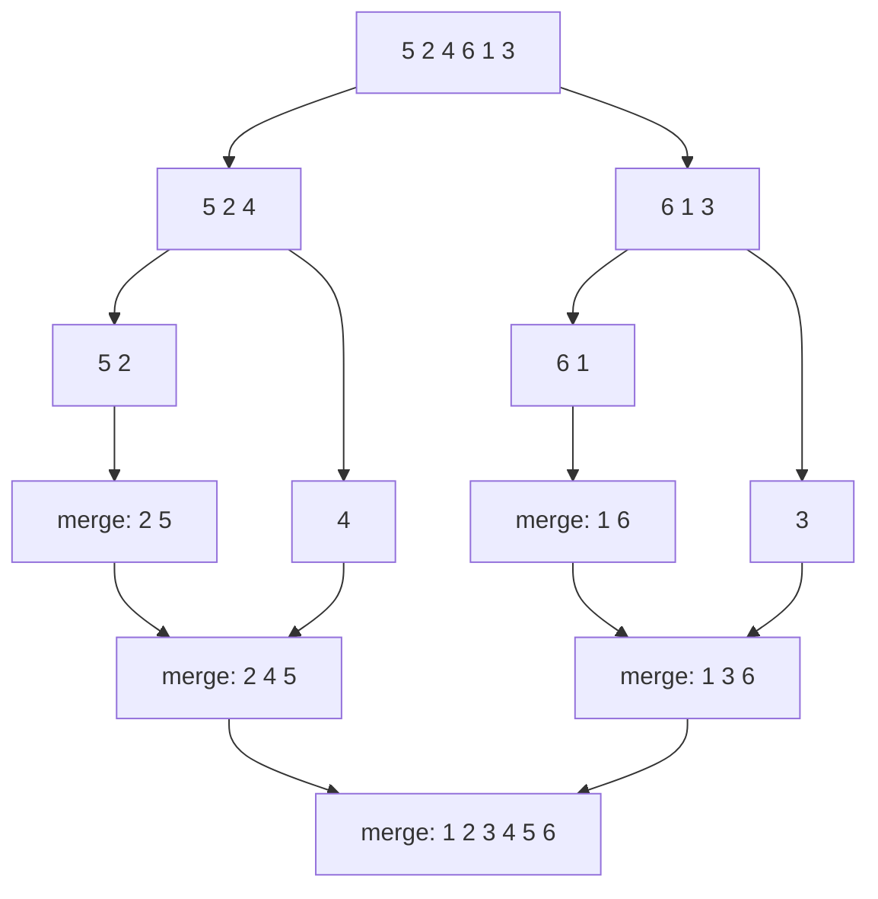
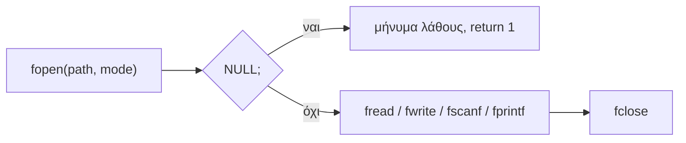

# Κεφάλαιο 18: Ταξινόμηση και Δεδομένα Εισόδου #2

<!--  -->

> **Στόχοι:** μετά από αυτό το κεφάλαιο θα μπορείτε να συγκρίνετε τους πέντε
> αλγορίθμους ταξινόμησης ως προς χρόνο και χώρο και να ιχνηλατείτε τη merge sort και
> την quicksort· να διαβάζετε `double` και συμβολοσειρές με `scanf` χωρίς υπερχείλιση·
> να ανοίγετε, να διαβάζετε, να γράφετε και να κλείνετε αρχεία με `fopen`, `fread`,
> `fwrite`, `fscanf`, `fprintf` και `fclose`· και να εξηγείτε τι είναι οι `stdin`,
> `stdout`, `stderr` και οι file descriptors.
>
> **Προαπαιτούμενα:** [Κεφάλαιο 9](../09-input/) (πρώτο μέρος για την είσοδο),
> [Κεφάλαιο 12](../12-pointers-arrays/) (endianness), [Κεφάλαιο 17](../17-binary-search-sorting/)
> (αλγόριθμοι ταξινόμησης)
>
> **Χρόνος μελέτης:** ~2,5 ώρες

## Σύνοψη

Η διάλεξη κλείνει την ταξινόμηση και ανοίγει το δεύτερο μέρος των δεδομένων εισόδου.
Πρώτα ξαναβλέπει τους πέντε αλγορίθμους ταξινόμησης (επιλογής, εισαγωγής, φυσαλίδας,
συγχώνευσης, ταχυταξινόμηση) με την πολυπλοκότητα χρόνου και χώρου του καθενός· οι
δύο τελευταίοι, με τη στρατηγική «διαίρει και βασίλευε», πέφτουν στο $O(n \log n)$.
Έπειτα επιστρέφει στη `scanf`, για `double` και για συμβολοσειρές, όπου ένα
`%s` χωρίς όριο μπορεί να γράψει έξω από τον πίνακα. Το κύριο θέμα είναι η τρίτη πηγή
εισόδου, τα **αρχεία**: ο τύπος `FILE`, το άνοιγμα και το κλείσιμο, το διάβασμα και το
γράψιμο bytes με `fread`/`fwrite` ή κειμένου με `fscanf`/`fprintf`. Με αυτά τα
προγράμματά σας μπορούν να κρατούν δεδομένα και αφού τερματίσουν.

## Θεωρία

### Δύο διευκρινίσεις: sizeof και log n

Η δήλωση `int array[5][10];` δεσμεύει $5 \cdot 10 \cdot$ `sizeof(int)` bytes, δηλαδή
200 με `int` των 4 bytes. Το `array[3]` είναι μία γραμμή, πίνακας 10 ακεραίων, άρα
`sizeof(array[3])` είναι `10 * sizeof(int)` = 40 ([Κεφάλαιο 12](../12-pointers-arrays/)).

Πώς αναγνωρίζετε πολυπλοκότητα $O(\log n)$ ([Κεφάλαιο 15](../15-complexity-preprocessor/));
Δύο τρόποι:

- Ελέγξτε αν το πρόβλημα «σπάει» σε μικρότερα υποπροβλήματα παρόμοιου μεγέθους και
  αρκεί να λύσετε **μόνο ένα** από αυτά (όπως η δυαδική αναζήτηση).
- Παρατηρήστε πώς αυξάνονται οι επαναλήψεις όσο μεγαλώνει το $N$. Αν αυξάνονται
  **γραμμικά** ενώ το $N$ αυξάνεται **εκθετικά**, η πολυπλοκότητα είναι $O(\log n)$:
  π.χ. $N = 10$ δίνει 1 επανάληψη, $N = 100$ δίνει 2, $N = 1000000$ δίνει 6.

### Γιατί ταξινομούμε

Αν το Instagram κρατά 2 δισεκατομμύρια χρήστες σε έναν πίνακα ακεραίων, η γραμμική
αναζήτηση για τον χρήστη 424242 κάνει έως $2 \cdot 10^9$ συγκρίσεις. Σε
**ταξινομημένο** πίνακα η δυαδική αναζήτηση χρειάζεται περίπου
$\log_2(2 \cdot 10^9) \approx 31$. Η ταξινόμηση πληρώνεται μία φορά και κάνει κάθε επόμενη αναζήτηση
φθηνή. Η διάλεξη εξετάζει πέντε **αλγορίθμους ταξινόμησης** (sorting algorithms):
bubblesort, selection sort, insertion sort, merge sort και quicksort. Όλοι παίρνουν
πίνακα `int` μέσω δείκτη και τον ταξινομούν σε αύξουσα σειρά επί τόπου.

### Η swap

Το βασικό βήμα των περισσότερων είναι η **αντιμετάθεση** (swap) δύο στοιχείων. Επειδή
στη C τα ορίσματα περνούν με τιμή, η `swap` πρέπει να παίρνει **δείκτες** και να
αλλάζει τις τιμές μέσω `*`:

```c
void swap(int *a, int *b) {
  int tmp = *a;
  *a = *b;
  *b = tmp;
}
```

Την καλούμε με διευθύνσεις: `swap(&a, &b)` ή `swap(&x[i], &x[j])`.

### Οι τρεις αλγόριθμοι O(n²)

Και οι τρεις έχουν δύο φωλιασμένους βρόχους πάνω στον πίνακα, άρα **χρόνο $O(n^2)$**,
και χρειάζονται μόνο λίγες τοπικές μεταβλητές, άρα **χώρο $O(1)$**. Ο αναλυτικός κώδικας
και η ιχνηλάτησή τους βρίσκονται στο [Κεφάλαιο 17](../17-binary-search-sorting/).

- **Ταξινόμηση επιλογής** (selection sort): στον γύρο `i` βρίσκει τη θέση `min` του
  μικρότερου στοιχείου από τη θέση `i - 1` ως το τέλος και κάνει
  `swap(&x[i-1], &x[min])`. Μετά από $n - 1$ γύρους ο πίνακας είναι ταξινομημένος.
- **Ταξινόμηση εισαγωγής** (insertion sort): το πρόθεμα `x[0..i-1]` είναι ήδη
  ταξινομημένο· το `x[i]` «βουλιάζει» αριστερά με `swap(&x[j], &x[j+1])` όσο
  `j >= 0 && x[j] > x[j+1]`. Σε πίνακα ήδη ταξινομημένο ο `while` δεν εκτελείται ποτέ.
- **Ταξινόμηση φυσαλίδας** (bubblesort): για `j` από `n - 1` ως `i`, αν
  `x[j-1] > x[j]` τα αντιμεταθέτει. Κάθε πέρασμα ανεβάζει το μικρότερο από τα
  υπόλοιπα στη θέση `i - 1`, σαν φυσαλίδα.

### Διαίρει και βασίλευε: merge sort

Ένας αλγόριθμος **διαίρει και βασίλευε** (divide and conquer) χωρίζει το πρόβλημα σε
μικρότερα του ίδιου είδους, τα λύνει αναδρομικά και συνδυάζει τις λύσεις. Η
**ταξινόμηση συγχώνευσης** (merge sort, του John von Neumann) έχει θεωρητικά την
καλύτερη πολυπλοκότητα και δύο βήματα:

1. χώρισε τον πίνακα σε δύο υποπίνακες και κάλεσε merge sort σε καθέναν·
2. **συγχώνευσε** τα στοιχεία των δύο ταξινομημένων υποπινάκων.

```c
void merge_sort(int *array, int left, int right) {
  if (left < right) {
    int middle = left + (right - left) / 2;
    merge_sort(array, left, middle);
    merge_sort(array, middle + 1, right);
    merge(array, left, middle, right);
  }
}
```

Το `left + (right - left) / 2` αποφεύγει την υπερχείλιση του `(left + right) / 2`.
Η `merge` αντιγράφει τα ταξινομημένα `x[l..m]` και `x[m+1..r]` σε δύο βοηθητικούς
πίνακες και γράφει πίσω στο `x` κάθε φορά το μικρότερο από τα δύο πρώτα
αχρησιμοποίητα στοιχεία· όταν ο ένας εξαντληθεί, αντιγράφει τα υπόλοιπα του άλλου:

```c
void merge(int *x, int l, int m, int r) {
  int i, j, k, n1 = m - l + 1, n2 = r - m;
  int left[n1], right[n2];
  for (i = 0; i < n1; i++) left[i] = x[l + i];
  for (j = 0; j < n2; j++) right[j] = x[m + 1 + j];
  i = 0; j = 0; k = l;
  while (i < n1 && j < n2) {
    if (left[i] <= right[j]) x[k++] = left[i++];
    else x[k++] = right[j++];
  }
  while (i < n1) x[k++] = left[i++];
  while (j < n2) x[k++] = right[j++];
}
```



*Σχήμα: η merge sort χωρίζει ως τα μονά στοιχεία και συγχωνεύει προς τα πάνω.*

Η διχοτόμηση δίνει περίπου $\log_2 n$ επίπεδα και σε κάθε επίπεδο οι συγχωνεύσεις
αγγίζουν συνολικά $n$ στοιχεία: **χρόνος $O(n \log n)$**, πάντα. Οι βοηθητικοί
πίνακες κοστίζουν **χώρο $O(n)$**.

### Ταχυταξινόμηση (quicksort)

Η **ταχυταξινόμηση** (quicksort, του Tony Hoare) είναι επίσης διαίρει και βασίλευε και
ιδιαίτερα δημοφιλής. Τρία βήματα:

1. διάλεξε (π.χ. τυχαία) ένα **στοιχείο διαμέρισης** (pivot element)·
2. **διαμέρισε** τον πίνακα: αριστερά τα στοιχεία μικρότερα του pivot, δεξιά τα
   μεγαλύτερα·
3. τρέξε ταχυταξινόμηση στους δύο υποπίνακες.

```c
void quicksort (int *x, int lower, int upper) {
  if (lower < upper) {
    int pivot = x[(lower + upper) / 2];
    int i, j;
    for (i = lower, j = upper; i <= j;) {
      while (x[i] < pivot) i++;
      while (x[j] > pivot) j--;
      if (i <= j) swap(&x[i++], &x[j--]);
    }
    quicksort(x, lower, j);
    quicksort(x, i, upper);
  }
}
```

Το pivot εδώ είναι το μεσαίο στοιχείο. Το `i` προχωρά από αριστερά και το `j` από
δεξιά ώσπου να βρουν στοιχεία στη λάθος πλευρά, τα οποία αντιμεταθέτουν. Όταν
διασταυρωθούν, το `x[lower..j]` έχει τα μικρά και το `x[i..upper]` τα μεγάλα, οπότε
δεν χρειάζεται συγχώνευση.

Αν το pivot μοιράζει περίπου στη μέση, έχουμε $\log_2 n$ επίπεδα: **$O(n \log n)$
κατά μέση περίπτωση** (average case). Αν είναι κάθε φορά το μικρότερο ή το μεγαλύτερο
στοιχείο, το ένα κομμάτι μικραίνει μόνο κατά ένα: **$O(n^2)$ στη χειρότερη
περίπτωση** (worst case). Ο χώρος είναι η στοίβα της αναδρομής, **$O(n)$** σε αυτή
την υλοποίηση· γίνεται $O(\log n)$ αν η αναδρομή γίνεται πάντα πρώτα στο μικρότερο
κομμάτι και το μεγαλύτερο χειρίζεται βρόχος. Η quicksort είναι υλοποιημένη στη
συνάρτηση `qsort` της `stdlib.h` (`man 3 qsort`).

### Σύγκριση των αλγορίθμων

| Αλγόριθμος | Χρόνος | Χώρος |
| --- | --- | --- |
| Selection sort | $O(n^2)$ | $O(1)$ |
| Insertion sort | $O(n^2)$ | $O(1)$ |
| Bubblesort | $O(n^2)$ | $O(1)$ |
| Merge sort | $O(n \log n)$ | $O(n)$ |
| Quicksort | $O(n \log n)$ μέση, $O(n^2)$ χειρότερη | $O(n)$ εδώ, $O(\log n)$ βελτιωμένη |

Η merge sort εγγυάται $O(n \log n)$ αλλά θέλει βοηθητικούς πίνακες· η quicksort δεν
θέλει, αλλά η χειρότερη περίπτωσή της είναι $O(n^2)$.

### Οι τέσσερις πηγές εισόδου

Τα **δεδομένα εισόδου** (input data) είναι μια σειρά από χαρακτήρες (bytes) που ο
χρήστης δίνει στο πρόγραμμα, το οποίο παράγει δεδομένα εξόδου (output data).
Υπάρχουν τέσσερις μέθοδοι ([Κεφάλαιο 9](../09-input/)):
ορίσματα γραμμής εντολών, πρότυπη είσοδος, αρχεία και δίκτυο ή άλλες πηγές.
Τα ορίσματα (`./grade 80 100 90`) και η πρότυπη είσοδος (`./aliquot` που ρωτά τον
χρήστη) έχουν καλυφθεί. Σήμερα προστίθενται τα **αρχεία** (όπως η `cat hello.txt`),
οπότε είμαστε στο «75%». Το δίκτυο (π.χ. `curl`) ανήκει σε επόμενα εξάμηνα.

### Η scanf με double και συμβολοσειρές

Για `double` η `scanf` θέλει `%lf` και τη διεύθυνση της μεταβλητής, π.χ.
`scanf("%lf %lf", &d1, &d2);`. (Η `printf` τυπώνει `double` με `%f`· το `%.1f`
κρατά ένα δεκαδικό.)

Για συμβολοσειρά, το `%s` διαβάζει μια **λέξη**: παραλείπει τα αρχικά κενά και
σταματά στο επόμενο λευκό χαρακτήρα, προσθέτοντας `'\0'` στο τέλος. Το όρισμα είναι
το όνομα του πίνακα **χωρίς `&`**: το `message` μετατρέπεται ήδη σε δείκτη στο πρώτο
στοιχείο ([Κεφάλαιο 12](../12-pointers-arrays/)).

Το `%s` **δεν ελέγχει** το μέγεθος του πίνακα. Σε `char message[7]` χωρούν 6
χαρακτήρες και το `'\0'`· μια μεγαλύτερη λέξη γράφεται πέρα από το τέλος του, με
απροσδιόριστη συμπεριφορά (συχνά `Segmentation fault`). Η λύση είναι ένα **πλάτος
πεδίου**: το `%6s` διαβάζει το πολύ 6 χαρακτήρες. Ο κανόνας είναι πλάτος = μέγεθος
πίνακα − 1. Οι χαρακτήρες που δεν διαβάστηκαν μένουν στην είσοδο για την επόμενη
ανάγνωση.

### Η gets και το %ms

Η `gets(char *s)` διαβάζει μια ολόκληρη γραμμή από την `stdin` χωρίς κανένα όριο,
όπως το `scanf("%s")`. Το εγχειρίδιο (`man gets`) τη χαρακτηρίζει DEPRECATED και
γράφει «Never use this function»· αποφεύγεται για λόγους ασφαλείας (για γραμμές
χρησιμοποιήστε `fgets`, παρακάτω).

Αν θέλετε οπωσδήποτε `scanf`, το `%ms` αφήνει τη `scanf` να δεσμεύσει με `malloc` όση
μνήμη χρειάζεται. Δίνουμε τη διεύθυνση ενός `char *` (`&string`), ελέγχουμε ότι η
`scanf` επέστρεψε 1 και στο τέλος καλούμε `free(string)`. Ο τροποποιητής `m` είναι
επέκταση POSIX (υπάρχει στη glibc του Linux), όχι μέρος του προτύπου C.

### Αρχεία και σύστημα αρχείων

Ένα **αρχείο** (file) είναι ένας πόρος για να καταγράφουμε δεδομένα σε έναν
υπολογιστή, συνήθως στη δευτερεύουσα μνήμη (π.χ. σκληρό δίσκο). Στο Linux σχεδόν
**τα πάντα είναι αρχεία** (everything is a file). Το περιεχόμενο ενός αρχείου είναι
απλώς ένας πίνακας από bytes, `char bytes[]`. Κάθε αρχείο:

- έχει ένα **όνομα** (filename/basename), π.χ. `students.txt`·
- βρίσκεται σε έναν **φάκελο** (directory/folder), π.χ. `/home/users/thanassis/documents`·
- έχει ένα πλήρες **μονοπάτι** (filepath) που λέει πού βρίσκεται:
  `/home/users/thanassis/documents/students.txt`.

Το `.txt` λέγεται **επέκταση** (extension) και συνήθως περιγράφει τον τύπο του
αρχείου ([Κεφάλαιο 1](../01-command-line/)).

### Ο τύπος FILE και η fopen

Ο τύπος **`FILE`** ορίζεται στην `stdio.h` και αναπαριστά ένα αρχείο που άνοιξε το
πρόγραμμα. Είναι μια δομή με πολλά εσωτερικά πεδία: το
`printf("%zu\n", sizeof(FILE));` τυπώνει 216 σε ένα σύστημα Debian. Τι περιέχουν
αυτά τα bytes είναι θέμα της υλοποίησης· εμείς δουλεύουμε πάντα με δείκτη `FILE *`, που λέγεται και **ρεύμα** (stream).

```c
FILE *fopen(const char *restrict pathname, const char *restrict mode);
```

Η `fopen` ανοίγει το αρχείο `pathname` με τον τρόπο `mode` και επιστρέφει `FILE *`, ή
**`NULL`** αν αποτύχει για οποιονδήποτε λόγο. Τα βασικά `mode` (`man 3 fopen`):

| `mode` | Σημασία | Αν δεν υπάρχει | Αρχική θέση |
| --- | --- | --- | --- |
| `"r"` | διάβασμα | αποτυχία | αρχή |
| `"r+"` | διάβασμα και γράψιμο | αποτυχία | αρχή |
| `"w"` | γράψιμο, **σβήνει** το περιεχόμενο | δημιουργείται | αρχή |
| `"w+"` | διάβασμα και γράψιμο, σβήνει | δημιουργείται | αρχή |
| `"a"` | προσάρτηση (γράψιμο στο τέλος) | δημιουργείται | τέλος |
| `"a+"` | διάβασμα και προσάρτηση | δημιουργείται | τέλος για γράψιμο |

Ελέγχουμε **πάντα** αν η `fopen` επέστρεψε `NULL`. Αποτυγχάνει αν το αρχείο ή ο φάκελος
δεν υπάρχει, αν δεν υπάρχει ελεύθερος δίσκος για να γράψουμε, αν δεν έχουμε δικαιώματα
να φτιάξουμε ή να διαβάσουμε το αρχείο, αν έχουμε ανοίξει τον μέγιστο επιτρεπτό αριθμό
αρχείων, κ.ά.

### Η fclose

```c
int fclose(FILE *stream);
```

Η `fclose` κλείνει ένα αρχείο και επιστρέφει 0 αν επιτύχει ή `EOF` αν αποτύχει.
**Πάντα** κλείνουμε τα αρχεία μόλις τελειώσουμε: σε κάθε `fopen` αντιστοιχεί ένα
`fclose`, όπως σε κάθε `malloc` ένα `free` ([Κεφάλαιο 13](../13-memory/)).



*Σχήμα: ο κύκλος ζωής ενός αρχείου μέσα στο πρόγραμμα.*

### Διάβασμα και γράψιμο bytes: fread και fwrite

```c
size_t fread(void *ptr, size_t size, size_t nmemb, FILE *restrict stream);
size_t fwrite(const void *ptr, size_t size, size_t nmemb,
              FILE *restrict stream);
```

Η `fread` διαβάζει από το ανοιχτό αρχείο `stream` το πολύ `nmemb` δεδομένα των
`size` bytes το καθένα και τα αποθηκεύει από τη διεύθυνση `ptr` και μετά. Η `fwrite`
κάνει το αντίστροφο: γράφει `nmemb` δεδομένα των `size` bytes, παίρνοντάς τα από το
`ptr`. Και οι δύο επιστρέφουν **πόσα δεδομένα** (όχι bytes) διαβάστηκαν ή γράφτηκαν·
ένα μισό δεδομένο στο τέλος του αρχείου δεν μετράει.

Οι δύο συναρτήσεις αντιγράφουν bytes **αυτούσια**, χωρίς καμία μετατροπή. Ένα αρχείο
κειμένου που περιέχει `hello` διαβασμένο ως `int` δεν δίνει αριθμό γραμμένο με ψηφία,
αλλά τα bytes `68 65 6c 6c` ερμηνευμένα ως ακέραιο, με τη σειρά του endianness της
μηχανής ([Κεφάλαιο 12](../12-pointers-arrays/)). Αντίστροφα, η `fwrite` ενός `int`
γράφει τα 4 bytes της μνήμης του, όχι το κείμενο του αριθμού. Για τα `char` το
`size` είναι 1 και τα δεδομένα είναι bytes· για να τυπώσουμε ό,τι διαβάσαμε ως
συμβολοσειρά, αφήνουμε μία θέση και βάζουμε `'\0'` στο τέλος.

### File descriptors: stdin, stdout, stderr

Κάθε ανοιχτό αρχείο ενός προγράμματος έχει έναν μοναδικό ακέραιο, τον **file
descriptor** (FD), που τον βρίσκουμε με τη `fileno(FILE *)`. Τρία ρεύματα
ανοίγουν αυτόματα όταν ξεκινά το πρόγραμμα και κλείνουν όταν τερματίζει:

| Ρεύμα | Αντιστοιχεί σε | FD |
| --- | --- | --- |
| `stdin` | πρότυπη είσοδο (standard input) | 0 |
| `stdout` | πρότυπη έξοδο (standard output) | 1 |
| `stderr` | έξοδο σφάλματος (standard error) | 2 |

Γι' αυτό τα πρώτα αρχεία που ανοίγουμε παίρνουν συνήθως τους αριθμούς 3, 4, … Το
shell χρησιμοποιεί τους ίδιους αριθμούς στις ανακατευθύνσεις: το `2> error.txt`
στέλνει στο αρχείο μόνο την έξοδο σφάλματος. Μηνύματα λάθους γράφονται λοιπόν στο
`stderr` (`fprintf(stderr, ...)`), ώστε να μην ανακατεύονται με τα αποτελέσματα.

### Κείμενο σε αρχεία: fscanf και fprintf

```c
int fscanf(FILE *stream, const char *format, ...);
int fprintf(FILE *stream, const char *format, ...);
```

Η `fscanf` είναι η `scanf` με ένα επιπλέον πρώτο όρισμα, το αρχείο από το οποίο
διαβάζει· η `fprintf` είναι η `printf` για οποιοδήποτε αρχείο. Η κλήση `scanf(x, y, z)`
είναι ουσιαστικά ίδια με `fscanf(stdin, x, y, z)`, και η `printf(x, y, z)` με
`fprintf(stdout, x, y, z)`. Σε αντίθεση με τη `fread`, αυτές **μετατρέπουν** κείμενο
σε τιμές και αντίστροφα: το `"%d"` διαβάζει τους χαρακτήρες `42` ως τον ακέραιο 42.

### Άλλες χρήσιμες συναρτήσεις

| Δήλωση | Τι κάνει (σημειώσεις, κεφ. 9) |
| --- | --- |
| `char *fgets(char *s, int size, FILE *stream);` | διαβάζει μια γραμμή, το πολύ `size - 1` χαρακτήρες μαζί με το `\n`· `NULL` στο τέλος |
| `int feof(FILE *stream);` | μη μηδενικό αν έχουμε φτάσει στο τέλος του αρχείου |
| `int fseek(FILE *stream, long offset, int whence);` | μετακινεί την τρέχουσα θέση (`SEEK_SET`, `SEEK_CUR`, `SEEK_END`) |
| `int fgetc(FILE *stream);` | επόμενος χαρακτήρας ή `EOF` (η `getchar` για αρχεία) |
| `int fputc(int c, FILE *stream);` | γράφει έναν χαρακτήρα (η `putchar` για αρχεία) |

## Παραδείγματα

### Merge sort και quicksort βήμα προς βήμα

Στον πίνακα `{5, 2, 4, 6, 1, 3}` η `merge_sort(x, 0, 5)` καλεί τις συγχωνεύσεις με
τη σειρά `[0..1]`, `[0..2]`, `[3..4]`, `[3..5]`, `[0..5]`, όπως στο σχήμα της
Θεωρίας. Η `quicksort(x, 0, 5)` στον ίδιο πίνακα (Θεωρία: «Ταχυταξινόμηση»):

| Κλήση | pivot | Πίνακας μετά τη διαμέριση |
| --- | --- | --- |
| `quicksort(x, 0, 5)` | 4 | 3 2 1 6 4 5 |
| `quicksort(x, 0, 2)` | 2 | 1 2 3 6 4 5 |
| `quicksort(x, 3, 5)` | 4 | 1 2 3 4 6 5 |
| `quicksort(x, 4, 5)` | 6 | 1 2 3 4 5 6 |

Οι υπόλοιπες κλήσεις έχουν `lower >= upper` και επιστρέφουν αμέσως. Πλήρη προγράμματα
με `main` για όλους τους αλγορίθμους θα βρείτε στο [Κεφάλαιο 17](../17-binary-search-sorting/).

### Υποτείνουσα με scanf

«Τι κάνει το παρακάτω πρόγραμμα;» (Θεωρία: «Η scanf με double και συμβολοσειρές»).

```c
#include <stdio.h>
#include <math.h>

int main() {
  double d1, d2;
  printf("Gimme two doubles: ");
  scanf("%lf %lf", &d1, &d2);
  printf("Hypotenuse: %.1f\n", sqrt(d1 * d1 + d2 * d2));
  return 0;
}
```

Διαβάζει δύο `double` και τυπώνει, με ένα δεκαδικό, την υποτείνουσα ορθογωνίου
τριγώνου με αυτές τις κάθετες πλευρές (αν ο linker δεν βρίσκει τη `sqrt`, προσθέστε
`-lm` στον `gcc`).

```text
$ ./hypotenuse
Gimme two doubles: 3.0 4.0
Hypotenuse: 5.0
```

### Μια λέξη σε char[7]

(Θεωρία: «Η scanf με double και συμβολοσειρές».)

```c
#include <stdio.h>

int main() {
  char message[7];
  printf("Say something: ");
  scanf("%s", message);
  printf("%s\n", message);
  return 0;
}
```

Με τη λέξη `hello!` (6 χαρακτήρες και `'\0'`) όλα πάνε καλά. Δεν βάλαμε `&` πριν το
`message`, γιατί το όνομα του πίνακα είναι ήδη διεύθυνση. «Μπορεί να πάει κάτι στραβά
εδώ;» Ναι:

```text
$ ./message
Say something: hello!
hello!
$ ./message
Say something: Houston, we've had a problem here.
Houston,
Segmentation fault
```

Το `%s` διάβασε το `Houston,` (8 χαρακτήρες και `'\0'`) σε πίνακα 7 θέσεων, χωρίς
κανέναν έλεγχο. Με `scanf("%6s", message);` το πρόγραμμα τυπώνει `Housto`.

### Συμβολοσειρά οποιουδήποτε μήκους με %ms

(Θεωρία: «Η gets και το %ms».)

```c
#include <stdio.h>
#include <stdlib.h>

int main(int argc, char **argv) {
  char *string;
  int items_read;
  items_read = scanf("%ms", &string);
  if (items_read != 1) {
    fprintf(stderr, "No matching characters\n");
    return 1;
  }
  printf("read the following string: %s\n", string);
  // don't forget to free!
  free(string);
  return 0;
}
```

### Άνοιγμα και κλείσιμο αρχείων

(Θεωρία: «Ο τύπος FILE και η fopen», «Η fclose».) Το `input.txt` ανοίγει για
διάβασμα και το `output.txt` για γράψιμο (δημιουργείται ή αδειάζει). Κάθε `fopen`
ελέγχεται για `NULL` και κάθε αρχείο που άνοιξε κλείνει.

```c
#include <stdio.h>

int main() {
  FILE *fileToRead, *fileToWrite;
  fileToRead = fopen("input.txt", "r");
  if (!fileToRead) {
    return 1;
  }
  fileToWrite = fopen("output.txt", "w");
  if (!fileToWrite) {
    fclose(fileToRead);
    return 1;
  }
  // ... read and write ...
  fclose(fileToRead);
  fclose(fileToWrite);
  return 0;
}
```

Αν η δεύτερη `fopen` αποτύχει, το πρώτο αρχείο είναι ήδη ανοιχτό· γι' αυτό το
κλείνουμε πριν το `return 1` (η διαφάνεια απλώς επιστρέφει).

### Διάβασμα κειμένου με fread

(Θεωρία: «Διάβασμα και γράψιμο bytes: fread και fwrite».)

```c
#include <stdio.h>

int main() {
  FILE *fileToRead;
  fileToRead = fopen("input.txt", "r");
  if (!fileToRead) return 1;
  char buffer[1024];
  size_t bytesRead = fread(buffer, sizeof(char), 1023, fileToRead);
  buffer[bytesRead] = '\0';
  printf("# of bytes read: %zu\n", bytesRead);
  printf("String read: %s\n", buffer);
  fclose(fileToRead);
  return 0;
}
```

Διαβάζουμε το πολύ 1023 bytes ώστε να μένει θέση για το `'\0'`. Η πρώτη εκτέλεση δεν
τυπώνει τίποτα: το `input.txt` δεν υπάρχει, η `fopen` επιστρέφει `NULL` και το
πρόγραμμα τερματίζει με 1. Η `echo` γράφει `hello` και αλλαγή γραμμής, άρα 6 bytes:

```text
$ ./fread
$ echo hello > input.txt
$ ./fread
# of bytes read: 6
String read: hello

```

### «What?!»: ακέραιοι από αρχείο κειμένου

Ίδιο πρόγραμμα, αλλά με πίνακα ακεραίων (το `'\0'` φεύγει):

```c
int buffer[1024];
size_t integersRead = fread(buffer, sizeof(int), 1023, fileToRead);
printf("# of integers read: %zu\n", integersRead);
printf("Integer read: %d %08x\n", buffer[0], buffer[0]);
```

```text
$ ./freadint
# of integers read: 1
Integer read: 1819043176 6c6c6568
$ hexdump -C input.txt
00000000  68 65 6c 6c 6f 0a  |hello.|
```

Τα 6 bytes του αρχείου χωρούν ένα ολόκληρο `int` (4 bytes)· τα 2 που περισσεύουν δεν
σχηματίζουν δεδομένο, άρα η `fread` επιστρέφει 1. Τα bytes `68 65 6c 6c` (`h e l l`)
διαβάζονται σε μηχανή little endian ως `0x6c6c6568` = 1819043176 (Θεωρία: «Διάβασμα και
γράψιμο bytes»). Η `fread` δεν ξέρει τίποτα από κείμενο· για να διαβάσετε αριθμούς
γραμμένους με ψηφία χρησιμοποιήστε `fscanf`.

### Γράψιμο με fwrite

(Θεωρία: «Διάβασμα και γράψιμο bytes: fread και fwrite».)

```c
#include <stdio.h>

int main() {
  FILE *fileToWrite;
  fileToWrite = fopen("output.txt", "w");
  if (!fileToWrite) return 1;
  int numbers[4] = {0x42, 0x43, 0x44, 0x45};
  size_t numsWritten = fwrite(numbers, sizeof(int), 4, fileToWrite);
  printf("Wrote: %zu numbers\n", numsWritten);
  fclose(fileToWrite);
  return 0;
}
```

```text
$ ./fwrite
Wrote: 4 numbers
$ hexdump -C output.txt
00000000  42 00 00 00 43 00 00 00  44 00 00 00 45 00 00 00  |B...C...D...E...|
```

Γράφτηκαν 16 bytes, 4 ανά ακέραιο, με το λιγότερο σημαντικό byte πρώτο (little
endian). Το `hexdump` δείχνει δεξιά ως χαρακτήρες όσα bytes είναι εκτυπώσιμα:
`0x42` είναι το `'B'`, και τα μηδενικά φαίνονται ως τελείες.

### Οι file descriptors ενός προγράμματος

(Θεωρία: «File descriptors: stdin, stdout, stderr».)

```c
fileToRead = fopen("input.txt", "r");
fileToWrite = fopen("output.txt", "w");
// ...
printf("fileToRead: %d\n", fileno(fileToRead));
printf("fileToWrite: %d\n", fileno(fileToWrite));
printf("stdin: %d\n", fileno(stdin));
printf("stdout: %d\n", fileno(stdout));
printf("stderr: %d\n", fileno(stderr));
```

```text
$ ./fileno
fileToRead: 3
fileToWrite: 4
stdin: 0
stdout: 1
stderr: 2
```

Η διάλεξη προτείνει επίσης να συγκρίνετε το `find / -name foo` με το
`find / -name foo 2> error.txt`: στο δεύτερο, τα μηνύματα λάθους (π.χ. για φακέλους
χωρίς δικαιώματα) πηγαίνουν στο `error.txt` και στην οθόνη μένουν μόνο τα
αποτελέσματα.

### fscanf και fprintf

(Θεωρία: «Κείμενο σε αρχεία: fscanf και fprintf».)

```c
#include <stdio.h>

int main() {
  FILE *fileToRead, *fileToWrite;
  fileToRead = fopen("input.txt", "r");
  fileToWrite = fopen("output.txt", "w");
  if (!fileToRead || !fileToWrite) return 1;
  int num;
  fscanf(fileToRead, "%d", &num);
  fprintf(fileToWrite, "Number: %d\n", num);
  fclose(fileToRead);
  fclose(fileToWrite);
  return 0;
}
```

```text
$ echo "     42" > input.txt
$ ./stream
$ cat output.txt
Number: 42
```

Το `%d` παραλείπει τα αρχικά κενά, όπως και στη `scanf`, και μετατρέπει τους
χαρακτήρες `42` στον ακέραιο 42. Το πρόγραμμα δεν τυπώνει τίποτα στην οθόνη: όλη η
έξοδος πήγε στο αρχείο.

### Για το εργαστήριο

Το [Εργαστήριο 10](https://progintro.github.io/lab-material/labs/lab10/) εξασκεί ακριβώς
αυτά: το `more.c` διαβάζει αρχείο κειμένου γραμμή-γραμμή (`fgets`), το `bgrades.c`
γράφει και διαβάζει δυαδικό αρχείο με `fwrite`/`fread` (δείτε το με `hexdump -C`), το
`filediff.c` συγκρίνει δύο αρχεία byte προς byte και το `count.c` μετρά χαρακτήρες και
γραμμές όπως η `wc`. Σε όλα: το όνομα του αρχείου έρχεται από το `argv`, ελέγχετε το
`argc` και το αποτέλεσμα της `fopen`, και κλείνετε ό,τι ανοίξατε.

## Κύρια σημεία

1. Για `int array[5][10]`, το `sizeof(array[3])` είναι `10 * sizeof(int)`, μία γραμμή.
2. Πολυπλοκότητα $O(\log n)$ έχουμε όταν λύνουμε μόνο ένα από υποπροβλήματα
   παρόμοιου μεγέθους, ή όταν οι επαναλήψεις αυξάνονται γραμμικά ενώ το $N$ αυξάνεται
   εκθετικά.
3. Η ταξινόμηση κάνει την αναζήτηση φθηνή: 2 δισεκατομμύρια στοιχεία θέλουν περίπου 31
   βήματα δυαδικής αναζήτησης αντί για $2 \cdot 10^9$.
4. Selection, insertion και bubblesort έχουν χρόνο $O(n^2)$ και χώρο $O(1)$.
5. Η merge sort (διαίρει και βασίλευε) έχει χρόνο $O(n \log n)$ πάντα και χώρο $O(n)$
   για τη συγχώνευση.
6. Η quicksort έχει χρόνο $O(n \log n)$ κατά μέση περίπτωση και $O(n^2)$ στη χειρότερη,
   χώρο $O(n)$ στην υλοποίηση της διάλεξης (βελτιώνεται σε $O(\log n)$), και είναι
   υλοποιημένη στην `qsort` της `stdlib.h`.
7. Τα δεδομένα εισόδου έρχονται από ορίσματα, πρότυπη είσοδο, αρχεία ή δίκτυο.
8. Η `scanf` διαβάζει `double` με `%lf`· με `%s` δεν ελέγχει το μέγεθος του πίνακα, άρα
   δίνετε πάντα πλάτος πεδίου (`%6s` για `char[7]`).
9. Η `gets` δεν χρησιμοποιείται ποτέ· το `%ms` δεσμεύει μνήμη που πρέπει να
   απελευθερώσετε με `free`.
10. Ένα αρχείο έχει όνομα, φάκελο και πλήρες μονοπάτι· το περιεχόμενό του είναι ένας
    πίνακας από bytes.
11. Η `fopen` επιστρέφει `FILE *` ή `NULL`· ελέγχουμε πάντα για `NULL`, και σε κάθε
    `fopen` αντιστοιχεί ένα `fclose`.
12. Οι `fread`/`fwrite` αντιγράφουν bytes αυτούσια και επιστρέφουν πόσα δεδομένα
    μεταφέρθηκαν· οι `fscanf`/`fprintf` μετατρέπουν κείμενο.
13. Οι `stdin`, `stdout`, `stderr` ανοίγουν αυτόματα με file descriptors 0, 1 και 2·
    η `scanf(...)` είναι η `fscanf(stdin, ...)` και η `printf(...)` η
    `fprintf(stdout, ...)`.

## Ορολογία

| Ελληνικά | English | Σύντομος ορισμός |
| --- | --- | --- |
| ταξινόμηση | sorting | Αναδιάταξη στοιχείων σε αύξουσα (ή φθίνουσα) σειρά. |
| αντιμετάθεση | swap | Ανταλλαγή των τιμών δύο θέσεων μνήμης. |
| διαίρει και βασίλευε | divide and conquer | Σπάσε σε μικρότερα υποπροβλήματα, λύσε, συνδύασε. |
| συγχώνευση | merge | Ένωση δύο ταξινομημένων ακολουθιών σε μία ταξινομημένη. |
| στοιχείο διαμέρισης | pivot element | Το στοιχείο γύρω από το οποίο η quicksort χωρίζει τον πίνακα. |
| μέση / χειρότερη περίπτωση | average / worst case | Κόστος κατά μέσο όρο / για τη χειρότερη είσοδο. |
| πρότυπη είσοδος / έξοδος | standard input / output | Τα ρεύματα `stdin` / `stdout` του προγράμματος. |
| έξοδος σφάλματος | standard error | Το ρεύμα `stderr`, για μηνύματα λάθους. |
| πλάτος πεδίου | field width | Ο αριθμός στο `%6s`: μέγιστοι χαρακτήρες που θα διαβαστούν. |
| αρχείο | file | Πόρος καταγραφής δεδομένων, συνήθως στον δίσκο. |
| μονοπάτι | filepath | Η πλήρης θέση ενός αρχείου, π.χ. `/home/…/students.txt`. |
| επέκταση | extension | Το τέλος του ονόματος (`.txt`) που δείχνει τον τύπο. |
| ρεύμα | stream | Ένα ανοιχτό αρχείο, ως `FILE *`. |
| περιγραφέας αρχείου | file descriptor (FD) | Ο ακέραιος που ταυτίζει ένα ανοιχτό αρχείο (`fileno`). |

## Συχνά λάθη

- **`swap(int a, int b)` με τιμές.** Αλλάζει μόνο τα αντίγραφα· ο πίνακας μένει ίδιος.
  Περάστε δείκτες: `swap(&x[i], &x[j])`.
- **`%s` χωρίς πλάτος πεδίου.** Μια μακριά λέξη γράφει έξω από τον πίνακα και το
  πρόγραμμα καταρρέει (`Segmentation fault`) ή, χειρότερα, συνεχίζει με
  αλλοιωμένα δεδομένα. Γράψτε `%6s` για `char[7]`.
- **`%f` αντί για `%lf` στη `scanf` για `double`.** Ο `gcc -Wall` προειδοποιεί
  (`format '%f' expects argument of type 'float *'`) και η τιμή βγαίνει λάθος.
- **`gets`.** Ο `gcc` προειδοποιεί ότι είναι επικίνδυνη· χρησιμοποιήστε
  `fgets(buf, sizeof(buf), stdin)`.
- **Χωρίς έλεγχο της `fopen`.** Αν το αρχείο δεν υπάρχει, η `fopen` επιστρέφει `NULL`
  και η επόμενη `fread`/`fscanf` δίνει `Segmentation fault`. Ελέγξτε `if (!fp)` και
  τυπώστε μήνυμα στο `stderr`.
- **`"w"` σε αρχείο που θέλετε να κρατήσετε.** Το `"w"` σβήνει αμέσως το περιεχόμενο·
  για προσθήκη στο τέλος χρησιμοποιήστε `"a"`.
- **Ξεχασμένο `fclose`.** Χάνεται ένας file descriptor (το όριο ανοιχτών αρχείων είναι
  πεπερασμένο) και, αν το πρόγραμμα καταρρεύσει, δεδομένα που περιμένουν στον buffer
  μπορεί να μη γραφτούν ποτέ. Σε κάθε `fopen` ένα `fclose`.
- **`buffer[bytesRead] = '\0'` χωρίς χώρο.** Αν διαβάσετε `sizeof(buffer)` bytes,
  το `'\0'` πέφτει έξω από τον πίνακα· διαβάστε το πολύ `sizeof(buffer) - 1`.
- **`fread` αρχείου κειμένου σε `int`.** Παίρνετε `1819043176` αντί για αριθμό: η
  `fread` δεν μετατρέπει ψηφία. Για κείμενο χρησιμοποιήστε `fscanf`.
- **`size_t` με `%d`.** Η διαφάνεια τυπώνει το αποτέλεσμα της `fread` με `%d`· ο `gcc
  -Wall` προειδοποιεί (`expects argument of type 'int'`). Το σωστό είναι `%zu`.
- **Μηνύματα λάθους στο `stdout`.** Ανακατεύονται με τα αποτελέσματα όταν η έξοδος
  ανακατευθύνεται σε αρχείο. Γράψτε τα με `fprintf(stderr, ...)`.

## Διάβασμα

- **Διαφάνειες:** [Διάλεξη 18](https://github.com/progintro/progintro.github.io/releases/download/2025/lec18.pdf),
  σελ. 1–63: διευκρινίσεις 2· αλγόριθμοι ταξινόμησης 5–21· πηγές εισόδου 22–28·
  `scanf`, `gets`, `%ms` 29–37· αρχεία, `FILE`, `fopen`, `fclose` 38–46· `fread`,
  `fwrite` 47–54· file descriptors 55–56· `fscanf`, `fprintf` και άλλες συναρτήσεις
  57–61· διάβασμα για την επόμενη φορά 62.
- **Σημειώσεις:** η διάλεξη αναφέρει ότι κάλυψε τις σελ. 136–151 και 160–177:
  - [Κεφάλαιο 9: Είσοδος και έξοδος](https://progintro.github.io/notes/chapters/09-io/),
    ενότητες «Είσοδος και έξοδος» (K04, σελ. 137–150) και «Αντιγραφή αρχείων»
    (151–152).
  - [Κεφάλαιο 11: Ταξινόμηση και αναζήτηση](https://progintro.github.io/notes/chapters/11-sorting-searching/),
    ενότητες «Ταξινόμηση πινάκων» (K04, σελ. 161–167), «Μέθοδοι ταξινόμησης»
    (168–172), «Αναζήτηση σε πίνακες» (173) και «Μέθοδοι αναζήτησης» (174–178).
- **Εργαστήριο:** [Εργαστήριο 10](https://progintro.github.io/lab-material/labs/lab10/):
  ασκήσεις `more.c`, `bgrades.c`, `filediff.c`, `count.c`.
- **Άλλα:** οπτικοποιήσεις ταξινόμησης [1](https://www.toptal.com/developers/sorting-algorithms),
  [2](https://visualgo.net/en/sorting), [3](https://www.hackerearth.com/practice/algorithms/sorting/quick-sort/visualize/)·
  Wikipedia: [Sorting algorithm](https://en.wikipedia.org/wiki/Sorting_algorithm),
  [Divide and conquer](https://en.wikipedia.org/wiki/Divide-and-conquer_algorithm),
  [John von Neumann](https://en.wikipedia.org/wiki/John_von_Neumann),
  [Tony Hoare](https://en.wikipedia.org/wiki/Tony_Hoare), [Scanf](https://en.wikipedia.org/wiki/Scanf),
  [Computer file](https://en.wikipedia.org/wiki/Computer_file),
  [Everything is a file](https://en.wikipedia.org/wiki/Everything_is_a_file),
  [File descriptor](https://en.wikipedia.org/wiki/File_descriptor),
  [Endianness](https://en.wikipedia.org/wiki/Endianness)·
  [Quicksort analysis](https://www.khanacademy.org/computing/computer-science/algorithms/quick-sort/a/analysis-of-quicksort)·
  [Quicksort σε χώρο O(log n)](https://www.geeksforgeeks.org/quicksort-tail-call-optimization-reducing-worst-case-space-log-n/)·
  [scanf specifiers](https://cplusplus.com/reference/cstdio/scanf/)·
  [fread](https://www.geeksforgeeks.org/fread-function-in-c/)· `man 3 fopen`, `man 3 gets`.

## Ασκήσεις

<!-- exercises -->
<!-- /exercises -->

## Ερωτήσεις αυτοαξιολόγησης

1. Ποιοι από τους πέντε αλγορίθμους ταξινόμησης χρειάζονται χώρο $O(1)$, και γιατί η
   merge sort χρειάζεται $O(n)$;[^q1]
2. Πότε η quicksort της διάλεξης κάνει $O(n^2)$ βήματα;[^q2]
3. Ποιο πλάτος πεδίου δίνετε στη `scanf` για να διαβάσετε λέξη σε `char name[20]`;[^q3]
4. Τι επιστρέφει η `fopen` όταν αποτύχει, και τι γίνεται στο περιεχόμενο ενός
   υπάρχοντος αρχείου που ανοίγει με `"w"`;[^q4]
5. Ένα αρχείο έχει 10 bytes. Τι επιστρέφει η `fread(buf, sizeof(int), 100, fp)`;[^q5]
6. Ποιοι είναι οι file descriptors των `stdin`, `stdout`, `stderr`, και τι κάνει το
   `2> error.txt`;[^q6]

[^q1]: Οι selection, insertion και bubblesort· η `merge` αντιγράφει τα δύο μισά σε
    βοηθητικούς πίνακες.

[^q2]: Όταν το pivot είναι κάθε φορά το μικρότερο ή το μεγαλύτερο στοιχείο του
    τμήματος, οπότε το ένα κομμάτι μικραίνει μόνο κατά ένα.

[^q3]: `%19s`: 19 χαρακτήρες και το `'\0'`.

[^q4]: `NULL`· το περιεχόμενο σβήνεται (το αρχείο γίνεται μήκους 0).

[^q5]: 2: δύο ολόκληρα `int` των 4 bytes· τα 2 bytes που περισσεύουν δεν μετράνε.

[^q6]: 0, 1 και 2· το `2> error.txt` ανακατευθύνει την έξοδο σφάλματος στο αρχείο.

<!--  -->
