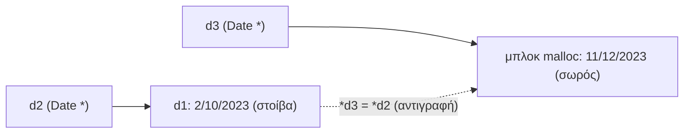

# Κεφάλαιο 19: Δομές

<!--  -->

> **Στόχοι:** μετά από αυτό το κεφάλαιο θα μπορείτε να ορίζετε δικούς σας τύπους με
> `struct`, να δηλώνετε, να αρχικοποιείτε και να αντιγράφετε μεταβλητές τύπου δομής,
> να προσπελαύνετε τα πεδία τους με `.` και, μέσω δείκτη, με `->`· να εξηγείτε πώς
> μια δομή κάθεται στη μνήμη και γιατί το `sizeof` της μπορεί να είναι μεγαλύτερο
> από το άθροισμα των πεδίων της (padding)· και να δίνετε συνώνυμα τύπων με `typedef`.
>
> **Προαπαιτούμενα:** [Κεφάλαιο 12](../12-pointers-arrays/),
> [Κεφάλαιο 13](../13-memory/)
>
> **Χρόνος μελέτης:** ~2 ώρες

## Σύνοψη

Μέχρι τώρα τα δεδομένα μας ήταν `int`, `double`, `char`, δείκτες και πίνακες. Τα
πραγματικά δεδομένα όμως είναι πιο δομημένα: ένας φοιτητής έχει όνομα, επώνυμο, έτος
και βαθμό, διαφορετικών τύπων, που ανήκουν μαζί. Η **δομή (struct)** της C
ομαδοποιεί τέτοια πεδία κάτω από ένα όνομα και έτσι ορίζουμε δικούς μας τύπους. Η
διάλεξη δείχνει πώς δηλώνουμε, αρχικοποιούμε, αντιγράφουμε και συγκρίνουμε δομές, πώς
απλώνονται στη μνήμη (με το padding που προσθέτει ο μεταγλωττιστής), πώς το
`typedef` δίνει σύντομα ονόματα, και πώς δουλεύουμε με ένθετες δομές και δείκτες σε
δομές. Οι δομές είναι το υλικό από το οποίο θα φτιάξουμε λίστες και δέντρα στα
επόμενα κεφάλαια.

## Θεωρία

### Γιατί χρειαζόμαστε δομές

Έστω ένα πρόγραμμα που διαχειρίζεται μια λίστα φοιτητών. Για κάθε φοιτητή χρειάζεστε
`char first_name[128]`, `char last_name[128]`, `unsigned int year` και `double grade`.
Για 100 φοιτητές, χωρίς δομές, θα έπρεπε να κρατάτε τέσσερις παράλληλους πίνακες
(`first_names[100][128]`, `last_names[100][128]`, `years[100]`, `grades[100]`) και
να φροντίζετε ότι η θέση `i` σε όλους αφορά τον ίδιο άνθρωπο. Αυτό είναι εύθραυστο:
μια ταξινόμηση που ξεχνά να μετακινήσει έναν από τους πίνακες χαλάει τα δεδομένα.

Μια **δομή (struct)**, αλλιώς **εγγραφή (record)**, είναι μια συλλογή **πεδίων
(fields)** που ομαδοποιούν την πληροφορία μιας λογικής οντότητας. Με δομή, ο
φοιτητής γίνεται μία μεταβλητή και οι 100 φοιτητές ένας πίνακας.

### Δήλωση τύπου δομής

Η δήλωση δομής δημιουργεί έναν **τύπο ορισμένο από τον χρήστη (user-defined type)**:

```c
struct student {
  char first_name[128];
  char last_name[128];
  unsigned int year;
  double grade;
};
```

Η λέξη-κλειδί `struct` λέει ότι ορίζουμε δομή. Το `student` είναι το **όνομα** ή
**ετικέτα (tag)** της δομής, και ο τύπος λέγεται `struct student` (και οι δύο λέξεις).
Στα άγκιστρα δηλώνονται τα πεδία όπως μεταβλητές· πεδίο μπορεί να είναι βασικός
τύπος, πίνακας, δείκτης ή άλλη δομή. Η δήλωση κλείνει με `};`.

Η δήλωση του τύπου **δεν δεσμεύει μνήμη**· περιγράφει μόνο το «καλούπι». Μνήμη
δεσμεύεται όταν δηλώσουμε μεταβλητές αυτού του τύπου.

### Μεταβλητές τύπου δομής

Μεταβλητή δηλώνεται με `struct όνομα_δομής όνομα_μεταβλητής;`, και ο τύπος
συνδυάζεται με δείκτες και πίνακες όπως κάθε άλλος:

```c
struct student st1, st2;          // δύο μεταβλητές
struct student *student_ptr;      // δείκτης σε struct student
struct student student_array[100];// πίνακας με 100 δομές
```

Μπορείτε επίσης να δηλώσετε μεταβλητές μαζί με τον τύπο, γράφοντάς τες πριν από το
τελικό `;`: `struct student { ... } st1;`.

### Προσπέλαση πεδίων με τον τελεστή `.`

Στο πεδίο μιας μεταβλητής δομής αναφερόμαστε με `μεταβλητή.πεδίο`. Το `st1.year`
είναι το ακέραιο πεδίο `year` της δομής `st1`. Ένα πεδίο συμπεριφέρεται ακριβώς όπως
μια μεταβλητή του τύπου του: ανατίθεται (`st1.year = 1;`), διαβάζεται, περνά σε
συναρτήσεις, και αν είναι πίνακας χαρακτήρων δουλεύει με τις συναρτήσεις
συμβολοσειρών (`strncpy(st1.first_name, ...)`). Ένας πίνακας όμως δεν ανατίθεται με
`=`, οπότε το `st1.first_name = "Thanos";` δεν μεταγλωττίζεται.

### Αρχικοποίηση δομής

Όπως οι πίνακες, μια δομή αρχικοποιείται με λίστα τιμών σε άγκιστρα:

```c
struct student st1 = { "Thanos", "Barbounis", 1, 7.54 };
```

Οι τιμές αντιστοιχούν στα πεδία **με τη σειρά της δήλωσης της δομής**: πρώτη τιμή
στο `first_name`, δεύτερη στο `last_name` κ.ο.κ. Αν παραλείψετε τιμές στο τέλος, τα
πεδία που μένουν **αρχικοποιούνται στο 0**: με `{ "Thanos", "Barbounis", 1 }` το
`grade` είναι `0.0`. Αντίθετα, μια τοπική δομή χωρίς καθόλου αρχικοποίηση περιέχει
ό,τι υπήρχε στη μνήμη (σκουπίδια), όπως κάθε τοπική μεταβλητή.

Υπάρχει και αρχικοποίηση με ονόματα πεδίων, ανεξάρτητη από τη σειρά:
`{ .year = 2, .grade = 8.5 }` (σύνδεσμος «struct initialization» στο «Διάβασμα»).

### Η δομή στη μνήμη

Όπως κάθε μεταβλητή, μια μεταβλητή δομής πιάνει bytes στη μνήμη. Τα πεδία
αποθηκεύονται **με τη σειρά της δήλωσης**, το ένα μετά το άλλο. Η διαφάνεια δείχνει
το `st1` με αρχή στη διεύθυνση 31000:

| Πεδίο | Bytes | Μέγεθος | Τιμή |
| --- | --- | --- | --- |
| `first_name` | 31000–31127 | 128 | `"Thanos"` |
| `last_name` | 31128–31255 | 128 | `"Barbounis"` |
| `year` | 31256–31259 | 4 | `1` |
| `grade` | 31260–31267 | 8 | `7.54` |

Σύνολο $128 + 128 + 4 + 8 = 268$ bytes, και πράγματι με `gcc -m32` (μεταγλώττιση
για 32 bit) το `sizeof(struct student)` είναι 268. Σε ένα σύγχρονο σύστημα 64 bit
όμως τυπώνει **272**: ο μεταγλωττιστής αφήνει 4 κενά bytes μετά το `year` ώστε το
`grade` να ξεκινά σε διεύθυνση πολλαπλάσιο του 8. Αυτό είναι το padding της
επόμενης ενότητας.

### Μέγεθος δομής και padding

Ο επεξεργαστής διαβάζει γρηγορότερα ένα `int` ή ένα `double` όταν η διεύθυνσή του
είναι πολλαπλάσιο του μεγέθους του. Γι' αυτό ο μεταγλωττιστής μπορεί να προσθέσει
**padding** («κενά» bytes που δεν χρησιμοποιούνται) ανάμεσα στα πεδία ή στο τέλος
της δομής, ώστε οι διευθύνσεις των πεδίων να είναι πολλαπλάσια του 4 (ή του 8,
`sizeof(void *)`). Αυτό λέγεται **ευθυγράμμιση μνήμης (memory alignment)** και γίνεται
για λόγους απόδοσης.

Στη δομή `{ char red; char green; char blue; int alpha; }` τα πεδία είναι
$3 + 4 = 7$ bytes, αλλά το `sizeof` δίνει 8: ένα byte padding μπαίνει μετά το `blue`
ώστε το `alpha` να ξεκινά σε πολλαπλάσιο του 4.

| Offset | 0 | 1 | 2 | 3 | 4–7 |
| --- | --- | --- | --- | --- | --- |
| Πεδίο | `red` | `green` | `blue` | padding | `alpha` |

Η **σειρά των πεδίων** μετράει. Αν εναλλάξετε `char` και `int`
(`char red; int alpha; char green; int beta; char blue; int gamma;`), κάθε `char`
ακολουθείται από 3 bytes padding και το μέγεθος γίνεται 24, ενώ χρησιμοποιούνται
μόνο $3 \cdot 1 + 3 \cdot 4 = 15$:

| Offset | 0 | 1–3 | 4–7 | 8 | 9–11 | 12–15 | 16 | 17–19 | 20–23 |
| --- | --- | --- | --- | --- | --- | --- | --- | --- | --- |
| Πεδίο | `red` | pad | `alpha` | `green` | pad | `beta` | `blue` | pad | `gamma` |

Το συμπέρασμα της διάλεξης: **το μέγεθος μιας δομής είναι ό,τι επιστρέφει το
`sizeof`**. Μην το υπολογίζετε με το χέρι αθροίζοντας πεδία· γράφετε πάντα
`sizeof(struct student)` (π.χ. στη `malloc`). Τυπώνεται με `%zu`.

### Ανάθεση δομών

Ο τελεστής `=` αντιγράφει **όλα** τα περιεχόμενα μιας δομής σε μια άλλη, πεδίο προς
πεδίο, ακόμα και πίνακες που είναι πεδία της (που αλλιώς δεν ανατίθενται). Με
`struct point pt1 = { 3, 4 }, pt2;`, μετά το `pt2 = pt1;` ισχύει `pt2.x == 3` και
`pt2.y == 4`. Οι δύο μεταβλητές πρέπει να έχουν **ακριβώς τον ίδιο τύπο**. Δύο δομές με
διαφορετικό όνομα είναι διαφορετικοί τύποι, ακόμα κι αν έχουν ίδια πεδία: η ανάθεση
ενός `struct point1` σε `struct point2` δίνει
`error: incompatible types when assigning to type 'struct point2' from type
'struct point1'`.

### Σύγκριση δομών

Δύο δομές **δεν** συγκρίνονται με `==` ή `!=`. Το `if (pt1 == pt2)` δίνει
`error: invalid operands to binary ==`. Πρέπει να συγκρίνετε τα πεδία ένα-ένα:
`pt1.x == pt2.x && pt1.y == pt2.y` (και για πεδία-συμβολοσειρές με `strcmp`).

### Το `typedef`

Το προσδιοριστικό **`typedef`** (type definition) ορίζει ένα **συνώνυμο** για έναν
υπάρχοντα τύπο: `typedef υπάρχων_τύπος νέος_τύπος;`. Μετά από
`typedef unsigned int myuint;` οι δηλώσεις `unsigned int x;` και `myuint x;` είναι
ισοδύναμες. Δεν δημιουργείται νέος τύπος, μόνο νέο όνομα.

Η σύνταξη μοιάζει με δήλωση μεταβλητής, με το νέο όνομα στη θέση της μεταβλητής.
Έτσι ονομάζουμε και τύπους πίνακα: μετά από `typedef int page[1024];` η δήλωση
`page mypage;` φτιάχνει πίνακα 1024 ακεραίων, και το `sizeof(mypage)` είναι 4096.

Με δομές το `typedef` γλιτώνει τη λέξη `struct` σε κάθε δήλωση: μετά από
`typedef struct student { ... } Student;` γράφετε `Student st1 = {...};`, αφού
το `Student` και το `struct student` είναι ο ίδιος τύπος. Το συνώνυμο μπορεί να έχει
και το ίδιο όνομα με την ετικέτα (`} student;`), γιατί οι ετικέτες των δομών
ζουν σε ξεχωριστό χώρο ονομάτων. Μπορείτε και να **παραλείψετε την ετικέτα**
(`typedef struct { ... } student;`): τότε η δομή είναι **ανώνυμη** και αναφέρεστε σε
αυτήν μόνο με το συνώνυμο.

### Ένθετες δομές

Μια δομή μπορεί να έχει ως πεδία μία ή περισσότερες άλλες δομές, που λέγονται
**εμφωλευμένες ή ένθετες δομές (nested structs)**. Για παράδειγμα ένα προϊόν έχει
δύο ημερομηνίες:

```c
struct date { int day; int month; int year; };
struct product {
  char *name;
  double price;
  struct date created;
  struct date updated;
};
```

Η εσωτερική δομή πρέπει να έχει δηλωθεί πριν χρησιμοποιηθεί. Στην αρχικοποίηση κάθε
ένθετη δομή παίρνει τα δικά της άγκιστρα:
`{"eclass", 3.14, {1, 1, 2021}, {11, 12, 2022}}`. Για να φτάσετε σε ένα βαθύ πεδίο
χρησιμοποιείτε το `.` όσες φορές χρειάζεται: `prod.updated.year = 2023;`. Ο τελεστής
`.` είναι αριστερά προσεταιριστικός, άρα αυτό σημαίνει `(prod.updated).year`.

### Δείκτες σε δομές και ο τελεστής `->`

Οι δείκτες συνδυάζονται με δομές όπως με κάθε τύπο. Ένας δείκτης σε δομή παίρνει τη
διεύθυνση μιας υπάρχουσας δομής (`Date *d2 = &d1;`) ή ένα μπλοκ από τη `malloc`
(`Date *d3 = malloc(sizeof(Date));`). Με `*d2` φτάνετε στη δομή, άρα στο πεδίο
της με `(*d2).day`. Οι παρενθέσεις είναι **απαραίτητες**: το `.` έχει μεγαλύτερη
προτεραιότητα από το `*`, οπότε το `*d2.day` σημαίνει `*(d2.day)` και δεν
μεταγλωττίζεται.

Επειδή αυτό γράφεται συνέχεια, η C δίνει τον **τελεστή βέλους (arrow operator)**
`->`: το `ptr->field` είναι **ισοδύναμο** με το `(*ptr).field`. Γράφετε λιγότερο, και
ο αναγνώστης βλέπει αμέσως ότι η μεταβλητή είναι δείκτης. Κανόνας: `.` όταν έχετε
τη δομή, `->` όταν έχετε δείκτη σε αυτήν.

Η ανάθεση `*d3 = *d2;` αντιγράφει ολόκληρη τη δομή όπου δείχνει το `d2` στη μνήμη
όπου δείχνει το `d3`, ενώ το `d3 = d2;` θα αντέγραφε μόνο τη διεύθυνση.

## Παραδείγματα

### Ανάθεση και χρήση πεδίων

Το πρόγραμμα της διάλεξης (Θεωρία: «Προσπέλαση πεδίων», «Δήλωση τύπου δομής»)
γεμίζει ένα `struct student` πεδίο-πεδίο. Τα ονόματα αντιγράφονται με `strncpy`, που
δεν βάζει πάντα `'\0'`, γι' αυτό η επόμενη γραμμή γράφει τον τερματικό χαρακτήρα στο
τελευταίο byte του πίνακα. Το `sizeof(st1.first_name)` είναι 128, το μέγεθος του
πεδίου.

```c
#include <stdio.h>
#include <string.h>

struct student {
  char first_name[128]; char last_name[128];
  unsigned int year; double grade;
};

int main() {
  struct student st1;
  st1.year = 1;
  st1.grade = 7.54;
  strncpy(st1.first_name, "Thanos", sizeof(st1.first_name) - 1);
  st1.first_name[sizeof(st1.first_name) - 1] = '\0';
  strncpy(st1.last_name, "Barbounis", sizeof(st1.last_name) - 1);
  st1.last_name[sizeof(st1.last_name) - 1] = '\0';
  printf("%s %s: %f [%u year]\n", st1.first_name, st1.last_name,
         st1.grade, st1.year);
  return 0;
}
```

```text
$ ./struct
Thanos Barbounis: 7.540000 [1 year]
```

Με αρχικοποίηση `struct student st1 = { "Thanos", "Barbounis", 1, 7.54 };` η έξοδος
είναι ίδια. Αν παραλείψετε το `7.54`, το `grade` γίνεται 0:

```text
$ ./struct
Thanos Barbounis: 0.000000 [1 year]
```

### Μέγεθος δομής και padding

Τρία προγράμματα της διάλεξης μεταγλωττισμένα με `-m32` (Θεωρία: «Η δομή στη
μνήμη», «Μέγεθος δομής και padding»):

```c
#include <stdio.h>

int main() {
  struct pixel_tag {
    char red; char green; char blue; int alpha;
  } pixel = {0xFF, 0xFF, 0xFF, 42};
  printf("%zu\n", sizeof(pixel));
  return 0;
}
```

Το `struct3.c` είναι το ίδιο με τα πεδία ανακατεμένα (`char red; int alpha;
char green; int beta; char blue; int gamma;`), και το `struct.c` τυπώνει
`sizeof(struct student)`:

```text
$ gcc -m32 -o struct2 struct2.c
$ ./struct2
8
$ gcc -m32 -o struct3 struct3.c
$ ./struct3
24
$ gcc -m32 -o struct struct.c
$ ./struct
268
```

Χωρίς `-m32`, σε 64 bit, τα δύο πρώτα δίνουν πάλι 8 και 24, αλλά το
`struct student` δίνει 272 λόγω του padding πριν από το `double`.

### Αντιγραφή δομής με ανάθεση

Θεωρία: «Ανάθεση δομών». Το `pt2` τυπώνεται πρώτα χωρίς αρχικοποίηση:

```c
#include <stdio.h>

struct point { int x; int y; };

int main() {
  struct point pt1 = { 3, 4 };
  struct point pt2;
  printf("%d %d\n", pt2.x, pt2.y);
  pt2 = pt1;
  printf("%d %d\n", pt2.x, pt2.y);
  return 0;
}
```

```text
$ ./copy
-29387249 0
3 4
```

Η πρώτη γραμμή είναι ό,τι υπήρχε στη μνήμη και αλλάζει από εκτέλεση σε εκτέλεση
(ο `gcc -Wall` προειδοποιεί ότι το `pt2` χρησιμοποιείται χωρίς αρχικοποίηση). Η
δεύτερη δείχνει ότι η ανάθεση αντέγραψε όλα τα πεδία.

### Ένθετες δομές με και χωρίς `typedef`

Θεωρία: «Ένθετες δομές», «Το `typedef`». Με τους τύπους `struct date` και
`struct product` της Θεωρίας, το `sizeof(prod)` είναι 40 (8 για τον δείκτη, 8 για
το `double`, 2 × 12 για τις ημερομηνίες). Η ίδια λογική γραμμένη με `typedef` και
ανώνυμες δομές:

```c
#include <stdio.h>

typedef struct { int day; int month; int year; } Date;

typedef struct {
  char *name;
  double price;
  Date created, updated;
} Product;

int main() {
  Product prod = {"eclass", 3.14, {1, 1, 2021}, {11, 12, 2022}};
  prod.updated.year = 2023;
  printf("%s [eu: %.2f] [created: %d/%d/%d] [updated: %d/%d/%d]\n",
         prod.name, prod.price,
         prod.created.day, prod.created.month, prod.created.year,
         prod.updated.day, prod.updated.month, prod.updated.year);
  return 0;
}
```

```text
$ ./nested3
eclass [eu: 3.14] [created: 1/1/2021] [updated: 11/12/2023]
```

Η εκδοχή με `struct date` / `struct product` (χωρίς `typedef`) τυπώνει ακριβώς το
ίδιο.

### Δείκτες σε δομές: η διαφορά ημερομηνιών

Θεωρία: «Δείκτες σε δομές και ο τελεστής `->`». Γραμμένο με `->`· η εκδοχή της
διάλεξης με `(*d2).day`, `(*d3).month` κ.λπ. δίνει την ίδια έξοδο.

```c
#include <stdio.h>
#include <stdlib.h>

typedef struct { int day; int month; int year; } Date;

int main() {
  Date d1 = {1, 10, 2023};
  Date *d2 = &d1;
  d2->day = 2;
  Date *d3 = malloc(sizeof(Date));
  *d3 = *d2;
  d3->month = 12; d3->day = 11;
  printf("Diff: %d/%d/%d\n", d3->day - d1.day, d3->month - d1.month,
         d3->year - d1.year);
  return 0;
}
```

```text
$ ./dateptr
Diff: 9/2/0
```

Το `d2` δείχνει στο ίδιο το `d1`, άρα το `d2->day = 2` αλλάζει το `d1` σε 2/10/2023.
Το `*d3 = *d2` αντιγράφει αυτή την ημερομηνία στο μπλοκ της `malloc`, που μετά γίνεται
11/12/2023. Οι διαφορές είναι $11 - 2 = 9$, $12 - 10 = 2$, $2023 - 2023 = 0$. (Σε
κανονικό πρόγραμμα θα ελέγχατε ότι η `malloc` δεν επέστρεψε `NULL` και θα καλούσατε
`free(d3)`· δείτε [Κεφάλαιο 13](../13-memory/).)



*Σχήμα: το `d2` δείχνει στο `d1`, το `d3` σε νέα μνήμη· η ανάθεση `*d3 = *d2`
αντιγράφει τη δομή, όχι τη διεύθυνση.*

### Για το εργαστήριο

Το [Εργαστήριο 9](https://progintro.github.io/lab-material/labs/lab09/) εφαρμόζει
αυτό το κεφάλαιο στις δύο πρώτες ασκήσεις: το `point.c` ορίζει `struct point` με
συντεταγμένες `double` και μια συνάρτηση που επιστρέφει δομή (το μέσο δύο σημείων),
και το `person.c` δεσμεύει δομή με `malloc` και την προσπελαύνει με `->`. Το πέρασμα
και η επιστροφή δομών από συναρτήσεις αναλύονται στο
[Κεφάλαιο 20](../20-advanced-structs/).

## Κύρια σημεία

1. Μια δομή (`struct`) ομαδοποιεί πεδία, πιθανώς διαφορετικών τύπων, που περιγράφουν
   μια λογική οντότητα, και ορίζει έναν νέο τύπο, π.χ. `struct student`.
2. Η δήλωση του τύπου δεν δεσμεύει μνήμη· μνήμη δεσμεύουν οι μεταβλητές, οι πίνακες
   και οι δομές από `malloc` αυτού του τύπου.
3. Στα πεδία φτάνουμε με `μεταβλητή.πεδίο`, και κάθε πεδίο χρησιμοποιείται όπως μια
   μεταβλητή του τύπου του.
4. Η αρχικοποίηση `{ ... }` αντιστοιχεί τιμές στα πεδία με τη σειρά της δήλωσης· όσα
   πεδία παραλείπονται γίνονται 0.
5. Τα πεδία αποθηκεύονται στη μνήμη με τη σειρά της δήλωσης, αλλά ο μεταγλωττιστής
   μπορεί να προσθέσει padding για ευθυγράμμιση, οπότε η σειρά των πεδίων επηρεάζει το
   μέγεθος.
6. Το μέγεθος μιας δομής είναι ό,τι επιστρέφει το `sizeof(struct όνομα)`, όχι το
   άθροισμα των πεδίων της.
7. Η ανάθεση `=` αντιγράφει όλα τα πεδία, μόνο ανάμεσα σε δομές του ίδιου τύπου·
   σύγκριση με `==` δεν υπάρχει, συγκρίνουμε τα πεδία ένα-ένα.
8. Το `typedef` δίνει συνώνυμο σε έναν τύπο· με δομές γλιτώνει το `struct`, και η
   ετικέτα μπορεί να παραλειφθεί (ανώνυμη δομή).
9. Μια δομή μπορεί να περιέχει άλλες δομές, και φτάνουμε σε βαθιά πεδία με
   διαδοχικά `.` (`prod.updated.year`).
10. Για δείκτη σε δομή, το `ptr->field` είναι ισοδύναμο με το `(*ptr).field`.

## Ορολογία

| Ελληνικά | English | Σύντομος ορισμός |
| --- | --- | --- |
| δομή / εγγραφή | struct / record | Συλλογή πεδίων που περιγράφουν μια οντότητα· νέος τύπος. |
| πεδίο / μέλος | field / member | Μία από τις μεταβλητές μέσα σε μια δομή. |
| ετικέτα δομής | struct tag | Το όνομα μετά το `struct`, π.χ. `student`. |
| τύπος ορισμένος από τον χρήστη | user-defined type | Τύπος που ορίζει το πρόγραμμα, όπως μια δομή. |
| αρχικοποίηση δομής | struct initialization | Τιμές σε `{ }` με τη σειρά των πεδίων. |
| γέμισμα | padding | Αχρησιμοποίητα bytes που προσθέτει ο μεταγλωττιστής. |
| ευθυγράμμιση μνήμης | memory alignment | Διευθύνσεις πεδίων πολλαπλάσιες του 4 ή του 8. |
| συνώνυμο τύπου | `typedef` | Νέο όνομα για υπάρχοντα τύπο. |
| ανώνυμη δομή | anonymous struct | Δομή χωρίς ετικέτα, συνήθως με `typedef`. |
| ένθετη / εμφωλευμένη δομή | nested struct | Δομή που είναι πεδίο άλλης δομής. |
| τελεστής βέλους | arrow operator (`->`) | `ptr->f` ισοδυναμεί με `(*ptr).f`. |

## Συχνά λάθη

- **Ξεχασμένο `;` μετά το `}` της δομής.** Ο `gcc` αναφέρει σφάλμα στην *επόμενη*
  γραμμή: `expected ';', identifier or '(' before 'int'`. Κλείνετε με `};`.
- **`student st1;` χωρίς `typedef`.** `unknown type name 'student'; use 'struct'
  keyword to refer to the type`: ο τύπος είναι `struct student`.
- **Ανάθεση συμβολοσειράς σε πεδίο-πίνακα.** Το `st1.first_name = "Thanos";` δίνει
  `assignment to expression with array type`. Χρησιμοποιήστε `strncpy` (και βάλτε
  `'\0'`) ή αρχικοποίηση.
- **Σύγκριση δομών με `==`.** `invalid operands to binary ==`: συγκρίνετε πεδίο προς
  πεδίο.
- **Ανάθεση ανάμεσα σε δομές με ίδια πεδία αλλά διαφορετικό όνομα.**
  `incompatible types when assigning to type 'struct point2' from type
  'struct point1'`: είναι διαφορετικοί τύποι.
- **Υπολογισμός μεγέθους με το χέρι.** Το `malloc(268)` για `struct student` είναι
  λίγο σε 64 bit (272). Γράψτε `malloc(sizeof(struct student))`.
- **`.` σε δείκτη (και `*ptr.field`).** Με `Date *d2`, τα `d2.day` και `*d2.day`
  δίνουν `'d2' is a pointer; did you mean to use '->'?`. Γράψτε `d2->day`. Το
  αντίστροφο, `d1->day` με `Date d1`, δίνει `invalid type argument of '->'`.
- **Ανάγνωση πεδίων χωρίς αρχικοποίηση.** Μια τοπική δομή χωρίς `= { ... }` έχει
  σκουπίδια (`-29387249 0`)· αρκεί `= {0}` για να μηδενιστεί.

## Διάβασμα

- **Διαφάνειες:** [Διάλεξη 19](https://github.com/progintro/progintro.github.io/releases/download/2025/lec19.pdf),
  σελ. 1–47: δήλωση και προσπέλαση 6–13· αρχικοποίηση 14–16· μνήμη, `sizeof` και
  padding 17–28· ανάθεση και σύγκριση 29–32· `typedef` 33–37· ένθετες δομές 38–41·
  δείκτες σε δομές και `->` 42–45.
- **Σημειώσεις:** η διάλεξη καλύπτει τις σελ. 109–119 και 126 των σημειώσεων:
  [Κεφάλαιο 7: Απαριθμήσεις, δομές και ενώσεις](https://progintro.github.io/notes/chapters/07-structs/),
  ενότητες «Δομές» (K04, σελ. 110–117), «Εύρεση τριγώνων μεγίστου και ελαχίστου
  εμβαδού» (118–120) και «Δημιουργία νέων ονομάτων τύπων» (126–127). Η ενότητα
  «Απαριθμήσεις» (σελ. 109) δεν καλύπτεται σε αυτή τη διάλεξη.
- **Εργαστήριο:** [Εργαστήριο 9](https://progintro.github.io/lab-material/labs/lab09/):
  ασκήσεις `point.c`, `person.c`.
- **Βιβλίο:** K&R, §6.1–6.7 (παραπομπή των σημειώσεων).
- **Άλλα:**
  [Struct (C programming language)](https://en.wikipedia.org/wiki/Struct_(C_programming_language)),
  [Structures in C](https://www.geeksforgeeks.org/structures-c/),
  [struct initialization](https://en.cppreference.com/w/c/language/struct_initialization),
  [Typedef](https://en.wikipedia.org/wiki/Typedef),
  [Structure member alignment, padding and data packing](https://www.geeksforgeeks.org/structure-member-alignment-padding-and-data-packing/),
  [Data structure alignment](https://en.wikipedia.org/wiki/Data_structure_alignment),
  [Arrow operator in C](https://www.geeksforgeeks.org/arrow-operator-in-c-c-with-examples/)·
  η δομή [`FILE` της glibc](https://codebrowser.dev/glibc/glibc/libio/bits/types/struct_FILE.h.html#_IO_FILE)
  (περίπου 216 bytes): δείτε τι περιέχει.

## Ασκήσεις

<!-- exercises -->
<!-- /exercises -->

## Ερωτήσεις αυτοαξιολόγησης

1. Πόση μνήμη δεσμεύει η δήλωση `struct student { ... };` χωρίς μεταβλητές;[^q1]
2. Με `struct student st1 = { "Ada", "Lovelace" };`, ποια είναι η τιμή του
   `st1.grade`;[^q2]
3. Γιατί το `sizeof` μιας δομής μπορεί να είναι μεγαλύτερο από το άθροισμα των
   μεγεθών των πεδίων της;[^q3]
4. Πώς θα αναδιατάσσατε τα πεδία της
   `{ char red; int alpha; char green; int beta; char blue; int gamma; }` για να
   μικρύνει;[^q4]
5. Τι κάνει το `pt2 = pt1;` για δύο `struct point` και γιατί δεν γίνεται
   `pt1 == pt2`;[^q5]
6. Γράψτε με `->` την παράσταση `(*p).created.day`, όπου `p` είναι
   `struct product *`.[^q6]
7. Ποια η διαφορά ανάμεσα σε `d3 = d2;` και `*d3 = *d2;` για δύο δείκτες
   `Date *`;[^q7]

[^q1]: Καμία. Η δήλωση ορίζει μόνο τον τύπο· μνήμη δεσμεύεται όταν δηλωθεί μεταβλητή
    (ή κληθεί `malloc`).

[^q2]: `0.0`: τα πεδία που λείπουν από τη λίστα αρχικοποίησης γίνονται 0 (και το
    `year` επίσης 0).

[^q3]: Λόγω padding: ο μεταγλωττιστής αφήνει κενά bytes ώστε κάθε πεδίο να ξεκινά σε
    διεύθυνση κατάλληλη για τον τύπο του (memory alignment), για λόγους απόδοσης.

[^q4]: Βάζοντας μαζί τα `int` και μαζί τα `char`, π.χ.
    `int alpha, beta, gamma; char red, green, blue;`: 12 + 3 = 15 bytes, που με
    padding στο τέλος γίνονται 16 αντί για 24.

[^q5]: Αντιγράφει όλα τα πεδία του `pt1` στο `pt2`. Η C δεν ορίζει `==` για δομές
    (`invalid operands to binary ==`)· συγκρίνουμε `pt1.x == pt2.x && pt1.y == pt2.y`.

[^q6]: `p->created.day`: το `->` για τον δείκτη, το `.` για την ένθετη δομή.

[^q7]: Το `d3 = d2;` αντιγράφει τη διεύθυνση (και οι δύο δείχνουν στην ίδια δομή, ενώ
    χάνεται το μπλοκ του `d3`)· το `*d3 = *d2;` αντιγράφει τα περιεχόμενα της δομής.

<!--  -->
