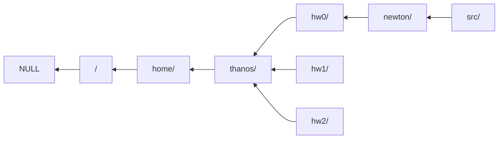
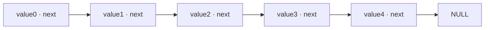
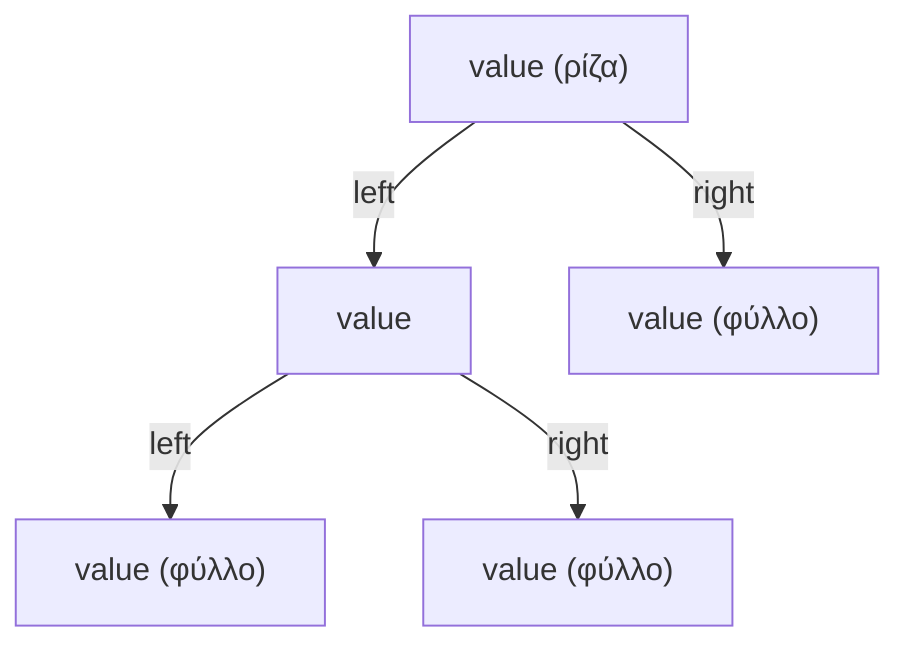

# Κεφάλαιο 20: Προχωρημένες Δομές

<!--  -->

> **Στόχοι:** μετά από αυτό το κεφάλαιο θα μπορείτε να δηλώνετε πεδία bit σε δομές
> και να προβλέπετε το μέγεθος και τις τιμές τους· να εξηγείτε πώς τα μέλη μιας
> ένωσης (union) μοιράζονται την ίδια μνήμη και πόσο μεγάλη είναι μια ένωση· να
> ορίζετε απαριθμήσεις (enum) και να ξέρετε τι τιμές παίρνουν οι σταθερές τους· και
> να γράφετε αυτοαναφορικές δομές, τη βάση για συνδεδεμένες λίστες και δυαδικά
> δέντρα.
>
> **Προαπαιτούμενα:** [Κεφάλαιο 19](../19-structs/), [Κεφάλαιο 12](../12-pointers-arrays/),
> [Κεφάλαιο 2](../02-memory-variables/)
>
> **Χρόνος μελέτης:** ~2 ώρες

## Σύνοψη

Η διάλεξη συνεχίζει τις δομές ([Κεφάλαιο 19](../19-structs/)) με τέσσερα εργαλεία
που χτίζουν πάνω τους. Τα **πεδία bit** δίνουν σε ένα μέλος δομής συγκεκριμένο
πλήθος bits, για να χωρέσουν πολλές μικρές τιμές σε λίγα bytes. Οι **ενώσεις**
μοιάζουν με δομές, αλλά όλα τα μέλη τους μοιράζονται την ίδια μνήμη. Οι
**απαριθμήσεις** δίνουν ονόματα σε ακέραιες σταθερές. Τέλος, οι **αυτοαναφορικές
δομές** περιέχουν δείκτες σε δομές του ίδιου τύπου· με αυτές φτιάχνουμε αλυσίδες και
ιεραρχίες δεδομένων, όπως οι συνδεδεμένες λίστες και τα δυαδικά δέντρα που θα
δουλέψουμε στα επόμενα κεφάλαια.

## Θεωρία

<a id="s20-1"></a><a id="πεδία-bit"></a>

### §20.1 Πεδία bit

Ένα μέλος δομής μπορεί να δηλωθεί ώστε να πιάνει στη μνήμη **συγκεκριμένο αριθμό
από bits** αντί για ολόκληρα bytes. Αυτό είναι ένα **πεδίο bit (bit field)**, και
γράφεται με άνω-κάτω τελεία και το πλήθος των bits μετά το όνομα του μέλους:

```text
struct όνομα {
  τύπος1 πεδίο1 : αριθμός_bits1;
  τύπος2 πεδίο2 : αριθμός_bits2;
  ...
};
```

Ο λόγος ύπαρξης είναι η **εξοικονόμηση μνήμης**. Οι μεταγλωττιστές συνήθως δέχονται
για πεδία bit τους τύπους `int`, `long` και `char` (και τις `unsigned` εκδοχές τους).
Για να διαλέξετε το πλήθος των bits, σκεφτείτε πόσες διαφορετικές τιμές πρέπει να
χωρέσει το πεδίο: με $n$ bits αναπαριστάτε $2^n$ τιμές
([Κεφάλαιο 2](../02-memory-variables/)). Στο παράδειγμα της διάλεξης:

```c
struct student_status {
  int registered : 1;  /* εγγεγραμμένος ή όχι: 2 τιμές, 1 bit */
  int year : 3;        /* έτος σπουδών */
  int grade : 4;       /* βαθμός 0-10: 11 τιμές, 4 bits αρκούν */
};
```

<a id="s20-2"></a><a id="αναπαράσταση-πεδίων-bit-στη-μνήμη"></a>

### §20.2 Αναπαράσταση πεδίων bit στη μνήμη

Χωρίς πεδία bit, μια δομή με τρία μέλη `char` πιάνει 3 bytes, ένα για κάθε μέλος.
Με `char registered : 1; char year : 3; char grade : 4;` τα τρία μέλη χρειάζονται
μαζί $1 + 3 + 4 = 8$ bits, οπότε ο μεταγλωττιστής τα **πακετάρει σε ένα byte** και
το `sizeof` της δομής γίνεται 1. Με τιμές `registered = 1`, `year = 1`, `grade = 10`
το byte περιέχει τα κομμάτια `1`, `001` και `1010`:

| Πεδίο | `registered` | `year` | `grade` |
| --- | --- | --- | --- |
| Bits | 1 | 3 | 4 |
| Τιμή (δυαδικά) | `1` | `001` | `1010` |

Με τύπο `int` αντί για `char` τα πεδία πακετάρονται σε μία «μονάδα» μεγέθους `int`,
οπότε το `sizeof` βγαίνει 4 αντί για 12 που θα έπιαναν τρία κανονικά `int`. Το ποια
ακριβώς bits του byte παίρνει κάθε πεδίο (από τα αριστερά ή από τα δεξιά) το
αποφασίζει ο μεταγλωττιστής· δεν πρέπει να βασίζεστε σε αυτό.

<a id="s20-3"></a><a id="εύρος-τιμών-και-ανάθεση-σε-πεδία-bit"></a>

### §20.3 Εύρος τιμών και ανάθεση σε πεδία bit

Στα πεδία bit αναθέτουμε και διαβάζουμε με την τελεία, όπως σε κάθε μέλος δομής
(`st.year = 2;`). Ένα `unsigned` πεδίο $n$ bits κρατά μόνο τιμές από 0 έως
$2^n - 1$. Αν του αναθέσετε κάτι μεγαλύτερο, κρατιούνται μόνο τα $n$ χαμηλά bits,
δηλαδή η τιμή **modulo $2^n$**, χωρίς κανένα μήνυμα λάθους. Για το `year` των 3 bits
το μέγιστο είναι $2^3 - 1 = 7$, και το `st.year = 2; st.year += 7;` δίνει
$(2 + 7) \bmod 8 = 1$. Είναι η ίδια υπερχείλιση που είδαμε στους ακεραίους
([Κεφάλαιο 2](../02-memory-variables/)), μόνο που με λίγα bits συμβαίνει πολύ πιο
εύκολα: όταν χρησιμοποιείτε πεδία bit, βεβαιωθείτε ότι κάθε τιμή που μπορεί να πάρει
το πεδίο χωράει.

<a id="s20-4"></a><a id="περιορισμοί-των-πεδίων-bit"></a>

### §20.4 Περιορισμοί των πεδίων bit

Ένα πεδίο bit δεν πιάνει ολόκληρα bytes, άρα δεν έχει δικό του μέγεθος ούτε δική του
διεύθυνση. Γι' αυτό:

1. **Δεν παίρνουμε το `sizeof` ενός πεδίου bit.** Ο gcc απαντά
   `error: 'sizeof' applied to a bit-field`.
2. **Δεν παίρνουμε τη διεύθυνση ενός πεδίου bit** με `&`. Ο gcc απαντά
   `error: cannot take address of bit-field 'year'`. Κατά συνέπεια δεν μπορείτε να
   δώσετε `&st.year` στη `scanf`.
3. Μπορούν να οδηγήσουν σε **προβλήματα απόδοσης** (ο επεξεργαστής χρειάζεται επιπλέον
   πράξεις για να απομονώσει τα bits), **δυσκολία ανάγνωσης** και **προβλήματα
   συμβατότητας** (η διάταξη αλλάζει από μεταγλωττιστή σε μεταγλωττιστή). Η σύσταση
   της διάλεξης: τα αποφεύγουμε ή τα χρησιμοποιούμε με φειδώ.

<a id="s20-5"></a><a id="ενώσεις"></a>

### §20.5 Ενώσεις

Η **ένωση (union)** μοιάζει με δομή, με μία διαφορά: τα μέλη της **μοιράζονται την
ίδια μνήμη**. Σε μια δομή κάθε μέλος έχει τον δικό του χώρο, το ένα μετά το άλλο· σε
μια ένωση όλα τα μέλη ξεκινούν από την ίδια διεύθυνση. Η κοινή μνήμη επιτρέπει
**εξοικονόμηση χώρου**, με το τίμημα ότι μια γραφή σε ένα μέλος αλλάζει και τα
υπόλοιπα. Γι' αυτό σε μια μεταβλητή τύπου ένωσης συνήθως έχει νόημα να
χρησιμοποιούμε **μόνο ένα** από τα μέλη της κάθε φορά. Η δήλωση είναι ίδια με της
δομής, με τη λέξη-κλειδί `union`:

```c
union anything {
  char c;
  int i;
  float f;
  double d;
};
```

Στα μέλη αναφερόμαστε με `.` (ή με `->` μέσω δείκτη), όπως στις δομές.

<a id="s20-6"></a><a id="μέγεθος-και-κοινή-μνήμη-της-ένωσης"></a>

### §20.6 Μέγεθος και κοινή μνήμη της ένωσης

Το **μέγεθος μιας ένωσης** είναι το μέγεθος του **μεγαλύτερου** μέλους της. Για την
`union anything`, με `sizeof(double) == 8`, το `sizeof` είναι 8, ενώ μια δομή με τα
ίδια μέλη θα έπιανε τουλάχιστον $1 + 4 + 4 + 8 = 17$ bytes. Όλα τα μέλη ξεκινούν
από το πρώτο byte:

| Byte | 0 | 1 | 2 | 3 | 4 | 5 | 6 | 7 |
| --- | --- | --- | --- | --- | --- | --- | --- | --- |
| `c` | ✓ | | | | | | | |
| `i`, `f` | ✓ | ✓ | ✓ | ✓ | | | | |
| `d` | ✓ | ✓ | ✓ | ✓ | ✓ | ✓ | ✓ | ✓ |

Διαλέγοντας διαφορετικό μέλος, διαλέγουμε **άλλον τρόπο ανάγνωσης των ίδιων bytes**.
Αν γράψετε `a1.i = 0x42` και διαβάσετε `a1.c`, παίρνετε το byte 0 του ακεραίου· σε
μηχάνημα little-endian ([Κεφάλαιο 12](../12-pointers-arrays/)) αυτό είναι το λιγότερο
σημαντικό byte, `0x42`, δηλαδή ο χαρακτήρας `'B'`.

<a id="s20-7"></a><a id="απαριθμήσεις"></a>

### §20.7 Απαριθμήσεις

Ο **τύπος απαρίθμησης (enumeration type)** `enum` ορίζει ένα σύνολο ακεραίων με
συγκεκριμένα ονόματα και σταθερές τιμές:

```text
enum όνομα { επιλογή1, επιλογή2, ... };
```

Το `όνομα` είναι το όνομα της απαρίθμησης, και οι επιλογές είναι οι **σταθερές
απαρίθμησης (enumeration constants)** που την αποτελούν. Οι κανόνες για τις τιμές
τους είναι δύο:

- Η πρώτη σταθερά **αρχικοποιείται στο 0**, εκτός αν της δοθεί συγκεκριμένη τιμή.
- Κάθε σταθερά χωρίς ρητή τιμή παίρνει την τιμή της **προηγούμενης σταθεράς αυξημένη
  κατά 1**.

Έτσι στο `enum weekday {Mon, Tue, Wed, Thu, Fri, Sat, Sun};` είναι `Mon == 0` έως
`Sun == 6`, ενώ στο `enum weekday {Mon = 1, Tue, ...};` είναι `Mon == 1` έως
`Sun == 7`. Μια μεταβλητή δηλώνεται `enum weekday day1 = Mon;` και συμπεριφέρεται
σαν ακέραιος: τυπώνεται με `%d`, συγκρίνεται και αυξάνεται με `++`. Οι σημειώσεις
παρατηρούν ότι οι απαριθμήσεις κάνουν ό,τι και ένα `#define` για κάθε σταθερά
([Κεφάλαιο 15](../15-complexity-preprocessor/)), μόνο που τις διαχειρίζεται ο
μεταγλωττιστής και όχι ο προεπεξεργαστής.

<a id="s20-8"></a><a id="αυτοαναφορά"></a>

### §20.8 Αυτοαναφορά

**Αυτοαναφορά (self-reference)** είναι όταν κάτι αναφέρεται στον εαυτό του. Η
διάλεξη τη συστήνει με το παράδοξο του Επιμενίδη (6ος αιώνας π.Χ.): «Αυτή η πρόταση
είναι ψευδής». Στον προγραμματισμό την έχουμε ήδη συναντήσει στην αναδρομή
([Κεφάλαιο 11](../11-pointers-recursion/)), όπου μια συνάρτηση καλεί τον εαυτό της.
Εδώ τη συναντάμε στα δεδομένα: μια δομή που περιγράφεται με τη βοήθεια του εαυτού
της.

<a id="s20-9"></a><a id="αυτοαναφορικές-δομές"></a>

### §20.9 Αυτοαναφορικές δομές

Τα μέλη μιας δομής μπορούν να είναι οποιουδήποτε τύπου, **ακόμα και δείκτες σε δομές
του ίδιου τύπου**. Μια τέτοια δομή λέγεται **αυτοαναφορική δομή (self-referential
struct)**. Το κίνητρο της διάλεξης: θέλουμε να αναπαραστήσουμε έναν φάκελο σε ένα
σύστημα αρχείων. Κάθε φάκελος έχει ένα όνομα και βρίσκεται μέσα σε έναν άλλο,
**γονικό (parent)** φάκελο· μόνο ο αρχικός φάκελος, η ρίζα `/`, δεν έχει γονέα.

```c
struct folder {
  char name[128];          /* κάθε φάκελος έχει ένα όνομα */
  struct folder *parent;   /* και δείκτη στον γονικό φάκελο */
};
```

Το μέλος πρέπει να είναι **δείκτης**. Μια δομή δεν μπορεί να περιέχει ολόκληρη
δομή του εαυτού της (`struct folder parent;`), γιατί τότε θα περιείχε ένα αντίγραφο
του εαυτού της, που θα περιείχε άλλο αντίγραφο, επ' άπειρον. Ένας δείκτης έχει
σταθερό μέγεθος, όποιον τύπο κι αν δείχνει. Η ρίζα, που δεν έχει γονέα, έχει
`parent = NULL`. Από κάθε φάκελο, ακολουθώντας τους δείκτες `parent`, φτάνουμε
πάντα στη ρίζα:



*Σχήμα: κάθε φάκελος δείχνει με το `parent` στον γονικό του· η ρίζα `/` δείχνει στο `NULL`.*

Μια δομή μπορεί να έχει και **πολλούς** δείκτες στον ίδιο τύπο. Για ένα
γενεαλογικό δέντρο κάθε άτομο δείχνει στους δύο γονείς του:

```c
struct person {
  char name[128];
  struct person *parent1;
  struct person *parent2;
};
```

Με ένα `typedef` ([Κεφάλαιο 19](../19-structs/)) γράφουμε
`typedef struct folder { ... } Folder;`. Μέσα στο σώμα της δομής το νέο όνομα
`Folder` δεν υπάρχει ακόμα, γι' αυτό ο δείκτης γράφεται `struct folder *parent`.

<a id="s20-10"></a><a id="απλά-συνδεδεμένη-λίστα"></a>

### §20.10 Απλά συνδεδεμένη λίστα

Αν ζωγραφίσουμε τους φακέλους από το `newton/` προς τη ρίζα, η πραγματική διάταξη
στη μνήμη μπορεί να είναι περίπλοκη (οι δομές κάθονται όπου τις έβαλε ο
μεταγλωττιστής), αλλά σε **αφηρημένη (abstract)** μορφή είναι μια αλυσίδα: κάθε
στοιχείο δείχνει στο επόμενο και το τελευταίο στο `NULL`. Αυτή η οργάνωση λέγεται
**απλά συνδεδεμένη λίστα (singly linked list)**: ένας τύπος δεδομένων όπου κάθε
στοιχείο **δείχνει (links)** στο επόμενο και το τελευταίο δείχνει στο `NULL`. Στη
γενική μορφή κάθε **κόμβος (node)** κρατά μια τιμή και τον δείκτη `next`:

```c
struct listnode {
  int value;
  struct listnode *next;
};
```



*Σχήμα: απλά συνδεδεμένη λίστα μήκους 5.*

Το **μήκος λίστας (list length)** είναι ο αριθμός των στοιχείων που περιέχει (5
παραπάνω). Η λίστα μοιάζει με πίνακα, αλλά έχει βασικές διαφορές, που θα δούμε στο
[Κεφάλαιο 21](../21-lists-trees/): συνήθως αποθηκεύεται **εξ ολοκλήρου δυναμικά, στον
σωρό** ([Κεφάλαιο 13](../13-memory/)), με μία `malloc` ανά κόμβο, άρα οι κόμβοι δεν
είναι συνεχόμενοι στη μνήμη.

<a id="s20-11"></a><a id="δυαδικό-δέντρο"></a>

### §20.11 Δυαδικό δέντρο

Το γενεαλογικό δέντρο της `struct person`, με δύο δείκτες ανά κόμβο, οδηγεί σε μια
άλλη οργάνωση. Το **δυαδικό δέντρο (binary tree)** είναι ένας τύπος δεδομένων που
οργανώνει τα δεδομένα σε δενδρική διάταξη, όπου κάθε **κόμβος (node)** έχει από 0
έως 2 **κόμβους-παιδιά (children)**, το αριστερό και το δεξί:

```c
struct treenode {
  int value;
  struct treenode *left;
  struct treenode *right;
};
```



*Σχήμα: δυαδικό δέντρο με βάθος 2· οι δείκτες των φύλλων είναι `NULL`.*

Οι βασικοί όροι:

- **Ρίζα (root)**: ο πρώτος κόμβος του δέντρου, που δεν είναι παιδί κανενός.
- **Φύλλα (leaves)**: οι κόμβοι χωρίς παιδιά (και τα δύο `left`, `right` είναι
  `NULL`).
- **Βάθος (depth)** του δέντρου: ο μέγιστος αριθμός συνδέσμων από τη ρίζα μέχρι τα
  φύλλα (2 στο σχήμα).

Τα δυαδικά δέντρα έχουν εφαρμογές από βάσεις δεδομένων και αναζήτηση μέχρι
μεταγλωττιστές, και από συμπίεση δεδομένων μέχρι κρυπτογραφία: όπου χρειάζεται
αναπαράσταση γνώσης. Θα τα δουλέψουμε στα [Κεφάλαια 21](../21-lists-trees/) και
[22](../22-trees/).

<a id="s20-12"></a><a id="γράφοι-και-συστήματα-αρχείων"></a>

### §20.12 Γράφοι και συστήματα αρχείων

Η διάλεξη κλείνει με δύο ανοιχτά ερωτήματα σχεδίασης, χωρίς έτοιμη απάντηση στις
διαφάνειες. Πρώτο, πώς να αναπαραστήσουμε με αυτοαναφορικές δομές έναν χάρτη σε
μορφή **γράφου (graph)**: πόλεις A, B, C, D, όπου κάθε ζεύγος συνδέεται με δρόμο
που έχει μια απόσταση (A–B 20, A–C 42, A–D 35, B–C 30, B–D 34, C–D 12). Δεύτερο, πώς
να αναπαραστήσουμε ένα σύστημα αρχείων ώστε από κάθε φάκελο να βρίσκουμε **άμεσα**
και τους υποφακέλους του, όχι μόνο τον γονικό. Και τα δύο είναι ασκήσεις (δείτε
«Ασκήσεις»): σκεφτείτε ποιους δείκτες πρέπει να κρατά κάθε κόμβος, και τι κάνετε
όταν το πλήθος τους δεν είναι σταθερό.

## Παραδείγματα

<a id="s20-13"></a><a id="το-μέγεθος-μιας-δομής-με-πεδία-bit"></a>

### §20.13 Το μέγεθος μιας δομής με πεδία bit

Εφαρμόζει τις ενότητες «Πεδία bit» και «Αναπαράσταση πεδίων bit στη μνήμη». Η
διάλεξη τυπώνει το `sizeof(struct student_status)` για τρεις εκδοχές της δομής:

```c
#include <stdio.h>

struct status_int  { int  registered : 1; int  year : 3; int  grade : 4; };
struct status_bits { char registered : 1; char year : 3; char grade : 4; };
struct status_char { char registered;     char year;     char grade;     };

int main() {
  printf("%zu\n", sizeof(struct status_int));
  printf("%zu\n", sizeof(struct status_bits));
  printf("%zu\n", sizeof(struct status_char));
  return 0;
}
```

Στις διαφάνειες κάθε εκδοχή λέγεται `struct student_status` και είναι ξεχωριστό
πρόγραμμα (`./bitfields`, `./bitfields2`)· εδώ τις βάλαμε μαζί με διαφορετικά ονόματα.
Τα αποτελέσματα:

```text
$ ./bitfields
4
$ ./bitfields2
1
```

και 3 για τη δομή χωρίς πεδία bit. Τα 8 bits των πεδίων χωράνε σε μία μονάδα του
τύπου τους: ένα `int` (4 bytes) στην πρώτη περίπτωση, ένα `char` (1 byte) στη
δεύτερη. Χωρίς πεδία bit κάθε `char` πιάνει το δικό του byte.

<a id="s20-14"></a><a id="ανάθεση-σε-πεδίο-bit-2--7--1"></a>

### §20.14 Ανάθεση σε πεδίο bit: 2 + 7 = 1

Εφαρμόζει την ενότητα «Εύρος τιμών και ανάθεση σε πεδία bit». Η διάλεξη ρωτά τι
τυπώνει το πρόγραμμα:

```c
#include <stdio.h>

typedef struct {
  unsigned char registered : 1;
  unsigned char year : 3;
  unsigned char grade : 4;
} status;

int main() {
  status st = {1, 1, 10};
  printf("Status: %u %u %u\n", st.registered, st.year, st.grade);
  st.year = 2;
  printf("Status: %u %u %u\n", st.registered, st.year, st.grade);
  st.year += 7;
  printf("Status: %u %u %u\n", st.registered, st.year, st.grade);
  return 0;
}
```

```text
$ ./bitfields3
Status: 1 1 10
Status: 1 2 10
Status: 1 1 10
```

Η αρχικοποίηση `{1, 1, 10}` γεμίζει τα πεδία με τη σειρά δήλωσης, όπως σε κάθε
δομή. Το ενδιαφέρον είναι η τρίτη γραμμή: το `year` έχει μόνο 3 bits, άρα κρατά
τιμές 0 έως 7. Το $2 + 7 = 9$ είναι `1001` στο δυαδικό· κρατιούνται τα 3 χαμηλά bits,
`001`, δηλαδή $9 \bmod 8 = 1$. Η C δεν δίνει κανένα λάθος: «θα υποστούμε τις
συνέπειες».

<a id="s20-15"></a><a id="μια-ένωση-με-τέσσερα-πρόσωπα"></a>

### §20.15 Μια ένωση με τέσσερα πρόσωπα

Εφαρμόζει τις ενότητες «Ενώσεις» και «Μέγεθος και κοινή μνήμη της ένωσης»:

```c
#include <stdio.h>

union anything {
  char c;  int i;  float f;  double d;
};

int main() {
  union anything a1;
  a1.i = 0x42;
  printf("%d %c\n", a1.i, a1.c);
  a1.c = 'C';
  printf("%d %c\n", a1.i, a1.c);
  printf("%zu\n", sizeof(a1));
  return 0;
}
```

```text
$ ./union
66 B
67 C
8
```

- Το `a1.i = 0x42` γράφει τον ακέραιο 66 στα bytes 0–3. Το `a1.c` διαβάζει το byte
  0, που (σε little-endian μηχάνημα) είναι το `0x42`, ο χαρακτήρας `'B'`.
- Το `a1.c = 'C'` γράφει 67 (`0x43`) μόνο στο byte 0. Τα bytes 1–3 του `i` ήταν ήδη
  0, οπότε τώρα και το `a1.i` διαβάζεται 67.
- Το `sizeof(a1)` είναι 8, όσο το μεγαλύτερο μέλος, το `double`.

<a id="s20-16"></a><a id="απαρίθμηση-ημερών"></a>

### §20.16 Απαρίθμηση ημερών

Εφαρμόζει την ενότητα «Απαριθμήσεις». Τι τυπώνει το πρόγραμμα;

```c
#include <stdio.h>

enum weekday {Mon, Tue, Wed, Thu, Fri, Sat, Sun};

int main() {
  enum weekday day1 = Mon, day2;
  day2 = Fri;
  printf("%d %d\n", day1, day2);
  return 0;
}
```

```text
$ ./enum1
0 4
```

Η πρώτη σταθερά, `Mon`, είναι 0 και κάθε επόμενη ένα παραπάνω, άρα `Fri` είναι 4.

<a id="s20-17"></a><a id="επανάληψη-πάνω-σε-απαρίθμηση"></a>

### §20.17 Επανάληψη πάνω σε απαρίθμηση

Με ρητή τιμή στην πρώτη σταθερά, οι ημέρες αριθμούνται από το 1. Μια μεταβλητή
`enum` μπορεί να είναι μετρητής βρόχου:

```c
#include <stdio.h>

enum weekday {Mon = 1, Tue, Wed, Thu, Fri, Sat, Sun};

int main() {
  for (enum weekday day = Mon; day <= Sun; day++) {
    if (day == Mon || day == Fri)
      printf("We have class on day # %d of the week\n", day);
  }
  return 0;
}
```

```text
$ ./enum2
We have class on day # 1 of the week
We have class on day # 5 of the week
```

Ο βρόχος πάει από το 1 (`Mon`) έως το 7 (`Sun`)· τυπώνει μόνο για Δευτέρα (1) και
Παρασκευή (5). Τα ονόματα κάνουν τον κώδικα πιο ευανάγνωστο από τα σκέτα 1 και 5.

<a id="s20-18"></a><a id="ακολουθώντας-τον-γονικό-φάκελο"></a>

### §20.18 Ακολουθώντας τον γονικό φάκελο

Εφαρμόζει την ενότητα «Αυτοαναφορικές δομές». Οι φάκελοι είναι τοπικές μεταβλητές
και ο καθένας δείχνει στη διεύθυνση του γονικού του:

```c
#include <stdio.h>

typedef struct folder {
  char name[128];
  struct folder *parent;
} Folder;

int main() {
  Folder root = {"/", NULL};
  Folder home = {"home/", &root};
  Folder user = {"thanos/", &home};
  Folder hw0 = {"hw0/", &user}, hw1 = {"hw1/", &user};
  Folder newton = {"newton/", &hw0};
  printf("%s -> %s -> %s\n", newton.name, newton.parent->name,
         newton.parent->parent->name);
  return 0;
}
```

```text
$ ./self
newton/ -> hw0/ -> thanos/
```

Το `newton.parent` είναι δείκτης, άρα στο μέλος του γονέα φτάνουμε με `->`
(`newton.parent->name`). Αλυσιδωτά, `newton.parent->parent` είναι ο δείκτης στον
`user`, και το `->name` του δίνει `thanos/`. Ο `hw1` δηλώνεται αλλά δεν
χρησιμοποιείται (ο gcc με `-Wall` θα προειδοποιήσει για αχρησιμοποίητη μεταβλητή).

<a id="s20-19"></a><a id="διάσχιση-μέχρι-τη-ρίζα"></a>

### §20.19 Διάσχιση μέχρι τη ρίζα

Στην ίδια `main`, με τις ίδιες δηλώσεις φακέλων, η διάλεξη αντικαθιστά το `printf`
με έναν βρόχο που ακολουθεί τους δείκτες μέχρι το `NULL`:

```c
for (Folder *iterator = &newton; iterator; iterator = iterator->parent)
  printf("folder: %s\n", iterator->name);
```

```text
$ ./self2
folder: newton/
folder: hw0/
folder: thanos/
folder: home/
folder: /
```

Ο δείκτης `iterator` ξεκινά από τον `newton` και σε κάθε βήμα γίνεται ο γονέας του.
Η συνθήκη `iterator` είναι ψευδής μόνο όταν ο δείκτης γίνει `NULL`, δηλαδή μετά τη
ρίζα. Στη μνήμη οι πέντε δομές κάθονται στη στοίβα η μία δίπλα στην άλλη με
οποιαδήποτε σειρά διαλέξει ο μεταγλωττιστής (στη διαφάνεια 37 π.χ. ο `hw0` είναι
πάνω από τον `home`)· οι δείκτες τις συνδέουν ανεξάρτητα από τη θέση τους. Αυτό
ακριβώς το μοτίβο, «ξεκίνα από την αρχή, ακολούθα το `next` μέχρι το `NULL`», είναι η
διάσχιση μιας συνδεδεμένης λίστας ([Κεφάλαιο 21](../21-lists-trees/)).

## Κύρια σημεία

1. Ένα πεδίο bit (`τύπος όνομα : bits;`) δίνει σε ένα μέλος δομής συγκεκριμένο
   αριθμό bits για να εξοικονομήσουμε μνήμη· τα πεδία πακετάρονται σε μονάδες του
   τύπου τους (τρία πεδία `char` με 8 bits συνολικά πιάνουν 1 byte).
2. Ένα `unsigned` πεδίο $n$ bits κρατά τιμές 0 έως $2^n - 1$· μεγαλύτερες τιμές
   αποθηκεύονται modulo $2^n$ χωρίς προειδοποίηση.
3. Δεν μπορούμε να πάρουμε το `sizeof` ή τη διεύθυνση (`&`) ενός πεδίου bit, και τα
   πεδία bit έχουν κόστος σε απόδοση, αναγνωσιμότητα και συμβατότητα· τα
   χρησιμοποιούμε με φειδώ.
4. Σε μια ένωση (`union`) όλα τα μέλη μοιράζονται την ίδια μνήμη και κάθε μέλος
   είναι άλλος τρόπος ανάγνωσης των ίδιων bytes· συνήθως χρησιμοποιούμε ένα μέλος
   κάθε φορά, και το μέγεθος της ένωσης είναι του μεγαλύτερου μέλους.
5. Μια απαρίθμηση (`enum`) δίνει ονόματα σε ακέραιες σταθερές: η πρώτη είναι 0
   εκτός αν δοθεί τιμή, και κάθε επόμενη χωρίς τιμή είναι η προηγούμενη συν 1.
6. Μια αυτοαναφορική δομή έχει μέλη που είναι δείκτες σε δομές του ίδιου τύπου
   (δείκτες, όχι ολόκληρες δομές)· ακολουθώντας τους με `->` μέχρι το `NULL`
   διασχίζουμε μια αλυσίδα δεδομένων.
7. Η απλά συνδεδεμένη λίστα είναι αλυσίδα κόμβων όπου ο καθένας δείχνει στον
   επόμενο και ο τελευταίος στο `NULL`· συνήθως αποθηκεύεται δυναμικά στον σωρό.
8. Το δυαδικό δέντρο έχει κόμβους με 0 έως 2 παιδιά (`left`, `right`)· ξεκινά από
   τη ρίζα, καταλήγει στα φύλλα, και το βάθος του είναι ο μέγιστος αριθμός
   συνδέσμων από τη ρίζα ως ένα φύλλο.

## Ορολογία

| Ελληνικά | English | Σύντομος ορισμός |
| --- | --- | --- |
| πεδίο bit | bit field | Μέλος δομής με δηλωμένο πλήθος bits (`int year : 3;`). |
| ένωση | union | Τύπος σαν τη δομή, όπου όλα τα μέλη μοιράζονται την ίδια μνήμη. |
| απαρίθμηση | enumeration (`enum`) | Τύπος με ονομασμένες ακέραιες σταθερές. |
| σταθερά απαρίθμησης | enumeration constant | Ένα από τα ονόματα μιας απαρίθμησης, π.χ. `Mon`. |
| αυτοαναφορά | self-reference | Όταν κάτι αναφέρεται στον εαυτό του. |
| αυτοαναφορική δομή | self-referential struct | Δομή με μέλος-δείκτη σε δομή του ίδιου τύπου. |
| γονικός φάκελος | parent folder | Ο φάκελος που περιέχει έναν άλλο φάκελο. |
| απλά συνδεδεμένη λίστα | singly linked list | Αλυσίδα κόμβων, ο καθένας δείχνει στον επόμενο, ο τελευταίος στο `NULL`. |
| κόμβος | node | Ένα στοιχείο λίστας ή δέντρου (μια δομή). |
| μήκος λίστας | list length | Ο αριθμός των στοιχείων της λίστας. |
| δυαδικό δέντρο | binary tree | Δενδρική διάταξη κόμβων με 0 έως 2 παιδιά ο καθένας. |
| ρίζα | root | Ο πρώτος κόμβος ενός δέντρου. |
| φύλλο | leaf | Κόμβος χωρίς παιδιά. |
| βάθος | depth | Ο μέγιστος αριθμός συνδέσμων από τη ρίζα ως ένα φύλλο. |
| γράφος | graph | Κόμβοι συνδεδεμένοι με ακμές, π.χ. πόλεις και δρόμοι. |

## Διάβασμα

- **Διαφάνειες:** [Διάλεξη 20](https://github.com/progintro/progintro.github.io/releases/download/2025/lec20.pdf),
  σελ. 1–49: πεδία bit 5–15· ενώσεις 16–22· απαριθμήσεις 23–28· αυτοαναφορά και
  αυτοαναφορικές δομές 29–37, 42–43· συνδεδεμένη λίστα 38–41· δυαδικό δέντρο 44–45·
  ανοιχτά ερωτήματα (γράφος, σύστημα αρχείων) 46–47.
- **Σημειώσεις:** η διάλεξη προτείνει τις σελ. 108 και 120–135 των διαφανειών του κ.
  Σταματόπουλου:
  - [Κεφάλαιο 7: Απαριθμήσεις, δομές και ενώσεις](https://progintro.github.io/notes/chapters/07-structs/):
    «Απαριθμήσεις» (K04, σελ. 108), «Αυτο-αναφορικές δομές» (120–125), «Δημιουργία
    νέων ονομάτων τύπων» (126), «Ενώσεις και πεδία bit» (127).
  - [Κεφάλαιο 8: Λίστες και δυαδικά δέντρα](https://progintro.github.io/notes/chapters/08-lists-trees/):
    «Διαχείριση συνδεδεμένων λιστών» (K04, σελ. 128–131), «Διαχείριση δυαδικών
    δέντρων» (132–135), για την επόμενη διάλεξη.
- **Εργαστήριο:** [Εργαστήριο 9](https://progintro.github.io/lab-material/labs/lab09/):
  ασκήσεις `grades.c` (αυτοαναφορική δομή λίστας) και `tree.c` (αυτοαναφορική δομή
  δυαδικού δέντρου).
- **Άλλα:** [Bit fields](https://www.geeksforgeeks.org/bit-fields-c/) (GeeksforGeeks) και
  [reference](https://en.cppreference.com/w/cpp/language/bit_field) (cppreference)·
  [Unions](https://en.cppreference.com/w/c/language/union) (cppreference)·
  [Enums](https://www.geeksforgeeks.org/enumeration-enum-c/) (GeeksforGeeks)·
  [Linked list](https://en.wikipedia.org/wiki/Linked_list) και
  [Binary tree](https://en.wikipedia.org/wiki/Binary_tree) (Wikipedia)·
  [Self-reference](https://en.wikipedia.org/wiki/Self-reference) και
  [Epimenides paradox](https://en.wikipedia.org/wiki/Epimenides_paradox) (Wikipedia).

## Συχνά λάθη

- **Πεδίο bit πολύ μικρό για τις τιμές του.** Με `unsigned char year : 3;` το
  `st.year = 9;` αποθηκεύει 1. Υπολογίστε τις τιμές που χρειάζεστε και δώστε
  $\lceil \log_2(\text{πλήθος τιμών}) \rceil$ bits.
- **`sizeof` ή `&` σε πεδίο bit.** `sizeof(st.year)` και `&st.year` δεν
  μεταγλωττίζονται (`'sizeof' applied to a bit-field`,
  `cannot take address of bit-field`). Διαβάστε σε μια κανονική μεταβλητή με `scanf`
  και μετά αναθέστε τη στο πεδίο.
- **Πεδίο bit 1 bit τύπου `int`.** Αν το `int` πεδίο θεωρηθεί προσημασμένο (όπως κάνει
  ο gcc), το `int registered : 1` κρατά 0 και -1, όχι 0 και 1. Για σημαίες
  χρησιμοποιήστε `unsigned` τύπο, όπως το πρόγραμμα `bitfields3`.
- **Χρήση πολλών μελών μιας ένωσης σαν να ήταν δομή.** Μετά το `a1.i = 1000; a1.c = 'x';`
  το `a1.i` δεν είναι πια 1000, γιατί το `c` έγραψε πάνω στο πρώτο byte του. Αν
  χρειάζεστε όλα τα μέλη ταυτόχρονα, θέλετε `struct`.
- **Ολόκληρη δομή αντί για δείκτη μέσα στον εαυτό της.** Το
  `struct folder { char name[128]; struct folder parent; };` δεν μεταγλωττίζεται
  (`field 'parent' has incomplete type`). Το μέλος πρέπει να είναι
  `struct folder *parent;`.
- **Χρήση του ονόματος του `typedef` μέσα στη δομή.** Στο
  `typedef struct folder { Folder *parent; } Folder;` το `Folder` δεν έχει ακόμα
  οριστεί (`unknown type name 'Folder'`). Μέσα στο σώμα γράψτε `struct folder *`.
- **`.` αντί για `->` σε δείκτη.** Το `newton.parent.name` δεν μεταγλωττίζεται, γιατί το
  `parent` είναι δείκτης· γράψτε `newton.parent->name`.
- **Ξεχασμένο `NULL` στο τέλος της αλυσίδας.** Αν η ρίζα δεν έχει `parent = NULL`, ο
  βρόχος `for (p = &newton; p; p = p->parent)` ακολουθεί σκουπίδια και καταλήγει σε
  `Segmentation fault`.

<!-- misconceptions -->

### Τι δυσκόλεψε την τάξη

Από τα Kahoot των διαλέξεων: οι ερωτήσεις όπου μια λάθος απάντηση μάζεψε πολλές ψήφους, με το ποσοστό σωστών απαντήσεων.

- **[Κ20.8](../../questions/kahoot/kahoot-union-size.md)** Μέγεθος ένωσης (36% σωστές): Το 22% επέλεξε `sizeof(double)`, θεωρώντας τον `double` το μεγαλύτερο πεδίο, ενώ ο πίνακας `name` πιάνει 20 bytes· και το 18% πρόσθεσε τα μεγέθη, όπως σε μια δομή.
- **[Κ20.7](../../questions/kahoot/kahoot-bitfield-limits.md)** Περιορισμοί πεδίων bit (44% σωστές): Το 26% επέλεξε μόνο το `sizeof`, χωρίς να δει ότι ένα πεδίο bit δεν έχει ούτε δική του διεύθυνση (δεν ξεκινάει απαραίτητα σε byte) ούτε χωράει τιμές πέρα από τα n bits του.
- **[Κ20.4](../../questions/kahoot/kahoot-self-referential-struct.md)** Αυτοαναφορική δομή (56% σωστές): Το 22% επέλεξε «περιέχει τον εαυτό της», κάτι αδύνατο: μια δομή που περιέχει αντίγραφο του εαυτού της θα είχε άπειρο μέγεθος.

<!-- /misconceptions -->

## Ερωτήσεις κατανόησης

- <a id="e20-1"></a>**[Ε20.1](#e20-1)** Πόσα bits χρειάζεται ένα πεδίο bit που κρατά τον μήνα (1–12);[^q1]
- <a id="e20-2"></a>**[Ε20.2](#e20-2)** Ένα `unsigned char x : 4;` έχει τιμή 12. Τι τιμή έχει μετά το `x += 5;`;[^q2]
- <a id="e20-3"></a>**[Ε20.3](#e20-3)** Γιατί δεν μπορείτε να γράψετε `scanf("%u", &st.year);` όταν το `year` είναι πεδίο
   bit;[^q3]
- <a id="e20-4"></a>**[Ε20.4](#e20-4)** Πόσο είναι το `sizeof` μιας `union` με μέλη `char`, `int` και `double`, και
   γιατί;[^q4]
- <a id="e20-5"></a>**[Ε20.5](#e20-5)** Στο `enum color {RED, GREEN = 5, BLUE};` τι τιμή έχει το `BLUE`;[^q5]
- <a id="e20-6"></a>**[Ε20.6](#e20-6)** Γιατί η `struct folder` περιέχει `struct folder *parent` και όχι
   `struct folder parent`;[^q6]
- <a id="e20-7"></a>**[Ε20.7](#e20-7)** Πώς καταλαβαίνει ένας βρόχος που ακολουθεί τους δείκτες `parent` ότι έφτασε στη
   ρίζα;[^q7]
- <a id="e20-8"></a>**[Ε20.8](#e20-8)** Πόσους δείκτες σε `struct person` χρειάζεται κάθε κόμβος γενεαλογικού δέντρου,
   και σε ποια δομή δεδομένων της διάλεξης μοιάζει αυτό;[^q8]

<!-- kahoot -->

### Kahoot από το αμφιθέατρο (Κ20.1–Κ20.8)

Ερωτήσεις που παίχτηκαν στις διαλέξεις, με το ποσοστό των φοιτητών που απάντησαν σωστά.

- <a id="k20-1"></a>**[Κ20.1](../../questions/kahoot/kahoot-node-binary-tree.md)** Κόμβος με left και right: 67% σωστές απαντήσεις
- <a id="k20-2"></a>**[Κ20.2](../../questions/kahoot/kahoot-union-purpose.md)** Σε τι χρησιμεύει η ένωση: 65% σωστές απαντήσεις
- <a id="k20-3"></a>**[Κ20.3](../../questions/kahoot/kahoot-struct-vs-union.md)** Δομή ή ένωση;: 63% σωστές απαντήσεις
- <a id="k20-4"></a>**[Κ20.4](../../questions/kahoot/kahoot-self-referential-struct.md)** Αυτοαναφορική δομή: 56% σωστές απαντήσεις
- <a id="k20-5"></a>**[Κ20.5](../../questions/kahoot/kahoot-node-linked-list.md)** Κόμβος με next: 52% σωστές απαντήσεις
- <a id="k20-6"></a>**[Κ20.6](../../questions/kahoot/kahoot-enum-values.md)** Τιμές απαρίθμησης: 48% σωστές απαντήσεις
- <a id="k20-7"></a>**[Κ20.7](../../questions/kahoot/kahoot-bitfield-limits.md)** Περιορισμοί πεδίων bit: 44% σωστές απαντήσεις
- <a id="k20-8"></a>**[Κ20.8](../../questions/kahoot/kahoot-union-size.md)** Μέγεθος ένωσης: 36% σωστές απαντήσεις

<!-- /kahoot -->

## Ασκήσεις

<!-- exercises -->

### Ζέσταμα: από τις διαφάνειες (Α20.1–Α20.12)

- <a id="a20-1"></a>**[Α20.1](../../questions/slides/slides-lec20-bitfield-sizeof.md)** Μέγεθος δομής με πεδία bit: Διάλεξη 20, διαφάνεια 7 · ★☆☆ · trace · `slides-lec20-bitfield-sizeof`
- <a id="a20-2"></a>**[Α20.2](../../questions/slides/slides-lec20-enum-loop.md)** Βρόχος με απαρίθμηση: Διάλεξη 20, διαφάνεια 27 · ★☆☆ · trace · `slides-lec20-enum-loop`
- <a id="a20-3"></a>**[Α20.3](../../questions/slides/slides-lec20-enum-values.md)** Τιμές απαρίθμησης: Διάλεξη 20, διαφάνεια 25 · ★☆☆ · trace · `slides-lec20-enum-values`
- <a id="a20-4"></a>**[Α20.4](../../questions/slides/slides-lec20-family-tree.md)** Γενεαλογικό δέντρο: Διάλεξη 20, διαφάνεια 43 · ★☆☆ · short-answer · `slides-lec20-family-tree`
- <a id="a20-5"></a>**[Α20.5](../../questions/slides/slides-lec20-folder-parent.md)** Γονικοί φάκελοι: Διάλεξη 20, διαφάνεια 33 · ★☆☆ · trace · `slides-lec20-folder-parent`
- <a id="a20-6"></a>**[Α20.6](../../questions/slides/slides-lec20-folder-struct.md)** Δομή για φάκελο: Διάλεξη 20, διαφάνεια 31 · ★☆☆ · short-answer · `slides-lec20-folder-struct`
- <a id="a20-7"></a>**[Α20.7](../../questions/slides/slides-lec20-list-layout.md)** Η διάταξη των φακέλων: Διάλεξη 20, διαφάνεια 38 · ★☆☆ · short-answer · `slides-lec20-list-layout`
- <a id="a20-8"></a>**[Α20.8](../../questions/slides/slides-lec20-bitfield-assign.md)** Ανάθεση σε πεδία bit: Διάλεξη 20, διαφάνεια 12 · ★★☆ · trace · `slides-lec20-bitfield-assign`
- <a id="a20-9"></a>**[Α20.9](../../questions/slides/slides-lec20-filesystem-children.md)** Σύστημα αρχείων με υποφακέλους: Διάλεξη 20, διαφάνεια 47 · ★★☆ · short-answer · `slides-lec20-filesystem-children`
- <a id="a20-10"></a>**[Α20.10](../../questions/slides/slides-lec20-folder-iterate.md)** Διάσχιση φακέλων: Διάλεξη 20, διαφάνεια 35 · ★★☆ · trace · `slides-lec20-folder-iterate`
- <a id="a20-11"></a>**[Α20.11](../../questions/slides/slides-lec20-union-size.md)** Χρήση ένωσης και μέγεθος: Διάλεξη 20, διαφάνεια 19 · ★★☆ · trace · `slides-lec20-union-size`
- <a id="a20-12"></a>**[Α20.12](../../questions/slides/slides-lec20-graph-map.md)** Χάρτης ως γράφος: Διάλεξη 20, διαφάνεια 46 · ★★★ · short-answer · `slides-lec20-graph-map`

### Σχετικές ασκήσεις από άλλα κεφάλαια

- **[Α22.20](../../questions/exams/exam-2026-jan-q4.md)** Διερμηνέας Αριθμητικών Εκφράσεων - eval: Εξέταση Ιανουαρίου 2026, Θέμα 4 · ★★☆ · programming · `exam-2026-jan-q4`

<!-- /exercises -->

[^q1]: 4 bits: οι 12 τιμές δεν χωράνε σε 3 bits ($2^3 = 8$), αλλά χωράνε σε 4 ($2^4 = 16$).
[^q2]: $(12 + 5) \bmod 16 = 1$: το πεδίο κρατά μόνο τα 4 χαμηλά bits του 17.
[^q3]: Δεν μπορούμε να πάρουμε τη διεύθυνση ενός πεδίου bit (`cannot take address of bit-field`). Διαβάστε σε κανονική μεταβλητή και αναθέστε.
[^q4]: 8, όσο το μεγαλύτερο μέλος (`double`), γιατί όλα τα μέλη μοιράζονται την ίδια μνήμη.
[^q5]: 6: το `BLUE` δεν έχει ρητή τιμή, οπότε παίρνει την προηγούμενη (`GREEN = 5`) συν 1.
[^q6]: Μια δομή δεν μπορεί να περιέχει αντίγραφο του εαυτού της (θα είχε άπειρο μέγεθος)· ένας δείκτης έχει σταθερό μέγεθος.
[^q7]: Η ρίζα έχει `parent = NULL`· ο βρόχος σταματά όταν ο δείκτης γίνει `NULL`.
[^q8]: Δύο (`parent1`, `parent2`)· η δομή μοιάζει με δυαδικό δέντρο, όπου κάθε κόμβος έχει έως δύο δείκτες προς άλλους κόμβους.

<!--  -->
