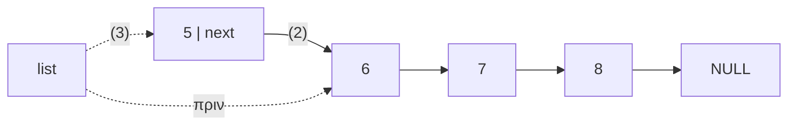
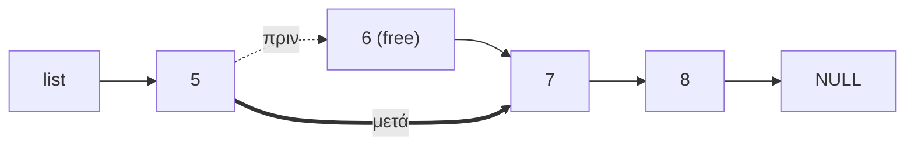
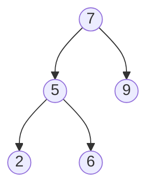

# Κεφάλαιο 21: Λίστες και Δέντρα

<!--  -->

> **Στόχοι:** μετά από αυτό το κεφάλαιο θα μπορείτε να ορίζετε απλά συνδεδεμένες
> λίστες και δυαδικά δέντρα με αυτοαναφορικές δομές· να γράφετε τις βασικές
> λειτουργίες τους (`is_empty`, `insert`, `print`, `length`, `find`, `delete`,
> `depth`)· να διασχίζετε ένα δέντρο pre-order, in-order, post-order και κατά πλάτος·
> να αναζητάτε σε δυαδικό δέντρο αναζήτησης· και να εκτιμάτε την πολυπλοκότητα
> χρόνου και χώρου κάθε λειτουργίας.
>
> **Προαπαιτούμενα:** [Κεφάλαιο 11](../11-pointers-recursion/),
> [Κεφάλαιο 13](../13-memory/), [Κεφάλαιο 20](../20-advanced-structs/)
>
> **Χρόνος μελέτης:** ~3 ώρες

## Σύνοψη

Οι αυτοαναφορικές δομές της προηγούμενης διάλεξης γίνονται εδώ πραγματικές δομές
δεδομένων. Η απλά συνδεδεμένη λίστα είναι μια αλυσίδα από κόμβους στον σωρό, όπου
κάθε κόμβος δείχνει στον επόμενο· σε αντίθεση με τον πίνακα, μεγαλώνει και
αναδιατάσσεται εύκολα, αλλά η πρόσβαση σε ένα στοιχείο κοστίζει γραμμικό χρόνο. Το
δυαδικό δέντρο δίνει σε κάθε κόμβο δύο δείκτες, αριστερό και δεξί, και οργανώνει τα
δεδομένα ιεραρχικά. Η διάλεξη υλοποιεί τις βασικές λειτουργίες και των δύο, κυρίως
αναδρομικά για τα δέντρα, παρουσιάζει τις διασχίσεις κατά βάθος (DFS) και κατά
πλάτος (BFS), και δείχνει πώς ένα δυαδικό δέντρο αναζήτησης κάνει την αναζήτηση
λογαριθμική. Είναι η βάση για τη διάλεξη 22 και για την Εργασία #2.

## Θεωρία

### Απλά συνδεδεμένη λίστα

Η **απλά συνδεδεμένη λίστα (single linked list)** είναι ένας τύπος δεδομένων όπου
κάθε στοιχείο δείχνει (links) στο επόμενο, και το τελευταίο δείχνει στο `NULL`.
Κάθε στοιχείο είναι ένας **κόμβος (node)**: μια αυτοαναφορική δομή
([Κεφάλαιο 20](../20-advanced-structs/)) με την τιμή και έναν δείκτη σε δομή του
ίδιου τύπου:

```c
struct listnode {
  int value;
  struct listnode * next;
};
```

Το πρώτο στοιχείο λέγεται **κεφαλή (head)** της λίστας και το τελευταίο (συνήθως)
**ουρά (tail)**. Το **μήκος λίστας (list length)** είναι ο αριθμός των στοιχείων
που περιέχει.


*Σχήμα: λίστα μήκους 5· η κεφαλή είναι το `value0`, η ουρά το `value4`.*

Η λίστα ως σύνολο αναπαριστάται από έναν δείκτη στην κεφαλή της, γι' αυτό η διάλεξη
ορίζει τον τύπο `List` ως **δείκτη** σε κόμβο:
`typedef struct listnode {int value; struct listnode * next;} * List;`. Η **κενή
λίστα** είναι απλώς ο δείκτης `NULL`. Οι κόμβοι δεν βρίσκονται σε συνεχόμενες θέσεις:
ο καθένας δεσμεύεται χωριστά με `malloc` και μπορεί να είναι οπουδήποτε στη μνήμη
(στη διαφάνεια 4, στις διευθύνσεις 4800, 4900, 5000 και 3000). Η σειρά τους ορίζεται
μόνο από τους δείκτες `next`.

### Βασικές λειτουργίες με λίστες

Η διάλεξη υλοποιεί έξι λειτουργίες: `is_empty` (η λίστα είναι `NULL`), `insert`
(προσθήκη), `print` (τύπωμα), `length` (μήκος), `find` (εύρεση) και `delete`
(αφαίρεση στοιχείου). Οι `print`, `length` και `find` είναι **διασχίσεις
(traversal)**: ένας δείκτης ξεκινά από την κεφαλή και προχωρά με
`list = list->next` μέχρι το `NULL`. Επειδή η συνάρτηση παίρνει αντίγραφο του
δείκτη, η μετακίνησή του δεν αλλάζει τη λίστα του καλούντος.

### Εισαγωγή στην αρχή της λίστας

Για να προσθέσουμε το 5 στη λίστα 6 → 7 → 8, ο φθηνότερος τρόπος είναι να γίνει ο
νέος κόμβος η κεφαλή: (1) δεσμεύουμε νέο κόμβο στον **σωρό (heap)** με `malloc`,
(2) τον αρχικοποιούμε με την τιμή και με `next` την παλιά κεφαλή, (3) κάνουμε τον
δείκτη της λίστας να δείχνει στον νέο κόμβο. Κανένας άλλος κόμβος δεν μετακινείται,
άρα το κόστος είναι σταθερό, $O(1)$.



*Σχήμα: εισαγωγή του 5 στην αρχή· ο δείκτης `list` αλλάζει από το 6 στο 5.*

Το βήμα (3) αλλάζει τη μεταβλητή `list` του καλούντος. Επειδή η C περνά τα ορίσματα
με τιμή, η `insert` πρέπει να πάρει τη **διεύθυνσή** της, δηλαδή έναν `List *`
(δείκτη σε δείκτη, [Κεφάλαιο 12](../12-pointers-arrays/)), και να γράψει
`*list = new_head`. Αν έπαιρνε σκέτο `List`, θα άλλαζε μόνο το τοπικό της αντίγραφο
και η νέα κεφαλή θα χανόταν. Αφού κάθε νέο στοιχείο μπαίνει μπροστά, η λίστα
καταλήγει με τα στοιχεία σε **αντίστροφη** σειρά εισαγωγής.

### Μήκος λίστας: επανάληψη και αναδρομή

Το μήκος υπολογίζεται με έναν μετρητή μέσα στη διάσχιση. Υπάρχει όμως και μια
φυσική αναδρομική διατύπωση, αφού η λίστα είναι αναδρομική δομή: η κενή λίστα έχει
μήκος 0, και μια μη κενή λίστα έχει μήκος 1 συν το μήκος της υπόλοιπης
(`list->next`).

```c
int length(List list) {
  if (!list) return 0;
  return 1 + length(list->next);
}
```

Και οι δύο εκδοχές επισκέπτονται κάθε κόμβο μία φορά, άρα χρόνος $O(n)$. Η
επαναληπτική χρειάζεται σταθερό χώρο, $O(1)$· η αναδρομική κρατά στη στοίβα $n$
ενεργές κλήσεις ταυτόχρονα, άρα χώρο $O(n)$.

### Αναζήτηση και αφαίρεση στοιχείου

Η `find` σταματά τη διάσχιση στον πρώτο κόμβο με την τιμή που ψάχνουμε και επιστρέφει
δείκτη σε αυτόν, ή `NULL` αν φτάσει στο τέλος. Η συνθήκη
`list && list->value != value` βασίζεται στη βραχυκυκλωμένη αποτίμηση του `&&`: αν
ο `list` είναι `NULL`, το `list->value` δεν αποτιμάται. Χρόνος $O(n)$, χώρος $O(1)$.

Για να αφαιρέσουμε το 6 από τη λίστα 5 → 6 → 7 → 8, κάνουμε τον δείκτη που έδειχνε
στο 6 (το `next` του 5) να δείχνει στον επόμενο του 6 (το 7) και αποδεσμεύουμε τον
κόμβο με `free`:



*Σχήμα: αφαίρεση του 6· το `next` του 5 παρακάμπτει τον κόμβο, που αποδεσμεύεται.*

Το δύσκολο είναι ότι ο «δείκτης που δείχνει στον κόμβο» μπορεί να είναι είτε το
`next` του προηγούμενου κόμβου είτε, αν αφαιρούμε την κεφαλή, η ίδια η μεταβλητή
`list` του καλούντος. Η `delete` της διάλεξης λύνει και τις δύο περιπτώσεις μαζί:
παίρνει `List *` και κρατά πάντα τη **διεύθυνση του δείκτη** που δείχνει στον
τρέχοντα κόμβο. Με `list = &((*list)->next)` προχωρά στον επόμενο σύνδεσμο, και όταν
βρει την τιμή, το `*list = temp->next` αλλάζει ακριβώς τον σωστό σύνδεσμο. Αν η τιμή
δεν υπάρχει, η λίστα μένει ως έχει.

### Πίνακες ή λίστες;

| | Πίνακες | Λίστες |
| --- | --- | --- |
| Θέση στη μνήμη | συνεχόμενες θέσεις | οποιαδήποτε θέση |
| Χώρος | όσος χρειάζεται για τα στοιχεία | επιπλέον ένα `sizeof(pointer)` ανά στοιχείο |
| Πρόσβαση στο $i$-οστό | σταθερός χρόνος, $O(1)$, με `array[i]` | γραμμικός χρόνος, $O(n)$ |
| Αναδιάταξη | συνήθως $O(n)$ (π.χ. εισαγωγή στο `array[0]`) | εύκολη και γρήγορη, με αλλαγή δεικτών |
| Δήλωση | πρέπει να ξέρουμε πόσα στοιχεία θα μπουν (πιο στατική δομή) | δεν χρειάζεται (πιο δυναμική δομή) |

Η επιλογή εξαρτάται από το τι κάνει συχνότερα το πρόγραμμα: πολλές προσβάσεις με
θέση ευνοούν τον πίνακα, πολλές εισαγωγές και αφαιρέσεις με άγνωστο πλήθος τη λίστα.

### Δυαδικό δέντρο

Το **δυαδικό δέντρο (binary tree)** είναι ένας τύπος δεδομένων που οργανώνει τα
δεδομένα σε δενδρική διάταξη: κάθε κόμβος έχει από 0 έως 2 **κόμβους-παιδιά
(children)**, έναν αριστερό και έναν δεξί.

```c
struct treenode {
  int value;
  struct treenode * left;
  struct treenode * right;
};
```

Όπως στη λίστα, η διάλεξη ορίζει `typedef struct treenode {...} * Tree;` και το
άδειο δέντρο είναι το `NULL`. Τα δέντρα χρησιμοποιούνται από βάσεις δεδομένων και
αναζήτηση μέχρι μεταγλωττιστές, συμπίεση δεδομένων και κρυπτογραφία, όπου
χρειάζεται αναπαράσταση γνώσης.

Οι βασικοί όροι:

- **Ρίζα (root):** ο πρώτος κόμβος του δέντρου.
- **Φύλλα (leaves):** οι κόμβοι χωρίς παιδιά.
- **Βάθος (depth)** του δέντρου: ο μέγιστος αριθμός συνδέσμων από τη ρίζα μέχρι τα
  φύλλα.
- **Ύψος (height)** του δέντρου: ο μέγιστος αριθμός συνδέσμων από τα φύλλα μέχρι τη
  ρίζα. Για ολόκληρο το δέντρο είναι ο ίδιος αριθμός με το βάθος, μετρημένος από
  την άλλη άκρη.
- **Επίπεδο κόμβου (node level):** ο αριθμός των κόμβων που μεσολαβούν μέχρι τη ρίζα,
  μετρώντας και τους δύο· η ρίζα είναι στο επίπεδο 1.


*Σχήμα: το δέντρο της διάλεξης· ρίζα το 5, φύλλα τα 2, 9, 1, βάθος 2, τρία επίπεδα
(5 | 7, 1 | 2, 9).*

### Τύποι δυαδικών δέντρων

- **Τέλειο (perfect binary tree):** όλοι οι εσωτερικοί κόμβοι έχουν δύο παιδιά και
  όλα τα φύλλα βρίσκονται στο ίδιο επίπεδο. Παράδειγμα: 5 με παιδιά 7, 4 και εγγόνια
  2, 9, 8, 3. Κάθε επίπεδο έχει διπλάσιους κόμβους από το προηγούμενο.
- **Γεμάτο (full binary tree):** όλοι οι κόμβοι έχουν 0 ή 2 παιδιά. Παράδειγμα: 5 με
  παιδιά 7 (φύλλο) και 4, και το 4 με παιδιά 8, 3.
- **Πλήρες (complete binary tree):** κάθε επίπεδο, εκτός ίσως από το τελευταίο, είναι
  γεμάτο, και οι κόμβοι του τελευταίου επιπέδου είναι όσο πιο αριστερά γίνεται.
  Παράδειγμα: το τέλειο δέντρο χωρίς το 3.
- **Ισορροπημένο (balanced binary tree):** σε κάθε κόμβο, τα ύψη του αριστερού και
  του δεξιού υποδέντρου διαφέρουν το πολύ κατά 1. Παράδειγμα: 5 με παιδιά 7 (με
  παιδιά 2, 9) και 4 (φύλλο).
- **Εκφυλισμένο (degenerate binary tree):** κάθε κόμβος έχει το πολύ ένα παιδί.
  Παράδειγμα: 5 → 7 → 2. Στην πράξη συμπεριφέρεται σαν λίστα.

Η διάκριση μετρά για την πολυπλοκότητα: σε ένα τέλειο ή ισορροπημένο δέντρο με $n$
κόμβους το βάθος είναι περίπου $\log_2 n$, ενώ σε ένα εκφυλισμένο είναι $n - 1$.

### Ν-αδικά δέντρα

Δεν είναι όλα τα δέντρα δυαδικά. Είναι συνηθισμένο να αναπαριστούμε **καταστάσεις**
με δέντρα, κάποιες φορές με περισσότερα από 2 παιδιά ανά κόμβο. Η διάλεξη δείχνει
ένα δέντρο παιχνιδιού τρίλιζας: κάθε κόμβος είναι μια κατάσταση του ταμπλό, κάθε
παιδί μια πιθανή επόμενη κίνηση, και τα φύλλα είναι τελικές καταστάσεις με
βαθμολογία (+10, 0, −10). Περισσότερα στη διάλεξη 22.

### Βασικές λειτουργίες με δυαδικά δέντρα

Οι λειτουργίες είναι `is_empty` (το δέντρο είναι `NULL`), `depth`, `print`, `find`,
και `insert` και `delete`, που η διάλεξη αφήνει ως άσκηση. Σχεδόν όλες είναι
**αναδρομικές**, γιατί και το δέντρο είναι αναδρομική δομή: ένα δέντρο είναι είτε
άδειο είτε ένας κόμβος με δύο υποδέντρα. Η βάση της αναδρομής είναι το άδειο δέντρο
(`t == NULL`), και το αναδρομικό βήμα καλεί τη συνάρτηση για τα `t->left` και
`t->right` και συνδυάζει τα αποτελέσματα.

Για το **βάθος**: το άδειο δέντρο έχει βάθος −1, ώστε ένα φύλλο να βγαίνει
$1 + \max(-1, -1) = 0$· κάθε άλλος κόμβος έχει βάθος 1 συν το μεγαλύτερο βάθος των
δύο υποδέντρων του. Κάθε κόμβος επισκέπτεται μία φορά, άρα χρόνος $O(n)$. Ο χώρος
είναι όσες κλήσεις είναι ταυτόχρονα στη στοίβα, δηλαδή όσο το βάθος: για ένα τέλειο
δέντρο $O(\log n)$.

### Διάσχιση κατά βάθος (DFS)

Η **αναζήτηση κατά βάθος (depth-first search, DFS)** είναι ένας αλγόριθμος
διάσχισης και αναζήτησης σε δέντρα και γράφους. Ξεκινά από τον αρχικό κόμβο και
εξερευνά όσο πιο βαθιά μπορεί σε έναν κλάδο πριν **οπισθοδρομήσει (backtracking)**
για να δοκιμάσει τον επόμενο. Η αναδρομή το κάνει φυσικά: η στοίβα των κλήσεων
θυμάται πού πρέπει να επιστρέψουμε.

Σε ένα δυαδικό δέντρο η DFS έχει τρεις παραλλαγές, ανάλογα με το πότε
**επεξεργαζόμαστε** (π.χ. τυπώνουμε) τον τρέχοντα κόμβο σε σχέση με τα παιδιά του:

| Διάσχιση | Σειρά | Δέντρο 5 (7 (2, 9), 1) |
| --- | --- | --- |
| **Pre-order** | πρώτα ο τρέχων κόμβος, μετά τα παιδιά | `5 7 2 9 1` |
| **In-order** | πρώτα ο αριστερός, μετά ο τρέχων, τέλος ο δεξιός | `2 7 9 5 1` |
| **Post-order** | πρώτα τα παιδιά, στο τέλος ο τρέχων κόμβος | `2 9 7 1 5` |

Οι τρεις κώδικες διαφέρουν μόνο στη θέση του `printf` ως προς τις δύο αναδρομικές
κλήσεις. Όλες έχουν χρόνο $O(n)$ και χώρο ίσο με το βάθος, $O(\log n)$ για
ισορροπημένο δέντρο.

Η σειρά έχει σημασία. Σε ένα **δέντρο έκφρασης**, όπως το `2 * 9 + 1`, οι τελεστές
είναι εσωτερικοί κόμβοι και οι αριθμοί φύλλα:


*Σχήμα: το δέντρο της έκφρασης `2 * 9 + 1`.*

Ένας αποτιμητής εκφράσεων (calculator / evaluator / interpreter) χρειάζεται τις
τιμές **και των δύο** υποδέντρων πριν εφαρμόσει τον τελεστή του κόμβου, άρα κάνει
post-order διάσχιση. Η in-order διάσχιση αυτού του δέντρου δίνει την έκφραση στη
συνηθισμένη της μορφή, `2 * 9 + 1`.

### Αναζήτηση σε δυαδικό δέντρο

Σε ένα τυχαίο δυαδικό δέντρο η τιμή που ψάχνουμε μπορεί να βρίσκεται οπουδήποτε. Η
`find` της διάλεξης είναι μια pre-order DFS: ελέγχει τον τρέχοντα κόμβο, μετά ψάχνει
στο αριστερό υποδέντρο, και μόνο αν δεν τη βρει εκεί ψάχνει στο δεξί. Στη χειρότερη
περίπτωση επισκέπτεται όλους τους κόμβους: χρόνος $O(n)$, χώρος $O(\log n)$ για
ισορροπημένο δέντρο.

### Διάσχιση κατά πλάτος (BFS)

Η **αναζήτηση κατά πλάτος ή κατά επίπεδα (breadth-first search, BFS)** είναι επίσης
αλγόριθμος διάσχισης και αναζήτησης σε δέντρα και γράφους. Ξεκινά από τον αρχικό
κόμβο και σε κάθε βήμα εξερευνά **όλους** τους κόμβους του τρέχοντος επιπέδου πριν
περάσει στο επόμενο. Σε ένα τέλειο δέντρο με αριθμημένους κόμβους 1–7 η σειρά
επίσκεψης είναι 1 | 2, 3 | 4, 5, 6, 7.

Η BFS δεν γράφεται φυσικά με αναδρομή. Χρειάζεται μια βοηθητική λίστα, το
**μέτωπο (frontier)** ή λίστα εργασιών (worklist), με τους κόμβους που έχουμε δει
αλλά δεν έχουμε επεξεργαστεί ακόμα:

1. Βάζουμε τη ρίζα στο μέτωπο.
2. Όσο το μέτωπο δεν είναι άδειο, βγάζουμε τον κόμβο που μπήκε **νωρίτερα**, τον
   επεξεργαζόμαστε και βάζουμε στο μέτωπο τα παιδιά του.

Επειδή η `insert` βάζει στοιχεία στην κεφαλή, η διάλεξη βγάζει από την ουρά
(`pop_last`): ο πρώτος που μπήκε βγαίνει πρώτος, οπότε όλο το επίπεδο $k$
επεξεργάζεται πριν το επίπεδο $k+1$. Προσέξτε ότι η λίστα αυτή δεν κρατά πια
ακεραίους αλλά δείκτες σε κόμβους του δέντρου (`Tree`). Χρόνος $O(n)$· χώρος $O(n)$,
γιατί το μέτωπο μπορεί να κρατά ένα ολόκληρο επίπεδο, και το τελευταίο επίπεδο ενός
τέλειου δέντρου έχει περίπου τους μισούς κόμβους.

### Δυαδικό δέντρο αναζήτησης (BST)

Ένα **δυαδικό δέντρο αναζήτησης (binary search tree, BST ή ordered tree)** είναι ένα
ταξινομημένο δέντρο: για κάθε κόμβο, όλοι οι κόμβοι στο αριστερό του υποδέντρο έχουν
μικρότερη τιμή και όλοι οι κόμβοι στο δεξί του υποδέντρο μεγαλύτερη.



*Σχήμα: δυαδικό δέντρο αναζήτησης· αριστερά του 7 τα 5, 2, 6, δεξιά το 9.*

Η ιδιότητα αυτή επιτρέπει να ελέγξουμε αν υπάρχει μια τιμή (`exists`) χωρίς να
επισκεφτούμε όλο το δέντρο: αν η τιμή είναι μικρότερη από του τρέχοντος κόμβου,
μπορεί να βρίσκεται μόνο αριστερά, αλλιώς μόνο δεξιά. Κάθε βήμα κατεβαίνει ένα
επίπεδο και απορρίπτει ένα ολόκληρο υποδέντρο, όπως η δυαδική αναζήτηση σε
ταξινομημένο πίνακα. Σε ισορροπημένο δέντρο αυτό δίνει χρόνο $O(\log n)$ και χώρο
$O(\log n)$ (για τις αναδρομικές κλήσεις). Σε εκφυλισμένο BST, π.χ. αν εισάγουμε
τους αριθμούς ήδη ταξινομημένους, το βάθος είναι $n - 1$ και η αναζήτηση γίνεται
$O(n)$, όπως σε λίστα. Η in-order διάσχιση ενός BST τυπώνει τις τιμές σε αύξουσα
σειρά.

### DFS ή BFS;

Κανένας από τους δύο δεν είναι γενικά καλύτερος· εξαρτάται από το πρόβλημα:

- Η **BFS** επισκέπτεται τους κόμβους κατά σειρά απόστασης από τη ρίζα, άρα η
  πρώτη λύση που βρίσκει είναι η πιο κοντινή. Είναι η φυσική επιλογή για το
  **συντομότερο μονοπάτι**, π.χ. την έξοδο από έναν λαβύρινθο. Το κόστος είναι ότι
  κρατά ολόκληρα επίπεδα στη μνήμη.
- Η **DFS** χρειάζεται μνήμη ανάλογη μόνο με το βάθος, και γράφεται απλά με
  αναδρομή. Όταν πρέπει να επισκεφτούμε **όλους** τους κόμβους, π.χ. για το μέγιστο
  στοιχείο ενός (μη ταξινομημένου) δέντρου, και οι δύο κάνουν $O(n)$ βήματα, άρα
  μετρά κυρίως η μνήμη.

## Παραδείγματα

### Ένα πρώτο πρόγραμμα: `is_empty`

Εφαρμόζει τον ορισμό της λίστας και της κενής λίστας (Θεωρία: «Απλά συνδεδεμένη
λίστα»). Ο κόμβος εδώ είναι τοπική μεταβλητή, δεν χρειάζεται ακόμα `malloc`:

```c
#include <stdio.h>
typedef struct listnode {int value; struct listnode * next;} * List;
int is_empty(List list) {
  return list == NULL;
}
int main() {
  struct listnode node = {42, NULL};
  List list1 = &node;
  List list2 = NULL;
  printf("Is empty: %d\n", is_empty(list1));
  printf("Is empty: %d\n", is_empty(list2));
  return 0;
}
```

```text
$ ./list
Is empty: 0
Is empty: 1
```

### Εισαγωγή και τύπωμα

Εφαρμόζει την «Εισαγωγή στην αρχή της λίστας» και τη διάσχιση. Η διάλεξη ρωτά τι
θα τυπώσει το πρόγραμμα:

```c
#include <stdio.h>
#include <stdlib.h>
typedef struct listnode {int value; struct listnode * next;} * List;
void insert(List * list, int value) {
  List current_head = *list;
  List new_head = malloc(sizeof(struct listnode)); // νέος κόμβος στον σωρό
  new_head->value = value;                         // αρχικοποίηση κόμβου
  new_head->next = current_head;
  *list = new_head;                  // ο νέος κόμβος γίνεται η νέα κεφαλή
}
void print(List list) {
  printf("list: ");
  while(list) {
    printf(" -> %d", list->value);
    list = list->next;
  }
  printf(" -> NULL\n");
}
int main() {
  List list = NULL;
  insert(&list, 42); insert(&list, 43); insert(&list, 44);
  print(list);
  return 0;
}
```

```text
$ ./insert
list:  -> 44 -> 43 -> 42 -> NULL
```

Το 44 μπήκε τελευταίο, άρα είναι η κεφαλή. Τα δύο κενά μετά το `list:` προέρχονται
από το `"list: "` και το `" -> %d"`.

### Το μήκος, επαναληπτικά

Η επαναληπτική εκδοχή της `length` (η αναδρομική είναι στη Θεωρία):

```c
int length(List list) {
  int counter = 0;
  while(list) {
    counter++;
    list = list->next;
  }
  return counter;
}
```

### Αναζήτηση: `find`

Εφαρμόζει την «Αναζήτηση και αφαίρεση στοιχείου». Υποθέτει την `insert` του
προηγούμενου παραδείγματος:

```c
// #include, typedef και insert όπως παραπάνω
....
List find(List list, int value) {
  while(list && list->value != value) {
    list = list->next;
  }
  return list;
}
int main() {
  List list = NULL;
  insert(&list, 42); insert(&list, 43); insert(&list, 44);
  printf("Found 43: %x\n", find(list, 43));
  printf("Found 34: %x\n", find(list, 34));
  return 0;
}
```

```text
$ ./find
Found 43: 161862c0
Found 34: 0
```

Για το 43 τυπώνεται η διεύθυνση του κόμβου (διαφορετική σε κάθε εκτέλεση), για το 34
το `NULL`, δηλαδή 0. Το `%x` περιμένει `unsigned int`, οπότε ο `gcc -Wall`
προειδοποιεί και σε 64-bit μηχάνημα τυπώνονται μόνο τα χαμηλά 32 bits της
διεύθυνσης. Το σωστό είναι `printf("%p\n", (void *) find(list, 43));`.

### Αφαίρεση: `delete`

Η `delete` της διάλεξης, με τον δείκτη σε δείκτη που περιγράφει η Θεωρία:

```c
void delete(List * list, int value) {
  List temp;
  while(*list && (*list)->value != value) {
    list = &((*list)->next);
  }
  if (*list) {
    temp = *list;
    *list = temp->next;
    free(temp);
  }
}
```

Στη λίστα 44 → 43 → 42, το `delete(&list, 43)` προχωρά μία φορά, ώστε ο `list` να
δείχνει στο πεδίο `next` του 44, και μετά το αλλάζει ώστε να δείχνει στο 42. Το
`delete(&list, 44)` δεν μπαίνει καν στον βρόχο και αλλάζει την ίδια τη μεταβλητή της
`main`. Αν αφαιρέσετε το `free(temp)`, η λίστα είναι σωστή αλλά ο κόμβος μένει
δεσμευμένος (διαρροή μνήμης, που το `valgrind` αναφέρει ως `definitely lost`).

### Βάθος δέντρου

Εφαρμόζει τις «Βασικές λειτουργίες με δυαδικά δέντρα». Το δέντρο 5 (7 (2, 9), 1)
χτίζεται με τοπικές μεταβλητές και αρχικοποιητές δομών:

```c
#include <stdio.h>
#include <stdlib.h>
typedef struct treenode {
  int value; struct treenode * left; struct treenode * right;
} * Tree;
int depth(Tree t) {
  if (t == NULL) return -1;
  int left_depth = depth(t->left);
  int right_depth = depth(t->right);
  return 1 + ((left_depth > right_depth) ? left_depth : right_depth);
}
int main() {
  struct treenode t2 = {2, NULL, NULL}, t9 = {9, NULL, NULL};
  struct treenode t1 = {1, NULL, NULL};
  struct treenode t7 = {7, &t2, &t9}, t5 = {5, &t7, &t1};
  Tree t = &t5;
  printf("Depth: %d\n", depth(t));
  return 0;
}
```

```text
$ ./depth
Depth: 2
```

Η `is_empty` για δέντρο είναι ίδια με της λίστας (`return t == NULL;`) και με
`Tree t = NULL;` τυπώνει `Empty: 1`.

### Οι τρεις διασχίσεις DFS

Εφαρμόζει τη «Διάσχιση κατά βάθος». Στο ίδιο δέντρο 5 (7 (2, 9), 1):

```c
void print(Tree t) {          // pre-order
  if (t == NULL) return;
  printf("%d ", t->value);
  print(t->left);
  print(t->right);
}
```

Η **in-order** εκδοχή μετακινεί το `printf` ανάμεσα στις δύο κλήσεις, και η
**post-order** μετά από αυτές:

```text
$ ./preorder
5 7 2 9 1
$ ./inorder
2 7 9 5 1
$ ./postorder
2 9 7 1 5
```

### Αναζήτηση σε δέντρο και σε BST

Η `find` για τυχαίο δυαδικό δέντρο ψάχνει και στα δύο υποδέντρα:

```c
Tree find(Tree t, int value) {
  if (t == NULL) return NULL;
  if (t->value == value) return t;
  Tree left = find(t->left, value);
  if (left != NULL) return left;
  return find(t->right, value);
}
```

Η `exists` για BST ακολουθεί **ένα** μόνο μονοπάτι από τη ρίζα:

```c
int exists(Tree t, int value) {
  if (t == NULL) return 0;
  if (t->value == value) return 1;
  if (value < t->value) return exists(t->left, value);
  return exists(t->right, value);
}
```

Στο BST 7 (5 (2, 6), 9), το `exists(t, 6)` επισκέπτεται 7 → 5 → 6 και επιστρέφει 1·
το `exists(t, 8)` επισκέπτεται 7 → 9 → `NULL` και επιστρέφει 0.

### BFS με λίστα από κόμβους δέντρου

Εφαρμόζει τη «Διάσχιση κατά πλάτος». Ο κώδικας της διάλεξης:

```c
void bfs(Tree t) {
  List frontier = NULL;
  Tree tmp;
  insert(&frontier, t);
  while(frontier) {
    tmp = pop_last(&frontier);
    printf("%d ", tmp->value);
    if (tmp->left) insert(&frontier, tmp->left);
    if (tmp->right) insert(&frontier, tmp->right);
  }
}
```

Η διάλεξη δεν δίνει την `pop_last` και ρωτά τι περιέχει πια ο τύπος `List`: όχι
ακεραίους αλλά κόμβους δέντρου, άρα το πεδίο τιμής του κόμβου λίστας γίνεται
`Tree value;` και η `insert` παίρνει `Tree`. Η `pop_last` πηγαίνει στον τελευταίο
σύνδεσμο με την τεχνική της `delete`, τον αποσυνδέει και επιστρέφει την τιμή του:

```c
Tree pop_last(List * list) {  // προϋπόθεση: *list != NULL
  while ((*list)->next)
    list = &((*list)->next);
  List last = *list;
  Tree value = last->value;
  *list = NULL;
  free(last);
  return value;
}
```

Με αυτές τις αλλαγές (και ένα `printf("\n")` στο τέλος), η `bfs` στο δέντρο
5 (7 (2, 9), 1) τυπώνει `5 7 1 2 9`.

Η `pop_last` διασχίζει όλη τη λίστα, οπότε αυτή η απλή εκδοχή κοστίζει $O(n)$ ανά
αφαίρεση· ένας δείκτης και στην ουρά θα το έκανε $O(1)$. Για λίστες που δουλεύουν με
**κάθε** τύπο δεδομένων, το πεδίο τιμής μπορεί να γίνει `void *`, όπως στους
[αφηρημένους τύπους δεδομένων](https://el.wikipedia.org/wiki/%CE%91%CF%86%CE%B7%CF%81%CE%B7%CE%BC%CE%AD%CE%BD%CE%BF%CF%82_%CF%84%CF%8D%CF%80%CE%BF%CF%82_%CE%B4%CE%B5%CE%B4%CE%BF%CE%BC%CE%AD%CE%BD%CF%89%CE%BD).

### Για το εργαστήριο

Το [Εργαστήριο 9](https://progintro.github.io/lab-material/labs/lab09/) ζητά
ακριβώς αυτά: στο `grades.c` μια λίστα βαθμών με `insert_at_start` και `average`
(διάσχιση), και στο `tree.c` ένα ταξινομημένο δέντρο (BST) με την αναδρομική
`addtree` και εκτύπωση in-order με την `treeprint`. Η `addtree` είναι η `insert` για
δέντρα που η διάλεξη αφήνει «μόνοι σας»: ακολουθεί το ίδιο μονοπάτι με την `exists`
και δημιουργεί νέο κόμβο εκεί όπου συναντά `NULL`. Το παράρτημα του εργαστηρίου
δείχνει πώς το `valgrind` βρίσκει τη διαρροή μιας λίστας χωρίς `free`, και μια
`free_list` που την αποδεσμεύει κόμβο-κόμβο.

## Κύρια σημεία

1. Μια απλά συνδεδεμένη λίστα είναι αλυσίδα από κόμβους `{value, next}`· το τελευταίο
   `next` είναι `NULL`, η λίστα αναπαριστάται από δείκτη στην κεφαλή της, και η κενή
   λίστα (όπως και το κενό δέντρο) είναι απλώς `NULL`.
2. Η εισαγωγή στην κεφαλή κοστίζει $O(1)$ και αφήνει τα στοιχεία σε αντίστροφη σειρά
   εισαγωγής.
3. Όποια συνάρτηση αλλάζει την κεφαλή (`insert`, `delete`) παίρνει `List *` και
   γράφει στο `*list`· με σκέτο `List` αλλάζει μόνο ένα τοπικό αντίγραφο. Η `delete`
   παρακάμπτει τον κόμβο αλλάζοντας τον δείκτη που έδειχνε σε αυτόν, και τον
   αποδεσμεύει με `free`.
4. Οι `print`, `length` και `find` είναι διασχίσεις με `list = list->next`, χρόνου
   $O(n)$ και χώρου $O(1)$· η αναδρομική `length` χρειάζεται χώρο $O(n)$ στη στοίβα.
5. Οι πίνακες δίνουν πρόσβαση $O(1)$ και συνεχόμενη μνήμη· οι λίστες εύκολη
   αναδιάταξη και μέγεθος που δεν χρειάζεται να είναι γνωστό από πριν, με κόστος
   πρόσβασης $O(n)$ και έναν επιπλέον δείκτη ανά στοιχείο.
6. Στο δυαδικό δέντρο κάθε κόμβος έχει 0–2 παιδιά· ρίζα, φύλλα, βάθος/ύψος και
   επίπεδο περιγράφουν το σχήμα του.
7. Τα δέντρα διακρίνονται σε τέλεια, γεμάτα, πλήρη, ισορροπημένα και εκφυλισμένα· το
   βάθος ενός ισορροπημένου δέντρου είναι $O(\log n)$, ενός εκφυλισμένου $O(n)$.
8. Οι λειτουργίες σε δέντρα γράφονται φυσικά αναδρομικά, με βάση το `t == NULL`·
   ο χώρος τους είναι ανάλογος του βάθους.
9. Η DFS εξερευνά όσο πιο βαθιά γίνεται πριν οπισθοδρομήσει· οι παραλλαγές
   pre-order, in-order και post-order διαφέρουν μόνο στο πότε επεξεργάζονται τον
   τρέχοντα κόμβο.
10. Ένας αποτιμητής εκφράσεων χρειάζεται post-order διάσχιση, γιατί ένας τελεστής
    θέλει πρώτα τις τιμές των τελεστέων του.
11. Η BFS επισκέπτεται τους κόμβους επίπεδο-επίπεδο με τη βοήθεια μιας λίστας
    «πρώτος μέσα, πρώτος έξω»· κοστίζει $O(n)$ χρόνο και $O(n)$ χώρο.
12. Σε ένα BST τα μικρότερα είναι αριστερά και τα μεγαλύτερα δεξιά, οπότε η αναζήτηση
    ακολουθεί ένα μονοπάτι: $O(\log n)$ σε ισορροπημένο δέντρο.
13. Η BFS βρίσκει το συντομότερο μονοπάτι· η DFS χρειάζεται λιγότερη μνήμη. Η επιλογή
    εξαρτάται από το πρόβλημα.

## Ορολογία

| Ελληνικά | English | Σύντομος ορισμός |
| --- | --- | --- |
| απλά συνδεδεμένη λίστα | single linked list | Κόμβοι όπου ο καθένας δείχνει στον επόμενο και ο τελευταίος στο `NULL`. |
| κεφαλή / ουρά | head / tail | Το πρώτο / (συνήθως) το τελευταίο στοιχείο της λίστας. |
| διάσχιση | traversal | Επίσκεψη όλων των κόμβων με μια συγκεκριμένη σειρά. |
| δυαδικό δέντρο | binary tree | Δέντρο όπου κάθε κόμβος έχει 0 έως 2 παιδιά. |
| ρίζα / φύλλο | root / leaf | Ο πρώτος κόμβος / κόμβος χωρίς παιδιά. |
| βάθος / ύψος | depth / height | Μέγιστος αριθμός συνδέσμων από τη ρίζα ως τα φύλλα / από τα φύλλα ως τη ρίζα. |
| επίπεδο κόμβου | node level | Πόσοι κόμβοι μεσολαβούν ως τη ρίζα· η ρίζα είναι στο 1. |
| τέλειο / γεμάτο / πλήρες δέντρο | perfect / full / complete binary tree | Βλ. «Τύποι δυαδικών δέντρων». |
| ισορροπημένο / εκφυλισμένο δέντρο | balanced / degenerate binary tree | Ύψη υποδέντρων που διαφέρουν ≤ 1 / κάθε κόμβος με ≤ 1 παιδί. |
| αναζήτηση κατά βάθος | depth-first search (DFS) | Εξερεύνηση όσο πιο βαθιά γίνεται, μετά οπισθοδρόμηση. |
| αναζήτηση κατά πλάτος | breadth-first search (BFS) | Εξερεύνηση επίπεδο-επίπεδο. |
| μέτωπο | frontier / worklist | Οι κόμβοι που περιμένουν επεξεργασία στη BFS. |
| δυαδικό δέντρο αναζήτησης | binary search tree (BST) | Δέντρο με μικρότερα αριστερά και μεγαλύτερα δεξιά σε κάθε κόμβο. |
| αφηρημένος τύπος δεδομένων | abstract data type (ADT) | Τύπος που ορίζεται από τις λειτουργίες του, όχι από την υλοποίηση. |

## Διάβασμα

- **Διαφάνειες:** [Διάλεξη 21](https://github.com/progintro/progintro.github.io/releases/download/2025/lec21.pdf),
  σελ. 1–65: λίστες 5–25· πίνακες και λίστες 26· δυαδικά δέντρα και τύποι 27–37·
  λειτουργίες σε δέντρα 38–42· DFS και διασχίσεις 43–53· BFS 54–56· BST 57–59·
  DFS ή BFS 60–63.
- **Σημειώσεις:** η διάλεξη προτείνει τις σελ. 120–135 των διαφανειών του
  κ. Σταματόπουλου (K04):
  - [Κεφάλαιο 7](https://progintro.github.io/notes/chapters/07-structs/):
    «Αυτο-αναφορικές δομές» (K04, σελ. 120–125), «Δημιουργία νέων ονομάτων τύπων»
    (126), «Ενώσεις και πεδία bit» (127).
  - [Κεφάλαιο 8](https://progintro.github.io/notes/chapters/08-lists-trees/):
    «Διαχείριση συνδεδεμένων λιστών» (K04, σελ. 128–131), «Διαχείριση δυαδικών
    δέντρων» (132–135).
- **Εργαστήριο:** [Εργαστήριο 9](https://progintro.github.io/lab-material/labs/lab09/):
  ασκήσεις `grades.c` (λίστα), `tree.c` (BST, in-order) και το παράρτημα για το
  `valgrind` (διαρροή σε λίστα, `free_list`).
- **Άλλα:** [Linked list](https://en.wikipedia.org/wiki/Linked_list),
  [Binary Tree Problems](http://cslibrary.stanford.edu/110/BinaryTrees.pdf) (Stanford
  CS Education Library),
  [Tree traversal](https://en.wikipedia.org/wiki/Tree_traversal),
  [Depth-first search](https://en.wikipedia.org/wiki/Depth-first_search),
  [Breadth-first search](https://en.wikipedia.org/wiki/Breadth-first_search),
  [Binary search tree](https://en.wikipedia.org/wiki/Binary_search_tree) και η
  [οπτικοποίησή του](https://www.cs.usfca.edu/~galles/visualization/BST.html),
  [Αφηρημένοι Τύποι Δεδομένων](https://el.wikipedia.org/wiki/%CE%91%CF%86%CE%B7%CF%81%CE%B7%CE%BC%CE%AD%CE%BD%CE%BF%CF%82_%CF%84%CF%8D%CF%80%CE%BF%CF%82_%CE%B4%CE%B5%CE%B4%CE%BF%CE%BC%CE%AD%CE%BD%CF%89%CE%BD).

## Συχνά λάθη

- **`List` αντί για `List *` στην `insert`.** Η συνάρτηση γράφει `list = new_head`
  στο τοπικό της αντίγραφο και η λίστα της `main` μένει `NULL`. Περάστε `&list` και
  γράψτε `*list = new_head`. Ούτε το `list = &new_head` βοηθά: αλλάζει πάλι μόνο την
  τοπική μεταβλητή.
- **Πρόσβαση μέσω `NULL`.** Το `list->value` πριν ελέγξετε ότι `list != NULL` (ή
  `t->left` σε κενό δέντρο) δίνει `Segmentation fault`. Ελέγχετε πρώτα, όπως το
  `while(list && list->value != value)`, όπου η σειρά των όρων μετράει. Κάθε
  αναδρομική συνάρτηση δέντρου ξεκινά με βάση `if (t == NULL) ...`.
- **`free` πριν διαβάσετε το `next`.** Το `free(list); list = list->next;` διαβάζει
  αποδεσμευμένη μνήμη (`Invalid read` στο `valgrind`). Κρατήστε πρώτα το `next` σε
  προσωρινή μεταβλητή, όπως κάνει η `delete` με το `temp`.
- **Ξεχασμένο `free`.** Κόμβοι που αφαιρούνται από τη λίστα ή λίστες που δεν
  χρειάζονται πια πρέπει να αποδεσμεύονται· αλλιώς το `valgrind` αναφέρει
  `definitely lost`.
- **`%x` ή `%d` για δείκτες.** `format '%x' expects argument of type 'unsigned int'`:
  τυπώνετε δείκτες με `%p` και cast σε `void *`.
- **Μπέρδεμα των διασχίσεων.** Η in-order τυπώνει ταξινομημένα μόνο σε BST· σε τυχαίο
  δέντρο (5 (7 (2, 9), 1)) δίνει `2 7 9 5 1`.
- **«Το BST είναι πάντα $O(\log n)$».** Μόνο αν είναι ισορροπημένο· με ταξινομημένη
  είσοδο γίνεται εκφυλισμένο και η αναζήτηση $O(n)$.

<!-- misconceptions -->

### Τι δυσκόλεψε την τάξη

Από τα Kahoot των διαλέξεων: οι ερωτήσεις όπου μια λάθος απάντηση μάζεψε πολλές ψήφους, με το ποσοστό σωστών απαντήσεων.

- **[Εισαγωγή στη μέση λίστας](../../questions/kahoot/kahoot-list-insert-middle.md)** (39% σωστές): Το 26% επέλεξε O(1), μετρώντας μόνο την αλλαγή των δύο δεικτών και ξεχνώντας ότι πρώτα πρέπει να φτάσουμε στη μέση διατρέχοντας τη λίστα από την αρχή (άλλο ένα 32% διάλεξε το αστείο O(f(x))).

<!-- /misconceptions -->

## Ερωτήσεις κατανόησης

1. Γιατί η `insert` παίρνει `List *` ενώ η `print` αρκείται σε `List`;[^q1]
2. Ποια είναι η πολυπλοκότητα χρόνου της πρόσβασης στο $i$-οστό στοιχείο σε πίνακα
   και σε λίστα, και γιατί;[^q2]
3. Τι επιστρέφει η `depth` για ένα δέντρο με έναν μόνο κόμβο, και γιατί η βάση της
   επιστρέφει −1;[^q3]
4. Πόσους κόμβους έχει ένα τέλειο δυαδικό δέντρο με 4 επίπεδα;[^q4]
5. Τι τυπώνουν οι pre-order, in-order και post-order διασχίσεις του BST
   7 (5 (2, 6), 9);[^q5]
6. Γιατί η BFS χρειάζεται βοηθητική λίστα ενώ η DFS όχι;[^q6]
7. Πότε η αναζήτηση σε BST παύει να είναι $O(\log n)$;[^q7]

<!-- kahoot -->

### Kahoot από το αμφιθέατρο

Ερωτήσεις που παίχτηκαν στις διαλέξεις, με το ποσοστό των φοιτητών που απάντησαν σωστά.

- [Ανάγνωση διαγραμμένου στοιχείου](../../questions/kahoot/kahoot-list-use-after-free.md): 92% σωστές απαντήσεις
- [Εργαλείο για memory leaks](../../questions/kahoot/kahoot-valgrind.md): 86% σωστές απαντήσεις
- [Εισαγωγή στη μέση λίστας](../../questions/kahoot/kahoot-list-insert-middle.md): 39% σωστές απαντήσεις

<!-- /kahoot -->

## Ασκήσεις

<!-- exercises -->

### Ζέσταμα: από τις διαφάνειες

- [Προσθήκη στοιχείου σε λίστα](../../questions/slides/slides-lec21-insert-how.md): Διάλεξη 21, διαφάνειες 11–12 · ★☆☆ · short-answer
- [Τι τυπώνει η εισαγωγή σε λίστα;](../../questions/slides/slides-lec21-insert-output.md): Διάλεξη 21, διαφάνειες 13–16 · ★☆☆ · trace
- [Αναδρομικό μήκος λίστας](../../questions/slides/slides-lec21-recursive-length.md): Διάλεξη 21, διαφάνεια 18 · ★☆☆ · programming
- [Αφαίρεση στοιχείου από λίστα](../../questions/slides/slides-lec21-delete-how.md): Διάλεξη 21, διαφάνειες 23–25 · ★★☆ · short-answer
- [Τι τυπώνει η find σε λίστα;](../../questions/slides/slides-lec21-find-output.md): Διάλεξη 21, διαφάνειες 21–22 · ★★☆ · trace
- [Πολυπλοκότητα του μήκους λίστας](../../questions/slides/slides-lec21-length-complexity.md): Διάλεξη 21, διαφάνειες 19–20 · ★★☆ · short-answer

### Εργαστήριο

- [Συνδεδεμένες λίστες](../../questions/labs/lab-lab09-grades.md): Εργαστήριο 9, Άσκηση 3 · ★★☆ · programming

### Θέματα εξετάσεων

- [Αντιστροφή λίστας](../../questions/exams/exam-2024-sep-q5.md): Εξέταση Σεπτεμβρίου 2024, Θέμα 5 · ★★☆ · programming
- [Μεσαίο Στοιχείο Λίστας](../../questions/exams/exam-2025-sep-q4.md): Εξέταση Σεπτεμβρίου 2025, Θέμα 4 · ★★☆ · programming
- [Ν-οστό Στοιχείο Λίστας](../../questions/exams/exam-2026-sep-q4.md): Εξέταση Σεπτεμβρίου 2026, Θέμα 4 · ★★☆ · programming

### Σχετικές ασκήσεις από άλλα κεφάλαια

- [Debugging](../../questions/exams/exam-2023-fall-ex1-q4.md): Online τελική εξέταση Δεκεμβρίου 2023, Εξέταση #1 (Coreutils Themed), Θέμα 4 · ★★☆ · debug (κεφ. 13)
- [Η διάταξη των φακέλων](../../questions/slides/slides-lec20-list-layout.md): Διάλεξη 20, διαφάνεια 38 · ★☆☆ · short-answer (κεφ. 20)
- [Αθροιστής Δέντρων - sumtree](../../questions/exams/exam-2025-jan-q4.md): Εξέταση Ιανουαρίου 2025, Θέμα 4 · ★☆☆ · programming (κεφ. 22)
- [Δυαδικά δένδρα](../../questions/labs/lab-lab09-tree.md): Εργαστήριο 9, Άσκηση 4 · ★★☆ · programming (κεφ. 22)
- [Ποιος αλγόριθμος αναζήτησης είναι καλύτερος;](../../questions/slides/slides-lec22-best-search.md): Διαλέξεις 21–22: Δέντρα, διαφάνεια 38 (διάλεξη 21: διαφάνεια 60) · ★☆☆ · short-answer (κεφ. 22)
- [Έλεγχος ύπαρξης σε δυαδικό δέντρο αναζήτησης](../../questions/slides/slides-lec22-bst-exists.md): Διαλέξεις 21–22: Δέντρα, διαφάνειες 35–37 (διάλεξη 21: διαφάνειες 57–59) · ★☆☆ · programming (κεφ. 22)
- [Πολυπλοκότητα της depth](../../questions/slides/slides-lec22-depth-complexity.md): Διαλέξεις 21–22: Δέντρα, διαφάνεια 20 (διάλεξη 21: διαφάνειες 41–42) · ★★☆ · short-answer (κεφ. 22)
- [Διάσχιση για αποτιμητή εκφράσεων](../../questions/slides/slides-lec22-expression-evaluator.md): Διαλέξεις 21–22: Δέντρα, διαφάνεια 29 (διάλεξη 21: διαφάνεια 51) · ★★☆ · short-answer (κεφ. 22)
- [Λίστα για το BFS και λίστες κάθε τύπου](../../questions/slides/slides-lec22-generic-list.md): Διαλέξεις 21–22: Δέντρα, διαφάνεια 33 (διάλεξη 21: διαφάνεια 55) · ★★☆ · short-answer (κεφ. 22)
- [Συντομότερο μονοπάτι σε δέντρα-λαβύρινθους: BFS ή DFS;](../../questions/slides/slides-lec22-maze-shortest-path.md): Διαλέξεις 21–22: Δέντρα, διαφάνεια 40 (διάλεξη 21: διαφάνεια 62) · ★★☆ · short-answer (κεφ. 22)
- [Κόμβοι τέλειου δυαδικού δέντρου](../../questions/slides/slides-lec22-perfect-tree-nodes.md): Διαλέξεις 21–22: Δέντρα, διαφάνεια 10 (διάλεξη 21: διαφάνεια 32) · ★☆☆ · short-answer (κεφ. 22)
- [Αποθήκευση και αναζήτηση σε 1 PetaByte](../../questions/slides/slides-lec22-petabyte.md): Διαλέξεις 21–22: Δέντρα, διαφάνεια 39 (διάλεξη 21: διαφάνεια 61) · ★★☆ · short-answer (κεφ. 22)
- [Διασχίσεις pre-order, in-order, post-order](../../questions/slides/slides-lec22-traversals.md): Διαλέξεις 21–22: Δέντρα, διαφάνειες 22–28 (διάλεξη 21: διαφάνειες 44–50) · ★☆☆ · trace (κεφ. 22)
- [Αφαίρεση στοιχείου από δυαδικό δέντρο](../../questions/slides/slides-lec22-tree-delete.md): Διαλέξεις 21–22: Δέντρα, διαφάνεια 16 (διάλεξη 21: διαφάνεια 38) · ★★★ · programming (κεφ. 22)
- [Προσθήκη στοιχείου σε δυαδικό δέντρο](../../questions/slides/slides-lec22-tree-insert.md): Διαλέξεις 21–22: Δέντρα, διαφάνεια 16 (διάλεξη 21: διαφάνεια 38) · ★★☆ · programming (κεφ. 22)
- [Μέγιστο στοιχείο δέντρου: BFS ή DFS;](../../questions/slides/slides-lec22-tree-max.md): Διαλέξεις 21–22: Δέντρα, διαφάνεια 41 (διάλεξη 21: διαφάνεια 63) · ★☆☆ · short-answer (κεφ. 22)
- [Καθαρή διαχείριση μνήμης](../../questions/labs/lab-lab09-grades-tree.md): Εργαστήριο 9, Άσκηση 5 · ★★☆ · programming (κεφ. 25)

<!-- /exercises -->

[^q1]: Η `insert` αλλάζει τη μεταβλητή-κεφαλή του καλούντος, άρα χρειάζεται τη
    διεύθυνσή της· η `print` μόνο διαβάζει, και της αρκεί αντίγραφο του δείκτη.
[^q2]: $O(1)$ στον πίνακα, γιατί η διεύθυνση υπολογίζεται από τη θέση· $O(n)$ στη
    λίστα, γιατί πρέπει να ακολουθήσουμε $i$ δείκτες `next` από την κεφαλή.
[^q3]: 0: $1 + \max(-1, -1)$. Με −1 για το κενό δέντρο, το βάθος μετρά συνδέσμους,
    όπως ο ορισμός.
[^q4]: $1 + 2 + 4 + 8 = 15 = 2^4 - 1$.
[^q5]: Pre-order `7 5 2 6 9`, in-order `2 5 6 7 9` (ταξινομημένα), post-order
    `2 6 5 9 7`.
[^q6]: Η DFS επιστρέφει στους κόμβους που άφησε μέσω της στοίβας των αναδρομικών
    κλήσεων· η BFS πρέπει να θυμάται όλους τους κόμβους του επόμενου επιπέδου, και
    τους κρατά σε λίστα «πρώτος μέσα, πρώτος έξω».
[^q7]: Όταν το δέντρο δεν είναι ισορροπημένο· στη χειρότερη περίπτωση (εκφυλισμένο,
    π.χ. από ταξινομημένη είσοδο) γίνεται $O(n)$.

<!--  -->
