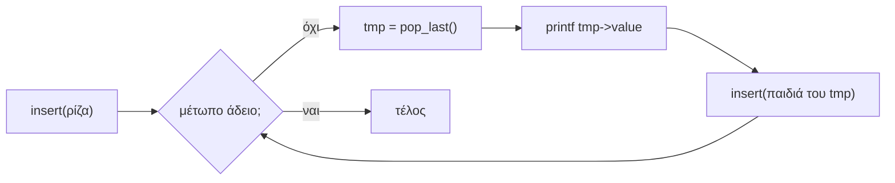
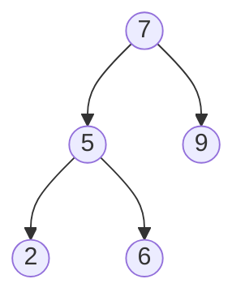

# Κεφάλαιο 22: Δέντρα

<!--  -->

> **Στόχοι:** μετά από αυτό το κεφάλαιο θα μπορείτε να ορίζετε σε C έναν κόμβο
> δυαδικού δέντρου· να εξηγείτε ρίζα, φύλλα, βάθος, ύψος και επίπεδο· να
> αναγνωρίζετε τέλεια, γεμάτα, πλήρη, ισορροπημένα και εκφυλισμένα δέντρα· να
> γράφετε αναδρομικά τις `is_empty`, `depth`, `print` (pre-order, in-order,
> post-order) και `find`· να τυπώνετε ένα δέντρο κατά πλάτος (BFS) με μια λίστα·
> να αναζητάτε σε δυαδικό δέντρο αναζήτησης· και να διαλέγετε ανάμεσα σε DFS και BFS.
>
> **Προαπαιτούμενα:** [Κεφάλαιο 11](../11-pointers-recursion/) (αναδρομή),
> [Κεφάλαιο 19](../19-structs/), [Κεφάλαιο 21](../21-lists-trees/) (λίστες)
>
> **Χρόνος μελέτης:** ~2,5 ώρες

## Σύνοψη

Η διάλεξη συνεχίζει τις αυτοαναφορικές δομές της προηγούμενης φοράς: από τη λίστα,
όπου κάθε κόμβος έχει έναν επόμενο, περνάμε στο δυαδικό δέντρο, όπου κάθε κόμβος
έχει έως δύο παιδιά. Ορίζει την ορολογία (ρίζα, φύλλα, βάθος, ύψος, επίπεδο) και τα
είδη των δυαδικών δέντρων, και υλοποιεί τις βασικές λειτουργίες αναδρομικά, με την
πολυπλοκότητα χρόνου και χώρου της καθεμιάς. Γνωρίζουμε τους δύο τρόπους να
εξερευνήσουμε ένα δέντρο, κατά βάθος (DFS) και κατά πλάτος (BFS), και το δυαδικό
δέντρο αναζήτησης, όπου η διάταξη των τιμών κάνει την αναζήτηση λογαριθμική. Τα
δέντρα είναι παντού: βάσεις δεδομένων, μεταγλωττιστές, συμπίεση, κρυπτογραφία,
παιχνίδια.

## Θεωρία

### Το δυαδικό δέντρο

Το **δυαδικό δέντρο (binary tree)** είναι ένας τύπος δεδομένων που οργανώνει τα
δεδομένα σε δενδρική διάταξη: κάθε **κόμβος (node)** έχει από 0 έως 2
**κόμβους-παιδιά (children)**, το αριστερό και το δεξί. Όπως ο κόμβος λίστας
([Κεφάλαιο 21](../21-lists-trees/)), είναι μια **αυτοαναφορική δομή
(self-referential structure)**, μόνο που έχει δύο δείκτες αντί για έναν. Τα
προγράμματα της διάλεξης ορίζουν μαζί με τη δομή και έναν συνώνυμο τύπο `Tree` για
τον δείκτη σε κόμβο, όπως το `List` της προηγούμενης διάλεξης:

```c
typedef struct treenode {
  int value;
  struct treenode *left;
  struct treenode *right;
} *Tree;
```

Ένα `Tree` είναι δείκτης στη ρίζα· ένα παιδί που λείπει, όπως και το **άδειο
δέντρο**, είναι `NULL`. Κάθε παιδί είναι κι αυτό ένα `Tree`, δηλαδή η ρίζα ενός **υποδέντρου
(subtree)**. Αυτός ο αναδρομικός ορισμός (ένα δέντρο είναι είτε άδειο είτε ένας
κόμβος με δύο υποδέντρα) είναι ο λόγος που σχεδόν όλοι οι αλγόριθμοι σε δέντρα
γράφονται φυσικά με αναδρομή ([Κεφάλαιο 11](../11-pointers-recursion/)).

### Ρίζα, φύλλα, βάθος, ύψος, επίπεδο

- **Ρίζα (root)** είναι ο πρώτος κόμβος, αυτός από τον οποίο ξεκινάμε.
- **Φύλλα (leaves)** είναι οι κόμβοι χωρίς παιδιά (και οι δύο δείκτες `NULL`).
- **Βάθος (depth)** του δέντρου είναι ο μέγιστος αριθμός συνδέσμων από τη ρίζα μέχρι
  τα φύλλα.
- **Ύψος (height)** του δέντρου είναι ο μέγιστος αριθμός συνδέσμων από τα φύλλα
  μέχρι τη ρίζα. Για ολόκληρο το δέντρο βάθος και ύψος συμπίπτουν.
- **Επίπεδο (level)** ενός κόμβου είναι η «γραμμή» όπου βρίσκεται: η ρίζα είναι στο
  επίπεδο 1, τα παιδιά της στο 2, τα εγγόνια στο 3 κ.ο.κ. Με άλλα λόγια, το επίπεδο
  είναι το πλήθος των κόμβων στη διαδρομή από τη ρίζα μέχρι τον κόμβο (μαζί με τα
  δύο άκρα).

Το δέντρο που χρησιμοποιεί η διάλεξη σε όλα τα παραδείγματα:


*Σχήμα: ρίζα το 5 (επίπεδο 1), 7 και 1 στο επίπεδο 2, 2 και 9 στο επίπεδο 3· φύλλα
τα 1, 2, 9· βάθος 2 (δύο σύνδεσμοι από το 5 στο 2).*

Προσέξτε ότι το βάθος μετρά **συνδέσμους** ενώ το επίπεδο μετρά **κόμβους**: ένα
δέντρο με 3 επίπεδα έχει βάθος 2.

### Είδη δυαδικών δέντρων

- **Τέλειο (perfect binary tree):** όλοι οι εσωτερικοί κόμβοι έχουν δύο παιδιά και
  όλα τα φύλλα βρίσκονται στο ίδιο επίπεδο. Κάθε επίπεδο είναι γεμάτο: το επίπεδο
  $k$ έχει $2^{k-1}$ κόμβους.
- **Γεμάτο (full binary tree):** κάθε κόμβος έχει 0 ή 2 παιδιά (ποτέ ένα). Τα φύλλα
  δεν χρειάζεται να είναι στο ίδιο επίπεδο.
- **Πλήρες (complete binary tree):** κάθε επίπεδο, εκτός ίσως από το τελευταίο, είναι
  γεμάτο, και οι κόμβοι του τελευταίου επιπέδου είναι όσο πιο αριστερά γίνεται.
- **Ισορροπημένο (balanced binary tree):** σε κάθε κόμβο, τα ύψη του αριστερού και
  του δεξιού υποδέντρου διαφέρουν το πολύ κατά 1.
- **Εκφυλισμένο (degenerate binary tree):** κάθε κόμβος έχει το πολύ ένα παιδί. Στην
  ουσία είναι μια λίστα.

Τα παραδείγματα των διαφανειών: αν από το τέλειο δέντρο αφαιρέσουμε το 3, μένει
**πλήρες** (τα 2, 9, 8 είναι αριστερά στο τελευταίο επίπεδο). Αν κρατήσουμε μόνο
5, 7, 4, 8, 3 (το 7 φύλλο, το 4 με δύο παιδιά), είναι **γεμάτο** αλλά όχι πλήρες.
Το δέντρο 5, 7, 4, 2, 9 (τα 2 και 9 παιδιά του 7) είναι **ισορροπημένο**: στη ρίζα
τα ύψη είναι 1 και 0. Τα είδη αυτά έχουν σημασία επειδή η πολυπλοκότητα των
λειτουργιών εξαρτάται από το ύψος: ένα ισορροπημένο δέντρο με $n$ κόμβους έχει ύψος
περίπου $\log_2 n$, ενώ ένα εκφυλισμένο έχει ύψος $n - 1$.

### Ν-αδικά δέντρα και δέντρα καταστάσεων

Δεν είναι όλα τα δέντρα δυαδικά. Συχνά αναπαριστούμε **καταστάσεις (states)** ενός
προβλήματος με ένα δέντρο όπου κάθε κόμβος έχει **περισσότερα από 2 παιδιά**
(**Ν-αδικό δέντρο, N-ary tree**). Το παράδειγμα της διάλεξης είναι το δέντρο
καταστάσεων της τρίλιζας (tic-tac-toe): η ρίζα είναι μια θέση του παιχνιδιού, κάθε
παιδί είναι η θέση μετά από μία δυνατή κίνηση, και τα φύλλα, όπου το παιχνίδι
τελειώνει, παίρνουν μια βαθμολογία (+10 νίκη, -10 ήττα, 0 ισοπαλία). Τέτοια δέντρα
είναι η βάση των αλγορίθμων για παιχνίδια· η διάλεξη ρωτά αν το δέντρο της
διαφάνειας είναι σωστό και πώς θα βρίσκαμε αυτόματα τα λάθη του.

### Βασικές λειτουργίες και πολυπλοκότητα

Οι βασικές λειτουργίες ενός δυαδικού δέντρου είναι:

1. `is_empty`: έλεγχος αν το δέντρο είναι άδειο.
2. `depth`: εύρεση του βάθους.
3. `print`: τύπωμα των στοιχείων (διάσχιση).
4. `find`: εύρεση στοιχείου.
5. `insert`: προσθήκη στοιχείου (για εξάσκηση, μόνοι σας).
6. `delete`: αφαίρεση στοιχείου (για εξάσκηση, μόνοι σας).

Το `is_empty` είναι απλώς `return t == NULL;`. Οι υπόλοιπες ακολουθούν το ίδιο
αναδρομικό σχήμα: **βασική περίπτωση** το άδειο δέντρο (`t == NULL`), και
**αναδρομικό βήμα** η επεξεργασία του κόμβου και των δύο υποδέντρων.

Για κάθε λειτουργία η διάλεξη δίνει **πολυπλοκότητα χρόνου** και **χώρου**
([Κεφάλαιο 15](../15-complexity-preprocessor/)) για ένα τέλειο δέντρο με $n$ κόμβους. Όταν μια
λειτουργία επισκέπτεται κάθε κόμβο μία φορά, ο χρόνος είναι $O(n)$. Ο χώρος μιας
αναδρομικής λειτουργίας είναι το μέγιστο πλήθος κλήσεων που είναι ταυτόχρονα στη
στοίβα, δηλαδή το ύψος του δέντρου συν ένα: σε τέλειο δέντρο αυτό είναι
$O(\log n)$. Σε εκφυλισμένο δέντρο το ύψος είναι $n - 1$, άρα ο χώρος γίνεται
$O(n)$.

### Βάθος με αναδρομή

Το βάθος ενός δέντρου είναι 1 συν το μεγαλύτερο από τα βάθη των δύο υποδέντρων. Η
διάλεξη ορίζει το βάθος του άδειου δέντρου ως -1, ώστε ένας μόνος κόμβος (φύλλο) να
έχει βάθος $1 + (-1) = 0$, σύμφωνα με τον ορισμό «σύνδεσμοι από τη ρίζα στα φύλλα».
Η υλοποίηση βρίσκεται στο παράδειγμα «Βάθος του δέντρου 5, 7, 1, 2, 9».

Η `treedepth` των σημειώσεων επιστρέφει 0 για το άδειο δέντρο, άρα μετρά
**επίπεδα** (κόμβους) αντί για συνδέσμους και δίνει πάντα ένα παραπάνω. Και οι δύο
είναι σωστές για τον δικό τους ορισμό· προσέξτε ποιον ζητά η εκφώνηση. Χρόνος
$O(n)$, χώρος $O(\log n)$ για τέλειο δέντρο.

### Διάσχιση κατά βάθος (DFS)

Η **αναζήτηση κατά βάθος (depth-first search, DFS)** είναι ένας αλγόριθμος
διάσχισης/αναζήτησης σε δέντρα και γράφους: ξεκινά από τον αρχικό κόμβο και
προχωρά όσο πιο βαθιά μπορεί σε έναν κλάδο, πριν **οπισθοδρομήσει (backtracking)**
για να δοκιμάσει τον επόμενο. Η αναδρομή υλοποιεί το DFS «δωρεάν»: η κλήση για το
αριστερό υποδέντρο τελειώνει ολόκληρη πριν αρχίσει η κλήση για το δεξί, και η
επιστροφή από την κλήση είναι η οπισθοδρόμηση.

**Διάσχιση (traversal)** είναι η επίσκεψη όλων των κόμβων με μια συγκεκριμένη σειρά.
Σε δυαδικό δέντρο, το DFS έχει τρεις παραλλαγές, ανάλογα με το πότε επεξεργαζόμαστε
(π.χ. τυπώνουμε) τον τρέχοντα κόμβο σε σχέση με τα παιδιά του:

| Διάσχιση | Σειρά | Για το δέντρο 5, 7, 1, 2, 9 |
| --- | --- | --- |
| **pre-order** (προδιατεταγμένη) | κόμβος, αριστερό, δεξί | `5 7 2 9 1` |
| **in-order** (ενδοδιατεταγμένη) | αριστερό, κόμβος, δεξί | `2 7 9 5 1` |
| **post-order** (μεταδιατεταγμένη) | αριστερό, δεξί, κόμβος | `2 9 7 1 5` |

Ο κώδικας είναι ο ίδιος και στις τρεις· αλλάζει μόνο η θέση του `printf` σε σχέση
με τις δύο αναδρομικές κλήσεις. Χρόνος $O(n)$, χώρος $O(\log n)$ για τέλειο δέντρο.

Κάθε διάσχιση ταιριάζει σε άλλες δουλειές. Η post-order επεξεργάζεται τα παιδιά πριν
από τον γονιό: ταιριάζει όταν ο κόμβος χρειάζεται τα αποτελέσματα των υποδέντρων
του (αποτίμηση παράστασης, αποδέσμευση δέντρου με `free`). Η in-order σε δυαδικό
δέντρο αναζήτησης δίνει τις τιμές ταξινομημένες. Η pre-order βλέπει τη ρίζα πρώτη
(π.χ. για αντιγραφή ενός δέντρου).

### Αναζήτηση στοιχείου σε δυαδικό δέντρο

Σε ένα τυχαίο δυαδικό δέντρο οι τιμές δεν έχουν καμία διάταξη, άρα η `find` πρέπει
να ψάξει παντού με DFS: ελέγχει τον τρέχοντα κόμβο, μετά ψάχνει στο αριστερό
υποδέντρο, και μόνο αν δεν το βρει εκεί ψάχνει στο δεξί:

```c
Tree find(Tree t, int value) {
  if (t == NULL) return NULL;
  if (t->value == value) return t;
  Tree left = find(t->left, value);
  if (left != NULL) return left;
  return find(t->right, value);
}
```

Επιστρέφει δείκτη στον κόμβο (ή `NULL`), ώστε ο καλών να μπορεί και να τον
αλλάξει. Στη χειρότερη περίπτωση (η τιμή λείπει) επισκέπτεται όλους τους κόμβους:
χρόνος $O(n)$, χώρος $O(\log n)$ για τέλειο δέντρο.

### Διάσχιση κατά πλάτος (BFS)

Η **αναζήτηση κατά πλάτος ή κατά επίπεδα (breadth-first search, BFS)** ξεκινά από
τον αρχικό κόμβο και σε κάθε βήμα εξερευνά **όλους** τους κόμβους του τρέχοντος
επιπέδου πριν περάσει στο επόμενο. Σε ένα τέλειο δέντρο με αριθμημένους κόμβους
1–7 επισκέπτεται 1· 2, 3· 4, 5, 6, 7.

Η αναδρομή δεν βοηθά εδώ, γιατί δεν θέλουμε να κατεβούμε σε έναν κλάδο μέχρι το
τέλος. Χρειαζόμαστε μια δομή που θυμάται ποιους κόμβους έχουμε δει αλλά δεν έχουμε
επεξεργαστεί ακόμα: το **μέτωπο (frontier)**, ή **λίστα εργασιών (worklist)**. Η
διάλεξη χρησιμοποιεί μια λίστα από το [Κεφάλαιο 21](../21-lists-trees/):
προσθέτουμε κόμβους στην αρχή με `insert` και βγάζουμε από το τέλος με `pop_last`.
Έτσι ο κόμβος που μπήκε πρώτος βγαίνει πρώτος: η λίστα λειτουργεί ως **ουρά (queue,
FIFO)**. Ο αλγόριθμος:

1. Βάλε τη ρίζα στο μέτωπο.
2. Όσο το μέτωπο δεν είναι άδειο: βγάλε τον παλαιότερο κόμβο, επεξεργάσου τον (π.χ.
   τύπωσέ τον) και βάλε στο μέτωπο τα παιδιά του που υπάρχουν.



*Σχήμα: ο βρόχος του BFS με λίστα εργασιών.*

Στο δέντρο 5, 7, 1, 2, 9 το BFS τυπώνει `5 7 1 2 9`. Κάθε κόμβος μπαίνει και βγαίνει
μία φορά, άρα ο χρόνος είναι $O(n)$. Ο χώρος όμως είναι **$O(n)$**: σε ένα τέλειο
δέντρο το τελευταίο επίπεδο έχει περίπου τους μισούς κόμβους, και κάποια στιγμή
βρίσκονται όλοι μαζί στο μέτωπο.

Εδώ η λίστα δεν κρατά πια ακεραίους αλλά **δείκτες σε κόμβους δέντρου** (`Tree`).
Αυτό σημαίνει ότι ο κόμβος λίστας του προηγούμενου κεφαλαίου πρέπει να αλλάξει
(πεδίο `Tree value` αντί για `int value`). Η διάλεξη ρωτά πώς θα γράφαμε λίστες που
δουλεύουν με **κάθε** τύπο δεδομένων· εκεί οδηγεί η ιδέα του **αφηρημένου τύπου
δεδομένων (abstract data type, ΑΤΔ)**, που η διάλεξη δίνει για διάβασμα.

### DFS ή BFS;

Κανένας από τους δύο δεν είναι «καλύτερος» γενικά· η επιλογή εξαρτάται από το
πρόβλημα:

- Το **BFS** επισκέπτεται τους κόμβους με σειρά απόστασης από την αρχή. Ο πρώτος
  κόμβος-στόχος που θα βρει είναι ο πιο κοντινός, άρα είναι η φυσική επιλογή για
  **συντομότερο μονοπάτι**. Θέλει όμως μνήμη ανάλογη με το πλάτος του δέντρου.
- Το **DFS** θέλει μνήμη ανάλογη με το ύψος (τη στοίβα της αναδρομής), που σε ένα
  ισορροπημένο δέντρο είναι πολύ μικρότερη. Όταν πρέπει να δούμε **όλους** τους
  κόμβους ούτως ή άλλως (π.χ. μέγιστο στοιχείο), και οι δύο κάνουν $O(n)$ βήματα,
  και το DFS είναι πιο απλό και πιο φειδωλό σε μνήμη.

### Δυαδικό δέντρο αναζήτησης (BST)

Ένα **δυαδικό δέντρο αναζήτησης (binary search tree, BST)** ή **ταξινομημένο δέντρο
(ordered tree)** είναι ένα δυαδικό δέντρο όπου, για **κάθε** κόμβο, όλοι οι κόμβοι
στο αριστερό του υποδέντρο έχουν μικρότερη τιμή και όλοι οι κόμβοι στο δεξί του
υποδέντρο μεγαλύτερη.



*Σχήμα: BST· αριστερά του 7 μόνο τα 2, 5, 6, δεξιά μόνο το 9.*

Η διάταξη επιτρέπει να ψάχνουμε σαν τη δυαδική αναζήτηση σε ταξινομημένο πίνακα
([Κεφάλαιο 17](../17-binary-search-sorting/)): σε κάθε κόμβο συγκρίνουμε και συνεχίζουμε
**μόνο** σε ένα από τα δύο υποδέντρα, πετώντας το άλλο. Η `exists` της διάλεξης:

```c
int exists(Tree t, int value) {
  if (t == NULL) return 0;
  if (t->value == value) return 1;
  if (value < t->value) return exists(t->left, value);
  return exists(t->right, value);
}
```

Κάνει μία κλήση ανά επίπεδο, άρα σε ισορροπημένο (π.χ. τέλειο) BST χρόνος και χώρος
είναι $O(\log n)$, αντί για $O(n)$ χρόνο της `find`. Αν όμως το BST είναι
εκφυλισμένο (π.χ. αν εισαγάγουμε τις τιμές ήδη ταξινομημένες, οπότε κάθε νέα τιμή
πάει δεξιά), το ύψος είναι $n - 1$ και η αναζήτηση γίνεται $O(n)$, όπως σε λίστα.
Επίσης, η in-order διάσχιση ενός BST τυπώνει τις τιμές σε αύξουσα σειρά.

Η εισαγωγή σε BST (η `addtree` των σημειώσεων και του Εργαστηρίου 9) ακολουθεί την
ίδια διαδρομή με την αναζήτηση και, όταν φτάσει σε `NULL`, φτιάχνει εκεί νέο κόμβο
με `malloc`.

## Παραδείγματα

### Άδειο δέντρο: `is_empty`

Το πρώτο πρόγραμμα της διάλεξης (σελ. 17) ορίζει τον τύπο `Tree` όπως στο «Το δυαδικό
δέντρο», μαζί με τη `is_empty`, και τη δοκιμάζει σε άδειο δέντρο:

```c
Tree t = NULL;
printf("Empty: %d\n", is_empty(t));
```

```text
$ ./tree
Empty: 1
```

### Βάθος του δέντρου 5, 7, 1, 2, 9

Εφαρμόζει «Βάθος με αναδρομή». Η διάλεξη χτίζει το δέντρο χωρίς `malloc`, με
τοπικές μεταβλητές `struct treenode` που αρχικοποιούνται με `{τιμή, αριστερό,
δεξί}` και δείχνουν η μία στην άλλη με `&`:

```c
#include <stdio.h>
#include <stdlib.h>

typedef struct treenode {
  int value;
  struct treenode *left;
  struct treenode *right;
} *Tree;

int depth(Tree t) {
  if (t == NULL) return -1;
  int left_depth = depth(t->left);
  int right_depth = depth(t->right);
  return 1 + ((left_depth > right_depth) ? left_depth : right_depth);
}

int main() {
  struct treenode t2 = {2, NULL, NULL}, t9 = {9, NULL, NULL};
  struct treenode t1 = {1, NULL, NULL};
  struct treenode t7 = {7, &t2, &t9}, t5 = {5, &t7, &t1};
  Tree t = &t5;
  printf("Depth: %d\n", depth(t));
  return 0;
}
```

```text
$ ./depth
Depth: 2
```

Τα φύλλα 2, 9, 1 επιστρέφουν $1 + \max(-1, -1) = 0$· το 7 επιστρέφει
$1 + \max(0, 0) = 1$· η ρίζα 5 επιστρέφει $1 + \max(1, 0) = 2$. Η διάλεξη ρωτά την
πολυπλοκότητα για τέλειο δέντρο: χρόνος $O(n)$ (μία κλήση ανά κόμβο), χώρος
$O(\log n)$ (το πολύ τόσες κλήσεις στη στοίβα όσο το ύψος).

### Οι τρεις διασχίσεις DFS

Εφαρμόζει «Διάσχιση κατά βάθος (DFS)». Η διάλεξη δίνει τρεις εκδοχές της `print`
για το ίδιο δέντρο· εδώ μαζί, με διαφορετικά ονόματα:

```c
void preorder(Tree t) {      // node, left, right
  if (t == NULL) return;
  printf("%d ", t->value);
  preorder(t->left);
  preorder(t->right);
}

void inorder(Tree t) {       // left, node, right
  if (t == NULL) return;
  inorder(t->left);
  printf("%d ", t->value);
  inorder(t->right);
}

void postorder(Tree t) {     // left, right, node
  if (t == NULL) return;
  postorder(t->left);
  postorder(t->right);
  printf("%d ", t->value);
}
```

```text
$ ./preorder
5 7 2 9 1
$ ./inorder
2 7 9 5 1
$ ./postorder
2 9 7 1 5
```

Για να βρείτε τη σειρά με το χέρι, ακολουθήστε τον ορισμό αναδρομικά: π.χ. in-order
του 5 = in-order του 7 (δηλαδή `2 7 9`), μετά `5`, μετά in-order του 1 (`1`).

### Αποτιμητής εκφράσεων

Η διάλεξη ρωτά: θέλουμε να γράψουμε έναν **αποτιμητή εκφράσεων (calculator /
evaluator / interpreter)** για το δέντρο της παράστασης `2 * 9 + 1`· ποια διάσχιση
θα χρησιμοποιήσουμε;


*Σχήμα: δέντρο παράστασης· οι τελεστές είναι εσωτερικοί κόμβοι, οι αριθμοί φύλλα.*

Ένας τελεστής μπορεί να υπολογιστεί μόνο όταν ξέρουμε τις τιμές των δύο υποδέντρων
του: πρώτα `2 * 9 = 18`, μετά `18 + 1 = 19`. Αυτή είναι η σειρά της **post-order**
(`2 9 * 1 +`). Η in-order δίνει τη συνηθισμένη γραφή `2 * 9 + 1` και η pre-order τη
γραφή `+ * 2 9 1`, αλλά για τον υπολογισμό χρειαζόμαστε τα παιδιά πριν από τον γονιό.

### BFS με λίστα εργασιών

Εφαρμόζει «Διάσχιση κατά πλάτος (BFS)». Η διάλεξη δίνει μόνο τη `bfs` (πρώτα με
μεταβλητή `worklist`, μετά με το όνομα `frontier`)· οι `insert` και `pop_last` δεν
φαίνονται στις διαφάνειες. Το πλήρες πρόγραμμα παρακάτω τις συμπληρώνει: η λίστα
κρατά `Tree` αντί για `int`, η `insert` βάζει στην αρχή (όπως στο
[Κεφάλαιο 21](../21-lists-trees/)) και η `pop_last` βγάζει από το τέλος.

```c
#include <stdio.h>
#include <stdlib.h>

typedef struct treenode {
  int value;
  struct treenode *left;
  struct treenode *right;
} *Tree;

typedef struct listnode {
  Tree value;                  // the list now holds trees, not ints
  struct listnode *next;
} *List;

void insert(List *list, Tree value) {    // insert at the head
  List new_head = malloc(sizeof(struct listnode));
  new_head->value = value;
  new_head->next = *list;
  *list = new_head;
}

Tree pop_last(List *list) {              // remove from the tail
  while ((*list)->next != NULL)
    list = &((*list)->next);
  List last = *list;
  Tree value = last->value;
  *list = NULL;
  free(last);
  return value;
}

void bfs(Tree t) {
  List frontier = NULL;
  Tree tmp;
  insert(&frontier, t);
  while (frontier) {
    tmp = pop_last(&frontier);
    printf("%d ", tmp->value);
    if (tmp->left) insert(&frontier, tmp->left);
    if (tmp->right) insert(&frontier, tmp->right);
  }
}

int main() {
  struct treenode t2 = {2, NULL, NULL}, t9 = {9, NULL, NULL};
  struct treenode t1 = {1, NULL, NULL};
  struct treenode t7 = {7, &t2, &t9}, t5 = {5, &t7, &t1};
  bfs(&t5);
  printf("\n");
  return 0;
}
```

```text
$ ./bfs
5 7 1 2 9
```

Η εξέλιξη του μετώπου (κεφαλή αριστερά, τέλος δεξιά):

| Βήμα | Βγαίνει | Τυπώνει | Μέτωπο μετά |
| --- | --- | --- | --- |
| αρχή | | | 5 |
| 1 | 5 | `5` | 1, 7 |
| 2 | 7 | `7` | 9, 2, 1 |
| 3 | 1 | `1` | 9, 2 |
| 4 | 2 | `2` | 9 |
| 5 | 9 | `9` | (άδειο) |

Η `pop_last` διατρέχει όλη τη λίστα κάθε φορά· με έναν επιπλέον δείκτη στο τέλος της
λίστας θα ήταν $O(1)$, όπως υποθέτει η εκτίμηση $O(n)$ της διάλεξης.

### Συμβουλές για το εργαστήριο

Η Άσκηση 4 του [Εργαστηρίου 9](https://progintro.github.io/lab-material/labs/lab09/)
(`tree.c`) ζητά ένα ταξινομημένο δυαδικό δέντρο ακεραίων: μια αναδρομική `addtree`
που επιστρέφει το νέο δέντρο (`p->left = addtree(p->left, x);`) και μια `treeprint`
με in-order διάσχιση, που άρα τυπώνει τους αριθμούς ταξινομημένους. Η Άσκηση 5 ζητά
μια αναδρομική `free_tree`: αποδεσμεύστε **πρώτα** τα υποδέντρα και **μετά** τον
κόμβο (post-order), και ελέγξτε με `valgrind` ότι δεν μένουν διαρροές.

## Κύρια σημεία

1. Ένα δυαδικό δέντρο είναι αυτοαναφορική δομή όπου κάθε κόμβος έχει μια τιμή και
   δείκτες `left` και `right` σε έως δύο παιδιά· το άδειο δέντρο είναι `NULL`.
2. Ρίζα είναι ο πρώτος κόμβος, φύλλα οι κόμβοι χωρίς παιδιά, βάθος/ύψος ο μέγιστος
   αριθμός συνδέσμων ρίζας–φύλλων, και η ρίζα βρίσκεται στο επίπεδο 1.
3. Ένα δέντρο είναι τέλειο (όλα τα επίπεδα γεμάτα), γεμάτο (0 ή 2 παιδιά), πλήρες
   (γεμάτο εκτός από το τελευταίο επίπεδο, που γεμίζει από αριστερά), ισορροπημένο
   (ύψη υποδέντρων διαφέρουν έως 1) ή εκφυλισμένο (έως ένα παιδί, σαν λίστα).
4. Τα δέντρα καταστάσεων, όπως αυτό της τρίλιζας, έχουν συχνά περισσότερα από 2
   παιδιά ανά κόμβο.
5. Οι λειτουργίες σε δέντρα γράφονται φυσικά με αναδρομή: βασική περίπτωση το
   `NULL`, αναδρομή στα δύο υποδέντρα.
6. Το DFS προχωρά όσο πιο βαθιά γίνεται και μετά οπισθοδρομεί· σε δυαδικό δέντρο
   δίνει τις διασχίσεις pre-order, in-order και post-order, που διαφέρουν μόνο στο
   πότε επεξεργαζόμαστε τον κόμβο.
7. Τα `depth`, `print` και `find` σε τέλειο δέντρο κοστίζουν χρόνο $O(n)$ και χώρο
   $O(\log n)$ για τη στοίβα της αναδρομής.
8. Το BFS επισκέπτεται τους κόμβους επίπεδο-επίπεδο με μια λίστα εργασιών που
   λειτουργεί ως ουρά· κοστίζει χρόνο $O(n)$ και χώρο $O(n)$.
9. Για συντομότερο μονοπάτι προτιμάμε BFS· όταν πρέπει να δούμε όλους τους κόμβους,
   το DFS χρειάζεται λιγότερη μνήμη.
10. Σε ένα BST κάθε κόμβος έχει μικρότερες τιμές αριστερά και μεγαλύτερες δεξιά, οπότε
    η αναζήτηση ακολουθεί ένα μόνο μονοπάτι: $O(\log n)$ σε ισορροπημένο δέντρο.

## Ορολογία

| Ελληνικά | English | Σύντομος ορισμός |
| --- | --- | --- |
| δυαδικό δέντρο | binary tree | Δέντρο όπου κάθε κόμβος έχει 0 έως 2 παιδιά. |
| κόμβος / παιδί | node / child | Στοιχείο του δέντρου / κόμβος ακριβώς κάτω από έναν άλλο. |
| υποδέντρο | subtree | Ένα παιδί μαζί με όλους τους απογόνους του. |
| ρίζα | root | Ο πρώτος κόμβος του δέντρου. |
| φύλλο | leaf | Κόμβος χωρίς παιδιά. |
| βάθος / ύψος | depth / height | Μέγιστος αριθμός συνδέσμων από τη ρίζα στα φύλλα. |
| επίπεδο κόμβου | node level | Η γραμμή του κόμβου· η ρίζα είναι στο επίπεδο 1. |
| τέλειο δυαδικό δέντρο | perfect binary tree | Όλοι οι εσωτερικοί κόμβοι με 2 παιδιά, όλα τα φύλλα στο ίδιο επίπεδο. |
| γεμάτο δυαδικό δέντρο | full binary tree | Κάθε κόμβος έχει 0 ή 2 παιδιά. |
| πλήρες δυαδικό δέντρο | complete binary tree | Γεμάτα επίπεδα εκτός ίσως του τελευταίου, που γεμίζει από αριστερά. |
| ισορροπημένο δυαδικό δέντρο | balanced binary tree | Σε κάθε κόμβο τα ύψη των υποδέντρων διαφέρουν έως 1. |
| εκφυλισμένο δυαδικό δέντρο | degenerate binary tree | Κάθε κόμβος έχει έως ένα παιδί. |
| Ν-αδικό δέντρο | N-ary tree | Δέντρο με περισσότερα από 2 παιδιά ανά κόμβο. |
| διάσχιση | traversal | Επίσκεψη όλων των κόμβων με συγκεκριμένη σειρά. |
| αναζήτηση κατά βάθος | depth-first search (DFS) | Προχωρά σε βάθος και οπισθοδρομεί. |
| οπισθοδρόμηση | backtracking | Επιστροφή σε προηγούμενο κόμβο για να δοκιμαστεί άλλος κλάδος. |
| αναζήτηση κατά πλάτος | breadth-first search (BFS) | Εξερευνά ένα επίπεδο ολόκληρο πριν από το επόμενο. |
| μέτωπο / λίστα εργασιών | frontier / worklist | Οι κόμβοι που περιμένουν επεξεργασία στο BFS. |
| δυαδικό δέντρο αναζήτησης | binary search tree (BST) | Μικρότερες τιμές αριστερά, μεγαλύτερες δεξιά, σε κάθε κόμβο. |
| αφηρημένος τύπος δεδομένων | abstract data type (ΑΤΔ) | Τύπος που ορίζεται από τις λειτουργίες του, ανεξάρτητα από την υλοποίηση. |

## Διάβασμα

- **Διαφάνειες:** [Διάλεξη 22](https://github.com/progintro/progintro.github.io/releases/download/2025/lec22.pdf),
  σελ. 1–43: δυαδικό δέντρο και ορολογία 5–9· είδη δέντρων 10–14· Ν-αδικά δέντρα 15·
  λειτουργίες 16–17· βάθος 18–20· DFS και διασχίσεις 21–29· `find` 30–31· BFS 32–34·
  BST 35–37· ερωτήσεις DFS/BFS 38–41.
- **Σημειώσεις:** η διάλεξη προτείνει τις σελ. 120–135 των σημειώσεων του κ.
  Σταματόπουλου (K04):
  - [Κεφάλαιο 7](https://progintro.github.io/notes/chapters/07-structs/):
    «Αυτο-αναφορικές δομές» (K04, σελ. 120–125), «Δημιουργία νέων ονομάτων τύπων»
    (126).
  - [Κεφάλαιο 8](https://progintro.github.io/notes/chapters/08-lists-trees/):
    «Διαχείριση συνδεδεμένων λιστών» (K04, σελ. 128–131), «Διαχείριση δυαδικών
    δέντρων» (132–135), με τις `addtree`, `treeprint`, `nodesprint`, `treedepth`,
    `treesearch`.
- **Εργαστήριο:** [Εργαστήριο 9](https://progintro.github.io/lab-material/labs/lab09/):
  Άσκηση 4 `tree.c`, Άσκηση 5 (`free_tree` στο `tree.c`).
- **Άλλα:** [Binary Tree Problems](http://cslibrary.stanford.edu/110/BinaryTrees.pdf)
  (Stanford CS Education Library)·
  [Tree traversal](https://en.wikipedia.org/wiki/Tree_traversal),
  [Depth-first search](https://en.wikipedia.org/wiki/Depth-first_search),
  [Breadth-first search](https://en.wikipedia.org/wiki/Breadth-first_search),
  [Binary search tree](https://en.wikipedia.org/wiki/Binary_search_tree) (Wikipedia)
  και [οπτικοποίηση BST](https://www.cs.usfca.edu/~galles/visualization/BST.html)·
  [Αφηρημένος τύπος δεδομένων](https://el.wikipedia.org/wiki/%CE%91%CF%86%CE%B7%CF%81%CE%B7%CE%BC%CE%AD%CE%BD%CE%BF%CF%82_%CF%84%CF%8D%CF%80%CE%BF%CF%82_%CE%B4%CE%B5%CE%B4%CE%BF%CE%BC%CE%AD%CE%BD%CF%89%CE%BD)
  (Βικιπαίδεια).

## Συχνά λάθη

- **Πρόσβαση σε `t->left` χωρίς έλεγχο για `NULL`.** Μια αναδρομική συνάρτηση χωρίς
  `if (t == NULL) return ...;` στην αρχή σκάει στα φύλλα με `Segmentation fault`.
- **Λάθος βασική περίπτωση στο βάθος.** Με `return 0` για το άδειο δέντρο, το δέντρο
  5, 7, 1, 2, 9 δίνει 3 (επίπεδα) αντί για 2 (συνδέσμους). Διαλέξτε -1 ή 0 ανάλογα με
  τον ορισμό που ζητείται.
- **Σύγχυση των διασχίσεων.** Το «pre», «in», «post» αναφέρεται στη θέση του
  **κόμβου** σε σχέση με τα παιδιά του· τα παιδιά πάντα αριστερό πριν από δεξί.
- **Αναζήτηση BST σε δέντρο που δεν είναι BST.** Η `exists` πάει μόνο αριστερά ή
  μόνο δεξιά· σε τυχαίο δέντρο (π.χ. το 5, 7, 1, 2, 9) η `exists(t, 9)` επιστρέφει 0
  ενώ το 9 υπάρχει. Εκεί χρειάζεται η `find`.
- **Έλεγχος BST μόνο με τα άμεσα παιδιά.** Η ιδιότητα αφορά **όλο** το υποδέντρο: ένα
  8 κάτω δεξιά από το 5 στο αριστερό υποδέντρο του 7 χαλάει το BST, αν και
  `5 < 8` ισχύει.
- **Εισαγωγή σε BST χωρίς να κρατηθεί το αποτέλεσμα.** Γράφοντας `addtree(p->left, x);`
  αντί για `p->left = addtree(p->left, x);`, ο νέος κόμβος χάνεται και το δέντρο μένει
  άδειο.
- **`free` πριν από τα παιδιά.** Αν αποδεσμεύσετε τον κόμβο και μετά διαβάσετε
  `p->left`, το `valgrind` δείχνει `Invalid read`· αποδεσμεύστε με post-order.
- **BFS με στοίβα αντί για ουρά.** Αν η λίστα εργασιών βγάζει από την ίδια άκρη που
  βάζει, οι κόμβοι δεν βγαίνουν ανά επίπεδο.

<!-- misconceptions -->

### Τι δυσκόλεψε την τάξη

Από τα Kahoot των διαλέξεων: οι ερωτήσεις όπου μια λάθος απάντηση μάζεψε πολλές ψήφους, με το ποσοστό σωστών απαντήσεων.

- **[Χειρότερη περίπτωση αναζήτησης σε BST](../../questions/kahoot/kahoot-bst-worst-case.md)** (29% σωστές): Το 30% επέλεξε το ισορροπημένο δέντρο, ενώ σε ισορροπημένο BST η σύγκριση με κάθε κόμβο δείχνει πάντα προς τα πού να ψάξουμε, άρα αρκούν O(log n) βήματα.
- **[Αποτίμηση δέντρου εκφράσεων](../../questions/kahoot/kahoot-expression-tree-eval.md)** (35% σωστές): Το 28% επέλεξε preorder, όμως για να εφαρμόσουμε τον τελεστή της ρίζας χρειαζόμαστε πρώτα τις τιμές και των δύο υποδέντρων.
- **[BFS σε τέλειο δυαδικό δέντρο](../../questions/kahoot/kahoot-bfs-perfect-tree.md)** (37% σωστές): Το 61% απάντησε True, μπερδεύοντας το ύψος του δέντρου (log n) με το κόστος της αναζήτησης· η BFS σε δέντρο που δεν είναι BST μπορεί να χρειαστεί να επισκεφθεί όλους τους κόμβους.
- **[Κόμβοι δέντρου με n επίπεδα](../../questions/kahoot/kahoot-tree-levels-nodes.md)** (53% σωστές): Το 37% επέλεξε `2^n`, που είναι μόνο το μέγιστο για ένα τέλειο δυαδικό δέντρο· ένα τυχαίο δέντρο μπορεί να έχει από έναν κόμβο ανά επίπεδο μέχρι πολύ περισσότερους.

<!-- /misconceptions -->

## Ερωτήσεις κατανόησης

1. Πόσους κόμβους έχει ένα τέλειο δυαδικό δέντρο με $n$ επίπεδα;[^q1]
2. Είναι κάθε τέλειο δέντρο πλήρες; Είναι κάθε πλήρες δέντρο γεμάτο;[^q2]
3. Τι επιστρέφει η `depth` της διάλεξης για ένα δέντρο με έναν μόνο κόμβο, και γιατί
   η βασική περίπτωση επιστρέφει -1;[^q3]
4. Ποια διάσχιση τυπώνει ταξινομημένα τα στοιχεία ενός BST;[^q4]
5. Γιατί το BFS χρειάζεται χώρο $O(n)$ ενώ το DFS σε τέλειο δέντρο $O(\log n)$;[^q5]
6. Γιατί η `exists` είναι $O(\log n)$ ενώ η `find` είναι $O(n)$; Πότε η `exists`
   γίνεται κι αυτή $O(n)$;[^q6]
7. Σε ποια σειρά πρέπει να αποδεσμεύσουμε τους κόμβους ενός δέντρου, και ποια
   διάσχιση είναι αυτή;[^q7]

<!-- kahoot -->

### Kahoot από το αμφιθέατρο

Ερωτήσεις που παίχτηκαν στις διαλέξεις, με το ποσοστό των φοιτητών που απάντησαν σωστά.

- [Κόμβοι τέλειου δυαδικού δέντρου](../../questions/kahoot/kahoot-perfect-tree-nodes.md): 81% σωστές απαντήσεις
- [Ο καλύτερος αλγόριθμος αναζήτησης](../../questions/kahoot/kahoot-best-search-algorithm.md): 75% σωστές απαντήσεις
- [Ταξινομημένη εκτύπωση BST](../../questions/kahoot/kahoot-bst-sorted-traversal.md): 66% σωστές απαντήσεις
- [Κόμβοι δέντρου με n επίπεδα](../../questions/kahoot/kahoot-tree-levels-nodes.md): 53% σωστές απαντήσεις
- [Ελάχιστο βάθος δυαδικού δέντρου](../../questions/kahoot/kahoot-tree-min-depth.md): 47% σωστές απαντήσεις
- [Φύλλα τέλειου δυαδικού δέντρου](../../questions/kahoot/kahoot-perfect-tree-leaves.md): 45% σωστές απαντήσεις
- [BFS σε τέλειο δυαδικό δέντρο](../../questions/kahoot/kahoot-bfs-perfect-tree.md): 37% σωστές απαντήσεις
- [Αποτίμηση δέντρου εκφράσεων](../../questions/kahoot/kahoot-expression-tree-eval.md): 35% σωστές απαντήσεις
- [Χειρότερη περίπτωση αναζήτησης σε BST](../../questions/kahoot/kahoot-bst-worst-case.md): 29% σωστές απαντήσεις

<!-- /kahoot -->

## Ασκήσεις

<!-- exercises -->

### Ζέσταμα: από τις διαφάνειες

- [Ποιος αλγόριθμος αναζήτησης είναι καλύτερος;](../../questions/slides/slides-lec22-best-search.md): Διαλέξεις 21–22: Δέντρα, διαφάνεια 38 (διάλεξη 21: διαφάνεια 60) · ★☆☆ · short-answer
- [Έλεγχος ύπαρξης σε δυαδικό δέντρο αναζήτησης](../../questions/slides/slides-lec22-bst-exists.md): Διαλέξεις 21–22: Δέντρα, διαφάνειες 35–37 (διάλεξη 21: διαφάνειες 57–59) · ★☆☆ · programming
- [Κόμβοι τέλειου δυαδικού δέντρου](../../questions/slides/slides-lec22-perfect-tree-nodes.md): Διαλέξεις 21–22: Δέντρα, διαφάνεια 10 (διάλεξη 21: διαφάνεια 32) · ★☆☆ · short-answer
- [Διασχίσεις pre-order, in-order, post-order](../../questions/slides/slides-lec22-traversals.md): Διαλέξεις 21–22: Δέντρα, διαφάνειες 22–28 (διάλεξη 21: διαφάνειες 44–50) · ★☆☆ · trace
- [Μέγιστο στοιχείο δέντρου: BFS ή DFS;](../../questions/slides/slides-lec22-tree-max.md): Διαλέξεις 21–22: Δέντρα, διαφάνεια 41 (διάλεξη 21: διαφάνεια 63) · ★☆☆ · short-answer
- [Πολυπλοκότητα της depth](../../questions/slides/slides-lec22-depth-complexity.md): Διαλέξεις 21–22: Δέντρα, διαφάνεια 20 (διάλεξη 21: διαφάνειες 41–42) · ★★☆ · short-answer
- [Διάσχιση για αποτιμητή εκφράσεων](../../questions/slides/slides-lec22-expression-evaluator.md): Διαλέξεις 21–22: Δέντρα, διαφάνεια 29 (διάλεξη 21: διαφάνεια 51) · ★★☆ · short-answer
- [Λίστα για το BFS και λίστες κάθε τύπου](../../questions/slides/slides-lec22-generic-list.md): Διαλέξεις 21–22: Δέντρα, διαφάνεια 33 (διάλεξη 21: διαφάνεια 55) · ★★☆ · short-answer
- [Συντομότερο μονοπάτι σε δέντρα-λαβύρινθους: BFS ή DFS;](../../questions/slides/slides-lec22-maze-shortest-path.md): Διαλέξεις 21–22: Δέντρα, διαφάνεια 40 (διάλεξη 21: διαφάνεια 62) · ★★☆ · short-answer
- [Αποθήκευση και αναζήτηση σε 1 PetaByte](../../questions/slides/slides-lec22-petabyte.md): Διαλέξεις 21–22: Δέντρα, διαφάνεια 39 (διάλεξη 21: διαφάνεια 61) · ★★☆ · short-answer
- [Δέντρο καταστάσεων τρίλιζας](../../questions/slides/slides-lec22-tictactoe-tree.md): Διάλεξη 22: Δέντρα, διαφάνεια 15 · ★★☆ · short-answer
- [Προσθήκη στοιχείου σε δυαδικό δέντρο](../../questions/slides/slides-lec22-tree-insert.md): Διαλέξεις 21–22: Δέντρα, διαφάνεια 16 (διάλεξη 21: διαφάνεια 38) · ★★☆ · programming
- [Αφαίρεση στοιχείου από δυαδικό δέντρο](../../questions/slides/slides-lec22-tree-delete.md): Διαλέξεις 21–22: Δέντρα, διαφάνεια 16 (διάλεξη 21: διαφάνεια 38) · ★★★ · programming

### Εργαστήριο

- [Δυαδικά δένδρα](../../questions/labs/lab-lab09-tree.md): Εργαστήριο 9, Άσκηση 4 · ★★☆ · programming

### Εργασίες

- [Zoomba: συντομότερη διαδρομή σε δωμάτιο](../../questions/homework/hw-2023-hw3-zoomba.md): Εργασία 3 (2023-24), Άσκηση 1 · ★★★ · programming
- [Νέα Μηχανή Σκακιού (chess engine)](../../questions/homework/hw-2024-hw3-chess.md): Εργασία 3 (2024-25), Άσκηση 1 · ★★★ · programming
- [Νέα Μηχανή Go (goteam)](../../questions/homework/hw-2025-hw3-goteam.md): Εργασία 3 (2025-26), Άσκηση 1 · ★★★ · programming

### Θέματα εξετάσεων

- [Αθροιστής Δέντρων - sumtree](../../questions/exams/exam-2025-jan-q4.md): Εξέταση Ιανουαρίου 2025, Θέμα 4 · ★☆☆ · programming
- [Reverse Inorder Traversal](../../questions/exams/exam-2024-jul-q4.md): Εξέταση Ιουλίου 2024, Θέμα 4 · ★★☆ · programming
- [Διερμηνέας Αριθμητικών Εκφράσεων - eval](../../questions/exams/exam-2026-jan-q4.md): Εξέταση Ιανουαρίου 2026, Θέμα 4 · ★★☆ · programming

### Σχετικές ασκήσεις από άλλα κεφάλαια

- [Γενεαλογικό δέντρο](../../questions/slides/slides-lec20-family-tree.md): Διάλεξη 20, διαφάνεια 43 · ★☆☆ · short-answer (κεφ. 20)
- [Περικύκλωση - encirclement](../../questions/exams/exam-2026-jan-q5.md): Εξέταση Ιανουαρίου 2026, Θέμα 5 · ★★★ · programming (κεφ. 25)
- [Καθαρή διαχείριση μνήμης](../../questions/labs/lab-lab09-grades-tree.md): Εργαστήριο 9, Άσκηση 5 · ★★☆ · programming (κεφ. 25)

<!-- /exercises -->

[^q1]: $1 + 2 + 4 + \dots + 2^{n-1} = 2^n - 1$, αφού το επίπεδο $k$ έχει $2^{k-1}$ κόμβους.
[^q2]: Ναι, το τέλειο είναι και πλήρες και γεμάτο. Όχι, ένα πλήρες δέντρο μπορεί να έχει κόμβο με ένα παιδί (π.χ. το 4 με μόνο το 8 στο παράδειγμα της διάλεξης), άρα δεν είναι γεμάτο.
[^q3]: 0, αφού $1 + \max(-1, -1) = 0$. Το -1 κάνει το αποτέλεσμα να μετρά συνδέσμους, όπως ο ορισμός του βάθους.
[^q4]: Η in-order (αριστερό, κόμβος, δεξί), αφού όλα τα αριστερά είναι μικρότερα και όλα τα δεξιά μεγαλύτερα.
[^q5]: Το μέτωπο του BFS κρατά κάποια στιγμή ολόκληρο το τελευταίο επίπεδο, περίπου $n/2$ κόμβους· η στοίβα του DFS κρατά μόνο ένα μονοπάτι από τη ρίζα, μήκους $\log_2 n$.
[^q6]: Η `exists` χρησιμοποιεί τη διάταξη του BST και κατεβαίνει σε ένα μόνο υποδέντρο, μία κλήση ανά επίπεδο· η `find` πρέπει να ψάξει και τα δύο. Σε εκφυλισμένο BST το ύψος είναι $n - 1$, οπότε και η `exists` κάνει $O(n)$ βήματα.
[^q7]: Πρώτα τα δύο υποδέντρα, μετά τον κόμβο: post-order. Αλλιώς θα διαβάζαμε `p->left` από μνήμη που έχει ήδη αποδεσμευτεί.

<!--  -->
