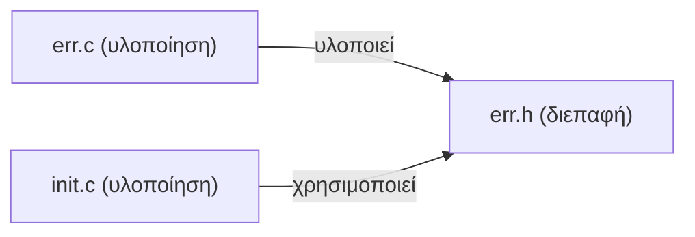
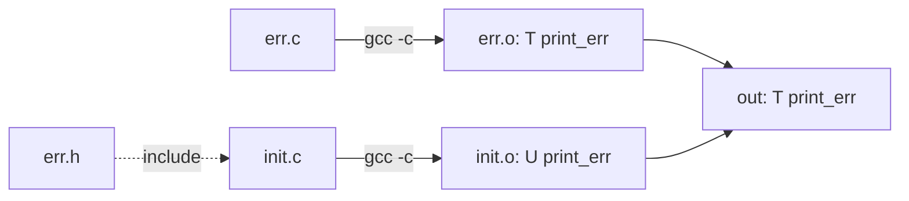

# Κεφάλαιο 23: Οργάνωση Κώδικα

<!--  -->

> **Στόχοι:** μετά από αυτό το κεφάλαιο θα μπορείτε να εξηγείτε γιατί ένα μεγάλο
> πρόγραμμα σπάει σε πολλά αρχεία· να χωρίζετε ένα πρόγραμμα σε αρχεία υλοποίησης
> (`.c`) και αρχεία κεφαλίδας (`.h`)· να μεταγλωττίζετε κάθε αρχείο χωριστά με
> `gcc -c` και να συνδέετε τα αντικειμενικά αρχεία· να γράφετε πρωτότυπα
> συναρτήσεων· και να χρησιμοποιείτε το `const` σε μεταβλητές, δείκτες και
> παραμέτρους.
>
> **Προαπαιτούμενα:** [Κεφάλαιο 3](../03-functions/), [Κεφάλαιο 14](../14-scope-strings/),
> [Κεφάλαιο 15](../15-complexity-preprocessor/)
>
> **Χρόνος μελέτης:** ~1,5 ώρα

## Σύνοψη

Τα προγράμματα που γράφαμε ως τώρα χωρούσαν σε ένα αρχείο· τα πραγματικά
προγράμματα έχουν χιλιάδες ή εκατομμύρια γραμμές κώδικα. Η διάλεξη ξεκινά από το
μέγεθος των προγραμμάτων, μετρημένο σε γραμμές κώδικα, και ρωτά πώς οργανώνουμε
ένα σύστημα 40.000 γραμμών. Η απάντηση είναι η αφαίρεση: χωρίζουμε τον κώδικα σε
αρχεία υλοποίησης και σε αρχεία κεφαλίδας που περιγράφουν τη διεπαφή τους,
μεταγλωττίζουμε κάθε αρχείο χωριστά σε αντικειμενικό αρχείο και τα συνδέουμε στο
τέλος. Επειδή ο μεταγλωττιστής της C διαβάζει τον κώδικα γραμμικά, κάθε συνάρτηση
πρέπει να έχει δηλωθεί με πρωτότυπο πριν κληθεί. Τέλος, ο προσδιοριστής `const`
δηλώνει ότι κάτι δεν αλλάζει και κάνει τις δηλώσεις των συναρτήσεων συμβόλαια με
τους χρήστες τους.

## Θεωρία

### Το μέγεθος ενός προγράμματος: γραμμές κώδικα

Μία από τις βασικές μετρικές για το μέγεθος ενός προγράμματος είναι οι **γραμμές
κώδικα** (lines of code, LOC, ή source lines of code, SLOC): οι εντολές που γράφουμε
μέχρι την αλλαγή γραμμής. Για μεγάλα προγράμματα χρησιμοποιούμε πολλαπλάσια:

1 KLOC $= 10^3$ LOC και 1 MLOC $= 10^6$ LOC.

Με λίγες γραμμές κώδικα μπορούμε να πάρουμε ιδιαίτερα σύνθετα συστήματα: το
Game of Life του Conway (1970) θέλει περίπου 100–200 LOC. Άλλα είναι τεράστια:

| Πρόγραμμα | Έτος | Μέγεθος |
| --- | --- | --- |
| Λογισμικό του Apollo 11 | 1969 | 145 KLOC |
| Windows Vista | 2006 | 50 MLOC |
| Πυρήνας του Linux | σήμερα | πάνω από 40 MLOC |

Ακόμα και οι εργασίες του μαθήματος, όλες μαζί, ξεπερνούν τις 67.000 γραμμές (δείτε
το παράδειγμα «Πόσες γραμμές γράψαμε στις εργασίες»).

### Λύση #1: όλος ο κώδικας σε ένα αρχείο

Ας πούμε ότι υλοποιούμε ένα καινούριο σύστημα και περιμένουμε να έχει ~40 χιλιάδες
γραμμές κώδικα. Η πρώτη ιδέα είναι να τα βάλουμε όλα σε ένα αρχείο C.

| Θετικά | Αρνητικά |
| --- | --- |
| Απλή οργάνωση, εύκολη μεταφορά: όλος ο κώδικας σε ένα μέρος. | Το να ψάχνετε κάτι σε ένα αρχείο με δεκάδες χιλιάδες γραμμές είναι οδυνηρό. |
| Οι ορισμοί όλων των συναρτήσεων είναι προσβάσιμοι στο ίδιο αρχείο. | Αλλάζετε μία γραμμή και πρέπει να ξαναμεταγλωττίσετε τα πάντα. |
| | Η συντήρηση, η αναβάθμιση και η κατανόηση όλου του προγράμματος γίνονται δύσκολες. |

Για τις 100 γραμμές μιας άσκησης αυτό είναι μια χαρά· για 40.000 όχι.

### Αφαίρεση και διάσπαση σε υποπροβλήματα

Η ιδέα που λύνει το πρόβλημα είναι η **αφαίρεση** (abstraction) και η **διάσπαση σε
υποπροβλήματα**. Χωρίζουμε το σύστημα σε κομμάτια, και κάθε κομμάτι δίνει στα
υπόλοιπα μια απλή περιγραφή του *τι* κάνει, κρύβοντας το *πώς* το κάνει. Όποιος
χρησιμοποιεί ένα κομμάτι χρειάζεται να ξέρει μόνο την περιγραφή του. Την ίδια ιδέα
την εφαρμόζουμε ήδη με τις συναρτήσεις ([Κεφάλαιο 3](../03-functions/))· εδώ την
εφαρμόζουμε σε επίπεδο αρχείων.

### Λύση #2: οργάνωση σε πολλά αρχεία

Στη δεύτερη λύση κάθε αρχείο περιέχει μεταβλητές και συναρτήσεις που σχετίζονται
θεματικά, λειτουργικά ή με άλλο κριτήριο. Ένα πρόγραμμα C έχει δύο είδη αρχείων:

- **Αρχεία υλοποίησης** (`.c`, implementation files): ο κώδικας των συναρτήσεων.
- **Αρχεία κεφαλίδας** (`.h`, header files): οι δηλώσεις, δηλαδή τι προσφέρει ένα
  κομμάτι του προγράμματος στα υπόλοιπα.

Για παράδειγμα, η βιβλιοθήκη κρυπτογραφίας [openssl](https://github.com/openssl/openssl/tree/master)
είναι οργανωμένη σε καταλόγους και αρχεία:

```text
├── README.md
├── ssl
│   ├── ssl_init.c
│   ├── event_queue.c
│   ├── ssl_err.c
│   ├── sslerr.h
...
├── test
│   ├── aborttest.c
│   ├── acvp_test.c
...
```

Ο κατάλογος `ssl` κρατά τον κώδικα του πρωτοκόλλου και ο `test` τα τεστ. Ποιος είναι
ο καλύτερος τρόπος να οργανώσετε τον κώδικά σας δεν έχει μία απάντηση· ένας καλός
κανόνας είναι ότι ό,τι αλλάζει μαζί μένει μαζί.

### Εξαρτήσεις: διεπαφή και υλοποίηση

Πάρτε ένα πρόγραμμα με τρία αρχεία. Το `err.c` ορίζει μια συνάρτηση `print_err`, το
`err.h` δηλώνει το πρωτότυπό της, και το `init.c` κάνει `#include "err.h"` και την
καλεί (ο κώδικας είναι στο παράδειγμα «Χωριστή μεταγλώττιση των err.c και init.c»).

Το `err.h` είναι η **διεπαφή** (interface): λέει ότι υπάρχει μια συνάρτηση
`print_err` που παίρνει `char *` και επιστρέφει `int`. Το `err.c` **υλοποιεί** τη
διεπαφή, και το `init.c` τη **χρησιμοποιεί**. Κανένα από τα δύο `.c` δεν χρειάζεται
να ξέρει το άλλο· και τα δύο εξαρτώνται μόνο από το `.h`.



*Σχήμα: το `err.c` υλοποιεί και το `init.c` χρησιμοποιεί τη διεπαφή `err.h`.*

Οι **εξαρτήσεις** (dependencies) απαντούν στο ερώτημα «αν αλλάξω ένα αρχείο, τι
επηρεάζεται;». Αν αλλάξει το σώμα της `print_err` στο `err.c`, το `init.c` δεν
επηρεάζεται, αφού βλέπει μόνο τη διεπαφή. Αν αλλάξει το `err.h`, επηρεάζονται και τα
δύο. Τα αρχεία και οι εξαρτήσεις τους σχηματίζουν έναν **γράφο** (κόμβοι τα αρχεία,
ακμές οι εξαρτήσεις), και αυτόν τον γράφο διαβάζει το `make` για να αποφασίσει τι
πρέπει να ξαναχτιστεί.

### Τα στάδια της μεταγλώττισης

Ο μεταγλωττιστής (`gcc`) παίρνει τον **πηγαίο κώδικα** (source code, π.χ. `hello.c`)
και βγάζει το **δυαδικό πρόγραμμα** (binary program, π.χ. `hello`). Στο εσωτερικό
του η δουλειά γίνεται σε τρία στάδια, και καθένα έχει το δικό του ενδιάμεσο
αποτέλεσμα:


*Σχήμα: από τον πηγαίο κώδικα στο εκτελέσιμο, μέσα από τα τρία στάδια του gcc.*

1. Ο **προεπεξεργαστής** (preprocessor) εκτελεί τις οδηγίες `#include` και `#define`
   ([Κεφάλαιο 15](../15-complexity-preprocessor/)): το `#include "err.h"` αντικαθίσταται
   κυριολεκτικά από το περιεχόμενο του `err.h`.
2. Η **μεταγλώττιση** μετατρέπει τον κώδικα σε εντολές μηχανής και γράφει ένα
   **αντικειμενικό αρχείο** (object file, `.o`).
3. Η **σύνδεση** (linking) ενώνει ένα ή περισσότερα αντικειμενικά αρχεία σε ένα
   εκτελέσιμο.

Όταν γράφουμε `gcc -o hello hello.c` γίνονται και τα τρία μαζί. Με επιλογές τα
χωρίζουμε: το `-c` σταματά μετά τη μεταγλώττιση και αφήνει το `.o`.

### Χωριστή μεταγλώττιση και σύνδεση

Με πολλά αρχεία, κάθε `.c` μεταγλωττίζεται **ανεξάρτητα** σε δικό του `.o`, και μετά
τα `.o` συνδέονται: `gcc -c -o err.o err.c`, `gcc -c -o init.o init.c` και
τέλος `gcc -o out init.o err.o`.



*Σχήμα: χωριστή μεταγλώττιση των δύο `.c` και σύνδεση των `.o` στο `out`.*

Όταν μεταγλωττίζεται το `init.c`, ο μεταγλωττιστής ξέρει από το `err.h` πώς
καλείται η `print_err`, αλλά όχι πού βρίσκεται ο κώδικάς της. Γι' αυτό σημειώνει στο
`init.o` το σύμβολο `print_err` ως **απροσδιόριστο** (`U`, undefined). Στο `err.o` το
ίδιο σύμβολο είναι **ορισμένο** στον κώδικα (`T`, text). Αυτά φαίνονται με το `nm`
([Κεφάλαιο 14](../14-scope-strings/)). Η σύνδεση ταιριάζει κάθε `U` με ένα `T`· στο
τελικό `out` η `print_err` είναι πια `T`. Αν κάποιο `U` δεν βρει ορισμό, η σύνδεση
αποτυγχάνει με `undefined reference`.

### Γιατί χωριστά: η μεταγλώττιση είναι χρονοβόρα

Σε μεγάλα projects, όπως ο πυρήνας του Linux, η μεταγλώττιση μπορεί να πάρει
**ώρες** (ή και μέρες). Σπάζοντας το πρόγραμμα σε αρχεία κερδίζουμε χρόνο: μετά από
μια αλλαγή ξαναμεταγλωττίζουμε μόνο ό,τι χρειάζεται. Αν αλλάξει μόνο το `err.c`,
φτιάχνουμε ξανά το `err.o` και ξανασυνδέουμε· το `init.o` μένει ως έχει. Μετά την
πρώτη μεταγλώττιση οι επόμενες επαναλήψεις είναι συνήθως πολύ γρηγορότερες.

Το να θυμόμαστε τι πρέπει να ξαναφτιαχτεί είναι δουλειά για το εργαλείο `make` και
τα [Makefiles](https://en.wikipedia.org/wiki/Make_(software)): δηλώνουμε τον γράφο
των εξαρτήσεων και το `make` ξαναχτίζει μόνο όσα άλλαξαν. Το `make` το είδαμε στην
προσκεκλημένη διάλεξη ([Παράρτημα](../26-make/)).

### Η μεταγλώττιση είναι γραμμική: πρωτότυπα συναρτήσεων

Ο μεταγλωττιστής της C διαβάζει το αρχείο **μία φορά, από πάνω προς τα κάτω**. Όταν
φτάσει σε μια κλήση, πρέπει να ξέρει ήδη τον τύπο επιστροφής και τα ορίσματα της
συνάρτησης. Αν η συνάρτηση ορίζεται πιο κάτω, ο `gcc` δεν την έχει δει ακόμα και
διαμαρτύρεται με `implicit declaration of function` (δείτε το παράδειγμα
«Κλήση πριν από τον ορισμό»).

Η λύση είναι η **δήλωση πρωτοτύπου συνάρτησης** (function prototype): δηλώνει το
**όνομα** της συνάρτησης, τον **τύπο επιστροφής** της και τα **ορίσματά** της, χωρίς
σώμα, και τελειώνει με `;`.

```c
τύπος όνομα(λίστα_ορισμάτων);   /* γενική μορφή */
int print_err(char * message);
int print_err(char *);          /* τα ονόματα των ορισμάτων παραλείπονται */
```

Τα ονόματα των ορισμάτων δεν χρειάζονται, αφού ο μεταγλωττιστής θέλει μόνο τους
τύπους· συχνά όμως τα κρατάμε γιατί τεκμηριώνουν τι σημαίνει κάθε όρισμα.

Εδώ δένουν όλα: ένα αρχείο κεφαλίδας είναι ουσιαστικά μια λίστα από πρωτότυπα.
Όταν ένα `.c` κάνει `#include "err.h"`, ο προεπεξεργαστής βάζει τα πρωτότυπα στην
αρχή του αρχείου, και έτσι κάθε κλήση που ακολουθεί είναι γνωστή στον
μεταγλωττιστή, αν και ο κώδικας βρίσκεται σε άλλο αρχείο.

### Δηλώσεις και ορισμοί σε πολλά αρχεία

Η διαφάνεια «Σήμερα» αναφέρει δηλώσεις μεταβλητών και συναρτήσεων· οι σημειώσεις και
το [Εργαστήριο 10](https://progintro.github.io/lab-material/labs/lab10/) συμπληρώνουν
τους κανόνες που χρειάζεστε για να σπάσετε σωστά ένα πρόγραμμα:

- Ένας **ορισμός** (definition) δεσμεύει μνήμη ή δίνει κώδικα και υπάρχει **ακριβώς
  μία φορά** σε όλο το πρόγραμμα. Μια **δήλωση** (declaration) απλώς ενημερώνει τον
  μεταγλωττιστή για τον τύπο και μπορεί να επαναλαμβάνεται. Γι' αυτό στα `.h`
  βάζουμε δηλώσεις, όχι κώδικα, και ποτέ δεν κάνουμε `#include` ένα `.c`.
- Μια καθολική μεταβλητή που τη χρειάζονται πολλά αρχεία ορίζεται σε **ένα** `.c`
  (`int sp;`) και δηλώνεται στα υπόλοιπα με `extern int sp;`.
- Το `static` μπροστά σε καθολική μεταβλητή ή συνάρτηση την κάνει ορατή **μόνο στο
  δικό της αρχείο**· έτσι ένα αρχείο κρύβει τις βοηθητικές του λεπτομέρειες.
- Γράφουμε `#include "err.h"` με εισαγωγικά για τα δικά μας αρχεία (αναζήτηση πρώτα
  στον κατάλογο του πηγαίου αρχείου) και `#include <stdio.h>` για τα αρχεία του
  συστήματος.
- Κάθε `.h` προστατεύεται με **include guard**, ώστε αν συμπεριληφθεί δύο φορές στο
  ίδιο `.c` να διαβαστεί μόνο την πρώτη:

```c
#ifndef ERR_H
#define ERR_H
int print_err(char *);
#endif
```

### Ο προσδιοριστής const

Ο **προσδιοριστής `const`** (const qualifier) δηλώνει ότι το περιεχόμενο κάποιων
θέσεων μνήμης είναι σταθερό. Η γενική σύνταξη είναι `const δήλωση_μεταβλητής;`:

```c
const int x = 42;
const char message[] = "Hello";
const char const * msg_ptr = message;
```

Μια `const` μεταβλητή πρέπει να πάρει την τιμή της στη δήλωση, γιατί μετά δεν
επιτρέπεται να αλλάξει. Αν κάτι δηλωθεί ως `const`, **δεν** πρέπει να το αλλάξουμε·
και ο μεταγλωττιστής το ελέγχει: το `x++` δίνει
`error: increment of read-only variable 'x'`.

Στους δείκτες έχει σημασία **πού** γράφεται το `const`. Διαβάστε τη δήλωση από τα
δεξιά προς τα αριστερά:

| Δήλωση | Τι είναι σταθερό | Επιτρέπεται `*p = 'a'`; | Επιτρέπεται `p++`; |
| --- | --- | --- | --- |
| `const char *p` (ή `char const *p`) | οι χαρακτήρες όπου δείχνει | όχι | ναι |
| `char * const p` | ο ίδιος ο δείκτης | ναι | όχι |
| `const char * const p` | και τα δύο | όχι | όχι |

Στο τρίτο παράδειγμα της διαφάνειας, `const char const * msg_ptr`, και τα δύο
`const` βρίσκονται **πριν** από το `*`, άρα αφορούν και τα δύο τους χαρακτήρες: ο
`msg_ptr` είναι δείκτης σε σταθερούς χαρακτήρες, και ο `gcc -Wall` προειδοποιεί
`duplicate 'const' declaration specifier`. Για σταθερό δείκτη σε σταθερούς
χαρακτήρες γράφουμε `const char * const msg_ptr`.

Το `const` δεν είναι μόνο υπόσχεση προς τον μεταγλωττιστή. Ένας καθολικός πίνακας
`const`, όπως το `message`, μπαίνει συνήθως σε μνήμη **μόνο για ανάγνωση**. Αν
«ξεγελάσετε» τον μεταγλωττιστή με ένα cast σε `char *` και γράψετε εκεί, το
πρόγραμμα μεταγλωττίζεται αλλά σκάει με `Segmentation fault` (δείτε το παράδειγμα
«Εγγραφή σε const μνήμη»). Δεν αλλάζουμε `const` θέσεις μνήμης.

### const σε ορισμούς συναρτήσεων: συμβόλαια

Με το `const` στις δηλώσεις συναρτήσεων (ή στα πρωτότυπα) δημιουργούμε
**συμβόλαια** (contracts) με τους χρήστες της συνάρτησης:

```c
int print_err(const char * message);
```

Αυτό το πρωτότυπο εγγυάται ότι η `print_err` **δεν θα αλλάξει** τους χαρακτήρες της
`message`. Όποιος την καλεί μπορεί να της δώσει και σταθερή συμβολοσειρά, χωρίς να
φοβάται ότι θα του την πειράξει· και αν ο κώδικας της `print_err` προσπαθήσει να
γράψει στο `message[0]`, η μεταγλώττιση αποτυγχάνει. Τέτοιες εγγυήσεις κάνουν τους
προγραμματιστές πιο αποδοτικούς και επιτρέπουν στους μεταγλωττιστές να γράφουν πιο
γρήγορο κώδικα. Τις έχετε ήδη συναντήσει στη βιβλιοθήκη: `strlen(const char *s)`,
`strcmp(const char *s1, const char *s2)`.

## Παραδείγματα

### Πόσες γραμμές γράψαμε στις εργασίες

Το εργαλείο `sloccount` μετρά τις γραμμές κώδικα ενός καταλόγου και, με το μοντέλο
COCOMO, εκτιμά πόσο κόστος και χρόνο θα ήθελε η ανάπτυξή τους. Στις υποβολές των
εργασιών του μαθήματος (θέμα «Το μέγεθος ενός προγράμματος»):

```text
$ sloccount hw-submissions/
Total Physical Source Lines of Code (SLOC)                = 67,826
Development Effort Estimate, Person-Years (Person-Months) = 16.75 (200.99)
 (Basic COCOMO model, Person-Months = 2.4 * (KSLOC**1.05))
Schedule Estimate, Years (Months)                         = 1.56 (18.76)
 (Basic COCOMO model, Months = 2.5 * (person-months**0.38))
Estimated Average Number of Developers (Effort/Schedule)  = 10.72
Total Estimated Cost to Develop                           = $ 2,262,599
 (average salary = $56,286/year, overhead = 2.40).
SLOCCount, Copyright (C) 2001-2004 David A. Wheeler
Please credit this data as "generated using David A. Wheeler's 'SLOCCount'."
```

Σχεδόν 68 KLOC: όλες οι εργασίες μαζί είναι μισό Apollo 11.

### Χωριστή μεταγλώττιση των err.c και init.c

Το πρόγραμμα της ενότητας «Εξαρτήσεις: διεπαφή και υλοποίηση», ολοκληρωμένο. Εφαρμόζει
τη «Χωριστή μεταγλώττιση και σύνδεση».

```c
/* err.h */
int print_err(char *);
```

```c
/* err.c */
#include <stdio.h>
#include "err.h"

int print_err(char *msg) {
  return fprintf(stderr, "%s\n", msg);
}
```

```c
/* init.c (does-not-compile χωρίς το err.h δίπλα του) */
#include "err.h"

int main(void) {
  print_err("hi");
  return 0;
}
```

Το `err.c` κάνει κι αυτό `#include "err.h"`: έτσι, αν το πρωτότυπο και ο ορισμός
πάψουν κάποτε να συμφωνούν, ο μεταγλωττιστής θα το δει. Μεταγλωττίζουμε, κοιτάμε τα
σύμβολα και συνδέουμε:

```text
$ gcc -c -o err.o err.c
$ gcc -c -o init.o init.c
$ nm err.o | grep print_err
0000000000000000 T print_err
$ nm init.o | grep print_err
                 U print_err
$ gcc -o out init.o err.o
$ ./out
hi
```

Στο `init.o` η `print_err` είναι `U`· η σύνδεση τη βρίσκει ως `T` στο `err.o`. Αν
ξεχάσετε το `err.o` στη σύνδεση (`gcc -o out init.o`), ο linker δεν βρίσκει ορισμό
και σταματά με `undefined reference to 'print_err'`.

### Κλήση πριν από τον ορισμό

Το `prototype.c` καλεί την `print_err` πριν την ορίσει (θέμα «Η μεταγλώττιση είναι
γραμμική: πρωτότυπα συναρτήσεων»):

```c
// does-not-compile (σε νεότερους gcc)
#include <stdio.h>

int main() {
  print_err("hello");
  return 0;
}
int print_err(char * msg) {
  return fprintf(stderr, "%s\n", msg);
}
```

```text
$ gcc -o prototype prototype.c
prototype.c: In function ‘main’:
prototype.c:4:3: warning: implicit declaration of function ‘print_err’
[-Wimplicit-function-declaration]
    4 |   print_err("hello");
      |   ^~~~~~~~~
```

Στη γραμμή 4 ο `gcc` δεν έχει δει ακόμα την `print_err`. Ο `gcc` των διαφανειών
δίνει προειδοποίηση· ο `gcc` 14 και νεότεροι το θεωρούν **σφάλμα** (`error:` αντί
για `warning:`). Και στις δύο περιπτώσεις η διόρθωση είναι η ίδια: προσθέτουμε το
πρωτότυπο πριν από τη `main`.

```c
#include <stdio.h>
int print_err(char *msg);

int main() {
  print_err("hello");
  return 0;
}
int print_err(char * msg) {
  return fprintf(stderr, "%s\n", msg);
}
```

```text
$ gcc -o prototype prototype.c
$ ./prototype
hello
```

### Αλλαγή μιας const μεταβλητής

Το `const1.c` προσπαθεί να αυξήσει μια `const` μεταβλητή (θέμα «Ο προσδιοριστής
const»):

```c
// does-not-compile
const char message[] = "Hello";
int main() {
  const int x = 42;
  const char const * msg_ptr = message;
  x++;
  return 0;
}
```

```text
$ gcc -o const1 const1.c
const1.c: In function ‘main’:
const1.c:5:4: error: increment of read-only variable ‘x’
    5 |   x++;
      |    ^~
```

Το λάθος πιάνεται **κατά τη μεταγλώττιση**, πριν τρέξει οτιδήποτε. Αυτό είναι το
μεγάλο πλεονέκτημα του `const`.

### Εγγραφή σε const μνήμη

Το `const2.c` παρακάμπτει τον έλεγχο με ένα cast (θέμα «Ο προσδιοριστής const»):

```c
const char message[] = "Hello";
int main() {
  const int x = 42;
  char * bad = (char*)message;
  bad[1] = 'o';
  return 0;
}
```

```text
$ gcc -o const2 const2.c
$ ./const2
Segmentation fault
```

Το `(char*)` λέει στον μεταγλωττιστή «εμπιστέψου με», οπότε η μεταγλώττιση περνά. Ο
πίνακας `message` όμως βρίσκεται σε μνήμη μόνο για ανάγνωση, και η εγγραφή
`bad[1] = 'o'` σκοτώνει το πρόγραμμα. Ένα cast που αφαιρεί το `const` είναι σχεδόν
πάντα λάθος.

## Κύρια σημεία

1. Οι γραμμές κώδικα (LOC, KLOC, MLOC) είναι μια βασική μετρική για το μέγεθος ενός
   προγράμματος· τα πραγματικά συστήματα έχουν από χιλιάδες ως δεκάδες εκατομμύρια
   γραμμές.
2. Όλος ο κώδικας σε ένα αρχείο είναι απλός, αλλά σε μεγάλα προγράμματα κάνει την
   αναζήτηση, τη συντήρηση και τη μεταγλώττιση αργές και δύσκολες.
3. Η αφαίρεση και η διάσπαση σε υποπροβλήματα οδηγούν σε πολλά αρχεία: τα `.c`
   περιέχουν την υλοποίηση και τα `.h` τη διεπαφή.
4. Ένα `.c` που υλοποιεί μια διεπαφή και ένα `.c` που τη χρησιμοποιεί εξαρτώνται μόνο
   από το `.h`· οι εξαρτήσεις σχηματίζουν γράφο που δείχνει τι επηρεάζει μια αλλαγή.
5. Ο `gcc` περνά από προεπεξεργασία, μεταγλώττιση σε αντικειμενικό αρχείο και σύνδεση.
6. Με `gcc -c` κάθε `.c` γίνεται χωριστά `.o`· η σύνδεση ταιριάζει τα απροσδιόριστα
   σύμβολα (`U`) με τους ορισμούς τους (`T`).
7. Η χωριστή μεταγλώττιση γλιτώνει χρόνο, γιατί μετά από μια αλλαγή ξαναφτιάχνουμε
   μόνο ό,τι χρειάζεται· αυτό αυτοματοποιεί το `make`.
8. Η μεταγλώττιση στη C είναι γραμμική: μια συνάρτηση πρέπει να έχει δηλωθεί με
   πρωτότυπο (όνομα, τύπος επιστροφής, ορίσματα) πριν κληθεί· τα ονόματα των
   ορισμάτων παραλείπονται.
9. Το `const` δηλώνει ότι μια θέση μνήμης δεν αλλάζει· ο μεταγλωττιστής απορρίπτει
   την αλλαγή, και η παράκαμψή του με cast μπορεί να δώσει `Segmentation fault`.
10. Το `const` στις παραμέτρους μιας συνάρτησης είναι συμβόλαιο με τους χρήστες της
    και βοηθά και τον προγραμματιστή και τον μεταγλωττιστή.

## Ορολογία

| Ελληνικά | English | Σύντομος ορισμός |
| --- | --- | --- |
| γραμμή κώδικα | line of code (LOC / SLOC) | Εντολές μέχρι την αλλαγή γραμμής· μετρική μεγέθους. |
| αφαίρεση | abstraction | Περιγραφή του τι κάνει ένα κομμάτι, κρύβοντας το πώς. |
| αρχείο υλοποίησης | implementation file (`.c`) | Περιέχει τον κώδικα των συναρτήσεων. |
| αρχείο κεφαλίδας | header file (`.h`) | Περιέχει δηλώσεις: τη διεπαφή ενός κομματιού. |
| διεπαφή | interface | Τι προσφέρει ένα κομμάτι του προγράμματος στα άλλα. |
| εξάρτηση | dependency | Ένα αρχείο χρειάζεται ένα άλλο για να χτιστεί. |
| αντικειμενικό αρχείο | object file (`.o`) | Αποτέλεσμα μεταγλώττισης ενός `.c` με `gcc -c`. |
| σύνδεση | linking | Ένωση αντικειμενικών αρχείων σε εκτελέσιμο. |
| πρωτότυπο συνάρτησης | function prototype | Όνομα, τύπος επιστροφής και ορίσματα, χωρίς σώμα. |
| δήλωση / ορισμός | declaration / definition | Ενημερώνει για τον τύπο / δεσμεύει μνήμη ή δίνει κώδικα. |
| include guard | include guard | `#ifndef`/`#define`/`#endif` γύρω από ένα `.h`. |
| προσδιοριστής const | const qualifier | Δηλώνει ότι μια θέση μνήμης δεν αλλάζει. |
| συμβόλαιο | contract | Εγγύηση που δίνει η δήλωση μιας συνάρτησης στους χρήστες της. |

## Συχνά λάθη

- **Κλήση πριν από τη δήλωση.** `implicit declaration of function 'print_err'`
  (προειδοποίηση ή, στον `gcc` 14+, σφάλμα). Βάλτε πρωτότυπο πριν από την κλήση ή
  κάντε `#include` το `.h` που το περιέχει.
- **Ξεχασμένο `.o` στη σύνδεση.** `gcc -o out init.o` δίνει
  `undefined reference to 'print_err'`. Δώστε στη σύνδεση όλα τα `.o`.
- **Κώδικας ή ορισμός μεταβλητής μέσα σε `.h`.** Αν δύο `.c` κάνουν `#include` ένα
  `.h` με `int count = 0;`, η σύνδεση λέει `multiple definition of 'count'`. Στο `.h`
  βάλτε `extern int count;` και τον ορισμό σε ένα `.c`.
- **`#include` ενός `.c`.** Ο κώδικας αντιγράφεται σε δύο αρχεία και ορίζεται δύο
  φορές. Κάνετε `#include` μόνο `.h`.
- **`#include <err.h>` για δικό σας αρχείο.** `fatal error: err.h: No such file or
  directory`: τα δικά σας αρχεία θέλουν εισαγωγικά, `#include "err.h"`.
- **Αλλαγή μιας `const` μεταβλητής.** `error: increment of read-only variable 'x'`.
  Αν η τιμή πρέπει να αλλάζει, μην τη δηλώνετε `const`.
- **Cast για να αφαιρεθεί το `const`.** Το `(char*)message` μεταγλωττίζεται, αλλά η
  εγγραφή δίνει `Segmentation fault`.
- **`const` στη λάθος θέση.** Το `const char const *p` δεν κάνει σταθερό τον δείκτη
  (`duplicate 'const'`)· για σταθερό δείκτη γράψτε `char * const p`.

## Διάβασμα

- **Διαφάνειες:** [Διάλεξη 23](https://github.com/progintro/progintro.github.io/releases/download/2025/lec23.pdf),
  σελ. 1–27: γραμμές κώδικα 5–10· ένα ή πολλά αρχεία 11–14· εξαρτήσεις και χωριστή
  μεταγλώττιση 15–18· πρωτότυπα 19–21· `const` 22–25· αναφορές 26.
- **Σημειώσεις:** η διάλεξη σημειώνει ότι με αυτήν έχει καλυφθεί όλη η ύλη των
  διαφανειών του κ. Σταματόπουλου. Για τα θέματα της διάλεξης:
  - [Κεφάλαιο 4](https://progintro.github.io/notes/chapters/04-functions/): «Δομή ενός
    προγράμματος C – Συναρτήσεις» (K04, σελ. 59–61) για τα πρωτότυπα· «Εμβέλεια και
    χρόνος ζωής μεταβλητών» (64–69) για `extern` και `static` σε πολλά αρχεία.
  - [Κεφάλαιο 2](https://progintro.github.io/notes/chapters/02-types-operators/):
    «Μεταβλητές, σταθερές, τύποι και δηλώσεις στην C» (K04, σελ. 31–34) για το `const`.
  - [Κεφάλαιο 6](https://progintro.github.io/notes/chapters/06-memory-strings/):
    «Συμβολοσειρές» (K04, σελ. 93–96) για τις παραμέτρους `const char *` της βιβλιοθήκης.
  - [Κεφάλαιο 10](https://progintro.github.io/notes/chapters/10-preprocessor/): «Ο
    προεπεξεργαστής της C» (K04, σελ. 155–160) για το `#include` και το `#ifndef`.
  - [Κεφάλαιο 12](https://progintro.github.io/notes/chapters/12-good-practice/): «Ένα
    πρόγραμμα C πρέπει να είναι …» (K04, σελ. 179).
- **Εργαστήριο:** [Εργαστήριο 10](https://progintro.github.io/lab-material/labs/lab10/):
  «Παράρτημα: Οργάνωση προγράμματος σε πολλαπλά αρχεία» και Άσκηση 5 (`more.c` σε
  `pager.c`/`pager.h`)· [Εργαστήριο 1](https://progintro.github.io/lab-material/labs/lab01/):
  ασκήσεις 9–11 (`gcc -c` και σύνδεση με το `myfunct.o`).
- **Άλλα:** [Make (software)](https://en.wikipedia.org/wiki/Make_(software))
  (Wikipedia)· [openssl](https://github.com/openssl/openssl/tree/master) ως παράδειγμα
  οργάνωσης· [Lines of Code Written](https://medium.com/modern-stack/how-much-computer-code-has-been-written-c8c03100f459)·
  [Linux Kernel surpasses 40MLOC](https://www.stackscale.com/blog/linux-kernel-surpasses-40-million-lines-code/)·
  `man nm`.

## Ασκήσεις

<!-- exercises -->
<!-- /exercises -->

## Ερωτήσεις αυτοαξιολόγησης

1. Αναφέρετε ένα θετικό και δύο αρνητικά του να είναι όλος ο κώδικας σε ένα
   αρχείο.[^q1]
2. Τι περιέχει ένα αρχείο `.h` και τι ένα `.c`;[^q2]
3. Τι σημαίνουν τα `T` και `U` στην έξοδο του `nm` και τι κάνει μαζί τους η
   σύνδεση;[^q3]
4. Αλλάζετε μόνο το σώμα μιας συνάρτησης στο `err.c`. Ποια αρχεία πρέπει να
   ξαναμεταγλωττιστούν;[^q4]
5. Γιατί χρειάζεται πρωτότυπο μια συνάρτηση που ορίζεται κάτω από τη `main`;[^q5]
6. Ποια είναι η διαφορά ανάμεσα σε `const char *p` και `char * const p`;[^q6]

[^q1]: Θετικό: απλή οργάνωση και μεταφορά. Αρνητικά: δύσκολη αναζήτηση και
    συντήρηση· κάθε αλλαγή ξαναμεταγλωττίζει τα πάντα.

[^q2]: Το `.h` δηλώσεις (πρωτότυπα, τη διεπαφή)· το `.c` τον κώδικα των συναρτήσεων.

[^q3]: `T`: σύμβολο ορισμένο στον κώδικα του αρχείου· `U`: σύμβολο που χρησιμοποιείται
    αλλά ορίζεται αλλού. Η σύνδεση ταιριάζει κάθε `U` με ένα `T`.

[^q4]: Μόνο το `err.c` σε `err.o`, και μετά ξανά η σύνδεση.

[^q5]: Ο μεταγλωττιστής διαβάζει γραμμικά και στην κλήση πρέπει να ξέρει ήδη τον τύπο
    επιστροφής και τα ορίσματα.

[^q6]: Στο πρώτο δεν αλλάζουν οι χαρακτήρες (ο δείκτης αλλάζει)· στο δεύτερο δεν
    αλλάζει ο δείκτης (οι χαρακτήρες αλλάζουν).

<!--  -->
