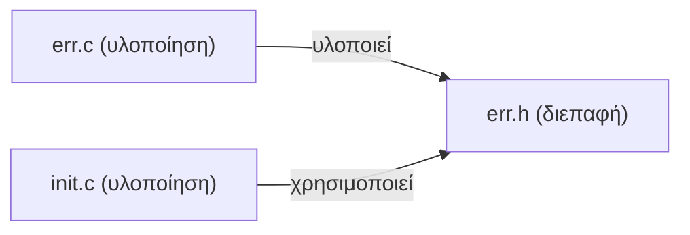
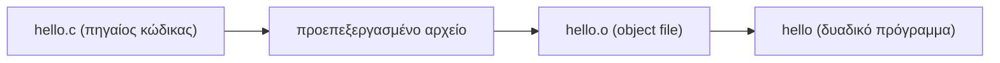

# Κεφάλαιο 24: Προχωρημένα Θέματα

<!--  -->

> **Στόχοι:** μετά από αυτό το κεφάλαιο θα μπορείτε να εξηγείτε γιατί τα μεγάλα
> προγράμματα σπάνε σε πολλά αρχεία `.c` και `.h` και πώς αυτά μεταγλωττίζονται και
> συνδέονται· να γράφετε πρωτότυπα συναρτήσεων και δηλώσεις `extern`· να
> χρησιμοποιείτε το `const` ως συμβόλαιο· να δηλώνετε και να καλείτε δείκτες σε
> συναρτήσεις και variadic συναρτήσεις· και να αναγνωρίζετε τα `volatile`,
> `register`, `restrict`, `auto`, τις δυαδικές σταθερές, το IEEE 754, τις `exec*` /
> `system` και τις βασικές εντολές του `gdb`.
>
> **Προαπαιτούμενα:** [Κεφάλαιο 3](../03-functions/), [Κεφάλαιο 14](../14-scope-strings/),
> [Κεφάλαιο 23](../23-code-organization/)
>
> **Χρόνος μελέτης:** ~2,5 ώρες

## Σύνοψη

Η τελευταία θεωρητική διάλεξη πριν τα Χριστούγεννα ξεκινά από το μέγεθος των
προγραμμάτων: από το Game of Life με μερικές εκατοντάδες γραμμές ως τα
Windows Vista με 50 εκατομμύρια. Ένα σύστημα δεκάδων χιλιάδων γραμμών δεν χωρά
λογικά σε ένα αρχείο, οπότε το σπάμε σε αρχεία υλοποίησης (`.c`) και αρχεία
κεφαλίδας (`.h`), τα μεταγλωττίζουμε χωριστά και τα συνδέουμε. Αυτό απαιτεί
δηλώσεις: πρωτότυπα συναρτήσεων, `extern` για μεταβλητές, `const` για να
υποσχεθούμε τι δεν αλλάζει. Το δεύτερο μισό είναι μια περιήγηση σε «προχωρημένα»
εργαλεία της C: δείκτες σε συναρτήσεις, variadic συναρτήσεις όπως η `printf`,
δυαδικές σταθερές, το πρότυπο IEEE 754, εκτέλεση άλλων προγραμμάτων, οι
προσδιοριστές `volatile`, `register`, `restrict` και `auto`, και ο debugger `gdb`.

## Θεωρία

<a id="s24-1"></a><a id="γραμμές-κώδικα-loc"></a>

### §24.1 Γραμμές κώδικα (LOC)

Μια βασική μετρική για το μέγεθος ενός προγράμματος είναι οι **γραμμές κώδικα
(Lines of Code, LOC ή Source Lines of Code, SLOC)**: οι εντολές που γράφουμε μέχρι
την αλλαγή γραμμής. Για μεγάλα μεγέθη χρησιμοποιούμε πολλαπλάσια:
1 KLOC = $10^3$ LOC και 1 MLOC = $10^6$ LOC.

| Σύστημα | Έτος | Μέγεθος |
| --- | --- | --- |
| Conway's Game of Life | 1970 | ~100–200 LOC |
| Λογισμικό του Apollo 11 | 1969 | 145 KLOC |
| Windows Vista | 2006 | 50 MLOC |

Το Game of Life δείχνει ότι με λίγες γραμμές κώδικα παίρνουμε ιδιαίτερα σύνθετη
συμπεριφορά. Τα άλλα δύο δείχνουν ότι τα πραγματικά συστήματα είναι τάξεις μεγέθους
μεγαλύτερα από τις ασκήσεις μας, και αυτό αλλάζει τον τρόπο που τα οργανώνουμε.

<a id="s24-2"></a><a id="όλος-ο-κώδικας-σε-ένα-αρχείο"></a>

### §24.2 Όλος ο κώδικας σε ένα αρχείο;

Ας πούμε ότι φτιάχνουμε ένα νέο σύστημα και περιμένουμε περίπου 40.000 γραμμές
κώδικα. Η πρώτη λύση είναι να τα βάλουμε όλα σε ένα αρχείο `.c`.

| Θετικά | Αρνητικά |
| --- | --- |
| Απλή οργάνωση, εύκολη μεταφορά: όλος ο κώδικας σε ένα μέρος. | Το ψάξιμο σε αρχείο με δεκάδες χιλιάδες γραμμές είναι οδυνηρό. |
| Οι ορισμοί όλων των συναρτήσεων είναι προσβάσιμοι στο ίδιο αρχείο. | Αλλάζετε μία γραμμή και πρέπει να μεταγλωττίσετε τα πάντα. |
| | Η συντήρηση, η αναβάθμιση και η κατανόηση όλου του προγράμματος γίνονται δύσκολες. |

<a id="s24-3"></a><a id="αφαίρεση-και-οργάνωση-σε-πολλά-αρχεία"></a>

### §24.3 Αφαίρεση και οργάνωση σε πολλά αρχεία

Η ιδέα που λύνει το πρόβλημα είναι η **αφαίρεση (abstraction)** και η **διάσπαση σε
υποπροβλήματα**: χωρίζουμε το σύστημα σε κομμάτια, και καθένα κρύβει τις λεπτομέρειές
του πίσω από ένα απλό σύνολο συναρτήσεων. Στην C αυτό σημαίνει **οργάνωση του κώδικα
σε πολλά αρχεία**. Κάθε αρχείο περιέχει μεταβλητές και συναρτήσεις που σχετίζονται
θεματικά, λειτουργικά ή με κάποιο άλλο κριτήριο. Για παράδειγμα, το αποθετήριο του
[openssl](https://github.com/openssl/openssl/tree/master) έχει έναν κατάλογο `ssl/`
με αρχεία όπως `ssl_init.c`, `event_queue.c`, `ssl_err.c` και `sslerr.h`, κι έναν
κατάλογο `test/` με αρχεία όπως `aborttest.c` και `acvp_test.c`. Τα **αρχεία
υλοποίησης (`.c`)** έχουν τους ορισμούς συναρτήσεων και μεταβλητών· τα **αρχεία
κεφαλίδας (header files, `.h`)** έχουν τις δηλώσεις που χρειάζονται τα άλλα αρχεία
για να τις χρησιμοποιήσουν.

<a id="s24-4"></a><a id="εξαρτήσεις-διεπαφή-και-υλοποίηση"></a>

### §24.4 Εξαρτήσεις: διεπαφή και υλοποίηση

Πάρτε τρία αρχεία. Το `err.c` ορίζει τη συνάρτηση `int print_err(char *msg)`, το
`err.h` περιέχει μόνο τη δήλωσή της `int print_err(char *);`, και το `init.c` κάνει
`#include "err.h"` και καλεί `print_err("hi")`. Το `err.h` είναι η **διεπαφή
(interface)**: λέει *τι* προσφέρεται. Το `err.c` την **υλοποιεί** και το `init.c` τη
**χρησιμοποιεί**.



*Σχήμα: οι εξαρτήσεις (dependencies) ανάμεσα σε δύο αρχεία υλοποίησης και μια διεπαφή.*

Οι **εξαρτήσεις (dependencies)** απαντούν στο «αν αλλάξω ένα αρχείο, τι επηρεάζεται;».
Αν αλλάξει το σώμα της `print_err` στο `err.c`, το `init.c` δεν χρειάζεται καμία
αλλαγή, αφού ξέρει μόνο τη διεπαφή. Αν όμως αλλάξει το `err.h`, επηρεάζονται όλα
τα αρχεία που το κάνουν `#include`. Τα αρχεία και οι εξαρτήσεις τους σχηματίζουν
έναν γράφο.

<a id="s24-5"></a><a id="μεταγλώττιση-με-πολλά-αρχεία"></a>

### §24.5 Μεταγλώττιση με πολλά αρχεία

Ο `gcc` περνά τον πηγαίο κώδικα από τρία στάδια: τον προεπεξεργαστή, που βγάζει το
**προεπεξεργασμένο αρχείο (preprocessed file)**· τη μεταγλώττιση, που βγάζει το
**αντικειμενικό αρχείο (object file)**· και τη **σύνδεση (linking)**, που βγάζει το
τελικό **δυαδικό πρόγραμμα (binary)**.



*Σχήμα: τα στάδια της μεταγλώττισης μέσα στον `gcc`.*

Με πολλά αρχεία κάνουμε τα στάδια χωριστά. Η σημαία `-c` σταματά πριν τη σύνδεση
και γράφει ένα `.o` για κάθε `.c` (`gcc -c -o err.o err.c`)· μια τελευταία κλήση,
`gcc -o out init.o err.o`, **συνδέει** τα αντικειμενικά αρχεία. Κάθε αντικειμενικό αρχείο έχει έναν πίνακα συμβόλων. Στο `err.o` το `print_err`
σημειώνεται `T` (ορίζεται εδώ, στον κώδικα), ενώ στο `init.o` σημειώνεται `U`
(undefined: χρησιμοποιείται αλλά ορίζεται αλλού). Ο linker ταιριάζει κάθε `U` με
ένα `T`, και στο `out` το `print_err` είναι πια `T`.

Η μεταγλώττιση είναι **χρονοβόρα διαδικασία**: σε μεγάλα έργα όπως ο πυρήνας του
Linux μπορεί να πάρει ώρες (ή και μέρες!). Όταν το πρόγραμμα είναι σπασμένο σε
αρχεία, μετά από κάθε αλλαγή ξαναμεταγλωττίζουμε μόνο ό,τι χρειάζεται (αυτό
αυτοματοποιεί το [make](https://en.wikipedia.org/wiki/Make_(software)), βλ.
[Παράρτημα](../26-make/)). Έτσι, μετά την πρώτη μεταγλώττιση, οι επόμενες είναι
συνήθως πολύ γρηγορότερες.

<a id="s24-6"></a><a id="πρωτότυπα-συναρτήσεων"></a>

### §24.6 Πρωτότυπα συναρτήσεων

Η μεταγλώττιση στην C είναι **γραμμική διαδικασία**: ο μεταγλωττιστής διαβάζει το
αρχείο από πάνω προς τα κάτω και, όταν συναντά μια κλήση, πρέπει να ξέρει ήδη πώς
μοιάζει η συνάρτηση. Αν τον ορισμό τον βρει πιο κάτω (ή σε άλλο αρχείο), δίνει
προειδοποίηση για **implicit declaration**.

Η λύση είναι η **δήλωση πρωτοτύπου (function prototype)**. Καθορίζει το **όνομα** της
συνάρτησης, τον **τύπο επιστροφής** της και τα **ορίσματά** της, χωρίς σώμα:

```text
τύπος όνομα(λίστα_ορισμάτων);
```

```c
int print_err(char * message);
int print_err(char *);          // τα ονόματα των ορισμάτων παραλείπονται
```

Τα ονόματα των ορισμάτων μπορούν να παραλειφθούν: για να ελέγξει μια κλήση, ο
μεταγλωττιστής χρειάζεται μόνο τους τύπους. Αυτές ακριβώς οι δηλώσεις γεμίζουν
τα αρχεία κεφαλίδας.

<a id="s24-7"></a><a id="ο-προσδιοριστής-const"></a>

### §24.7 Ο προσδιοριστής `const`

Ο **προσδιοριστής `const` (const qualifier)** δηλώνει ότι το περιεχόμενο κάποιων
θέσεων μνήμης είναι σταθερό. Η σύνταξη είναι `const δήλωση_μεταβλητής;`:

```c
const int x = 42;
const char message[] = "Hello";
const char * const msg_ptr = message;
```

Η τρίτη δήλωση διαβάζεται από δεξιά προς τα αριστερά: το `msg_ptr` είναι σταθερός
δείκτης (`* const`) προς σταθερούς χαρακτήρες (`const char`). Δεν αλλάζει ούτε ο
δείκτης ούτε οι χαρακτήρες όπου δείχνει. Αν γράφαμε μόνο `const char *p`, θα
μπορούσαμε να κάνουμε το `p` να δείχνει αλλού, αλλά όχι να αλλάξουμε τους χαρακτήρες
μέσω του `p`.

Ό,τι δηλωθεί `const` **δεν** πρέπει να το αλλάξουμε. Ο μεταγλωττιστής το ελέγχει: το
`x++` σε `const int` είναι σφάλμα μεταγλώττισης. Μπορούμε να «ξεγελάσουμε» τον
μεταγλωττιστή με μετατροπή τύπου (cast) σε `char *`, αλλά αυτό δεν κάνει τη μνήμη
εγγράψιμη: ένα καθολικό `const` συνήθως μπαίνει σε περιοχή μόνο για ανάγνωση, και
η εγγραφή εκεί δίνει `Segmentation fault`.

Η μεγάλη χρησιμότητα του `const` είναι στις δηλώσεις συναρτήσεων: εκεί δημιουργεί
**συμβόλαιο (contract)** με όσους καλούν τη συνάρτηση. Το

```c
int print_err(const char * message);
```

εγγυάται ότι η `print_err` δεν θα αλλάξει τους χαρακτήρες της `message`. Τέτοιες
εγγυήσεις κάνουν τους προγραμματιστές πιο αποδοτικούς (ξέρουν τι δεν θα
πειραχτεί) και επιτρέπουν στους μεταγλωττιστές να γράφουν πιο γρήγορο κώδικα.
Γι' αυτό η βιβλιοθήκη γράφει `strlen(const char *s)` και `strcpy(char *s1, const
char *s2)` ([Κεφάλαιο 14](../14-scope-strings/)).

<a id="s24-8"></a><a id="εξωτερικές-μεταβλητές-extern"></a>

### §24.8 Εξωτερικές μεταβλητές: `extern`

Ο **προσδιοριστής `extern`** μάς επιτρέπει να δηλώσουμε και να χρησιμοποιήσουμε μια
μεταβλητή που **ορίζεται σε άλλο αρχείο**. Ο ορισμός (που δεσμεύει τη μνήμη) γίνεται
σε ακριβώς ένα αρχείο· οι υπόλοιποι βλέπουν μια δήλωση `extern`, συνήθως μέσω της
κεφαλίδας:

| Αρχείο | Περιεχόμενο | Ρόλος |
| --- | --- | --- |
| `err.c` | `int error_counter;` | ορισμός: εδώ δεσμεύεται η μνήμη |
| `err.h` | `extern int error_counter;` | δήλωση: «υπάρχει κάπου αλλού» |
| `init.c` | `#include "err.h"` … `error_counter++;` | χρήση |

Το `extern` κάνει για τις μεταβλητές ό,τι κάνει το πρωτότυπο για τις συναρτήσεις.
Οι καθολικές μεταβλητές, όμως, θέλουν φειδώ: όσο περισσότερα αρχεία τις αλλάζουν,
τόσο δυσκολότερα καταλαβαίνει κανείς το πρόγραμμα
([Κεφάλαιο 14](../14-scope-strings/) για εμβέλεια και `static`).

<a id="s24-9"></a><a id="δείκτες-σε-συναρτήσεις"></a>

### §24.9 Δείκτες σε συναρτήσεις

Όπως έχουμε δείκτες σε δεδομένα, μπορούμε να έχουμε και **δείκτες σε συναρτήσεις
(function pointers)**. Ο κώδικας είναι κι αυτός δεδομένα στη μνήμη (δείτε τον με
`objdump -d`), άρα έχει διεύθυνση. Η γενική μορφή είναι:

```text
τύπος (*όνομα_δείκτη)(λίστα_ορισμάτων);
```

```c
int (*myprint)(char *message);
```

Διαβάζεται: η `myprint` είναι δείκτης σε συνάρτηση που επιστρέφει `int` και παίρνει
ένα όρισμα τύπου `char *`. Οι παρενθέσεις γύρω από το `*myprint` είναι απαραίτητες:
το `int *myprint(char *);` θα δήλωνε *συνάρτηση* που επιστρέφει `int *`.

Στον δείκτη αναθέτουμε το όνομα μιας συνάρτησης με συμβατό τύπο (`myprint =
print_err;`) και τον καλούμε σαν συνάρτηση, `myprint("...")`, ή ισοδύναμα
`(*myprint)("...")`. Έτσι μια συνάρτηση επιλέγεται κατά την εκτέλεση: το
`sorting.c` των σημειώσεων διαλέγει με ένα `switch` ποια συνάρτηση ταξινόμησης
θα καλέσει μέσω του `void (*fun)(int, double *)`, και η `qsort` παίρνει τη
συνάρτηση σύγκρισης ως όρισμα ([Κεφάλαιο 17](../17-binary-search-sorting/)).

<a id="s24-10"></a><a id="variadic-συναρτήσεις"></a>

### §24.10 Variadic συναρτήσεις

Συναρτήσεις με **μεταβαλλόμενο αριθμό ορισμάτων** λέγονται **variadic**. Τον
μεταβλητό αριθμό ορισμάτων τον δηλώνουμε με την **έλλειψη (ellipsis)** `...`, μετά
από τουλάχιστον ένα κανονικό όρισμα:

```c
int printf(const char * format, ...);
int scanf(const char * format, ...);
```

Για να διατρέξουμε τα ορίσματα χρησιμοποιούμε τα «μαγικά» εργαλεία της `stdarg.h`:

- `va_list args;` είναι ο «δρομέας» πάνω στα ορίσματα·
- `va_start(args, last)` τον ξεκινά μετά το τελευταίο κανονικό όρισμα `last`·
- `va_arg(args, int)` επιστρέφει το επόμενο όρισμα, ερμηνευμένο ως `int`·
- `va_end(args)` τελειώνει τη διάσχιση.

Η συνάρτηση δεν μαθαίνει μόνη της πόσα ορίσματα πήρε ή τι τύπου είναι: πρέπει να της
το πει κάποιο κανονικό όρισμα. Η `printf` το βρίσκει από το format string
(ένα `%d` σημαίνει «επόμενο όρισμα `int`»)· το παράδειγμα `sum` παρακάτω παίρνει
πρώτα το πλήθος. Όταν δεν ξέρετε τι κάνουν, `man stdarg`.

<a id="s24-11"></a><a id="δυαδικές-σταθερές"></a>

### §24.11 Δυαδικές σταθερές

Εκτός από δεκαδικές (`42`) και δεκαεξαδικές (`0x2a`) σταθερές, η C2X (C23) δέχεται
και **δυαδικές σταθερές (binary literals)** με πρόθεμα `0b`: το `0b101010` είναι
$32 + 8 + 2 = 42$. Ο `gcc` τις δεχόταν ήδη ως επέκταση.

<a id="s24-12"></a><a id="αριθμοί-κινητής-υποδιαστολής-ieee-754"></a>

### §24.12 Αριθμοί κινητής υποδιαστολής: IEEE 754

Με πεπερασμένο πλήθος bit ($2^n$, π.χ. 32 ή 64) μπορούμε να αναπαραστήσουμε μόνο
ένα **υποσύνολο** των πραγματικών αριθμών. Συνήθως χρησιμοποιούμε το πρότυπο
[IEEE 754](https://en.wikipedia.org/wiki/IEEE_754). Ένας `double` (64 bit) χωρίζεται
έτσι:

| Πεδίο | Bit | Ρόλος |
| --- | --- | --- |
| Πρόσημο (sign) | 1 | 0 για θετικό, 1 για αρνητικό |
| Εκθέτης (exponent) | 11 | η δύναμη του 2 |
| Mantissa (significand) | 52 | τα σημαντικά ψηφία, ο αριθμός που πολλαπλασιάζεται με $2^{\text{εκθέτη}}$ |

Επειδή η mantissa έχει σταθερό πλήθος bit, η ακρίβεια είναι πεπερασμένη και πολλοί
αριθμοί (π.χ. το 0.1) αποθηκεύονται κατά προσέγγιση
([Κεφάλαιο 5](../05-operators-statements/)). Με τον
[διαδραστικό μετατροπέα](https://www.h-schmidt.net/FloatConverter/IEEE754.html)
βλέπετε τα bit οποιουδήποτε `float`.

<a id="s24-13"></a><a id="εκτέλεση-άλλων-προγραμμάτων-exec-και-system"></a>

### §24.13 Εκτέλεση άλλων προγραμμάτων: `exec*` και `system`

Οποιοδήποτε πρόγραμμα μπορούμε να τρέξουμε από τον φλοιό (shell) του Linux, μπορούμε
να το τρέξουμε και από ένα πρόγραμμα C:

- Η οικογένεια [`exec*`](https://en.wikipedia.org/wiki/Exec_(system_call)) της
  `unistd.h` (π.χ. `execl`) **αντικαθιστά** το τρέχον πρόγραμμα με ένα άλλο. Στην
  `execl` δίνουμε τη διαδρομή του εκτελέσιμου και μετά τα ορίσματα που θα δει ως
  `argv` (πρώτο το `argv[0]`), τερματισμένα με `NULL`. Αν πετύχει, δεν επιστρέφει.
- Η `system` της `stdlib.h` δίνει ένα ολόκληρο string εντολής στον φλοιό και
  περιμένει να τελειώσει, όπως αν την πληκτρολογούσαμε.

<a id="s24-14"></a><a id="οι-προσδιοριστές-volatile-register-restrict-και-auto"></a>

### §24.14 Οι προσδιοριστές `volatile`, `register`, `restrict` και `auto`

Οι διαφάνειες τους παρουσιάζουν ως type qualifiers· αυστηρά, τα `volatile` και
`restrict` είναι qualifiers όπως το `const`, ενώ τα `register` και `auto` είναι
storage-class specifiers. Και οι τέσσερις είναι λέξεις-κλειδιά της C.

- **`volatile`:** κάθε ανάγνωση και εγγραφή της μεταβλητής είναι **παρατηρήσιμη**. Ο
  compiler δεν επιτρέπεται να κρατήσει την τιμή σε register, να αφαιρέσει
  προσπελάσεις ή να αναδιατάξει reads/writes. Χρειάζεται όταν η τιμή αλλάζει εκτός
  ελέγχου του προγράμματος, όπως στο **memory-mapped I/O**, όπου μια «μεταβλητή»
  είναι στην πραγματικότητα καταχωρητής μιας συσκευής.
- **`register`:** υπόδειξη στον compiler να κρατήσει τη μεταβλητή σε **καταχωρητή
  (register)** της CPU. Απαγορεύει τη λήψη διεύθυνσης (`&var`). Οι σύγχρονοι
  compilers το αγνοούν, γιατί κάνουν καλύτερο register allocation μόνοι τους· οι
  διαφάνειες το σημειώνουν ως deprecated στη C23.
- **`restrict` (από τη C99):** υπόδειξη ότι ένας δείκτης είναι ο **μόνος τρόπος
  πρόσβασης** στο αντικείμενο και καμία άλλη αναφορά δεν δείχνει στην ίδια μνήμη.
  Έτσι δηλώνεται η `strcpy`:
  `char * strcpy(char * restrict s1, const char * restrict s2);`. Αν περάσουμε τον
  ίδιο πίνακα και στα δύο ορίσματα, παραβιάζουμε την υπόσχεση· ο `gcc` με
  `-Wrestrict` το εντοπίζει.
- **`auto`:** δηλώνει **automatic storage duration** για μεταβλητές μέσα σε blocks.
  Είναι ήδη το default, οπότε το `auto int x = 42;` ισοδυναμεί με `int x = 42;`
  και σπάνια το βλέπουμε.

<a id="s24-15"></a><a id="debugging-με-gdb"></a>

### §24.15 Debugging με `gdb`

Ο **debugger `gdb`** τρέχει το πρόγραμμα ελεγχόμενα, ώστε να το σταματάμε και να
κοιτάμε μέσα του. Τα βήματα:

1. Μεταγλώττιση με πληροφορίες αποσφαλμάτωσης: `gcc -g -ggdb -o prog prog.c`.
2. Εκκίνηση, με τα ορίσματα του προγράμματος: `gdb --args ./program arg1 arg2`.
3. Έλεγχος της εκτέλεσης: `run` (ξεκίνα), `break` (σημείο διακοπής σε συνάρτηση ή
   γραμμή), `step` (μία γραμμή, μπαίνοντας σε κλήσεις), `continue` (συνέχισε ως το
   επόμενο breakpoint), `finish` (τελείωσε την τρέχουσα συνάρτηση).
4. `backtrace`: η στοίβα κλήσεων, δηλαδή ποια συνάρτηση κάλεσε ποια ως εδώ.
5. `print`: η τιμή μιας μεταβλητής ή παράστασης.

Περισσότερες εντολές στο
[GDB Cheat Sheet](https://darkdust.net/files/GDB%20Cheat%20Sheet.pdf).

## Παραδείγματα

<a id="s24-16"></a><a id="πόσες-γραμμές-γράψαμε-στις-εργασίες-μας"></a>

### §24.16 Πόσες γραμμές γράψαμε στις εργασίες μας;

Το εργαλείο `sloccount` μετρά τις γραμμές κώδικα ενός καταλόγου και εκτιμά, με το
μοντέλο COCOMO, το κόστος ανάπτυξης. Στις υποβολές των εργασιών του μαθήματος
(«Γραμμές κώδικα»):

```text
$ sloccount hw-submissions/
Total Physical Source Lines of Code (SLOC)                = 119,059
Development Effort Estimate, Person-Years (Person-Months) = 30.24 (362.88)
 (Basic COCOMO model, Person-Months = 2.4 * (KSLOC**1.05))
Schedule Estimate, Years (Months)                         = 1.96 (23.48)
 (Basic COCOMO model, Months = 2.5 * (person-months**0.38))
Estimated Average Number of Developers (Effort/Schedule)  = 15.46
Total Estimated Cost to Develop                           = $ 4,084,999
 (average salary = $56,286/year, overhead = 2.40).
```

Σχεδόν 120 KLOC, κοντά στο μέγεθος του λογισμικού του Apollo 11. Not bad.

<a id="s24-17"></a><a id="η-print_err-σε-τρία-αρχεία"></a>

### §24.17 Η `print_err` σε τρία αρχεία

Το πλήρες παράδειγμα των «Εξαρτήσεις» και «Μεταγλώττιση με πολλά αρχεία». Το
`err.c` υλοποιεί, το `err.h` δηλώνει, το `init.c` χρησιμοποιεί:

```c
// err.c
#include <stdio.h>
int print_err(char *msg) {
  return fprintf(stderr, "%s\n", msg);
}
```

```c
// err.h
int print_err(char *);
```

```c
// init.c (μεταγλωττίζεται μαζί με το err.h: does-not-compile μόνο του)
#include "err.h"
int main() {
  print_err("hi");
  return 0;
}
```

```sh
gcc -c -o err.o err.c
gcc -c -o init.o init.c
gcc -o out init.o err.o
```

Το `err.o` έχει το `print_err` ως `T` και το `init.o` ως `U` (αυτά τυπώνει το
εργαλείο `nm`). Αν αλλάξετε μόνο το σώμα της `print_err`, ξαναφτιάχνετε μόνο το
`err.o` και ξανασυνδέετε.

<a id="s24-18"></a><a id="κλήση-πριν-τον-ορισμό-το-prototypec"></a>

### §24.18 Κλήση πριν τον ορισμό: το `prototype.c`

Εφαρμόζει τα «Πρωτότυπα συναρτήσεων». Η `main` καλεί την `print_err` πριν ο
μεταγλωττιστής δει τον ορισμό της:

```c
#include <stdio.h>

int main() {
  print_err("hello");   // does-not-compile (σε gcc ≥ 14 είναι σφάλμα)
  return 0;
}
int print_err(char * msg) {
  return fprintf(stderr, "%s\n", msg);
}
```

```text
$ gcc -o prototype prototype.c
prototype.c: In function ‘main’:
prototype.c:4:3: warning: implicit declaration of function ‘print_err’
[-Wimplicit-function-declaration]
    4 |   print_err("hello");
      |   ^~~~~~~~~
```

Η διόρθωση είναι μία γραμμή: το πρωτότυπο `int print_err(char *msg);` αμέσως μετά
το `#include`. Τώρα η μεταγλώττιση είναι καθαρή:

```text
$ gcc -o prototype prototype.c
$ ./prototype
hello
```

<a id="s24-19"></a><a id="αλλάζοντας-κάτι-const"></a>

### §24.19 Αλλάζοντας κάτι `const`

Εφαρμόζει τον «Ο προσδιοριστής `const`». Πρώτα ο μεταγλωττιστής αρνείται να αυξήσει
μια `const` μεταβλητή (`const1.c`):

```c
const char message[] = "Hello";
int main() {
  const int x = 42;
  const char * const msg_ptr = message;
  x++;                  // does-not-compile
  return 0;
}
```

```text
$ gcc -o const1 const1.c
const1.c: In function ‘main’:
const1.c:5:4: error: increment of read-only variable ‘x’
    5 |   x++;
      |    ^~
```

Με cast ο κώδικας μεταγλωττίζεται, αλλά η εγγραφή πέφτει σε μνήμη μόνο για ανάγνωση
(`const2.c`):

```c
const char message[] = "Hello";
int main() {
  const int x = 42;
  char * bad = (char*)message;
  bad[1] = 'o';
  return 0;
}
```

```text
$ gcc -o const2 const2.c
$ ./const2
Segmentation fault
```

<a id="s24-20"></a><a id="κλήση-μέσω-δείκτη-σε-συνάρτηση"></a>

### §24.20 Κλήση μέσω δείκτη σε συνάρτηση

Εφαρμόζει τους «Δείκτες σε συναρτήσεις» (`funcptr.c`):

```c
#include <stdio.h>
int print_err(char * message) {
  return fprintf(stderr, "%s\n", message);
}
int main() {
  int (*myprint)(char *message);
  myprint = print_err;
  myprint("hello function pointer");  // ή: (*myprint)("...");
  return 0;
}
```

```text
$ gcc -o funcptr funcptr.c
$ ./funcptr
hello function pointer
```

<a id="s24-21"></a><a id="άθροισμα-με-variadic-συνάρτηση"></a>

### §24.21 Άθροισμα με variadic συνάρτηση

Εφαρμόζει τις «Variadic συναρτήσεις». Το πρώτο όρισμα λέει πόσοι αριθμοί ακολουθούν:

```c
#include <stdarg.h>
int sum(int count, ...) {
  int result = 0;
  va_list args;
  va_start(args, count);
  for (int i = 0; i < count; i++)
    result += va_arg(args, int);
  va_end(args);
  return result;
}
int main() {
  return sum(6, 1, 2, 3, 4, 5, 6);
}
```

Το πρόγραμμα δεν τυπώνει τίποτα: επιστρέφει το άθροισμα ως κωδικό εξόδου, που τον
βλέπουμε με `echo $?`:

```text
$ ./variadic
$ echo $?
21
```

<a id="s24-22"></a><a id="ο-τυχερός-αριθμός-σε-δυαδικό"></a>

### §24.22 Ο τυχερός αριθμός σε δυαδικό

Εφαρμόζει τις «Δυαδικές σταθερές». Τι θα τυπώσει;

```c
#include <stdio.h>

int main() {
  int i = 0b101010;
  printf("My lucky number is: %d\n", i);
  return 0;
}
```

```text
$ ./bin
My lucky number is: 42
```

<a id="s24-23"></a><a id="execl-και-system"></a>

### §24.23 `execl` και `system`

Εφαρμόζει την «Εκτέλεση άλλων προγραμμάτων». Το πρώτο πρόγραμμα γίνεται το `ls`·
το δεύτερο ζητά από τον φλοιό να τρέξει την `sort`, που διαβάζει γραμμές CSV από
την είσοδο και τις ταξινομεί αριθμητικά (`-n`) με βάση το δεύτερο πεδίο (`-k2`),
με διαχωριστικό το κόμμα (`-t,`):

```c
#include <unistd.h>
int main() {
  execl("/bin/ls", "/bin/ls", NULL);
}
```

```c
#include <stdlib.h>
int main() {
  system("sort -k2 -t, -n");
}
```

<a id="s24-24"></a><a id="volatile-register-restrict-auto-στην-πράξη"></a>

### §24.24 `volatile`, `register`, `restrict`, `auto` στην πράξη

Εφαρμόζει την ενότητα των προσδιοριστών. Με `volatile` ο compiler πρέπει να
ξαναδιαβάζει τον καταχωρητή κατάστασης μιας σειριακής θύρας (UART) σε κάθε
επανάληψη· αλλιώς θα μπορούσε να τον διαβάσει μία φορά και ο βρόχος να μην τελειώσει
ποτέ. Τα `register` και `auto` δεν αλλάζουν τίποτα σε σύγχρονο compiler:

```c
#define UART_STATUS (*(volatile unsigned int *)0x40001000)

void wait_ready(void) {
    while ((UART_STATUS & 0x1) == 0) {
        /* compiler *must* re-read */
    }
}

void sum(const int *a, int n) {
    register int i;
    int s = 0;
    for (i = 0; i < n; i++)
        s += a[i];
}

void foo() {
    auto int x = 42;  /* equivalent to: int x = 42; */
    printf("%d\n", x);
}
```

Με `restrict`, ο `gcc` εντοπίζει ότι τα δύο ορίσματα της `strcpy` είναι ο ίδιος
πίνακας:

```c
#include <string.h>
int main() {
    char s[50] = "hello world";
    strcpy(s, s);
    return 0;
}
```

```text
$ gcc -Wrestrict -o main main.c
main.c: In function ‘main’:
main.c:4:12: warning: passing argument 1 to ‘restrict’-qualified parameter
aliases with argument 2 [-Wrestrict]
    4 |     strcpy(s, s);
      |            ^  ~
```

## Κύρια σημεία

1. Τα πραγματικά συστήματα μετριούνται σε KLOC και MLOC· σε ένα μόνο αρχείο θα ήταν
   αδύνατο να τα ψάξετε, να τα συντηρήσετε και να τα μεταγλωττίζετε.
2. Με αφαίρεση σπάμε το πρόγραμμα σε αρχεία: τα `.c` έχουν υλοποιήσεις και τα `.h`
   τη διεπαφή (δηλώσεις) που χρησιμοποιούν τα υπόλοιπα.
3. Με `gcc -c` κάθε `.c` γίνεται χωριστά `.o`, και ο linker ταιριάζει κάθε σύμβολο
   που χρησιμοποιείται (`U`) με τον ορισμό του (`T`)· μετά από μια αλλαγή
   ξαναμεταγλωττίζεται μόνο ό,τι επηρεάζεται.
4. Η μεταγλώττιση στην C είναι γραμμική, οπότε μια συνάρτηση δηλώνεται με πρωτότυπο
   (όνομα, τύπος επιστροφής, ορίσματα) πριν κληθεί.
5. Ό,τι δηλώνεται `const` δεν αλλάζει· σε παραμέτρους είναι συμβόλαιο με όσους
   καλούν τη συνάρτηση, και η παράκαμψή του με cast μπορεί να δώσει segmentation
   fault.
6. Το `extern` δηλώνει μια καθολική μεταβλητή που ορίζεται (μία φορά) σε άλλο αρχείο.
7. Ένας δείκτης σε συνάρτηση, `τύπος (*όνομα)(ορίσματα)`, κρατά τη διεύθυνση κώδικα
   και καλείται όπως η ίδια η συνάρτηση.
8. Οι variadic συναρτήσεις δηλώνονται με `...` και διατρέχουν τα ορίσματα με
   `va_list`, `va_start`, `va_arg`, `va_end`· πλήθος και τύπους τα μαθαίνουν από
   κάποιο κανονικό όρισμα.
9. Οι σταθερές `0b...` γράφουν ακεραίους σε δυαδικό· ένας `double` κατά IEEE 754 έχει
   1 bit πρόσημο, 11 bit εκθέτη και 52 bit mantissa.
10. Με `exec*` και `system` ένα πρόγραμμα C τρέχει άλλα προγράμματα.
11. Το `volatile` απαγορεύει στον compiler να «βελτιστοποιήσει» προσπελάσεις, το
    `restrict` υπόσχεται ότι δεν υπάρχει aliasing, ενώ τα `register` και `auto` είναι
    σήμερα ουσιαστικά περιττά.
12. Ο `gdb` (με μεταγλώττιση `-g`) σταματά το πρόγραμμα (`break`), το προχωρά
    (`step`, `continue`, `finish`) και δείχνει τιμές (`print`) και τη στοίβα κλήσεων
    (`backtrace`).

## Ορολογία

| Ελληνικά | English | Σύντομος ορισμός |
| --- | --- | --- |
| γραμμές κώδικα | lines of code (LOC) | μετρική μεγέθους ενός προγράμματος |
| αφαίρεση | abstraction | απόκρυψη λεπτομερειών πίσω από απλή διεπαφή |
| αρχείο κεφαλίδας | header file (`.h`) | αρχείο με δηλώσεις που μοιράζονται πολλά αρχεία |
| διεπαφή | interface | το «τι» προσφέρει ένα κομμάτι κώδικα, χωρίς το «πώς» |
| εξάρτηση | dependency | «αν αλλάξει το Α, επηρεάζεται το Β» |
| αντικειμενικό αρχείο | object file (`.o`) | μεταγλωττισμένο `.c`, πριν τη σύνδεση |
| σύνδεση | linking | ένωση αντικειμενικών αρχείων σε εκτελέσιμο |
| πρωτότυπο συνάρτησης | function prototype | δήλωση ονόματος, τύπου επιστροφής και ορισμάτων |
| συμβόλαιο | contract | εγγύηση μιας συνάρτησης προς όσους την καλούν |
| δείκτης σε συνάρτηση | function pointer | μεταβλητή με τη διεύθυνση μιας συνάρτησης |
| variadic συνάρτηση | variadic function | συνάρτηση με μεταβλητό αριθμό ορισμάτων (`...`) |
| καταχωρητής | register | ταχύτατη θέση αποθήκευσης μέσα στη CPU |
| αποσφαλμάτωση | debugging | εντοπισμός και διόρθωση λαθών |

## Διάβασμα

- **Διαφάνειες:** [Διάλεξη 24](https://github.com/progintro/progintro.github.io/releases/download/2025/lec24.pdf),
  σελ. 1–41: γραμμές κώδικα 6–12· οργάνωση σε αρχεία 13–16· μεταγλώττιση 17–19·
  πρωτότυπα 20–22· `const` 23–26· `extern` 27· δείκτες σε συναρτήσεις 28–29·
  variadic 30–31· δυαδικές σταθερές 32· IEEE 754 33· `exec`/`system` 34·
  `volatile`, `register`, `restrict`, `auto` 35–38· `gdb` 39.
- **Σημειώσεις:** η διάλεξη ζητά να διαβάσετε τις σελ. 64–68, 104 και 167–168 των
  διαφανειών του κ. Σταματόπουλου:
  - [Κεφάλαιο 4](https://progintro.github.io/notes/chapters/04-functions/): «Εμβέλεια
    και χρόνος ζωής μεταβλητών» (K04, σελ. 63–68), για `extern` και `static`.
  - [Κεφάλαιο 6](https://progintro.github.io/notes/chapters/06-memory-strings/):
    «Δείκτες σε συναρτήσεις» (K04, σελ. 104).
  - [Κεφάλαιο 11](https://progintro.github.io/notes/chapters/11-sorting-searching/):
    «Μέθοδοι ταξινόμησης» (K04, σελ. 167–168), το `sorting.c` με δείκτη σε συνάρτηση.
  - [Κεφάλαιο 12](https://progintro.github.io/notes/chapters/12-good-practice/):
    «Ένα πρόγραμμα C πρέπει να είναι …» (K04, σελ. 178) και «Συχνά προγραμματιστικά
    λάθη στην C» (179–182).
- **Εργαστήριο:** [Εργαστήριο 10](https://progintro.github.io/lab-material/labs/lab10/),
  «Παράρτημα: Οργάνωση προγράμματος σε πολλαπλά αρχεία», άσκηση `more.c` (Άσκηση 5)·
  [Εργαστήριο 7](https://progintro.github.io/lab-material/labs/lab07/), «Ο debugger
  gdb», άσκηση `my_prog.c`· [Εργαστήριο 8](https://progintro.github.io/lab-material/labs/lab08/):
  `string.c` (πρωτότυπα με `const`) και `wages.c` (`gdb`).
- **Άλλα:** [How much computer code has been written?](https://medium.com/modern-stack/how-much-computer-code-has-been-written-c8c03100f459)·
  [Variadic function](https://en.wikipedia.org/wiki/Variadic_function) (Wikipedia),
  [Variadic functions](https://en.cppreference.com/w/c/variadic) και
  [`va_start`](https://en.cppreference.com/w/c/variadic/va_start) (cppreference)·
  [const](https://www.geeksforgeeks.org/const-qualifier-in-c/) και
  [extern](https://www.geeksforgeeks.org/understanding-extern-keyword-in-c/)
  (GeeksforGeeks)· [Function pointer](https://en.wikipedia.org/wiki/Function_pointer)
  και [exec](https://en.wikipedia.org/wiki/Exec_(system_call)) (Wikipedia)·
  [IEEE 754](https://en.wikipedia.org/wiki/IEEE_754) και
  [διαδραστικός μετατροπέας](https://www.h-schmidt.net/FloatConverter/IEEE754.html)·
  [Type qualifiers: register, volatile, restrict](https://dev.to/bitecode/type-qualifier-register-volatile-and-restrict-c-lang-3l0)·
  [GDB Cheat Sheet](https://darkdust.net/files/GDB%20Cheat%20Sheet.pdf)·
  [Make](https://en.wikipedia.org/wiki/Make_(software)) (Wikipedia)·
  `man stdarg`, `man 3 exec`, `man 3 system`.

## Συχνά λάθη

- **Κλήση συνάρτησης πριν από τη δήλωσή της.** `warning: implicit declaration of
  function` (σε νεότερους `gcc`, σφάλμα). Βάλτε το πρωτότυπο πάνω από την κλήση ή
  κάντε `#include` την κεφαλίδα που το περιέχει.
- **Ορισμός μεταβλητής μέσα σε κεφαλίδα.** Το `int error_counter;` στο `err.h`,
  που το κάνουν `#include` δύο αρχεία, δίνει στη σύνδεση `multiple definition`. Στην
  κεφαλίδα μπαίνει το `extern int error_counter;` και ο ορισμός σε ένα `.c`.
- **`extern` χωρίς ορισμό πουθενά.** Ο linker αναφέρει `undefined reference to
  'error_counter'`. Ορίστε τη μεταβλητή σε ακριβώς ένα `.c` και συνδέστε και το `.o`
  του.
- **Ξεχασμένο `.o` στη σύνδεση.** `gcc -o out init.o` χωρίς το `err.o` δίνει
  `undefined reference to 'print_err'`.
- **Παράκαμψη του `const` με cast.** Το `((char *)message)[1] = 'o';` μεταγλωττίζεται,
  αλλά δίνει `Segmentation fault`. Αν χρειάζεστε αλλαγές, μην δηλώνετε `const`.
- **`int *f(char *)` αντί για `int (*f)(char *)`.** Χωρίς παρενθέσεις δηλώνετε
  συνάρτηση που επιστρέφει δείκτη, όχι δείκτη σε συνάρτηση.
- **Λάθος πλήθος ή τύπος σε variadic κλήση.** Το `sum(6, 1, 2, 3)` ή ένα `%d` με
  όρισμα `double` στην `printf` διαβάζει σκουπίδια: η συνάρτηση δεν μπορεί να ελέγξει
  τι της δόθηκε.
- **`gdb` χωρίς `-g`.** Χωρίς πληροφορίες αποσφαλμάτωσης ο `gdb` δεν δείχνει γραμμές
  και ονόματα μεταβλητών. Ξαναμεταγλωττίστε με `-g`.

<!-- misconceptions -->

<!-- /misconceptions -->

## Ερωτήσεις κατανόησης

- <a id="e24-1"></a>**[Ε24.1](#e24-1)** Τι σημαίνουν τα `T` και `U` για το `print_err` στα `err.o` και `init.o`;[^q1]
- <a id="e24-2"></a>**[Ε24.2](#e24-2)** Τι δηλώνει το `const char * const p = message;`;[^q2]
- <a id="e24-3"></a>**[Ε24.3](#e24-3)** Ποια η διαφορά ανάμεσα σε `int (*f)(char *);` και `int *f(char *);`;[^q3]
- <a id="e24-4"></a>**[Ε24.4](#e24-4)** Πώς ξέρει η `printf` πόσα ορίσματα της δόθηκαν;[^q4]
- <a id="e24-5"></a>**[Ε24.5](#e24-5)** Γιατί ο καταχωρητής κατάστασης μιας συσκευής διαβάζεται μέσω `volatile`;[^q5]

<!-- kahoot -->

<!-- /kahoot -->

## Ασκήσεις

<!-- exercises -->

### Ζέσταμα: από τις διαφάνειες (Α24.1)

- <a id="a24-1"></a>**[Α24.1](../../questions/slides/slides-lec24-binary-literal.md)** Ο τυχερός αριθμός σε δυαδικό: Διάλεξη 24: Προχωρημένα Θέματα, διαφάνεια 32 · ★☆☆ · trace · `slides-lec24-binary-literal`

### Σχετικές ασκήσεις από άλλα κεφάλαια

- **[Α10.17](../../questions/labs/lab-lab07-my_prog.md)** Εντοπισμός σφάλματος μνήμης με τον gdb: Εργαστήριο 7, Άσκηση 6 · ★☆☆ · debug · `lab-lab07-my_prog`
- **[Α11.18](../../questions/labs/lab-lab08-wages.md)** Υπολογισμός μισθών: Εργαστήριο 8, Άσκηση 4 · ★★☆ · debug · `lab-lab08-wages`
- **[Α23.4](../../questions/slides/slides-lec23-dependencies.md)** Εξαρτήσεις ανάμεσα σε αρχεία: Διαλέξεις 23–24, διαφάνεια 15 (διάλεξη 24: διαφάνεια 16) · ★★☆ · short-answer · `slides-lec23-dependencies`
- **[Α23.2](../../questions/slides/slides-lec23-organize-40kloc.md)** Ένα σύστημα 40.000 γραμμών: Διαλέξεις 23–24, διαφάνειες 11 και 14 (διάλεξη 24: διαφάνειες 12 και 15) · ★☆☆ · short-answer · `slides-lec23-organize-40kloc`

<!-- /exercises -->

[^q1]: `T`: ορίζεται σε αυτό το αρχείο· `U`: χρησιμοποιείται αλλά ορίζεται αλλού, και
    τον ορισμό τον βρίσκει ο linker.
[^q2]: Σταθερό δείκτη προς σταθερούς χαρακτήρες: δεν αλλάζει ούτε ο δείκτης ούτε ό,τι
    δείχνει.
[^q3]: Το πρώτο είναι δείκτης σε συνάρτηση που επιστρέφει `int`· το δεύτερο δηλώνει
    συνάρτηση που επιστρέφει `int *`.
[^q4]: Από το format string: κάθε προσδιοριστής όπως το `%d` αντιστοιχεί σε ένα
    επόμενο όρισμα.
[^q5]: Η τιμή αλλάζει εκτός ελέγχου του προγράμματος· χωρίς `volatile` ο compiler
    μπορεί να τη διαβάσει μία φορά και να μη δει ποτέ την αλλαγή.

<!--  -->
