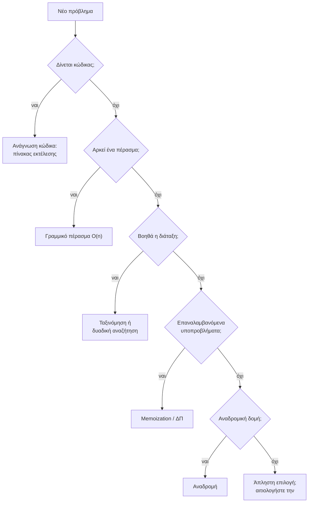
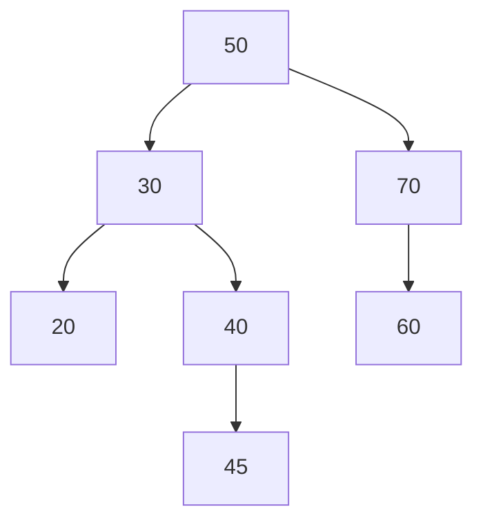

# Κεφάλαιο 25: Επίλυση Προβλημάτων #3

<!--  -->

> **Στόχοι:** μετά από αυτό το κεφάλαιο θα μπορείτε να
> - ξέρετε ποια ύλη καλύπτει το τελικό διαγώνισμα και ποιοι τύποι προβλημάτων
>   εμφανίζονται στα θέματά του·
> - αναγνωρίζετε σε ένα νέο πρόβλημα αν λύνεται με ανάγνωση κώδικα, γραμμικό πέρασμα,
>   άπληστο αλγόριθμο, απομνημόνευση / δυναμικό προγραμματισμό ή αναδρομή·
> - χρησιμοποιείτε την ταξινόμηση και τη δυαδική αναζήτηση ως δομικά στοιχεία μιας
>   λύσης·
> - τρέχετε ένα πρόγραμμα κάτω από το `valgrind` και να διαβάζετε τις αναφορές του για
>   λάθη μνήμης και διαρροές.
>
> **Προαπαιτούμενα:** [Κεφάλαιο 15](../15-complexity-preprocessor/), [Κεφάλαιο 16](../16-problem-solving-2/), [Κεφάλαιο 17](../17-binary-search-sorting/), [Κεφάλαιο 22](../22-trees/)
>
> **Χρόνος μελέτης:** ~2 ώρες (χωρίς τα παλιά θέματα)

## Σύνοψη

Η τελευταία διάλεξη του εξαμήνου είναι διάλεξη επανάληψης πριν από το τελικό
διαγώνισμα. Απαντά στο ερώτημα «τι ελέγχει το διαγώνισμα;»: όλη την ύλη, από τύπους
και μεταβλητές μέχρι λίστες και δέντρα, μέσα από λίγους επαναλαμβανόμενους τύπους
προβλημάτων (ανάγνωση κώδικα, γραμμικό πέρασμα, άπληστοι αλγόριθμοι, απομνημόνευση και
δυναμικός προγραμματισμός, αναδρομή), με την ταξινόμηση και τη δυαδική αναζήτηση ως
προαπαιτούμενα. Το κύριο μέρος ήταν ζωντανή επίλυση περσινών θεμάτων, και ακολούθησε
προσκεκλημένη παρουσίαση για το `valgrind` από τον βοηθό του μαθήματος Γιώργο Σπύρου.
Το κεφάλαιο συγκεντρώνει τις τεχνικές που χρειάζεστε για κάθε τύπο προβλήματος και σας
παραπέμπει στα παλιά θέματα για εξάσκηση.

## Θεωρία

### Ανακοινώσεις και το τέλος του εξαμήνου

Η διάλεξη άνοιξε με τα πρακτικά του τέλους του εξαμήνου:

- **Διαγώνισμα:** τα θέματα θα είναι παρεμφερή με αυτά των δύο προηγούμενων ετών. Τα
  παλιά θέματα είναι λοιπόν το καλύτερο υλικό επανάληψης.
- **Εργαστηριακή εξέταση:** 4 Φεβρουαρίου 2026, ή σε συνεννόηση με τον/την υπεύθυνο/η
  του εργαστηρίου σας· η ανακοίνωση θα σταλεί και στο piazza.
- **Επαναληπτικές διαλέξεις** για απορίες την επόμενη εβδομάδα (Δευτέρα στο
  Αμφιθέατρο, Παρασκευή στην Α2), για άρτιους *και* περιττούς.
- **Παράταση** για την Εργασία #2 και το Bonus #0 μέχρι τις 17 Ιανουαρίου, 23:59. Η
  προφορική εξέταση θα ακολουθήσει όπως και στην πρώτη υποβολή.
- **Διαγωνισμός Δημιουργικότητας:** η πρόσκληση για ψηφοφορία θα σταλεί από το piazza.

Η προηγούμενη διάλεξη ([Κεφάλαιο 24](../24-advanced-topics/)) κάλυψε μεγάλα
προγράμματα, δηλώσεις, το `const` και άλλα προχωρημένα θέματα· εδώ δεν προστίθεται
νέα ύλη της C.

### Τι ελέγχει το διαγώνισμα

Το διαγώνισμα **καλύπτει όλη την ύλη**. Οι διαφάνειες την απαριθμούν σε δώδεκα
ενότητες, που αντιστοιχούν στα κεφάλαια του οδηγού:

| Ενότητα | Κεφάλαια |
| --- | --- |
| Τύποι / Μεταβλητές | [2](../02-memory-variables/) |
| Συναρτήσεις | [3](../03-functions/) |
| Τελεστές, Εντολές, Ροή Ελέγχου | [4](../04-git-operators/), [5](../05-operators-statements/), [6](../06-control-flow/), [8](../08-control-flow-2/) |
| Δεδομένα Εισόδου | [9](../09-input/), [18](../18-sorting-input-2/) |
| Πίνακες | [10](../10-arrays/) |
| Δείκτες και Διαχείριση Μνήμης | [11](../11-pointers-recursion/), [12](../12-pointers-arrays/), [13](../13-memory/), [14](../14-scope-strings/) |
| Αναδρομή | [11](../11-pointers-recursion/) |
| Πολυπλοκότητα | [15](../15-complexity-preprocessor/) |
| Δυαδική Αναζήτηση | [17](../17-binary-search-sorting/) |
| Ταξινόμηση | [17](../17-binary-search-sorting/), [18](../18-sorting-input-2/) |
| Δομές | [19](../19-structs/), [20](../20-advanced-structs/) |
| Λίστες και Δέντρα | [21](../21-lists-trees/), [22](../22-trees/) |

Στα παλιά θέματα κάθε πρόβλημα προγραμματισμού ζητά σχεδόν πάντα και τη **χρονική και
χωρική πολυπλοκότητα** της λύσης σας, με ένα σημαντικό μέρος της βαθμολογίας (π.χ. 6/20
ή 8/25 μονάδες). Η πολυπλοκότητα δεν είναι λοιπόν ξεχωριστό κεφάλαιο αλλά ερώτημα που
συνοδεύει κάθε λύση. Επιπλέον, τα προγράμματα πρέπει να είναι δομημένα, ευανάγνωστα και
τεκμηριωμένα.

### Τύποι προβλημάτων

Οι διαφάνειες ομαδοποιούν τα θέματα σε **τύπους προβλημάτων**. Το να αναγνωρίσετε
τον τύπο είναι το πρώτο βήμα της λύσης, γιατί ο τύπος υποδεικνύει την τεχνική και,
συχνά, και την πολυπλοκότητα που μπορείτε να πετύχετε.

Οι τύποι των διαφανειών είναι: ανάγνωση κώδικα, γραμμικό πέρασμα, άπληστοι
αλγόριθμοι, memoization / δυναμικός προγραμματισμός, αναδρομικά, και γενική «επίλυση
προβλημάτων» που τους συνδυάζει. Η ταξινόμηση και η δυαδική αναζήτηση σημειώνονται
ως *προαπαιτούμενα*: σπάνια είναι το ζητούμενο, συνήθως είναι ένα βήμα μέσα στη λύση.
Οι επόμενες ενότητες εξηγούν κάθε τύπο.



*Σχήμα: ένας πρόχειρος οδηγός για το ποια τεχνική να δοκιμάσετε πρώτη· στην πράξη οι
τεχνικές συνδυάζονται.*

### Ανάγνωση κώδικα

Στα θέματα ανάγνωσης κώδικα (τα «Mystery» και οι «Η συνάρτηση …» των παλιών
εξετάσεων) δεν γράφετε κώδικα, αλλά τον **εκτελείτε με το χέρι**. Η αξιόπιστη μέθοδος
είναι ο **πίνακας εκτέλεσης** (trace table): μία στήλη για κάθε μεταβλητή και μία
γραμμή για κάθε επανάληψη ή κλήση, όπου σημειώνετε τις τιμές *μετά* από κάθε εντολή
και ό,τι τυπώνεται.

Τα θέματα αυτά ελέγχουν συνήθως λεπτομέρειες της γλώσσας που έχετε δει στα προηγούμενα
κεφάλαια:

- τελεστές bit, όπως το `x << 2` που ισούται με $4x$ για μη αρνητικό `x`
  ([Κεφάλαιο 4](../04-git-operators/))·
- ακέραια διαίρεση, υπόλοιπο και υπερχείλιση ([Κεφάλαιο 2](../02-memory-variables/))·
- χαρακτήρες ως αριθμούς ASCII: ο πίνακας `{71, 111, 111, 100, 0}` είναι η
  συμβολοσειρά `"Good"`· το `0` στο τέλος είναι ο τερματικός χαρακτήρας
  ([Κεφάλαιο 14](../14-scope-strings/))·
- αριθμητική δεικτών, `*p++`, και συναρτήσεις που επιστρέφουν μνήμη από `malloc`
  ([Κεφάλαιο 12](../12-pointers-arrays/), [Κεφάλαιο 13](../13-memory/))·
- **μη αρχικοποιημένες μεταβλητές:** αν ο κώδικας τυπώνει μια τοπική μεταβλητή πριν της
  δοθεί τιμή, η σωστή απάντηση είναι «απροσδιόριστη τιμή», όχι «0».

Όταν το θέμα ρωτά και «τι κάνει η συνάρτηση», απαντήστε σε μία πρόταση με το *σκοπό*
της (π.χ. «ενώνει δύο συμβολοσειρές σε νέα μνήμη»), όχι με περιγραφή κάθε γραμμής.

### Γραμμικό πέρασμα

Πολλά προβλήματα λύνονται διατρέχοντας τα δεδομένα **μία φορά** από την αρχή ως το
τέλος, κρατώντας σε λίγες μεταβλητές ό,τι χρειάζεται: ένα άθροισμα, ένα μέγιστο, το
προηγούμενο στοιχείο, έναν μετρητή. Η λύση έχει χρόνο $O(n)$ και συνήθως μνήμη $O(1)$
πέρα από την είσοδο. Κάθε λύση πρέπει να διαβάσει τουλάχιστον μία φορά την είσοδο,
άρα για τέτοια προβλήματα το $O(n)$ είναι και το καλύτερο δυνατό.

Το ερώτημα που σχεδιάζει ένα γραμμικό πέρασμα είναι: *τι πρέπει να θυμάμαι από όσα
έχω ήδη δει για να απαντήσω στο τέλος;* Μερικές παραλλαγές:

- **Δύο περάσματα**, όταν το δεύτερο χρειάζεται αποτέλεσμα του πρώτου (η τυπική
  απόκλιση θέλει πρώτα τον μέσο όρο). Ο χρόνος παραμένει $O(n)$.
- **Παράθυρο:** ο κινούμενος μέσος όρος με παράθυρο $k$ χρησιμοποιεί μόνο τα
  τελευταία $k$ στοιχεία.
- **Δύο δείκτες:** δύο θέσεις που κινούνται στα δεδομένα με διαφορετικούς κανόνες,
  π.χ. ένας αργός και ένας γρήγορος δείκτης για το μεσαίο στοιχείο μιας λίστας
  ([Κεφάλαιο 21](../21-lists-trees/)).

Τα δεδομένα έρχονται συχνά από τη γραμμή εντολών (`argv`, μετατροπή με `atoi`) ή από
την πρότυπη είσοδο μέχρι το EOF ([Κεφάλαιο 9](../09-input/)).

### Άπληστοι αλγόριθμοι

Ένας **άπληστος αλγόριθμος** (greedy algorithm) χτίζει τη λύση βήμα-βήμα, κάνοντας σε
κάθε βήμα την επιλογή που φαίνεται καλύτερη *εκείνη τη στιγμή*, χωρίς να την
αναθεωρεί ποτέ. Είναι απλός και γρήγορος, αλλά **δεν δίνει πάντα τη βέλτιστη λύση**.
Όταν τον χρησιμοποιείτε, το θέμα θέλει και αιτιολόγηση γιατί η άπληστη επιλογή δεν
χάνει τίποτα.

Το κλασικό παράδειγμα είναι τα ρέστα με τα λιγότερα κέρματα: δίνουμε κάθε φορά το
μεγαλύτερο κέρμα που χωρά. Με τα κέρματα του ευρώ αυτό είναι βέλτιστο. Με κέρματα
$\lbrace 1, 3, 4\rbrace$ και ποσό 6 όμως, ο άπληστος δίνει $4+1+1$ (τρία κέρματα),
ενώ η βέλτιστη λύση είναι $3+3$ (δύο κέρματα).

Πολύ συχνά η άπληστη στρατηγική ξεκινά με **ταξινόμηση**: αν θέλουμε να ικανοποιήσουμε
όσο το δυνατόν περισσότερα άτομα με περιορισμένη ποσότητα, εξυπηρετούμε πρώτα όσους
ζητούν το λιγότερο. Η πολυπλοκότητα καθορίζεται τότε από την ταξινόμηση,
$O(n \log n)$ με quicksort / mergesort.

### Memoization και δυναμικός προγραμματισμός

Όταν η αναδρομική λύση ενός προβλήματος καλεί **τα ίδια υποπροβλήματα ξανά και ξανά**,
όπως η απλή αναδρομική Fibonacci ([Κεφάλαιο 16](../16-problem-solving-2/)), ο χρόνος
γίνεται εκθετικός. Δύο συγγενικές τεχνικές το διορθώνουν:

- **Απομνημόνευση (memoization):** κρατάμε την αναδρομική λύση, αλλά αποθηκεύουμε κάθε
  αποτέλεσμα σε έναν πίνακα την πρώτη φορά που υπολογίζεται. Στις επόμενες κλήσεις
  για το ίδιο όρισμα επιστρέφουμε την αποθηκευμένη τιμή.
- **Δυναμικός προγραμματισμός (dynamic programming, ΔΠ):** γεμίζουμε τον πίνακα των
  υποπροβλημάτων **από κάτω προς τα πάνω**, από τα μικρότερα στα μεγαλύτερα, με έναν
  βρόχο αντί για αναδρομή.

Για να εφαρμόσετε ΔΠ χρειάζεστε μια **αναδρομική σχέση**: πώς η λύση για μέγεθος $n$
προκύπτει από λύσεις μικρότερων μεγεθών. Για τα λιγότερα κέρματα:

$$best(a) = 1 + \min_{c \le a} best(a - c), \quad best(0) = 0$$

Για τους τρόπους να ανεβείτε μια σκάλα με βήματα 1, 2 ή 3 σκαλιών,
$W(n) = W(n-1) + W(n-2) + W(n-3)$. Για τη διαδρομή ελαχίστου κόστους σε πλέγμα, όπου
επιτρέπονται μόνο κινήσεις κάτω και δεξιά, το κόστος ενός κελιού είναι η τιμή του
συν το μικρότερο από το κόστος του κελιού από πάνω και του κελιού από αριστερά.

Η πολυπλοκότητα της ΔΠ είναι (πλήθος υποπροβλημάτων) × (κόστος ανά υποπρόβλημα): για
τα κέρματα $O(A \cdot k)$ χρόνος και $O(A)$ μνήμη, για ποσό $A$ και $k$ είδη κερμάτων.

Μια απλή μορφή της ίδιας ιδέας είναι ο **προϋπολογισμός** (precomputation): όταν
έρχονται πολλές ερωτήσεις πάνω στα ίδια δεδομένα, πληρώνουμε μία φορά για έναν
βοηθητικό πίνακα ώστε κάθε ερώτηση να απαντιέται γρήγορα. Με **προθεματικά αθροίσματα**
(prefix sums), `pre[i] = a[0] + … + a[i-1]`, το άθροισμα οποιουδήποτε διαστήματος
`a[l..r]` είναι `pre[r + 1] - pre[l]`: $O(n)$ μία φορά και $O(1)$ ανά ερώτηση, αντί για
$O(n)$ ανά ερώτηση. Η ιδέα γενικεύεται σε δύο διαστάσεις, για αθροίσματα σε
ορθογώνια περιοχή ενός πλέγματος.

### Ταξινόμηση και δυαδική αναζήτηση ως προαπαιτούμενα

Οι διαφάνειες χαρακτηρίζουν την ταξινόμηση και τη δυαδική αναζήτηση
«προαπαιτούμενο»: πρέπει να τις ξέρετε τόσο καλά ώστε να τις χρησιμοποιείτε μέσα σε
μια λύση χωρίς δεύτερη σκέψη ([Κεφάλαιο 17](../17-binary-search-sorting/)).

- **Ταξινόμηση** σε $O(n \log n)$, με δική σας mergesort / quicksort ή με την `qsort`
  της `stdlib.h` και μια συνάρτηση σύγκρισης. Μετά την ταξινόμηση τα ίσα στοιχεία είναι
  γειτονικά (διπλότυπα σε ένα πέρασμα), και δύο δείκτες από τις δύο άκρες βρίσκουν
  ζεύγη με δοσμένο άθροισμα σε $O(n)$.
- **Δυαδική αναζήτηση** σε $O(\log n)$ σε **ταξινομημένο** πίνακα: συγκρίνουμε με το
  μεσαίο στοιχείο και κρατάμε το μισό όπου μπορεί να βρίσκεται η απάντηση. Αν ένα θέμα
  λέει ότι ο πίνακας είναι ταξινομημένος, αυτό είναι σχεδόν πάντα υπόδειξη για δυαδική
  αναζήτηση· μια σειριακή αναζήτηση $O(n)$ θα είναι σωστή αλλά όχι βέλτιστη.

Ένα πρόβλημα με $n$ στοιχεία και τρεις εμφωλευμένους βρόχους ($O(n^3)$) γίνεται συχνά
$O(n^2)$ ή $O(n \log n)$ αν πρώτα ταξινομήσετε.

### Αναδρομικά προβλήματα

Ένα πρόβλημα είναι **αναδρομικό** όταν η λύση του προκύπτει από λύσεις μικρότερων
στιγμιοτύπων του ίδιου προβλήματος. Τα δέντρα είναι το πιο φυσικό παράδειγμα: ένα
δέντρο είναι είτε κενό είτε ένας κόμβος με δύο υποδέντρα. Κάθε αναδρομική συνάρτηση
χρειάζεται:

1. μια **βασική περίπτωση** που απαντά χωρίς αναδρομή (π.χ. `t == NULL`)·
2. **αναδρομικές κλήσεις** σε μικρότερα προβλήματα (τα υποδέντρα)·
3. έναν **συνδυασμό** των αποτελεσμάτων (άθροισμα, μέγιστο, `+ 1`).

Μια συνάρτηση που επισκέπτεται κάθε κόμβο ενός δέντρου $n$ κόμβων μία φορά έχει χρόνο
$O(n)$. Η χωρική της πολυπλοκότητα είναι το βάθος της στοίβας κλήσεων, δηλαδή το
**ύψος** $h$ του δέντρου: $O(\log n)$ για ισορροπημένο δέντρο, $O(n)$ στη χειρότερη
περίπτωση (δέντρο-«αλυσίδα»). Στα θέματα αναφέρετε και τα δύο.

Άλλα αναδρομικά θέματα είναι η εξερεύνηση πλέγματος: γέμισμα περιοχής με χρώμα,
εύρεση διαδρομής σε λαβύρινθο, έλεγχος περικύκλωσης. Εκεί η αναδρομή επισκέπτεται τα
γειτονικά κελιά και χρειάζεται σήμανση των κελιών που έχει ήδη δει, αλλιώς δεν
τερματίζει.

### Valgrind: έλεγχος της μνήμης

Το δεύτερο μέρος της διάλεξης ήταν προσκεκλημένη παρουσίαση για το
[valgrind](https://valgrind.org/) από τον Γιώργο Σπύρου. Οι διαφάνειες της διάλεξης δεν
περιέχουν την παρουσίαση· η ενότητα βασίζεται στο παράρτημα του
[Εργαστηρίου 9](https://progintro.github.io/lab-material/labs/lab09/), που γράφτηκε
από την ίδια παρουσίαση.

Το **valgrind** είναι συλλογή εργαλείων αποσφαλμάτωσης (debugging) και ανάλυσης
επιδόσεων. Το πιο γνωστό του εργαλείο, το **Memcheck**, παρακολουθεί κάθε εντολή του
προγράμματος που αφορά μνήμη, ενώ αυτό εκτελείται (dynamic program instrumentation).
Το πρόγραμμα τρέχει 10 με 30 φορές πιο αργά, κάτι αδιάφορο για τα προγράμματα του
μαθήματος. Μεταγλωττίζετε με `-g3`, ώστε οι αναφορές να δείχνουν αρχεία και γραμμές:

```sh
gcc -g3 -o prog prog.c
valgrind --leak-check=full ./prog
```

Το Memcheck εντοπίζει:

1. **παράνομες προσπελάσεις μνήμης:** ανάγνωση ή εγγραφή εκτός ορίων ενός μπλοκ ή σε
   μνήμη που έχει ήδη αποδεσμευτεί (`Invalid read` / `Invalid write`)·
2. **χρήση μη αρχικοποιημένης μνήμης** (`Conditional jump or move depends on
   uninitialised value(s)`)· η επιλογή `--track-origins=yes` δείχνει από πού προήλθε η
   τιμή·
3. **λάθη αποδέσμευσης:** διπλό `free`, ή `free` σε δείκτη που δεν ήρθε από `malloc`·
4. **διαρροές μνήμης** (memory leaks): μπλοκ του σωρού που δεν αποδεσμεύτηκαν ποτέ.

Η στοίβα καθαρίζει μόνη της όταν επιστρέφει μια συνάρτηση, ενώ ό,τι δεσμεύτηκε με
`malloc` μένει δεσμευμένο μέχρι το `free`. Γι' αυτό οι διαρροές αφορούν τον σωρό, και
γίνονται σοβαρότερες στις λίστες και στα δέντρα, όπου κάθε κόμβος είναι ξεχωριστό
`malloc`. Το valgrind κατατάσσει τις διαρροές σε κατηγορίες:

| Κατηγορία | Τι σημαίνει |
| --- | --- |
| `definitely lost` | Κανένας δείκτης δεν δείχνει πια στο μπλοκ: σίγουρη διαρροή. |
| `indirectly lost` | Το μπλοκ χάθηκε επειδή χάθηκε η δομή που έδειχνε σε αυτό. |
| `possibly lost` | Υπάρχει δείκτης, αλλά στη μέση του μπλοκ: σχεδόν πάντα λάθος. |
| `still reachable` | Δεν έγινε `free`, αλλά ο δείκτης υπήρχε ακόμη στο τέλος. |

Διορθώνετε πάντα πρώτα τα `definitely lost`: όταν αποδεσμευτεί σωστά η κεφαλή μιας
λίστας ή η ρίζα ενός δέντρου μαζί με ό,τι δείχνει, εξαφανίζονται και τα
`indirectly lost`. Η μόνη καθαρή έξοδος είναι `All heap blocks were freed -- no leaks
are possible` και `ERROR SUMMARY: 0 errors`.

## Παραδείγματα

Τα παρακάτω παραδείγματα δείχνουν μία τεχνική το καθένα. Οι διαφάνειες δεν
καταγράφουν ποια περσινά θέματα λύθηκαν στη ζωντανή συνεδρία· για εξάσκηση πάνω σε
πραγματικά θέματα δείτε τον πίνακα στο τέλος της ενότητας.

### Πίνακας εκτέλεσης μιας συνάρτησης

Εφαρμογή της «Ανάγνωσης κώδικα». Τι τυπώνει το παρακάτω πρόγραμμα;

```c
#include <stdio.h>

int puzzle(int n) {
    int s = 1;
    for (int i = 0; i < 3; i++) {
        printf("%d %d\n", i, n - s);
        s = (s << 1) + 1;
    }
    return n + s;
}

int main(void) {
    printf("%d\n", puzzle(100));
    return 0;
}
```

Το `(s << 1) + 1` διπλασιάζει το `s` και προσθέτει 1. Ο πίνακας εκτέλεσης:

| `i` | `s` πριν | τυπώνεται | `s` μετά |
| --- | --- | --- | --- |
| 0 | 1 | `0 99` | 3 |
| 1 | 3 | `1 97` | 7 |
| 2 | 7 | `2 93` | 15 |

Μετά τον βρόχο η `puzzle` επιστρέφει $100 + 15 = 115$:

```text
$ ./puzzle
0 99
1 97
2 93
115
```

### Μεγαλύτερη σειρά ίσων διαδοχικών τιμών

Εφαρμογή του «Γραμμικού περάσματος» σε ορίσματα γραμμής εντολών. Αρκεί να θυμόμαστε
την προηγούμενη τιμή, το μήκος της τρέχουσας σειράς και το καλύτερο μήκος ως τώρα.

```c
#include <stdio.h>
#include <stdlib.h>

int main(int argc, char **argv) {
    if (argc < 2) {
        fprintf(stderr, "Usage: %s n1 n2 ...\n", argv[0]);
        return 1;
    }
    int best = 1, cur = 1;
    int prev = atoi(argv[1]);
    for (int i = 2; i < argc; i++) {
        int x = atoi(argv[i]);
        cur = (x == prev) ? cur + 1 : 1;
        if (cur > best)
            best = cur;
        prev = x;
    }
    printf("Longest run: %d\n", best);
    return 0;
}
```

```text
$ ./run 3 3 5 5 5 5 2 2 7
Longest run: 4
```

Χρόνος $O(n)$ για $n$ ορίσματα, μνήμη $O(1)$. Προσέξτε τον έλεγχο του `argc`: χωρίς
αυτόν, το `argv[1]` χωρίς ορίσματα είναι `NULL` και η `atoi(NULL)` καταρρέει.

### Ρέστα: άπληστη λύση και δυναμικός προγραμματισμός

Εφαρμογή των «Άπληστων αλγορίθμων» και του «Δυναμικού προγραμματισμού» στο ίδιο
πρόβλημα: τα λιγότερα κέρματα για ένα ποσό.

```c
#include <stdio.h>

#define MAXA 1000
#define INF 1000000

int greedy(const int *c, int k, int amount) {
    int count = 0;
    for (int i = 0; i < k; i++) {   // c[] in descending order
        count += amount / c[i];
        amount %= c[i];
    }
    return count;
}

int dp(const int *c, int k, int amount) {
    int best[MAXA + 1];
    best[0] = 0;
    for (int a = 1; a <= amount; a++) {
        best[a] = INF;
        for (int i = 0; i < k; i++)
            if (c[i] <= a && best[a - c[i]] + 1 < best[a])
                best[a] = best[a - c[i]] + 1;
    }
    return best[amount];
}

int main(void) {
    int euro[] = {200, 100, 50, 20, 10, 5, 2, 1};
    int odd[] = {4, 3, 1};
    printf("euro 289: greedy %d, dp %d\n", greedy(euro, 8, 289),
           dp(euro, 8, 289));
    printf("{4,3,1} 6: greedy %d, dp %d\n", greedy(odd, 3, 6),
           dp(odd, 3, 6));
    return 0;
}
```

```text
$ ./coins
euro 289: greedy 7, dp 7
{4,3,1} 6: greedy 3, dp 2
```

Για 289 λεπτά σε κέρματα ευρώ ο άπληστος δίνει $200+50+20+10+5+2+2$, που είναι και
βέλτιστο. Για κέρματα $\lbrace 4, 3, 1\rbrace$ ο άπληστος χάνει. Η `dp` γεμίζει τον
πίνακα `best[]` από το 1 ως το ποσό· για τα κέρματα $\lbrace 4, 3, 1\rbrace$:

| `a` | 0 | 1 | 2 | 3 | 4 | 5 | 6 |
| --- | --- | --- | --- | --- | --- | --- | --- |
| `best[a]` | 0 | 1 | 2 | 1 | 1 | 2 | 2 |

Η `greedy` κάνει $O(k)$ βήματα· η `dp` κάνει $O(A \cdot k)$ βήματα με $O(A)$ μνήμη. Ο
πίνακας `best` είναι τοπικός, άρα η `dp` προϋποθέτει `amount <= MAXA`.

### Ύψος δέντρου και αποδέσμευση με αναδρομή

Εφαρμογή των «Αναδρομικών προβλημάτων» και της «Valgrind». Και οι δύο συναρτήσεις
ακολουθούν το ίδιο σχήμα: βασική περίπτωση για το κενό δέντρο, κλήσεις στα δύο
υποδέντρα, συνδυασμός.

```c
#include <stdio.h>
#include <stdlib.h>

typedef struct node {
    int value;
    struct node *left, *right;
} *Tree;

int height(Tree t) {
    if (t == NULL)
        return 0;
    int hl = height(t->left), hr = height(t->right);
    return 1 + (hl > hr ? hl : hr);
}

void free_tree(Tree t) {
    if (t == NULL)
        return;
    free_tree(t->left);     // children first,
    free_tree(t->right);
    free(t);                // then the node itself
}

Tree node(int v, Tree l, Tree r) {
    Tree t = malloc(sizeof(*t));
    if (t == NULL)
        exit(1);
    t->value = v;
    t->left = l;
    t->right = r;
    return t;
}

int main(void) {
    Tree t = node(50,
                  node(30, node(20, NULL, NULL),
                           node(40, NULL, node(45, NULL, NULL))),
                  node(70, node(60, NULL, NULL), NULL));
    printf("height = %d\n", height(t));
    free_tree(t);
    return 0;
}
```



*Σχήμα: το δέντρο που χτίζει η `main`· η μακρύτερη διαδρομή
50 → 30 → 40 → 45 έχει 4 κόμβους.*

```text
$ ./height
height = 4
```

Η `height` και η `free_tree` επισκέπτονται κάθε κόμβο μία φορά: χρόνος $O(n)$, μνήμη
στοίβας $O(h)$. Η `free_tree` αποδεσμεύει τα παιδιά **πριν** από τον κόμβο
(μεταδιατεταγμένα): αν κάνατε πρώτα `free(t)`, τα `t->left` και `t->right` θα
διαβάζονταν από αποδεσμευμένη μνήμη, και το valgrind θα ανέφερε `Invalid read`. Αν
παραλείψετε την κλήση `free_tree(t)` στη `main`, το valgrind αναφέρει τη ρίζα ως
`definitely lost` και τους υπόλοιπους έξι κόμβους ως `indirectly lost`.

### Παλιά θέματα ανά τύπο προβλήματος

Αφού το διαγώνισμα έχει θέματα παρεμφερή με των δύο προηγούμενων ετών, λύστε τα παλιά
θέματα σε συνθήκες εξέτασης (135 λεπτά για το θέμα Ιανουαρίου 2025) και μετά
αναγνωρίστε σε ποιον τύπο ανήκει το καθένα:

| Τύπος | Παλιά θέματα |
| --- | --- |
| Ανάγνωση κώδικα | Ιαν. 2025: «Mystery», «Η συνάρτηση dog»· Σεπ. 2025: «Mystery», «Η συνάρτηση transform»· Σεπ. 2024: «Η συνάρτηση about», «Η συνάρτηση what» |
| Γραμμικό πέρασμα | Ιαν. 2025: «Κινούμενος Μέσος Όρος - sma»· Ιούλ. 2024: «Στατιστικές»· Σεπ. 2025: «Μέση Τιμή Τυχαίων Μεταβλητών», «Μεσαίο Στοιχείο Λίστας»· Σεπ. 2024: «Μετρητής λέξεων» |
| Άπληστοι + ταξινόμηση | Ιούλ. 2024: «Βέλτιστη Μοιρασιά Πίτσας»· Δεκ. 2024: «Η Τριπλέτα Στόχος» |
| Memoization / ΔΠ | Σεπ. 2025: «Το Καλό το Μονοπάτι - path»· Ιαν. 2025: «Μετρώντας τα Αστέρια - stars» (αποδοτικές ερωτήσεις περιοχής) |
| Δυαδική αναζήτηση | Σεπ. 2024: «Εύρεση μηδενός σε πίνακα» |
| Αναδρομικά | Ιαν. 2025: «Αθροιστής Δέντρων - sumtree»· Ιούλ. 2024: «Reverse Inorder Traversal»· Σεπ. 2024: «Γεμίζοντας με χρώμα»· Δεκ. 2024: «Λύσε τον Λαβύρινθο» |
| Συμβολοσειρές, λίστες και μνήμη | Ιαν. 2025: «Συνένωση Αλφαριθμητικών - join»· Σεπ. 2024: «Αντιστροφή λίστας» |

Η κατάταξη είναι του οδηγού, όχι των διαφανειών· πολλά θέματα συνδυάζουν τύπους. Οι
εκφωνήσεις και υποδείξεις είναι στην ενότητα «Ασκήσεις» των αντίστοιχων κεφαλαίων.

## Κύρια σημεία

1. Το διαγώνισμα καλύπτει όλη την ύλη, από τύπους και μεταβλητές μέχρι λίστες και
   δέντρα, και τα θέματά του είναι παρεμφερή με αυτά των δύο προηγούμενων ετών.
2. Σχεδόν κάθε πρόβλημα προγραμματισμού ζητά και τη χρονική και χωρική πολυπλοκότητα
   της λύσης, με σημαντικό μέρος της βαθμολογίας.
3. Τα θέματα ανήκουν σε λίγους τύπους: ανάγνωση κώδικα, γραμμικό πέρασμα, άπληστοι
   αλγόριθμοι, memoization / δυναμικός προγραμματισμός, αναδρομικά και γενική επίλυση
   προβλημάτων· η αναγνώριση του τύπου είναι το πρώτο βήμα της λύσης.
4. Στην ανάγνωση κώδικα χρησιμοποιήστε πίνακα εκτέλεσης και προσέξτε τελεστές bit,
   κωδικούς ASCII, αριθμητική δεικτών και μη αρχικοποιημένες μεταβλητές.
5. Ένα γραμμικό πέρασμα κρατά σε λίγες μεταβλητές ό,τι χρειάζεται από όσα έχει δει και
   δίνει $O(n)$ χρόνο, το καλύτερο δυνατό όταν πρέπει να διαβαστεί όλη η είσοδος.
6. Ένας άπληστος αλγόριθμος δεν αναθεωρεί τις επιλογές του και δεν είναι πάντα
   βέλτιστος· χρειάζεται αιτιολόγηση, και συχνά ξεκινά με ταξινόμηση.
7. Memoization και δυναμικός προγραμματισμός αποθηκεύουν τις λύσεις υποπροβλημάτων
   ώστε καθένα να υπολογίζεται μία φορά, μετατρέποντας εκθετικές λύσεις σε
   πολυωνυμικές.
8. Η ταξινόμηση ($O(n \log n)$) και η δυαδική αναζήτηση ($O(\log n)$) είναι
   προαπαιτούμενα: εργαλεία μέσα σε μεγαλύτερες λύσεις.
9. Μια αναδρομική συνάρτηση σε δέντρο χρειάζεται βασική περίπτωση για το `NULL` και
   έχει χρόνο $O(n)$ και μνήμη στοίβας $O(h)$.
10. Το `valgrind --leak-check=full` (με μεταγλώττιση `-g3`) εντοπίζει παράνομες
    προσπελάσεις, μη αρχικοποιημένες τιμές, λάθη αποδέσμευσης και διαρροές· πρώτα
    διορθώνετε τα `definitely lost`.

## Ορολογία

| Ελληνικά | English | Σύντομος ορισμός |
| --- | --- | --- |
| πίνακας εκτέλεσης | trace table | Πίνακας με τις τιμές των μεταβλητών σε κάθε βήμα μιας εκτέλεσης με το χέρι. |
| γραμμικό πέρασμα | linear pass | Διάσχιση των δεδομένων μία φορά, σε χρόνο $O(n)$. |
| άπληστος αλγόριθμος | greedy algorithm | Αλγόριθμος που κάνει σε κάθε βήμα την τοπικά καλύτερη επιλογή χωρίς να την αναθεωρεί. |
| απομνημόνευση | memoization | Αποθήκευση των αποτελεσμάτων κλήσεων ώστε να μην ξαναϋπολογίζονται. |
| δυναμικός προγραμματισμός | dynamic programming | Επίλυση υποπροβλημάτων από τα μικρότερα στα μεγαλύτερα, με αποθήκευση των λύσεων σε πίνακα. |
| αναδρομική σχέση | recurrence | Τύπος που εκφράζει τη λύση ενός προβλήματος μέσω λύσεων μικρότερων στιγμιοτύπων. |
| προθεματικά αθροίσματα | prefix sums | Πίνακας με τα αθροίσματα των πρώτων $i$ στοιχείων, για αθροίσματα διαστημάτων σε $O(1)$. |
| δύο δείκτες | two pointers | Δύο θέσεις που κινούνται στα δεδομένα για να αποφύγουν εμφωλευμένους βρόχους. |
| διαρροή μνήμης | memory leak | Μνήμη του σωρού που δεσμεύτηκε και δεν αποδεσμεύτηκε ποτέ. |

## Διάβασμα

- **Διαφάνειες:** [Διάλεξη 25](https://github.com/progintro/progintro.github.io/releases/download/2025/lec25.pdf),
  σελ. 1–10: ανακοινώσεις σελ. 2· περσινή και σημερινή διάλεξη σελ. 3–4· τι ελέγχει το
  διαγώνισμα σελ. 5–6· τύποι προβλημάτων σελ. 7· ζωντανή συνεδρία σελ. 8.
- **Σημειώσεις:**
  - [Κεφάλαιο 11: Ταξινόμηση και αναζήτηση](https://progintro.github.io/notes/chapters/11-sorting-searching/),
    ενότητες «Ταξινόμηση πινάκων», «Μέθοδοι ταξινόμησης» (K04, σελ. 160–171),
    «Αναζήτηση σε πίνακες» και «Μέθοδοι αναζήτησης» (K04, σελ. 172–177).
  - [Κεφάλαιο 8: Συνδεδεμένες λίστες και δυαδικά δέντρα](https://progintro.github.io/notes/chapters/08-lists-trees/),
    ενότητες «Διαχείριση συνδεδεμένων λιστών» και «Διαχείριση δυαδικών δέντρων» (K04,
    σελ. 128–135).
  - [Κεφάλαιο 12: Καλές πρακτικές](https://progintro.github.io/notes/chapters/12-good-practice/),
    ενότητες «Ένα πρόγραμμα C πρέπει να είναι …» και «Συχνά προγραμματιστικά λάθη στην
    C» (K04, σελ. 178–182).
- **Εργαστήρια:**
  - [Εργαστήριο 9](https://progintro.github.io/lab-material/labs/lab09/): «Παράρτημα:
    Αποσφαλμάτωση προγραμμάτων (Πράξη 5η)» για το valgrind και η Άσκηση 5 (`grades.c`,
    `tree.c`, καθαρή διαχείριση μνήμης).
  - [Εργαστήριο 5](https://progintro.github.io/lab-material/labs/lab05/): `fib.c`
    (αναδρομή και memoization) και `ladder.c` (δυναμικός προγραμματισμός).
- **Παλιά θέματα:** [Ιανουάριος 2025](https://progintro.github.io/exams/2025/progintro-exam-jan-25.pdf),
  [Σεπτέμβριος 2025](https://progintro.github.io/exams/2025/progintro-exam-sep-25.pdf),
  [Ιούλιος 2024](https://progintro.github.io/exams/2024/progintro-exam-jul-24.pdf),
  [Σεπτέμβριος 2024](https://progintro.github.io/exams/2024/progintro-exam-sep-24.pdf),
  [Δεκέμβριος 2024](https://progintro.github.io/exams/2024/progintro-exam-dec-24.pdf).
- **Άλλα:** [valgrind.org](https://valgrind.org/), `man 1 valgrind`, `man 3 qsort`.

## Συχνά λάθη

- **Δίνετε μόνο κώδικα, χωρίς πολυπλοκότητα.** Το ερώτημα «ποια η χρονική και χωρική
  πολυπλοκότητα» έχει δικές του μονάδες. Γράψτε και τα δύο, με το σύμβολο $O$ και τις
  μεταβλητές του προβλήματος (π.χ. $O(N^2 + Q)$), και μια πρόταση αιτιολόγησης.
- **«Η μη αρχικοποιημένη μεταβλητή είναι 0».** Μια τοπική `int i;` που τυπώνεται πριν
  πάρει τιμή δίνει απροσδιόριστη τιμή. Το `valgrind` το αναφέρει ως `uninitialised
  value`.
- **Άπληστη λύση χωρίς αιτιολόγηση.** Η επιλογή «το μεγαλύτερο κέρμα πρώτα» αποτυγχάνει
  με κέρματα $\lbrace 1, 3, 4\rbrace$ για το 6. Ελέγξτε με ένα μικρό αντιπαράδειγμα, και αν
  βρείτε, στραφείτε σε ΔΠ.
- **Σειριακή αναζήτηση σε ταξινομημένο πίνακα.** Σωστή αλλά $O(n)$, ενώ ζητείται η
  βέλτιστη λύση: χρησιμοποιήστε δυαδική αναζήτηση, $O(\log n)$.
- **Αναδρομή σε δέντρο χωρίς έλεγχο `NULL`.** Η `t->left` σε κενό δέντρο δίνει
  `Segmentation fault`. Η βασική περίπτωση `if (t == NULL)` μπαίνει πρώτη.
- **`free(t)` πριν από τα παιδιά.** Η `free_tree` που αποδεσμεύει πρώτα τον κόμβο και
  μετά διαβάζει το `t->left` προσπελαύνει αποδεσμευμένη μνήμη (`Invalid read` στο
  valgrind). Αποδεσμεύστε μεταδιατεταγμένα.
- **`valgrind time ./prog`.** Έτσι το valgrind ελέγχει την εντολή `time`, όχι το
  πρόγραμμά σας. Γράψτε `valgrind ./prog`.

<!-- misconceptions -->

<!-- /misconceptions -->

## Ερωτήσεις κατανόησης

1. Ποιες ενότητες της ύλης καλύπτει το τελικό διαγώνισμα;[^q1]
2. Γιατί ένα πρόβλημα που πρέπει να διαβάσει όλα τα $n$ στοιχεία της εισόδου δεν
   μπορεί να λυθεί γρηγορότερα από $O(n)$;[^q2]
3. Δώστε ένα σύνολο κερμάτων και ένα ποσό για τα οποία η άπληστη λύση των ρέστων δεν
   είναι βέλτιστη.[^q3]
4. Ποια η διαφορά ανάμεσα στο memoization και στον δυναμικό προγραμματισμό «από κάτω
   προς τα πάνω»;[^q4]
5. Με προθεματικά αθροίσματα `pre[]`, πώς υπολογίζετε το άθροισμα του `a[l..r]` και σε
   τι χρόνο;[^q5]
6. Ποια η χωρική πολυπλοκότητα μιας αναδρομικής διάσχισης δέντρου $n$ κόμβων με ύψος
   $h$, και γιατί;[^q6]
7. Τι σημαίνουν τα `definitely lost` και `indirectly lost` στην αναφορά του valgrind, και
   ποιο διορθώνετε πρώτα;[^q7]
8. Γιατί η `free_tree` αποδεσμεύει τα υποδέντρα πριν από τον ίδιο τον κόμβο;[^q8]

<!-- kahoot -->

<!-- /kahoot -->

## Ασκήσεις

<!-- exercises -->

### Εργαστήριο

- [Καθαρή διαχείριση μνήμης](../../questions/labs/lab-lab09-grades-tree.md): Εργαστήριο 9, Άσκηση 5 · ★★☆ · programming

### Εργασίες

- [DNA Matching](../../questions/homework/hw-2023-hw2-dna.md): Εργασία 2 (2023-24), Άσκηση 2 · ★★★ · programming
- [Το Καλύτερο GPS (jabbamaps)](../../questions/homework/hw-2024-hw2-jabbamaps.md): Εργασία 2 (2024-25), Άσκηση 2 · ★★★ · programming
- [Ανελκυστήρες για Ανυπόμονους και Ανυπόμονες (elevate)](../../questions/homework/hw-2025-hw2-elevate.md): Εργασία 2 (2025-26), Άσκηση 1 · ★★★ · programming

### Θέματα εξετάσεων

- [Σκαλί-Σκαλί](../../questions/exams/exam-2023-dec-q3.md): Κατατακτήριες Δεκεμβρίου 2023, Θέμα 3 · ★★☆ · programming
- [Μένοντας στις Σωστές Θερμίδες](../../questions/exams/exam-2023-fall-ex14-q2.md): Online τελική εξέταση Δεκεμβρίου 2023, Εξέταση #14, Θέμα 2 · ★★☆ · programming
- [Ανεβαίνοντας Επίπεδο](../../questions/exams/exam-2023-fall-ex2-q4.md): Online τελική εξέταση Δεκεμβρίου 2023, Εξέταση #2 (Pokémon Themed), Θέμα 4 · ★★☆ · programming
- [Επενδύσεις στο Χρηματιστήριο](../../questions/exams/exam-2026-jun-q3.md): Εξέταση Ιουνίου 2026, Θέμα 3 · ★★☆ · programming
- [Το Νερό Νεράκι](../../questions/exams/exam-2023-dec-q4.md): Κατατακτήριες Δεκεμβρίου 2023, Θέμα 4 · ★★★ · programming
- [Τρόποι να Φάμε Παϊδάκια](../../questions/exams/exam-2023-fall-ex14-q4.md): Online τελική εξέταση Δεκεμβρίου 2023, Εξέταση #14, Θέμα 4 · ★★★ · programming
- [Η Τριπλέτα Στόχος](../../questions/exams/exam-2024-dec-q3.md): Κατατακτήριες Δεκεμβρίου 2024, Θέμα 3 · ★★★ · programming
- [Λύσε τον Λαβύρινθο](../../questions/exams/exam-2024-dec-q4.md): Κατατακτήριες Δεκεμβρίου 2024, Θέμα 4 · ★★★ · programming
- [Βέλτιστη Μοιρασιά Πίτσας](../../questions/exams/exam-2024-jul-q3.md): Εξέταση Ιουλίου 2024, Θέμα 3 · ★★★ · programming
- [Γεμίζοντας με χρώμα](../../questions/exams/exam-2024-sep-q6.md): Εξέταση Σεπτεμβρίου 2024, Θέμα 6 · ★★★ · programming
- [Το Καλό το Μονοπάτι - path](../../questions/exams/exam-2025-sep-q5.md): Εξέταση Σεπτεμβρίου 2025, Θέμα 5 · ★★★ · programming
- [Περικύκλωση - encirclement](../../questions/exams/exam-2026-jan-q5.md): Εξέταση Ιανουαρίου 2026, Θέμα 5 · ★★★ · programming
- [Η Μεγαλύτερη Χωρητικότητα - capacity](../../questions/exams/exam-2026-sep-q5.md): Εξέταση Σεπτεμβρίου 2026, Θέμα 5 · ★★★ · programming

### Σχετικές ασκήσεις από άλλα κεφάλαια

- [Η συνάρτηση cons](../../questions/exams/exam-2026-sep-q2.md): Εξέταση Σεπτεμβρίου 2026, Θέμα 2 · ★☆☆ · trace (κεφ. 10)

<!-- /exercises -->

[^q1]: Όλη την ύλη: τύπους και μεταβλητές, συναρτήσεις, τελεστές, εντολές και ροή
    ελέγχου, δεδομένα εισόδου, πίνακες, δείκτες και διαχείριση μνήμης, αναδρομή,
    πολυπλοκότητα, δυαδική αναζήτηση, ταξινόμηση, δομές, λίστες και δέντρα.
[^q2]: Γιατί κάθε στοιχείο πρέπει να διαβαστεί τουλάχιστον μία φορά, και αυτό μόνο
    κοστίζει $n$ βήματα· ένα γραμμικό πέρασμα είναι επομένως βέλτιστο.
[^q3]: Κέρματα $\lbrace 1, 3, 4\rbrace$ και ποσό 6: ο άπληστος δίνει $4+1+1$ (3 κέρματα), ενώ
    το $3+3$ θέλει 2.
[^q4]: Το memoization κρατά την αναδρομή και αποθηκεύει κάθε αποτέλεσμα την πρώτη φορά
    που υπολογίζεται· ο δυναμικός προγραμματισμός γεμίζει τον πίνακα με βρόχο, από τα
    μικρότερα υποπροβλήματα προς τα μεγαλύτερα, χωρίς αναδρομή.
[^q5]: `pre[r + 1] - pre[l]`, σε $O(1)$ χρόνο, αφού ο πίνακας `pre` έχει υπολογιστεί μία
    φορά σε $O(n)$.
[^q6]: $O(h)$: κάθε ενεργή κλήση κρατά ένα πλαίσιο στη στοίβα, και οι ενεργές κλήσεις
    είναι όσες οι κόμβοι μιας διαδρομής από τη ρίζα. Για ισορροπημένο δέντρο
    $O(\log n)$, στη χειρότερη περίπτωση $O(n)$.
[^q7]: `definitely lost`: κανένας δείκτης δεν δείχνει πια στο μπλοκ. `indirectly lost`:
    το μπλοκ χάθηκε επειδή χάθηκε η δομή που έδειχνε σε αυτό. Διορθώνετε πρώτα τα
    `definitely lost`, και τα `indirectly lost` εξαφανίζονται μαζί τους.
[^q8]: Γιατί μετά το `free(t)` τα `t->left` και `t->right` βρίσκονται σε αποδεσμευμένη
    μνήμη και δεν επιτρέπεται να διαβαστούν.

<!--  -->
