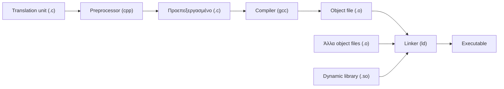
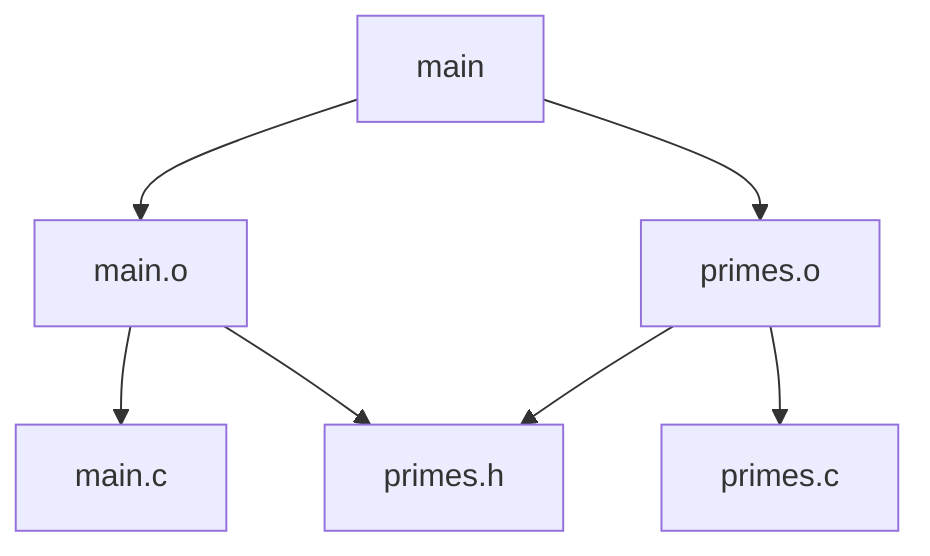

# Παράρτημα Α: How to Make?

<!--  -->

> **Στόχοι:** μετά από αυτό το παράρτημα θα μπορείτε να ξεχωρίζετε ένα σφάλμα
> μεταγλώττισης από ένα σφάλμα σύνδεσης· να χτίζετε ένα project πολλών αρχείων σε
> βήματα (`gcc -c` και σύνδεση)· να εξηγείτε γιατί ένα bash script δεν αρκεί· και να
> γράφετε ένα `Makefile` με rules, macros, automatic variables, wildcard rules και
> built-in rules.
>
> **Προαπαιτούμενα:** [Κεφάλαιο 0](../00-hello-world/) (preprocessor, compiler,
> linker), [Κεφάλαιο 3](../03-functions/) (`-lm`), [Κεφάλαιο 23](../23-code-organization/)
> (οργάνωση κώδικα σε αρχεία)
>
> **Χρόνος μελέτης:** ~1,5 ώρα

## Σύνοψη

Η προσκεκλημένη διάλεξη, από τον Πέτρο, δευτεροετή φοιτητή και βοηθό του μαθήματος,
παρουσιάζει το **Make**, το εργαλείο που αυτοματοποιεί την κατασκευή (build) ενός
προγράμματος. Ξεκινά από τη διαδικασία μετάφρασης της C (preprocessor, compiler,
linker) και από το πώς ξεχωρίζουμε τα λάθη κάθε σταδίου. Μετά δείχνει γιατί, μόλις
ένα project έχει πολλά αρχεία, οι εντολές `gcc` γίνονται μακριές, πολλές και αργές,
και γιατί ένα bash script λύνει μόνο τα δύο πρώτα προβλήματα. Το Make λύνει και το
τρίτο: ξέρει τι εξαρτάται από τι και ξαναχτίζει μόνο ό,τι άλλαξε. Η διάλεξη κλείνει
με τα εργαλεία που κάνουν ένα `Makefile` σύντομο: macros, automatic variables,
wildcard rules και built-in rules.

## Θεωρία

<a id="s26-1"></a><a id="η-διαδικασία-μετάφρασης-της-c"></a>

### §26.1 Η διαδικασία μετάφρασης της C

Ένα εκτελέσιμο δεν βγαίνει από το `.c` σε ένα βήμα. Κάθε αρχείο `.c`, που λέγεται
**translation unit** (μονάδα μετάφρασης), περνά από τρία στάδια
([Κεφάλαιο 0](../00-hello-world/)):

1. ο **προεπεξεργαστής (preprocessor, `cpp`)** εκτελεί τις οδηγίες `#include`,
   `#define` κ.λπ. και βγάζει ένα προεπεξεργασμένο translation unit·
2. ο **μεταγλωττιστής (compiler, `gcc`)** το μεταφράζει σε ένα **object file**
   (αντικειμενικό αρχείο, `.o`) σε γλώσσα μηχανής·
3. ο **συνδέτης (linker, `ld`)** ενώνει όλα τα object files και τις **δυναμικές
   βιβλιοθήκες (dynamic libraries, `.so`)** σε ένα **εκτελέσιμο (executable)**.



*Σχήμα: από το translation unit στο εκτελέσιμο (διαφάνεια 5).*

Η εντολή `gcc main.c -o main` κάνει και τα τρία στάδια μαζί· το `gcc` στην ουσία
καλεί με τη σειρά τα `cpp`, τον compiler και το `ld`.

<a id="s26-2"></a><a id="σφάλματα-μεταγλώττισης-και-σφάλματα-σύνδεσης"></a>

### §26.2 Σφάλματα μεταγλώττισης και σφάλματα σύνδεσης

Κάθε στάδιο έχει τα δικά του λάθη, και το να καταλαβαίνετε ποιο στάδιο παραπονιέται
είναι το μισό της διόρθωσης.

- Ένα **σφάλμα μεταγλώττισης (compiler error)** σημαίνει ότι ο compiler δεν βρίσκει
  κάτι μέσα στο *translation unit*: για παράδειγμα τη **δήλωση** μιας συνάρτησης
  (`implicit declaration of function 'sqrt'`). Ο compiler βλέπει τον κώδικά σας,
  οπότε δίνει αριθμό γραμμής και συχνά την ακριβή διόρθωση («include `<math.h>`»).
- Ένα **σφάλμα σύνδεσης (linking error)** σημαίνει ότι ο linker δεν βρίσκει μέσα στο
  **linking scope**, δηλαδή στα object files και τις βιβλιοθήκες που του δώσατε, την
  **υλοποίηση** ενός συμβόλου (`undefined reference to 'sqrt'`). Το μήνυμα είναι
  λιγότερο βοηθητικό: ο linker δουλεύει πάνω σε object files, όχι σε πηγαίο κώδικα,
  οπότε δεν ξέρει σε ποια γραμμή σας γράψατε την κλήση ούτε ποια βιβλιοθήκη
  ξεχάσατε.

Ένα αρχείο επικεφαλίδας όπως το `math.h` δίνει μόνο **δηλώσεις**. Η υλοποίηση της
`sqrt` βρίσκεται στη μαθηματική βιβλιοθήκη του συστήματος, `libm.so`, και πρέπει να
πείτε στον linker να τη χρησιμοποιήσει με το flag `-l:libm.so`, ή σύντομα `-lm`.

<a id="s26-3"></a><a id="projects-με-πολλά-αρχεία"></a>

### §26.3 Projects με πολλά αρχεία

Τα πραγματικά projects αποτελούνται από πολλά αρχεία `.c`, που πρέπει να
μεταγλωττιστούν με όμοιο τρόπο και να συνδεθούν. Το project της διάλεξης έχει ένα
`main.c`, που καλεί τη `n_primes`, και ένα `primes.c`, που την υλοποιεί. Το `main.c`
χρειάζεται μόνο τη δήλωση `ull *n_primes(ull n);`· την υλοποίηση τη φέρνει ο linker
από το `primes.o`.

Το πιο απλό είναι να δώσετε όλα τα αρχεία σε ένα `gcc main.c primes.c -o main`.
Πίσω από αυτή τη γραμμή τρέχουν ξεχωριστά ο `cpp` και ο compiler για κάθε αρχείο και
στο τέλος ένα `ld` με όλα τα `.o` (Παράδειγμα «Ένα project με δύο αρχεία»).

<a id="s26-4"></a><a id="τρία-προβλήματα-του-χειροκίνητου-compile"></a>

### §26.4 Τρία προβλήματα του χειροκίνητου compile

Με περισσότερα από ένα αρχεία, η στρατηγική «γράφω την εντολή `gcc` με το χέρι» έχει
τρία προβλήματα:

1. **Μακριές εντολές.** Κάθε νέα απαίτηση προσθέτει flags: `-Wall`, `-Wextra`,
   `-Werror`, `-std=c99`, `-pedantic`, … και η εντολή γίνεται δύσκολη στο
   πληκτρολόγηση και στη μνήμη.
2. **Πολλές εντολές.** Όταν ένα αρχείο θέλει διαφορετικά flags από τα άλλα, το
   compile πρέπει να σπάσει σε βήματα: ένα `gcc -c` ανά αρχείο και ένα για τη
   σύνδεση. Παράδειγμα: το `primes.c` θέλει την `reallocarray`, που δεν είναι στο
   πρότυπο της C, άρα δεν μπορεί να μεταγλωττιστεί με `-std=c99` όπως το `main.c`.
3. **Επαναμεταγλώττιση ολόκληρου του project** σε κάθε αλλαγή (βλ. παρακάτω).

Ήδη με πέντε αρχεία (η [Εργασία 2, elevate](#το-build-της-εργασίας-2-elevate)) χρειάζονται έξι εντολές.
Κανείς δεν τις θυμάται απ' έξω, και σε μεγάλο project ο χρόνος να τις τρέχετε μία
μία ξεπερνά τον χρόνο της ίδιας της αλλαγής στον κώδικα.

<a id="s26-5"></a><a id="build-scripts-σε-bash"></a>

### §26.5 Build scripts σε bash

Η πρώτη λύση υπάρχει από τη δεκαετία του '70: βάζετε όλες τις εντολές σε ένα
**bash script** (`build.sh`) και τρέχετε αυτό. Το `set -xe` κάνει το script να
τυπώνει κάθε εντολή πριν την τρέξει (`-x`) και να σταματά στο πρώτο λάθος (`-e`).
Έτσι λύνονται τα προβλήματα 1 και 2: οι εντολές γράφονται μία φορά.

Το bash όμως είναι γλώσσα γενικού σκοπού, όχι φτιαγμένη για compile. Δεν ξέρει ποια
αρχεία άλλαξαν, οπότε **κάθε εκτέλεση ξαναμεταγλωττίζει όλο το project από την
αρχή**.

<a id="s26-6"></a><a id="γιατί-η-πλήρης-επαναμεταγλώττιση-είναι-πρόβλημα"></a>

### §26.6 Γιατί η πλήρης επαναμεταγλώττιση είναι πρόβλημα

Η GNU C Library (glibc), η πιο διαδεδομένη υλοποίηση της standard library της C (και
των προτύπων POSIX, GNU C, System V κ.ά.), έχει 1.524.568 γραμμές κώδικα σε πάνω από
14.000 αρχεία. Αν προσθέσετε ένα σχόλιο σε ένα αρχείο, ένα script θα
ξαναμεταγλωττίσει και τα 14.000.

Η «λύση» να ξαναμεταγλωττίζετε με το χέρι μόνο τα αρχεία που αλλάξατε και να
συνδέετε με ένα script έχει μια παγίδα: **τι γίνεται αν ξεχάσετε ένα;** Τότε
τρέχετε ένα παλιό `.o` και ψάχνετε ένα bug που έχετε ήδη διορθώσει. Ακριβώς αυτό
οδήγησε στο Make: ο Stuart Feldman γράφει ότι ο Steve Johnson (δημιουργός του yacc)
έχασε ένα πρωί αποσφαλματώνοντας ένα σωστό πρόγραμμα, επειδή η διόρθωση δεν είχε
μεταγλωττιστεί. Το εργαλείο γράφτηκε εκείνο το Σαββατοκύριακο, και τα Makefiles
έγιναν απλά αρχεία κειμένου, «printable, debuggable, understandable», όπως θέλει η
[φιλοσοφία του Unix](https://en.wikipedia.org/wiki/Unix_philosophy).

<a id="s26-7"></a><a id="το-make-και-οι-βασικές-έννοιες"></a>

### §26.7 Το Make και οι βασικές έννοιες

Το **Make** είναι πρόγραμμα που εκτελεί εντολές με βάση προκαθορισμένες **σχέσεις
εξάρτησης (dependencies)**. Υπάρχουν πολλές παραλλαγές του· εδώ χρησιμοποιούμε το
**GNU Make**, αλλά τα περισσότερα ισχύουν και για τις άλλες. Τρεις έννοιες:

- **target** (στόχος): ένα αποτέλεσμα που μπορεί να παραχθεί, συνήθως ένα αρχείο
  (`main`, `main.o`) ή και κάτι άλλο·
- **recipe** (συνταγή): οι εντολές που κατασκευάζουν ένα target·
- **rule** (κανόνας): ορίζει ένα target, τα **prerequisites** (προαπαιτούμενα) από
  τα οποία εξαρτάται, και το recipe του.

<a id="s26-8"></a><a id="το-makefile-και-η-σύνταξη-ενός-rule"></a>

### §26.8 Το Makefile και η σύνταξη ενός rule

Ένα **Makefile** είναι ένα σύνολο από rules με σκοπό την παραγωγή targets:

```make
# rule
target_name1 target_name2: prerequisite1 prerequisite2
	# recipe
	command1
	command2
```

Το rule λέει ότι τα `target_name1` και `target_name2` φτιάχνονται τρέχοντας τα
`command1` και `command2` σε shell, και ότι για να φτιαχτούν πρέπει πρώτα να έχουν
φτιαχτεί τα `prerequisite1` και `prerequisite2`.

Προσοχή στο **indentation**: ό,τι είναι indented, το Make το θεωρεί μέρος του recipe.
Στο GNU Make κάθε γραμμή του recipe ξεκινά με **tab**, όχι με κενά (έτσι το γράφει και
το [Εργαστήριο 10](https://progintro.github.io/lab-material/labs/lab10/)).

<a id="s26-9"></a><a id="η-εντολή-make"></a>

### §26.9 Η εντολή make

Αν στον τρέχοντα φάκελο υπάρχει αρχείο με όνομα `Makefile` (ή ένα από λίγα άλλα
αναγνωρισμένα ονόματα, όπως `makefile`), τρέχετε:

```sh
make target_name
```

Το `make` προσπαθεί να κατασκευάσει το `target_name` ακολουθώντας το **τελευταίο**
rule του Makefile που ορίζει recipe για αυτό το όνομα. Χωρίς όρισμα, `make` σκέτο,
χτίζει το target του **πρώτου** rule του αρχείου. Γι' αυτό το πρώτο rule είναι
συνήθως το τελικό εκτελέσιμο.

<a id="s26-10"></a><a id="ο-αλγόριθμος-κατασκευής"></a>

### §26.10 Ο αλγόριθμος κατασκευής

Αφού επιλεγεί το build target, το Make ακολουθεί περίπου τον εξής αναδρομικό
αλγόριθμο (διαφάνεια 28):

```text
proc Make-Target(target):
    foreach prerequisite of target:
        if prerequisite is out of date:
            mark target out of date
            Make-Target(prerequisite)

    if target is out of date:
        run recipe of target
endproc
```

Ένα target είναι **out of date** (παρωχημένο) όταν δεν υπάρχει, ή όταν κάποιο
prerequisite του είναι νεότερο από αυτό: το Make συγκρίνει τους χρόνους τελευταίας
τροποποίησης των αρχείων. Οι εξαρτήσεις σχηματίζουν ένα δέντρο (γενικότερα, γράφο):



*Σχήμα: οι εξαρτήσεις του project `main` (διαφάνεια 29).*

Αν αλλάξετε το `main.c`, μόνο το `main.o` και το `main` είναι out of date· το
`primes.o` δεν ξαναφτιάχνεται. Αν αλλάξετε το `primes.h`, ξαναφτιάχνονται και τα δύο
`.o`, γιατί και τα δύο το κάνουν `#include`. Το Make δεν μπορεί να «ξεχάσει» ένα
αρχείο, όπως εσείς: αρκεί οι εξαρτήσεις να είναι σωστά δηλωμένες.

<a id="s26-11"></a><a id="macros"></a>

### §26.11 Macros

Αν κάποιος θέλει να χτίσει το project με `clang` αντί για `gcc` (π.χ. σε Mac), πρέπει
να αλλάξει κάθε εμφάνιση του `gcc` στο Makefile. Η λύση είναι η ίδια με της C: μια
μεταβλητή. Στο Make οι μεταβλητές λέγονται **macros** και περιέχουν **strings**:

```make
MACRO_NAME <assignment-operator> string value
```

Τα ονόματα γράφονται συνήθως με κεφαλαία, και η τιμή είναι string **χωρίς
εισαγωγικά**. Χρησιμοποιείτε ένα macro οπουδήποτε στο Makefile γράφοντας
`$(MACRO_NAME)`. Η τελική τιμή ενός macro είναι η τελευταία που του ανατέθηκε μέσα
στο Makefile (ή μέσα σε ένα rule).

Υπάρχουν δύο είδη ανάθεσης:

- **lazily evaluated** ή **recursive** macros, που αποτιμώνται μόνο όταν
  χρησιμοποιηθούν, αφού διαβαστεί ολόκληρο το Makefile·
- **eagerly evaluated** ή **simple** macros, που αποτιμώνται τη στιγμή της ανάθεσης,
  κατά την ανάγνωση του Makefile.

| Τελεστής | Τι κάνει |
| --- | --- |
| `=` | lazy ανάθεση |
| `:=` | eager ανάθεση |
| `?=` | lazy ανάθεση, μόνο αν το macro δεν έχει ήδη τιμή |
| `+=` | προσθέτει τη δεξιά μεριά στο τέλος της αριστερής (lazily) |

Η διαφορά `=` και `:=` φαίνεται όταν το δεξί μέλος χρησιμοποιεί ένα macro που
ορίζεται **αργότερα**:

```make
A = $(B)
C := $(B)
B = hello
```

Εδώ το `$(A)` δίνει `hello` (αποτιμάται στη χρήση, όταν το `B` έχει ήδη τιμή), ενώ το
`$(C)` είναι κενό (αποτιμήθηκε όταν το `B` δεν υπήρχε ακόμη).

<a id="s26-12"></a><a id="automatic-variables"></a>

### §26.12 Automatic variables

Μέσα σε ένα recipe μπορείτε να χρησιμοποιήσετε και **automatic variables**,
μεταβλητές που αλλάζουν αυτόματα τιμή από rule σε rule:

| Μεταβλητή | Τιμή |
| --- | --- |
| `$@` | το όνομα του target που φτιάχνεται τώρα |
| `$^` | η λίστα όλων των prerequisites |
| `$<` | το πρώτο prerequisite |

Έτσι ένα recipe δεν επαναλαμβάνει ονόματα αρχείων: `$(CC) -o $@ $^` σημαίνει «σύνδεσε
όλα τα prerequisites στο target».

<a id="s26-13"></a><a id="wildcard-rules"></a>

### §26.13 Wildcard rules

Με macros και automatic variables, τα rules για `main.o` και `primes.o` γίνονται σχεδόν
πανομοιότυπα. Όπως στον προγραμματισμό, όταν κάτι επαναλαμβάνεται, το αφαιρούμε (to
abstract it). Ένα **wildcard rule** (στο εγχειρίδιο του GNU Make: *pattern rule*)
ορίζει με τον ειδικό χαρακτήρα `%` μια ολόκληρη οικογένεια από rules:

```make
%.o: %.c
	recipe
```

Αυτό λέει ότι **κάθε** `X.o` έχει prerequisite το αντίστοιχο `X.c` και φτιάχνεται με
το ίδιο recipe. Μέσα στο recipe, το `$<` είναι το `X.c` και το `$@` το `X.o`.

<a id="s26-14"></a><a id="built-in-rules"></a>

### §26.14 Built-in rules

Το Make φτιάχτηκε για να χτίζει projects σε C, οπότε έχει ήδη ορισμένα **built-in
rules** για τα πιο συνηθισμένα:

- compile object files από translation units (`X.o` από `X.c`)·
- link object files σε εκτελέσιμο (`X` από `X.o` και όσα άλλα `.o` δηλωθούν)·
- και [πολλά άλλα](https://www.gnu.org/software/make/manual/html_node/Catalogue-of-Rules.html).

Τα built-in rules χρησιμοποιούν γνωστά macros, όπως το `CC` (ο compiler) και το
`CFLAGS` (τα flags του compiler). Ορίζοντας μόνο αυτά και τις εξαρτήσεις, το Makefile
του project γίνεται 2–3 γραμμές (Παράδειγμα «Makefile με built-in rules»).

<a id="s26-15"></a><a id="το-make-στον-πραγματικό-κόσμο"></a>

### §26.15 Το Make στον πραγματικό κόσμο

Η απλότητα και η δύναμη του Make το πάνε πολύ μακριά. Ο **Linux kernel** (~35
εκατομμύρια γραμμές) χτίζεται με Make. Τα πιο προχωρημένα εργαλεία (`cmake`,
`premake`, `automake`, `autoconf`) είναι χτισμένα πάνω στο Make και το
χρησιμοποιούν, οπότε όλα τα μεγάλα projects χρησιμοποιούν Make, άμεσα ή έμμεσα. Και
το Make δεν είναι δεμένο με τη C: δουλεύει και για άλλες γλώσσες.

## Παραδείγματα

<a id="s26-16"></a><a id="το-mathh-και-η-libmso"></a>

### §26.16 Το math.h και η libm.so

*Εφαρμόζει: «Σφάλματα μεταγλώττισης και σφάλματα σύνδεσης».*

Ξεκινάμε χωρίς `#include <math.h>`:

```c
#include <stdio.h>
// does-not-compile
int main(void) {
    printf("%.2f\n", sqrt(3));
    return 0;
}
```

```text
$ gcc -o main main.c
main.c: In function 'main':
main.c:4:20: error: implicit declaration of function 'sqrt'
[-Wimplicit-function-declaration]
    4 |   printf("%.2f\n", sqrt(3));
      |                     ^~~~
main.c:2:1: note: include '<math.h>' or provide a declaration of 'sqrt'
    1 | #include <stdio.h>
  +++ |+#include <math.h>
    2 |
```

Είναι **compiler error**: ο compiler δεν βρίσκει τη δήλωση της `sqrt` στο αρχείο, και
μας λέει ακριβώς πώς να το διορθώσουμε. Προσθέτουμε `#include <math.h>`:

```text
$ gcc -o main main.c
/usr/bin/ld: /tmp/ccaw9D8e.o: in function `main':
main.c:(.text+0x1f): undefined reference to `sqrt'
collect2: error: ld returned 1 exit status
```

Τώρα είναι **linking error** (το λέει το `ld returned 1`): η δήλωση υπάρχει, η
υλοποίηση όχι. Δίνουμε στον linker τη βιβλιοθήκη:

```text
$ gcc -o main main.c -l:libm.so # or -lm for short
$ ./main
1.73
```

<a id="s26-17"></a><a id="ένα-project-με-δύο-αρχεία"></a>

### §26.17 Ένα project με δύο αρχεία

*Εφαρμόζει: «Projects με πολλά αρχεία», «Τρία προβλήματα του χειροκίνητου compile».*

Τα δύο αρχεία της διαφάνειας 10 (το σώμα των συναρτήσεων παραλείπεται στις
διαφάνειες):

```c
/* file: main.c */
typedef unsigned long long ull;
ull *n_primes(ull n);

int main(int argc, const char **argv) {
....
    ull *primes = n_primes(n);
....
}
```

```c
/* file: primes.c */
typedef unsigned long long ull;
ull *n_primes(ull n) {
....
}
```

Η εύκολη και η «πλήρης» εκδοχή του ίδιου build:

```text
$ gcc main.c primes.c -o main
$ ./main 21
Found primes: 2 3 5 7 11 13 17 19
```

```text
$ cpp main.c -o main.C
$ cpp primes.c -o primes.C
$ gcc main.C -c
$ gcc primes.C -c
$ ld -o main --dynamic-linker /lib64/ld-linux-x86-64.so.2 \
    /lib/crt1.o /lib/crti.o main.o primes.o -lc /lib/crtn.o
$ ./main 21
Found primes: 2 3 5 7 11 13 17 19
```

Η δεύτερη δείχνει τι κάνει το `gcc` για εμάς: προεπεξεργασία, compile κάθε αρχείου,
και σύνδεση με τη standard library (`-lc`) και τα αρχεία εκκίνησης (`crt*.o`).

Όταν τα αρχεία θέλουν διαφορετικά flags (το `primes.c` χωρίς `-std=c99`, για την
`reallocarray`), το build σπάει σε βήματα:

```text
$ gcc -Wall -Wextra -Werror -std=c99 -pedantic -c main.c
$ gcc -Wall -Wextra -Werror -pedantic -c primes.c
$ gcc -o main primes.o main.o
```

<a id="elevate"></a>

<a id="s26-18"></a><a id="το-build-της-εργασίας-2-elevate"></a>

### §26.18 Το build της Εργασίας 2 (elevate)

*Εφαρμόζει: «Τρία προβλήματα του χειροκίνητου compile».*

Η [Εργασία 2](https://github.com/progintro/progintro.github.io/releases/download/2025/hw2.pdf)
του 2025-26 (elevate) χτίζεται με έξι εντολές, όπως τις δίνει η εκφώνηση:

```text
$ gcc -Os -c -Wall -Wextra -Werror -pedantic recurse.c
$ gcc -Os -c -Wall -Wextra -Werror -pedantic brute.c
$ gcc -Os -c -Wall -Wextra -Werror -pedantic memoize.c
$ gcc -Os -c -Wall -Wextra -Werror -pedantic dp.c
$ gcc -Os -c -Wall -Wextra -Werror -pedantic elevate.c
$ gcc -Os -o elevate recurse.o brute.o memoize.o dp.o elevate.o
```

Είναι το ιδανικό πρώτο `Makefile` σας (βλ. «Makefile με built-in rules»).

<a id="s26-19"></a><a id="το-buildsh"></a>

### §26.19 Το build.sh

*Εφαρμόζει: «Build scripts σε bash».*

```sh
#!/usr/bin/env bash
# file: build.sh
set -xe
gcc -Wall -Werror -Wextra -pedantic -std=c99 -c main.c
gcc -Wall -Werror -Wextra -pedantic -c primes.c
gcc -o main main.o primes.o
```

```text
$ chmod +x ./build.sh
$ ./build.sh 2> /dev/null
$ ./main 42
Found primes: 2 3 5 7 11 13 17 19 23 29 31 37 41
```

Το `2> /dev/null` κρύβει την έξοδο του `set -x`, που γράφεται στο stderr. Το script
ξαναμεταγλωττίζει και τα δύο αρχεία σε κάθε εκτέλεση, όποιο κι αν άλλαξε.

<a id="s26-20"></a><a id="το-πρώτο-makefile"></a>

### §26.20 Το πρώτο Makefile

*Εφαρμόζει: «Το Makefile και η σύνταξη ενός rule», «Ο αλγόριθμος κατασκευής».*

Το Makefile της διαφάνειας 31 γράφει το δέντρο εξαρτήσεων ως τρία rules, με το
αρχείο επικεφαλίδας `primes.h` (όπου πηγαίνουν πλέον το `typedef` και η δήλωση της
`n_primes`) ως prerequisite και των δύο `.o`:

```make
main: main.o primes.o
	gcc -o main main.o primes.o

main.o: main.c primes.h
	gcc -Wall -Wextra -Werror -pedantic -std=c99 -c main.c

primes.o: primes.c primes.h
	gcc -Wall -Wextra -Werror -pedantic -c primes.c
```

Μια συνεδρία (τα μηνύματα είναι του GNU Make 4):

```text
$ make
gcc -Wall -Wextra -Werror -pedantic -std=c99 -c main.c
gcc -Wall -Wextra -Werror -pedantic -c primes.c
gcc -o main main.o primes.o
$ make
make: 'main' is up to date.
$ touch main.c
$ make
gcc -Wall -Wextra -Werror -pedantic -std=c99 -c main.c
gcc -o main main.o primes.o
```

Μετά το `touch main.c` το `primes.o` δεν ξαναφτιάχτηκε. Λειτουργεί· είναι καλό;
Όχι ακόμη: το `gcc` και τα flags επαναλαμβάνονται παντού.

<a id="s26-21"></a><a id="makefile-με-macros-automatic-variables-και-wildcard-rule"></a>

### §26.21 Makefile με macros, automatic variables και wildcard rule

*Εφαρμόζει: «Macros», «Automatic variables», «Wildcard rules».*

Οι διαφάνειες 32–38 περιγράφουν τα βήματα χωρίς να δείχνουν το τελικό αρχείο. Μια
εκδοχή που τα εφαρμόζει όλα:

```make
CC = gcc
CFLAGS = -Wall -Wextra -Werror -pedantic

main: main.o primes.o
	$(CC) -o $@ $^

main.o: CFLAGS += -std=c99

%.o: %.c primes.h
	$(CC) $(CFLAGS) -c $<
```

- Το `CC` αλλάζει σε ένα σημείο· ή από τη γραμμή εντολών, `make CC=clang`, χωρίς
  αλλαγή στο αρχείο.
- Το `$@ $^` στο link γίνεται `main main.o primes.o`.
- Το wildcard rule αντικαθιστά τα δύο rules των `.o`· το `$<` είναι το `.c`.
- Το `main.o: CFLAGS += -std=c99` είναι ανάθεση **μέσα σε rule**: ισχύει μόνο όταν
  φτιάχνεται το `main.o`, οπότε μόνο το `main.c` παίρνει `-std=c99`.

```text
$ make CC=clang
clang -Wall -Wextra -Werror -pedantic -std=c99 -c main.c
clang -Wall -Wextra -Werror -pedantic -c primes.c
clang -o main main.o primes.o
```

<a id="s26-22"></a><a id="makefile-με-built-in-rules"></a>

### §26.22 Makefile με built-in rules

*Εφαρμόζει: «Built-in rules».*

Αφού το Make ξέρει ήδη πώς φτιάχνεται ένα `.o` από ένα `.c` και ένα εκτελέσιμο από
`.o`, αρκεί να δηλώσουμε τα flags και τις εξαρτήσεις:

```make
CFLAGS = -Wall -Wextra -Werror -pedantic
main: main.o primes.o
main.o primes.o: primes.h
```

```text
$ make
cc -Wall -Wextra -Werror -pedantic   -c -o main.o main.c
cc -Wall -Wextra -Werror -pedantic   -c -o primes.o primes.c
cc   main.o primes.o   -o main
```

Το built-in rule χρησιμοποιεί `$(CC)`, που από προεπιλογή είναι `cc` (στο Linux
συνήθως το `gcc`). Ένα rule χωρίς recipe, όπως το `main.o primes.o: primes.h`, απλώς
προσθέτει prerequisites.

<a id="s26-23"></a><a id="συμβουλή-για-το-εργαστήριο-10"></a>

### §26.23 Συμβουλή για το Εργαστήριο 10

Το [Εργαστήριο 10](https://progintro.github.io/lab-material/labs/lab10/), ενότητα
«Αυτοματοποίηση με make», χτίζει το `collatz` με ένα Makefile με `CC`, `CFLAGS` και
έναν στόχο `clean` (`rm -f collatz main.o collatz.o`). Στην Άσκηση 5 γράφετε το δικό
σας Makefile για το `more.c`: επιβεβαιώστε, αλλάζοντας μόνο το `main.c`, ότι το
`make` ξαναμεταγλωττίζει μόνο αυτό.

## Κύρια σημεία

1. Κάθε `.c` (translation unit) περνά από τον preprocessor και τον compiler και γίνεται
   object file· ο linker ενώνει τα object files και τις βιβλιοθήκες σε εκτελέσιμο.
2. Ένα compiler error αφορά το translation unit (π.χ. λείπει μια δήλωση)· ένα linking
   error σημαίνει ότι λείπει μια υλοποίηση από το linking scope.
3. Το `#include <math.h>` δίνει μόνο δηλώσεις· την υλοποίηση της `sqrt` τη φέρνει το
   `-lm` (`libm.so`).
4. Σε projects πολλών αρχείων το χειροκίνητο compile έχει τρία προβλήματα: μακριές
   εντολές, πολλές εντολές και επαναμεταγλώττιση όλου του project.
5. Ένα bash script λύνει τα δύο πρώτα, αλλά ξαναμεταγλωττίζει τα πάντα σε κάθε
   εκτέλεση· αν πάλι ξαναμεταγλωττίζετε με το χέρι, κάποια στιγμή θα ξεχάσετε ένα
   αρχείο.
6. Το Make εκτελεί recipes με βάση σχέσεις εξάρτησης και ξαναχτίζει μόνο τα targets
   που είναι out of date.
7. Ένα rule γράφεται `target: prerequisites` και από κάτω το recipe, με κάθε γραμμή
   indented με tab.
8. `make target` χτίζει το συγκεκριμένο target· `make` σκέτο χτίζει το target του
   πρώτου rule.
9. Τα macros (`CC`, `CFLAGS`) κρατούν strings· το `=` αποτιμάται στη χρήση, το `:=`
   στην ανάθεση, το `?=` αναθέτει μόνο αν δεν υπάρχει τιμή και το `+=` προσθέτει.
10. Οι automatic variables `$@`, `$^`, `$<` και τα wildcard rules (`%.o: %.c`)
    αφαιρούν την επανάληψη από ένα Makefile.
11. Τα built-in rules του Make ήδη ξέρουν να κάνουν compile και link, άρα ένα Makefile
    για C μπορεί να είναι 2–3 γραμμές.
12. Το Make χτίζει τον Linux kernel και βρίσκεται κάτω από τα `cmake`, `automake`
    κ.λπ.· δεν περιορίζεται στη C.

## Ορολογία

| Ελληνικά | English | Σύντομος ορισμός |
| --- | --- | --- |
| μονάδα μετάφρασης | translation unit | Ένα αρχείο `.c` μαζί με ό,τι φέρνουν τα `#include` του |
| αντικειμενικό αρχείο | object file | Το `.o` που βγάζει ο compiler από ένα translation unit |
| συνδέτης | linker (`ld`) | Ενώνει object files και βιβλιοθήκες σε εκτελέσιμο |
| δυναμική βιβλιοθήκη | dynamic library (`.so`) | Βιβλιοθήκη που φορτώνεται στην εκτέλεση, π.χ. `libm.so` |
| σφάλμα σύνδεσης | linking error | Ο linker δεν βρίσκει υλοποίηση συμβόλου (`undefined reference`) |
| σύστημα κατασκευής | build system | Εργαλείο που αυτοματοποιεί το χτίσιμο ενός project |
| στόχος | target | Ό,τι μπορεί να παραχθεί, συνήθως ένα αρχείο |
| προαπαιτούμενο | prerequisite | Target από το οποίο εξαρτάται ένα άλλο target |
| συνταγή | recipe | Οι εντολές shell που φτιάχνουν ένα target |
| κανόνας | rule | `target: prerequisites` μαζί με το recipe |
| μακροεντολή | macro | Μεταβλητή του Make με τιμή string, `$(NAME)` |
| αυτόματη μεταβλητή | automatic variable | `$@`, `$^`, `$<`: αλλάζουν τιμή ανά rule |
| κανόνας μοτίβου | wildcard / pattern rule | Rule με `%` που ορίζει οικογένεια rules |
| ενσωματωμένος κανόνας | built-in rule | Rule που το Make ξέρει ήδη (π.χ. `.o` από `.c`) |
| παρωχημένο | out of date | Target που λείπει ή είναι παλαιότερο από prerequisite του |

## Διάβασμα

- **Διαφάνειες:** [How to Make?](https://github.com/progintro/progintro.github.io/releases/download/2025/make.pdf),
  σελ. 1–42. Διαδικασία μετάφρασης και `-lm`: σελ. 4–8· προβλήματα του χειροκίνητου
  build και bash: σελ. 9–21· βασικά του Make: σελ. 22–29· macros, automatic
  variables, wildcard και built-in rules: σελ. 30–40.
- **Σημειώσεις:** [Κεφάλαιο 0: Εισαγωγή](https://progintro.github.io/notes/chapters/00-intro/),
  ενότητες «Πώς κατασκευάζουμε εκτελέσιμο πρόγραμμα;», «Η διαδικασία της
  μεταγλώττισης και σύνδεσης», «Παραδείγματα χρήσης του gcc» (K04, σελ. 14–17)·
  [Κεφάλαιο 1: Πρώτα προγράμματα](https://progintro.github.io/notes/chapters/01-first-programs/)
  για το `-lm`. Οι σημειώσεις δεν καλύπτουν το Make.
- **Εργαστήριο:** [Εργαστήριο 10](https://progintro.github.io/lab-material/labs/lab10/),
  «Παράρτημα: Οργάνωση προγράμματος σε πολλαπλά αρχεία», ενότητες «Χωριστή
  μεταγλώττιση και σύνδεση», «Αυτοματοποίηση με make» και Άσκηση 5 (`more.c` με
  `Makefile` και στόχο `clean`).
- **Άλλα:** GNU Make manual:
  [Automatic Variables](https://www.gnu.org/software/make/manual/html_node/Automatic-Variables.html),
  [Flavors](https://www.gnu.org/software/make/manual/html_node/Flavors.html) (τα δύο
  είδη macros),
  [Catalogue of Built-In Rules](https://www.gnu.org/software/make/manual/html_node/Catalogue-of-Rules.html)·
  Wikipedia: [The Art of Unix Programming](https://en.wikipedia.org/wiki/The_Art_of_Unix_Programming),
  [Eric S. Raymond](https://en.wikipedia.org/wiki/Eric_S._Raymond),
  [Stephen C. Johnson](https://en.wikipedia.org/wiki/Stephen_C._Johnson),
  [Unix philosophy](https://en.wikipedia.org/wiki/Unix_philosophy).

## Συχνά λάθη

- **Κενά αντί για tab στο recipe.** Το GNU Make απαντά
  `Makefile:2: *** missing separator.  Stop.` Ρυθμίστε τον editor να βάζει tab στα
  Makefiles.
- **`#include <math.h>` χωρίς `-lm`.** `undefined reference to 'sqrt'`: είναι linking
  error, όχι compiler error· προσθέστε `-lm` στη σύνδεση (ή `LDLIBS = -lm` όταν
  χρησιμοποιείτε built-in rules).
- **Μπέρδεμα compiler error και linking error.** Αν το μήνυμα λέει `ld returned 1 exit
  status`, ψάξτε για βιβλιοθήκη ή `.o` που λείπει από την εντολή σύνδεσης, όχι για
  λάθος σύνταξης.
- **Ξεχασμένο αρχείο επικεφαλίδας στα prerequisites.** Αν το `main.o` δεν εξαρτάται
  από το `primes.h`, μια αλλαγή στο `primes.h` δεν ξαναφτιάχνει το `main.o` και το
  πρόγραμμα τρέχει με παλιό κώδικα. Βάλτε κάθε `.h` που κάνει `#include` ένα `.c` στα
  prerequisites του `.o` του.
- **Λάθος πρώτο rule.** Αν πρώτο στο αρχείο είναι το `primes.o: …`, το σκέτο `make`
  φτιάχνει μόνο αυτό. Βάλτε πρώτο το rule του εκτελέσιμου.
- **Εισαγωγικά στην τιμή ενός macro.** `CC = "gcc"` κάνει τα εισαγωγικά μέρος του
  string· γράψτε `CC = gcc`.
- **`:=` όπου χρειάζεται `=`.** Με `C := $(B)` πριν οριστεί το `B`, το `C` μένει κενό.
- **Build με script σε μεγάλο project.** Κάθε αλλαγή ξαναμεταγλωττίζει τα πάντα· στο
  άλλο άκρο, το χειροκίνητο compile μόνο όσων αλλάξατε κάποτε ξεχνά ένα αρχείο και
  τρέχετε παλιό `.o`.

<!-- misconceptions -->

<!-- /misconceptions -->

## Ερωτήσεις κατανόησης

- <a id="e26-1"></a>**[Ε26.1](#e26-1)** Ποια τρία στάδια μεσολαβούν από ένα `.c` σε ένα εκτελέσιμο, και τι βγάζει το
   καθένα;[^q1]
- <a id="e26-2"></a>**[Ε26.2](#e26-2)** Γιατί το `#include <math.h>` δεν αρκεί για να χρησιμοποιήσετε τη `sqrt`;[^q2]
- <a id="e26-3"></a>**[Ε26.3](#e26-3)** Γιατί ένα linking error είναι λιγότερο κατατοπιστικό από ένα compiler error;[^q3]
- <a id="e26-4"></a>**[Ε26.4](#e26-4)** Ποιο πρόβλημα του χειροκίνητου compile δεν λύνει ένα bash script;[^q4]
- <a id="e26-5"></a>**[Ε26.5](#e26-5)** Σε ένα Makefile, τι είναι target, prerequisite, recipe και rule;[^q5]
- <a id="e26-6"></a>**[Ε26.6](#e26-6)** Ποιο target χτίζει το `make` όταν δεν του δώσετε όρισμα;[^q6]
- <a id="e26-7"></a>**[Ε26.7](#e26-7)** Με το Makefile του σχήματος εξαρτήσεων, ποια αρχεία ξαναφτιάχνονται αν αλλάξει το
   `primes.c`; Και αν αλλάξει το `primes.h`;[^q7]
- <a id="e26-8"></a>**[Ε26.8](#e26-8)** Ποια η διαφορά ανάμεσα σε `CFLAGS = …` και `CFLAGS := …`;[^q8]
- <a id="e26-9"></a>**[Ε26.9](#e26-9)** Στο rule `main: main.o primes.o`, τι τιμή έχουν τα `$@`, `$^` και `$<`;[^q9]
- <a id="e26-10"></a>**[Ε26.10](#e26-10)** Τι σημαίνει `%.o: %.c`, και γιατί ένα Makefile για C μπορεί να είναι 2–3
    γραμμές;[^q10]

<!-- kahoot -->

<!-- /kahoot -->

## Ασκήσεις

<!-- exercises -->

### Ζέσταμα: από τις διαφάνειες (Α26.1–Α26.5)

- <a id="a26-1"></a>**[Α26.1](../../questions/slides/slides-lecmake-build-pipeline.md)** Τα στάδια του C build process: How to Make? (προσκεκλημένη διάλεξη), διαφάνεια 5 · ★☆☆ · short-answer · `slides-lecmake-build-pipeline`
- <a id="a26-2"></a>**[Α26.2](../../questions/slides/slides-lecmake-forgot-recompile.md)** Script ή recompile με το χέρι;: How to Make? (προσκεκλημένη διάλεξη), διαφάνειες 17-21 · ★☆☆ · short-answer · `slides-lecmake-forgot-recompile`
- <a id="a26-3"></a>**[Α26.3](../../questions/slides/slides-lecmake-per-file-flags.md)** Διαφορετικά flags ανά αρχείο: How to Make? (προσκεκλημένη διάλεξη), διαφάνειες 10-14 · ★☆☆ · tooling · `slides-lecmake-per-file-flags`
- <a id="a26-4"></a>**[Α26.4](../../questions/slides/slides-lecmake-sqrt-errors.md)** Compiler error ή linking error; (math.h και libm.so): How to Make? (προσκεκλημένη διάλεξη), διαφάνειες 6-8 · ★☆☆ · debug · `slides-lecmake-sqrt-errors`
- <a id="a26-5"></a>**[Α26.5](../../questions/slides/slides-lecmake-short-makefile.md)** Ένα Makefile 2-3 γραμμών: How to Make? (προσκεκλημένη διάλεξη), διαφάνειες 31-39 · ★★☆ · tooling · `slides-lecmake-short-makefile`

### Σχετικές ασκήσεις από άλλα κεφάλαια

- **[Α22.16](../../questions/homework/hw-2024-hw3-chess.md)** Νέα Μηχανή Σκακιού (chess engine): Εργασία 3 (2024-25), Άσκηση 1 · ★★★ · programming · `hw-2024-hw3-chess`
- **[Α22.17](../../questions/homework/hw-2025-hw3-goteam.md)** Νέα Μηχανή Go (goteam): Εργασία 3 (2025-26), Άσκηση 1 · ★★★ · programming · `hw-2025-hw3-goteam`
- **[Α23.5](../../questions/labs/lab-lab10-more-modules.md)** Σπάστε το πρόγραμμά σας σε αρθρώματα: Εργαστήριο 10, Άσκηση 5 · ★★☆ · tooling · `lab-lab10-more-modules`

<!-- /exercises -->

[^q1]: Preprocessor (προεπεξεργασμένο `.c`), compiler (object file `.o`), linker
    (εκτελέσιμο, από τα `.o` και τις βιβλιοθήκες).
[^q2]: Το `math.h` έχει μόνο τη δήλωση· η υλοποίηση είναι στη `libm.so`, που πρέπει να
    δοθεί στον linker με `-lm`.
[^q3]: Ο linker δουλεύει με object files, όχι με τον πηγαίο κώδικα, άρα δεν ξέρει
    γραμμή ούτε ποια βιβλιοθήκη λείπει.
[^q4]: Την επαναμεταγλώττιση ολόκληρου του project: το script ξαναχτίζει τα πάντα σε
    κάθε εκτέλεση.
[^q5]: Target: ό,τι παράγεται· prerequisite: ό,τι χρειάζεται πρώτα· recipe: οι εντολές
    που το φτιάχνουν· rule: το σύνολο `target: prerequisites` και recipe.
[^q6]: Το target του πρώτου rule του Makefile.
[^q7]: `primes.c`: το `primes.o` και το `main`. `primes.h`: και τα δύο `.o` και το
    `main`.
[^q8]: Το `=` αποτιμά το δεξί μέλος όταν χρησιμοποιηθεί το macro (lazy)· το `:=` τη
    στιγμή της ανάθεσης (eager).
[^q9]: `$@` = `main`, `$^` = `main.o primes.o`, `$<` = `main.o`.
[^q10]: Wildcard rule: κάθε `X.o` φτιάχνεται από το `X.c` με το ίδιο recipe. Το Make
    έχει ήδη built-in rules για compile και link, οπότε αρκεί να δηλώσετε flags και
    εξαρτήσεις.

<!--  -->
