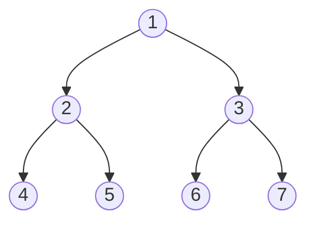

Γράψτε μια συνάρτηση `reverse_inorder` η οποία παίρνει ως όρισμα ένα δέντρο ακεραίων
τύπου `Tree` και τυπώνει τους αριθμούς των κόμβων σε σειρά reverse inorder traversal,
δηλαδή όπως βλέπουμε τους αριθμούς από δεξιά προς τα αριστερά (πρώτο το δεξί παιδί, μετά
ο γονιός και στην συνέχεια το αριστερό). Για παράδειγμα, για το ακόλουθο δέντρο:



*Σχήμα: το δέντρο του παραδείγματος.*

περιμένουμε να εκτυπωθεί η ακολουθία: 7 3 6 1 5 2 4. Ποια είναι η χρονική και η χωρική
πολυπλοκότητα του αλγορίθμου σας (8/25 της βαθμολογίας); Ο τύπος `Tree` δίνεται
παρακάτω:

```c
typedef struct node {
  int value;
  struct node * left;
  struct node * right;
} * Tree;
```

## Υπόδειξη

Ξεκινήστε από την αναδρομική inorder διάσχιση και αλλάξτε τη σειρά με την οποία
επισκέπτεστε τα δύο υποδέντρα. Μην ξεχάσετε τη βασική περίπτωση του κενού δέντρου
(`NULL`). Για τη χωρική πολυπλοκότητα, σκεφτείτε πόσο βαθιά μπορεί να φτάσει η στοίβα
των αναδρομικών κλήσεων στη χειρότερη περίπτωση.
