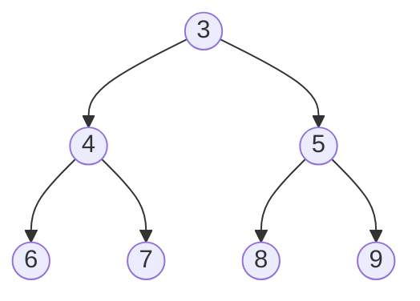

**Αθροιστής Δέντρων - sumtree [20 Μονάδες]**

Γράψτε μια συνάρτηση `sumtree` η οποία παίρνει ως όρισμα ένα δέντρο ακεραίων τύπου
`Tree` και επιστρέφει το άθροισμα όλων των κόμβων του δέντρου. Για παράδειγμα, για το
ακόλουθο δέντρο:



*Σχήμα: το δέντρο του παραδείγματος.*

περιμένουμε να μας επιστρέψει την τιμή: 42 = 3 + 4 + 5 + 6 + 7 + 8 + 9. Ποια είναι η
χρονική και η χωρική πολυπλοκότητα του αλγορίθμου σας (6/20 της βαθμολογίας); Ο τύπος
`Tree` δίνεται παρακάτω:

```c
typedef struct node {
  int value;
  struct node * left;
  struct node * right;
} * Tree;
```

## Υπόδειξη

Το άθροισμα ενός δέντρου ορίζεται φυσικά αναδρομικά, μέσω των αθροισμάτων του αριστερού
και του δεξιού υποδέντρου. Ξεκινήστε από τη βασική περίπτωση του κενού δέντρου (`NULL`).
Για τη χωρική πολυπλοκότητα, σκεφτείτε το βάθος της στοίβας των αναδρομικών κλήσεων στη
χειρότερη περίπτωση (π.χ. ένα δέντρο σαν λίστα).
