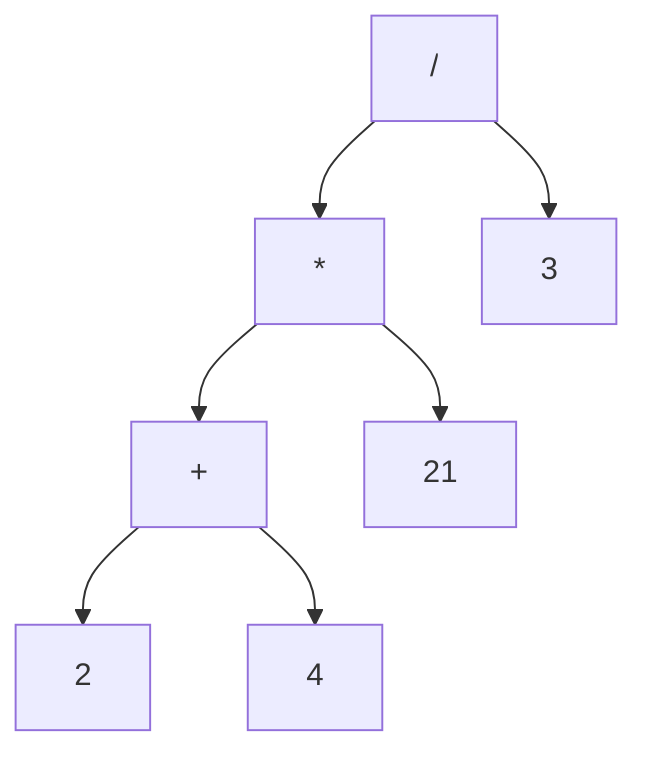

**Διερμηνέας Αριθμητικών Εκφράσεων - eval [25 Μονάδες]**

Γράψτε μια συνάρτηση `eval` η οποία παίρνει ως όρισμα ένα δέντρο ακεραίων εκφράσεων
τύπου `Expr` και επιστρέφει το αποτέλεσμα της αποτίμησης της έκφρασης. Για παράδειγμα,
για την έκφραση (2 + 4) * 21 / 3 το δέντρο έκφρασης δείχνει ως εξής:



και αν δοθεί στην συνάρτηση eval, περιμένουμε να μας επιστραφεί η τιμή: 42 = (2 + 4) * 21 / 3.

1. Ποια είναι η χρονική και η χωρική πολυπλοκότητα του αλγορίθμου σας; (8/25)
2. Ποιον αλγόριθμο διάσχισης επιλέξατε και γιατί; (2/25)

Ο ορισμός του τύπου `Expr` δίνεται παρακάτω:

```c
typedef enum {
  VALUE,  // current node is an integer value
  ADD,    // current node is addition of two nodes
  SUB,    // current node is subtraction of left minus right
  MUL,    // current node is the multiplication of two nodes
  DIV     // current node is the division of left by right
} exp_type;

typedef struct node {
  exp_type type;
  int value;
  struct node * left;
  struct node * right;
} * Expr;
```

## Υπόδειξη

Η φυσική λύση είναι αναδρομική: ένας κόμβος `VALUE` είναι η βάση της αναδρομής, ενώ
για έναν τελεστή πρέπει πρώτα να ξέρετε τις τιμές *και των δύο* παιδιών· ποια διάσχιση
(preorder, inorder, postorder) αντιστοιχεί σε αυτή τη σειρά; Ένα `switch` στο `type`
ταιριάζει καλά. Για την πολυπλοκότητα σκεφτείτε πόσες φορές επισκέπτεστε κάθε κόμβο και
πόσο βαθιά μπορεί να φτάσει η στοίβα κλήσεων· μην ξεχάσετε τη διαίρεση με το μηδέν και
τον δείκτη `NULL`.
