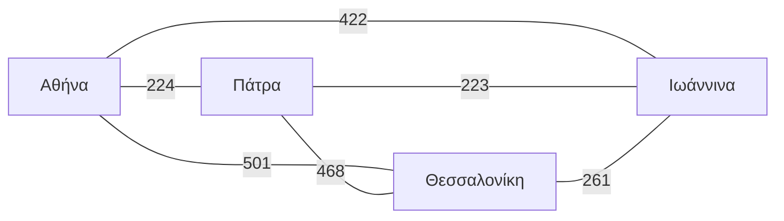

**Το Καλύτερο GPS (jabbamaps - 50 Μονάδες)**

Πολλές εφαρμογές (όπως το Google Maps) σου επιτρέπουν να προσθέσεις πολλές στάσεις στη
διαδρομή σου, αλλά δεν σου προτείνουν να τις αναδιατάξεις ακόμη και αν αυτό σου
γλύτωνε χρόνο. Έχει σημασία με ποια σειρά θα καλύψουμε αυτές τις στάσεις; Αυτό θα
είναι το πρόβλημα με το οποίο θα ασχοληθούμε σε αυτήν την άσκηση.

Ας δούμε μια απλοποιημένη εκδοχή του προβλήματός μας για 4 στάσεις. Έστω ότι θέλουμε
να κάνουμε τον γύρο τις Ελλάδας και συγκεκριμένα να καλύψουμε τέσσερις πόλεις: Αθήνα,
Θεσσαλονίκη, Γιάννενα και Πάτρα. Από κάθε πόλη μπορούμε να κινηθούμε προς οποιαδήποτε
άλλη, αλλά κάθε κίνησή μας έχει ένα κόστος (έστω χιλιομετρικό). Για παράδειγμα, για να
πάμε από την Αθήνα στην Θεσσαλονίκη έχουμε κόστος 501, ενώ για να πάμε στην Πάτρα
έχουμε κόστος 224. Θεωρούμε ότι η κατεύθυνση δεν έχει σημασία και το χιλιομετρικό
κόστος είναι το ίδιο ανεξαρτήτως κατεύθυνσης.



*Σχήμα: Από κάθε πόλη μπορείς να αποφασίσεις να κινηθείς σε οποιαδήποτε άλλη πόλη με κάποιο χιλιομετρικό κόστος. Ποια είναι η πιο αποδοτική (από απόψεως κόστους) σειρά με την οποία μπορείς να τις επισκεφτείς;*

Έστω ότι ξεκινάμε από την Αθήνα (η πόλη από την οποία ξεκινάμε δεν έχει σημασία, καθώς
πρέπει να επισκεφτούμε όλες τις πόλεις), έχουμε 3 διαφορετικές επιλογές για την πόλη
που θα επισκεφτούμε στην συνέχεια. Προσέξτε ότι οποιαδήποτε πόλη επιλέξουμε έχει
συνέπειες και για τις επόμενες επιλογές μας. Ποιο είναι το μονοπάτι με το ελάχιστο
κόστος; Αν επιλέξω να κάνω το Αθήνα → Θεσσαλονίκη → Ιωάννινα → Πάτρα θα χρειαστώ
501 + 261 + 223 = 985 χιλιόμετρα. Αντίθετα, αν πάω Αθήνα → Πάτρα → Ιωάννινα →
Θεσσαλονίκη χρειάζομαι 224 + 223 + 261 = 708 χιλιόμετρα. Με μια αλλαγή στην σειρά
επίσκεψης γλύτωσα 277 χιλιόμετρα! Είναι όμως αυτή η βέλτιστη επιλογή; Πόσες δυνατές
διαφορετικές διατάξεις υπάρχουν στην σειρά με την οποία μπορώ να επισκεφτώ τις πόλεις;

Το πρόβλημα στο οποίο πρέπει να αποφασίσουμε με ποια σειρά θα επισκεφτούμε μια σειρά
πόλεων λέγεται *Travelling Salesman Problem*, ελληνιστί το πρόβλημα του πλανόδιου
πωλητή. Φτάσαμε επομένως στο ζητούμενο αυτής της άσκησης: να γράψετε ένα πρόγραμμα το
οποίο θα διαβάζει έναν χάρτη με τις αποστάσεις όλων των ζευγών πόλεων που θέλουμε να
επισκεφτούμε και θα μας υπολογίζει το μονοπάτι ελαχίστου κόστους, εύκολα, γρήγορα και
πάνω απ’όλα τζάμπα!

### Τεχνικές Προδιαγραφές

- Repository Name: progintro/hw2-\<YourUsername\>
- C Filepath: jabbamaps/src/jabbamaps.c
- Το πρόγραμμά θα πρέπει να παίρνει ακριβώς ένα όρισμα, το όνομα του αρχείου που
  περιέχει τα δεδομένα του χάρτη. Αν το πρόγραμμα εκτελεστεί με ορίσματα που δεν
  ακολουθούν τις παραπάνω προδιαγραφές, πρέπει να εκτυπώσει αντίστοιχο μήνυμα όπως στα
  παρακάτω παραδείγματα και να επιστρέφει με κωδικό εξόδου (exit code) 1.
- Το αρχείο με τα δεδομένα του χάρτη θα έχει σε κάθε γραμμή του ένα ζεύγος πόλεων και
  στην συνέχεια την απόστασή τους. Συγκεκριμένα, κάθε γραμμή θα είναι της μορφής
  `city1-city2: distance`, όπου city1 και city2 είναι το ζεύγος των πόλεων και
  distance είναι η απόστασή τους. Τα ονόματα των πόλεων δεν θα έχουν τους χαρακτήρες
  ’-’ ή ’:’ και η απόστασή τους θα είναι πάντα ένας ακέραιος αριθμός.
- Η πρώτη πόλη που θα διαβάσουμε στον χάρτη θέλουμε να είναι η πόλη από την οποία θα
  ξεκινήσουμε την διαδρομή μας. Το συνολικό κόστος δεν θα πρέπει να περιλαμβάνει το
  κόστος επιστροφής στην αρχική μας πόλη.
- Οι αποστάσεις των πόλεων δεν θα υπερβαίνουν το $2^{31}$.
- Οι πόλεις που θα πρέπει να επισκεφτούμε δεν θα είναι πάνω από 64.
- Το μόνοπάτι σας πρέπει να επισκεφτεί *κάθε* πόλη *ακριβώς* μία φορά.
- Το αρχείο C που θα υποβληθεί πρέπει να μεταγλωττίζεται χωρίς ειδοποιήσεις για λάθη
  και με κωδικό επιστροφής (exit code) που να είναι 0. Συγκεκριμένα, το αρχείο σας
  **πρέπει** να μπορεί να μεταγλωττιστεί επιτυχώς με την ακόλουθη εντολή σε ένα από τα
  μηχανήματα του εργαστηρίου (linuxXY.di.uoa.gr):
  `gcc -m32 -Ofast -Wall -Wextra -Werror -pedantic -o jabbamaps jabbamaps.c`
- README Filepath: jabbamaps/README.md
- Πρέπει να ολοκληρώνει την εκτέλεση μέσα σε: 30 δευτερόλεπτα.

Ενδεικτικές εκτελέσεις ακολουθούν σε κάποιους από τους χάρτες που υπάρχουν στο
<https://github.com/progintro/data>:

```text
$ cat map4.txt
Athens-Thessaloniki: 501
Athens-Ioannina: 422
Athens-Patras: 224
Patras-Thessaloniki: 468
Patras-Ioannina: 223
Thessaloniki-Ioannina: 261
$ ./jabbamaps map4.txt
We will visit the cities in the following order:
Athens -(224)-> Patras -(223)-> Ioannina -(261)-> Thessaloniki
Total cost: 708
$ ./jabbamaps map7.txt
We will visit the cities in the following order:
Athens -(211)-> Amfissa -(122)-> Patras -(223)-> Ioannina -(128)->
  Trikala -(123)-> Volos -(211)-> Thessaloniki
Total cost: 1018
```

Ιδανικά, επιθυμούμε το πρόγραμμά μας να δουλεύει και για μεγαλύτερους χάρτες, όσο
ασυνήθιστα και να είναι τα ονόματα των πόλεων ή οι αποστάσεις μεταξύ τους. Για
παράδειγμα:

```text
$ ./jabbamaps tatooine.txt
We will visit the cities in the following order:
Republic City -(65)-> Aldera -(124)-> Anchorhead -(44)-> Lessu -(45)->
  Mos Pelgo -(32)-> Canto Bight -(65)-> Mos Espa -(80)-> Coronet City -(53)->
  Hanna City -(50)-> Sern Prime -(62)-> NiJedha -(20)-> Kachirho -(66)->
  Tipoca City -(141)-> Sundari -(51)-> Galactic City -(29)->
  Capital City (Lothal City) -(157)-> Mos Eisley -(317)-> Stalgasin Hive -(26)->
  Coral City -(25)-> Otoh Gunga -(13)-> Theed -(18)-> Cloud City -(136)-> Eriadu City
Total cost: 1619
```

Όσο περισσότερες οι πόλεις, τόσοι περισσότεροι οι συνδυασμοί που πρέπει να εξετάσουμε
και το πρόβλημα πλέον δεν είναι εύκολο να επιβεβαιωθεί "με το μάτι". Είναι η λύση που
βρήκαμε η βέλτιστη ή μήπως υπάρχει καλύτερη;

Ως συνήθως, υπενθυμίζουμε πως στο αρχείο README.md πρέπει να προσθέσετε οποιεσδήποτε
παρατηρήσεις σας κατά την διεκπεραίωση της άσκησης. Ο κώδικας απαιτείται να είναι καλά
τεκμηριωμένος με σχόλια καθώς αυτό θα είναι μέρος της βαθμολόγησης.

## Υπόδειξη

Πρώτα μετατρέψτε το αρχείο σε πίνακα αποστάσεων: κάθε νέο όνομα πόλης παίρνει έναν
αριθμό (προσοχή, τα ονόματα έχουν κενά και παρενθέσεις), και η απόσταση μπαίνει στο
`dist[i][j]` και στο `dist[j][i]`. Η δοκιμή όλων των $(n-1)!$ διατάξεων σβήνει ήδη
γύρω στις 12 πόλεις· για περισσότερες σκεφτείτε δυναμικό προγραμματισμό πάνω σε
υποσύνολα (bitmask, αλγόριθμος Held-Karp), που όμως για 64 πόλεις δεν χωρά ούτε σε
μνήμη ούτε σε χρόνο, οπότε εκεί χρειάζεστε ευριστικές μεθόδους (nearest neighbour,
2-opt). Με `-m32`, κρατήστε το συνολικό κόστος σε τύπο 64 bits.
