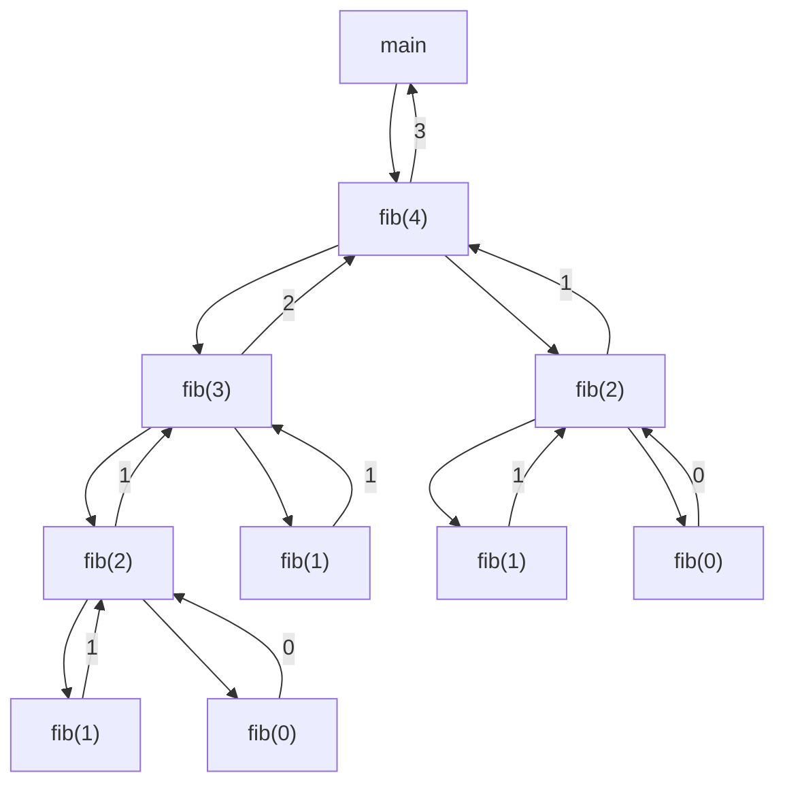

Η ακολουθία Fibonacci είναι από τις
[πιο διάσημες μαθηματικές ακολουθίες](https://en.wikipedia.org/wiki/Fibonacci_sequence).
Ο αναδρομικός ορισμός της συνάρτησης είναι ιδιαίτερα απλός:

$$fib(n) = \begin{cases} 0 & \text{if } n = 0, \\ 1 & \text{if } n = 1, \\ fib(n-1) + fib(n-2) & \text{if } n \geq 2. \end{cases}$$

και προκύπτει η ακολουθία (συνδέεται και με την
[χρυσή τομή](https://en.wikipedia.org/wiki/Golden_ratio)):

```text
0, 1, 1, 2, 3, 5, 8, 13, 21, 34, 55, 89, 144, ...
```

Σε αυτήν την άσκηση θα υλοποιήσετε ένα πρόγραμμα `fib.c` που υπολογίζει τον n-οστό
αριθμό της ακολουθίας Fibonacci.

**2.1** Ορίστε την αναδρομική συνάρτηση `int fib(int n)` που να υλοποιεί τον υπολογισμό
του n-οστού όρου της ακολουθίας Fibonacci.

**2.2** Μετατρέψτε το πρόγραμμά σας έτσι ώστε να δέχεται από τον χρήστη το πόσους
αριθμούς Fibonacci θέλει να εκτυπωθούν και στην συνέχεια θα καλεί την συνάρτηση `fib`
για να εκτυπώσει τον κάθε όρο. Παράδειγμα εκτέλεσης ακολουθεί:

```text
$ ./fib
How many fibonacci terms would you like: 35
fib(0) = 0
fib(1) = 1
fib(2) = 1
fib(3) = 2
fib(4) = 3
fib(5) = 5
fib(6) = 8
fib(7) = 13
fib(8) = 21
fib(9) = 34
...
fib(31) = 1346269
fib(32) = 2178309
fib(33) = 3524578
fib(34) = 5702887
```

Τρέξτε το πρόγραμμά σας για περισσότερους όρους, για παράδειγμα 45. Τι παρατηρείτε;

**2.3** Μετρήστε τις αναδρομικές κλήσεις για κάθε εκτέλεση του παραπάνω προγράμματος
χρησιμοποιώντας μία καθολική (global) μεταβλητή. Εκτυπώστε το πλήθος των αναδρομικών
κλήσεων μετά από κάθε εκτέλεση.



*Σχήμα: το δένδρο αναδρομικών κλήσεων για `fib(4)`, με τις τιμές που επιστρέφει κάθε κλήση.*

**2.4** Παρατηρήστε το δένδρο αναδρομικών κλήσεων του προγράμματος για n=4 και εξηγήστε
την αύξηση του χρόνου υπολογισμού του προγράμματος σε σχέση με τον όρο που υπολογίζεται.

**2.5** Ο n-οστός όρος της ακολουθίας Fibonacci μπορεί να υπολογισθεί και επαναληπτικά,
αν χρησιμοποιήσουμε δύο μεταβλητές για να αποθηκεύουμε σε κάθε βήμα τους δύο
προηγούμενους αριθμούς, ώστε προσθέτοντας τους, να υπολογίζουμε τον επόμενο. Γράψτε μια
συνάρτηση `int fib_it(int n)` η οποία να υπολογίζει τον n-οστό όρο της ακολουθίας
Fibonacci ακολουθώντας την παραπάνω επαναληπτική διαδικασία. Μετατρέψτε το πρόγραμμά σας
ώστε να χρησιμοποιεί την επαναληπτική διαδικασία και ξανατρέξτε το παραπάνω πείραμα. Τι
παρατηρείτε;

**2.6 (Προχωρημένο, Προαιρετικό)** Μπορείτε να υπολογίσετε τον n-οστό όρο Fibonacci
αναδρομικά με απόδοση κοντά στον επαναληπτικό αλγόριθμο; Αν ναι, υλοποιήστε την λύση σας
σε μια συνάρτηση `fib_rec_fast` και μετατρέψτε το πρόγραμμά σας ώστε να χρησιμοποιεί την
συνάρτηση `fib_rec_fast`.

## Υπόδειξη

Στο δένδρο κλήσεων, πόσες φορές υπολογίζεται το `fib(2)`; Το ίδιο συμβαίνει σε κάθε
επίπεδο, γι' αυτό το πλήθος των κλήσεων μεγαλώνει εκθετικά με το `n`. Ο μετρητής της 2.3
είναι μια μεταβλητή δηλωμένη έξω από κάθε συνάρτηση, που αυξάνεται στην αρχή της `fib`.
Για το 2.6, σκεφτείτε μια αναδρομική συνάρτηση που «κουβαλά» τους δύο τελευταίους όρους
ως ορίσματα, ή που θυμάται όσα έχει ήδη υπολογίσει.
