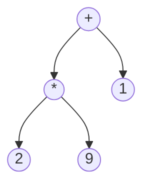

Θέλω να γράψω έναν αποτιμητή εκφράσεων (calculator / evaluator / interpreter). Ποια
διάσχιση θα χρησιμοποιήσω;

Το δέντρο της διαφάνειας έχει ρίζα `+`· το αριστερό παιδί του είναι `*` (με παιδιά `2`
και `9`) και το δεξί είναι `1`.

## Υπόδειξη

Για να υπολογίσετε τον τελεστή ενός κόμβου χρειάζεστε ήδη τις τιμές των δύο υποδέντρων του. Ποια από τις τρεις διασχίσεις (pre-order, in-order, post-order) επεξεργάζεται τον κόμβο αφού έχει τελειώσει με τα παιδιά του;
