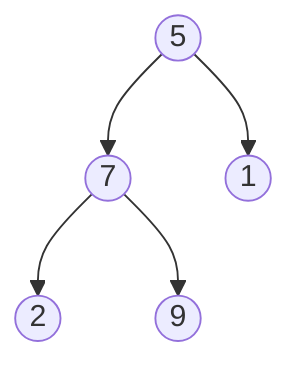

Δίνεται το δέντρο με ρίζα το 5· τα παιδιά του 5 είναι το 7 (αριστερά) και το 1 (δεξιά),
και τα παιδιά του 7 είναι το 2 (αριστερά) και το 9 (δεξιά).



Τι τυπώνει καθεμία από τις παρακάτω εκδοχές της `print` όταν καλείται με τη ρίζα;

```c
void print(Tree t) {       /* Pre-order */
  if (t == NULL) return;
  printf("%d ", t->value);
  print(t->left);
  print(t->right);
}
```

```c
void print(Tree t) {       /* In-order */
  if (t == NULL) return;
  print(t->left);
  printf("%d ", t->value);
  print(t->right);
}
```

```c
void print(Tree t) {       /* Post-order */
  if (t == NULL) return;
  print(t->left);
  print(t->right);
  printf("%d ", t->value);
}
```

## Υπόδειξη

Εφαρμόστε τον ορισμό αναδρομικά, ξεκινώντας από τη ρίζα: η διάσχιση του 5 αποτελείται από τη διάσχιση του υποδέντρου του 7, τη διάσχιση του υποδέντρου του 1 και το ίδιο το 5, με τη σειρά που ορίζει η θέση του `printf`.
